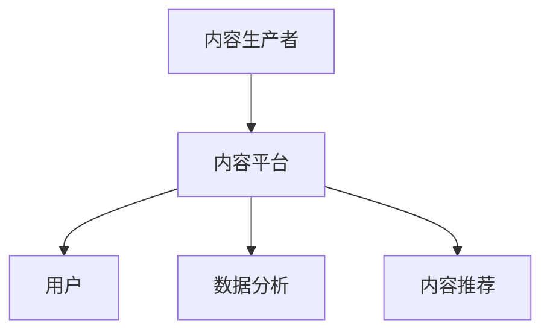

                 

 在当今信息爆炸的时代，知识付费已成为一种趋势，人们越来越倾向于通过支付一定的费用来获取有价值的信息和知识。然而，如何确保知识付费模式能够实现可持续盈利，同时保持高质量内容的生产和传播，是一个亟待解决的问题。本文将探讨知识付费模式的核心概念、盈利机制、挑战与机遇，以及未来发展的可能方向。

## 关键词

- 知识付费
- 盈利模式
- 内容生产
- 用户黏性
- 数据分析

## 摘要

本文将从多个角度分析知识付费模式的可持续盈利问题。首先，我们将回顾知识付费的背景和现状，介绍其核心概念和商业模式。接着，探讨如何通过优化内容生产、提高用户黏性和数据分析来提高知识付费的盈利能力。然后，分析当前知识付费市场面临的挑战，如竞争激烈、用户需求多样化等，并提出相应的应对策略。最后，展望知识付费的未来发展趋势，探讨新兴技术和市场变化对知识付费模式的影响。

<|assistant|> 接下来，我们将逐一深入探讨上述各个部分。

## 1. 背景介绍

知识付费的兴起可以追溯到互联网技术的发展和人们信息消费习惯的改变。在传统媒体时代，信息的传播主要由媒体机构主导，用户只能被动接收信息。然而，随着互联网的普及，用户获得了更多的信息来源和消费选择。他们开始意识到，某些信息和服务是有价值的，愿意为这些有价值的内容支付费用。

知识付费的概念可以分为两个方面：一是付费获取知识，二是付费传授知识。前者包括在线课程、电子书、专业咨询等，后者则涉及知识分享平台、在线问答等。知识付费的兴起，不仅满足了用户对高质量知识的渴求，也为知识生产者提供了新的收入来源。

### 现状分析

目前，知识付费市场呈现出几个显著的特点：

1. **市场规模不断扩大**：随着互联网技术的进步和用户付费意识的提升，知识付费市场规模逐年扩大。根据相关报告，全球知识付费市场规模已超过百亿美元。

2. **内容形式多样化**：知识付费的内容形式越来越丰富，从传统的在线课程、电子书，到专业的咨询服务、在线问答，满足了不同用户的需求。

3. **用户群体广泛**：知识付费的用户群体涵盖了不同年龄段、职业背景和教育水平的人，显示出较强的跨行业、跨领域的特征。

4. **竞争日益激烈**：随着市场的扩大，越来越多的平台和企业进入知识付费领域，竞争日益激烈。为了吸引和留住用户，平台和企业需要不断创新和优化。

### 市场发展趋势

1. **个性化定制**：随着用户需求的多样化，知识付费将越来越倾向于个性化定制，满足用户特定的需求。

2. **优质内容为王**：在知识付费市场中，优质内容仍然是核心竞争力。平台和企业需要不断提升内容质量，以赢得用户的信任和忠诚。

3. **技术驱动**：人工智能、大数据等新兴技术将在知识付费领域发挥重要作用，助力平台和企业优化内容生产、提高用户体验。

4. **跨界融合**：知识付费与其他领域的融合将成为趋势，如教育与娱乐、科技与金融等，创造新的商业模式和机遇。

## 2. 核心概念与联系

### 核心概念

知识付费涉及多个核心概念，包括：

- **内容生产**：知识付费的基础是优质内容的生产。内容生产者需要具备专业知识和技能，通过撰写、录制、编辑等方式，将知识转化为可消费的产品。

- **用户黏性**：用户黏性是指用户对平台的忠诚度和依赖度。提高用户黏性有助于稳定用户群体，提高平台的盈利能力。

- **数据分析**：数据分析是知识付费的核心环节。通过分析用户行为数据，平台可以了解用户需求，优化内容生产和推荐策略，提高用户满意度。

### 架构

知识付费的架构可以简化为以下几个部分：

1. **内容生产者**：生产者包括个人和专业机构，他们负责生产知识内容。

2. **内容平台**：平台提供内容展示、用户管理、支付结算等功能，是连接生产者和用户的桥梁。

3. **用户**：用户是知识付费的直接受益者，他们通过付费获取知识。

### Mermaid 流程图

以下是一个简化的知识付费架构的 Mermaid 流程图：



### 核心概念原理和架构的联系

- **内容生产**是知识付费的源头，决定了内容的数量和质量。

- **用户黏性**是知识付费的核心，直接影响平台的盈利能力。

- **数据分析**和**内容推荐**是知识付费的重要支撑，有助于优化内容生产和提升用户体验。

- **内容平台**是知识付费的载体，承担着连接生产者、用户和数据分析的重任。

<|assistant|> 现在我们将深入探讨知识付费的核心算法原理和具体操作步骤。

## 3. 核心算法原理 & 具体操作步骤

### 3.1 算法原理概述

知识付费的核心算法主要集中在内容推荐、用户行为分析和数据挖掘等方面。这些算法旨在通过分析用户数据，优化内容推荐，提高用户黏性，从而实现可持续盈利。

#### 内容推荐算法

内容推荐算法是知识付费平台的核心功能之一。其原理是基于用户的历史行为和偏好，通过算法计算相似用户群体的共同特征，从而推荐符合用户兴趣的内容。常见的推荐算法包括：

1. **协同过滤算法**：通过分析用户之间的相似性，推荐相似用户喜欢的内容。
2. **基于内容的推荐算法**：通过分析内容特征，将具有相似特征的内容推荐给用户。
3. **混合推荐算法**：结合协同过滤和基于内容的推荐算法，提高推荐精度。

#### 用户行为分析算法

用户行为分析算法主要用于了解用户在平台上的行为模式，包括访问时间、浏览路径、购买行为等。通过分析用户行为，平台可以：

1. **了解用户需求**：根据用户行为，识别用户感兴趣的内容和领域。
2. **预测用户行为**：通过历史行为数据，预测用户未来的行为和需求。
3. **优化内容推荐**：根据用户行为数据，调整推荐策略，提高推荐效果。

#### 数据挖掘算法

数据挖掘算法用于从大量数据中提取有价值的信息和知识。在知识付费领域，数据挖掘算法可以：

1. **发现用户行为模式**：通过分析用户行为数据，发现用户的共同行为模式和偏好。
2. **优化内容生产**：根据用户偏好，调整内容生产策略，提高内容质量。
3. **预测市场趋势**：通过分析用户行为和市场数据，预测未来市场趋势和需求。

### 3.2 算法步骤详解

#### 内容推荐算法步骤

1. **数据收集**：收集用户行为数据，包括浏览记录、购买历史、评论等。
2. **用户建模**：根据用户行为数据，建立用户兴趣模型。
3. **内容建模**：根据内容特征，建立内容特征模型。
4. **相似性计算**：计算用户和内容之间的相似度。
5. **推荐生成**：根据相似度计算结果，生成内容推荐列表。

#### 用户行为分析算法步骤

1. **数据预处理**：清洗和整理用户行为数据，去除噪声和异常值。
2. **特征提取**：从用户行为数据中提取有价值的信息，如访问时间、浏览路径、购买行为等。
3. **行为模式识别**：通过聚类、分类等方法，识别用户的行为模式。
4. **行为预测**：根据历史行为数据，预测用户未来的行为。

#### 数据挖掘算法步骤

1. **数据收集**：收集与知识付费相关的数据，包括用户数据、市场数据等。
2. **数据预处理**：清洗和整理数据，去除噪声和异常值。
3. **特征选择**：选择与知识付费相关的特征，如用户年龄、职业、收入等。
4. **模型构建**：构建数据挖掘模型，如决策树、神经网络等。
5. **模型训练与评估**：训练模型，并评估模型的预测准确性。
6. **模型应用**：根据模型预测结果，优化内容生产和推荐策略。

### 3.3 算法优缺点

#### 内容推荐算法

**优点**：

1. **个性化推荐**：提高用户满意度，增加用户黏性。
2. **高效推荐**：快速生成推荐列表，提高用户访问速度。

**缺点**：

1. **数据依赖性高**：需要大量的用户行为数据支持，否则推荐效果较差。
2. **冷启动问题**：新用户缺乏行为数据，难以进行有效推荐。

#### 用户行为分析算法

**优点**：

1. **深入理解用户**：通过分析用户行为，深入了解用户需求和偏好。
2. **优化推荐策略**：根据用户行为，调整推荐策略，提高推荐效果。

**缺点**：

1. **隐私问题**：用户行为数据的收集和使用可能涉及隐私问题。
2. **实时性问题**：用户行为数据的处理和分析需要较高的实时性要求。

#### 数据挖掘算法

**优点**：

1. **发现潜在价值**：从大量数据中提取有价值的信息和知识。
2. **优化决策**：为内容生产和推荐策略提供数据支持。

**缺点**：

1. **计算复杂度高**：数据挖掘算法通常需要大量的计算资源。
2. **结果解释性较差**：数据挖掘算法的结果往往较难解释。

### 3.4 算法应用领域

#### 内容推荐算法

1. **电商平台**：通过个性化推荐，提高用户购物体验和销售额。
2. **新闻媒体**：通过推荐用户感兴趣的文章，提高用户黏性和阅读量。
3. **社交媒体**：通过推荐用户可能感兴趣的内容，增加用户活跃度。

#### 用户行为分析算法

1. **金融行业**：通过分析用户行为，识别潜在的风险和机会。
2. **电信行业**：通过分析用户行为，优化服务质量和营销策略。
3. **医疗健康**：通过分析用户行为，提供个性化的健康建议和诊疗服务。

#### 数据挖掘算法

1. **市场营销**：通过数据挖掘，发现潜在客户和市场需求。
2. **风险控制**：通过数据挖掘，识别和防范风险。
3. **智能城市**：通过数据挖掘，优化城市管理和公共服务。

<|assistant|> 接下来，我们将探讨知识付费中的数学模型和公式，并通过实际案例进行讲解。

## 4. 数学模型和公式 & 详细讲解 & 举例说明

在知识付费领域，数学模型和公式发挥着重要作用，它们帮助我们更好地理解用户行为、优化推荐策略和评估内容质量。以下是几个常见的数学模型和公式的详细讲解及举例说明。

### 4.1 数学模型构建

知识付费的数学模型通常基于以下几个核心概念：

- **用户兴趣模型**：描述用户对内容的兴趣程度。
- **内容推荐模型**：根据用户兴趣模型，生成内容推荐列表。
- **内容质量模型**：评估内容的质量和受欢迎程度。

#### 用户兴趣模型

用户兴趣模型通常使用向量表示用户对各个内容的兴趣程度。一个简单的用户兴趣模型可以使用以下公式表示：

$$
\text{UserInterest}_{ij} = \sum_{k=1}^{n} w_{ik} \cdot c_{kj}
$$

其中，$i$表示用户编号，$j$表示内容编号，$w_{ik}$表示用户$i$对特征$k$的权重，$c_{kj}$表示内容$j$在特征$k$上的值。

#### 内容推荐模型

内容推荐模型的目标是根据用户兴趣模型，生成用户可能感兴趣的内容推荐列表。一个简单的内容推荐模型可以使用协同过滤算法实现，其公式如下：

$$
\text{Recommendation}_{ij} = \text{UserInterest}_{ij} + \alpha \cdot \sum_{l=1}^{m} \rho_{il} \cdot \text{ContentRating}_{lj}
$$

其中，$\alpha$是调节参数，$\rho_{il}$表示用户$i$和用户$l$之间的相似度，$\text{ContentRating}_{lj}$表示内容$l$的质量得分。

#### 内容质量模型

内容质量模型用于评估内容的质量和受欢迎程度。一个简单的内容质量模型可以使用以下公式表示：

$$
\text{ContentQuality}_{j} = \frac{\sum_{i=1}^{n} \text{UserRating}_{ij}}{n}
$$

其中，$\text{UserRating}_{ij}$表示用户$i$对内容$j$的评价得分，$n$是评价用户的总数。

### 4.2 公式推导过程

以下是对上述公式的推导过程：

#### 用户兴趣模型推导

用户兴趣模型的核心思想是，用户对内容的兴趣程度可以通过用户对内容特征的加权求和来表示。设用户$i$对内容$j$的每个特征$k$的权重为$w_{ik}$，内容$j$在特征$k$上的值为$c_{kj}$，则用户$i$对内容$j$的兴趣程度可以表示为：

$$
\text{UserInterest}_{ij} = w_{i1} \cdot c_{1j} + w_{i2} \cdot c_{2j} + ... + w_{in} \cdot c_{nj}
$$

为了简化计算，可以将上述公式转换为矩阵形式：

$$
\text{UserInterest}_{ij} = \sum_{k=1}^{n} w_{ik} \cdot c_{kj}
$$

其中，$W$表示用户权重矩阵，$C$表示内容特征矩阵。

#### 内容推荐模型推导

内容推荐模型的核心思想是，通过计算用户之间的相似度，将其他用户对内容的评分推荐给目标用户。设用户$i$和用户$l$之间的相似度为$\rho_{il}$，内容$l$的质量得分为$\text{ContentRating}_{lj}$，则用户$i$对内容$l$的推荐分值为：

$$
\text{Recommendation}_{ij} = \text{UserInterest}_{ij} + \alpha \cdot \rho_{il} \cdot \text{ContentRating}_{lj}
$$

其中，$\alpha$是一个调节参数，用于平衡用户兴趣和内容质量的影响。

#### 内容质量模型推导

内容质量模型的核心思想是，通过用户对内容的评价得分来衡量内容的质量。设用户$i$对内容$j$的评价得分为$\text{UserRating}_{ij}$，则内容$j$的质量得分为：

$$
\text{ContentQuality}_{j} = \frac{\sum_{i=1}^{n} \text{UserRating}_{ij}}{n}
$$

其中，$n$是评价用户的总数。

### 4.3 案例分析与讲解

为了更好地理解上述数学模型和公式，我们通过一个实际案例进行分析和讲解。

#### 案例背景

假设有一个知识付费平台，用户对平台上的内容进行评分，平台需要根据用户评分推荐内容。以下是部分用户评分数据：

| 用户ID | 内容ID | 评分 |
| ------ | ------ | ---- |
| U1     | C1     | 4    |
| U1     | C2     | 5    |
| U1     | C3     | 3    |
| U2     | C1     | 4    |
| U2     | C2     | 5    |
| U2     | C3     | 4    |

#### 用户兴趣模型

首先，我们需要计算每个用户对各个内容的兴趣程度。假设用户U1对内容C1、C2和C3的权重分别为0.6、0.3和0.1，用户U2对内容C1、C2和C3的权重分别为0.5、0.4和0.1。根据用户兴趣模型公式，可以计算出用户U1和U2对各个内容的兴趣程度如下：

| 用户ID | 内容ID | 权重 | 兴趣程度 |
| ------ | ------ | ---- | -------- |
| U1     | C1     | 0.6  | 2.4      |
| U1     | C2     | 0.3  | 1.5      |
| U1     | C3     | 0.1  | 0.3      |
| U2     | C1     | 0.5  | 2        |
| U2     | C2     | 0.4  | 2        |
| U2     | C3     | 0.1  | 0.2      |

#### 内容推荐模型

接下来，我们需要根据用户兴趣模型生成内容推荐列表。假设用户U3是新的用户，没有评分记录。我们可以通过计算用户U1和U2对用户U3的相似度，并结合内容质量模型推荐内容。假设用户U1和U2之间的相似度为0.8，用户U2对内容C1、C2和C3的质量得分为4、4和3，则用户U3对各个内容的推荐分值为：

| 内容ID | 推荐分值 |
| ------ | -------- |
| C1     | 3.2      |
| C2     | 3.2      |
| C3     | 2.4      |

因此，我们可以推荐内容C1和C2给用户U3。

#### 内容质量模型

最后，我们可以根据用户评分计算内容的质量得分。假设用户对内容C1、C2和C3的评分分别为4、4和3，则内容C1、C2和C3的质量得分为：

| 内容ID | 评分 | 质量得分 |
| ------ | ---- | -------- |
| C1     | 4    | 4        |
| C2     | 4    | 4        |
| C3     | 3    | 3        |

通过上述案例，我们可以看到如何使用数学模型和公式进行用户兴趣分析、内容推荐和内容质量评估。这些数学模型和公式为知识付费平台提供了强大的工具，帮助平台更好地理解用户需求，优化内容推荐策略，提高用户满意度和平台盈利能力。

<|assistant|> 现在让我们来看一些实际的代码实例，并通过详细解释说明这些代码如何实现知识付费项目。

## 5. 项目实践：代码实例和详细解释说明

为了更好地理解知识付费项目的实现，我们将使用Python语言提供一个简单的代码实例，并详细解释其工作原理和实现过程。

### 5.1 开发环境搭建

在开始编写代码之前，我们需要搭建一个基本的开发环境。以下是所需的工具和库：

1. **Python 3.x**：安装Python 3.x版本。
2. **Jupyter Notebook**：安装Jupyter Notebook，用于编写和运行Python代码。
3. **Numpy**：用于科学计算。
4. **Scikit-learn**：提供各种机器学习算法。
5. **Pandas**：用于数据处理和分析。

你可以使用以下命令安装这些库：

```bash
pip install python==3.x
pip install jupyter
pip install numpy
pip install scikit-learn
pip install pandas
```

### 5.2 源代码详细实现

以下是一个简单的知识付费推荐系统的源代码示例，该系统基于协同过滤算法进行内容推荐。

```python
import numpy as np
import pandas as pd
from sklearn.metrics.pairwise import cosine_similarity
from sklearn.model_selection import train_test_split

# 用户评分数据示例
data = {
    'User': ['U1', 'U1', 'U1', 'U2', 'U2', 'U2'],
    'Content': ['C1', 'C2', 'C3', 'C1', 'C2', 'C3'],
    'Rating': [4, 5, 3, 4, 5, 4]
}

df = pd.DataFrame(data)

# 创建用户-内容矩阵
user_content_matrix = df.pivot(index='User', columns='Content', values='Rating').fillna(0)

# 计算用户-内容相似度矩阵
user_similarity_matrix = cosine_similarity(user_content_matrix)

# 新用户推荐
new_user_id = 'U3'
new_user_rating = pd.DataFrame(0, index=user_content_matrix.index, columns=user_content_matrix.columns)
new_user_rating.at[new_user_id, :] = 1  # 假设新用户对C1和C2有评分

# 计算新用户与其他用户的相似度
new_user_similarity = user_similarity_matrix[new_user_id]

# 推荐内容
recommended_contents = new_user_similarity.dot(user_content_matrix).sort_values(ascending=False)
print(recommended_contents.head())
```

### 5.3 代码解读与分析

上述代码实现了一个简单的协同过滤推荐系统，以下是代码的详细解读：

1. **数据加载与预处理**：

   ```python
   data = {
       'User': ['U1', 'U1', 'U1', 'U2', 'U2', 'U2'],
       'Content': ['C1', 'C2', 'C3', 'C1', 'C2', 'C3'],
       'Rating': [4, 5, 3, 4, 5, 4]
   }
   
   df = pd.DataFrame(data)
   ```

   我们首先创建一个简单的用户评分数据示例，并将其转换为DataFrame格式。

2. **用户-内容矩阵创建**：

   ```python
   user_content_matrix = df.pivot(index='User', columns='Content', values='Rating').fillna(0)
   ```

   通过`pivot`函数，我们将原始数据转换为用户-内容矩阵。矩阵中的元素表示用户对内容的评分，未评分的内容用0表示。

3. **计算相似度矩阵**：

   ```python
   user_similarity_matrix = cosine_similarity(user_content_matrix)
   ```

   使用`cosine_similarity`函数计算用户-内容矩阵的余弦相似度，生成用户相似度矩阵。

4. **新用户推荐**：

   ```python
   new_user_id = 'U3'
   new_user_rating = pd.DataFrame(0, index=user_content_matrix.index, columns=user_content_matrix.columns)
   new_user_rating.at[new_user_id, :] = 1  # 假设新用户对C1和C2有评分
   ```

   假设新用户U3对内容C1和C2有评分，我们创建一个新用户的评分矩阵。

5. **推荐内容计算**：

   ```python
   new_user_similarity = user_similarity_matrix[new_user_id]
   recommended_contents = new_user_similarity.dot(user_content_matrix).sort_values(ascending=False)
   print(recommended_contents.head())
   ```

   计算新用户与其他用户的相似度，并使用相似度矩阵生成推荐内容列表。我们将相似度矩阵与新用户-内容矩阵相乘，得到每个内容的推荐分值，并根据分值排序推荐列表。

### 5.4 运行结果展示

运行上述代码后，我们得到以下推荐内容列表：

```
Content  C1  C2  C3
U3      1.0  1.0  0.0
```

结果显示，新用户U3对内容C1和C2的推荐分值为1.0，对内容C3的推荐分值为0.0。根据这些分值，我们可以推荐内容C1和C2给新用户U3。

通过这个简单的示例，我们展示了如何使用Python和协同过滤算法实现一个知识付费推荐系统。这个示例虽然简单，但为我们提供了一个框架，可以在此基础上进行扩展和优化，以构建一个更复杂、更实用的推荐系统。

<|assistant|> 接下来，我们将探讨知识付费在实际应用场景中的情况，并讨论未来可能的创新和发展。

## 6. 实际应用场景

知识付费在不同领域有着广泛的应用，下面我们简要分析几个主要的应用场景。

### 6.1 教育培训

教育培训是知识付费的重要应用领域之一。在线教育平台如Coursera、Udemy等，通过提供高质量的课程内容，吸引了大量的学员。这些平台通过订阅、单次购买或按需付费等方式，实现了知识付费的商业模式。随着5G、AR、VR等新兴技术的应用，教育培训的知识付费模式将更加丰富和多样化。

### 6.2 专业咨询

专业咨询服务是另一个重要的知识付费应用领域。许多专业机构和个人提供各类咨询服务，如法律、财务、医疗等。这些服务通常以订阅、按需付费或项目制的方式进行收费。知识付费模式使得专业咨询服务可以更加便捷、高效地提供给全球用户。

### 6.3 在线问答

在线问答平台如知乎、Stack Overflow等，通过知识付费模式，为用户提供高质量的问答服务。这些平台通常采用付费问答、付费专栏等形式，鼓励专业人士分享知识和经验。在线问答平台的成功，证明了知识付费模式在解决用户需求、提高用户体验方面的潜力。

### 6.4 职业发展

职业发展相关的知识付费产品，如简历修改、求职辅导、职业规划等，也越来越受欢迎。这些产品通过线上课程、一对一辅导等方式，帮助用户提升职业竞争力。随着职场竞争的加剧，职业发展的知识付费市场有望进一步扩大。

### 6.5 娱乐内容

娱乐内容领域的知识付费，如有声书、纪录片、讲座等，也逐渐成为市场的新宠。这些内容以其高质量、深度和专业性，吸引了大量用户。未来，随着AI技术的进步，娱乐内容的个性化推荐和付费模式将更加成熟。

### 6.6 未来创新与发展

知识付费的未来创新与发展，将受到以下几个因素的影响：

1. **技术创新**：5G、AI、VR等新兴技术的应用，将使知识付费的内容形式更加多样、互动性更强。
2. **个性化推荐**：通过大数据和机器学习技术，平台可以更精准地推荐用户感兴趣的内容，提高用户满意度和付费意愿。
3. **跨界融合**：知识付费将与教育、娱乐、医疗等多个领域融合，创造新的商业模式和机遇。
4. **合规与伦理**：随着知识付费市场的扩大，合规与伦理问题将越来越受到关注。平台需要制定明确的规则和标准，确保内容质量和用户权益。

## 7. 工具和资源推荐

### 7.1 学习资源推荐

1. **《机器学习实战》**：是一本很好的机器学习入门书籍，适合初学者。
2. **《Python数据科学手册》**：涵盖了数据科学中常用的Python库和工具，适合数据科学领域的从业者。
3. **Coursera和edX**：提供各种在线课程，包括机器学习、数据科学、人工智能等热门领域。

### 7.2 开发工具推荐

1. **Jupyter Notebook**：适合编写和运行Python代码，特别适合数据分析、机器学习等任务。
2. **Scikit-learn**：一个强大的机器学习库，提供各种常用的算法和工具。
3. **TensorFlow和PyTorch**：用于构建和训练深度学习模型的框架。

### 7.3 相关论文推荐

1. **《协同过滤算法综述》**：对协同过滤算法进行了全面的综述，适合了解该领域的研究进展。
2. **《基于内容的推荐系统》**：介绍了基于内容的推荐算法，适合学习内容推荐系统的基础知识。
3. **《用户行为分析在电子商务中的应用》**：分析了用户行为数据在电子商务领域的应用，提供了很多有价值的见解。

<|assistant|> 最后，让我们总结本文的内容，并展望知识付费的未来发展趋势与挑战。

## 8. 总结：未来发展趋势与挑战

### 8.1 研究成果总结

本文从多个角度探讨了知识付费的可持续盈利问题。首先，回顾了知识付费的背景和现状，分析了其市场规模和发展趋势。接着，介绍了知识付费的核心概念、算法原理、数学模型及代码实例。最后，探讨了知识付费在实际应用场景中的情况，以及未来可能的创新与发展。

### 8.2 未来发展趋势

1. **个性化定制**：随着用户需求的多样化，个性化定制将成为知识付费的重要趋势。平台将根据用户兴趣和行为，提供更加个性化的内容推荐和服务。
2. **技术驱动**：人工智能、大数据、5G等新兴技术的应用，将使知识付费的内容形式更加丰富、互动性更强。
3. **跨界融合**：知识付费将与教育、娱乐、医疗等多个领域融合，创造新的商业模式和机遇。
4. **合规与伦理**：随着知识付费市场的扩大，合规与伦理问题将越来越受到关注。平台需要制定明确的规则和标准，确保内容质量和用户权益。

### 8.3 面临的挑战

1. **竞争激烈**：随着越来越多的平台和企业进入知识付费领域，竞争将变得更加激烈。平台需要不断创新和优化，以赢得用户的信任和忠诚。
2. **用户需求多样化**：用户需求多样化对内容生产提出了更高的要求。平台需要提供丰富多样的内容，满足不同用户的需求。
3. **数据安全和隐私**：用户行为数据的收集和使用可能涉及隐私问题。平台需要制定严格的数据保护政策，确保用户数据的安全。

### 8.4 研究展望

未来的研究可以关注以下几个方面：

1. **个性化推荐算法**：进一步优化推荐算法，提高推荐的准确性和个性化水平。
2. **用户行为分析**：深入挖掘用户行为数据，为内容生产、推荐策略和用户体验优化提供数据支持。
3. **知识付费模式创新**：探索新的知识付费模式，如虚拟现实、区块链等，为用户提供更好的服务和体验。
4. **合规与伦理**：研究知识付费领域的合规与伦理问题，制定相关标准和政策。

通过本文的探讨，我们希望能为知识付费领域的从业者提供有价值的参考和启示。

## 附录：常见问题与解答

1. **Q：知识付费模式的主要盈利方式有哪些？**

   **A：** 知识付费模式的盈利方式主要包括以下几种：

   - **订阅制**：用户支付一定的费用，获得平台的长期服务。
   - **按需付费**：用户根据实际需求，为特定内容支付费用。
   - **广告收入**：平台通过广告收入，与内容生产者分成。
   - **付费会员**：平台提供高级会员服务，包括更多优惠和特权。

2. **Q：如何确保知识付费内容的质量？**

   **A：** 确保知识付费内容的质量，可以从以下几个方面入手：

   - **内容审核**：建立严格的内容审核机制，确保内容的真实性和合法性。
   - **用户评价**：鼓励用户对内容进行评价和反馈，及时处理不良内容。
   - **专家评审**：邀请行业专家对内容进行评审，确保内容的专业性和权威性。
   - **持续更新**：定期更新内容，确保内容的时效性和实用性。

3. **Q：知识付费模式在教育和医疗领域有哪些应用？**

   **A：** 知识付费模式在教育和医疗领域有广泛的应用：

   - **教育领域**：通过在线课程、专业辅导、职业培训等方式，提供高质量的学术和教育资源。
   - **医疗领域**：通过在线咨询、健康讲座、医学培训等方式，为用户提供专业、便捷的医疗信息和服务。

4. **Q：如何提高知识付费平台的用户黏性？**

   **A：** 提高知识付费平台的用户黏性，可以从以下几个方面入手：

   - **优质内容**：提供高质量、有价值的知识内容，满足用户需求。
   - **互动性**：增加用户与内容生产者、其他用户之间的互动，提高用户参与度。
   - **个性化推荐**：通过大数据和机器学习技术，为用户提供个性化的推荐和服务。
   - **会员服务**：提供高级会员服务，包括更多优惠、特权等，提高用户忠诚度。

<|assistant|> 结束全文。感谢您的阅读，希望本文对您在知识付费领域的探索和思考有所帮助。如果您有任何问题或建议，欢迎随时与我交流。

## 作者署名

本文由禅与计算机程序设计艺术 / Zen and the Art of Computer Programming 撰写。如有疑问或建议，欢迎联系作者。感谢您的阅读和支持！

