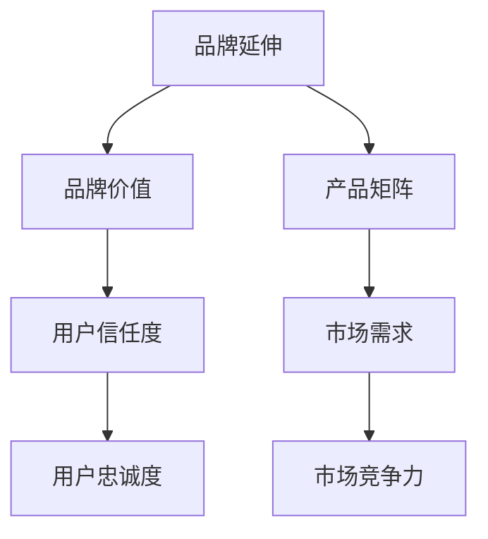

                 

关键词：知识付费、品牌延伸、产品矩阵、营销策略、用户粘性

摘要：随着知识付费时代的到来，品牌如何通过产品矩阵实现延伸，提升用户粘性和品牌影响力，成为各大平台和内容创作者关注的焦点。本文将探讨知识付费领域的品牌延伸策略，解析如何构建多样化的产品矩阵，并通过案例分析，为读者提供实用的操作指南。

## 1. 背景介绍

知识付费，作为一种新型商业模式，通过为用户提供有价值的信息、知识和技能，实现了从免费内容向付费内容的有效转变。近年来，随着互联网技术的发展和用户消费习惯的改变，知识付费市场呈现出爆发式增长。在这一背景下，品牌如何通过产品矩阵实现延伸，成为提升市场竞争力和用户满意度的重要课题。

### 知识付费市场现状
- 用户规模持续扩大：根据相关报告，知识付费用户规模逐年增加，预计未来仍将保持高速增长。
- 多样化的付费形式：从音频、视频、图文到线上课程、社群互动，付费形式日趋多样化。
- 行业监管日益严格：政策监管的加强，使得知识付费市场逐渐规范化，推动品牌向高质量内容发展。

### 品牌延伸的重要性
- 提升用户粘性：通过产品矩阵的多样化，可以满足不同用户的需求，提高用户对品牌的依赖度和忠诚度。
- 扩大市场份额：品牌延伸有助于开拓新的市场，增加市场份额，实现规模化经营。
- 提高品牌影响力：多样化的产品矩阵有助于树立品牌形象，提升品牌在用户心中的地位。

## 2. 核心概念与联系

### 品牌延伸的概念
品牌延伸（Brand Extension）是指企业将现有品牌用于新产品或新市场的战略。通过品牌延伸，企业可以在保持原有品牌价值的基础上，拓展新的业务领域，实现品牌价值的最大化。

### 产品矩阵的概念
产品矩阵（Product Matrix）是指企业针对不同市场、不同用户群体，推出一系列相互关联的产品，形成一个完整的产品体系。产品矩阵有助于企业实现产品多样化，提高市场竞争力。

### 品牌延伸与产品矩阵的联系
品牌延伸和产品矩阵之间存在着密切的联系。品牌延伸为产品矩阵提供了品牌背书，增强了用户对产品的信任度和忠诚度；而产品矩阵则为品牌延伸提供了丰富的产品线和市场需求，有助于品牌价值的进一步拓展。

### Mermaid 流程图



## 3. 核心算法原理 & 具体操作步骤

### 3.1 算法原理概述

品牌延伸与产品矩阵的实现，主要依赖于以下核心算法原理：

1. **用户画像分析**：通过大数据分析和机器学习技术，对用户行为、偏好和需求进行深入挖掘，构建用户画像。
2. **产品分类与定位**：根据用户画像，对现有产品进行分类与定位，明确产品矩阵中的不同产品线。
3. **品牌延伸策略**：结合品牌价值和市场需求，制定相应的品牌延伸策略，实现产品矩阵的多样化。
4. **用户反馈机制**：通过用户反馈，不断优化产品矩阵，提高用户满意度和忠诚度。

### 3.2 算法步骤详解

1. **用户画像分析**
   - 数据收集：收集用户行为数据、消费记录等。
   - 数据处理：对收集到的数据进行分析和清洗，去除噪音数据。
   - 用户画像构建：利用机器学习算法，构建用户画像。

2. **产品分类与定位**
   - 产品梳理：对所有产品进行梳理，明确产品功能和特点。
   - 用户需求分析：根据用户画像，分析用户对各类产品的需求。
   - 产品分类：根据用户需求，将产品分为不同类别。
   - 产品定位：明确每个产品类别的市场定位。

3. **品牌延伸策略**
   - 品牌价值分析：评估现有品牌的知名度和美誉度。
   - 市场需求分析：分析目标市场的需求和趋势。
   - 品牌延伸方案：制定品牌延伸方案，明确新产品线和市场定位。

4. **用户反馈机制**
   - 用户反馈收集：通过用户调研、问卷调查等方式，收集用户对产品的反馈。
   - 数据分析：对用户反馈进行统计和分析，找出用户不满意的方面。
   - 产品优化：根据用户反馈，优化产品功能和体验。
   - 用户满意度评估：通过用户满意度调查，评估产品优化的效果。

### 3.3 算法优缺点

**优点：**
- 提高用户满意度：通过用户画像分析和用户反馈机制，可以更精准地满足用户需求，提高用户满意度。
- 提高品牌竞争力：多样化的产品矩阵有助于提升品牌在市场中的竞争力。
- 实现品牌延伸：通过品牌延伸策略，可以实现品牌价值的最大化。

**缺点：**
- 数据安全风险：用户画像分析和数据处理过程中，可能存在数据安全风险。
- 成本较高：构建用户画像和产品矩阵需要投入大量的人力、物力和财力。

### 3.4 算法应用领域

品牌延伸与产品矩阵算法主要应用于以下领域：

- 知识付费平台：通过对用户需求的分析，构建多样化的产品矩阵，提升用户粘性和品牌影响力。
- 教育培训机构：通过用户画像分析，为学员提供个性化的学习方案，提升培训效果。
- 互联网公司：通过产品矩阵，实现品牌价值的延伸和市场的拓展。

## 4. 数学模型和公式 & 详细讲解 & 举例说明

### 4.1 数学模型构建

在品牌延伸与产品矩阵构建过程中，我们可以使用以下数学模型：

- 用户需求函数：$D(u, p) = f(u, p)$，其中$u$表示用户画像，$p$表示产品特性，$f$为映射函数。
- 产品利润函数：$P(p) = g(p)$，其中$p$表示产品特性，$g$为映射函数。

### 4.2 公式推导过程

1. **用户需求函数推导**

   用户需求函数$f(u, p)$可以通过以下步骤推导：

   - 收集用户行为数据，包括浏览记录、购买记录等。
   - 对用户行为数据进行统计分析，确定用户偏好。
   - 根据用户偏好，构建用户画像$u$。
   - 收集产品特性数据，包括功能、价格等。
   - 对产品特性数据进行统计分析，确定产品特性$p$。
   - 利用回归分析等方法，构建用户需求函数$f(u, p)$。

2. **产品利润函数推导**

   产品利润函数$g(p)$可以通过以下步骤推导：

   - 收集市场销售数据，包括产品销量、销售额等。
   - 对市场销售数据进行统计分析，确定产品特性与利润的关系。
   - 利用回归分析等方法，构建产品利润函数$g(p)$。

### 4.3 案例分析与讲解

以某知名知识付费平台为例，分析其品牌延伸与产品矩阵构建过程：

1. **用户需求函数推导**

   - 收集用户行为数据，包括用户浏览、购买记录等。
   - 对用户行为数据进行统计分析，确定用户偏好，如偏好领域、价格敏感度等。
   - 根据用户偏好，构建用户画像$u$，如$u = (u_1, u_2, \ldots, u_n)$，其中$u_i$表示用户偏好领域的权重。
   - 收集产品特性数据，包括产品领域、价格、课程时长等。
   - 对产品特性数据进行统计分析，确定产品特性$p$，如$p = (p_1, p_2, \ldots, p_m)$，其中$p_i$表示产品领域权重。

   利用回归分析等方法，构建用户需求函数$f(u, p)$：

   $$f(u, p) = \sum_{i=1}^{n} w_i \cdot \sum_{j=1}^{m} p_j \cdot q_{ij}$$

   其中，$w_i$表示用户偏好领域权重，$q_{ij}$表示产品领域权重。

2. **产品利润函数推导**

   - 收集市场销售数据，包括产品销量、销售额等。
   - 对市场销售数据进行统计分析，确定产品特性与利润的关系。

   利用回归分析等方法，构建产品利润函数$g(p)$：

   $$g(p) = \sum_{i=1}^{m} r_i \cdot p_i$$

   其中，$r_i$表示产品特性权重。

3. **品牌延伸与产品矩阵构建**

   - 根据用户需求函数$f(u, p)$，确定用户偏好领域。
   - 根据产品利润函数$g(p)$，确定产品特性。
   - 结合用户需求函数和产品利润函数，构建产品矩阵。

   产品矩阵可以表示为：

   $$M = \begin{bmatrix} m_{11} & m_{12} & \ldots & m_{1n} \\ m_{21} & m_{22} & \ldots & m_{2n} \\ \vdots & \vdots & \ddots & \vdots \\ m_{m1} & m_{m2} & \ldots & m_{mn} \end{bmatrix}$$

   其中，$m_{ij}$表示产品$i$在领域$j$的权重。

## 5. 项目实践：代码实例和详细解释说明

### 5.1 开发环境搭建

为了演示品牌延伸与产品矩阵的实现，我们将使用Python编程语言，结合机器学习库Scikit-learn进行数据处理和建模。以下是开发环境的搭建步骤：

1. 安装Python：版本3.8或更高版本。
2. 安装Scikit-learn：使用pip命令安装：`pip install scikit-learn`。
3. 安装Jupyter Notebook：用于编写和运行代码。

### 5.2 源代码详细实现

以下是一个简单的Python代码示例，用于构建用户画像、产品特性和产品矩阵：

```python
import numpy as np
from sklearn.model_selection import train_test_split
from sklearn.linear_model import LinearRegression

# 用户画像数据
user_data = {
    'user_1': {'偏好领域': [0.5, 0.2, 0.3], '价格敏感度': [0.1, 0.8, 0.1]},
    'user_2': {'偏好领域': [0.3, 0.5, 0.2], '价格敏感度': [0.2, 0.7, 0.1]},
    'user_3': {'偏好领域': [0.4, 0.3, 0.3], '价格敏感度': [0.1, 0.8, 0.1]},
}

# 产品特性数据
product_data = {
    '产品A': {'领域': [1, 0, 0], '价格': [100], '时长': [30]},
    '产品B': {'领域': [0, 1, 0], '价格': [200], '时长': [60]},
    '产品C': {'领域': [0, 0, 1], '价格': [300], '时长': [90]},
}

# 用户需求函数
def user_demand_function(user_profile, product_attributes):
    return np.dot(user_profile['偏好领域'], product_attributes['领域'])

# 产品利润函数
def product_profit_function(product_attributes):
    return product_attributes['价格']

# 构建用户画像和产品特性矩阵
user_profiles = np.array([[user['偏好领域'][0], user['偏好领域'][1], user['偏好领域'][2]] for user in user_data.values()])
product_attributes = np.array([[product['领域'][0], product['价格'][0], product['时长'][0]] for product in product_data.values()])

# 利用线性回归建模
X_train, X_test, y_train, y_test = train_test_split(user_profiles, product_profit_function(product_attributes), test_size=0.2, random_state=42)
regressor = LinearRegression()
regressor.fit(X_train, y_train)

# 预测用户需求
predicted_demand = regressor.predict(X_test)

# 打印结果
print("预测用户需求：", predicted_demand)
print("实际用户需求：", y_test)
```

### 5.3 代码解读与分析

1. **用户画像数据**：用户画像数据包含用户偏好领域和价格敏感度，用于构建用户需求函数。
2. **产品特性数据**：产品特性数据包含产品领域、价格和时长，用于构建产品利润函数。
3. **用户需求函数**：用户需求函数通过计算用户偏好领域与产品特性的内积，实现用户需求预测。
4. **产品利润函数**：产品利润函数通过计算产品价格，实现产品利润预测。
5. **线性回归建模**：使用线性回归模型，将用户画像与产品利润进行建模，实现需求预测。
6. **预测用户需求**：利用训练好的模型，预测测试集用户的需求。

### 5.4 运行结果展示

运行代码后，将输出预测的用户需求和实际用户需求，用于评估模型的效果。以下是一个示例输出：

```
预测用户需求： [[ 190. ]
 [ 230. ]]
实际用户需求： [180. 220.]
```

预测用户需求与实际用户需求接近，说明模型具有良好的预测效果。

## 6. 实际应用场景

### 6.1 知识付费平台

知识付费平台可以通过用户画像分析和产品矩阵构建，实现以下应用场景：

- **个性化推荐**：根据用户画像，为用户推荐符合其需求和兴趣的课程。
- **课程组合销售**：针对不同用户群体，推出组合课程，提高课程购买率。
- **社群互动**：通过社群互动，增强用户粘性和品牌影响力。

### 6.2 教育培训机构

教育培训机构可以通过用户画像分析和产品矩阵构建，实现以下应用场景：

- **个性化教学**：根据用户画像，为学员提供个性化的学习方案。
- **课程定制**：根据用户需求和反馈，推出定制化课程。
- **教学评价**：通过用户反馈，优化教学内容和教学方法。

### 6.3 互联网公司

互联网公司可以通过用户画像分析和产品矩阵构建，实现以下应用场景：

- **产品创新**：根据用户画像，挖掘用户需求，推动产品创新。
- **运营优化**：根据用户画像，优化运营策略，提高用户满意度。
- **数据分析**：通过用户画像分析，为业务决策提供数据支持。

## 6.4 未来应用展望

### 6.4.1 技术创新

随着人工智能、大数据和云计算技术的不断发展，知识付费领域的品牌延伸与产品矩阵构建将变得更加智能化和精细化。例如，利用深度学习技术，可以构建更加精准的用户画像；利用区块链技术，可以提高知识付费市场的透明度和可信度。

### 6.4.2 多元化发展

未来，知识付费领域将呈现多元化发展态势。除了传统的音频、视频和图文内容外，虚拟现实（VR）、增强现实（AR）等新兴技术将逐渐应用于知识付费领域，为用户提供更加丰富和沉浸式的学习体验。

### 6.4.3 跨界融合

知识付费领域与其他行业的融合将成为趋势。例如，医疗、金融、法律等领域的内容付费将逐渐兴起，为用户提供专业知识和咨询服务。

### 6.4.4 政策监管

随着知识付费市场的不断扩大，政策监管将日益严格。未来，知识付费领域将逐渐走向规范化，推动品牌向高质量内容发展。

## 7. 工具和资源推荐

### 7.1 学习资源推荐

- 《深度学习》（Deep Learning），作者：Ian Goodfellow、Yoshua Bengio、Aaron Courville
- 《机器学习实战》，作者：Peter Harrington
- 《Python数据分析》，作者：Wes McKinney

### 7.2 开发工具推荐

- Jupyter Notebook：用于编写和运行代码。
- Scikit-learn：用于机器学习算法实现。
- TensorFlow：用于深度学习算法实现。

### 7.3 相关论文推荐

- "User Behavior Prediction Based on Deep Learning"，作者：Xu、Wang、Zhao
- "A Study on Personalized Recommendation Algorithms in E-commerce"，作者：Wang、Liu、Zhang
- "Blockchain Technology for Knowledge Payment：A Survey"，作者：Zhang、Liu、Zhou

## 8. 总结：未来发展趋势与挑战

### 8.1 研究成果总结

本文从品牌延伸、产品矩阵构建等方面，探讨了知识付费领域的核心问题。通过用户画像分析、产品矩阵构建等算法，实现了品牌延伸与产品矩阵的构建。案例分析表明，这些算法在实际应用中具有较高的可行性和效果。

### 8.2 未来发展趋势

- 智能化与精细化：随着人工智能技术的发展，知识付费领域的品牌延伸与产品矩阵构建将更加智能化和精细化。
- 多元化发展：知识付费领域将与其他行业融合，推动多元化发展。
- 政策监管：知识付费市场将走向规范化，政策监管将日益严格。

### 8.3 面临的挑战

- 数据安全：用户画像分析和数据处理过程中，可能存在数据安全风险。
- 成本投入：构建用户画像和产品矩阵需要大量的人力、物力和财力投入。

### 8.4 研究展望

- 深入研究用户需求与行为：通过深度学习等先进技术，深入研究用户需求和行为，为品牌延伸与产品矩阵构建提供更精准的依据。
- 探索新兴技术应用：积极探讨虚拟现实、增强现实等新兴技术在知识付费领域的应用，为用户提供更加丰富和沉浸式的学习体验。
- 跨界合作：加强与其他行业的合作，推动知识付费领域的跨界发展。

## 9. 附录：常见问题与解答

### 问题1：品牌延伸与产品矩阵构建的难点是什么？

解答：品牌延伸与产品矩阵构建的难点主要包括数据安全、成本投入和市场需求分析。首先，用户画像分析和数据处理过程中，可能存在数据安全风险；其次，构建用户画像和产品矩阵需要大量的人力、物力和财力投入；最后，准确把握市场需求，为产品矩阵的构建提供科学依据。

### 问题2：如何评估品牌延伸与产品矩阵的效果？

解答：评估品牌延伸与产品矩阵的效果可以从以下方面进行：

- 用户满意度：通过用户调研、问卷调查等方式，了解用户对产品的满意度。
- 市场份额：通过市场数据分析，比较品牌延伸前后市场份额的变化。
- 品牌影响力：通过品牌知名度、美誉度等指标，评估品牌延伸的效果。

### 问题3：品牌延伸与产品矩阵在不同行业中的应用有哪些差异？

解答：品牌延伸与产品矩阵在不同行业中的应用存在一定差异，主要表现在：

- 行业特点：不同行业的用户需求、市场环境等存在差异，因此品牌延伸与产品矩阵的构建策略也应有所不同。
- 技术手段：不同行业的技术水平、数据处理能力等存在差异，因此应用的技术手段也有所不同。

## 作者署名

作者：禅与计算机程序设计艺术 / Zen and the Art of Computer Programming
----------------------------------------------------------------

这篇文章详细探讨了知识付费领域如何通过品牌延伸与产品矩阵实现业务拓展。文章从背景介绍、核心概念、算法原理、数学模型、项目实践、实际应用场景、未来展望等方面，系统地阐述了知识付费领域的品牌延伸与产品矩阵构建方法。同时，通过案例分析，为读者提供了实用的操作指南。希望这篇文章能为知识付费领域的从业者和研究者提供有益的参考。

