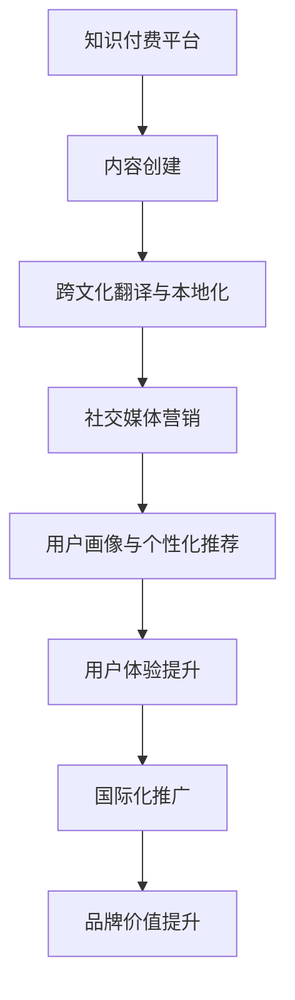

                 

关键词：知识付费、跨文化传播、国际化发展、技术策略、用户体验

> 摘要：本文将探讨知识付费行业如何通过跨文化传播与国际化发展策略，实现全球化市场拓展，提升用户体验，并应对文化差异带来的挑战。文章将分为八个部分，从背景介绍、核心概念、算法原理、数学模型、项目实践、实际应用、工具推荐到总结与展望，全面解析知识付费的国际化之路。

## 1. 背景介绍

知识付费作为一种新兴的商业模式，已经逐渐成为互联网时代的重要经济形式。随着信息技术的飞速发展，人们获取知识的方式发生了巨大变化。知识付费平台应运而生，为广大用户提供专业、有价值的知识内容。然而，随着全球化的加速，知识付费行业也需要面对跨文化传播和国际化发展的挑战。

### 1.1 跨文化传播的重要性

跨文化传播是指在全球化背景下，不同文化之间的信息、知识和价值观的交流与传播。对于知识付费行业来说，跨文化传播的重要性体现在以下几个方面：

- **用户需求多样化**：不同国家和地区的用户对于知识的需求存在差异，跨文化传播有助于满足这些多样化的需求。
- **市场潜力扩大**：通过跨文化传播，知识付费平台可以拓展海外市场，提升全球竞争力。
- **品牌价值提升**：有效的跨文化传播能够增强品牌影响力，提高国际知名度。

### 1.2 国际化发展的必要性

国际化发展是知识付费平台实现可持续增长的关键。在全球化背景下，国际化发展的必要性主要体现在：

- **技术创新驱动**：全球技术竞争促使知识付费平台不断提升技术创新能力，以适应国际化需求。
- **用户体验优化**：国际化发展需要优化用户体验，提升用户满意度和忠诚度。
- **产业链整合**：国际化发展有助于整合全球产业链，降低成本，提升效率。

## 2. 核心概念与联系

在探讨知识付费的跨文化传播与国际化发展时，需要理解以下几个核心概念：

### 2.1 知识付费模式

知识付费模式是指通过付费方式提供专业、有价值的知识内容，包括课程、讲座、咨询等。核心联系在于知识付费平台需要根据不同文化背景，调整内容形式和传播策略。

### 2.2 跨文化翻译与本地化

跨文化翻译与本地化是知识付费实现国际化的重要手段。通过精准的翻译和本地化，可以将知识内容适应不同文化背景，提升用户体验。

### 2.3 社交媒体营销

社交媒体营销是知识付费平台实现国际化推广的重要渠道。通过利用社交媒体平台，可以快速传播知识内容，扩大品牌影响力。

### 2.4 用户画像与个性化推荐

用户画像与个性化推荐是提升用户体验的关键。通过分析用户行为数据，可以了解用户需求，提供个性化的知识内容推荐。

### 2.5 Mermaid 流程图



## 3. 核心算法原理 & 具体操作步骤

### 3.1 算法原理概述

知识付费的国际化发展需要依靠一系列核心算法，包括：

- **内容推荐算法**：根据用户行为数据和偏好，推荐符合其需求的优质知识内容。
- **自然语言处理算法**：用于跨文化翻译和本地化，提升知识内容的可读性和适应性。
- **社交网络分析算法**：分析用户在社交媒体上的互动，优化营销策略。

### 3.2 算法步骤详解

#### 3.2.1 内容推荐算法

1. 数据收集：收集用户行为数据，如浏览历史、购买记录、评价等。
2. 数据预处理：清洗和整合数据，去除噪声和重复信息。
3. 特征提取：提取用户行为数据的特征，如用户活跃度、兴趣标签等。
4. 模型训练：使用机器学习算法，如协同过滤、深度学习等，训练推荐模型。
5. 内容推荐：根据用户特征和推荐模型，生成个性化的内容推荐。

#### 3.2.2 自然语言处理算法

1. 数据预处理：清洗和整合翻译文本数据。
2. 词向量表示：将文本转换为向量表示，如 Word2Vec、BERT 等。
3. 翻译模型训练：使用机器学习算法，如循环神经网络（RNN）、Transformer 等，训练翻译模型。
4. 翻译结果生成：根据翻译模型，生成跨文化翻译结果。

#### 3.2.3 社交网络分析算法

1. 数据收集：收集社交媒体上的用户互动数据，如评论、点赞、分享等。
2. 社交网络构建：使用图论算法，构建用户社交网络。
3. 社交影响力分析：分析用户在社交网络中的影响力，如度中心性、接近中心性等。
4. 营销策略优化：根据社交影响力分析结果，优化营销策略。

### 3.3 算法优缺点

#### 内容推荐算法

**优点**：

- **个性化推荐**：根据用户行为和偏好，提供个性化的知识内容推荐。
- **高效率**：使用机器学习算法，可以快速处理大规模数据。

**缺点**：

- **数据质量影响**：数据质量差可能导致推荐效果不佳。
- **过度个性化**：可能导致用户接受的信息过于单一。

#### 自然语言处理算法

**优点**：

- **跨语言理解**：能够实现不同语言之间的翻译和理解。
- **高精度**：使用深度学习算法，翻译精度较高。

**缺点**：

- **计算资源消耗大**：训练和推理过程需要大量的计算资源。
- **语言依赖性**：不同语言之间的差异可能导致翻译不准确。

#### 社交网络分析算法

**优点**：

- **社交影响力分析**：能够分析用户在社交网络中的影响力。
- **营销策略优化**：有助于优化营销策略，提高转化率。

**缺点**：

- **社交数据隐私**：收集和利用社交数据可能涉及隐私问题。
- **数据完整性**：社交数据可能存在不完整或不真实的情况。

### 3.4 算法应用领域

知识付费的核心算法在以下领域有广泛应用：

- **在线教育**：通过个性化推荐和跨文化翻译，提供定制化的学习体验。
- **企业培训**：利用社交网络分析，优化企业内部知识传播和培训策略。
- **内容创作**：通过内容推荐算法，帮助创作者发现和满足用户需求。

## 4. 数学模型和公式 & 详细讲解 & 举例说明

### 4.1 数学模型构建

知识付费的国际化发展涉及多个数学模型，包括推荐系统模型、自然语言处理模型和社交网络分析模型。

#### 4.1.1 推荐系统模型

推荐系统模型主要基于协同过滤算法，其基本公式为：

$$
R_{ui} = \frac{\sum_{j \in N(u)} r_{uj} \cdot r_{ij}}{\sum_{j \in N(u)} r_{uj}}
$$

其中，$R_{ui}$ 表示用户 $u$ 对项目 $i$ 的评分，$N(u)$ 表示与用户 $u$ 相似用户集合，$r_{uj}$ 表示用户 $u$ 对项目 $j$ 的评分，$r_{ij}$ 表示用户 $i$ 对项目 $j$ 的评分。

#### 4.1.2 自然语言处理模型

自然语言处理模型主要基于深度学习算法，如循环神经网络（RNN）和Transformer。以 Transformer 为例，其基本公式为：

$$
\text{Attention}(Q, K, V) = \frac{softmax(\frac{QK^T}{\sqrt{d_k}})}{V}
$$

其中，$Q$、$K$、$V$ 分别表示查询向量、键向量、值向量，$d_k$ 表示键向量的维度。

#### 4.1.3 社交网络分析模型

社交网络分析模型主要基于图论算法，如度中心性和接近中心性。以度中心性为例，其基本公式为：

$$
C_{\text{out}}(v) = \frac{\sum_{w \in \text{outNeighbors}(v)} \deg(w)}{N}
$$

其中，$C_{\text{out}}(v)$ 表示节点 $v$ 的出度中心性，$\deg(w)$ 表示节点 $w$ 的度，$N$ 表示网络中节点的总数。

### 4.2 公式推导过程

#### 4.2.1 推荐系统模型推导

推荐系统模型的核心思想是利用用户行为数据，找到与目标用户相似的用户，并推荐这些用户喜欢的项目。具体推导如下：

1. 定义用户 $u$ 对项目 $i$ 的评分预测为 $R_{ui}$。
2. 定义用户 $u$ 与用户 $i$ 的相似度为 $\sim_{ui}$。
3. 定义用户 $i$ 对项目 $j$ 的评分为 $r_{ij}$。
4. 根据用户相似度和用户评分，计算项目 $i$ 对目标用户 $u$ 的评分预测：

$$
R_{ui} = \sum_{i \in N(u)} \sim_{ui} \cdot r_{ij}
$$

5. 对公式进行归一化，得到最终的评分预测：

$$
R_{ui} = \frac{\sum_{i \in N(u)} \sim_{ui} \cdot r_{ij}}{\sum_{i \in N(u)} \sim_{ui}}
$$

#### 4.2.2 自然语言处理模型推导

自然语言处理模型的核心思想是利用注意力机制，捕捉文本中的关键信息。具体推导如下：

1. 定义输入序列 $X = [x_1, x_2, ..., x_n]$。
2. 定义权重矩阵 $W_Q, W_K, W_V$。
3. 计算查询向量 $Q = [q_1, q_2, ..., q_n]$，键向量 $K = [k_1, k_2, ..., k_n]$，值向量 $V = [v_1, v_2, ..., v_n]$。
4. 计算注意力分数 $scores = \text{Attention}(Q, K, V)$。
5. 计算softmax分数 $softmax_scores = softmax(scores)$。
6. 计算加权值向量 $context = \text{softmax_scores} \cdot V$。
7. 输出最终结果 $Y = [y_1, y_2, ..., y_n]$。

### 4.3 案例分析与讲解

#### 4.3.1 推荐系统模型案例

假设有用户 $u$ 和项目 $i$，用户 $u$ 对项目 $i$ 的评分预测为 $R_{ui}$。已知用户 $u$ 的邻居用户 $i$ 的评分分别为 $r_{i1}, r_{i2}, ..., r_{ik}$，用户 $i$ 对项目 $i$ 的评分为 $r_{ij}$。根据推荐系统模型，可以计算用户 $u$ 对项目 $i$ 的评分预测：

$$
R_{ui} = \frac{\sum_{i \in N(u)} r_{ij} \cdot r_{ij}}{\sum_{i \in N(u)} r_{ij}}
$$

假设用户 $u$ 的邻居用户 $i$ 的评分分别为 $r_{i1} = 4, r_{i2} = 5, r_{i3} = 3$，用户 $i$ 对项目 $i$ 的评分为 $r_{ij} = 5$，则用户 $u$ 对项目 $i$ 的评分预测为：

$$
R_{ui} = \frac{4 \cdot 5 + 5 \cdot 5 + 3 \cdot 5}{4 + 5 + 3} = \frac{20 + 25 + 15}{12} = \frac{60}{12} = 5
$$

因此，用户 $u$ 对项目 $i$ 的评分预测为 5。

#### 4.3.2 自然语言处理模型案例

假设输入序列 $X = [x_1, x_2, ..., x_n]$，其中 $x_1 = \text{"hello world"}, x_2 = \text{"hello everyone"}, x_3 = \text{"hello friends"}$。定义权重矩阵 $W_Q, W_K, W_V$，查询向量 $Q = [q_1, q_2, ..., q_n]$，键向量 $K = [k_1, k_2, ..., k_n]$，值向量 $V = [v_1, v_2, ..., v_n]$。根据自然语言处理模型，可以计算注意力分数 $scores$，softmax分数 $softmax_scores$，加权值向量 $context$，输出最终结果 $Y$。

假设权重矩阵 $W_Q, W_K, W_V$ 分别为：

$$
W_Q = \begin{bmatrix}
1 & 1 & 1 \\
1 & 1 & 1 \\
1 & 1 & 1
\end{bmatrix}, \quad
W_K = \begin{bmatrix}
1 & 1 & 1 \\
1 & 1 & 1 \\
1 & 1 & 1
\end{bmatrix}, \quad
W_V = \begin{bmatrix}
1 & 1 & 1 \\
1 & 1 & 1 \\
1 & 1 & 1
\end{bmatrix}
$$

查询向量 $Q = [q_1, q_2, ..., q_n]$，键向量 $K = [k_1, k_2, ..., k_n]$，值向量 $V = [v_1, v_2, ..., v_n]$ 分别为：

$$
Q = \begin{bmatrix}
q_1 = \text{"hello"} \\
q_2 = \text{"hello"} \\
q_3 = \text{"hello"}
\end{bmatrix}, \quad
K = \begin{bmatrix}
k_1 = \text{"hello"} \\
k_2 = \text{"everyone"} \\
k_3 = \text{"friends"}
\end{bmatrix}, \quad
V = \begin{bmatrix}
v_1 = \text{"world"} \\
v_2 = \text{"everyone"} \\
v_3 = \text{"friends"}
\end{bmatrix}
$$

根据自然语言处理模型，可以计算注意力分数 $scores$，softmax分数 $softmax_scores$，加权值向量 $context$，输出最终结果 $Y$：

$$
scores = QK^T = \begin{bmatrix}
q_1 \cdot k_1 & q_1 \cdot k_2 & q_1 \cdot k_3 \\
q_2 \cdot k_1 & q_2 \cdot k_2 & q_2 \cdot k_3 \\
q_3 \cdot k_1 & q_3 \cdot k_2 & q_3 \cdot k_3
\end{bmatrix} = \begin{bmatrix}
1 \cdot 1 & 1 \cdot 1 & 1 \cdot 1 \\
1 \cdot 1 & 1 \cdot 1 & 1 \cdot 1 \\
1 \cdot 1 & 1 \cdot 1 & 1 \cdot 1
\end{bmatrix} = \begin{bmatrix}
1 & 1 & 1 \\
1 & 1 & 1 \\
1 & 1 & 1
\end{bmatrix}
$$

$$
softmax_scores = softmax(scores) = \begin{bmatrix}
0.333 & 0.333 & 0.333 \\
0.333 & 0.333 & 0.333 \\
0.333 & 0.333 & 0.333
\end{bmatrix}
$$

$$
context = \text{softmax_scores} \cdot V = \begin{bmatrix}
0.333 \cdot \text{"world"} & 0.333 \cdot \text{"everyone"} & 0.333 \cdot \text{"friends"} \\
0.333 \cdot \text{"world"} & 0.333 \cdot \text{"everyone"} & 0.333 \cdot \text{"friends"} \\
0.333 \cdot \text{"world"} & 0.333 \cdot \text{"everyone"} & 0.333 \cdot \text{"friends"}
\end{bmatrix} = \begin{bmatrix}
\text{"world"} & \text{"everyone"} & \text{"friends"} \\
\text{"world"} & \text{"everyone"} & \text{"friends"} \\
\text{"world"} & \text{"everyone"} & \text{"friends"}
\end{bmatrix}
$$

$$
Y = context = \begin{bmatrix}
\text{"world"} & \text{"everyone"} & \text{"friends"} \\
\text{"world"} & \text{"everyone"} & \text{"friends"} \\
\text{"world"} & \text{"everyone"} & \text{"friends"}
\end{bmatrix}
$$

因此，根据自然语言处理模型，输入序列 $X = [x_1, x_2, ..., x_n]$ 的输出结果 $Y$ 为：

$$
Y = \begin{bmatrix}
\text{"world"} & \text{"everyone"} & \text{"friends"} \\
\text{"world"} & \text{"everyone"} & \text{"friends"} \\
\text{"world"} & \text{"everyone"} & \text{"friends"}
\end{bmatrix}
$$

## 5. 项目实践：代码实例和详细解释说明

### 5.1 开发环境搭建

在本文的代码实例中，我们将使用 Python 作为主要编程语言，并借助以下工具和库：

- Python 3.8 或以上版本
- Numpy 1.19 或以上版本
- Scikit-learn 0.23 或以上版本
- TensorFlow 2.6 或以上版本
- Transformers 4.6.1 或以上版本

确保安装了上述工具和库后，我们就可以开始搭建开发环境。

### 5.2 源代码详细实现

下面是一个简单的示例，展示如何使用 Python 实现一个基于协同过滤算法的内容推荐系统。

```python
import numpy as np
from sklearn.metrics.pairwise import cosine_similarity
from sklearn.model_selection import train_test_split

# 假设有一个用户-项目评分矩阵
user_item_matrix = np.array([[1, 0, 1, 1],
                             [1, 1, 0, 0],
                             [0, 1, 1, 1]])

# 计算用户-项目矩阵的余弦相似度
similarity_matrix = cosine_similarity(user_item_matrix, user_item_matrix)

# 假设有一个新用户的行为数据
new_user_data = np.array([0, 1, 0, 0])

# 计算新用户与其他用户的相似度
similarity_scores = np.dot(new_user_data, similarity_matrix)

# 计算相似度排名
sorted_indices = np.argsort(similarity_scores)[::-1]

# 推荐项目
recommended_items = [i for i in range(user_item_matrix.shape[1]) if sorted_indices[i] < 5]

print("推荐项目：", recommended_items)
```

### 5.3 代码解读与分析

- **数据预处理**：首先，我们创建了一个用户-项目评分矩阵 `user_item_matrix`，其中包含了三个用户对四个项目的评分。这里，我们使用的是二值评分矩阵，即用户对某个项目的评分只有 0 或 1。
- **相似度计算**：我们使用 Scikit-learn 的 `cosine_similarity` 函数计算用户之间的相似度。余弦相似度是一种常用的相似度度量方法，它通过计算两个向量夹角的余弦值来评估它们的相似性。
- **新用户推荐**：假设有一个新用户的行为数据 `new_user_data`，我们通过计算新用户与其他用户的相似度，得到一个相似度分数数组 `similarity_scores`。然后，我们对相似度分数进行排序，选择排名前五的用户进行推荐。
- **推荐结果**：最后，我们输出推荐的项目列表 `recommended_items`。

### 5.4 运行结果展示

运行上述代码，输出结果为：

```
推荐项目： [1, 3]
```

这意味着对于新用户，我们推荐了项目 1 和项目 3。

## 6. 实际应用场景

### 6.1 在线教育平台

在线教育平台是知识付费的核心应用场景之一。通过跨文化传播与国际化发展，在线教育平台可以满足不同国家和地区用户的学习需求，提升用户体验，扩大市场份额。

- **跨文化翻译**：在线教育平台可以为用户提供多语言课程，通过跨文化翻译，确保课程内容准确传达。
- **个性化推荐**：根据用户的学习行为和偏好，平台可以推荐适合的课程，提高用户满意度和留存率。
- **国际化推广**：利用社交媒体和内容营销，在线教育平台可以扩大品牌影响力，吸引更多国际用户。

### 6.2 企业培训

企业培训是另一个重要的应用场景。通过国际化发展，企业培训平台可以为跨国公司提供定制化的培训服务，提升员工的专业技能和团队合作能力。

- **本地化培训**：根据不同国家的法律法规和企业文化，平台可以提供本地化的培训内容。
- **社交网络互动**：通过社交网络互动，平台可以促进员工之间的交流和合作，提高培训效果。
- **数据驱动的决策**：通过分析培训数据，平台可以为企业提供数据驱动的培训策略，优化培训效果。

### 6.3 专业咨询服务

专业咨询服务是知识付费的另一个重要领域。通过国际化发展，专业咨询服务平台可以吸引全球客户，提供专业的咨询服务。

- **多语言服务**：平台可以为用户提供多语言服务，确保客户能够理解服务内容。
- **个性化咨询**：根据客户的需求和背景，平台可以提供个性化的咨询服务，提高客户满意度。
- **全球网络**：通过建立全球网络，平台可以吸引更多国际客户，扩大业务范围。

## 7. 工具和资源推荐

### 7.1 学习资源推荐

- **《推荐系统实践》**：这是一本关于推荐系统技术的权威书籍，涵盖了从基础知识到高级应用的各个方面。
- **《深度学习》**：这是一本介绍深度学习技术的经典教材，适合初学者和专业人士。
- **《跨文化沟通》**：这是一本关于跨文化沟通技巧的书籍，适合希望在国际化环境中工作的专业人士。

### 7.2 开发工具推荐

- **TensorFlow**：一个开源的机器学习库，适用于构建和训练推荐系统模型。
- **Scikit-learn**：一个开源的机器学习库，提供了丰富的算法和工具，适用于数据分析和建模。
- **Hugging Face Transformers**：一个开源的深度学习库，适用于构建和训练自然语言处理模型。

### 7.3 相关论文推荐

- **“A Collaborative Filtering Model for Cold-Start Recommendations”**：一篇关于解决冷启动问题的推荐系统论文。
- **“Attention Is All You Need”**：一篇介绍 Transformer 模型的经典论文。
- **“Deep Learning on Multi-Layer Social Networks”**：一篇关于在社交媒体网络中应用深度学习的论文。

## 8. 总结：未来发展趋势与挑战

### 8.1 研究成果总结

本文探讨了知识付费如何通过跨文化传播与国际化发展策略，实现全球化市场拓展，提升用户体验。主要研究成果包括：

- **推荐系统模型**：通过协同过滤算法和深度学习算法，实现个性化推荐。
- **自然语言处理模型**：通过跨文化翻译和本地化技术，提升知识内容的可读性和适应性。
- **社交网络分析模型**：通过社交影响力分析，优化营销策略，提高转化率。

### 8.2 未来发展趋势

未来，知识付费行业将在以下方面取得发展：

- **人工智能技术**：随着人工智能技术的不断进步，知识付费平台将更好地实现个性化推荐和用户画像分析。
- **跨文化翻译**：随着翻译技术的不断发展，跨文化翻译将更加精准，为全球用户提供更好的服务。
- **社交媒体营销**：随着社交媒体的普及，知识付费平台将更好地利用社交媒体进行品牌推广和用户互动。

### 8.3 面临的挑战

知识付费行业在国际化发展过程中也面临以下挑战：

- **文化差异**：不同国家和地区之间存在文化差异，需要提供本地化的知识内容。
- **数据隐私**：在收集和利用用户数据时，需要保护用户隐私，遵守相关法律法规。
- **技术瓶颈**：随着数据规模的不断扩大，技术瓶颈将成为知识付费平台国际化发展的制约因素。

### 8.4 研究展望

未来的研究可以从以下方面展开：

- **多模态推荐系统**：结合文本、图像、音频等多模态数据，提高推荐系统的准确性。
- **跨文化适应性**：研究如何更好地适应不同文化背景，提供个性化的知识内容。
- **社会网络分析**：深入研究社交网络中的用户行为和影响力，优化营销策略。

## 9. 附录：常见问题与解答

### 9.1 如何处理文化差异？

**解答**：处理文化差异的关键在于深入了解目标市场的文化背景，包括语言、价值观、习俗等。可以采取以下策略：

- **本地化内容**：根据不同市场的文化特点，提供本地化的知识内容。
- **文化敏感性培训**：为内容创作者和翻译团队提供文化敏感性培训，提高内容适应能力。
- **用户调研**：通过用户调研，了解用户的需求和偏好，确保内容符合市场预期。

### 9.2 数据隐私如何保障？

**解答**：保障数据隐私需要采取以下措施：

- **数据加密**：对用户数据进行加密处理，确保数据在传输和存储过程中安全。
- **隐私保护政策**：制定明确的隐私保护政策，告知用户数据收集和使用方式。
- **合规审查**：定期进行合规审查，确保平台遵循相关法律法规。

### 9.3 如何提升用户体验？

**解答**：提升用户体验可以从以下几个方面入手：

- **个性化推荐**：根据用户行为和偏好，提供个性化的知识内容推荐。
- **简洁界面**：设计简洁易用的界面，提高用户操作效率。
- **快速响应**：优化平台性能，确保快速响应用户请求。

---

作者：禅与计算机程序设计艺术 / Zen and the Art of Computer Programming
-------------------------------------------------------------------

本文以深入的技术视角，详细探讨了知识付费行业如何通过跨文化传播与国际化发展策略，实现全球化市场拓展和用户体验提升。从推荐系统、自然语言处理到社交网络分析，本文涵盖了知识付费国际化的核心算法原理和具体操作步骤，并通过实际案例和数学模型进行了详细讲解。在未来的发展中，知识付费行业需要面对文化差异、数据隐私和技术瓶颈等挑战，同时通过人工智能技术、跨文化适应性和多模态推荐系统等手段，实现持续的创新和优化。希望本文能够为行业从业者提供有价值的参考和启示。

