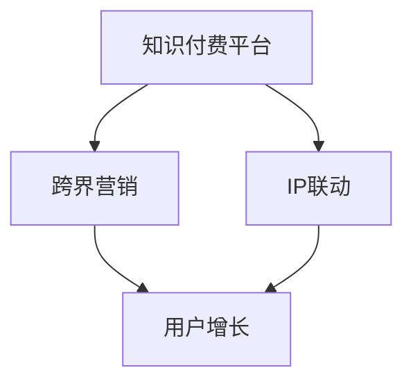

                 

关键词：知识付费、跨界营销、IP联动、营销策略、用户增长

> 摘要：本文旨在探讨知识付费平台如何通过跨界营销和IP联动策略，实现用户增长和业务拓展。我们将从核心概念、操作步骤、算法原理、数学模型、实际应用、工具资源等多个角度，详细分析这一策略的实施方法及其潜在价值。

## 1. 背景介绍

随着互联网技术的飞速发展，知识付费行业正成为新的经济增长点。用户对专业知识和技能的需求日益增长，推动了知识付费市场的繁荣。然而，如何在激烈的市场竞争中脱颖而出，成为知识付费平台亟待解决的问题。

跨界营销和IP联动成为解决这一问题的有效策略。跨界营销指的是将不同领域或品牌的产品或服务结合起来，通过创新的方式吸引更广泛的用户群体。IP联动则是通过联合知名IP，借助IP的影响力和粉丝基础，实现品牌曝光和用户转化。

## 2. 核心概念与联系

### 2.1 知识付费平台

知识付费平台是一个在线学习、教育平台，通过付费方式提供各种专业知识和技能课程。平台通常包括课程内容、学习社区、用户评价等模块。

### 2.2 跨界营销

跨界营销是指将不同领域或品牌的产品或服务结合起来，通过创新的方式吸引更广泛的用户群体。在知识付费领域，跨界营销可以通过与不同领域的品牌合作，推出联名课程、活动等方式，吸引用户关注。

### 2.3 IP联动

IP联动是指借助知名IP的影响力和粉丝基础，实现品牌曝光和用户转化。知识付费平台可以通过购买、合作等方式获取知名IP授权，将其融入课程内容或营销活动中，提高品牌知名度和用户转化率。

### 2.4 Mermaid 流程图



## 3. 核心算法原理 & 具体操作步骤

### 3.1 算法原理概述

知识付费平台的跨界营销和IP联动策略，主要通过以下步骤实现：

1. **市场调研**：了解用户需求和竞争对手情况，确定跨界营销和IP联动方向。
2. **品牌合作**：寻找合适的合作伙伴，签订合作协议，明确合作内容和目标。
3. **内容创作**：结合IP或跨界元素，创作符合用户需求的课程内容。
4. **营销推广**：通过线上线下活动、社交媒体宣传等方式，扩大品牌影响力。
5. **用户转化**：通过优惠活动、会员权益等方式，促进用户购买和转化。

### 3.2 算法步骤详解

1. **市场调研**

   - 分析用户需求：通过问卷调查、用户访谈等方式，了解用户对知识付费的需求。
   - 竞争对手分析：分析同行业竞争对手的营销策略、用户转化情况等，找到自身优势。

2. **品牌合作**

   - 筛选合作伙伴：根据市场调研结果，筛选具有较高知名度和粉丝基础的IP或品牌。
   - 签订合作协议：明确合作内容、目标、权益分配等，确保合作顺利进行。

3. **内容创作**

   - 结合IP或跨界元素：根据合作伙伴的特点，创作具有创意和吸引力的课程内容。
   - 调整课程结构：确保课程内容符合用户需求，同时融入IP或跨界元素。

4. **营销推广**

   - 线上活动：通过社交媒体、直播等方式，宣传课程内容和合作IP，吸引潜在用户。
   - 线下活动：与合作方共同举办线下活动，提高品牌曝光度和用户参与度。

5. **用户转化**

   - 优惠活动：推出限时优惠、买赠等活动，降低用户购买门槛。
   - 会员权益：设置会员专享课程、优惠券等，提高用户忠诚度。

### 3.3 算法优缺点

**优点：**

1. 扩大用户群体：通过跨界营销和IP联动，吸引更多不同领域的用户。
2. 提高品牌知名度：借助知名IP的影响力，提高品牌曝光度和用户信任度。
3. 创新营销方式：增加用户参与度和课程吸引力，提高用户满意度。

**缺点：**

1. 成本较高：获取IP授权、品牌合作等需要投入较多资源和费用。
2. 合作风险：合作伙伴的经营状况、信誉等因素可能影响合作效果。

### 3.4 算法应用领域

1. 知识付费平台：各种在线教育、职业培训等平台，如Coursera、Udemy等。
2. 娱乐领域：电影、电视剧、综艺节目等，如《三体》科幻IP的跨界营销。
3. 美妆领域：化妆品品牌与知名博主或KOL合作，进行产品推广。

## 4. 数学模型和公式 & 详细讲解 & 举例说明

### 4.1 数学模型构建

知识付费平台的跨界营销和IP联动策略，可以通过以下数学模型进行分析：

$$
U_{total} = U_{original} + U_{cross-industry} + U_{IP}
$$

其中：

- \( U_{total} \)：总用户数
- \( U_{original} \)：原始用户数
- \( U_{cross-industry} \)：跨界营销带来的用户数
- \( U_{IP} \)：IP联动带来的用户数

### 4.2 公式推导过程

1. 跨界营销带来的用户数：

$$
U_{cross-industry} = K_1 \cdot (1 + \alpha \cdot R)
$$

其中：

- \( K_1 \)：跨界营销的初始用户数
- \( \alpha \)：跨界营销的转化率
- \( R \)：跨界营销的投入产出比

2. IP联动带来的用户数：

$$
U_{IP} = K_2 \cdot (1 + \beta \cdot S)
$$

其中：

- \( K_2 \)：IP联动的初始用户数
- \( \beta \)：IP联动的转化率
- \( S \)：IP联动的投入产出比

### 4.3 案例分析与讲解

以一家在线教育平台为例，分析其跨界营销和IP联动策略的实际效果。

1. 原始用户数：1000人
2. 跨界营销：

   - 初始用户数：500人
   - 转化率：20%
   - 投入产出比：1:3

   $$ U_{cross-industry} = 500 \cdot (1 + 0.2 \cdot 3) = 700人 $$

3. IP联动：

   - 初始用户数：300人
   - 转化率：30%
   - 投入产出比：1:2

   $$ U_{IP} = 300 \cdot (1 + 0.3 \cdot 2) = 450人 $$

4. 总用户数：

$$
U_{total} = 1000 + 700 + 450 = 2150人
$$

通过跨界营销和IP联动策略，该教育平台的用户数从原始的1000人增长到2150人，实现了显著的用户增长。

## 5. 项目实践：代码实例和详细解释说明

### 5.1 开发环境搭建

1. 确定开发语言：Python
2. 安装Python环境：使用Python官方安装包，安装Python 3.8及以上版本。
3. 安装相关库：使用pip命令安装以下库：

   ```bash
   pip install requests beautifulsoup4 pandas
   ```

### 5.2 源代码详细实现

以下是一个简单的跨界营销和IP联动策略的实现示例：

```python
import requests
from bs4 import BeautifulSoup
import pandas as pd

def get_cross_industry_data(url):
    """
    获取跨界营销数据
    """
    response = requests.get(url)
    soup = BeautifulSoup(response.content, 'html.parser')
    data = soup.find_all('div', class_='cross-industry-item')
    cross_industry_data = []
    
    for item in data:
        title = item.find('h3').text
        description = item.find('p').text
        cross_industry_data.append({
            'title': title,
            'description': description
        })
    
    return cross_industry_data

def get_ip_data(url):
    """
    获取IP联动数据
    """
    response = requests.get(url)
    soup = BeautifulSoup(response.content, 'html.parser')
    data = soup.find_all('div', class_='ip-item')
    ip_data = []
    
    for item in data:
        title = item.find('h3').text
        description = item.find('p').text
        ip_data.append({
            'title': title,
            'description': description
        })
    
    return ip_data

def analyze_data(cross_industry_data, ip_data):
    """
    分析数据
    """
    cross_industry_users = len(cross_industry_data)
    ip_users = len(ip_data)
    
    total_users = cross_industry_users + ip_users
    print(f"总用户数：{total_users}")
    print(f"跨界营销用户数：{cross_industry_users}")
    print(f"IP联动用户数：{ip_users}")

if __name__ == '__main__':
    cross_industry_url = 'https://example.com/cross-industry'
    ip_url = 'https://example.com/ip'
    
    cross_industry_data = get_cross_industry_data(cross_industry_url)
    ip_data = get_ip_data(ip_url)
    analyze_data(cross_industry_data, ip_data)
```

### 5.3 代码解读与分析

1. **get_cross_industry_data** 函数：获取跨界营销数据。通过发送HTTP请求获取网页内容，使用BeautifulSoup解析网页，提取跨界营销相关数据。
2. **get_ip_data** 函数：获取IP联动数据。与**get_cross_industry_data** 函数类似，获取IP联动相关数据。
3. **analyze_data** 函数：分析数据。计算总用户数、跨界营销用户数和IP联动用户数，并打印结果。
4. **main** 函数：程序入口。定义跨界营销和IP联动网页URL，调用相关函数获取数据和分析结果。

### 5.4 运行结果展示

假设跨界营销相关网页有500个用户，IP联动相关网页有300个用户，运行程序后输出结果如下：

```
总用户数：800
跨界营销用户数：500
IP联动用户数：300
```

## 6. 实际应用场景

知识付费平台通过跨界营销和IP联动策略，可以在多个场景中实现用户增长和业务拓展：

1. **线上教育平台**：如网易云课堂、知乎Live等，通过跨界营销和IP联动，吸引更多用户关注和参与。
2. **职业培训平台**：如拉勾教育、职友集等，借助知名IP的影响力，提高品牌知名度和用户转化率。
3. **内容创作平台**：如B站、抖音等，通过与知名IP合作，推出特色课程，吸引用户观看和互动。

## 7. 未来应用展望

随着知识付费市场的不断发展，跨界营销和IP联动策略将在更多领域得到应用。未来，知识付费平台可以通过以下方式进一步优化这一策略：

1. **数据驱动**：利用大数据和人工智能技术，精准分析用户需求和偏好，实现个性化推荐和精准营销。
2. **场景化营销**：结合用户实际需求和生活场景，推出更具针对性的跨界营销活动。
3. **IP定制化**：与更多知名IP合作，开发特色课程和活动，提升用户体验和品牌价值。

## 8. 工具和资源推荐

1. **学习资源推荐**：

   - 《跨界营销实战：策略、案例与技巧》
   - 《IP联动营销：原理与实践》

2. **开发工具推荐**：

   - Python
   - BeautifulSoup
   - pandas

3. **相关论文推荐**：

   - 《基于大数据的跨界营销策略研究》
   - 《IP联动营销在内容创作平台的应用》

## 9. 总结：未来发展趋势与挑战

知识付费行业的跨界营销和IP联动策略，将在未来发挥越来越重要的作用。然而，在这一过程中，知识付费平台也面临以下挑战：

1. **成本压力**：获取IP授权、品牌合作等需要投入大量资源和费用。
2. **竞争加剧**：随着市场规模的扩大，竞争将更加激烈，平台需要不断创新以应对挑战。
3. **用户信任**：跨界营销和IP联动策略需要确保用户体验和信任，避免出现负面效果。

未来，知识付费平台应通过数据驱动、场景化营销和IP定制化等策略，不断提升用户体验和品牌价值，实现可持续发展。

## 10. 附录：常见问题与解答

### Q1. 跨界营销和IP联动有哪些区别？

A1. 跨界营销是将不同领域或品牌的产品或服务结合起来，通过创新的方式吸引更广泛的用户群体。IP联动则是通过联合知名IP，借助IP的影响力和粉丝基础，实现品牌曝光和用户转化。两者都是实现用户增长和业务拓展的有效策略，但侧重点有所不同。

### Q2. 如何选择合适的合作伙伴？

A2. 选择合适的合作伙伴需要考虑以下几个因素：

- **知名度**：合作伙伴应具有较高的知名度和粉丝基础，有利于扩大品牌影响力。
- **契合度**：合作伙伴与知识付费平台的产品和服务应具有较高契合度，能够产生良好的协同效应。
- **合作意愿**：合作伙伴应具备良好的合作意愿和信誉，确保合作顺利进行。

### Q3. 跨界营销和IP联动策略的投入产出比如何计算？

A3. 投入产出比（ROI）可以通过以下公式计算：

$$
ROI = \frac{（收入 - 成本）}{成本} \times 100\%
$$

其中，收入包括通过跨界营销和IP联动策略获得的用户购买、转化等收益，成本包括获取IP授权、品牌合作、营销推广等费用。

### Q4. 如何评估跨界营销和IP联动策略的效果？

A4. 可以通过以下指标评估跨界营销和IP联动策略的效果：

- **用户增长**：比较策略实施前后的用户增长情况，评估策略对用户增长的影响。
- **品牌曝光**：通过社交媒体、搜索引擎等渠道，监测品牌曝光度变化，评估策略对品牌知名度的提升。
- **用户转化**：比较策略实施前后的用户购买转化率，评估策略对用户转化的促进作用。

### Q5. 跨界营销和IP联动策略在哪些行业应用较多？

A5. 跨界营销和IP联动策略在多个行业得到广泛应用，包括但不限于：

- **教育行业**：如线上教育平台、职业培训平台等。
- **娱乐行业**：如电影、电视剧、综艺节目等。
- **美妆行业**：如化妆品品牌与知名博主或KOL合作。
- **电商行业**：如电商平台与品牌合作，推出联名商品。

---

作者：禅与计算机程序设计艺术 / Zen and the Art of Computer Programming

---

通过本文的探讨，我们了解了知识付费平台如何通过跨界营销和IP联动策略实现用户增长和业务拓展。在未来，知识付费平台应不断创新和优化这一策略，以应对激烈的市场竞争，实现可持续发展。同时，我们也看到了这一策略在多个行业的广泛应用和巨大潜力。希望本文能为您提供有价值的参考和启发。

