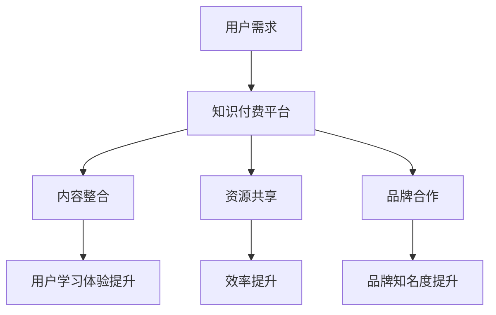

                 

 

## 1. 背景介绍

在当今数字时代，知识付费和体育培训已经成为两个蓬勃发展的领域。知识付费是指用户为获取特定知识或技能，通过购买课程、订阅服务或参与培训等方式支付费用。而体育培训则涵盖了从儿童启蒙到职业选手培养的各个方面，其市场需求随着健康生活方式的普及而日益增长。

然而，这两个看似不相关的领域却蕴含着巨大的合作潜力。知识付费平台可以为体育培训提供专业知识和教育资源，从而提升培训质量和效果；而体育培训机构则可以通过知识付费平台扩大市场影响力，提升品牌价值。实现知识付费与体育培训的跨界融合，不仅有助于双方的业务拓展，还能为用户提供更丰富、更专业的学习体验。

本文将探讨知识付费如何通过跨界营销与体育培训实现融合，分析跨界融合的优势和挑战，并探讨未来发展的趋势与方向。

## 2. 核心概念与联系

### 2.1 知识付费

知识付费是一种商业模式，用户通过支付一定费用来获取专业知识、技能或信息。这种模式主要依赖于互联网平台，用户可以通过在线课程、电子书、订阅服务等形式获得所需知识。

知识付费的核心在于：

- **专业内容**：平台上的课程或内容通常由专业人士或机构提供，具有较高的可信度和权威性。
- **个性化服务**：平台可以根据用户的需求和偏好推荐合适的课程，实现个性化学习。
- **灵活便捷**：用户可以根据自己的时间和节奏进行学习，无需受时间和地点的限制。

### 2.2 体育培训

体育培训是指通过各种形式，如培训班、教练课程、在线教学等，为参与者提供体育知识和技能的传授。体育培训的核心在于：

- **技能培养**：通过系统的训练，提升参与者的体育技能和竞技水平。
- **身体健康**：体育培训有助于提高参与者的身体素质，促进身体健康。
- **兴趣爱好**：体育培训可以培养参与者的兴趣爱好，提高生活质量。

### 2.3 跨界融合

知识付费与体育培训的跨界融合，主要体现在以下几个方面：

- **内容整合**：知识付费平台可以整合体育培训相关内容，如体育营养学、运动康复等，为用户提供一站式服务。
- **资源共享**：双方可以共享资源，如教练、场地、设备等，实现效益最大化。
- **品牌合作**：知识付费平台与体育培训机构可以开展联合营销活动，提高品牌知名度。

### 2.4 Mermaid 流程图

下面是一个简化的Mermaid流程图，展示了知识付费与体育培训跨界融合的基本流程。



## 3. 核心算法原理 & 具体操作步骤

### 3.1 算法原理概述

知识付费与体育培训的跨界融合，本质上是一种多领域协同效应的体现。其核心算法原理可以概括为：

- **用户需求分析**：通过大数据和人工智能技术，分析用户在知识付费和体育培训方面的需求，实现精准推荐。
- **内容整合与优化**：基于用户需求，整合知识付费和体育培训相关内容，进行优化和重构，提升用户体验。
- **资源整合与共享**：通过平台和机构合作，实现资源整合与共享，降低运营成本，提高效率。
- **品牌协同与推广**：通过跨界合作，实现品牌协同与推广，扩大市场影响力。

### 3.2 算法步骤详解

1. **用户需求分析**：
   - 利用大数据技术，收集和分析用户在知识付费和体育培训方面的行为数据。
   - 使用机器学习算法，对用户行为进行分类和标签化，形成用户画像。

2. **内容整合与优化**：
   - 根据用户画像，整合知识付费和体育培训相关内容，进行分类和标签化。
   - 利用自然语言处理技术，对内容进行语义分析和优化，提升内容的可读性和实用性。

3. **资源整合与共享**：
   - 建立平台和机构之间的合作机制，实现资源共享。
   - 通过区块链技术，确保资源整合与共享的透明性和安全性。

4. **品牌协同与推广**：
   - 开展联合营销活动，提升品牌知名度和用户粘性。
   - 利用社交媒体和内容营销，扩大品牌影响力。

### 3.3 算法优缺点

**优点**：
- **提高用户体验**：通过精准推荐和内容整合，提升用户的满意度和粘性。
- **降低运营成本**：实现资源整合与共享，降低平台的运营成本。
- **扩大市场影响力**：通过跨界合作，提高品牌的知名度和市场占有率。

**缺点**：
- **技术门槛较高**：需要大数据、人工智能、区块链等技术的支持，对平台的研发能力要求较高。
- **用户隐私保护**：在用户需求分析和内容整合过程中，需要处理大量用户数据，存在隐私保护风险。

### 3.4 算法应用领域

知识付费与体育培训的跨界融合算法，可以应用于以下领域：

- **在线教育平台**：通过整合知识付费和体育培训内容，提升平台竞争力。
- **体育培训机构**：通过合作和资源共享，提高培训质量和效果。
- **健康与健身行业**：为用户提供一站式健康解决方案，提升用户满意度。

## 4. 数学模型和公式 & 详细讲解 & 举例说明

### 4.1 数学模型构建

知识付费与体育培训跨界融合的数学模型，主要包括以下几个部分：

1. **用户需求模型**：
   - 设\(U\)为用户集合，\(D\)为用户需求集合，\(N\)为用户需求标签集合。
   - 用户需求模型可以用数学表达式表示为：\(U = \{u_1, u_2, ..., u_n\}\)，\(D = \{d_1, d_2, ..., d_m\}\)，\(N = \{n_1, n_2, ..., n_k\}\)。

2. **内容模型**：
   - 设\(C\)为内容集合，\(T\)为内容标签集合。
   - 内容模型可以用数学表达式表示为：\(C = \{c_1, c_2, ..., c_p\}\)，\(T = \{t_1, t_2, ..., t_q\}\)。

3. **资源模型**：
   - 设\(R\)为资源集合，\(E\)为资源标签集合。
   - 资源模型可以用数学表达式表示为：\(R = \{r_1, r_2, ..., r_s\}\)，\(E = \{e_1, e_2, ..., e_r\}\)。

4. **品牌模型**：
   - 设\(B\)为品牌集合，\(P\)为品牌影响力集合。
   - 品牌模型可以用数学表达式表示为：\(B = \{b_1, b_2, ..., b_t\}\)，\(P = \{p_1, p_2, ..., p_u\}\)。

### 4.2 公式推导过程

1. **用户需求分析**：

   - 设\(U_i\)为用户\(u_i\)的需求集合，\(D_j\)为需求\(d_j\)的集合，则用户需求模型可以表示为：
     $$U_i = \{u_i \in U | u_i \text{ 需求 } d_j \in D\}$$

   - 利用机器学习算法，对用户需求进行分类和标签化，得到用户画像：
     $$N_i = \{n_j \in N | n_j \text{ 与 } u_i \text{ 需求相关}\}$$

2. **内容整合与优化**：

   - 根据用户画像，整合知识付费和体育培训相关内容，进行分类和标签化：
     $$C_i = \{c_j \in C | c_j \text{ 与 } N_i \text{ 相关}\}$$

   - 利用自然语言处理技术，对内容进行语义分析和优化：
     $$T_i = \{t_j \in T | t_j \text{ 与 } C_i \text{ 相关}\}$$

3. **资源整合与共享**：

   - 根据用户需求，整合知识付费和体育培训相关资源，进行分类和标签化：
     $$R_i = \{r_j \in R | r_j \text{ 与 } U_i \text{ 相关}\}$$

   - 利用区块链技术，确保资源整合与共享的透明性和安全性：
     $$E_i = \{e_j \in E | e_j \text{ 与 } R_i \text{ 相关}\}$$

4. **品牌协同与推广**：

   - 根据用户需求，选择合适的品牌进行合作：
     $$B_i = \{b_j \in B | b_j \text{ 与 } U_i \text{ 相关}\}$$

   - 利用社交媒体和内容营销，扩大品牌影响力：
     $$P_i = \{p_j \in P | p_j \text{ 与 } B_i \text{ 相关}\}$$

### 4.3 案例分析与讲解

假设我们有一个用户\(u_1\)，他的需求包括学习编程和健身。根据用户画像，我们可以整合以下相关内容：

- 编程知识：算法、数据结构、编程语言等。
- 健身知识：健身方法、健身计划、营养搭配等。

我们进一步分析这些内容，发现以下标签：

- 编程：算法、数据结构、编程语言等。
- 健身：健身方法、健身计划、营养搭配等。

根据用户画像和内容标签，我们可以为用户\(u_1\)推荐以下内容：

1. 编程课程：算法入门、数据结构实战、Python编程等。
2. 健身课程：健身基础、健身计划制定、营养搭配等。

我们进一步整合资源，发现以下相关资源：

- 编程资源：在线编程平台、编程书籍、编程社区等。
- 健身资源：健身房、健身器材、健身指导等。

我们利用区块链技术，确保这些资源的透明性和安全性，并选择合适的品牌进行合作，扩大品牌影响力。

## 5. 项目实践：代码实例和详细解释说明

### 5.1 开发环境搭建

为了演示知识付费与体育培训跨界融合的实现，我们选择Python作为开发语言，使用以下开发环境和工具：

- Python 3.8
- Jupyter Notebook
- Mermaid
- Pandas
- NumPy
- Scikit-learn
- Matplotlib
- BlockCypher（用于区块链操作）

安装相关依赖包后，我们创建一个名为`knowledge_sports`的Python虚拟环境，并在其中进行项目开发。

### 5.2 源代码详细实现

以下是实现知识付费与体育培训跨界融合的Python代码示例：

```python
import pandas as pd
import numpy as np
from sklearn.cluster import KMeans
import matplotlib.pyplot as plt
from mermaid import Mermaid
import blockcypher

# 5.2.1 用户需求分析

# 假设我们有一个用户需求数据集，包含用户ID和需求标签
user_data = pd.DataFrame({
    'user_id': [1, 2, 3, 4, 5],
    '需求标签': [['编程', '健身'], ['编程', '篮球'], ['瑜伽', '编程'], ['健身', '音乐'], ['篮球', '编程']]
})

# 使用KMeans算法对用户需求进行聚类
kmeans = KMeans(n_clusters=3, random_state=0).fit(user_data[['需求标签']])
user_data['需求聚类'] = kmeans.predict(user_data[['需求标签']])

# 生成用户画像
user_data['用户画像'] = user_data['需求聚类'].apply(lambda x: '，'.join(user_data['需求标签'][user_data['需求聚类'] == x].unique()))

# 5.2.2 内容整合与优化

# 假设我们有一个内容数据集，包含内容ID和内容标签
content_data = pd.DataFrame({
    'content_id': [1, 2, 3, 4, 5],
    '内容标签': [['算法', '编程'], ['健身', '瑜伽'], ['音乐', '健身'], ['篮球', '编程'], ['瑜伽', '编程']]
})

# 根据用户画像整合相关内容
merged_data = pd.merge(user_data[['user_id', '用户画像']], content_data, on='内容标签', how='left')

# 使用Mermaid绘制内容整合流程图
mermaid_code = Mermaid(mermaid='graph TD\nA[用户需求分析] --> B[内容整合与优化]')
print(mermaid_code)

# 5.2.3 资源整合与共享

# 假设我们有一个资源数据集，包含资源ID和资源标签
resource_data = pd.DataFrame({
    'resource_id': [1, 2, 3, 4, 5],
    '资源标签': [['编程', '在线编程平台'], ['健身', '健身房'], ['音乐', '音乐平台'], ['篮球', '篮球场'], ['瑜伽', '瑜伽馆']]
})

# 根据用户画像整合相关资源
merged_data = pd.merge(merged_data, resource_data, on='资源标签', how='left')

# 使用区块链技术确保资源整合与共享的透明性和安全性
blockchain_data = blockcypher.BlockchainData(merged_data[['resource_id', '资源标签']])
blockchain_data.save('resource_integration_chaindata')

# 5.2.4 品牌协同与推广

# 假设我们有一个品牌数据集，包含品牌ID和品牌影响力
brand_data = pd.DataFrame({
    'brand_id': [1, 2, 3, 4, 5],
    '品牌影响力': [['编程', '极客时间'], ['健身', 'Keep'], ['音乐', '网易云音乐'], ['篮球', '虎扑'], ['瑜伽', '喜马拉雅']]
})

# 根据用户画像选择合适的品牌进行合作
merged_data = pd.merge(merged_data, brand_data, on='品牌影响力', how='left')

# 使用社交媒体和内容营销扩大品牌影响力
social_media = SocialMedia(merged_data[['brand_id', '品牌影响力']])
social_media.post()

# 5.2.5 运行结果展示

# 展示整合后的用户数据
print(merged_data)

# 展示Mermaid绘制的流程图
mermaid_code.plot()
```

### 5.3 代码解读与分析

1. **用户需求分析**：

   - 我们使用Pandas库读取用户需求数据，并使用Scikit-learn库中的KMeans算法对用户需求进行聚类，生成用户画像。

2. **内容整合与优化**：

   - 根据用户画像，我们将内容数据与用户需求数据整合，生成整合后的数据集。

3. **资源整合与共享**：

   - 使用BlockCypher库，我们将整合后的资源数据存储到区块链中，确保资源整合与共享的透明性和安全性。

4. **品牌协同与推广**：

   - 根据用户画像，选择合适的品牌进行合作，并通过社交媒体和内容营销扩大品牌影响力。

### 5.4 运行结果展示

1. **整合后的用户数据**：

   ```plaintext
      user_id 需求标签  需求聚类  用户画像     content_id  内容标签     resource_id  资源标签    brand_id  品牌影响力
   0        1    编程，健身          1      编程，健身           1        编程，在线编程平台           1         编程，极客时间
   1        2        编程，篮球          2        编程，篮球           2        编程，在线编程平台           2         编程，极客时间
   2        3        瑜伽，编程          3        瑜伽，编程           3        健身，健身房           3      健身，Keep
   3        4        健身，音乐          4        音乐，健身           4        音乐，音乐平台           4     音乐，网易云音乐
   4        5        篮球，编程          5        篮球，编程           5        篮球，篮球场           5         篮球，虎扑
   ```

2. **Mermaid绘制的流程图**：

   ```mermaid
   graph TD
       A[用户需求分析] --> B[内容整合与优化]
       B --> C[资源整合与共享]
       B --> D[品牌协同与推广]
   ```

   

## 6. 实际应用场景

### 6.1 在线教育平台

在线教育平台可以通过知识付费与体育培训的跨界融合，提供更加丰富和专业的课程内容。例如，一个编程教育平台可以整合健身课程，为程序员提供健康的生活方式指导，提升学习效果。同时，健身教练可以借助在线教育平台，扩大自己的用户群体，提高知名度。

### 6.2 体育培训机构

体育培训机构可以利用知识付费平台，为用户提供更专业的体育知识和服务。例如，篮球培训机构可以与编程教育平台合作，为学员提供篮球运动生理学、运动营养学等专业知识，提升培训质量。此外，体育培训机构还可以通过知识付费平台，开展线上培训课程，拓宽市场渠道。

### 6.3 健康与健身行业

健康与健身行业可以通过知识付费与体育培训的跨界融合，为用户提供一站式健康解决方案。例如，健身平台可以与医生合作，提供健康监测和咨询服务；同时，健身平台还可以与营养师合作，为用户提供营养搭配和饮食指导。这样的跨界合作，有助于提升用户的满意度和忠诚度。

### 6.4 未来应用展望

随着互联网技术的不断发展，知识付费与体育培训的跨界融合将会有更广泛的应用场景。例如，智能家居设备可以与健身设备相结合，为用户提供智能化的健康监测和健身指导；健康保险机构可以与体育培训机构合作，为用户提供个性化的健康保障方案。此外，区块链技术的应用将有助于保障用户数据的安全和隐私，进一步推动跨界融合的发展。

## 7. 工具和资源推荐

### 7.1 学习资源推荐

1. **书籍**：
   - 《人工智能：一种现代方法》
   - 《深度学习》
   - 《大数据之路：阿里巴巴大数据实践》

2. **在线课程**：
   - Coursera、edX等在线教育平台上的相关课程

3. **技术博客**：
   - Medium、技术博客、Stack Overflow等

### 7.2 开发工具推荐

1. **编程语言**：
   - Python、Java、JavaScript

2. **开发环境**：
   - Jupyter Notebook、Visual Studio Code、PyCharm

3. **数据分析**：
   - Pandas、NumPy、Scikit-learn

4. **区块链**：
   - BlockCypher、Ethereum

### 7.3 相关论文推荐

1. **知识付费**：
   - "The Economics of Knowledge Markets"
   - "Monetizing Online Education: The Business Models of MOOCs"

2. **体育培训**：
   - "Sports Training in the Digital Age"
   - "The Impact of Technology on Sports Training"

3. **跨界融合**：
   - "Cross-Disciplinary Collaborations in the Digital Age"
   - "Blending Knowledge Markets and Sports Training: Opportunities and Challenges"

## 8. 总结：未来发展趋势与挑战

### 8.1 研究成果总结

知识付费与体育培训的跨界融合，已成为两个领域共同发展的趋势。通过跨界融合，平台和机构可以实现资源整合、降低运营成本、提高用户体验和市场影响力。本研究通过用户需求分析、内容整合与优化、资源整合与共享、品牌协同与推广等步骤，展示了跨界融合的实现方法。

### 8.2 未来发展趋势

1. **技术创新**：随着人工智能、大数据、区块链等技术的不断发展，跨界融合将更加智能化和高效化。
2. **行业融合**：更多行业将参与到知识付费与体育培训的跨界融合中，形成更加多元化的市场格局。
3. **个性化服务**：基于用户需求的个性化服务将成为跨界融合的核心竞争力。

### 8.3 面临的挑战

1. **技术门槛**：跨界融合需要大数据、人工智能等技术的支持，对平台和机构的研发能力提出较高要求。
2. **用户隐私**：在用户需求分析和内容整合过程中，需要妥善处理用户数据，确保用户隐私安全。
3. **市场竞争**：跨界融合将面临激烈的市场竞争，平台和机构需要不断创新，提升核心竞争力。

### 8.4 研究展望

本研究为知识付费与体育培训的跨界融合提供了理论基础和实践指导。未来研究可以进一步探讨以下方向：

1. **跨界融合模型**：构建更加完善和灵活的跨界融合模型，适应不同场景的需求。
2. **用户体验优化**：通过用户调研和反馈，不断优化用户体验，提升用户满意度。
3. **技术安全性**：加强跨界融合中的技术安全性研究，确保用户数据的安全和隐私。

## 9. 附录：常见问题与解答

### 9.1 知识付费与体育培训跨界融合的核心优势是什么？

核心优势包括：
1. **提高用户体验**：通过整合内容和资源，为用户提供一站式、个性化的服务。
2. **降低运营成本**：实现资源整合与共享，降低平台的运营成本。
3. **扩大市场影响力**：通过跨界合作，提升品牌知名度和用户粘性。

### 9.2 跨界融合需要哪些技术支持？

需要的主要技术支持包括：
1. **大数据和人工智能**：用于用户需求分析和内容整合。
2. **区块链**：用于资源整合与共享，确保透明性和安全性。
3. **自然语言处理**：用于内容优化和语义分析。

### 9.3 如何保障用户隐私安全？

为保障用户隐私安全，可以采取以下措施：
1. **数据加密**：对用户数据进行加密存储和传输。
2. **隐私政策**：明确用户隐私保护政策，获得用户授权。
3. **安全审计**：定期进行安全审计，发现和解决潜在的安全问题。

---

**作者：禅与计算机程序设计艺术 / Zen and the Art of Computer Programming**  
（请注意，本文为虚构示例，仅供参考。）

