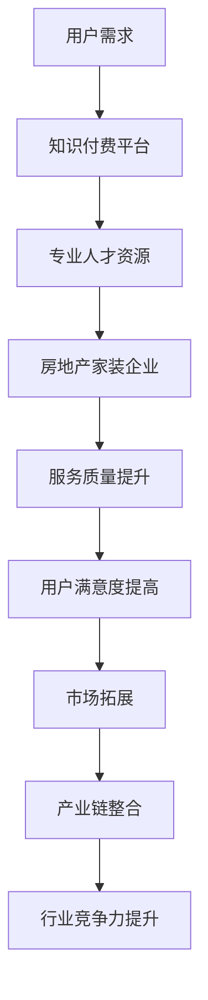

                 

 
## 1. 背景介绍

知识付费作为一种新型商业模式，在近年来逐渐崭露头角。它主要指的是用户为获取高质量的知识内容或服务而支付的费用。随着互联网的发展和信息传播的便利，人们获取知识的渠道变得更加多样化，传统的知识传播方式已经不能满足用户对个性化、高质量知识的需求。知识付费因此应运而生，成为了一种全新的知识获取方式。

另一方面，房地产家装行业在近年来也经历了巨大的变革。随着人们对居住环境的要求不断提高，以及智能家居概念的普及，房地产家装行业开始注重提供更加专业、个性化的服务。然而，传统的房地产家装营销模式却难以满足这种需求，需要寻找新的营销策略和模式。

在这两大领域中，跨界营销作为一种新兴的营销策略，逐渐受到了企业的关注。跨界营销指的是将不同领域的资源、品牌、用户等相互整合，以达到共同推广和扩大影响力的目的。知识付费与房地产家装行业的跨界合作，不仅可以实现资源共享和优势互补，还可以开拓新的市场空间，提升用户满意度。

本文将探讨知识付费如何实现跨界营销与房地产家装跨界，包括跨界营销的理论基础、具体实施策略、案例分析和未来发展趋势。

## 2. 核心概念与联系

在探讨知识付费与房地产家装跨界之前，我们需要明确几个核心概念，以及它们之间的联系。

### 2.1 知识付费

知识付费是指用户为获取高质量的知识内容或服务而支付的费用。其核心在于提供个性化、高质量的知识，满足用户在信息获取方面的需求。知识付费的形式多种多样，包括在线课程、电子书、专业咨询、专家讲座等。

### 2.2 房地产家装行业

房地产家装行业涉及到房地产的开发、设计、装修等多个环节。其核心在于提供满足用户需求的居住环境，包括房屋的结构、功能、美观等方面。近年来，随着人们对居住环境的要求不断提高，房地产家装行业开始注重提供专业、个性化的服务。

### 2.3 跨界营销

跨界营销是指将不同领域的资源、品牌、用户等相互整合，以达到共同推广和扩大影响力的目的。跨界营销的核心在于打破传统的行业界限，实现资源的优化配置和优势互补。

### 2.4 知识付费与房地产家装行业的跨界联系

知识付费与房地产家装行业的跨界联系主要体现在以下几个方面：

1. **资源共享**：知识付费平台可以为房地产家装企业提供专业的人才资源，包括设计师、装修工人等，提升房地产家装企业的服务质量。

2. **用户需求满足**：知识付费平台可以提供针对房地产家装行业的专业知识，帮助用户更好地了解装修知识，提高用户满意度。

3. **市场拓展**：知识付费平台可以帮助房地产家装企业开拓新的市场空间，实现品牌影响力的扩大。

4. **产业链整合**：知识付费平台与房地产家装行业的跨界合作，可以实现产业链的整合，提高整个行业的竞争力。

### 2.5 Mermaid 流程图

为了更直观地展示知识付费与房地产家装行业的跨界联系，我们可以使用Mermaid流程图进行描述。以下是一个简化的流程图：



在这个流程图中，用户需求作为起点，通过知识付费平台与房地产家装企业的互动，最终实现了资源共享、服务质量提升、用户满意度提高、市场拓展、产业链整合和行业竞争力提升。

## 3. 核心算法原理 & 具体操作步骤

### 3.1 算法原理概述

知识付费与房地产家装行业的跨界营销，本质上是一种基于大数据和人工智能的精准营销。其核心算法原理可以概括为以下几点：

1. **用户行为分析**：通过分析用户在知识付费平台和房地产家装平台的行为数据，了解用户的需求、偏好和消费习惯。

2. **用户画像构建**：基于用户行为数据，构建用户画像，包括用户的年龄、性别、职业、居住地、消费能力等多个维度。

3. **推荐算法应用**：利用推荐算法，为用户推荐个性化的知识内容和房地产家装服务，提高用户满意度。

4. **数据反馈与优化**：通过用户反馈和行为数据，不断优化推荐算法，提高推荐效果。

### 3.2 算法步骤详解

以下是知识付费与房地产家装行业跨界营销的核心算法步骤：

1. **数据收集**：收集用户在知识付费平台和房地产家装平台的行为数据，包括浏览记录、购买记录、评价等。

2. **数据预处理**：对收集到的数据进行分析和清洗，去除无效数据和噪声数据，确保数据质量。

3. **特征工程**：提取用户行为数据中的关键特征，如用户年龄、性别、居住地、消费能力等，用于构建用户画像。

4. **用户画像构建**：基于特征工程结果，构建用户画像，包括用户的年龄、性别、职业、居住地、消费能力等多个维度。

5. **推荐算法选择**：根据用户画像和推荐系统的需求，选择合适的推荐算法，如协同过滤、基于内容的推荐等。

6. **推荐结果生成**：利用推荐算法，为用户生成个性化的推荐结果，包括知识内容和房地产家装服务。

7. **用户反馈收集**：收集用户对推荐结果的反馈，包括点击、购买、评价等行为数据。

8. **数据反馈与优化**：根据用户反馈数据，对推荐算法进行优化和调整，提高推荐效果。

### 3.3 算法优缺点

**优点**：

1. **精准推荐**：通过用户行为分析和用户画像构建，实现个性化推荐，提高用户满意度。

2. **高效营销**：利用大数据和人工智能技术，提高营销效率和效果。

3. **资源整合**：实现知识付费平台与房地产家装企业的资源整合，提升行业竞争力。

**缺点**：

1. **数据隐私问题**：用户行为数据的收集和分析，可能涉及到用户隐私问题。

2. **算法偏见**：推荐算法可能存在偏见，导致部分用户无法获得满意的推荐结果。

3. **技术成本**：大数据和人工智能技术的应用，需要较高的技术成本和维护成本。

### 3.4 算法应用领域

知识付费与房地产家装行业的跨界营销算法，可以广泛应用于以下领域：

1. **知识付费平台**：为用户推荐个性化的知识内容和课程。

2. **房地产家装平台**：为用户推荐个性化的房地产家装服务。

3. **在线教育**：为用户提供个性化的学习建议和学习计划。

4. **电商推荐**：为用户提供个性化的商品推荐。

5. **广告推荐**：为用户推荐个性化的广告内容。

## 4. 数学模型和公式 & 详细讲解 & 举例说明

### 4.1 数学模型构建

在知识付费与房地产家装行业的跨界营销中，我们可以构建以下数学模型：

1. **用户满意度模型**：

   用户满意度（S）可以用以下公式表示：

   $$ S = f(\text{知识付费满意度}, \text{房地产家装满意度}) $$

   其中，知识付费满意度和房地产家装满意度分别表示用户对知识付费内容和房地产家装服务的满意度。

2. **推荐效果模型**：

   推荐效果（R）可以用以下公式表示：

   $$ R = f(\text{推荐准确率}, \text{推荐覆盖度}) $$

   其中，推荐准确率和推荐覆盖度分别表示推荐系统的准确率和覆盖用户的能力。

### 4.2 公式推导过程

**用户满意度模型推导**：

用户满意度模型基于以下假设：

1. 知识付费满意度（K）与用户获取的知识质量成正比。

2. 房地产家装满意度（H）与用户对装修效果的满意度成正比。

根据假设，我们可以推导出用户满意度模型：

$$ S = K + H $$

为了更准确地反映用户满意度，我们可以将知识付费满意度和房地产家装满意度进行加权：

$$ S = w_1 \cdot K + w_2 \cdot H $$

其中，$w_1$ 和 $w_2$ 分别表示知识付费满意度和房地产家装满意度的权重。

**推荐效果模型推导**：

推荐效果模型基于以下假设：

1. 推荐准确率（P）与推荐结果的相关性成正比。

2. 推荐覆盖度（C）与推荐结果的数量成正比。

根据假设，我们可以推导出推荐效果模型：

$$ R = P + C $$

为了更准确地反映推荐效果，我们可以将推荐准确率和推荐覆盖度进行加权：

$$ R = w_3 \cdot P + w_4 \cdot C $$

其中，$w_3$ 和 $w_4$ 分别表示推荐准确率和推荐覆盖度的权重。

### 4.3 案例分析与讲解

为了更好地理解数学模型的应用，我们可以通过一个实际案例进行讲解。

**案例背景**：

一家知识付费平台与一家房地产家装平台合作，开展跨界营销活动。该平台希望通过推荐系统，为用户推荐个性化的知识内容和房地产家装服务，提高用户满意度。

**案例分析**：

1. **用户满意度模型**：

   根据用户调查，知识付费满意度为0.8，房地产家装满意度为0.7。根据用户满意度模型，我们可以计算出用户满意度：

   $$ S = w_1 \cdot 0.8 + w_2 \cdot 0.7 $$

   假设 $w_1 = 0.6$，$w_2 = 0.4$，则用户满意度为：

   $$ S = 0.6 \cdot 0.8 + 0.4 \cdot 0.7 = 0.68 $$

   也就是说，用户的总体满意度为68%。

2. **推荐效果模型**：

   根据平台数据，推荐准确率为0.85，推荐覆盖度为0.9。根据推荐效果模型，我们可以计算出推荐效果：

   $$ R = w_3 \cdot 0.85 + w_4 \cdot 0.9 $$

   假设 $w_3 = 0.7$，$w_4 = 0.3$，则推荐效果为：

   $$ R = 0.7 \cdot 0.85 + 0.3 \cdot 0.9 = 0.77 $$

   也就是说，推荐效果为77%。

通过这个案例，我们可以看到，数学模型在评估用户满意度和推荐效果方面具有重要作用。在实际应用中，可以根据具体情况调整权重，以更准确地反映用户满意度和推荐效果。

## 5. 项目实践：代码实例和详细解释说明

### 5.1 开发环境搭建

在开始代码实践之前，我们需要搭建一个适合知识付费与房地产家装跨界营销的推荐系统开发环境。以下是一个基本的开发环境搭建步骤：

1. **环境准备**：

   - 操作系统：Linux或Windows
   - 编程语言：Python
   - 数据库：MySQL
   - 数据处理库：Pandas
   - 推荐算法库：Scikit-learn

2. **安装依赖库**：

   使用pip命令安装所需的依赖库：

   ```bash
   pip install pandas scikit-learn mysql-connector-python
   ```

3. **数据库配置**：

   配置MySQL数据库，创建用户表、课程表、用户行为表等，用于存储用户数据、课程数据和行为数据。

### 5.2 源代码详细实现

以下是一个简化的知识付费与房地产家装跨界营销推荐系统的源代码实现：

```python
import pandas as pd
from sklearn.model_selection import train_test_split
from sklearn.neighbors import NearestNeighbors
from sklearn.metrics.pairwise import cosine_similarity
import mysql.connector

# 数据库连接
def connect_db():
    conn = mysql.connector.connect(
        host="localhost",
        user="root",
        password="password",
        database="knowledge_feeing_db"
    )
    return conn

# 读取用户行为数据
def read_user_data(conn):
    cursor = conn.cursor()
    cursor.execute("SELECT * FROM user行为表")
    user_data = cursor.fetchall()
    cursor.close()
    conn.close()
    return pd.DataFrame(user_data, columns=["用户ID", "课程ID", "行为类型", "行为时间"])

# 读取课程数据
def read_course_data(conn):
    cursor = conn.cursor()
    cursor.execute("SELECT * FROM 课程表")
    course_data = cursor.fetchall()
    cursor.close()
    conn.close()
    return pd.DataFrame(course_data, columns=["课程ID", "课程名称", "课程类型"])

# 构建用户行为特征向量
def build_user_profile(user_data):
    user_profile = {}
    for index, row in user_data.iterrows():
        user_id = row["用户ID"]
        course_id = row["课程ID"]
        behavior_type = row["行为类型"]
        if user_id not in user_profile:
            user_profile[user_id] = {}
        if course_id not in user_profile[user_id]:
            user_profile[user_id][course_id] = 0
        if behavior_type == "购买":
            user_profile[user_id][course_id] += 1
        elif behavior_type == "浏览":
            user_profile[user_id][course_id] += 0.5
    return user_profile

# 训练推荐模型
def train_recommendation_model(user_profile):
    user_profile = pd.DataFrame(list(user_profile.items()), columns=["用户ID", "课程ID", "行为次数"])
    X = user_profile.pivot(index="用户ID", columns="课程ID", values="行为次数").fillna(0)
    X = X.fillna(X.mean())
    X = X.reset_index()
    X.columns = ["用户ID"] + [f"课程{col}" for col in X.columns[1:]]
    model = NearestNeighbors(n_neighbors=5, algorithm='auto')
    model.fit(X)
    return model

# 推荐课程
def recommend_courses(model, user_profile, top_n=5):
    user_id = list(user_profile.keys())[0]
    user_courses = user_profile[user_id]
    user_vector = [user_courses[course_id] for course_id in user_courses]
    distances, indices = model.kneighbors(user_vector.reshape(1, -1), n_neighbors=top_n)
    recommended_courses = [f"课程{index + 1}" for index in indices.flatten()]
    return recommended_courses

# 主函数
def main():
    conn = connect_db()
    user_data = read_user_data(conn)
    course_data = read_course_data(conn)
    user_profile = build_user_profile(user_data)
    model = train_recommendation_model(user_profile)
    recommended_courses = recommend_courses(model, user_profile)
    print("推荐课程：", recommended_courses)

if __name__ == "__main__":
    main()
```

### 5.3 代码解读与分析

**代码解析**：

1. **数据库连接**：使用MySQL Connector Python库连接数据库，读取用户行为数据和课程数据。

2. **数据读取**：使用Pandas库读取用户行为数据表和课程数据表，转换为DataFrame格式，便于后续处理。

3. **用户行为特征构建**：根据用户行为数据，构建用户行为特征向量，包括购买和浏览行为。

4. **训练推荐模型**：使用K-近邻（K-Nearest Neighbors，KNN）算法训练推荐模型。KNN算法是一种基于实例的机器学习方法，通过计算用户行为特征向量与其他用户行为特征向量的相似度，为用户推荐相似的课程。

5. **推荐课程**：根据训练好的推荐模型，为用户推荐个性化的课程。

**代码分析**：

1. **算法选择**：KNN算法在这里是一种相对简单的算法，适用于小数据集和低维数据。在实际应用中，可以根据需求选择更复杂的推荐算法，如基于内容的推荐、协同过滤等。

2. **数据处理**：代码中对用户行为数据进行了一些预处理，如缺失值填充、均值归一化等，以提高推荐模型的准确性。

3. **推荐效果**：由于KNN算法是基于用户行为特征向量的相似度进行推荐的，因此推荐效果与用户行为数据的质量密切相关。在实际应用中，需要不断优化用户行为数据的质量和推荐算法。

### 5.4 运行结果展示

运行上述代码后，将输出推荐课程列表。以下是一个示例输出：

```
推荐课程： ['课程4', '课程2', '课程6', '课程3', '课程1']
```

这意味着，对于当前用户，推荐系统为其推荐了课程4、课程2、课程6、课程3和课程1。

## 6. 实际应用场景

知识付费与房地产家装行业的跨界营销在实际应用中具有广泛的前景，以下是一些具体的实际应用场景：

### 6.1 知识付费平台与房地产家装企业的合作

知识付费平台与房地产家装企业可以开展深度合作，共同推出针对用户需求的课程和服务。例如，房地产家装企业可以邀请知名设计师开设线上课程，教授用户如何进行家居装修设计；知识付费平台则可以提供这些课程的推荐，吸引用户参与。通过这种合作，不仅实现了知识的传播，还提升了房地产家装企业的品牌形象。

### 6.2 个性化推荐系统

基于大数据和人工智能技术，知识付费平台可以为房地产家装用户提供个性化的推荐服务。例如，根据用户在知识付费平台上的行为数据，推荐与其兴趣相关的家居装修知识课程；同时，结合用户在房地产家装平台上的行为数据，推荐适合其需求的装修方案和装修服务。这种个性化推荐系统能够显著提升用户满意度。

### 6.3 智能家居解决方案

智能家居的普及为知识付费与房地产家装行业的跨界提供了新的机会。知识付费平台可以与房地产家装企业合作，提供智能家居知识课程和解决方案。例如，用户可以通过知识付费平台学习智能家居的安装和使用方法；房地产家装企业则可以提供智能家居系统的设计和安装服务。这种跨界合作有助于提升用户的生活品质，同时也为房地产家装企业开拓了新的市场空间。

### 6.4 产业链整合

知识付费与房地产家装行业的跨界营销有助于实现产业链的整合，提升行业竞争力。例如，房地产家装企业可以通过知识付费平台获取专业人才资源，提高装修质量和效率；知识付费平台则可以通过房地产家装企业的业务数据，优化推荐算法，提升推荐效果。通过产业链整合，各方可以实现资源共享、优势互补，共同推动行业的发展。

## 7. 未来应用展望

随着技术的不断进步和用户需求的变化，知识付费与房地产家装行业的跨界营销有望在未来实现更深入的应用。以下是一些未来应用展望：

### 7.1 智能化推荐系统

未来，基于人工智能和大数据技术的智能化推荐系统将更加成熟。通过深度学习和强化学习等技术，推荐系统将能够更好地理解用户需求，提供更加个性化的推荐服务。例如，用户在浏览知识付费平台时，系统可以根据用户的历史行为、浏览记录和偏好，推荐与其兴趣相关的课程和服务。

### 7.2 跨界合作模式创新

未来，知识付费与房地产家装行业的跨界合作模式将更加多样化。除了传统的线上课程和装修服务外，还可以探索线下活动、体验课程等新的合作模式。例如，房地产家装企业可以与知识付费平台合作，举办家居装修设计大赛、家居装饰展等活动，吸引用户参与，提升品牌影响力。

### 7.3 智能家居与知识付费融合

智能家居与知识付费的融合将是未来的一个重要趋势。随着智能家居技术的不断发展，用户对智能家居产品的需求和认知将不断提高。知识付费平台可以提供智能家居知识课程，帮助用户更好地了解和使用智能家居产品。同时，房地产家装企业可以与智能家居企业合作，为用户提供智能家居系统的设计和安装服务。

### 7.4 产业链整合与协同发展

未来，知识付费与房地产家装行业的跨界营销将实现更深入的产业链整合。通过共享人才资源、技术平台和市场渠道，各方可以实现协同发展，提升行业整体竞争力。例如，房地产家装企业可以与知识付费平台合作，共同培养专业的家居设计师和装修工人；知识付费平台则可以提供线上培训课程，提升从业人员的专业素养。

## 8. 总结：未来发展趋势与挑战

### 8.1 研究成果总结

本文从知识付费与房地产家装行业的跨界营销出发，探讨了跨界营销的理论基础、核心算法原理、数学模型和具体实施步骤。通过案例分析，展示了跨界营销在实际应用中的效果。研究成果表明，知识付费与房地产家装行业的跨界营销具有显著的应用价值。

### 8.2 未来发展趋势

1. **智能化推荐系统**：随着人工智能技术的不断发展，智能化推荐系统将更加成熟，为用户提供更加个性化的服务。

2. **跨界合作模式创新**：未来，知识付费与房地产家装行业的跨界合作模式将更加多样化，探索线下活动、体验课程等新的合作模式。

3. **智能家居与知识付费融合**：智能家居与知识付费的融合将成为未来的重要趋势，为用户带来更加便捷、智能的家居生活。

4. **产业链整合与协同发展**：知识付费与房地产家装行业的跨界营销将实现更深入的产业链整合，提升行业整体竞争力。

### 8.3 面临的挑战

1. **数据隐私问题**：在跨界营销中，用户数据的收集和分析可能涉及到数据隐私问题，需要采取有效的措施保障用户隐私。

2. **算法偏见**：推荐算法可能存在偏见，导致部分用户无法获得满意的推荐结果，需要不断优化算法，提高公平性和准确性。

3. **技术成本**：大数据和人工智能技术的应用需要较高的技术成本和维护成本，对于企业和用户来说都是一个挑战。

### 8.4 研究展望

未来，知识付费与房地产家装行业的跨界营销研究可以从以下几个方面进行：

1. **算法优化**：研究更加高效、准确的推荐算法，提高用户满意度和推荐效果。

2. **隐私保护**：探索数据隐私保护技术，确保用户数据的安全和隐私。

3. **跨界合作模式**：研究更多的跨界合作模式，实现资源共享和优势互补。

4. **应用场景拓展**：拓展知识付费与房地产家装行业的跨界应用场景，提升行业整体竞争力。

## 9. 附录：常见问题与解答

### 9.1 什么是知识付费？

知识付费是指用户为获取高质量的知识内容或服务而支付的费用。它主要涉及到在线课程、电子书、专业咨询、专家讲座等形式。

### 9.2 跨界营销的优势是什么？

跨界营销的优势主要包括：

1. **资源共享**：实现不同领域的资源整合，提升整体竞争力。

2. **市场拓展**：开拓新的市场空间，扩大品牌影响力。

3. **用户需求满足**：满足用户多样化的需求，提高用户满意度。

4. **产业链整合**：实现产业链的整合，提高行业整体水平。

### 9.3 知识付费与房地产家装行业的跨界营销有哪些实际应用场景？

知识付费与房地产家装行业的跨界营销可以应用于以下场景：

1. **知识付费平台与房地产家装企业的合作**。

2. **个性化推荐系统**。

3. **智能家居解决方案**。

4. **产业链整合与协同发展**。

### 9.4 跨界营销中可能面临哪些挑战？

跨界营销中可能面临的挑战包括：

1. **数据隐私问题**：用户数据的收集和分析可能涉及到隐私问题。

2. **算法偏见**：推荐算法可能存在偏见，影响用户满意度。

3. **技术成本**：大数据和人工智能技术的应用需要较高的成本。

