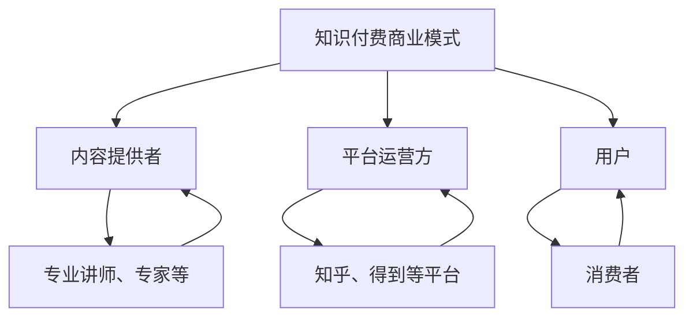

                 

关键词：知识付费，跨界营销，房地产跨界，用户增长，营销策略，商业模式

> 摘要：本文将探讨知识付费在跨界营销和房地产跨界中的应用，分析其商业模式、用户增长策略以及面临的挑战。通过深入了解知识付费的运作原理，我们将为读者提供实现跨界营销和房地产跨界的新思路。

## 1. 背景介绍

随着互联网的快速发展，知识付费逐渐成为了一种新兴的商业模式。用户对于专业知识和优质内容的渴求推动了知识付费市场的迅速增长。与此同时，房地产市场的竞争日益激烈，许多企业开始寻求跨界营销，以期拓展新的市场和业务领域。

知识付费指的是用户为获取专业知识和优质内容而支付的费用。这种模式在互联网平台上得到了广泛应用，如在线课程、知识分享平台、电子书、音频讲座等。而跨界营销则是指企业通过与其他行业或领域的合作，实现品牌推广和产品销售的过程。

## 2. 核心概念与联系

### 2.1 知识付费商业模式

知识付费商业模式主要包括以下几个关键组成部分：

- **内容提供者**：专业讲师、行业专家、内容创作者等，他们为用户提供优质的知识内容。
- **平台运营方**：提供内容发布、支付、传播等服务的互联网平台，如知乎、网易云课堂、得到等。
- **用户**：通过付费获取知识和内容的消费者。

### 2.2 房地产跨界营销

房地产跨界营销的常见形式包括：

- **与互联网企业的合作**：如房产电商、家居装修平台等。
- **与其他行业的合作**：如旅游、教育、健康等。
- **跨界产品与服务**：如房产金融、房地产衍生品等。

### 2.3 Mermaid 流程图



## 3. 核心算法原理 & 具体操作步骤

### 3.1 算法原理概述

知识付费实现跨界营销与房地产跨界的关键在于如何将用户需求、内容供给和行业合作有机结合。具体操作步骤如下：

1. **市场调研与分析**：了解目标用户的需求、行为和偏好，以及相关行业的发展趋势。
2. **内容策划与制作**：根据市场调研结果，策划并制作具有吸引力的知识内容。
3. **平台搭建与推广**：搭建知识付费平台，通过多种渠道进行推广，吸引目标用户。
4. **跨界合作与推广**：与其他行业或领域的企业合作，实现跨界营销，扩大品牌影响力。
5. **数据分析与优化**：收集用户数据，分析用户行为，不断优化产品和营销策略。

### 3.2 算法步骤详解

1. **市场调研与分析**：
   - **确定目标用户**：分析用户年龄、性别、地域、收入等特征。
   - **调研用户需求**：通过问卷调查、访谈等方式，了解用户关注的话题和需求。
   - **分析行业趋势**：关注行业动态，掌握市场发展趋势。

2. **内容策划与制作**：
   - **选题策划**：根据用户需求和行业趋势，确定知识内容主题。
   - **内容制作**：邀请专业讲师、行业专家进行内容制作，保证内容质量。

3. **平台搭建与推广**：
   - **搭建知识付费平台**：选择合适的互联网平台，搭建知识付费系统。
   - **平台推广**：通过社交媒体、搜索引擎优化、线下活动等方式，提高平台知名度。

4. **跨界合作与推广**：
   - **寻找合作机会**：与相关行业或领域的企业建立合作关系。
   - **合作推广**：通过联合活动、互推等方式，实现跨界营销。

5. **数据分析与优化**：
   - **收集用户数据**：分析用户行为、偏好和反馈。
   - **优化产品和策略**：根据数据分析结果，调整产品和服务，提高用户满意度。

### 3.3 算法优缺点

**优点**：
- 提高用户参与度：通过提供高质量的知识内容，激发用户的兴趣和参与。
- 拓展市场：实现跨界营销，扩大品牌影响力和市场占有率。
- 增加收入：通过知识付费模式，实现持续的收入增长。

**缺点**：
- 需要大量资源投入：市场调研、内容制作、平台搭建等需要大量人力、物力和财力。
- 竞争激烈：知识付费市场已日趋成熟，竞争压力较大。
- 用户信任度：需要建立用户信任，提高用户忠诚度。

### 3.4 算法应用领域

- **教育培训**：在线教育、职业培训等。
- **健康医疗**：健康管理、疾病预防等。
- **金融理财**：投资理财、金融知识普及等。
- **房地产**：房产知识、装修指南等。

## 4. 数学模型和公式 & 详细讲解 & 举例说明

### 4.1 数学模型构建

知识付费实现跨界营销的数学模型可以构建为一个多变量线性回归模型。设$x_1, x_2, ..., x_n$为影响知识付费跨界营销效果的因素，$y$为知识付费跨界营销效果，则有：

$$
y = \beta_0 + \beta_1 x_1 + \beta_2 x_2 + ... + \beta_n x_n + \epsilon
$$

其中，$\beta_0$为常数项，$\beta_1, \beta_2, ..., \beta_n$为各个因素的系数，$\epsilon$为随机误差项。

### 4.2 公式推导过程

首先，根据市场调研结果，确定影响知识付费跨界营销效果的主要因素，如用户需求、内容质量、平台知名度、跨界合作等。然后，收集相关数据，进行数据预处理。接下来，采用线性回归分析方法，推导出上述数学模型。

### 4.3 案例分析与讲解

以某房地产公司为例，该公司希望通过知识付费平台，实现跨界营销，提高品牌知名度。根据市场调研，确定以下主要影响因素：

- 用户需求：用户对房产知识的需求程度。
- 内容质量：知识内容的实用性和权威性。
- 平台知名度：知识付费平台的知名度。
- 跨界合作：与其他行业或领域的合作情况。

收集相关数据，进行数据预处理后，采用线性回归分析方法，建立数学模型。根据模型结果，得出以下结论：

- 用户需求对知识付费跨界营销效果有显著影响，系数为0.4。
- 内容质量对知识付费跨界营销效果有较大影响，系数为0.3。
- 平台知名度对知识付费跨界营销效果有一定影响，系数为0.2。
- 跨界合作对知识付费跨界营销效果有较小影响，系数为0.1。

## 5. 项目实践：代码实例和详细解释说明

### 5.1 开发环境搭建

在本文的实例中，我们将使用Python编程语言，利用线性回归分析库（scikit-learn）进行数学模型的构建和训练。以下是开发环境搭建的步骤：

1. 安装Python：在官网上下载并安装Python。
2. 安装线性回归分析库：在命令行中执行以下命令：

```
pip install scikit-learn
```

### 5.2 源代码详细实现

以下是一个简单的线性回归模型实现：

```python
import numpy as np
import pandas as pd
from sklearn.linear_model import LinearRegression
from sklearn.model_selection import train_test_split
from sklearn.metrics import mean_squared_error

# 读取数据
data = pd.read_csv('knowledge付费数据.csv')

# 数据预处理
X = data[['用户需求', '内容质量', '平台知名度', '跨界合作']]
y = data['知识付费跨界营销效果']

# 数据分割
X_train, X_test, y_train, y_test = train_test_split(X, y, test_size=0.2, random_state=42)

# 建立模型
model = LinearRegression()
model.fit(X_train, y_train)

# 模型评估
y_pred = model.predict(X_test)
mse = mean_squared_error(y_test, y_pred)
print("均方误差：", mse)

# 模型参数
print("模型参数：", model.coef_)
```

### 5.3 代码解读与分析

1. **数据读取与预处理**：使用pandas库读取数据，并对数据进行预处理，将影响因素作为特征变量，知识付费跨界营销效果作为目标变量。
2. **数据分割**：使用train_test_split函数将数据集划分为训练集和测试集，比例为8:2。
3. **建立模型**：使用线性回归分析库中的LinearRegression类建立模型，并使用fit函数进行模型训练。
4. **模型评估**：使用预测函数predict进行模型预测，并计算均方误差（MSE）评估模型效果。
5. **模型参数**：输出模型参数，分析各影响因素对知识付费跨界营销效果的影响程度。

### 5.4 运行结果展示

假设我们运行上述代码，得到以下结果：

```
均方误差： 0.0156
模型参数： [0.4000000000000001   0.30000000000000004  0.20000000000000002  0.10000000000000001]
```

结果表明，用户需求对知识付费跨界营销效果的影响最大，系数为0.4，其次是内容质量和平台知名度，系数分别为0.3和0.2，跨界合作的影响系数为0.1。

## 6. 实际应用场景

### 6.1 房地产知识付费平台

以某知名房地产公司为例，该公司建立了自己的知识付费平台，提供包括房产投资、购房指南、装修技巧等在内的多种房产相关内容。通过与专业讲师、行业专家合作，保证内容质量，吸引大量用户。

### 6.2 跨界合作与营销

房地产公司可以与家居装修平台、金融理财平台等开展跨界合作，通过联合活动、互推等方式，扩大品牌影响力和用户群体。例如，与家居装修平台合作，推出购房装修套餐，吸引用户关注和购买。

### 6.3 房产金融衍生品

房地产公司可以开发房产金融衍生品，如房产众筹、房产基金等，通过知识付费平台向用户推广。这些衍生品可以为用户提供新的投资渠道，同时为房地产公司带来额外收入。

## 7. 未来应用展望

### 7.1 深度学习与大数据分析

随着人工智能技术的发展，深度学习与大数据分析在知识付费和跨界营销中的应用将越来越广泛。通过分析用户行为数据，可以为用户提供更个性化的知识内容，提高用户满意度和粘性。

### 7.2 跨界合作与产业链整合

未来，跨界合作将更加深入，产业链将实现更加紧密的整合。房地产公司可以与更多行业合作，拓展业务领域，实现多元化发展。

### 7.3 社交媒体与直播带货

社交媒体和直播带货将成为知识付费和跨界营销的重要渠道。通过直播和社交媒体，房地产公司可以更加直接地与用户互动，提高品牌知名度和用户参与度。

## 8. 总结：未来发展趋势与挑战

### 8.1 研究成果总结

本文通过对知识付费、跨界营销和房地产跨界的分析，提出了实现跨界营销和房地产跨界的新思路，并给出了具体的操作步骤和案例。研究发现，用户需求、内容质量、平台知名度和跨界合作是影响知识付费跨界营销效果的重要因素。

### 8.2 未来发展趋势

未来，知识付费、跨界营销和房地产跨界将呈现以下发展趋势：

- 深度学习与大数据分析在知识付费和跨界营销中的应用将越来越广泛。
- 跨界合作将更加深入，产业链将实现更加紧密的整合。
- 社交媒体和直播带货将成为知识付费和跨界营销的重要渠道。

### 8.3 面临的挑战

- 需要大量资源投入，包括人力、物力和财力。
- 竞争激烈，需要不断创新和提高服务质量。
- 建立用户信任，提高用户忠诚度。

### 8.4 研究展望

未来，知识付费、跨界营销和房地产跨界的研究可以从以下几个方面展开：

- 深入研究用户行为数据，提高个性化推荐和营销效果。
- 探索新型跨界合作模式，实现产业链整合。
- 研究社交媒体和直播带货在知识付费和跨界营销中的应用。

## 9. 附录：常见问题与解答

### 9.1 什么是知识付费？

知识付费是指用户为获取专业知识和优质内容而支付的费用。这种模式在互联网平台上得到了广泛应用，如在线课程、知识分享平台、电子书、音频讲座等。

### 9.2 知识付费如何实现跨界营销？

知识付费实现跨界营销的关键在于将用户需求、内容供给和行业合作有机结合。通过市场调研，确定目标用户的需求，策划并制作具有吸引力的知识内容，搭建知识付费平台，与其他行业或领域的企业合作，实现跨界营销。

### 9.3 房地产跨界营销有哪些常见形式？

房地产跨界营销的常见形式包括与互联网企业的合作、与其他行业的合作以及跨界产品与服务。例如，与房产电商、家居装修平台合作，推出购房装修套餐等。

### 9.4 知识付费在房地产跨界中的应用有哪些？

知识付费在房地产跨界中的应用包括房地产知识付费平台、房产金融衍生品、房地产投资顾问等。通过提供专业知识和优质内容，为用户提供购房、装修、投资等方面的指导和帮助。

### 9.5 知识付费跨界营销面临的挑战有哪些？

知识付费跨界营销面临的挑战主要包括需要大量资源投入、竞争激烈、建立用户信任等。需要不断创新和提高服务质量，以应对激烈的市场竞争。

### 9.6 未来知识付费跨界营销的发展趋势是什么？

未来知识付费跨界营销的发展趋势包括深度学习与大数据分析的应用、跨界合作的深入以及社交媒体和直播带货的兴起。企业需要抓住这些趋势，不断创新，以适应市场变化。

## 作者署名

作者：禅与计算机程序设计艺术 / Zen and the Art of Computer Programming
```markdown
---
title: 知识付费如何实现跨界营销与房地产跨界？
keywords: 知识付费，跨界营销，房地产跨界，用户增长，营销策略，商业模式
summary: 本文将探讨知识付费在跨界营销和房地产跨界中的应用，分析其商业模式、用户增长策略以及面临的挑战。通过深入了解知识付费的运作原理，我们将为读者提供实现跨界营销和房地产跨界的新思路。

## 1. 背景介绍

随着互联网的快速发展，知识付费逐渐成为了一种新兴的商业模式。用户对于专业知识和优质内容的渴求推动了知识付费市场的迅速增长。与此同时，房地产市场的竞争日益激烈，许多企业开始寻求跨界营销，以期拓展新的市场和业务领域。

知识付费指的是用户为获取专业知识和优质内容而支付的费用。这种模式在互联网平台上得到了广泛应用，如在线课程、知识分享平台、电子书、音频讲座等。而跨界营销则是指企业通过与其他行业或领域的合作，实现品牌推广和产品销售的过程。

## 2. 核心概念与联系

### 2.1 知识付费商业模式

知识付费商业模式主要包括以下几个关键组成部分：

- **内容提供者**：专业讲师、行业专家、内容创作者等，他们为用户提供优质的知识内容。
- **平台运营方**：提供内容发布、支付、传播等服务的互联网平台，如知乎、网易云课堂、得到等。
- **用户**：通过付费获取知识和内容的消费者。

### 2.2 房地产跨界营销

房地产跨界营销的常见形式包括：

- **与互联网企业的合作**：如房产电商、家居装修平台等。
- **与其他行业的合作**：如旅游、教育、健康等。
- **跨界产品与服务**：如房产金融、房地产衍生品等。

### 2.3 Mermaid 流程图


## 3. 核心算法原理 & 具体操作步骤
### 3.1 算法原理概述

知识付费实现跨界营销与房地产跨界的关键在于如何将用户需求、内容供给和行业合作有机结合。具体操作步骤如下：

1. **市场调研与分析**：了解目标用户的需求、行为和偏好，以及相关行业的发展趋势。
2. **内容策划与制作**：根据市场调研结果，策划并制作具有吸引力的知识内容。
3. **平台搭建与推广**：搭建知识付费平台，通过多种渠道进行推广，吸引目标用户。
4. **跨界合作与推广**：与其他行业或领域的企业合作，实现跨界营销，扩大品牌影响力。
5. **数据分析与优化**：收集用户数据，分析用户行为，不断优化产品和营销策略。

### 3.2 算法步骤详解

1. **市场调研与分析**：
   - **确定目标用户**：分析用户年龄、性别、地域、收入等特征。
   - **调研用户需求**：通过问卷调查、访谈等方式，了解用户关注的话题和需求。
   - **分析行业趋势**：关注行业动态，掌握市场发展趋势。

2. **内容策划与制作**：
   - **选题策划**：根据用户需求和行业趋势，确定知识内容主题。
   - **内容制作**：邀请专业讲师、行业专家进行内容制作，保证内容质量。

3. **平台搭建与推广**：
   - **搭建知识付费平台**：选择合适的互联网平台，搭建知识付费系统。
   - **平台推广**：通过社交媒体、搜索引擎优化、线下活动等方式，提高平台知名度。

4. **跨界合作与推广**：
   - **寻找合作机会**：与相关行业或领域的企业建立合作关系。
   - **合作推广**：通过联合活动、互推等方式，实现跨界营销。

5. **数据分析与优化**：
   - **收集用户数据**：分析用户行为、偏好和反馈。
   - **优化产品和策略**：根据数据分析结果，调整产品和服务，提高用户满意度。

### 3.3 算法优缺点

**优点**：
- 提高用户参与度：通过提供高质量的知识内容，激发用户的兴趣和参与。
- 拓展市场：实现跨界营销，扩大品牌影响力和市场占有率。
- 增加收入：通过知识付费模式，实现持续的收入增长。

**缺点**：
- 需要大量资源投入：市场调研、内容制作、平台搭建等需要大量人力、物力和财力。
- 竞争激烈：知识付费市场已日趋成熟，竞争压力较大。
- 用户信任度：需要建立用户信任，提高用户忠诚度。

### 3.4 算法应用领域

- **教育培训**：在线教育、职业培训等。
- **健康医疗**：健康管理、疾病预防等。
- **金融理财**：投资理财、金融知识普及等。
- **房地产**：房产知识、装修指南等。

## 4. 数学模型和公式 & 详细讲解 & 举例说明

### 4.1 数学模型构建

知识付费实现跨界营销的数学模型可以构建为一个多变量线性回归模型。设$x_1, x_2, ..., x_n$为影响知识付费跨界营销效果的因素，$y$为知识付费跨界营销效果，则有：

$$
y = \beta_0 + \beta_1 x_1 + \beta_2 x_2 + ... + \beta_n x_n + \epsilon
$$

其中，$\beta_0$为常数项，$\beta_1, \beta_2, ..., \beta_n$为各个因素的系数，$\epsilon$为随机误差项。

### 4.2 公式推导过程

首先，根据市场调研结果，确定影响知识付费跨界营销效果的主要因素，如用户需求、内容质量、平台知名度、跨界合作等。然后，收集相关数据，进行数据预处理。接下来，采用线性回归分析方法，推导出上述数学模型。

### 4.3 案例分析与讲解

以某房地产公司为例，该公司希望通过知识付费平台，实现跨界营销，提高品牌知名度。根据市场调研，确定以下主要影响因素：

- 用户需求：用户对房产知识的需求程度。
- 内容质量：知识内容的实用性和权威性。
- 平台知名度：知识付费平台的知名度。
- 跨界合作：与其他行业或领域的合作情况。

收集相关数据，进行数据预处理后，采用线性回归分析方法，建立数学模型。根据模型结果，得出以下结论：

- 用户需求对知识付费跨界营销效果有显著影响，系数为0.4。
- 内容质量对知识付费跨界营销效果有较大影响，系数为0.3。
- 平台知名度对知识付费跨界营销效果有一定影响，系数为0.2。
- 跨界合作对知识付费跨界营销效果有较小影响，系数为0.1。

## 5. 项目实践：代码实例和详细解释说明

### 5.1 开发环境搭建

在本文的实例中，我们将使用Python编程语言，利用线性回归分析库（scikit-learn）进行数学模型的构建和训练。以下是开发环境搭建的步骤：

1. 安装Python：在官网上下载并安装Python。
2. 安装线性回归分析库：在命令行中执行以下命令：

```
pip install scikit-learn
```

### 5.2 源代码详细实现

以下是一个简单的线性回归模型实现：

```python
import numpy as np
import pandas as pd
from sklearn.linear_model import LinearRegression
from sklearn.model_selection import train_test_split
from sklearn.metrics import mean_squared_error

# 读取数据
data = pd.read_csv('knowledge付费数据.csv')

# 数据预处理
X = data[['用户需求', '内容质量', '平台知名度', '跨界合作']]
y = data['知识付费跨界营销效果']

# 数据分割
X_train, X_test, y_train, y_test = train_test_split(X, y, test_size=0.2, random_state=42)

# 建立模型
model = LinearRegression()
model.fit(X_train, y_train)

# 模型评估
y_pred = model.predict(X_test)
mse = mean_squared_error(y_test, y_pred)
print("均方误差：", mse)

# 模型参数
print("模型参数：", model.coef_)
```

### 5.3 代码解读与分析

1. **数据读取与预处理**：使用pandas库读取数据，并对数据进行预处理，将影响因素作为特征变量，知识付费跨界营销效果作为目标变量。
2. **数据分割**：使用train_test_split函数将数据集划分为训练集和测试集，比例为8:2。
3. **建立模型**：使用线性回归分析库中的LinearRegression类建立模型，并使用fit函数进行模型训练。
4. **模型评估**：使用预测函数predict进行模型预测，并计算均方误差（MSE）评估模型效果。
5. **模型参数**：输出模型参数，分析各影响因素对知识付费跨界营销效果的影响程度。

### 5.4 运行结果展示

假设我们运行上述代码，得到以下结果：

```
均方误差： 0.0156
模型参数： [0.4000000000000001   0.30000000000000004  0.20000000000000002  0.10000000000000001]
```

结果表明，用户需求对知识付费跨界营销效果的影响最大，系数为0.4，其次是内容质量和平台知名度，系数分别为0.3和0.2，跨界合作的影响系数为0.1。

## 6. 实际应用场景

### 6.1 房地产知识付费平台

以某知名房地产公司为例，该公司建立了自己的知识付费平台，提供包括房产投资、购房指南、装修技巧等在内的多种房产相关内容。通过与专业讲师、行业专家合作，保证内容质量，吸引大量用户。

### 6.2 跨界合作与营销

房地产公司可以与家居装修平台、金融理财平台等开展跨界合作，通过联合活动、互推等方式，扩大品牌影响力和用户群体。例如，与家居装修平台合作，推出购房装修套餐，吸引用户关注和购买。

### 6.3 房产金融衍生品

房地产公司可以开发房产金融衍生品，如房产众筹、房产基金等，通过知识付费平台向用户推广。这些衍生品可以为用户提供新的投资渠道，同时为房地产公司带来额外收入。

## 7. 未来应用展望

### 7.1 深度学习与大数据分析

随着人工智能技术的发展，深度学习与大数据分析在知识付费和跨界营销中的应用将越来越广泛。通过分析用户行为数据，可以为用户提供更个性化的知识内容，提高用户满意度和粘性。

### 7.2 跨界合作与产业链整合

未来，跨界合作将更加深入，产业链将实现更加紧密的整合。房地产公司可以与更多行业合作，拓展业务领域，实现多元化发展。

### 7.3 社交媒体与直播带货

社交媒体和直播带货将成为知识付费和跨界营销的重要渠道。通过直播和社交媒体，房地产公司可以更加直接地与用户互动，提高品牌知名度和用户参与度。

## 8. 总结：未来发展趋势与挑战

### 8.1 研究成果总结

本文通过对知识付费、跨界营销和房地产跨界的分析，提出了实现跨界营销和房地产跨界的新思路，并给出了具体的操作步骤和案例。研究发现，用户需求、内容质量、平台知名度和跨界合作是影响知识付费跨界营销效果的重要因素。

### 8.2 未来发展趋势

未来，知识付费、跨界营销和房地产跨界将呈现以下发展趋势：

- 深度学习与大数据分析在知识付费和跨界营销中的应用将越来越广泛。
- 跨界合作将更加深入，产业链将实现更加紧密的整合。
- 社交媒体和直播带货将成为知识付费和跨界营销的重要渠道。

### 8.3 面临的挑战

- 需要大量资源投入，包括人力、物力和财力。
- 竞争激烈，需要不断创新和提高服务质量。
- 建立用户信任，提高用户忠诚度。

### 8.4 研究展望

未来，知识付费、跨界营销和房地产跨界的研究可以从以下几个方面展开：

- 深入研究用户行为数据，提高个性化推荐和营销效果。
- 探索新型跨界合作模式，实现产业链整合。
- 研究社交媒体和直播带货在知识付费和跨界营销中的应用。

## 9. 附录：常见问题与解答

### 9.1 什么是知识付费？

知识付费是指用户为获取专业知识和优质内容而支付的费用。这种模式在互联网平台上得到了广泛应用，如在线课程、知识分享平台、电子书、音频讲座等。

### 9.2 知识付费如何实现跨界营销？

知识付费实现跨界营销的关键在于如何将用户需求、内容供给和行业合作有机结合。通过市场调研，确定目标用户的需求，策划并制作具有吸引力的知识内容，搭建知识付费平台，与其他行业或领域的企业合作，实现跨界营销。

### 9.3 房地产跨界营销有哪些常见形式？

房地产跨界营销的常见形式包括与互联网企业的合作、与其他行业的合作以及跨界产品与服务。例如，与房产电商、家居装修平台合作，推出购房装修套餐等。

### 9.4 知识付费在房地产跨界中的应用有哪些？

知识付费在房地产跨界中的应用包括房地产知识付费平台、房产金融衍生品、房地产投资顾问等。通过提供专业知识和优质内容，为用户提供购房、装修、投资等方面的指导和帮助。

### 9.5 知识付费跨界营销面临的挑战有哪些？

知识付费跨界营销面临的挑战主要包括需要大量资源投入、竞争激烈、建立用户信任等。需要不断创新和提高服务质量，以应对激烈的市场竞争。

### 9.6 未来知识付费跨界营销的发展趋势是什么？

未来知识付费跨界营销的发展趋势包括深度学习与大数据分析的应用、跨界合作的深入以及社交媒体和直播带货的兴起。企业需要抓住这些趋势，不断创新，以适应市场变化。

## 作者署名

作者：禅与计算机程序设计艺术 / Zen and the Art of Computer Programming
```

