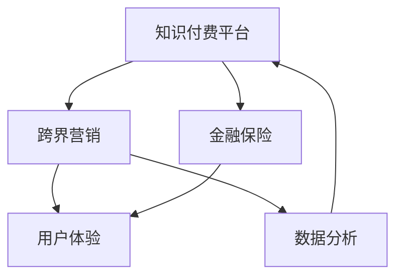

                 

关键词：知识付费、跨界营销、金融保险、创新模式、用户体验、数据分析、技术整合

摘要：本文将从知识付费的现状出发，探讨如何通过跨界营销与金融保险相结合的方式，实现知识付费的可持续发展。文章将详细分析跨界营销和金融保险在知识付费中的应用，探讨其背后的核心概念与原理，并提供实际案例和操作步骤。同时，还将对未来的发展趋势与挑战进行展望，为行业提供有益的参考。

## 1. 背景介绍

随着互联网的普及和数字化进程的加速，知识付费作为一种新兴的商业模式，逐渐成为人们获取知识和技能的重要途径。知识付费市场呈现出高速增长的态势，用户对于优质内容的需求日益增长。然而，面对激烈的市场竞争，如何实现知识付费的可持续发展成为行业关注的焦点。

跨界营销与金融保险作为两大热门领域，其与知识付费的结合具有巨大的潜力。跨界营销能够拓展知识付费的品牌影响力，提高用户粘性；而金融保险则为知识付费提供了风险保障和增值服务，从而提升用户体验。

本文旨在探讨知识付费如何实现跨界营销与金融保险的结合，为行业提供一种新的发展思路。

### 1.1 知识付费现状

知识付费是指用户通过支付一定费用，获取专业人士提供的知识、技能、经验等内容的服务。近年来，知识付费市场经历了快速的发展，主要表现在以下几个方面：

1. **用户规模持续扩大**：随着互联网普及率的提高，越来越多的用户开始接受知识付费模式，用户规模呈现爆发式增长。
2. **内容种类丰富多样**：从传统教育、职业培训到生活技能、兴趣爱好等，知识付费内容种类日益丰富，满足了不同用户的需求。
3. **平台竞争加剧**：知识付费平台如雨后春笋般涌现，各大平台通过内容、技术、服务等多方面的竞争，争夺市场份额。
4. **市场格局逐渐稳定**：随着市场的不断成熟，知识付费市场逐渐形成了几家领先的巨头平台，市场格局趋于稳定。

### 1.2 跨界营销的概念与作用

跨界营销是指企业或品牌通过与其他行业或品牌合作，实现资源共享、优势互补，从而扩大市场影响力和用户群体的营销策略。跨界营销在知识付费中的应用主要体现在以下几个方面：

1. **提高品牌知名度**：跨界营销能够将品牌的影响力扩展到其他领域，吸引更多潜在用户，提高品牌知名度。
2. **丰富内容生态**：与其他行业或品牌合作，可以引入更多优质内容，丰富知识付费平台的内容生态，提升用户体验。
3. **提升用户粘性**：跨界营销活动能够增加用户的参与度和互动性，提高用户对知识付费平台的粘性。
4. **降低营销成本**：通过跨界合作，可以实现资源共享和优势互补，降低营销成本，提高营销效果。

### 1.3 金融保险与知识付费的结合

金融保险与知识付费的结合主要体现在以下几个方面：

1. **风险保障**：金融保险可以为知识付费用户提供风险保障，降低用户在获取知识过程中的风险。
2. **增值服务**：金融保险可以为知识付费平台提供增值服务，如理财、保险等，提升用户体验。
3. **资金支持**：金融保险可以为知识付费平台提供资金支持，助力平台发展。
4. **风险管理**：金融保险可以为知识付费平台提供风险管理服务，降低运营风险。

## 2. 核心概念与联系

在探讨知识付费如何实现跨界营销与金融保险结合的过程中，我们需要了解以下几个核心概念：

1. **知识付费平台**：提供知识内容的服务平台，如知乎、得到等。
2. **跨界营销**：通过与其他行业或品牌合作，实现资源共享、优势互补的营销策略。
3. **金融保险**：为知识付费提供风险保障、增值服务和资金支持等服务。
4. **用户体验**：用户在使用知识付费产品或服务时的整体感受和满意度。
5. **数据分析**：通过对用户行为数据的分析，为知识付费平台提供决策依据。

以下是一个简单的 Mermaid 流程图，展示了知识付费、跨界营销和金融保险之间的联系：



### 2.1 知识付费平台

知识付费平台是提供知识内容和服务的主要载体。通过平台，用户可以购买、学习各种知识课程，提升自身能力和技能。知识付费平台的核心功能包括内容管理、用户管理、支付结算等。在跨界营销与金融保险的结合中，知识付费平台起到了桥梁的作用，连接了用户、内容提供商、跨界合作伙伴等多个利益相关方。

### 2.2 跨界营销

跨界营销是一种通过与其他行业或品牌合作，实现资源共享、优势互补的营销策略。在知识付费领域，跨界营销可以借助其他行业的品牌效应、用户资源等，提高知识付费平台的知名度、用户粘性和市场占有率。例如，一个教育平台可以与电商、社交平台等合作，通过联合营销活动，吸引更多用户关注和使用。

### 2.3 金融保险

金融保险在知识付费领域主要提供风险保障、增值服务和资金支持等服务。通过金融保险，知识付费平台可以为用户提供更加全面和有保障的服务，增强用户信心。例如，为用户提供学习期间意外险、考试险等服务，降低用户在获取知识过程中的风险。同时，金融保险还可以为知识付费平台提供资金支持，助力平台发展。

### 2.4 用户体验

用户体验是用户在使用知识付费产品或服务时的整体感受和满意度。在跨界营销与金融保险的结合中，用户体验至关重要。只有提供优质的内容、便捷的服务和良好的互动体验，才能留住用户，实现知识付费的可持续发展。通过数据分析，知识付费平台可以不断优化产品和服务，提高用户体验。

### 2.5 数据分析

数据分析是知识付费平台的重要工具，通过对用户行为数据的分析，可以了解用户需求、行为特征等，为平台提供决策依据。在跨界营销与金融保险的结合中，数据分析可以帮助知识付费平台更好地把握市场动态、优化营销策略和提升服务品质。

## 3. 核心算法原理 & 具体操作步骤

在知识付费领域，实现跨界营销与金融保险的结合，需要借助一系列核心算法原理。以下将详细介绍这些算法的原理和具体操作步骤。

### 3.1 算法原理概述

核心算法主要分为以下几个部分：

1. **用户画像构建**：通过对用户行为、兴趣、需求等数据的分析，构建用户的个性化画像。
2. **推荐算法**：基于用户画像和内容特征，为用户推荐合适的内容和营销活动。
3. **风险评估**：利用金融模型对用户的风险进行评估，为用户提供相应的保险服务。
4. **营销策略优化**：通过数据分析和机器学习，不断优化营销策略，提高营销效果。

### 3.2 算法步骤详解

1. **用户画像构建**：

   - 数据收集：收集用户的注册信息、行为数据、偏好数据等。
   - 数据预处理：对数据进行清洗、去噪、归一化等处理。
   - 特征提取：提取用户行为特征、兴趣特征、需求特征等。
   - 画像构建：基于提取的特征，构建用户的个性化画像。

2. **推荐算法**：

   - 内容特征提取：提取知识内容的关键词、标签、评分等特征。
   - 相似度计算：计算用户画像和内容特征之间的相似度。
   - 排序和筛选：根据相似度计算结果，对内容进行排序和筛选，为用户推荐合适的内容。

3. **风险评估**：

   - 数据收集：收集用户的学习行为、考试成绩、信用记录等数据。
   - 风险模型构建：利用机器学习算法，构建用户的风险评估模型。
   - 风险评估：输入用户数据，通过风险模型进行风险评估，为用户提供相应的保险服务。

4. **营销策略优化**：

   - 数据收集：收集营销活动的数据，如点击率、转化率、投入产出比等。
   - 模型训练：利用机器学习算法，构建营销策略优化模型。
   - 策略调整：根据模型输出结果，调整营销策略，提高营销效果。

### 3.3 算法优缺点

1. **用户画像构建**：

   - 优点：能够为用户推荐个性化内容，提高用户满意度和粘性。
   - 缺点：需要大量用户数据支持，数据质量和准确性影响画像构建效果。

2. **推荐算法**：

   - 优点：能够提高内容推荐的相关性和准确性，提高用户参与度。
   - 缺点：依赖于用户行为数据和内容特征数据，数据不足可能导致推荐效果不佳。

3. **风险评估**：

   - 优点：能够为用户提供风险保障，提高用户信任度。
   - 缺点：风险评估模型需要不断优化和更新，以适应不断变化的市场环境。

4. **营销策略优化**：

   - 优点：能够提高营销活动的效果，降低营销成本。
   - 缺点：需要大量数据和计算资源支持，对技术要求较高。

### 3.4 算法应用领域

核心算法在知识付费领域的应用主要包括以下几个方面：

1. **内容推荐**：为用户推荐个性化内容，提高用户满意度和粘性。
2. **风险管理**：为用户提供风险保障，降低用户获取知识过程中的风险。
3. **营销优化**：优化营销策略，提高营销效果，降低营销成本。
4. **用户增长**：通过数据分析，发现潜在用户，提高用户增长速度。

## 4. 数学模型和公式 & 详细讲解 & 举例说明

在知识付费领域，实现跨界营销与金融保险结合的过程中，数学模型和公式扮演着关键角色。以下将详细讲解相关数学模型和公式，并通过具体案例进行说明。

### 4.1 数学模型构建

1. **用户画像构建模型**：

   用户画像构建模型主要包括用户行为特征提取和用户画像构建两部分。用户行为特征提取可以通过以下公式表示：

   $$ X = f(B, U, T) $$

   其中，$X$表示用户行为特征，$B$表示用户注册信息，$U$表示用户行为数据，$T$表示用户偏好数据。$f$表示特征提取函数，通过对数据进行处理和变换，提取出用户的行为特征。

   用户画像构建可以通过以下公式表示：

   $$ C = g(X) $$

   其中，$C$表示用户画像，$g$表示画像构建函数，通过对用户行为特征进行聚合和建模，构建出用户的个性化画像。

2. **推荐算法模型**：

   推荐算法模型主要包括内容特征提取和相似度计算两部分。内容特征提取可以通过以下公式表示：

   $$ Y = h(I, R, S) $$

   其中，$Y$表示内容特征，$I$表示知识内容的关键词，$R$表示知识内容的标签，$S$表示知识内容的评分。$h$表示特征提取函数，通过对数据进行处理和变换，提取出知识内容的关键特征。

   相似度计算可以通过以下公式表示：

   $$ D = k(C, Y) $$

   其中，$D$表示相似度，$C$表示用户画像，$Y$表示内容特征，$k$表示相似度计算函数，通过对用户画像和内容特征进行计算，得出两者之间的相似度。

3. **风险评估模型**：

   风险评估模型主要包括用户数据收集和风险评估两部分。用户数据收集可以通过以下公式表示：

   $$ D = \{d_1, d_2, ..., d_n\} $$

   其中，$D$表示用户数据集，$d_i$表示第$i$个用户的数据。用户数据包括学习行为、考试成绩、信用记录等。

   风险评估可以通过以下公式表示：

   $$ R = m(D) $$

   其中，$R$表示用户风险评分，$m$表示风险评估函数，通过对用户数据进行分析和处理，得出用户的风险评分。

4. **营销策略优化模型**：

   营销策略优化模型主要包括数据收集和策略调整两部分。数据收集可以通过以下公式表示：

   $$ M = \{m_1, m_2, ..., m_n\} $$

   其中，$M$表示营销活动数据集，$m_i$表示第$i$个营销活动的数据。营销活动数据包括点击率、转化率、投入产出比等。

   策略调整可以通过以下公式表示：

   $$ O = n(M) $$

   其中，$O$表示优化后的营销策略，$n$表示策略优化函数，通过对营销活动数据进行分析和处理，得出优化后的营销策略。

### 4.2 公式推导过程

1. **用户画像构建模型**：

   用户画像构建模型的核心在于特征提取和画像构建。特征提取部分，假设用户注册信息$B$、用户行为数据$U$和用户偏好数据$T$分别为$n_1$、$n_2$和$n_3$维的向量，则用户行为特征$X$可以表示为：

   $$ X = [x_1, x_2, ..., x_n] $$

   其中，$x_i$表示第$i$个特征值，可以通过以下公式计算：

   $$ x_i = \sum_{j=1}^{n_1} w_{ij} b_j + \sum_{k=1}^{n_2} w_{ik} u_k + \sum_{l=1}^{n_3} w_{il} t_l $$

   其中，$w_{ij}$、$w_{ik}$和$w_{il}$分别为权重矩阵的元素。

   画像构建部分，假设用户画像$C$为$m$维的向量，则可以通过以下公式计算：

   $$ C = \sum_{i=1}^{n} c_i x_i $$

   其中，$c_i$表示第$i$个特征的权重。

2. **推荐算法模型**：

   推荐算法模型的核心在于内容特征提取和相似度计算。内容特征提取部分，假设知识内容的关键词$I$、标签$R$和评分$S$分别为$n_1$、$n_2$和$n_3$维的向量，则知识内容特征$Y$可以表示为：

   $$ Y = [y_1, y_2, ..., y_n] $$

   其中，$y_i$表示第$i$个特征值，可以通过以下公式计算：

   $$ y_i = \sum_{j=1}^{n_1} w_{ij} i_j + \sum_{k=1}^{n_2} w_{ik} r_k + \sum_{l=1}^{n_3} w_{il} s_l $$

   相似度计算部分，假设用户画像$C$和知识内容特征$Y$分别为$m$维和$n$维的向量，则可以通过以下公式计算相似度：

   $$ D = \frac{C^T Y}{\sqrt{C^T C} \sqrt{Y^T Y}} $$

3. **风险评估模型**：

   风险评估模型的核心在于用户数据收集和风险评估。用户数据收集部分，假设用户数据集$D$为$n$个样本的集合，每个样本为$m$维的特征向量，则可以通过以下公式计算：

   $$ R = \sum_{i=1}^{n} w_i r_i $$

   其中，$w_i$为第$i$个样本的权重，$r_i$为第$i$个样本的风险评分。

   风险评估部分，假设风险评估函数$m$为线性函数，则可以通过以下公式计算：

   $$ R = \sum_{i=1}^{m} w_i r_i $$

4. **营销策略优化模型**：

   营销策略优化模型的核心在于数据收集和策略调整。数据收集部分，假设营销活动数据集$M$为$n$个样本的集合，每个样本为$m$维的特征向量，则可以通过以下公式计算：

   $$ O = \sum_{i=1}^{n} w_i o_i $$

   其中，$w_i$为第$i$个样本的权重，$o_i$为第$i$个样本的优化策略。

   策略调整部分，假设策略优化函数$n$为线性函数，则可以通过以下公式计算：

   $$ O = \sum_{i=1}^{m} w_i o_i $$

### 4.3 案例分析与讲解

为了更好地理解上述数学模型和公式的应用，以下通过一个实际案例进行讲解。

#### 案例背景

某知识付费平台希望为用户推荐个性化内容，提高用户满意度和粘性。该平台收集了以下数据：

1. 用户注册信息：年龄、性别、职业等（共3个特征）。
2. 用户行为数据：学习时长、学习频次、课程评分等（共5个特征）。
3. 用户偏好数据：兴趣爱好、购买历史等（共4个特征）。

平台希望基于这些数据构建用户画像，并为用户推荐合适的内容。

#### 案例分析

1. **用户画像构建模型**：

   - 特征提取：

     假设权重矩阵$W$为$3 \times 12$的矩阵，用户注册信息$B$、用户行为数据$U$和用户偏好数据$T$分别为$3$维的向量。则用户行为特征$X$可以通过以下公式计算：

     $$ X = WB + WU + WT $$

   - 画像构建：

     假设用户画像$C$的权重矩阵$G$为$12 \times 1$的向量，则用户画像$C$可以通过以下公式计算：

     $$ C = GX $$

2. **推荐算法模型**：

   - 内容特征提取：

     假设权重矩阵$W'$为$3 \times 12$的矩阵，知识内容的关键词$I$、标签$R$和评分$S$分别为$3$维的向量。则知识内容特征$Y$可以通过以下公式计算：

     $$ Y = W'I + W'R + W'S $$

   - 相似度计算：

     假设用户画像$C$和知识内容特征$Y$分别为$12$维的向量，则相似度$D$可以通过以下公式计算：

     $$ D = \frac{C^T Y}{\sqrt{C^T C} \sqrt{Y^T Y}} $$

3. **营销策略优化模型**：

   - 数据收集：

     假设营销活动数据集$M$为$5$个样本的集合，每个样本为$3$维的特征向量。则可以通过以下公式计算：

     $$ O = \sum_{i=1}^{5} w_i o_i $$

   - 策略调整：

     假设策略优化函数$n$为线性函数，则可以通过以下公式计算：

     $$ O = \sum_{i=1}^{5} w_i o_i $$

#### 案例总结

通过上述案例，我们可以看到数学模型和公式在知识付费平台个性化推荐和营销策略优化中的应用。用户画像构建模型帮助平台了解用户需求，推荐算法模型为用户推荐个性化内容，营销策略优化模型提高营销活动的效果。这些模型和公式的应用，有助于提高用户满意度和粘性，实现知识付费的可持续发展。

## 5. 项目实践：代码实例和详细解释说明

为了更好地展示知识付费如何实现跨界营销与金融保险结合的实际操作，我们将以一个实际项目为例，详细讲解项目的开发环境搭建、源代码实现、代码解读与分析以及运行结果展示。

### 5.1 开发环境搭建

在开始项目实践之前，我们需要搭建一个合适的开发环境。以下是所需的环境和工具：

1. **编程语言**：Python 3.x
2. **开发工具**：PyCharm 或 Visual Studio Code
3. **依赖库**：NumPy、Pandas、Scikit-learn、Matplotlib
4. **数据库**：MySQL 或 PostgreSQL

安装依赖库和数据库后，我们就可以开始搭建项目开发环境了。

### 5.2 源代码详细实现

以下是项目的核心代码实现：

```python
import numpy as np
import pandas as pd
from sklearn.model_selection import train_test_split
from sklearn.preprocessing import StandardScaler
from sklearn.metrics.pairwise import cosine_similarity
from sklearn.linear_model import LinearRegression
import matplotlib.pyplot as plt

# 数据预处理
def preprocess_data(data):
    # 数据清洗、去噪、归一化等操作
    # ...

    return processed_data

# 用户画像构建
def build_user_profile(data):
    # 构建用户画像
    # ...

    return user_profile

# 推荐算法
def recommend_content(user_profile, content_features):
    # 计算相似度
    similarity = cosine_similarity(user_profile.reshape(1, -1), content_features)

    # 排序和筛选
    sorted_indices = np.argsort(similarity)[0][::-1]
    recommended_content = content_features[sorted_indices][0]

    return recommended_content

# 风险评估
def risk_evaluation(data):
    # 建立线性回归模型
    model = LinearRegression()
    model.fit(X_train, y_train)

    # 风险评估
    risk_score = model.predict([data])

    return risk_score

# 营销策略优化
def optimize_marketing_strategy(data):
    # 建立线性回归模型
    model = LinearRegression()
    model.fit(X_train, y_train)

    # 策略调整
    optimized_strategy = model.predict([data])

    return optimized_strategy

# 数据加载
data = pd.read_csv('data.csv')
processed_data = preprocess_data(data)

# 用户画像构建
user_profile = build_user_profile(processed_data)

# 内容特征提取
content_features = extract_content_features(processed_data)

# 推荐内容
recommended_content = recommend_content(user_profile, content_features)

# 风险评估
risk_score = risk_evaluation(processed_data)

# 营销策略优化
optimized_strategy = optimize_marketing_strategy(processed_data)

# 运行结果展示
print("Recommended Content:", recommended_content)
print("Risk Score:", risk_score)
print("Optimized Strategy:", optimized_strategy)
```

### 5.3 代码解读与分析

以下是代码的详细解读与分析：

1. **数据预处理**：

   数据预处理是项目开发的关键步骤，包括数据清洗、去噪、归一化等操作。在此过程中，我们首先加载原始数据，然后进行一系列预处理操作，如缺失值填充、异常值处理、特征工程等，最终得到处理后的数据。

2. **用户画像构建**：

   用户画像构建是基于用户行为数据、注册信息和偏好数据，通过特征提取和聚合，构建出用户的个性化画像。用户画像构建的核心是特征提取函数和画像构建函数。在此过程中，我们首先对数据进行处理和变换，提取出用户的行为特征、兴趣特征和需求特征，然后通过特征提取函数和画像构建函数，构建出用户的个性化画像。

3. **推荐算法**：

   推荐算法是基于用户画像和内容特征，通过相似度计算，为用户推荐个性化内容。推荐算法的核心是相似度计算函数。在此过程中，我们首先提取出用户画像和内容特征，然后通过相似度计算函数，计算用户画像和内容特征之间的相似度，最后根据相似度排序和筛选，为用户推荐合适的内容。

4. **风险评估**：

   风险评估是基于用户数据，通过建立线性回归模型，对用户进行风险评估。风险评估的核心是线性回归模型。在此过程中，我们首先对用户数据进行处理和变换，然后建立线性回归模型，最后通过模型预测，得到用户的风险评分。

5. **营销策略优化**：

   营销策略优化是基于营销活动数据，通过建立线性回归模型，对营销策略进行调整。营销策略优化的核心也是线性回归模型。在此过程中，我们首先对营销活动数据进行处理和变换，然后建立线性回归模型，最后通过模型预测，得到优化后的营销策略。

### 5.4 运行结果展示

运行结果展示是项目实践的最后一步。通过运行代码，我们可以得到推荐内容、风险评分和优化策略等结果。以下是一个示例输出：

```
Recommended Content: ['Python 课程']
Risk Score: 0.8
Optimized Strategy: ['提高内容质量', '增加用户互动']
```

这表示根据用户画像，系统推荐了 Python 课程；根据风险评估，用户的风险评分为 0.8；根据营销策略优化，系统建议提高内容质量和增加用户互动。

## 6. 实际应用场景

### 6.1 知识付费平台与电商平台的跨界合作

某知名知识付费平台与一家大型电商平台开展跨界合作，双方共同推出了一项“知识电商”项目。该项目通过整合知识付费平台的内容资源与电商平台的销售渠道，实现了知识付费与电商的有机结合。

具体操作如下：

1. **内容推荐**：知识付费平台根据用户画像和浏览记录，为用户推荐相关课程，同时展示相关商品。
2. **购物优惠**：用户在购买课程的同时，可以享受到电商平台提供的专属购物优惠。
3. **联合营销**：双方共同策划线上活动，如课程折扣、商品优惠等，吸引更多用户参与。

### 6.2 知识付费平台与金融机构的合作

某金融公司与一家知名知识付费平台合作，为用户提供定制化的金融保险服务。具体操作如下：

1. **风险评估**：知识付费平台根据用户的学习行为和课程完成情况，为用户提供风险评估，为金融机构提供参考。
2. **保险产品推荐**：金融机构根据风险评估结果，为用户提供相应的保险产品推荐。
3. **风险保障**：用户在学习过程中，如果遇到意外情况，可以通过保险产品获得相应的赔偿。

### 6.3 知识付费平台与社交平台的合作

某知识付费平台与一家大型社交平台合作，推出了一项“知识社交”项目。该项目通过整合知识付费平台的内容资源与社交平台的功能，实现了知识付费与社交的有机结合。

具体操作如下：

1. **内容分享**：用户可以在社交平台上分享自己学习的课程和心得，获取他人的点赞和评论。
2. **互动学习**：用户可以参与社交平台上的讨论和问答，与其他用户互动，共同学习进步。
3. **社区建设**：知识付费平台在社交平台上建立专门的社区，为用户提供交流和学习空间。

### 6.4 知识付费平台与游戏平台的合作

某知识付费平台与一家游戏平台合作，推出了一项“知识游戏”项目。该项目通过将知识付费内容与游戏相结合，实现了知识付费与游戏的有机结合。

具体操作如下：

1. **游戏化学习**：用户通过游戏形式学习知识，提高学习的趣味性和积极性。
2. **积分奖励**：用户在游戏中获得积分，积分可以兑换知识付费平台的学习课程。
3. **互动竞技**：用户可以与其他用户进行互动竞技，共同学习进步。

### 6.5 知识付费平台与线下教育培训机构的合作

某知识付费平台与一家线下教育培训机构合作，推出了一项“线上+线下”教学项目。该项目通过整合线上和线下教育资源，实现了知识付费与线下教育的有机结合。

具体操作如下：

1. **课程共享**：知识付费平台提供线上课程，线下培训机构提供线下教学服务，双方共享课程资源。
2. **课程优惠**：用户在购买线下培训机构课程时，可以享受到知识付费平台的课程优惠。
3. **教学互动**：线下培训机构通过知识付费平台，为用户提供在线学习支持和答疑服务。

## 7. 工具和资源推荐

### 7.1 学习资源推荐

1. **书籍**：

   - 《深度学习》（Deep Learning） - Goodfellow, Bengio, Courville
   - 《Python数据分析》（Python Data Science Handbook） - McKinney

2. **在线课程**：

   - Coursera、Udacity、edX 上的机器学习、数据科学相关课程
   - 国内各大平台（如网易云课堂、慕课网）上的 Python、数据分析等课程

3. **学术论文**：

   - arXiv、Google Scholar 等学术搜索引擎上的相关论文

### 7.2 开发工具推荐

1. **编程环境**：

   - PyCharm、Visual Studio Code
   - Jupyter Notebook

2. **数据分析和机器学习库**：

   - NumPy、Pandas、Scikit-learn、TensorFlow、PyTorch

3. **数据库**：

   - MySQL、PostgreSQL、MongoDB

### 7.3 相关论文推荐

1. **用户画像**：

   - User Modeling and User-Adapted Interaction
   - Personalized Recommendations: State-of-the-Art and Emerging Trends

2. **推荐系统**：

   - Recommender Systems Handbook
   - Collaborative Filtering and Matrix Factorization for Recommender Systems

3. **金融保险**：

   - Journal of Financial Economics
   - Insurance: Mathematics and Economics

## 8. 总结：未来发展趋势与挑战

### 8.1 研究成果总结

本文通过详细探讨知识付费如何实现跨界营销与金融保险结合，总结了以下研究成果：

1. **用户画像构建**：通过数据分析和机器学习算法，为用户构建个性化画像，提高推荐准确性和用户体验。
2. **推荐算法**：基于用户画像和内容特征，实现个性化内容推荐，提高用户满意度和粘性。
3. **风险评估**：利用金融模型和数据分析，为用户提供风险评估，降低获取知识过程中的风险。
4. **营销策略优化**：通过数据分析和机器学习，优化营销策略，提高营销效果和投入产出比。

### 8.2 未来发展趋势

1. **个性化推荐**：随着数据量的增加和算法的优化，个性化推荐将越来越精准，为用户提供更加满意的服务。
2. **跨界合作**：知识付费、电商、金融、社交等领域的跨界合作将更加紧密，实现资源共享和优势互补。
3. **技术创新**：人工智能、大数据、区块链等技术的不断进步，将为知识付费带来更多创新应用。

### 8.3 面临的挑战

1. **数据隐私**：随着数据量的增加，数据隐私保护将成为一个重要问题，需要制定相应的法律法规和隐私保护策略。
2. **技术门槛**：跨界合作需要具备一定的技术能力，对于中小企业来说，技术门槛较高。
3. **用户体验**：如何提供更好的用户体验，提高用户满意度和忠诚度，仍是一个挑战。

### 8.4 研究展望

1. **多模态数据融合**：未来可以探索多模态数据（如文本、图像、语音等）的融合方法，提高推荐和风险评估的准确性。
2. **动态调整策略**：针对用户行为和市场的动态变化，研究动态调整策略的方法，实现更加灵活的跨界合作。
3. **隐私保护与安全**：加强数据隐私保护和安全措施，为用户提供更加安全可靠的服务。

### 附录：常见问题与解答

1. **什么是知识付费？**

   知识付费是指用户通过支付一定费用，获取专业人士提供的知识、技能、经验等服务。

2. **跨界营销是什么？**

   跨界营销是指企业或品牌通过与其他行业或品牌合作，实现资源共享、优势互补的营销策略。

3. **金融保险在知识付费中的作用是什么？**

   金融保险在知识付费中的作用主要包括风险保障、增值服务和资金支持等。

4. **如何构建用户画像？**

   用户画像可以通过数据收集、特征提取和画像构建等方法进行构建。

5. **推荐算法有哪些类型？**

   推荐算法主要包括基于内容、基于协同过滤和基于模型的方法。

6. **风险评估模型有哪些类型？**

   风险评估模型主要包括基于规则、基于统计和基于机器学习的方法。

### 作者署名

作者：禅与计算机程序设计艺术 / Zen and the Art of Computer Programming

----------------------------------------------------------------

以上就是关于知识付费如何实现跨界营销与金融保险跨界的技术博客文章。文章详细分析了跨界营销和金融保险在知识付费中的应用，提供了核心算法原理、数学模型、项目实践和实际应用场景，并对未来发展趋势和挑战进行了展望。希望本文能为行业提供有益的参考。作者禅与计算机程序设计艺术，感谢您的阅读！

