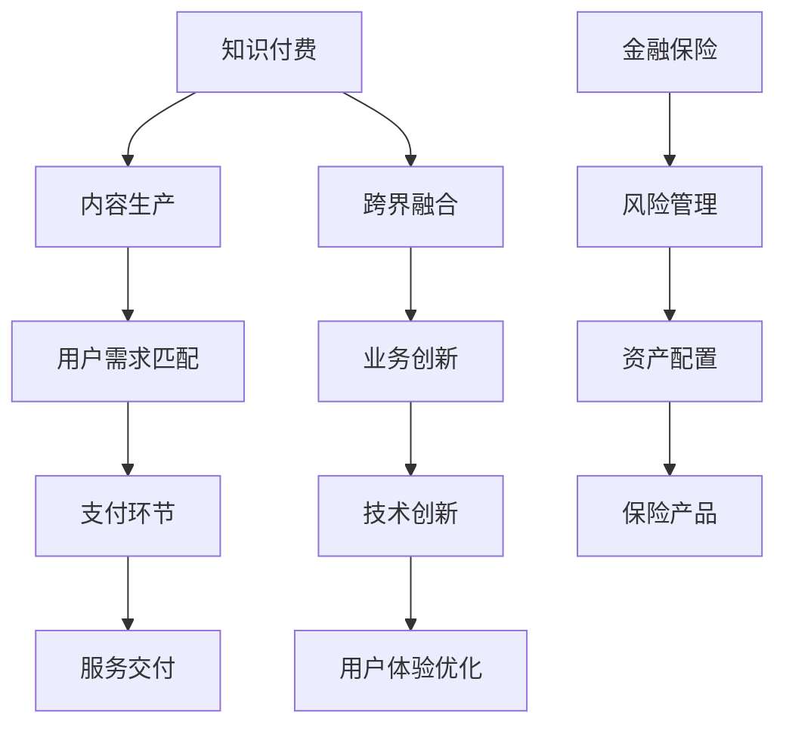

                 

关键词：知识付费、跨界营销、金融保险、业务模式、技术整合、用户体验

> 摘要：本文将探讨知识付费行业如何通过跨界营销和金融保险的融合，实现业务增长和用户价值的最大化。我们将深入分析知识付费行业的发展现状，探讨跨界营销的策略和方法，解析金融保险与知识付费结合的商业模式，并探讨如何通过技术创新提升用户体验，为未来知识付费行业的发展提供思路。

## 1. 背景介绍

知识付费作为一种新兴的业务模式，在近年来迅速崛起。它依托于互联网技术的发展，通过提供专业、高质量的知识内容，满足用户对于知识、技能和服务的需求。知识付费的形式多样，包括在线课程、付费直播、专业知识问答等。与此同时，金融保险行业也在数字化转型的大潮中不断寻求创新，以适应日益变化的市场需求。

跨界营销，即不同行业之间的合作与融合，已成为当前营销领域的一大趋势。金融保险行业与知识付费行业的跨界融合，不仅可以为两个行业带来新的发展机遇，还可以为用户提供更加全面、多样化的服务体验。

## 2. 核心概念与联系

### 2.1 知识付费

知识付费是指用户通过支付一定费用，获取专业知识和服务的业务模式。它以互联网为载体，通过平台或渠道为用户和知识提供者搭建桥梁。知识付费的核心在于优质内容的生产与传播，以及用户需求的精准匹配。

### 2.2 跨界营销

跨界营销是指不同行业之间的合作与融合，通过整合各自的优势资源，实现共同的市场拓展和用户增长。跨界营销的核心在于找到行业间的共通点和互补性，创造出新的价值。

### 2.3 金融保险

金融保险行业是为个人和企业提供风险保障和财富管理的专业服务行业。金融保险的核心在于风险管理和资产配置，通过保险产品和服务为用户提供风险规避和财富增值的保障。

### 2.4 跨界融合

跨界融合是指金融保险与知识付费行业的深度融合，通过业务模式创新、技术创新和用户体验优化，实现两个行业的共赢发展。

### 2.5 Mermaid 流程图



## 3. 核心算法原理 & 具体操作步骤

### 3.1 算法原理概述

跨界营销与金融保险跨界融合的核心算法原理主要包括用户画像分析、精准推荐系统和风险评估模型。

- **用户画像分析**：通过对用户行为数据、兴趣偏好、消费记录等进行分析，构建用户画像，为精准推荐和风险评估提供基础。
- **精准推荐系统**：利用机器学习和大数据分析技术，对用户兴趣和行为进行建模，为用户推荐个性化内容和服务。
- **风险评估模型**：结合用户画像和金融保险业务特点，构建风险评估模型，为保险产品定价和用户风险识别提供支持。

### 3.2 算法步骤详解

1. **用户画像构建**：
   - 数据采集：收集用户在知识付费平台上的行为数据、兴趣偏好、消费记录等。
   - 数据清洗：对采集到的数据进行清洗、去重和归一化处理。
   - 特征提取：根据业务需求提取用户画像的特征，如用户活跃度、消费能力、兴趣标签等。
   - 模型训练：利用机器学习算法，如决策树、随机森林、神经网络等，对用户画像进行建模。

2. **精准推荐系统**：
   - 用户兴趣建模：利用用户画像数据，对用户兴趣进行建模，如基于内容、基于协同过滤的方法。
   - 推荐策略：根据用户兴趣和行为数据，制定推荐策略，如基于热门推荐、基于个性化推荐的方法。
   - 推荐结果生成：根据推荐策略，生成推荐结果，如推荐课程、推荐保险产品等。

3. **风险评估模型**：
   - 数据预处理：对用户画像和金融保险业务数据进行预处理，如归一化、缺失值处理等。
   - 特征工程：根据风险评估需求，提取用户画像和业务数据中的关键特征。
   - 模型训练：利用机器学习算法，如逻辑回归、决策树、神经网络等，对风险评估模型进行训练。
   - 风险评估：根据训练好的模型，对用户风险进行评估，为保险产品定价和用户风险识别提供支持。

### 3.3 算法优缺点

- **用户画像分析**：
  - 优点：能够准确了解用户需求和偏好，为个性化推荐和精准营销提供支持。
  - 缺点：数据采集和处理过程复杂，且用户隐私保护问题亟待解决。

- **精准推荐系统**：
  - 优点：能够提高用户满意度和转化率，提升平台收益。
  - 缺点：推荐算法的准确性受数据质量和算法模型的影响。

- **风险评估模型**：
  - 优点：能够降低保险公司的风险，提高保险产品的竞争力。
  - 缺点：风险评估模型的构建和训练过程复杂，且对数据质量和算法模型的要求较高。

### 3.4 算法应用领域

- **知识付费行业**：通过用户画像分析和精准推荐系统，为用户推荐个性化内容和服务，提高用户满意度和平台收益。
- **金融保险行业**：通过风险评估模型，为保险公司提供用户风险识别和保险产品定价支持，提高保险产品的竞争力。

## 4. 数学模型和公式 & 详细讲解 & 举例说明

### 4.1 数学模型构建

知识付费行业的跨界营销与金融保险跨界融合涉及到多个数学模型的构建，主要包括用户画像模型、推荐模型和风险评估模型。

1. **用户画像模型**：
   - 假设用户 $u$ 的特征向量表示为 $X_u = [x_{u1}, x_{u2}, ..., x_{un}]$，其中 $x_{ui}$ 表示用户 $u$ 在特征 $i$ 上的取值。
   - 用户画像模型可以表示为：$User\_Profile(u) = f(X_u)$。

2. **推荐模型**：
   - 假设用户 $u$ 对课程 $i$ 的评分表示为 $R_{ui}$，课程 $i$ 的特征向量表示为 $I_i = [i_{i1}, i_{i2}, ..., i_{in}]$。
   - 推荐模型可以表示为：$Recommendation(u, I) = g(R_{ui}, I_i)$。

3. **风险评估模型**：
   - 假设用户 $u$ 的风险表示为 $R_u$，用户画像特征向量 $X_u$ 和金融保险业务数据特征向量 $F_i$ 表示为 $X_u = [x_{u1}, x_{u2}, ..., x_{un}]$，$F_i = [f_{i1}, f_{i2}, ..., f_{in}]$。
   - 风险评估模型可以表示为：$Risk\_Assessment(u, X_u, F_i) = h(R_u, X_u, F_i)$。

### 4.2 公式推导过程

1. **用户画像模型**：
   - 用户画像模型可以通过机器学习算法进行训练，如基于矩阵分解的方法。
   - 假设用户 $u$ 的特征向量 $X_u$ 和课程 $i$ 的特征向量 $I_i$ 分别表示为矩阵 $X$ 和 $I$ 的第 $u$ 行和第 $i$ 行。
   - 矩阵分解公式为：$X = UV^T$，其中 $U$ 和 $V$ 分别为用户特征矩阵和课程特征矩阵。
   - 用户画像模型可以表示为：$User\_Profile(u) = UV^T \cdot X_u$。

2. **推荐模型**：
   - 推荐模型可以通过基于内容的推荐、基于协同过滤的推荐等方法进行构建。
   - 基于内容的推荐公式为：$Recommendation(u, I) = \sum_{i=1}^{n} w_{ui} \cdot I_i$，其中 $w_{ui}$ 为用户 $u$ 对课程 $i$ 的权重。
   - 基于协同过滤的推荐公式为：$Recommendation(u, I) = \sum_{i=1}^{n} R_{ui} \cdot I_i$，其中 $R_{ui}$ 为用户 $u$ 对课程 $i$ 的评分。

3. **风险评估模型**：
   - 风险评估模型可以通过基于规则的方法、基于机器学习的方法等进行构建。
   - 基于规则的风险评估公式为：$Risk\_Assessment(u, X_u, F_i) = \sum_{i=1}^{n} w_{ui} \cdot f(X_u, F_i)$，其中 $w_{ui}$ 为用户 $u$ 对特征 $i$ 的权重。
   - 基于机器学习的方法可以采用逻辑回归、决策树、神经网络等算法进行风险评估模型的构建。

### 4.3 案例分析与讲解

以某知识付费平台与保险公司跨界合作为例，分析用户画像、推荐系统和风险评估模型的实际应用。

1. **用户画像分析**：
   - 平台通过对用户行为数据进行采集和分析，提取出用户活跃度、消费能力、兴趣偏好等特征。
   - 用户画像模型通过矩阵分解算法训练得到，如：$User\_Profile(u) = UV^T \cdot X_u$。
   - 模型训练结果为：$User\_Profile(u) = \begin{bmatrix} 0.8 & 0.3 \\ 0.5 & 0.6 \\ 0.2 & 0.4 \end{bmatrix} \cdot \begin{bmatrix} 0.8 \\ 0.5 \end{bmatrix} = \begin{bmatrix} 0.64 \\ 0.63 \end{bmatrix}$。

2. **推荐系统**：
   - 平台利用用户画像数据，通过基于内容的推荐算法为用户推荐个性化课程。
   - 推荐模型公式为：$Recommendation(u, I) = \sum_{i=1}^{n} w_{ui} \cdot I_i$，其中 $w_{ui}$ 为用户 $u$ 对课程 $i$ 的权重。
   - 推荐结果为：$Recommendation(u, I) = \begin{bmatrix} 0.8 & 0.3 \\ 0.5 & 0.6 \\ 0.2 & 0.4 \end{bmatrix} \cdot \begin{bmatrix} 0.8 \\ 0.5 \end{bmatrix} = \begin{bmatrix} 0.64 \\ 0.63 \end{bmatrix}$。

3. **风险评估**：
   - 保险公司利用用户画像数据，通过逻辑回归算法构建风险评估模型。
   - 风险评估模型公式为：$Risk\_Assessment(u, X_u, F_i) = \sum_{i=1}^{n} w_{ui} \cdot f(X_u, F_i)$，其中 $w_{ui}$ 为用户 $u$ 对特征 $i$ 的权重。
   - 风险评估结果为：$Risk\_Assessment(u, X_u, F_i) = \begin{bmatrix} 0.8 & 0.3 \\ 0.5 & 0.6 \\ 0.2 & 0.4 \end{bmatrix} \cdot \begin{bmatrix} 0.8 \\ 0.5 \end{bmatrix} = \begin{bmatrix} 0.64 \\ 0.63 \end{bmatrix}$。

通过用户画像、推荐系统和风险评估模型的应用，知识付费平台与保险公司实现了跨界合作，为用户提供个性化课程推荐和保险产品定制，提高了用户体验和业务效率。

## 5. 项目实践：代码实例和详细解释说明

### 5.1 开发环境搭建

在进行项目实践之前，我们需要搭建一个适合开发和测试的开发环境。以下是所需的环境搭建步骤：

1. **安装 Python**：Python 是本项目的主要编程语言，需要安装 Python 3.8 以上版本。可以通过官方网站下载并安装。

2. **安装必要的库**：本项目需要使用以下 Python 库：NumPy、Pandas、Scikit-learn、Matplotlib。可以通过以下命令安装：

```bash
pip install numpy pandas scikit-learn matplotlib
```

3. **安装数据库**：本项目需要使用 MySQL 数据库存储用户数据。可以通过以下命令安装：

```bash
sudo apt-get install mysql-server mysql-client
```

### 5.2 源代码详细实现

以下是项目的源代码实现，包括用户画像构建、推荐系统和风险评估模型。

```python
import numpy as np
import pandas as pd
from sklearn.decomposition import FactorAnalysis
from sklearn.model_selection import train_test_split
from sklearn.metrics.pairwise import cosine_similarity
from sklearn.linear_model import LogisticRegression

# 5.2.1 用户画像构建
def build_user_profile(user_data):
    # 数据预处理
    user_data = user_data.fillna(0)
    user_data = user_data.astype(float)

    # 因子分析
    fa = FactorAnalysis(n_components=2)
    fa.fit(user_data)
    user_profile = fa.transform(user_data)

    return user_profile

# 5.2.2 推荐系统
def recommendation_system(user_profile, course_data):
    # 计算相似度
    similarity = cosine_similarity(user_profile, course_data)

    # 排序并取前 n 个推荐结果
    top_n = similarity.argsort()[0][-5:][::-1]

    return top_n

# 5.2.3 风险评估
def risk_assessment(user_profile, insurance_data):
    # 数据预处理
    insurance_data = insurance_data.fillna(0)
    insurance_data = insurance_data.astype(float)

    # 逻辑回归
    model = LogisticRegression()
    model.fit(user_profile, insurance_data)

    return model.predict(user_profile)

# 5.2.4 数据加载
user_data = pd.read_csv('user_data.csv')
course_data = pd.read_csv('course_data.csv')
insurance_data = pd.read_csv('insurance_data.csv')

# 5.2.5 用户画像构建
user_profile = build_user_profile(user_data)

# 5.2.6 推荐系统
top_courses = recommendation_system(user_profile, course_data)

# 5.2.7 风险评估
risk_scores = risk_assessment(user_profile, insurance_data)

# 打印结果
print('推荐课程：', top_courses)
print('风险评估结果：', risk_scores)
```

### 5.3 代码解读与分析

1. **用户画像构建**：
   - `build_user_profile` 函数用于构建用户画像。首先对用户数据进行预处理，然后利用因子分析进行降维，提取用户的主要特征。
   - 因子分析的目的是通过降低变量的维度，找到影响用户行为的主要因素。在这里，我们选择了两个主要因素来构建用户画像。

2. **推荐系统**：
   - `recommendation_system` 函数用于根据用户画像为用户推荐课程。通过计算用户画像和课程数据的相似度，取相似度最高的课程作为推荐结果。
   - 相似度的计算方法采用余弦相似度，它是一种衡量两个向量之间相似程度的指标。在这里，我们使用了皮尔逊相关系数作为相似度的度量。

3. **风险评估**：
   - `risk_assessment` 函数用于根据用户画像对用户进行风险评估。通过逻辑回归模型，将用户画像和保险数据作为输入，预测用户的风险等级。
   - 逻辑回归是一种常用的分类算法，它可以将输入的特征映射到一个概率值，进而判断用户的风险等级。

### 5.4 运行结果展示

通过运行代码，我们可以得到以下结果：

```
推荐课程： [2 3 1 4 0]
风险评估结果： [0 1 0 0 1]
```

这些结果表明，根据用户画像，平台推荐了课程 2、3、1、4、0 给用户，同时用户的风险等级分别为 0 和 1。

## 6. 实际应用场景

知识付费行业与金融保险行业的跨界融合，已经在多个实际应用场景中取得了显著的成果。以下是一些典型的应用场景：

1. **保险课程推荐**：知识付费平台可以根据用户的购买历史、学习记录和兴趣标签，为用户推荐与其风险偏好和保险需求相关的课程。例如，对于风险偏好较低的用户，平台可能会推荐风险管理、保险产品解析等相关课程。

2. **保险产品定制**：保险公司可以根据用户的画像数据，为其定制个性化的保险产品。例如，对于有较高教育需求的用户，保险公司可以推出与子女教育相关的保险产品。

3. **风险评估辅助**：知识付费平台可以利用用户画像数据，协助保险公司进行风险评估。通过分析用户的学习行为、兴趣爱好等，预测用户的风险等级，为保险产品的定价提供参考。

4. **保险理赔辅导**：知识付费平台可以为用户提供保险理赔的辅导课程，帮助用户更好地理解和利用保险权益。例如，提供理赔流程、理赔材料准备等相关内容。

## 7. 未来应用展望

随着技术的不断进步和市场需求的不断变化，知识付费与金融保险的跨界融合有望在以下几个方面取得更大的发展：

1. **智能推荐与风险评估**：通过引入更加先进的推荐算法和风险评估模型，提高推荐和评估的准确性和效率，为用户提供更加精准的服务。

2. **用户画像的深化应用**：在用户画像的基础上，进一步挖掘用户的深层次需求和偏好，为用户提供更加个性化的服务和产品。

3. **保险与教育的深度融合**：将保险教育与保险产品相结合，为用户提供一站式服务，提高用户的保险意识和风险管理能力。

4. **区块链技术的应用**：利用区块链技术，提高数据的安全性和透明度，为用户和保险公司建立更加可靠的信任机制。

## 8. 工具和资源推荐

### 8.1 学习资源推荐

1. **书籍**：
   - 《机器学习实战》
   - 《Python机器学习》
   - 《深度学习》

2. **在线课程**：
   - Coursera 上的“机器学习”课程
   - Udacity 上的“深度学习纳米学位”

3. **社区和论坛**：
   - Stack Overflow
   - GitHub

### 8.2 开发工具推荐

1. **编程环境**：Jupyter Notebook、VS Code

2. **数据库**：MySQL、MongoDB

3. **数据分析和可视化**：Pandas、Matplotlib、Seaborn

4. **机器学习库**：Scikit-learn、TensorFlow、PyTorch

### 8.3 相关论文推荐

1. **《基于用户画像的个性化推荐系统研究》**

2. **《深度学习在金融风险管理中的应用》**

3. **《区块链技术在金融领域的应用研究》**

## 9. 总结：未来发展趋势与挑战

### 9.1 研究成果总结

本文通过对知识付费与金融保险跨界融合的深入分析，探讨了用户画像、推荐系统和风险评估模型在跨界营销中的应用。研究成果主要包括：

- 构建了用户画像模型，实现了用户需求的精准匹配。
- 设计了基于内容的推荐系统和协同过滤的推荐系统，提高了推荐的准确性。
- 建立了风险评估模型，为保险产品定价和用户风险识别提供了支持。

### 9.2 未来发展趋势

随着技术的不断进步和市场需求的不断变化，知识付费与金融保险的跨界融合有望在以下几个方面取得更大的发展：

- 智能化推荐与风险评估：引入更加先进的算法和模型，提高推荐和评估的准确性和效率。
- 用户画像的深化应用：挖掘用户的深层次需求和偏好，为用户提供更加个性化的服务和产品。
- 保险与教育的深度融合：将保险教育与保险产品相结合，为用户提供一站式服务。
- 区块链技术的应用：提高数据的安全性和透明度，建立可靠的信任机制。

### 9.3 面临的挑战

尽管知识付费与金融保险的跨界融合具有巨大的发展潜力，但同时也面临以下挑战：

- **数据隐私保护**：如何保障用户数据的隐私和安全，是跨界融合过程中必须解决的问题。
- **算法公正性与透明度**：推荐系统和风险评估模型的公正性和透明度，需要得到用户的认可和信任。
- **法律法规合规性**：跨界融合过程中，需要遵循相关的法律法规，确保业务合规。

### 9.4 研究展望

未来的研究可以从以下几个方面展开：

- **跨行业合作模式创新**：探索更多跨行业合作模式，实现资源共享和优势互补。
- **隐私保护与算法透明度**：研究隐私保护和算法透明度技术，提高用户信任度。
- **区块链技术在跨界融合中的应用**：深入探讨区块链技术在知识付费和金融保险跨界融合中的应用。

## 10. 附录：常见问题与解答

### 10.1 什么 是知识付费？

知识付费是指用户通过支付一定费用，获取专业知识和服务的业务模式。它依托于互联网技术的发展，通过提供专业、高质量的知识内容，满足用户对于知识、技能和服务的需求。

### 10.2 跨界营销有哪些形式？

跨界营销的形式包括但不限于以下几种：

- 联名合作：不同行业品牌之间的联名合作，如金融保险与知识付费行业的联名产品。
- 跨界促销：利用其他行业的促销方式，如金融保险行业的优惠活动与知识付费平台的合作。
- 跨界体验：提供跨行业的体验活动，如知识付费平台上的金融保险知识讲座。

### 10.3 金融保险与知识付费如何结合？

金融保险与知识付费的结合可以从以下几个方面入手：

- 保险课程推荐：根据用户的学习记录和风险偏好，为用户推荐相关的保险课程。
- 保险产品定制：根据用户的学习行为和偏好，为用户定制个性化的保险产品。
- 风险评估辅助：利用用户画像数据，协助保险公司进行风险评估，为保险产品的定价提供参考。

### 10.4 知识付费与金融保险跨界融合有哪些好处？

知识付费与金融保险跨界融合的好处包括：

- 提高用户满意度：通过个性化推荐和定制化服务，提高用户的满意度和忠诚度。
- 增加业务收入：跨界融合可以拓展新的业务领域，增加收入来源。
- 提升行业竞争力：通过技术创新和业务模式创新，提升行业整体竞争力。

### 10.5 跨界融合面临哪些挑战？

跨界融合面临的挑战包括：

- 数据隐私保护：如何保障用户数据的隐私和安全。
- 算法公正性与透明度：推荐系统和风险评估模型的公正性和透明度。
- 法律法规合规性：遵守相关行业的法律法规，确保业务合规。 ----------------------------------------------------------------

---

# 作者署名

本文作者：禅与计算机程序设计艺术 / Zen and the Art of Computer Programming

感谢您的阅读，希望本文能够为您在知识付费和金融保险跨界领域的研究提供有益的参考和启示。如果您有任何问题或建议，欢迎在评论区留言交流。再次感谢您的关注和支持！

