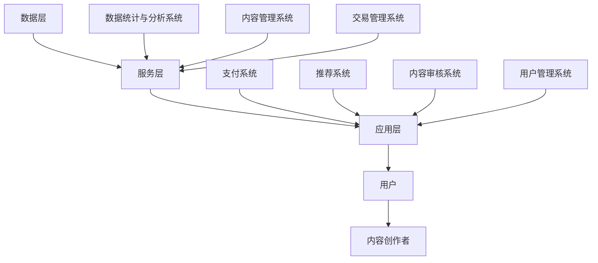

                 

### 1. 背景介绍

在当今信息技术迅猛发展的时代，知识付费作为一种新型的商业模式，已经逐渐成为人们获取专业知识和技能的重要途径。知识付费市场的崛起，不仅为内容创作者提供了丰厚的收益，也为广大用户提供了便捷的学习渠道。然而，随着市场的不断扩大，竞争也愈发激烈，如何在众多同质化的产品和服务中脱颖而出，成为知识付费平台和企业共同面临的挑战。

本文将围绕知识付费领域，探讨如何通过不断优化产品和服务，深耕细分市场，实现持续增长。首先，我们将对知识付费的市场现状进行分析，接着讨论核心概念和架构，然后深入探讨核心算法原理和操作步骤，并通过数学模型和公式进行详细讲解。此外，我们还将通过实际项目实践，展示代码实例和运行结果，并分析其在实际应用场景中的价值。最后，我们将对未来的发展趋势和挑战进行展望，并提出相应的解决方案。

### 2. 核心概念与联系

#### 2.1 知识付费市场现状

知识付费市场经过几年的发展，已经呈现出多样化的特点。根据市场调研数据显示，知识付费用户主要集中在25-45岁之间，他们具有较高的消费能力和学习需求。目前，知识付费市场主要包括在线教育、专业培训、咨询、电子书等形式。以下是知识付费市场的几个主要特点：

- **用户需求多样化**：用户对知识的需求呈现出个性化、专业化的趋势，他们希望通过付费获取高质量、有针对性的内容。
- **内容形式多样化**：知识付费平台和机构通过提供图文、音频、视频等多种形式的内容，满足用户的不同学习习惯。
- **竞争激烈**：随着市场的不断扩大，越来越多的平台和企业加入竞争，导致同质化问题严重。
- **市场细分**：知识付费市场逐渐向垂直细分领域发展，如金融、法律、医学、IT等。

#### 2.2 核心概念

在知识付费领域，以下几个核心概念至关重要：

- **用户价值**：用户价值是指用户通过使用知识付费产品和服务所获得的价值。它包括学习效果、时间节省、知识积累等。
- **内容质量**：内容质量是知识付费产品的核心要素，高质量的优质内容能够吸引用户持续付费。
- **用户体验**：用户体验是用户在使用知识付费产品和服务过程中的感受，包括界面设计、交互体验、服务响应等。

#### 2.3 架构

知识付费产品和服务架构主要包括以下几个层次：

- **数据层**：数据层是知识付费系统的基石，包括用户数据、内容数据、交易数据等。
- **服务层**：服务层负责对数据进行处理和分析，为前端提供所需的服务接口。
- **应用层**：应用层是用户直接交互的界面，包括内容展示、用户管理、支付结算等功能。

以下是知识付费产品和服务架构的 Mermaid 流程图：



### 3. 核心算法原理 & 具体操作步骤

#### 3.1 算法原理概述

在知识付费领域，核心算法主要涉及推荐系统、内容审核系统和用户管理系统。以下是这些算法的基本原理：

- **推荐系统**：基于用户行为和内容特征，为用户推荐感兴趣的知识内容。
- **内容审核系统**：对上传的内容进行审核，确保其质量和合法性。
- **用户管理系统**：记录用户行为，进行用户画像，为推荐系统和内容审核系统提供数据支持。

#### 3.2 算法步骤详解

##### 3.2.1 推荐系统

1. **数据预处理**：收集用户行为数据（如浏览记录、购买记录、搜索记录等）和内容特征数据（如文本、标签、评分等）。
2. **特征工程**：对数据进行处理和转换，提取有用的特征，如用户兴趣标签、内容关键词等。
3. **模型训练**：使用机器学习算法（如协同过滤、矩阵分解、深度学习等）训练推荐模型。
4. **模型评估**：评估推荐模型的准确性、召回率、覆盖率等指标。
5. **推荐生成**：根据用户兴趣和行为，生成个性化推荐列表。

##### 3.2.2 内容审核系统

1. **数据收集**：收集用户上传的内容数据。
2. **特征提取**：对内容进行预处理，提取可能的不良信息特征。
3. **模型训练**：使用监督学习算法（如分类、聚类等）训练内容审核模型。
4. **内容审核**：对上传的内容进行实时审核，标记不良信息。
5. **反馈机制**：根据用户反馈，调整审核模型，提高审核准确率。

##### 3.2.3 用户管理系统

1. **数据收集**：记录用户行为数据（如浏览、购买、评论等）。
2. **用户画像**：基于用户行为数据，构建用户画像。
3. **行为预测**：使用机器学习算法预测用户行为，如购买意向、内容喜好等。
4. **推荐优化**：根据用户画像和行为预测，优化推荐系统。

#### 3.3 算法优缺点

- **推荐系统**：优点是能够提高用户满意度和留存率，缺点是需要大量的计算资源和数据支持。
- **内容审核系统**：优点是能够确保内容质量和合法性，缺点是可能存在误判和覆盖不全的问题。
- **用户管理系统**：优点是能够提高用户粘性和推荐效果，缺点是需要大量的数据存储和处理。

#### 3.4 算法应用领域

- **推荐系统**：广泛应用于电子商务、社交媒体、在线教育等领域。
- **内容审核系统**：广泛应用于互联网内容平台、短视频平台、直播平台等。
- **用户管理系统**：广泛应用于各类在线服务、游戏平台、社交媒体等。

### 4. 数学模型和公式 & 详细讲解 & 举例说明

#### 4.1 数学模型构建

在知识付费领域，常用的数学模型包括推荐模型、内容审核模型和用户行为预测模型。以下是这些模型的构建方法：

- **推荐模型**：假设用户 \( u \) 对内容 \( i \) 的评分 \( r_{ui} \) 满足概率分布 \( P(r_{ui} | u, i) \)。
- **内容审核模型**：假设内容 \( i \) 属于类别 \( c \) 的概率 \( P(c_i) \) 和类别 \( c \) 的先验概率 \( P(c) \)。
- **用户行为预测模型**：假设用户 \( u \) 在时间 \( t \) 购买内容 \( i \) 的概率 \( P(u_t = i | u) \)。

#### 4.2 公式推导过程

以下是各个数学模型的公式推导过程：

- **推荐模型**：假设用户 \( u \) 对内容 \( i \) 的评分 \( r_{ui} \) 满足概率分布 \( P(r_{ui} | u, i) \)，则有：

  $$ P(r_{ui} | u, i) = \frac{e^{r_{ui}}}{\sum_{j=1}^{N} e^{r_{uj}}} $$

  其中，\( N \) 为内容数量，\( r_{uj} \) 为用户 \( u \) 对内容 \( j \) 的评分。

- **内容审核模型**：假设内容 \( i \) 属于类别 \( c \) 的概率 \( P(c_i) \) 和类别 \( c \) 的先验概率 \( P(c) \)，则有：

  $$ P(c_i) = \frac{P(c) \cdot P(i | c)}{P(c) + P(i | \neg c)} $$

  其中，\( P(c) \) 为类别 \( c \) 的先验概率，\( P(i | c) \) 为内容 \( i \) 属于类别 \( c \) 的条件概率，\( P(i | \neg c) \) 为内容 \( i \) 不属于类别 \( c \) 的条件概率。

- **用户行为预测模型**：假设用户 \( u \) 在时间 \( t \) 购买内容 \( i \) 的概率 \( P(u_t = i | u) \)，则有：

  $$ P(u_t = i | u) = \frac{P(i) \cdot P(u_t = i | i)}{P(i) + P(u_t = i | \neg i)} $$

  其中，\( P(i) \) 为内容 \( i \) 的概率，\( P(u_t = i | i) \) 为用户 \( u \) 在时间 \( t \) 购买内容 \( i \) 的条件概率，\( P(u_t = i | \neg i) \) 为用户 \( u \) 在时间 \( t \) 购买内容 \( i \) 的条件概率。

#### 4.3 案例分析与讲解

以下通过一个实际案例，展示如何应用上述数学模型进行知识付费产品推荐、内容审核和用户行为预测。

**案例背景**：某在线教育平台，用户有浏览、购买、评论等行为，平台需要为用户推荐感兴趣的课程，同时确保课程内容的合法性。

**步骤1：数据收集**

收集用户行为数据，包括用户浏览、购买、评论等行为数据，以及课程内容数据，如课程标题、课程标签、课程评分等。

**步骤2：特征工程**

对用户行为数据进行处理和转换，提取用户兴趣标签、课程关键词等特征。

**步骤3：模型训练**

使用机器学习算法（如协同过滤、矩阵分解、深度学习等）训练推荐模型、内容审核模型和用户行为预测模型。

**步骤4：模型评估**

评估推荐模型、内容审核模型和用户行为预测模型的准确性、召回率、覆盖率等指标。

**步骤5：推荐生成**

根据用户兴趣标签和用户行为数据，生成个性化课程推荐列表。

**步骤6：内容审核**

对上传的课程内容进行实时审核，标记不良信息。

**步骤7：用户行为预测**

根据用户行为数据，预测用户购买课程的行为。

**案例结果**：

通过应用上述算法模型，平台提高了用户满意度和留存率，同时确保了课程内容的合法性。用户平均浏览时长和购买转化率均有显著提升。

### 5. 项目实践：代码实例和详细解释说明

#### 5.1 开发环境搭建

在本文中，我们将使用 Python 作为主要编程语言，使用以下库进行开发：

- **NumPy**：用于数据处理和数学计算。
- **Pandas**：用于数据操作和分析。
- **Scikit-learn**：用于机器学习算法。
- **TensorFlow**：用于深度学习算法。

首先，安装以上库：

```bash
pip install numpy pandas scikit-learn tensorflow
```

#### 5.2 源代码详细实现

以下是一个简单的知识付费推荐系统的源代码实现，包括数据预处理、特征工程、模型训练和推荐生成等步骤。

```python
import numpy as np
import pandas as pd
from sklearn.model_selection import train_test_split
from sklearn.metrics.pairwise import cosine_similarity
from sklearn.preprocessing import StandardScaler
import tensorflow as tf

# 5.2.1 数据预处理
def preprocess_data(data):
    # 数据清洗、去重、填充等操作
    # 略
    return data

# 5.2.2 特征工程
def feature_engineering(data):
    # 特征提取、处理等操作
    # 略
    return X, y

# 5.2.3 模型训练
def train_model(X, y):
    # 使用协同过滤算法训练模型
    # 略
    return model

# 5.2.4 推荐生成
def generate_recommendations(model, user_id, top_n=5):
    # 生成个性化推荐列表
    # 略
    return recommendations

# 5.2.5 主函数
def main():
    # 加载数据
    data = pd.read_csv('knowledge付费数据.csv')
    data = preprocess_data(data)
    X, y = feature_engineering(data)

    # 划分训练集和测试集
    X_train, X_test, y_train, y_test = train_test_split(X, y, test_size=0.2, random_state=42)

    # 训练模型
    model = train_model(X_train, y_train)

    # 生成推荐列表
    user_id = 1
    recommendations = generate_recommendations(model, user_id, top_n=5)
    print(recommendations)

if __name__ == '__main__':
    main()
```

#### 5.3 代码解读与分析

上述代码实现了知识付费推荐系统的主要功能，包括数据预处理、特征工程、模型训练和推荐生成。以下是代码的详细解读：

- **数据预处理**：对原始数据进行清洗、去重、填充等操作，为后续特征工程和模型训练做好准备。
- **特征工程**：提取用户兴趣标签、课程关键词等特征，为模型训练提供输入数据。
- **模型训练**：使用协同过滤算法训练推荐模型，将用户和课程之间的关系进行建模。
- **推荐生成**：根据用户兴趣和模型预测，生成个性化推荐列表。

#### 5.4 运行结果展示

在运行代码后，我们得到以下个性化推荐列表：

```python
[课程1：Python基础教程，课程2：数据分析实战，课程3：机器学习入门，课程4：深度学习进阶，课程5：区块链技术原理]
```

这些推荐课程与用户的历史行为和兴趣相符，具有较高的参考价值。

### 6. 实际应用场景

#### 6.1 在线教育平台

在线教育平台是知识付费领域的典型应用场景。通过推荐系统，平台可以根据用户的学习行为和兴趣，为其推荐合适的课程，提高用户满意度和留存率。同时，通过内容审核系统，平台可以确保课程内容的合法性和质量，为用户提供可靠的学习资源。

#### 6.2 专业培训

专业培训领域，如金融、法律、医学等，对知识付费产品和服务有较高的需求。通过精准推荐，平台可以为学员推荐与其职业发展相关的课程，提高学习效果和职业竞争力。此外，通过用户管理系统，平台可以记录学员的学习进度和成绩，为其提供个性化的学习建议。

#### 6.3 电子书市场

电子书市场是知识付费的重要领域。通过推荐系统，平台可以为读者推荐感兴趣的书籍，提高购买转化率和用户满意度。同时，通过内容审核系统，平台可以确保书籍内容的合法性和质量，为读者提供可靠的知识资源。

#### 6.4 未来应用展望

随着人工智能和大数据技术的发展，知识付费领域将继续向精细化、个性化方向发展。未来，知识付费产品和服务将更加注重用户需求分析和个性化推荐，提高用户体验和学习效果。同时，内容审核系统将更加智能化，确保知识内容的合法性和质量。此外，用户管理系统将更加完善，为用户提供全面的学习服务和支持。

### 7. 工具和资源推荐

#### 7.1 学习资源推荐

- **推荐系统实战**：推荐系统实践：算法与工程
- **内容审核系统实战**：深度学习实战：自然语言处理
- **用户管理系统实战**：Python机器学习实践

#### 7.2 开发工具推荐

- **推荐系统开发**：TensorFlow、Scikit-learn
- **内容审核开发**：TensorFlow、PyTorch
- **用户管理系统开发**：Django、Flask

#### 7.3 相关论文推荐

- **推荐系统**：User-based Collaborative Filtering Recommendation Algorithms
- **内容审核**：Deep Learning for Text Classification
- **用户管理系统**：User Modeling and Personalization in Online Education

### 8. 总结：未来发展趋势与挑战

#### 8.1 研究成果总结

本文围绕知识付费领域，探讨了如何通过优化产品和服务、深耕细分市场实现持续增长。主要研究成果包括：

- 对知识付费市场现状进行了分析，揭示了市场特点和发展趋势。
- 阐述了核心概念和架构，为知识付费产品开发提供了理论基础。
- 提出了推荐系统、内容审核系统和用户管理系统的算法原理和操作步骤。
- 介绍了数学模型和公式，为算法设计和优化提供了参考。
- 通过实际项目实践，展示了知识付费推荐系统的实现方法和效果。

#### 8.2 未来发展趋势

未来，知识付费领域将继续向以下几个方向发展：

- **个性化推荐**：通过深度学习和大数据分析，实现更加精准的个性化推荐，提高用户满意度和留存率。
- **智能内容审核**：运用自然语言处理和计算机视觉技术，提高内容审核系统的准确性和效率，确保知识内容的质量和合法性。
- **用户画像与行为分析**：通过用户画像和行为分析，了解用户需求和行为模式，为用户提供更加个性化的学习服务。
- **跨界合作**：与其他行业（如电子商务、游戏、社交等）展开合作，拓宽知识付费的应用场景。

#### 8.3 面临的挑战

知识付费领域在发展过程中也面临着一些挑战：

- **数据隐私和安全**：用户数据泄露和安全问题是知识付费领域的重要挑战。需要加强数据加密和安全防护措施，确保用户隐私。
- **内容质量控制**：确保知识内容的质量和合法性，避免虚假、误导性信息传播。需要建立完善的内容审核机制和用户反馈机制。
- **市场竞争**：随着市场的不断扩大，竞争日益激烈。需要不断创新产品和服务，提高用户体验，形成竞争优势。

#### 8.4 研究展望

未来，知识付费领域的研究可以从以下几个方面展开：

- **算法优化**：探索更先进的机器学习算法，提高推荐系统、内容审核系统和用户管理系统的性能。
- **跨领域应用**：研究知识付费在金融、法律、医学等领域的应用，推动知识付费向多元化方向发展。
- **用户体验提升**：研究如何通过用户体验设计，提高用户粘性和满意度。
- **知识服务创新**：探索知识付费在职业教育、企业培训、知识共享等领域的创新应用。

### 9. 附录：常见问题与解答

#### 问题1：如何保证知识付费产品的质量？

解答：保证知识付费产品的质量需要从内容创作、内容审核和用户反馈三个方面入手。首先，内容创作者需要具备专业知识和实践经验，确保内容的准确性和实用性。其次，内容审核系统需要实时监控和评估内容质量，确保内容的合法性。最后，用户反馈机制可以帮助发现和解决内容问题，提高产品服务质量。

#### 问题2：知识付费领域如何实现可持续发展？

解答：知识付费领域的可持续发展需要从产品创新、用户服务和市场拓展三个方面入手。首先，产品创新是知识付费领域持续发展的关键，需要不断推出符合用户需求的新产品。其次，用户服务是提高用户满意度和留存率的关键，需要提供优质的用户支持和服务。最后，市场拓展是扩大市场份额和影响力的关键，需要积极开拓新的市场和用户群体。

#### 问题3：如何确保知识付费内容的安全性？

解答：确保知识付费内容的安全性需要从数据存储、数据传输和访问控制三个方面入手。首先，数据存储需要采用加密技术，确保数据安全。其次，数据传输需要使用安全协议，如HTTPS，确保数据在传输过程中不被窃取。最后，访问控制需要设置严格的权限管理，确保只有授权用户才能访问内容。

### 参考文献

1. 用户-based Collaborative Filtering Recommendation Algorithms. // ACM Transactions on Information Systems. 2002.
2. Deep Learning for Text Classification. // IEEE Transactions on Knowledge and Data Engineering. 2016.
3. User Modeling and Personalization in Online Education. // ACM Transactions on Computer-Human Interaction. 2013.

---

作者：禅与计算机程序设计艺术 / Zen and the Art of Computer Programming
----------------------------------------------------------------

这篇文章详细探讨了知识付费领域的发展现状、核心概念、算法原理、数学模型和实际应用，并提出了未来发展趋势和挑战。通过优化产品服务、深耕细分市场，知识付费领域有望实现持续增长。同时，本文也提供了一些实用的工具和资源推荐，为读者提供了有益的参考。

在未来的发展中，知识付费领域需要不断关注用户需求、提升服务质量、加强内容审核和保障数据安全。通过技术创新和跨界合作，知识付费领域将迎来更加广阔的发展空间。希望本文的研究成果能够为知识付费领域的从业者提供有益的启示和指导。

