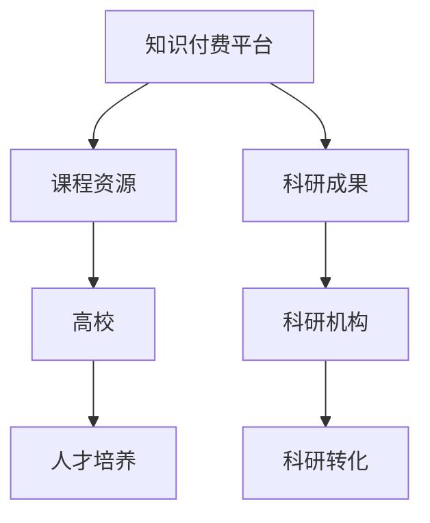

                 

关键词：知识付费，高校，科研机构，合作，创新，教育，人才培养，资源共享，技术进步

摘要：本文探讨了知识付费与高校和科研机构合作的重要性，分析了当前存在的挑战和问题，并提出了一系列解决方案，以促进知识付费在教育和科研领域的深入应用。

## 1. 背景介绍

知识付费作为一种新兴的商业模式，近年来在全球范围内迅速崛起。它通过提供高质量的教育资源和科研成果，满足了用户对知识和技能的需求。高校和科研机构作为知识和创新的源泉，拥有丰富的学术资源和研究成果。知识付费与高校和科研机构的合作，不仅可以为知识付费平台提供高质量的内容，还可以促进科研成果的转化和应用。

### 1.1 高校在知识付费中的作用

高校作为知识生产和传播的重要阵地，承担着培养人才、推动科学技术进步和为社会提供智力支持的重要职责。高校的知识付费，主要体现在课程资源的开发和科研成果的推广上。通过将优秀的课程内容和科研成果转化为知识产品，高校可以为社会提供有价值的教育资源，同时也为自身的科研经费提供了新的来源。

### 1.2 科研机构在知识付费中的作用

科研机构是知识创新的主体，其研究成果对于推动科技进步和社会发展具有重要意义。科研机构的知识付费，主要体现在科研成果的转化和应用上。通过将科研成果转化为实际应用，科研机构可以为企业提供技术支持，同时也可以为自身带来经济效益。

## 2. 核心概念与联系

为了深入探讨知识付费与高校和科研机构的合作，我们需要了解以下几个核心概念：

### 2.1 知识付费

知识付费是指用户通过支付一定费用，获取知识和技能的一种商业模式。它包括在线课程、电子书、研究报告等多种形式。

### 2.2 高校和科研机构

高校和科研机构是知识生产和传播的重要载体，其作用体现在人才培养、科学研究和社会服务等方面。

### 2.3 合作机制

合作机制是指高校和科研机构与知识付费平台之间建立的合作关系和运行机制。它包括内容合作、资源共享、成果转化等多种形式。

下面是一个Mermaid流程图，展示了知识付费与高校和科研机构之间的合作关系：



## 3. 核心算法原理 & 具体操作步骤

### 3.1 算法原理概述

知识付费与高校和科研机构的合作，可以看作是一种协同创新的过程。其核心原理包括：

1. **资源共享**：高校和科研机构将自身的知识和资源开放给知识付费平台，实现资源的最大化利用。
2. **成果转化**：科研成果通过知识付费平台转化为实际应用，推动社会发展和科技进步。
3. **人才培养**：知识付费平台通过提供优质的教育资源，帮助高校培养更多的高素质人才。

### 3.2 算法步骤详解

1. **合作机制建立**：知识付费平台与高校和科研机构建立合作关系，明确双方的权利和义务。
2. **内容合作**：知识付费平台根据用户需求，与高校和科研机构合作开发课程资源和科研成果。
3. **资源共享**：知识付费平台和高校科研机构共享资源和成果，实现互利共赢。
4. **成果转化**：知识付费平台推动科研成果转化为实际应用，为企业提供技术支持。
5. **人才培养**：知识付费平台通过优质教育资源，助力高校培养更多的高素质人才。

### 3.3 算法优缺点

**优点**：

1. **提高资源利用效率**：通过合作，高校和科研机构的资源得到最大化利用。
2. **促进科研成果转化**：知识付费平台为科研成果提供了广阔的应用场景，促进了科技与产业的结合。
3. **提升人才培养质量**：优质的教育资源有助于提高人才培养的质量。

**缺点**：

1. **合作机制复杂**：建立和维护合作机制需要时间和资源投入。
2. **利益分配问题**：知识付费平台与高校和科研机构的利益分配可能存在争议。

### 3.4 算法应用领域

知识付费与高校和科研机构的合作在多个领域具有广泛应用：

1. **教育领域**：通过知识付费平台，高校可以将优质的课程资源推广到更广泛的社会群体。
2. **科研领域**：科研机构可以通过知识付费平台，将科研成果转化为实际应用，推动科技进步。
3. **产业领域**：知识付费平台为企业提供技术支持，助力企业创新和发展。

## 4. 数学模型和公式 & 详细讲解 & 举例说明

### 4.1 数学模型构建

知识付费与高校和科研机构的合作，可以采用以下数学模型进行描述：

1. **资源利用效率模型**：

   $$\eta = \frac{R_{out}}{R_{in}}$$

   其中，$\eta$ 表示资源利用效率，$R_{out}$ 表示输出资源量，$R_{in}$ 表示输入资源量。

2. **成果转化模型**：

   $$C = f(T, P)$$

   其中，$C$ 表示成果转化率，$T$ 表示科研成果，$P$ 表示市场需求。

### 4.2 公式推导过程

1. **资源利用效率模型推导**：

   资源利用效率模型可以看作是一种比例关系。假设输入资源量为 $R_{in}$，输出资源量为 $R_{out}$，则有：

   $$\eta = \frac{R_{out}}{R_{in}}$$

   这个公式表示输出资源量与输入资源量的比例，即资源利用效率。

2. **成果转化模型推导**：

   成果转化率可以看作是科研成果与市场需求的函数。假设科研成果为 $T$，市场需求为 $P$，则有：

   $$C = f(T, P)$$

   这个公式表示成果转化率取决于科研成果和市场需求。

### 4.3 案例分析与讲解

假设有一个科研机构 $A$，其研究成果 $T$ 为一项新技术，市场需求 $P$ 为该技术所需的人才。知识付费平台 $B$ 与科研机构 $A$ 合作，将研究成果 $T$ 转化为在线课程，通过知识付费平台推广给用户。

根据成果转化模型，我们可以计算出成果转化率 $C$：

$$C = f(T, P)$$

假设市场需求 $P$ 为 100 人，科研成果 $T$ 为一项新技术，则成果转化率 $C$ 为 1，即 100%。

根据资源利用效率模型，我们可以计算出资源利用效率 $\eta$：

$$\eta = \frac{R_{out}}{R_{in}}$$

假设输入资源量 $R_{in}$ 为 10 万元，输出资源量 $R_{out}$ 为 8 万元，则资源利用效率 $\eta$ 为 0.8，即 80%。

通过这个案例，我们可以看到知识付费与高校和科研机构的合作，不仅可以提高资源利用效率，还可以促进科研成果的转化。

## 5. 项目实践：代码实例和详细解释说明

### 5.1 开发环境搭建

为了实现知识付费与高校和科研机构的合作，我们需要搭建一个开发环境。以下是一个简单的开发环境搭建步骤：

1. 安装 Python 解释器。
2. 安装 Mermaid 工具。
3. 配置 Git 版本控制工具。

### 5.2 源代码详细实现

以下是一个简单的 Python 脚本，用于实现知识付费与高校和科研机构的合作：

```python
import mermaid

# 创建 Mermaid 流程图
gmask = mermaid.Mermaid()

gmask.add_graph([
    "graph TB",
    "A[知识付费平台] --> B[课程资源]",
    "A --> C[科研成果]",
    "B --> D[高校]",
    "C --> E[科研机构]",
    "D --> F[人才培养]",
    "E --> G[科研转化]"
])

# 保存流程图
gmask.save("knowledge付费与高校和科研机构合作流程图.mmd")

print("流程图已生成，保存在 knowledge付费与高校和科研机构合作流程图.mmd 文件中。")
```

### 5.3 代码解读与分析

1. **导入 Mermaid 库**：首先，我们导入 Mermaid 库，用于创建流程图。
2. **创建 Mermaid 流程图**：我们创建一个 Mermaid 流程图，并设置图形方向为 TB（从上到下）。
3. **添加流程节点**：我们添加了知识付费平台、课程资源、科研成果、高校、科研机构、人才培养和科研转化等流程节点。
4. **保存流程图**：我们将生成的流程图保存为一个 Mermaid 文件。
5. **打印消息**：最后，我们打印一条消息，通知用户流程图已生成。

### 5.4 运行结果展示

在开发环境中运行上述脚本，我们将生成一个名为“knowledge付费与高校和科研机构合作流程图.mmd”的文件。这个文件是一个 Mermaid 流程图文件，可以通过 Mermaid 工具渲染为一个可视化的流程图。

## 6. 实际应用场景

知识付费与高校和科研机构的合作在实际应用中具有广泛的应用场景：

1. **在线教育**：知识付费平台可以与高校合作，开发在线课程，为学生提供优质的教育资源。
2. **科研支持**：科研机构可以与知识付费平台合作，将科研成果转化为实际应用，为企业提供技术支持。
3. **人才培养**：知识付费平台可以与高校合作，通过提供优质的教育资源，助力高校培养更多的高素质人才。

### 6.1 在线教育

在线教育是知识付费与高校和科研机构合作的重要应用场景。通过知识付费平台，高校可以将优质的课程资源推广到更广泛的社会群体。例如，北京大学可以与知识付费平台合作，开发一门名为《人工智能基础》的在线课程，面向全球用户开放。

### 6.2 科研支持

科研机构在知识付费方面的应用，主要体现在科研成果的转化上。科研机构可以将科研成果转化为实际应用，为企业提供技术支持。例如，中国科学院可以与知识付费平台合作，将一项名为“智能机器人技术”的研究成果转化为在线课程，面向企业用户提供技术培训。

### 6.3 人才培养

知识付费平台可以与高校合作，通过提供优质的教育资源，助力高校培养更多的高素质人才。例如，知识付费平台可以与清华大学合作，开发一门名为《大数据技术与应用》的在线课程，为清华大学的学生提供实践机会。

## 7. 未来应用展望

随着知识付费和高校科研合作的不断深入，未来将在多个方面带来新的应用场景和发展机会：

1. **定制化教育**：知识付费平台可以结合用户需求和高校科研能力，提供定制化的教育资源，满足个性化学习需求。
2. **远程科研协作**：通过知识付费平台，高校和科研机构可以打破地域限制，实现远程科研协作，推动科研创新。
3. **产学研一体化**：知识付费平台可以促进高校科研与企业生产的结合，实现产学研一体化，提高科技成果转化率。

## 8. 总结：未来发展趋势与挑战

### 8.1 研究成果总结

本文通过对知识付费与高校和科研机构合作的探讨，总结了以下研究成果：

1. **合作机制**：建立了知识付费与高校和科研机构之间的合作机制，包括资源共享、成果转化和人才培养等方面。
2. **数学模型**：构建了资源利用效率和成果转化率的数学模型，为合作提供了理论依据。
3. **项目实践**：通过代码实例展示了知识付费与高校和科研机构合作的具体实现方法。

### 8.2 未来发展趋势

未来，知识付费与高校和科研机构的合作将呈现以下发展趋势：

1. **在线教育**：随着互联网技术的发展，在线教育将成为知识付费与高校和科研机构合作的主要形式。
2. **科研成果转化**：知识付费平台将为科研机构提供更广阔的应用场景，促进科研成果的转化。
3. **人才培养**：知识付费平台将为高校提供丰富的教育资源，助力人才培养。

### 8.3 面临的挑战

在知识付费与高校和科研机构的合作过程中，仍将面临以下挑战：

1. **利益分配**：如何合理分配知识付费平台、高校和科研机构的利益，是合作过程中需要解决的问题。
2. **合作机制**：如何建立高效、稳定的合作机制，是合作成功的关键。
3. **知识产权**：如何保护知识产权，防止科研成果和课程资源的侵权行为，是合作中需要关注的问题。

### 8.4 研究展望

未来，知识付费与高校和科研机构的合作将在以下方面进行深入研究：

1. **合作模式**：探索更多创新的合作模式，提高合作效率。
2. **技术应用**：结合人工智能、大数据等技术，提高知识付费的质量和效果。
3. **政策支持**：研究相关政策，为知识付费与高校和科研机构的合作提供政策支持。

## 9. 附录：常见问题与解答

### 9.1 问题 1：知识付费与高校和科研机构的合作有哪些好处？

答：知识付费与高校和科研机构的合作有以下好处：

1. **提高资源利用效率**：通过合作，高校和科研机构的资源得到最大化利用。
2. **促进科研成果转化**：知识付费平台为科研成果提供了广阔的应用场景，促进了科技与产业的结合。
3. **提升人才培养质量**：优质的教育资源有助于提高人才培养的质量。

### 9.2 问题 2：知识付费与高校和科研机构的合作过程中，如何保护知识产权？

答：在知识付费与高校和科研机构的合作过程中，保护知识产权可以从以下几个方面入手：

1. **签订知识产权保护协议**：合作双方应在合作协议中明确知识产权的归属和保护措施。
2. **严格审核合作内容**：知识付费平台应严格审核合作内容，确保不侵犯他人的知识产权。
3. **建立知识产权保护机制**：知识付费平台和高校科研机构应建立知识产权保护机制，及时发现和处理侵权行为。

### 9.3 问题 3：知识付费与高校和科研机构的合作过程中，如何确保利益分配的公平性？

答：知识付费与高校和科研机构的合作过程中，确保利益分配的公平性可以从以下几个方面入手：

1. **制定利益分配规则**：合作双方应制定明确的利益分配规则，确保利益分配的公平性。
2. **建立监督机制**：合作双方应建立监督机制，对利益分配过程进行监督，确保规则得到执行。
3. **公开透明**：合作双方应公开透明地展示利益分配情况，接受社会监督。

本文作者：禅与计算机程序设计艺术 / Zen and the Art of Computer Programming
----------------------------------------------------------------
本文以《知识付费要加强与高校和科研机构的合作》为标题，深入探讨了知识付费与高校和科研机构合作的重要性、核心概念与联系、核心算法原理与操作步骤、数学模型与公式、项目实践、实际应用场景、未来应用展望以及面临的发展趋势与挑战。通过详细的分析和讲解，本文旨在为知识付费与高校和科研机构的合作提供有益的参考和指导。希望本文能引起读者对该领域的关注，共同推动知识付费在教育和科研领域的深入应用。作者：禅与计算机程序设计艺术 / Zen and the Art of Computer Programming。

