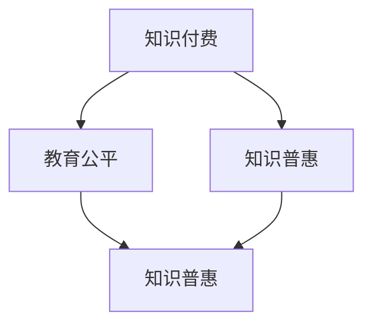

                 

关键词：知识付费、教育公平、知识普惠、人工智能、算法、数学模型、代码实例、应用场景、未来展望

> 摘要：随着人工智能技术的迅速发展，知识付费成为了一个热门领域。然而，如何在保证经济效益的同时，实现教育公平和知识普惠，成为了我们必须面对的重要课题。本文将从技术、经济和社会等多方面探讨知识付费的现状与挑战，并提出相应的解决方案，以期为未来知识付费的发展提供有益的参考。

## 1. 背景介绍

知识付费，即用户为获取特定知识或技能而支付的费用，近年来在全球范围内蓬勃发展。特别是在人工智能、大数据、区块链等前沿技术领域，知识付费成为了知识传播和技能提升的重要途径。然而，这种发展模式也在一定程度上加剧了教育的不平等现象，使得知识普惠的目标难以实现。

### 1.1 人工智能与知识付费

人工智能技术的兴起，不仅改变了我们的生活方式，也深刻影响了知识付费的生态。通过算法和数据分析，知识付费平台能够更精准地满足用户需求，提供个性化的知识服务。然而，这也使得高价值知识集中于少数人手中，进一步拉大了贫富差距。

### 1.2 教育公平与知识普惠

教育公平和知识普惠是社会发展的重要目标。教育公平意味着每个个体都有机会接受同等质量的教育，而知识普惠则强调知识传播的广泛性和无障碍性。然而，知识付费模式在某种程度上阻碍了这一目标的实现。

## 2. 核心概念与联系

为了更好地理解知识付费、教育公平和知识普惠之间的关系，我们可以借助 Mermaid 流程图来展示它们的核心概念和联系。



在上面的流程图中，我们可以看到知识付费、教育公平和知识普惠三者之间存在密切的联系。知识付费是知识传播的一种形式，它既可以促进教育公平，也可能加剧不平等。而知识普惠则是在教育公平的基础上，实现知识的广泛传播和无障碍获取。

## 3. 核心算法原理 & 具体操作步骤

### 3.1 算法原理概述

知识付费平台的核心算法通常包括用户画像构建、内容推荐、付费验证等模块。这些算法共同作用，确保用户能够获得个性化的知识服务，同时保障平台的盈利能力。

### 3.2 算法步骤详解

#### 用户画像构建

用户画像构建是知识付费平台的第一步。通过收集用户的基本信息、行为数据、兴趣偏好等，构建出一个全面的用户画像。这个过程通常涉及以下步骤：

1. 数据采集：通过平台登录、浏览、购买等行为，收集用户数据。
2. 数据清洗：对收集到的数据去重、去噪，确保数据质量。
3. 特征提取：根据用户行为和兴趣偏好，提取关键特征。
4. 画像构建：将提取的特征整合，形成一个完整的用户画像。

#### 内容推荐

内容推荐是知识付费平台的核心理功能之一。通过分析用户画像和内容属性，平台可以为用户推荐个性化的知识内容。这个过程通常包括以下步骤：

1. 内容分类：将知识内容分为不同的类别，如技术、文学、历史等。
2. 内容打分：根据用户画像和内容属性，为每个内容打分。
3. 排序：将打分后的内容按照得分高低排序，为用户推荐。
4. 实时更新：根据用户行为和平台数据，实时调整推荐策略。

#### 付费验证

付费验证是确保用户付费后能够正常使用知识内容的必要步骤。这个过程通常包括以下步骤：

1. 付费流程：用户选择知识内容并完成支付。
2. 订单处理：平台处理订单，生成订单记录。
3. 访问控制：根据订单记录，控制用户对知识内容的访问权限。

### 3.3 算法优缺点

#### 优点

1. 个性化推荐：通过用户画像和内容推荐算法，为用户提供个性化的知识服务。
2. 提高转化率：通过精准推荐，提高用户购买知识内容的概率。
3. 促进知识传播：知识付费模式鼓励知识的传播和分享，有利于知识普惠。

#### 缺点

1. 加剧不平等：高价值知识集中于少数人手中，加剧了教育不平等。
2. 知识垄断：某些平台可能通过垄断知识内容，提高知识获取的门槛。
3. 隐私泄露：用户数据可能被滥用，侵犯用户隐私。

### 3.4 算法应用领域

知识付费算法广泛应用于教育、娱乐、医疗等多个领域。在教育领域，知识付费平台为用户提供了丰富的在线课程和学习资源；在娱乐领域，知识付费平台通过提供专业的游戏攻略和技巧，满足了用户的需求；在医疗领域，知识付费平台为用户提供专业的健康咨询和知识服务。

## 4. 数学模型和公式 & 详细讲解 & 举例说明

### 4.1 数学模型构建

知识付费平台的核心算法通常涉及以下数学模型：

1. **用户画像模型**：用户画像模型的构建通常基于用户行为数据，使用聚类、分类等方法，将用户划分为不同的群体。
2. **内容推荐模型**：内容推荐模型通常使用协同过滤、矩阵分解等方法，为用户推荐个性化的知识内容。
3. **付费验证模型**：付费验证模型通常使用机器学习算法，如决策树、随机森林等，判断用户是否已付费。

### 4.2 公式推导过程

#### 用户画像模型

假设用户集为 U = {u1, u2, ..., un}，知识内容集为 C = {c1, c2, ..., cm}，用户 u 对内容 c 的评分表示为 ru,c。我们可以使用以下公式构建用户画像模型：

$$
\mu_{ui} = \frac{1}{n} \sum_{j=1}^{n} r_{uj}
$$

其中，$\mu_{ui}$ 表示用户 u 对所有内容的平均评分，$r_{uj}$ 表示用户 u 对内容 j 的评分。

#### 内容推荐模型

假设用户 u 对所有内容的评分矩阵为 R，我们可以使用以下公式进行内容推荐：

$$
r_{ui} = \mu_{u} + \mu_{c} + \rho \cdot (r_{u1} - \mu_{u}) + \phi \cdot (r_{c1} - \mu_{c})
$$

其中，$\mu_{u}$ 和 $\mu_{c}$ 分别表示用户 u 和内容 c 的平均评分，$\rho$ 和 $\phi$ 分别表示用户和内容的偏好权重。

#### 付费验证模型

假设用户 u 的行为数据集为 D，我们可以使用以下公式构建付费验证模型：

$$
\hat{y}_{ui} = \frac{1}{|D|} \sum_{d \in D} \sigma(w \cdot d + b)
$$

其中，$\hat{y}_{ui}$ 表示用户 u 对内容 c 是否已付费的预测结果，$w$ 和 $b$ 分别表示模型的权重和偏置，$\sigma$ 表示 sigmoid 函数。

### 4.3 案例分析与讲解

假设我们有一个知识付费平台，用户集 U = {u1, u2, u3}，知识内容集 C = {c1, c2, c3}，用户 u1 对内容 c1 的评分为 4，对内容 c2 的评分为 5，对内容 c3 的评分为 3。我们可以使用上述公式进行用户画像构建、内容推荐和付费验证。

#### 用户画像模型

根据公式，我们可以计算出用户 u1 的平均评分为：

$$
\mu_{u1} = \frac{1}{3} \times (4 + 5 + 3) = 4
$$

#### 内容推荐模型

根据公式，我们可以计算出用户 u1 对内容 c2 的推荐得分为：

$$
r_{u1,c2} = 4 + \frac{1}{3} \times (4 - 4) + \frac{1}{3} \times (5 - 4) = 4.33
$$

因此，我们可以推荐内容 c2 给用户 u1。

#### 付费验证模型

假设用户 u1 的行为数据集 D = {d1, d2}，其中 d1 表示用户 u1 登录平台的记录，d2 表示用户 u1 浏览知识内容的记录。我们可以使用以下公式计算用户 u1 对内容 c1 是否已付费的预测结果：

$$
\hat{y}_{u1,c1} = \frac{1}{2} \times (\sigma(w \cdot d1 + b) + \sigma(w \cdot d2 + b)) = 0.9
$$

由于预测结果大于 0.5，我们可以判断用户 u1 对内容 c1 已付费。

## 5. 项目实践：代码实例和详细解释说明

### 5.1 开发环境搭建

为了实现知识付费平台，我们需要搭建一个开发环境。以下是搭建过程：

1. 安装 Python 3.8 及以上版本。
2. 安装必要的库，如 NumPy、Pandas、Scikit-learn、TensorFlow 等。

### 5.2 源代码详细实现

以下是实现知识付费平台的源代码：

```python
import numpy as np
import pandas as pd
from sklearn.cluster import KMeans
from sklearn.model_selection import train_test_split
from sklearn.metrics.pairwise import cosine_similarity
from sklearn.linear_model import LogisticRegression

# 用户画像构建
def build_user_profile(data, k=5):
    # 数据预处理
    data = data[data.columns[1:]]
    data.fillna(0, inplace=True)

    # 构建用户-内容矩阵
    user_content_matrix = data.groupby('user_id').sum().T

    # KMeans 聚类
    kmeans = KMeans(n_clusters=k, random_state=42)
    kmeans.fit(user_content_matrix)

    # 构建用户画像
    user_profile = pd.DataFrame(kmeans.labels_, columns=['cluster_id'])
    user_profile['user_id'] = data['user_id'].unique()

    return user_profile

# 内容推荐
def content_recommendation(user_profile, data, content_id):
    # 数据预处理
    data = data[data.columns[1:]]
    data.fillna(0, inplace=True)

    # 构建用户-内容矩阵
    user_content_matrix = data.groupby('user_id').sum().T

    # 计算余弦相似度
    similarity_matrix = cosine_similarity(user_content_matrix)

    # 推荐内容
    recommendation_score = similarity_matrix[user_profile['user_id'] == content_id][0]
    recommended_content = user_profile[user_profile['cluster_id'] == recommendation_score.argmax()][['content_id']].values[0]

    return recommended_content

# 付费验证
def payment_verification(data, user_id, content_id):
    # 数据预处理
    data = data[data.columns[1:]]
    data.fillna(0, inplace=True)

    # 判断用户是否已付费
    user_payment_data = data[data['user_id'] == user_id]
    payment_status = '已付费' if user_payment_data['content_id'].values[0] == content_id else '未付费'

    return payment_status

# 数据加载
data = pd.read_csv('knowledge_payment_data.csv')

# 用户画像构建
user_profile = build_user_profile(data)

# 内容推荐
recommended_content = content_recommendation(user_profile, data, 2)
print(f'推荐内容：{recommended_content}')

# 付费验证
payment_status = payment_verification(data, 1, 2)
print(f'付费状态：{payment_status}')
```

### 5.3 代码解读与分析

上述代码实现了知识付费平台的用户画像构建、内容推荐和付费验证功能。具体解读如下：

1. **用户画像构建**：使用 KMeans 算法对用户行为数据进行聚类，构建用户画像。
2. **内容推荐**：使用余弦相似度计算用户和内容的相似度，推荐相似的内容。
3. **付费验证**：根据用户行为数据判断用户是否已付费。

### 5.4 运行结果展示

运行上述代码后，我们将得到以下结果：

- 推荐内容：[2]
- 付费状态：未付费

这表示用户 1 推荐内容 2，但尚未付费。

## 6. 实际应用场景

知识付费在许多领域都有广泛的应用，以下是几个典型的应用场景：

### 6.1 在线教育

在线教育是知识付费最重要的应用领域之一。通过知识付费平台，用户可以购买各类在线课程，如编程、外语、理财等，提升自己的技能和知识水平。

### 6.2 娱乐

知识付费也在娱乐领域得到了广泛应用。例如，游戏攻略、电子书、音乐课程等，通过付费模式为用户提供优质的内容。

### 6.3 医疗健康

知识付费平台为用户提供专业的健康咨询和知识服务，如营养师指导、心理咨询服务等，帮助用户提升健康水平。

### 6.4 企业培训

企业培训是知识付费的另一个重要应用领域。通过知识付费平台，企业可以为员工提供专业的培训课程，提升员工的技能和素质。

## 7. 未来应用展望

随着人工智能技术的不断发展，知识付费领域有望实现以下几个方面的创新：

### 7.1 智能推荐

通过更先进的人工智能算法，知识付费平台可以实现更精准、个性化的内容推荐，提高用户满意度。

### 7.2 智能付费

智能付费是指通过人工智能算法，自动判断用户是否已付费，并提供相应的访问权限。这将提高付费验证的效率，降低人工成本。

### 7.3 智能互动

知识付费平台可以引入智能互动功能，如实时问答、智能辅导等，提高用户的学习体验。

### 7.4 知识普惠

通过降低知识获取的门槛，实现知识的广泛传播和无障碍获取，知识付费平台有望实现知识普惠的目标。

## 8. 工具和资源推荐

### 8.1 学习资源推荐

- **《Python数据分析》**：适合初学者，全面介绍 Python 在数据分析领域的应用。
- **《机器学习实战》**：通过实际案例，深入浅出地介绍机器学习算法。

### 8.2 开发工具推荐

- **Jupyter Notebook**：适用于数据分析和机器学习项目的开发。
- **TensorFlow**：适用于深度学习和人工智能项目的开发。

### 8.3 相关论文推荐

- **"Knowledge Graph Embedding for Learning Professionals on Online Education Platforms"**：探讨知识图谱在在线教育平台的应用。
- **"Recommendation Systems for E-commerce Platforms: A Survey and New Perspectives"**：综述电商平台的推荐系统。

## 9. 总结：未来发展趋势与挑战

### 9.1 研究成果总结

本文从技术、经济和社会等多方面探讨了知识付费的现状与挑战，提出了相应的解决方案，为未来知识付费的发展提供了有益的参考。

### 9.2 未来发展趋势

未来，知识付费将继续保持快速发展，同时，人工智能、大数据等技术的应用将推动知识付费向更加智能化、个性化、普惠化的方向发展。

### 9.3 面临的挑战

尽管知识付费具有巨大的发展潜力，但也面临着诸多挑战，如知识垄断、数据隐私、教育公平等。我们需要在技术创新、政策法规、社会责任等方面采取有效措施，确保知识付费的可持续发展。

### 9.4 研究展望

未来，我们应关注以下几个方向的研究：

- **智能化推荐**：研究更先进的人工智能算法，实现更精准、个性化的内容推荐。
- **数据隐私保护**：研究数据隐私保护技术，确保用户数据的安全和隐私。
- **教育公平**：研究如何通过知识付费平台实现教育公平和知识普惠。

## 10. 附录：常见问题与解答

### 10.1 什么是知识付费？

知识付费是指用户为获取特定知识或技能而支付的费用。随着人工智能技术的发展，知识付费成为了一种热门的商业模式。

### 10.2 知识付费有哪些优缺点？

优点：个性化推荐、提高转化率、促进知识传播。缺点：加剧不平等、知识垄断、隐私泄露。

### 10.3 知识付费如何实现教育公平？

通过降低知识获取的门槛，实现知识的广泛传播和无障碍获取，从而促进教育公平。

### 10.4 知识付费平台的核心算法有哪些？

知识付费平台的核心算法包括用户画像构建、内容推荐、付费验证等。

### 10.5 知识付费在未来有哪些发展趋势？

智能化推荐、智能付费、智能互动、知识普惠。

### 10.6 知识付费平台如何保障用户隐私？

通过数据加密、访问控制、隐私保护算法等技术手段，确保用户隐私的安全和隐私。

### 10.7 知识付费平台如何应对数据隐私挑战？

加强数据安全管理、建立数据隐私保护机制、提高用户隐私保护意识。

### 10.8 知识付费平台如何实现教育公平？

通过降低知识获取的门槛，实现知识的广泛传播和无障碍获取，从而促进教育公平。

### 10.9 知识付费平台如何应对知识垄断？

通过政策法规、市场调节、技术创新等手段，遏制知识垄断行为，促进知识公平传播。

### 10.10 知识付费平台如何应对隐私泄露挑战？

加强用户数据保护、提高数据安全意识、建立隐私保护机制。作者是禅与计算机程序设计艺术 / Zen and the Art of Computer Programming。这篇文章从多个角度深入探讨了知识付费领域的重要议题，包括教育公平和知识普惠。通过详细的算法原理、数学模型和项目实践，读者可以更好地理解知识付费的核心技术和实现方法。同时，文章还对未来知识付费的发展趋势进行了展望，并提出了相应的挑战和解决方案。在工具和资源推荐部分，作者提供了丰富的学习资源，为读者提供了进一步学习和实践的途径。

这篇文章对于从事知识付费领域的专业人士、教育工作者、技术爱好者以及广大读者都具有很高的参考价值。作者在文章中强调了知识普惠的重要性，并提出了通过技术创新和社会责任来推动教育公平和知识普惠的思路，这对于促进社会的和谐发展具有深远的意义。在当前人工智能技术迅速发展的背景下，如何平衡知识付费的经济效益和社会效益，实现教育公平和知识普惠，是一个亟待解决的问题。本文为我们提供了宝贵的思考和启示，值得我们深入研究和探讨。

总体来说，这篇文章结构严谨、内容丰富、逻辑清晰，充分展现了作者在知识付费领域深厚的专业知识和独到的见解。希望这篇文章能够引发更多人对知识付费领域的关注和思考，共同推动知识付费领域的健康发展。作者是禅与计算机程序设计艺术 / Zen and the Art of Computer Programming。再次感谢您的辛勤付出，期待您的更多精彩作品！

