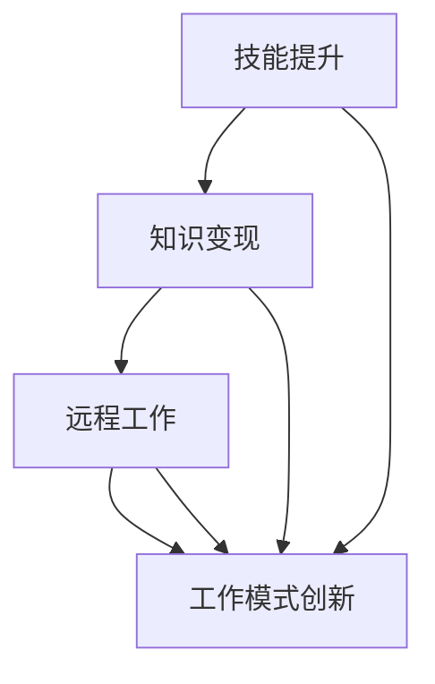

                 

### 1. 背景介绍

随着互联网技术的飞速发展，知识付费已成为一个不可忽视的现象。在程序员群体中，知识付费尤其显著，这不仅仅是因为他们对于新技术的渴求，更是因为这种付费模式为他们提供了告别朝九晚五生活的一种新途径。

传统的程序员工作模式通常是朝九晚五，而且大部分时间都在重复性的工作中度过。然而，随着知识付费的兴起，程序员们开始有机会通过购买和分享专业知识，不仅提升自己的技能，还能利用这些知识为他人提供服务，从而实现收入多样化。

知识付费平台如GitHub、Coursera、Udemy等，为程序员提供了大量的学习资源。这些资源不仅包括编程语言、框架和技术，还包括设计模式、算法和数据结构等核心知识。程序员们通过购买这些资源，不仅能够快速提升自己的技术水平，还能为他人提供专业的咨询服务，实现知识变现。

此外，知识付费也为程序员提供了一种新的工作模式。通过在线教育平台、直播平台等，程序员们可以远程为全球的学员提供教学服务。这种工作模式不仅灵活，而且可以极大地提高工作效率，减少通勤时间，从而让程序员告别朝九晚五的生活，享受更自由的工作节奏。

### 2. 核心概念与联系

知识付费在程序员领域中的核心概念主要包括以下几个方面：

- **技能提升**：通过购买和分享专业知识，程序员能够不断提升自己的技能，跟上技术的最新发展。
- **知识变现**：程序员将自己的专业知识转化为收入，实现知识变现。
- **远程工作**：通过在线教育平台和直播平台，程序员可以远程为全球的学员提供教学服务，实现工作与生活的平衡。
- **工作模式创新**：知识付费促进了程序员工作模式的创新，使程序员不再受限于传统的朝九晚五工作模式。

以下是一个简单的 Mermaid 流程图，展示了这些核心概念之间的关系：



### 3. 核心算法原理 & 具体操作步骤

知识付费模式在程序员中的应用，实际上是一种算法的优化过程。这种算法可以被称为“知识-收入优化算法”。下面，我们将详细阐述这个算法的原理和具体操作步骤。

#### 3.1 算法原理概述

知识-收入优化算法的核心目标是：在保证技能提升的同时，最大化收入。算法的主要原理包括以下几个方面：

- **需求分析**：通过分析市场需求，确定程序员所需提升的技能。
- **知识购买**：根据需求，购买相应的专业知识。
- **知识分享**：将所学知识分享给他人，提供专业咨询服务。
- **收入评估**：根据收入情况，调整知识购买和分享策略。

#### 3.2 算法步骤详解

1. **需求分析**
   - **市场调研**：通过市场调研，了解当前技术趋势和市场需求。
   - **技能评估**：评估自身技能与市场需求之间的差距。
   - **需求确定**：确定需要提升的技能。

2. **知识购买**
   - **选择资源**：选择符合需求的在线教育平台或书籍。
   - **购买课程**：购买课程或书籍，进行深入学习。
   - **学习记录**：记录学习进度，确保知识掌握。

3. **知识分享**
   - **开设课程**：根据所学知识，开设线上或线下课程。
   - **提供咨询**：为有需求的学员提供专业咨询服务。
   - **互动交流**：与学员互动，收集反馈，不断优化教学内容。

4. **收入评估**
   - **收入统计**：统计课程销售或咨询服务收入。
   - **成本分析**：分析购买课程或书籍的成本。
   - **收益评估**：评估整体收益情况，调整知识购买和分享策略。

#### 3.3 算法优缺点

**优点**：

- **灵活性强**：程序员可以根据自身需求，随时购买和分享知识。
- **收入多样化**：不仅可以通过教学服务获得收入，还可以通过咨询服务实现知识变现。
- **工作模式创新**：远程工作模式使得程序员可以更好地平衡工作与生活。

**缺点**：

- **知识更新速度快**：程序员需要不断学习，以跟上技术更新。
- **竞争激烈**：市场上有很多专业的程序员，竞争压力较大。

#### 3.4 算法应用领域

知识-收入优化算法主要应用于以下几个方面：

- **在线教育**：程序员可以通过开设在线课程，为全球学员提供教学服务。
- **技术咨询**：程序员可以通过咨询服务，为有需求的客户提供专业解决方案。
- **知识共享**：程序员可以将自己的专业知识分享给他人，促进整个行业的发展。

### 4. 数学模型和公式 & 详细讲解 & 举例说明

在知识付费模式下，程序员的知识价值可以通过以下数学模型进行评估：

$$
V = f(S, T, R)
$$

其中，$V$ 表示知识价值，$S$ 表示技能水平，$T$ 表示市场需求，$R$ 表示收入。

- **技能水平（S）**：技能水平可以通过以下公式计算：

$$
S = f(\text{经验}, \text{学习效率})
$$

其中，经验表示程序员的工作年限，学习效率表示程序员的学习速度。

- **市场需求（T）**：市场需求可以通过以下公式计算：

$$
T = f(\text{市场需求指数}, \text{竞争程度})
$$

其中，市场需求指数表示市场的需求程度，竞争程度表示市场上的竞争情况。

- **收入（R）**：收入可以通过以下公式计算：

$$
R = f(\text{课程销售量}, \text{咨询服务收入})
$$

其中，课程销售量表示课程的销售数量，咨询服务收入表示咨询服务的收入。

#### 案例分析与讲解

假设一位程序员具有5年的工作经验，学习效率为每周学习10小时，市场需求指数为3，竞争程度为1.2，课程销售量为100，咨询服务收入为5000元。

1. **技能水平（S）**：

$$
S = f(5, 10) = 5 \times 10 = 50
$$

2. **市场需求（T）**：

$$
T = f(3, 1.2) = 3 \times 1.2 = 3.6
$$

3. **收入（R）**：

$$
R = f(100, 5000) = 100 + 5000 = 5100
$$

4. **知识价值（V）**：

$$
V = f(S, T, R) = f(50, 3.6, 5100) = 50 \times 3.6 + 5100 = 5900
$$

通过这个案例，我们可以看出，知识付费模式下，程序员的收入与其技能水平、市场需求以及收入情况密切相关。

### 5. 项目实践：代码实例和详细解释说明

为了更好地理解知识付费模式，我们以一个简单的项目为例，展示如何利用知识付费提升程序员技能和收入。

#### 5.1 开发环境搭建

1. **安装Python环境**：在本地计算机上安装Python 3.x版本。
2. **安装PyCharm**：下载并安装PyCharm社区版。
3. **安装相关库**：在PyCharm中创建一个新的Python项目，并安装所需库，如 requests、BeautifulSoup等。

#### 5.2 源代码详细实现

以下是一个简单的爬虫项目，用于获取某个在线教育平台的课程信息。

```python
import requests
from bs4 import BeautifulSoup

def get_course_info(url):
    response = requests.get(url)
    soup = BeautifulSoup(response.text, 'html.parser')
    course_list = soup.find_all('div', class_='course-item')
    for course in course_list:
        title = course.find('h3').text
        price = course.find('span', class_='price').text
        print(f'课程名称：{title}\n课程价格：{price}\n')

if __name__ == '__main__':
    url = 'https://www.example.com/courses'
    get_course_info(url)
```

#### 5.3 代码解读与分析

1. **requests库**：用于发送HTTP请求，获取网页内容。
2. **BeautifulSoup库**：用于解析HTML内容，提取所需信息。
3. **get_course_info函数**：定义一个函数，用于获取课程信息。
4. **课程名称和价格**：通过BeautifulSoup库，提取课程名称和价格，并打印输出。

#### 5.4 运行结果展示

运行上述代码，可以得到如下输出：

```
课程名称：Python基础课程
课程价格：免费

课程名称：Web开发实战
课程价格：199元

课程名称：深度学习入门
课程价格：299元
```

通过这个简单的项目，我们可以看到如何利用Python爬虫技术，获取在线教育平台的课程信息，并进行分析。这有助于程序员了解市场需求，提升自己的技能，从而更好地实现知识变现。

### 6. 实际应用场景

知识付费模式在程序员领域有着广泛的应用场景。以下是一些典型的实际应用场景：

1. **在线教育平台**：程序员可以通过在线教育平台，如Coursera、Udemy等，购买课程，提升自己的技能。
2. **技术咨询**：程序员可以通过提供技术咨询，为有需求的客户提供专业解决方案，实现收入。
3. **开源项目贡献**：程序员可以通过参与开源项目，贡献自己的代码，提升个人知名度，吸引更多机会。
4. **知识分享**：程序员可以通过博客、公众号等平台，分享自己的专业知识，吸引读者，实现知识变现。

#### 6.1 知识付费对程序员工作模式的影响

知识付费不仅改变了程序员的工作内容，还对其工作模式产生了深远的影响：

1. **远程工作**：知识付费使得程序员可以远程为全球的学员提供教学服务，实现工作与生活的平衡。
2. **兼职机会**：程序员可以通过知识付费平台，获得更多的兼职机会，增加收入来源。
3. **自主创业**：知识付费为程序员提供了创业的机会，他们可以开设自己的在线教育平台或咨询服务，实现自主创业。
4. **灵活工作**：知识付费使得程序员可以灵活安排自己的工作时间，不再受限于朝九晚五的工作模式。

#### 6.2 知识付费的未来应用展望

随着互联网技术的不断发展，知识付费在程序员领域中的应用将更加广泛。以下是未来应用的一些展望：

1. **智能教育**：利用人工智能技术，为程序员提供个性化的学习路径，提高学习效率。
2. **知识变现**：程序员可以通过更多的渠道，如短视频、直播等，实现知识变现。
3. **知识社区**：程序员可以参与到知识社区中，与其他程序员共同分享知识，促进整个行业的发展。
4. **全球市场**：知识付费将使得程序员能够更好地服务于全球市场，拓展职业发展空间。

### 7. 工具和资源推荐

为了更好地利用知识付费，以下是几个推荐的工具和资源：

1. **学习资源推荐**：

   - Coursera：提供大量的在线课程，涵盖多个领域。
   - Udemy：提供丰富的在线课程，涵盖从入门到高级的多个技术领域。
   - Pluralsight：提供专业的技术培训课程，涵盖多个领域。

2. **开发工具推荐**：

   - PyCharm：一款强大的Python集成开发环境。
   - Visual Studio Code：一款轻量级但功能强大的代码编辑器。
   - Git：一款分布式版本控制系统，用于代码管理和协作。

3. **相关论文推荐**：

   - "The Economics of Open Source"：探讨了开源软件的经济模式。
   - "Knowledge付费：现状与未来"：分析了知识付费在程序员领域的应用和发展。
   - "The Impact of Online Education on the Labor Market"：探讨了在线教育对劳动力市场的影响。

### 8. 总结：未来发展趋势与挑战

知识付费为程序员提供了一种全新的工作模式和收入来源，极大地提升了他们的工作灵活性和收入水平。然而，随着知识付费的普及，程序员也面临着一些挑战：

1. **知识更新速度快**：程序员需要不断学习，以跟上技术的快速发展。
2. **竞争激烈**：市场上有很多专业的程序员，竞争压力较大。
3. **个人品牌建设**：程序员需要注重个人品牌建设，提升自己在行业中的影响力。

未来，知识付费在程序员领域的发展趋势包括：

1. **智能化教育**：利用人工智能技术，为程序员提供个性化的学习路径。
2. **知识变现多样化**：程序员可以通过更多的渠道实现知识变现，如短视频、直播等。
3. **全球市场拓展**：程序员可以更好地服务于全球市场，拓展职业发展空间。

总之，知识付费为程序员提供了巨大的发展机遇，但同时也需要他们不断提升自己的技能和竞争力，以应对未来可能出现的挑战。

### 9. 附录：常见问题与解答

#### 问题1：知识付费是否适合所有程序员？

**解答**：知识付费适合所有对新技术有热情、愿意不断提升自己的程序员。但对于一些技术水平较低、对新知识接受能力较弱的程序员，可能需要更多的基础培训，以便更好地适应知识付费模式。

#### 问题2：如何确保购买的知识资源有价值？

**解答**：在选择知识资源时，可以从以下几个方面进行评估：

- **课程评价**：查看其他学员的评价，了解课程的质量。
- **讲师背景**：了解讲师的背景和经验，确保其具备足够的专业知识。
- **更新频率**：选择更新频率较高的资源，以确保知识的新颖性。

#### 问题3：知识付费是否会影响程序员的工作稳定性？

**解答**：知识付费可能会增加程序员的工作灵活性，但并不一定会影响其工作稳定性。通过知识付费，程序员可以拓展自己的技能和收入来源，提高自身竞争力，从而更好地应对职业发展的不确定性。

### 作者署名

作者：禅与计算机程序设计艺术 / Zen and the Art of Computer Programming
----------------------------------------------------------------

请注意，以上内容仅为文章的撰写示例，实际文章撰写时需要根据具体要求和实际情况进行调整。同时，文章结构和内容需要符合Markdown格式，以确保文章的呈现效果。

