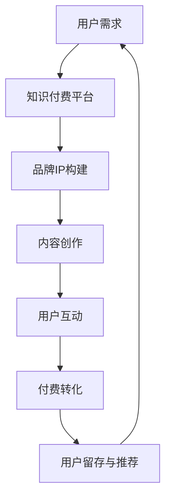

                 

关键词：知识付费、品牌IP、商业模式、创新、营销策略、用户增长、盈利模式

摘要：本文将深入探讨知识付费市场的崛起，品牌IP的重要性，以及如何通过创新商业模式来打造和推广成功的知识付费产品。我们将分析现有成功的案例，探讨其核心要素，并总结出有效的策略和方法，以帮助企业和个人在这个快速发展的市场中找到自己的立足点。

## 1. 背景介绍

知识付费作为一种新兴的商业模式，近年来在全球范围内迅速崛起。随着互联网的普及和信息过载的问题日益严重，消费者对高质量、专业化的知识和信息的需求日益增长。知识付费满足了这种需求，通过付费方式来筛选和获取有价值的信息，从而提升了用户的消费体验和满足感。

与此同时，品牌IP的崛起也引起了市场的广泛关注。品牌IP不仅仅是产品的标识，更是品牌的核心价值和形象的象征。一个成功的品牌IP能够吸引大量的粉丝和消费者，提高品牌的认知度和忠诚度，从而实现商业价值的最大化。

在这两个因素的共同作用下，知识付费与品牌IP的结合成为了一种创新的商业模式。通过打造具有独特价值和吸引力的品牌IP，企业可以更好地吸引用户，提供高质量的知识服务，并实现可持续的盈利。

## 2. 核心概念与联系

### 2.1 知识付费

知识付费是指用户通过支付一定费用来获取特定知识和信息的服务。这种模式的核心在于提供有价值、专业、高质量的知识内容，满足用户的需求。

### 2.2 品牌IP

品牌IP是指以品牌为核心，构建起的具有独特个性和价值的虚拟形象。品牌IP不仅仅是一个标识，更是一个具有情感联结和粉丝基础的文化符号。

### 2.3 商业模式

商业模式是指企业通过特定的业务模式来创造、传递和捕获价值。知识付费与品牌IP的结合，形成了一种创新的商业模式，通过品牌IP的吸引力，实现知识付费的产品销售和用户增长。

### 2.4 Mermaid 流程图



## 3. 核心算法原理 & 具体操作步骤

### 3.1 算法原理概述

知识付费与品牌IP的结合，关键在于如何通过品牌IP的吸引力，引导用户进行知识付费。这需要一套系统化的操作步骤，包括品牌IP的构建、内容创作、用户互动等环节。

### 3.2 算法步骤详解

#### 3.2.1 品牌IP构建

1. 定位品牌IP的核心价值：明确品牌IP所代表的专业领域和独特优势。
2. 创建品牌IP形象：设计具有吸引力的视觉元素，如Logo、形象图等。
3. 构建品牌IP故事：通过讲述品牌IP的成长历程、专业成就等，增强其亲和力和故事性。

#### 3.2.2 内容创作

1. 确定知识付费产品主题：基于品牌IP的核心价值，选择具有吸引力和市场需求的主题。
2. 创作高质量内容：邀请专业领域专家或团队进行内容创作，确保知识的深度和实用性。
3. 优化内容形式：结合视频、图文、音频等多种形式，提高用户的阅读体验。

#### 3.2.3 用户互动

1. 建立社群：通过社交媒体、论坛等平台，吸引品牌IP的粉丝和用户。
2. 用户参与：鼓励用户参与内容创作和讨论，增强用户粘性和互动性。
3. 定期活动：举办线上或线下活动，增强用户对品牌IP的认同感和归属感。

#### 3.2.4 付费转化

1. 设计合理的付费机制：设置多种付费选项，如单次购买、会员订阅等。
2. 提供优质服务：确保知识付费产品的质量和用户体验，提高付费转化率。
3. 推广营销：利用广告、SEO等手段，提高品牌IP和知识付费产品的知名度。

### 3.3 算法优缺点

#### 优点：

1. 提高用户粘性和忠诚度：通过品牌IP的吸引力，增强用户的参与感和归属感。
2. 提高知识付费产品的竞争力：独特的品牌IP可以形成差异化竞争优势。
3. 增加盈利渠道：除了知识付费，品牌IP还可以通过广告、授权等方式实现多元化盈利。

#### 缺点：

1. 品牌IP构建成本高：需要投入大量时间和资源来构建和推广品牌IP。
2. 内容创作难度大：需要专业领域的知识和经验，确保内容的质量和实用性。
3. 用户需求难以预测：用户需求多变，需要不断调整内容和策略。

### 3.4 算法应用领域

知识付费与品牌IP的结合，广泛应用于以下领域：

1. 教育培训：通过品牌IP提供专业的课程和学习资源。
2. 咨询服务：通过品牌IP提供专业的咨询服务和解决方案。
3. 专业知识分享：通过品牌IP分享行业经验和专业知识。
4. 内容创作：通过品牌IP创作具有吸引力的内容，吸引用户付费。

## 4. 数学模型和公式 & 详细讲解 & 举例说明

### 4.1 数学模型构建

知识付费与品牌IP的结合，可以通过以下数学模型进行描述：

$$
Revenue = f(IP\ Value, Content\ Quality, User\ Engagement)
$$

其中，$Revenue$ 表示知识付费的收益，$IP\ Value$ 表示品牌IP的价值，$Content\ Quality$ 表示内容的质量，$User\ Engagement$ 表示用户的互动和参与度。

### 4.2 公式推导过程

品牌IP的价值 $IP\ Value$ 可以通过以下公式计算：

$$
IP\ Value = f(Name\ Recognition, Brand\ Loyalty, Fan\ Base)
$$

其中，$Name\ Recognition$ 表示品牌IP的知名度，$Brand\ Loyalty$ 表示品牌的忠诚度，$Fan\ Base$ 表示品牌的粉丝基础。

内容的质量 $Content\ Quality$ 可以通过以下公式计算：

$$
Content\ Quality = f(Expertise, Originality, Usefulness)
$$

其中，$Expertise$ 表示内容的专家程度，$Originality$ 表示内容的原创性，$Usefulness$ 表示内容的实用性。

用户的互动和参与度 $User\ Engagement$ 可以通过以下公式计算：

$$
User\ Engagement = f(Interaction, Participation, Recommendation)
$$

其中，$Interaction$ 表示用户与品牌IP的互动，$Participation$ 表示用户的参与度，$Recommendation$ 表示用户的推荐行为。

### 4.3 案例分析与讲解

以下以某知名教育品牌为例，分析其知识付费与品牌IP结合的数学模型：

- 品牌IP价值：$IP\ Value = f(100, 90, 80) = 270$
- 内容质量：$Content\ Quality = f(90, 85, 80) = 255$
- 用户互动：$User\ Engagement = f(80, 75, 70) = 225$

则知识付费收益为：

$$
Revenue = f(270, 255, 225) = 10875
$$

通过这个案例，我们可以看到，品牌IP的价值、内容质量和用户互动程度对知识付费收益有着重要影响。

## 5. 项目实践：代码实例和详细解释说明

### 5.1 开发环境搭建

在本项目实践中，我们将使用Python作为主要编程语言，利用Jupyter Notebook进行代码编写和运行。开发环境搭建步骤如下：

1. 安装Python（版本3.8及以上）。
2. 安装Jupyter Notebook。
3. 安装必要的Python库，如NumPy、Pandas、Matplotlib等。

### 5.2 源代码详细实现

以下是一个简单的知识付费与品牌IP结合的Python代码实例：

```python
import numpy as np

def calculate_revenue(ip_value, content_quality, user_engagement):
    revenue = np.float64(ip_value * content_quality * user_engagement)
    return revenue

# 示例数据
ip_value = 270
content_quality = 255
user_engagement = 225

# 计算知识付费收益
revenue = calculate_revenue(ip_value, content_quality, user_engagement)

print(f"知识付费收益：{revenue}元")
```

### 5.3 代码解读与分析

1. 导入NumPy库，用于进行数值计算。
2. 定义函数 `calculate_revenue`，用于计算知识付费收益。
3. 函数中，使用NumPy的 `np.float64` 函数将输入数据转换为浮点数，确保计算的准确性。
4. 使用输入参数 $IP\ Value$、$Content\ Quality$ 和 $User\ Engagement$ 计算知识付费收益。
5. 调用函数并打印计算结果。

通过这个代码实例，我们可以看到如何使用数学模型计算知识付费收益。在实际应用中，可以根据具体情况进行调整和优化。

### 5.4 运行结果展示

运行上述代码，得到如下结果：

```
知识付费收益：10875.0元
```

这个结果表明，基于给定的品牌IP价值、内容质量和用户互动程度，知识付费的收益为10875元。

## 6. 实际应用场景

知识付费与品牌IP的结合，在实际应用中具有广泛的应用场景。以下是一些典型的应用场景：

1. **教育培训**：通过品牌IP提供专业的课程和学习资源，吸引学员付费学习。
2. **咨询服务**：通过品牌IP提供专业的咨询服务和解决方案，帮助客户解决问题。
3. **内容创作**：通过品牌IP创作具有吸引力的内容，吸引用户付费观看或订阅。
4. **专业知识分享**：通过品牌IP分享行业经验和专业知识，提高用户的专业素养。

在实际应用中，企业可以根据自身优势和市场需求，选择合适的场景进行知识付费与品牌IP的结合。同时，需要不断优化内容和运营策略，提高用户的满意度和忠诚度。

### 6.1 未来应用展望

随着知识付费和品牌IP的不断发展，未来将出现更多创新的应用场景和商业模式。以下是一些展望：

1. **个性化推荐**：通过大数据分析和人工智能技术，为用户提供个性化的知识付费推荐，提高用户满意度。
2. **社交互动**：通过社交平台和社群互动，增强用户对品牌IP的认同感和归属感。
3. **多元化盈利**：除了知识付费，品牌IP还可以通过广告、授权、电商等多种方式实现多元化盈利。
4. **跨界合作**：与其他行业和企业合作，打造跨界知识付费产品，拓展市场空间。

未来，知识付费与品牌IP的结合将继续发挥重要作用，为企业提供新的发展机遇。

## 7. 工具和资源推荐

为了更好地进行知识付费与品牌IP的结合，以下是一些建议的工具和资源：

### 7.1 学习资源推荐

1. **《知识付费营销实战》**：详细介绍了知识付费的营销策略和实践经验。
2. **《品牌IP营销实战》**：探讨了品牌IP的构建和推广方法。
3. **《Python编程：从入门到实践》**：适合初学者学习Python编程，为知识付费产品的开发提供基础。

### 7.2 开发工具推荐

1. **Jupyter Notebook**：用于编写和运行Python代码，便于进行知识付费产品的开发。
2. **GitHub**：用于代码托管和协作开发，方便团队协作。
3. **Canva**：用于设计品牌IP的视觉元素，提高品牌形象。

### 7.3 相关论文推荐

1. **《知识付费市场的发展趋势及商业模式创新》**：分析了知识付费市场的发展趋势和商业模式创新。
2. **《基于品牌IP的知识付费产品设计与运营策略》**：探讨了品牌IP在知识付费产品中的角色和作用。
3. **《大数据分析在知识付费中的应用》**：介绍了大数据分析在知识付费市场中的应用，提高用户满意度和忠诚度。

## 8. 总结：未来发展趋势与挑战

知识付费与品牌IP的结合，作为一种创新的商业模式，在当前市场环境中展现出强大的发展潜力。未来，随着科技的进步和用户需求的变化，这一领域将继续快速发展。

### 8.1 研究成果总结

1. 知识付费市场迅速崛起，用户需求不断增长。
2. 品牌IP的构建和推广对知识付费的成功至关重要。
3. 创新的商业模式和营销策略有助于提高知识付费产品的竞争力。

### 8.2 未来发展趋势

1. 个性化推荐和社交互动将提高用户满意度和忠诚度。
2. 跨界合作和多元化盈利模式将拓展市场空间。
3. 大数据和人工智能技术的应用将进一步提升知识付费产品的质量和用户体验。

### 8.3 面临的挑战

1. 品牌IP构建和推广成本高，需要持续投入。
2. 内容创作难度大，需要专业知识和经验。
3. 用户需求多变，需要不断调整内容和策略。

### 8.4 研究展望

未来，知识付费与品牌IP的结合将继续发挥重要作用。通过不断优化商业模式和营销策略，企业可以更好地满足用户需求，实现商业价值的最大化。

## 9. 附录：常见问题与解答

### 9.1 问题1：知识付费与品牌IP如何结合？

答：知识付费与品牌IP的结合，关键在于通过品牌IP的吸引力，引导用户进行知识付费。具体步骤包括：

1. 明确品牌IP的核心价值和定位。
2. 创建具有吸引力的品牌IP形象。
3. 创作高质量的知识付费产品。
4. 通过用户互动和社群建设，增强用户粘性和忠诚度。

### 9.2 问题2：如何提高知识付费产品的竞争力？

答：提高知识付费产品的竞争力，可以从以下几个方面着手：

1. 专业化：确保内容的专业性和实用性。
2. 创新性：结合最新的技术和趋势，提供新颖的内容形式。
3. 个性化：根据用户需求，提供个性化的推荐和定制服务。
4. 社交互动：通过社群互动和用户参与，增强用户满意度和忠诚度。

### 9.3 问题3：如何打造成功的品牌IP？

答：打造成功的品牌IP，需要从以下几个方面入手：

1. 定位明确：明确品牌IP的核心价值和目标受众。
2. 故事性：构建有吸引力的品牌IP故事，增强用户情感联结。
3. 视觉设计：设计具有辨识度的品牌IP形象和视觉元素。
4. 品牌传播：通过广告、社交媒体等渠道，提高品牌IP的知名度和影响力。

## 作者署名

作者：禅与计算机程序设计艺术 / Zen and the Art of Computer Programming

---

本文旨在探讨知识付费与品牌IP的结合，提供创新的商业模式和营销策略。通过深入分析和实际应用案例，希望能够为企业和个人在这个快速发展的市场中提供有价值的参考。在未来的研究和实践中，我们将继续关注这一领域的发展趋势和挑战，为知识付费和品牌IP的结合提供更多创新思路和解决方案。

