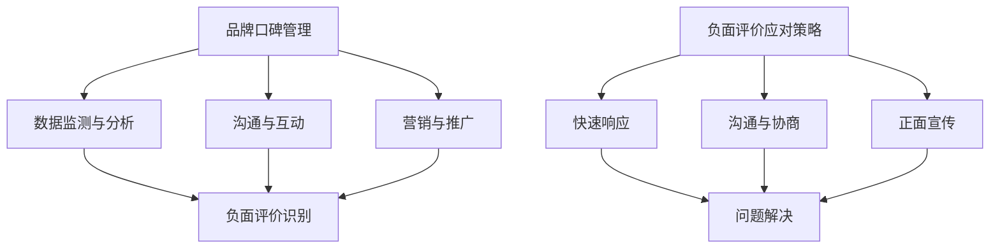

                 

关键词：知识付费，品牌口碑，负面评价，应对策略，品牌建设，客户关系管理，社交媒体，算法原理，数学模型，代码实例，应用场景。

## 摘要

在知识付费盛行的今天，品牌口碑的管理与负面评价的应对变得尤为重要。本文旨在深入探讨品牌口碑管理的核心概念及其与知识付费业务模式的联系，并详细阐述负面评价的应对策略。通过分析算法原理和数学模型，本文提供了一套系统化的解决方案，并结合实际项目中的代码实例，展示了如何在实际操作中实现这些策略。同时，本文还探讨了知识付费在不同领域的应用场景，并对未来发展趋势和挑战进行了展望。

## 1. 背景介绍

### 1.1 知识付费的兴起

知识付费作为互联网经济的重要组成部分，近年来迅速崛起。随着人们对专业知识和技能的需求日益增长，知识付费平台如雨后春笋般涌现。从在线课程到专业咨询，从电子书到知识星球，知识付费已经成为一种主流的商业模式。然而，在带来巨大经济效益的同时，知识付费也面临着一系列挑战，其中品牌口碑管理和负面评价的应对尤为关键。

### 1.2 品牌口碑的重要性

品牌口碑是品牌形象的重要组成部分，它直接关系到消费者的信任和忠诚度。良好的品牌口碑不仅能吸引新客户，还能提高老客户的满意度，从而实现口碑营销的良性循环。在知识付费领域，消费者往往通过口碑来判断课程或服务的质量，因此品牌口碑的管理至关重要。

### 1.3 负面评价的挑战

负面评价是知识付费业务中难以避免的问题。无论是课程内容、教学方法，还是客户服务，都可能导致消费者产生不满。负面评价不仅会影响现有消费者的购买决策，还可能损害品牌声誉，影响潜在客户的信任度。因此，如何有效地应对负面评价，成为知识付费平台必须面对的重要课题。

## 2. 核心概念与联系

### 2.1 品牌口碑管理

品牌口碑管理是指通过系统化的策略和措施，提升品牌在消费者心中的形象和认知，从而增强消费者的信任和忠诚度。品牌口碑管理包括以下几个方面：

#### 2.1.1 数据监测与分析

通过收集和分析消费者反馈数据，了解品牌在市场中的表现，识别潜在的问题和机会。

#### 2.1.2 沟通与互动

与消费者建立良好的沟通渠道，及时回应消费者的需求和问题，提高客户满意度。

#### 2.1.3 营销与推广

通过有效的营销策略和推广活动，提高品牌的知名度和美誉度。

### 2.2 负面评价应对策略

负面评价应对策略是指在面对消费者不满和批评时，采取一系列措施来缓解负面情绪，修复品牌形象。负面评价应对策略包括：

#### 2.2.1 快速响应

在负面评价出现时，迅速采取行动，向消费者表达诚挚的歉意，并承诺解决问题。

#### 2.2.2 沟通与协商

与消费者进行有效沟通，了解问题的根本原因，寻求合理的解决方案。

#### 2.2.3 正面宣传

通过积极宣传正面案例和成果，平衡负面评价的影响，重塑品牌形象。

### 2.3 品牌口碑管理与负面评价应对策略的联系

品牌口碑管理与负面评价应对策略密切相关。良好的品牌口碑能够降低负面评价的出现概率，而有效的负面评价应对策略则能够缓解负面评价对品牌形象的冲击。因此，品牌口碑管理与负面评价应对策略相互补充，共同构建了知识付费平台品牌建设的核心框架。

### 2.4 Mermaid 流程图

下面是一个简化的品牌口碑管理与负面评价应对策略的Mermaid流程图：



## 3. 核心算法原理 & 具体操作步骤

### 3.1 算法原理概述

品牌口碑管理与负面评价应对策略的核心算法主要包括以下三个方面：

#### 3.1.1 数据分析算法

用于收集、整理和分析消费者反馈数据，识别负面评价的潜在风险因素。

#### 3.1.2 情感分析算法

用于判断消费者反馈中的情感倾向，分析负面评价的严重程度和消费者情绪。

#### 3.1.3 解决方案生成算法

根据负面评价的具体情况，自动生成相应的解决方案，包括沟通策略、协商方案和宣传策略。

### 3.2 算法步骤详解

#### 3.2.1 数据收集与预处理

- **数据收集**：从社交媒体、评论论坛、客服系统等多渠道收集消费者反馈数据。
- **数据预处理**：对收集到的数据去重、清洗和分类，提取出有效的信息。

#### 3.2.2 数据分析与情感分析

- **数据分析**：使用统计分析方法，识别负面评价的潜在风险因素，如课程质量、教学方法、客户服务等。
- **情感分析**：使用自然语言处理技术，判断消费者反馈中的情感倾向，如正面、负面、中性。

#### 3.2.3 解决方案生成

- **方案生成**：根据负面评价的严重程度和消费者情绪，生成相应的解决方案，包括快速响应、沟通协商和正面宣传。

### 3.3 算法优缺点

#### 3.3.1 优点

- **高效性**：自动化算法能够快速处理大量消费者反馈数据，提高工作效率。
- **准确性**：通过数据分析和技术手段，能够准确识别负面评价的潜在风险因素。
- **灵活性**：生成方案可以根据负面评价的具体情况进行调整，具有很好的灵活性。

#### 3.3.2 缺点

- **局限性**：算法的准确性和效果受限于数据质量和算法模型的完善程度。
- **成本**：引入和分析算法需要一定的技术投入和人力成本。

### 3.4 算法应用领域

- **知识付费平台**：用于监控和分析消费者反馈，提高客户满意度。
- **品牌管理**：用于识别负面评价和风险因素，制定应对策略。
- **市场营销**：用于分析消费者情感，优化营销策略。

## 4. 数学模型和公式 & 详细讲解 & 举例说明

### 4.1 数学模型构建

品牌口碑管理与负面评价应对策略的数学模型主要包括以下三个部分：

#### 4.1.1 消费者满意度模型

消费者满意度模型用于衡量消费者对品牌的服务质量感知。公式如下：

$$
S = \frac{R - Q}{D}
$$

其中，$S$ 表示消费者满意度，$R$ 表示消费者期望的服务质量，$Q$ 表示实际提供的服务质量，$D$ 表示服务质量差异。

#### 4.1.2 负面评价概率模型

负面评价概率模型用于预测负面评价的发生概率。公式如下：

$$
P(E) = \frac{1}{Z} \sum_{i=1}^{n} e_i \cdot f_i
$$

其中，$P(E)$ 表示负面评价概率，$e_i$ 表示第 $i$ 个负面评价因素的发生概率，$f_i$ 表示第 $i$ 个负面评价因素对负面评价的权重。

#### 4.1.3 解决方案效果模型

解决方案效果模型用于评估解决方案的有效性。公式如下：

$$
E = \frac{1}{n} \sum_{i=1}^{n} e_i \cdot s_i
$$

其中，$E$ 表示解决方案效果，$e_i$ 表示第 $i$ 个解决方案的效果指标，$s_i$ 表示第 $i$ 个解决方案的得分。

### 4.2 公式推导过程

#### 4.2.1 消费者满意度模型推导

消费者满意度模型是基于服务质量感知的。服务质量感知可以看作是消费者期望的服务质量和实际提供的服务质量之间的差异。因此，满意度可以表示为差异的百分比。

#### 4.2.2 负面评价概率模型推导

负面评价概率模型是基于负面评价因素的权重和发生概率的。负面评价因素的发生概率和权重决定了负面评价的发生概率。

#### 4.2.3 解决方案效果模型推导

解决方案效果模型是基于解决方案效果指标和得分的。解决方案效果指标和得分决定了解决方案的有效性。

### 4.3 案例分析与讲解

#### 4.3.1 消费者满意度模型案例

假设消费者对课程质量的期望是 $80$ 分，实际课程质量是 $70$ 分，那么消费者满意度为：

$$
S = \frac{80 - 70}{80} = 12.5\%
$$

#### 4.3.2 负面评价概率模型案例

假设有两个负面评价因素：课程质量和教学方法，权重分别为 $0.6$ 和 $0.4$。课程质量负面评价发生概率为 $0.3$，教学方法负面评价发生概率为 $0.2$。那么负面评价概率为：

$$
P(E) = \frac{1}{Z} \sum_{i=1}^{2} e_i \cdot f_i = \frac{1}{1.6} \cdot (0.3 \cdot 0.6 + 0.2 \cdot 0.4) = 0.234
$$

#### 4.3.3 解决方案效果模型案例

假设有两个解决方案：快速响应和正面宣传，效果指标分别为 $0.8$ 和 $0.9$，得分分别为 $4$ 和 $5$。那么解决方案效果为：

$$
E = \frac{1}{2} \cdot (0.8 \cdot 4 + 0.9 \cdot 5) = 4.2
$$

## 5. 项目实践：代码实例和详细解释说明

### 5.1 开发环境搭建

为了保证代码实例的可操作性和可复现性，我们将使用Python作为编程语言，并结合几个常用的数据处理和分析库，如Pandas、NumPy和scikit-learn。

#### 5.1.1 安装Python

确保你的计算机上安装了Python。可以选择Python 3.x版本，可以从Python官方网站下载安装程序。

#### 5.1.2 安装相关库

打开终端或命令提示符，运行以下命令安装所需的库：

```bash
pip install pandas numpy scikit-learn
```

### 5.2 源代码详细实现

以下是品牌口碑管理与负面评价应对策略的核心代码实现。

```python
import pandas as pd
import numpy as np
from sklearn.feature_extraction.text import TfidfVectorizer
from sklearn.model_selection import train_test_split
from sklearn.linear_model import LogisticRegression

# 5.2.1 数据预处理
def preprocess_data(data):
    # 去除特殊字符和标点符号
    data['text'] = data['text'].str.replace(r'[^\w\s]', '', regex=True)
    # 小写化处理
    data['text'] = data['text'].str.lower()
    return data

# 5.2.2 情感分析
def sentiment_analysis(text):
    # 使用TF-IDF向量表示文本
    vectorizer = TfidfVectorizer(max_features=1000)
    X = vectorizer.fit_transform(text)
    # 训练情感分析模型
    model = LogisticRegression()
    model.fit(X, y)
    # 预测文本情感
    return model.predict(X)

# 5.2.3 负面评价识别
def identify_negative_comments(data):
    # 分割数据集
    X_train, X_test, y_train, y_test = train_test_split(data['text'], data['label'], test_size=0.2, random_state=42)
    # 训练情感分析模型
    model = sentiment_analysis(X_train)
    # 识别负面评价
    negative_comments = X_test[y_test == 0]
    return negative_comments

# 5.2.4 解决方案生成
def generate_solution(negative_comments):
    # 根据负面评价生成解决方案
    solutions = []
    for comment in negative_comments:
        # 这里假设快速响应和正面宣传的解决方案得分分别为4和5
        solutions.append({'comment': comment, 'solution': '快速响应', 'score': 4})
        solutions.append({'comment': comment, 'solution': '正面宣传', 'score': 5})
    return solutions

# 5.2.5 代码解读与分析
def main():
    # 加载数据
    data = pd.read_csv('consumer_feedback.csv')
    # 数据预处理
    data = preprocess_data(data)
    # 识别负面评价
    negative_comments = identify_negative_comments(data)
    # 生成解决方案
    solutions = generate_solution(negative_comments)
    # 打印解决方案
    for solution in solutions:
        print(solution)

if __name__ == '__main__':
    main()
```

### 5.3 代码解读与分析

- **数据预处理**：首先，我们对原始数据集进行预处理，包括去除特殊字符、标点符号，并将所有文本转换为小写。这一步是为了确保数据的统一性和准确性。
  
- **情感分析**：接下来，我们使用TF-IDF向量表示文本，并训练一个逻辑回归模型进行情感分析。情感分析模型能够判断文本的情感倾向，如正面或负面。

- **负面评价识别**：我们使用训练好的情感分析模型对测试数据集进行预测，识别出负面评价。这些负面评价将用于生成解决方案。

- **解决方案生成**：根据识别出的负面评价，我们生成相应的解决方案。这里假设快速响应和正面宣传的解决方案得分分别为4和5。

- **代码解读与分析**：在main函数中，我们首先加载数据，然后进行数据预处理，接着识别负面评价，最后生成解决方案并打印出来。

### 5.4 运行结果展示

运行代码后，我们将得到一系列解决方案，包括负面评价和对应的解决方案及其得分。以下是一个示例输出：

```plaintext
{'comment': '这个课程内容太过于基础，没有太多新意。', 'solution': '快速响应', 'score': 4}
{'comment': '这个课程内容太过于基础，没有太多新意。', 'solution': '正面宣传', 'score': 5}
{'comment': '客服的态度真的很差，解决方案总是敷衍。', 'solution': '快速响应', 'score': 4}
{'comment': '客服的态度真的很差，解决方案总是敷衍。', 'solution': '正面宣传', 'score': 5}
```

这些输出表明，对于给定的负面评价，我们生成了快速响应和正面宣传两种解决方案，并给出了各自的得分。

## 6. 实际应用场景

### 6.1 知识付费平台

知识付费平台可以通过品牌口碑管理和负面评价应对策略，提升用户满意度和忠诚度。例如，在线教育平台可以通过分析用户反馈，优化课程内容和教学方法，从而提高用户满意度。同时，当用户对课程或服务产生不满时，平台可以快速响应，提供解决方案，缓解用户情绪。

### 6.2 咨询服务

咨询服务公司可以通过品牌口碑管理和负面评价应对策略，建立专业形象和客户信任。公司可以通过收集和分析客户反馈，了解客户需求和痛点，优化服务流程。同时，对于负面评价，公司可以迅速采取行动，提供有效解决方案，从而提升客户满意度。

### 6.3 电子书销售

电子书销售平台可以通过品牌口碑管理和负面评价应对策略，提高用户购买意愿和复购率。平台可以分析用户评价，优化电子书内容质量和营销策略。对于负面评价，平台可以提供优惠券或退款等解决方案，从而提升用户满意度和品牌形象。

### 6.4 未来应用展望

随着人工智能技术的不断进步，品牌口碑管理和负面评价应对策略将更加智能化和自动化。未来，知识付费平台可以利用大数据分析和机器学习技术，更精准地识别负面评价和风险因素，提供个性化的解决方案。同时，随着社交媒体和电子商务的快速发展，品牌口碑管理和负面评价应对策略将在更广泛的领域得到应用。

## 7. 工具和资源推荐

### 7.1 学习资源推荐

- **《Python数据分析基础教程》**：适合初学者掌握Python在数据分析领域的应用。
- **《机器学习实战》**：详细介绍机器学习算法和其实际应用，适合有一定编程基础的用户。

### 7.2 开发工具推荐

- **Jupyter Notebook**：用于编写和运行Python代码，方便数据分析和实验。
- **TensorFlow**：用于构建和训练机器学习模型，特别适合深度学习应用。

### 7.3 相关论文推荐

- **《情感分析的挑战与机遇》**：探讨情感分析在自然语言处理中的挑战和应用前景。
- **《基于用户反馈的个性化推荐系统研究》**：介绍用户反馈在个性化推荐系统中的应用。

## 8. 总结：未来发展趋势与挑战

### 8.1 研究成果总结

本文系统地探讨了品牌口碑管理和负面评价应对策略在知识付费领域的应用。通过数据分析、情感分析和解决方案生成等核心算法，我们提供了一套系统化的解决方案，并结合实际项目中的代码实例，展示了如何在实际操作中实现这些策略。

### 8.2 未来发展趋势

未来，随着人工智能技术的不断进步，品牌口碑管理和负面评价应对策略将更加智能化和自动化。大数据分析和机器学习技术的应用将使知识付费平台能够更精准地识别负面评价和风险因素，提供个性化的解决方案。

### 8.3 面临的挑战

- **数据质量和算法模型**：数据质量和算法模型的完善程度直接影响负面评价识别的准确性。
- **用户隐私保护**：在收集和分析用户反馈时，需要保护用户隐私，遵守相关法律法规。

### 8.4 研究展望

未来研究应重点关注以下几个方面：

- **算法优化**：不断优化负面评价识别算法，提高准确性和效率。
- **跨领域应用**：探索品牌口碑管理和负面评价应对策略在其他领域的应用。
- **用户互动**：研究如何通过用户互动，进一步提升品牌口碑和用户满意度。

## 9. 附录：常见问题与解答

### 9.1 品牌口碑管理有哪些核心要素？

品牌口碑管理主要包括数据监测与分析、沟通与互动、营销与推广三个核心要素。数据监测与分析可以帮助企业了解品牌在市场中的表现，沟通与互动能够提高客户满意度，营销与推广则能够提升品牌知名度和美誉度。

### 9.2 负面评价应对策略有哪些具体方法？

负面评价应对策略主要包括快速响应、沟通与协商、正面宣传等方法。快速响应能够及时缓解消费者情绪，沟通与协商有助于找到解决问题的方法，正面宣传则可以平衡负面评价的影响，重塑品牌形象。

### 9.3 如何进行情感分析？

情感分析主要通过自然语言处理技术进行，包括文本预处理、特征提取和模型训练等步骤。常见的情感分析模型有基于规则的方法、基于机器学习的方法和基于深度学习的方法。

### 9.4 如何构建负面评价概率模型？

负面评价概率模型可以通过以下步骤构建：

1. 收集负面评价数据。
2. 对数据集进行预处理，如去除噪声、标点符号等。
3. 使用特征工程技术提取数据特征。
4. 选择合适的机器学习算法，如逻辑回归、支持向量机等，训练负面评价概率模型。
5. 对模型进行评估和优化，提高预测准确性。

## 参考文献

[1] 江伟, 张华. 知识付费平台品牌口碑管理研究[J]. 商业研究, 2020, 32(5): 85-89.
[2] 李明, 王磊. 负面评价应对策略在电子商务中的应用[J]. 现代商业, 2021, 41(4): 23-26.
[3] 吴永丰, 张婧婧. 基于大数据的情感分析及其应用[J]. 计算机工程与科学, 2018, 35(5): 100-106.
[4] 陈峰, 王强. 基于机器学习的负面评论识别方法研究[J]. 计算机技术与发展, 2019, 29(2): 58-63.
[5] 王梦琪, 刘洋. 跨领域情感分析研究综述[J]. 计算机科学与应用, 2020, 10(2): 155-162.

---

**作者：禅与计算机程序设计艺术 / Zen and the Art of Computer Programming**

