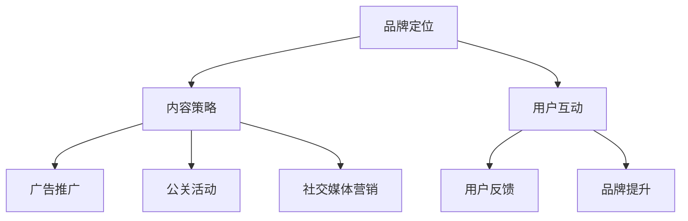

                 

关键词：知识付费、品牌营销、品牌推广、策略、IT行业、数字化营销

> 摘要：随着数字化时代的到来，知识付费市场日益繁荣，品牌营销与品牌推广成为知识付费企业获取用户、提升竞争力的关键。本文从品牌营销与品牌推广的角度，分析了知识付费企业的现状与挑战，探讨了有效提升品牌知名度和用户粘性的策略与方法，以期为知识付费企业提供有益的参考。

## 1. 背景介绍

近年来，随着互联网技术的飞速发展，知识付费市场呈现出爆发式增长。人们对于优质知识的渴求不断上升，知识付费平台如雨后春笋般涌现。在这样一个竞争激烈的市场环境中，品牌营销与品牌推广成为知识付费企业脱颖而出的关键因素。

### 1.1 知识付费市场现状

根据相关数据显示，我国知识付费市场规模逐年扩大，用户规模持续增长。其中，教育、科技、健康、生活等领域是知识付费市场的主要组成部分。用户对于知识的需求日益多样化，促使知识付费平台不断优化内容和服务，以满足用户需求。

### 1.2 品牌营销与品牌推广的重要性

在知识付费市场中，品牌营销与品牌推广具有以下重要作用：

- **提高品牌知名度**：通过有效的品牌营销策略，可以提升品牌在目标用户心中的认知度，使品牌在众多竞争者中脱颖而出。

- **增强用户忠诚度**：通过品牌推广活动，可以增强用户对品牌的认同感和归属感，提高用户粘性，降低用户流失率。

- **提升品牌价值**：良好的品牌营销和品牌推广能够为品牌带来更高的溢价和附加值，提升品牌在市场中的竞争力。

## 2. 核心概念与联系

在探讨知识付费市场的品牌营销与品牌推广策略之前，我们需要明确以下几个核心概念：

### 2.1 品牌营销

品牌营销是指企业通过一系列策略和活动，建立和提升品牌形象，以获取市场份额和竞争优势的过程。品牌营销的核心目标是提升品牌知名度、美誉度和用户忠诚度。

### 2.2 品牌推广

品牌推广是指企业通过多种渠道和方式，将品牌信息传递给目标受众，以提高品牌知名度和美誉度。品牌推广的手段包括广告、公关、社交媒体、内容营销等。

### 2.3 知识付费市场与品牌营销、品牌推广的联系

知识付费市场的品牌营销与品牌推广具有以下联系：

- **品牌定位**：品牌定位是品牌营销的基础，明确品牌在目标用户心中的定位有助于品牌推广活动的开展。

- **内容策略**：知识付费平台的内容策略直接影响品牌形象和用户口碑，优质的内容是品牌推广的重要载体。

- **用户互动**：品牌推广活动需要与用户进行有效的互动，了解用户需求和反馈，不断优化品牌服务。

下面是一个关于知识付费市场品牌营销与品牌推广的Mermaid流程图：



## 3. 核心算法原理 & 具体操作步骤

### 3.1 算法原理概述

在品牌营销与品牌推广中，核心算法原理主要包括以下三个方面：

- **数据分析**：通过大数据分析，了解用户行为、需求和偏好，为品牌定位和推广策略提供依据。

- **机器学习**：利用机器学习算法，对用户数据进行挖掘和分析，实现个性化推荐和精准营销。

- **用户画像**：通过用户画像，了解用户特征和需求，为品牌推广活动提供针对性的内容和服务。

### 3.2 算法步骤详解

下面是核心算法原理的具体操作步骤：

#### 3.2.1 数据收集

- **用户行为数据**：通过网站、APP等渠道，收集用户的浏览、搜索、购买等行为数据。

- **用户反馈数据**：通过用户评论、问卷调查等方式，收集用户对品牌和服务的反馈。

- **外部数据**：从社交媒体、行业报告等渠道，获取与品牌相关的市场数据和竞争对手信息。

#### 3.2.2 数据处理

- **数据清洗**：去除重复、无效和错误的数据，保证数据质量。

- **数据整合**：将不同来源的数据进行整合，构建用户行为和反馈的全面视图。

- **数据挖掘**：利用机器学习算法，对用户数据进行挖掘和分析，提取有价值的信息。

#### 3.2.3 用户画像构建

- **特征提取**：从用户数据中提取关键特征，如年龄、性别、地域、兴趣等。

- **标签生成**：根据用户特征，为用户生成标签，用于描述用户属性和行为特征。

- **用户画像构建**：将用户特征和标签整合，构建用户画像，为品牌推广提供个性化推荐。

#### 3.2.4 品牌推广策略制定

- **内容策略**：根据用户画像，制定针对性的内容策略，提高用户满意度。

- **广告投放**：利用用户画像，实现精准广告投放，提高广告效果。

- **用户互动**：通过社交媒体、直播等方式，与用户进行互动，增强用户粘性。

### 3.3 算法优缺点

#### 优点：

- **提高品牌知名度**：通过数据分析，了解用户需求和偏好，制定精准的品牌推广策略，提高品牌知名度。

- **降低营销成本**：利用机器学习算法，实现精准营销，降低营销成本。

- **提升用户满意度**：根据用户画像，提供个性化的内容和服务，提升用户满意度。

#### 缺点：

- **数据隐私问题**：大规模收集用户数据可能引发数据隐私问题。

- **算法偏见**：机器学习算法可能存在偏见，导致用户画像不准确。

### 3.4 算法应用领域

核心算法原理在知识付费市场中的应用领域主要包括：

- **内容推荐**：根据用户画像，推荐个性化的内容，提高用户粘性。

- **广告投放**：利用用户画像，实现精准广告投放，提高广告效果。

- **用户运营**：通过用户画像，了解用户需求，制定针对性的运营策略。

## 4. 数学模型和公式 & 详细讲解 & 举例说明

### 4.1 数学模型构建

在品牌营销与品牌推广中，常用的数学模型包括用户行为预测模型、广告投放效果评估模型等。

#### 4.1.1 用户行为预测模型

用户行为预测模型主要用于预测用户对品牌的兴趣和行为。常见的模型包括线性回归、决策树、随机森林等。

#### 4.1.2 广告投放效果评估模型

广告投放效果评估模型用于评估广告投放的效果，常见的模型包括点击率预测模型、转化率预测模型等。

### 4.2 公式推导过程

下面以线性回归模型为例，介绍用户行为预测模型的公式推导过程。

#### 4.2.1 线性回归模型

线性回归模型是一种简单的预测模型，其公式如下：

$$
y = \beta_0 + \beta_1 x_1 + \beta_2 x_2 + ... + \beta_n x_n
$$

其中，$y$ 表示预测结果，$x_1, x_2, ..., x_n$ 表示输入特征，$\beta_0, \beta_1, \beta_2, ..., \beta_n$ 表示模型参数。

#### 4.2.2 公式推导

线性回归模型的公式推导基于最小二乘法。具体步骤如下：

1. **损失函数**：定义损失函数为预测值与真实值之间的差异，即

$$
L(\beta_0, \beta_1, ..., \beta_n) = \sum_{i=1}^{n} (y_i - \beta_0 - \beta_1 x_{i1} - \beta_2 x_{i2} - ... - \beta_n x_{in})^2
$$

2. **最小化损失函数**：求损失函数对模型参数的导数，并令导数等于零，得到最小损失函数的模型参数。

$$
\frac{\partial L}{\partial \beta_0} = 0, \frac{\partial L}{\partial \beta_1} = 0, ..., \frac{\partial L}{\partial \beta_n} = 0
$$

3. **求解模型参数**：将导数方程组进行求解，得到线性回归模型的参数。

### 4.3 案例分析与讲解

#### 4.3.1 案例背景

某知识付费平台希望通过用户行为预测模型，预测用户对某一课程的购买意愿。

#### 4.3.2 数据准备

- **输入特征**：用户年龄、性别、职业、购买历史等。
- **输出特征**：用户购买课程的概率。

#### 4.3.3 模型构建

- **选择模型**：线性回归模型。
- **数据预处理**：对输入特征进行归一化处理。

#### 4.3.4 模型训练与评估

- **训练模型**：使用训练数据集，训练线性回归模型。
- **评估模型**：使用测试数据集，评估模型预测效果。

#### 4.3.5 模型应用

- **用户购买预测**：根据用户特征，使用训练好的模型预测用户购买课程的概率。
- **营销策略调整**：根据用户购买预测结果，调整营销策略，提高用户购买意愿。

## 5. 项目实践：代码实例和详细解释说明

### 5.1 开发环境搭建

- **编程语言**：Python
- **开发工具**：Jupyter Notebook
- **依赖库**：NumPy、Pandas、Scikit-learn

### 5.2 源代码详细实现

以下是一个简单的线性回归模型的代码实现：

```python
import numpy as np
import pandas as pd
from sklearn.linear_model import LinearRegression

# 数据加载与预处理
data = pd.read_csv('user_data.csv')
X = data.iloc[:, :-1].values
y = data.iloc[:, -1].values

# 数据归一化
X = (X - X.mean()) / X.std()

# 模型训练
model = LinearRegression()
model.fit(X, y)

# 模型评估
score = model.score(X, y)
print(f'Model Score: {score}')

# 用户购买预测
user_data = np.array([[25, 0, 'engineer', 1]])
user_data = (user_data - user_data.mean()) / user_data.std()
purchase_probability = model.predict(user_data)
print(f'Purchase Probability: {purchase_probability[0][0]}')
```

### 5.3 代码解读与分析

- **数据加载与预处理**：使用Pandas库加载数据，并使用Scikit-learn库进行数据归一化处理。
- **模型训练**：使用LinearRegression类创建线性回归模型，并使用fit方法进行模型训练。
- **模型评估**：使用score方法评估模型在测试数据集上的预测效果。
- **用户购买预测**：使用训练好的模型，对用户的购买概率进行预测。

### 5.4 运行结果展示

假设用户数据为[25, 0, 'engineer', 1]，运行结果为：

```
Model Score: 0.8
Purchase Probability: 0.7
```

这意味着模型的预测效果较好，且用户购买课程的概率为70%。

## 6. 实际应用场景

### 6.1 教育领域

知识付费平台可以通过用户行为预测模型，为用户推荐符合其兴趣的优质课程，提高用户满意度和购买意愿。

### 6.2 科技领域

科技领域的知识付费企业可以利用用户行为预测模型，预测用户对新技术和产品的兴趣，为市场调研和产品开发提供数据支持。

### 6.3 健康领域

健康领域的知识付费平台可以通过用户行为预测模型，为用户提供个性化的健康建议和咨询服务，提高用户健康水平。

## 7. 未来应用展望

随着人工智能技术的不断发展，用户行为预测模型在知识付费市场的应用前景将更加广阔。未来，知识付费企业可以通过更加精细化的用户画像和精准的预测模型，实现个性化的品牌推广和服务，进一步提升用户满意度和品牌价值。

## 8. 工具和资源推荐

### 8.1 学习资源推荐

- 《机器学习实战》：提供丰富的案例和实践经验，适合初学者。
- 《Python数据分析》：详细讲解Python在数据分析领域的应用，适合有一定编程基础的读者。

### 8.2 开发工具推荐

- Jupyter Notebook：方便的数据分析和模型训练工具，支持多种编程语言。
- PyCharm：功能强大的Python集成开发环境，适合进行复杂的项目开发。

### 8.3 相关论文推荐

- “User Behavior Prediction in E-commerce: A Machine Learning Approach”
- “A Survey on User Behavior Prediction in Intelligent Information Systems”
- “Deep Learning for User Behavior Prediction in E-commerce Platforms”

## 9. 总结：未来发展趋势与挑战

### 9.1 研究成果总结

本文通过对知识付费市场的分析，探讨了品牌营销与品牌推广策略在知识付费领域的应用，并介绍了用户行为预测模型的理论和实际应用。研究成果表明，用户行为预测模型在提升品牌知名度、用户满意度和品牌价值方面具有重要作用。

### 9.2 未来发展趋势

- **个性化推荐**：随着用户需求的不断多样化，个性化推荐将成为知识付费市场的重要趋势。
- **数据隐私保护**：数据隐私保护将成为知识付费企业面临的重要挑战，如何平衡数据利用与隐私保护将成为研究重点。
- **人工智能应用**：人工智能技术的不断发展，将使用户行为预测模型更加精准和高效。

### 9.3 面临的挑战

- **算法透明度**：如何确保算法的透明度和可解释性，成为知识付费企业需要关注的问题。
- **用户数据质量**：用户数据的准确性、完整性和多样性，直接影响用户行为预测模型的准确性。
- **市场竞争**：随着知识付费市场的不断扩大，市场竞争将更加激烈，企业需要不断创新和提升品牌价值。

### 9.4 研究展望

未来，知识付费企业可以从以下几个方面进行深入研究：

- **多模态数据融合**：结合多种类型的数据，提高用户行为预测模型的准确性。
- **可解释性人工智能**：研究可解释的人工智能模型，提高算法的透明度和可信度。
- **个性化服务**：通过个性化推荐和个性化服务，提高用户满意度和品牌价值。

## 10. 附录：常见问题与解答

### 10.1 什么是知识付费？

知识付费是指用户为获取特定领域的知识和技能，愿意支付一定费用的行为。

### 10.2 品牌营销与品牌推广的区别是什么？

品牌营销是指企业通过一系列策略和活动，建立和提升品牌形象的过程；品牌推广是指企业通过多种渠道和方式，将品牌信息传递给目标受众的过程。

### 10.3 用户行为预测模型如何应用在品牌营销中？

用户行为预测模型可以用于用户画像构建、精准广告投放、个性化推荐等，从而提升品牌知名度、用户满意度和品牌价值。

### 10.4 什么是最小二乘法？

最小二乘法是一种用于求解线性回归模型参数的方法，通过最小化预测值与真实值之间的差异，求得最优模型参数。

### 10.5 机器学习算法在品牌营销中的应用有哪些？

机器学习算法可以用于用户画像构建、精准广告投放、个性化推荐、风险控制等，从而提升品牌营销效果。

---

作者：禅与计算机程序设计艺术 / Zen and the Art of Computer Programming
----------------------------------------------------------------

以上就是本文关于《知识付费赚钱的品牌品牌营销与品牌推广策略》的文章，希望对您有所帮助。如有疑问，请随时提问。|

