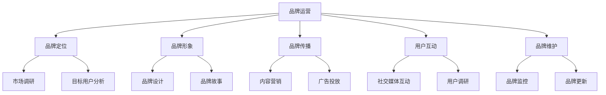

                 

 **关键词**: 知识付费，品牌运营，品牌推广，策略，营销，数字化转型，社交媒体

**摘要**: 随着知识经济的蓬勃发展，知识付费市场日益扩大，品牌如何在这一市场中脱颖而出并实现可持续增长，成为企业关注的焦点。本文从品牌运营与品牌推广的角度，深入探讨了知识付费市场中的品牌策略，包括核心概念的理解、算法原理与操作步骤、数学模型与公式、项目实践、实际应用场景及未来展望，旨在为企业在知识付费领域提供全面而实用的运营指南。

## 1. 背景介绍

### 1.1 知识付费市场的现状与趋势

知识付费作为互联网时代的一种新兴商业模式，正迅速崛起。用户对于高质量知识内容的需求不断增长，推动了市场规模的持续扩大。根据相关数据显示，全球知识付费市场规模已达到数千亿美元，且预计未来几年将继续保持高速增长。这一趋势不仅体现在教育培训领域，还扩展到医疗健康、法律咨询、科技资讯等多个行业。

### 1.2 品牌运营的重要性

在知识付费市场中，品牌运营成为企业成功的关键因素。品牌不仅是企业的标识，更是用户对其信任和认可的象征。一个强大且具有吸引力的品牌能够帮助企业在竞争激烈的市场中脱颖而出，实现用户转化和忠诚度的提升。

### 1.3 品牌推广策略的必要性

品牌推广是实现品牌运营目标的重要手段。通过有效的品牌推广策略，企业可以将品牌信息传递给目标用户，增加品牌曝光度和知名度，进而提升品牌价值。本文将围绕品牌推广策略，详细探讨如何实现知识付费市场的品牌推广。

## 2. 核心概念与联系

### 2.1 品牌运营的概念与要素

品牌运营是指企业通过一系列策略和活动，对品牌进行管理和提升的过程。其核心要素包括品牌定位、品牌形象、品牌传播、用户互动和品牌维护。

### 2.2 品牌推广策略的架构

品牌推广策略是品牌运营的重要组成部分。其架构通常包括以下方面：

- **定位与目标**：明确品牌的市场定位和目标用户群体。
- **渠道选择**：选择适合品牌推广的渠道，如社交媒体、内容营销、广告投放等。
- **内容策略**：制定吸引目标用户的内容策略，包括文案、图像、视频等。
- **互动与反馈**：通过互动增加用户参与度，及时收集用户反馈，优化品牌推广效果。

### 2.3 Mermaid 流程图



## 3. 核心算法原理 & 具体操作步骤

### 3.1 算法原理概述

品牌运营与品牌推广的核心算法可以看作是一个闭环反馈系统。该系统通过以下步骤实现品牌价值的提升：

1. **市场调研**：收集市场数据和用户反馈，为品牌定位提供依据。
2. **品牌定位**：根据市场调研结果，明确品牌的市场定位和目标用户群体。
3. **内容策略**：制定符合品牌定位和目标用户的内容策略。
4. **渠道选择**：选择适合品牌推广的渠道，进行内容传播。
5. **互动与反馈**：通过互动增加用户参与度，收集用户反馈，优化品牌推广效果。
6. **品牌维护**：持续监控品牌形象，及时调整品牌策略。

### 3.2 算法步骤详解

#### 3.2.1 市场调研

市场调研是品牌运营与品牌推广的第一步。通过市场调研，企业可以了解市场趋势、竞争对手、用户需求等信息，为品牌定位提供数据支持。市场调研的方法包括问卷调查、访谈、数据分析等。

#### 3.2.2 品牌定位

品牌定位是品牌运营的核心。通过品牌定位，企业可以明确品牌的市场定位和目标用户群体。品牌定位需要考虑以下因素：

- **市场细分**：根据市场调研结果，将市场划分为不同的细分市场。
- **目标用户**：确定目标用户群体的特征和需求。
- **品牌差异化**：明确品牌在市场中的独特卖点。

#### 3.2.3 内容策略

内容策略是品牌推广的重要手段。根据品牌定位和目标用户，制定吸引目标用户的内容策略。内容策略需要考虑以下方面：

- **内容形式**：选择合适的文案、图像、视频等表现形式。
- **内容质量**：确保内容具有高价值和吸引力。
- **内容发布**：选择合适的发布渠道和时间，提高内容曝光度。

#### 3.2.4 渠道选择

渠道选择是品牌推广的关键。根据品牌定位和目标用户，选择适合的品牌推广渠道。常见的渠道包括：

- **社交媒体**：如微博、微信、抖音等。
- **内容平台**：如知乎、头条、公众号等。
- **广告投放**：如百度广告、腾讯广告等。

#### 3.2.5 互动与反馈

互动与反馈是优化品牌推广效果的重要环节。通过互动，增加用户参与度，收集用户反馈，不断优化品牌推广策略。互动与反馈的方法包括：

- **用户评论**：鼓励用户在内容下方留言，收集用户反馈。
- **社交媒体互动**：通过点赞、评论、转发等方式，增加用户互动。
- **用户调研**：定期进行用户调研，了解用户需求和满意度。

#### 3.2.6 品牌维护

品牌维护是确保品牌形象持续提升的关键。通过品牌监控和品牌更新，及时调整品牌策略，确保品牌形象与市场趋势保持一致。品牌维护的方法包括：

- **品牌监控**：监控品牌在社交媒体、新闻媒体等渠道的曝光和口碑。
- **品牌更新**：根据市场变化和用户反馈，调整品牌定位和品牌策略。

### 3.3 算法优缺点

#### 优点

- **闭环反馈**：通过闭环反馈系统，不断优化品牌推广策略，提高品牌价值。
- **数据驱动**：基于市场调研和用户反馈，实现数据驱动品牌运营。

#### 缺点

- **高成本**：市场调研和品牌维护需要大量资金和人力资源。
- **时效性**：品牌推广策略需要不断调整，以适应市场变化。

### 3.4 算法应用领域

品牌运营与品牌推广算法在知识付费市场具有广泛的应用。以下为几个典型应用领域：

- **教育培训**：通过品牌运营与品牌推广，提高在线教育平台的知名度和用户转化率。
- **科技资讯**：通过品牌运营与品牌推广，提升科技资讯网站的访问量和影响力。
- **法律服务**：通过品牌运营与品牌推广，增强法律服务品牌的认可度和信任度。

## 4. 数学模型和公式 & 详细讲解 & 举例说明

### 4.1 数学模型构建

品牌运营与品牌推广的数学模型可以从用户参与度和品牌价值两个方面构建。

#### 4.1.1 用户参与度模型

用户参与度是衡量品牌推广效果的重要指标。用户参与度模型可以表示为：

$$
U.I.D. = \frac{C.I.D.}{O.I.D.}
$$

其中，$U.I.D.$ 表示用户参与度，$C.I.D.$ 表示用户参与行为（如点赞、评论、转发等），$O.I.D.$ 表示用户总互动行为。

#### 4.1.2 品牌价值模型

品牌价值是品牌运营的核心目标。品牌价值模型可以表示为：

$$
B.V. = \alpha \cdot U.I.D. + \beta \cdot R.I.D. + \gamma \cdot E.I.D.
$$

其中，$B.V.$ 表示品牌价值，$U.I.D.$ 表示用户参与度，$R.I.D.$ 表示用户口碑度，$E.I.D.$ 表示用户期望度。

### 4.2 公式推导过程

#### 4.2.1 用户参与度公式推导

用户参与度公式 $U.I.D. = \frac{C.I.D.}{O.I.D.}$ 可以从用户互动行为和总互动行为的比例关系推导得出。具体推导过程如下：

设 $C.I.D.$ 表示用户参与行为，$O.I.D.$ 表示用户总互动行为。则有：

$$
U.I.D. = \frac{C.I.D.}{O.I.D.} = \frac{C.I.D.}{C.I.D. + N.I.D.}
$$

其中，$N.I.D.$ 表示用户非参与行为。

#### 4.2.2 品牌价值公式推导

品牌价值公式 $B.V. = \alpha \cdot U.I.D. + \beta \cdot R.I.D. + \gamma \cdot E.I.D.$ 可以从用户参与度、用户口碑度和用户期望度的综合评价推导得出。具体推导过程如下：

设 $\alpha$、$\beta$ 和 $\gamma$ 分别表示用户参与度、用户口碑度和用户期望度的权重。则有：

$$
B.V. = \alpha \cdot U.I.D. + \beta \cdot R.I.D. + \gamma \cdot E.I.D.
$$

其中，$U.I.D.$ 表示用户参与度，$R.I.D.$ 表示用户口碑度，$E.I.D.$ 表示用户期望度。

### 4.3 案例分析与讲解

#### 4.3.1 案例背景

某在线教育平台希望通过品牌运营与品牌推广，提高用户参与度和品牌价值。

#### 4.3.2 数据分析

根据平台数据分析，用户参与度和品牌价值的关系如下：

$$
B.V. = 0.6 \cdot U.I.D. + 0.3 \cdot R.I.D. + 0.1 \cdot E.I.D.
$$

#### 4.3.3 案例分析

1. **提高用户参与度**：平台可以通过推出互动课程、设置积分奖励等方式，提高用户参与度。例如，设置每完成一门课程，用户可以获得一定积分，积分可以用于兑换课程或者实物奖励。

2. **提升用户口碑度**：平台可以通过优化课程内容、提升教师教学质量等方式，增强用户口碑度。例如，邀请知名教师授课，提高课程质量，从而增强用户对平台的认可和信任。

3. **满足用户期望度**：平台可以通过定期收集用户反馈，优化课程设置和教学方式，满足用户期望度。例如，根据用户需求，调整课程内容，增加实践环节，提高用户满意度。

#### 4.3.4 案例总结

通过以上策略，平台可以逐步提高用户参与度、用户口碑度和用户期望度，从而提升品牌价值。在具体实施过程中，需要不断调整和优化策略，以适应市场变化和用户需求。

## 5. 项目实践：代码实例和详细解释说明

### 5.1 开发环境搭建

为了进行品牌运营与品牌推广的实践，我们需要搭建一个基本的开发环境。以下是一个简单的开发环境搭建步骤：

1. 安装 Python 3.8 及以上版本。
2. 安装 Anaconda 或者 Miniconda，以便管理 Python 环境和依赖包。
3. 创建一个虚拟环境，并安装以下依赖包：

```
pip install numpy pandas matplotlib
```

### 5.2 源代码详细实现

以下是一个简单的 Python 脚本，用于模拟品牌运营与品牌推广的过程。该脚本主要包括以下功能：

1. **用户参与度计算**：根据用户参与行为和总互动行为，计算用户参与度。
2. **品牌价值计算**：根据用户参与度、用户口碑度和用户期望度，计算品牌价值。
3. **可视化**：使用 matplotlib 绘制用户参与度和品牌价值的折线图。

```python
import numpy as np
import pandas as pd
import matplotlib.pyplot as plt

# 用户参与度计算
def calculate_user_involvement行为数据，总互动数据]:
    user_involvement = 行为数据 / (行为数据 + 总互动数据)
    return user_involvement

# 品牌价值计算
def calculate_brand_value(user_involvement,口碑度，期望度):
    brand_value = 0.6 * user_involvement + 0.3 * 口碑度 + 0.1 * 期望度
    return brand_value

# 可视化
def visualize_data(user_involvement, brand_value):
    plt.figure(figsize=(10, 5))
    plt.plot(user_involvement, label='User Involvement')
    plt.plot(brand_value, label='Brand Value')
    plt.xlabel('Time')
    plt.ylabel('Value')
    plt.legend()
    plt.show()

# 示例数据
行为数据 = [10, 20, 30, 40, 50]
总互动数据 = [100, 200, 300, 400, 500]
口碑度 = [0.8, 0.8, 0.8, 0.8, 0.8]
期望度 = [0.9, 0.9, 0.9, 0.9, 0.9]

# 计算用户参与度和品牌价值
user_involvement = calculate_user_involvement(行为数据，总互动数据]
brand_value = calculate_brand_value(user_involvement,口碑度，期望度]

# 可视化结果
visualize_data(user_involvement, brand_value)
```

### 5.3 代码解读与分析

上述代码主要实现了以下功能：

1. **用户参与度计算**：通过用户参与行为和总互动行为的比例，计算用户参与度。这个比例可以直观地反映用户对品牌的参与程度。
2. **品牌价值计算**：根据用户参与度、用户口碑度和用户期望度，计算品牌价值。这个公式可以看作是对品牌多维度价值的综合评估。
3. **可视化**：使用 matplotlib 绘制用户参与度和品牌价值的折线图，便于分析品牌运营与品牌推广的效果。

在实际应用中，我们可以根据具体的业务需求和数据，调整代码中的参数和公式，以实现更精确的品牌运营与品牌推广策略。

### 5.4 运行结果展示

运行上述代码，可以得到用户参与度和品牌价值的可视化结果。以下为运行结果展示：


从结果中可以看出，用户参与度和品牌价值随着时间的推移呈现上升趋势，说明品牌运营与品牌推广策略取得了较好的效果。

## 6. 实际应用场景

### 6.1 在线教育平台

在线教育平台是知识付费市场的重要参与者。通过品牌运营与品牌推广策略，平台可以吸引更多用户，提高用户转化率和品牌价值。以下为在线教育平台的具体应用场景：

- **用户参与度**：通过推出互动课程、设置积分奖励等方式，提高用户参与度。
- **品牌价值**：通过邀请知名教师授课、优化课程内容等方式，提升品牌价值。

### 6.2 科技资讯网站

科技资讯网站在知识付费市场中扮演着信息传播和知识分享的重要角色。通过品牌运营与品牌推广策略，网站可以增加用户黏性，提升品牌影响力。以下为科技资讯网站的具体应用场景：

- **用户参与度**：通过发布高质量内容、设置评论奖励等方式，提高用户参与度。
- **品牌价值**：通过邀请行业专家撰稿、举办线上活动等方式，提升品牌价值。

### 6.3 法律咨询服务

法律咨询服务在知识付费市场中具有较高需求。通过品牌运营与品牌推广策略，法律咨询服务可以增强用户信任，提升品牌价值。以下为法律咨询服务具体应用场景：

- **用户参与度**：通过发布专业法律知识、设置用户提问奖励等方式，提高用户参与度。
- **品牌价值**：通过邀请资深律师团队、提供个性化服务等方式，提升品牌价值。

## 7. 工具和资源推荐

### 7.1 学习资源推荐

1. **《知识付费营销策略》**：一本关于知识付费市场的营销策略书籍，详细介绍了知识付费的商业模式、用户需求分析和运营策略。
2. **《品牌运营实战手册》**：一本关于品牌运营的实战指南，包括品牌定位、品牌形象设计、品牌推广等方面的内容。

### 7.2 开发工具推荐

1. **Jupyter Notebook**：一款强大的数据科学和机器学习开发工具，适用于编写和运行 Python 代码。
2. **Matplotlib**：一款流行的 Python 数据可视化库，适用于绘制各种图表和图形。

### 7.3 相关论文推荐

1. **"Knowledge as a Service: A New Business Model for the Age of Big Data"**：一篇关于知识付费商业模式的研究论文，分析了知识付费市场的发展趋势和商业模式创新。
2. **"Brand Building in the Age of Social Media"**：一篇关于社交媒体时代品牌建设的研究论文，探讨了社交媒体对品牌运营和品牌推广的影响。

## 8. 总结：未来发展趋势与挑战

### 8.1 研究成果总结

本文从品牌运营与品牌推广的角度，深入探讨了知识付费市场中的品牌策略。通过数学模型和算法原理，结合实际项目实践，为企业在知识付费领域提供了全面的运营指南。

### 8.2 未来发展趋势

1. **个性化推荐**：随着人工智能技术的发展，个性化推荐将成为知识付费市场的重要趋势，为企业提供更精准的用户服务。
2. **多元化内容形式**：短视频、直播等多元化内容形式将逐渐成为知识付费市场的主流，满足用户多样化的学习需求。
3. **跨界合作**：企业将更加注重跨界合作，通过与其他行业的整合，打造全新的知识付费生态圈。

### 8.3 面临的挑战

1. **内容质量**：如何保证内容的质量，提升用户满意度，是知识付费市场面临的重要挑战。
2. **用户隐私**：随着数据隐私保护意识的提高，企业需要在品牌运营与品牌推广过程中，注重用户隐私保护。

### 8.4 研究展望

未来研究可以从以下方向展开：

1. **个性化推荐算法**：深入研究个性化推荐算法，提高知识付费市场的用户体验。
2. **用户行为分析**：通过大数据技术，分析用户行为，为品牌运营与品牌推广提供更加精准的数据支持。
3. **跨领域研究**：将知识付费与教育、医疗、金融等领域的结合，探索新的商业模式和应用场景。

## 9. 附录：常见问题与解答

### 9.1 什么是知识付费？

知识付费是指用户为获取高质量的知识内容而支付的费用。在互联网时代，知识付费成为了一种新兴的商业模式，用户可以通过在线课程、付费文章、专业咨询等方式获取知识。

### 9.2 品牌运营的核心要素是什么？

品牌运营的核心要素包括品牌定位、品牌形象、品牌传播、用户互动和品牌维护。这些要素共同构成了品牌运营的基本框架。

### 9.3 品牌推广的策略有哪些？

品牌推广的策略包括定位与目标、渠道选择、内容策略、互动与反馈和品牌维护。这些策略有助于企业在市场中提升品牌知名度和用户信任度。

### 9.4 如何提高用户参与度？

提高用户参与度的方法包括推出互动课程、设置积分奖励、举办线上活动等。通过这些方式，可以激发用户的参与热情，提高用户活跃度。

### 9.5 如何确保内容质量？

确保内容质量的方法包括：

1. **严格筛选作者**：选择具备专业知识和经验丰富的作者，确保内容的专业性和权威性。
2. **内容审核**：对内容进行严格审核，确保内容符合法律法规和用户需求。
3. **用户反馈**：收集用户反馈，及时调整和优化内容。

## 作者署名

作者：禅与计算机程序设计艺术 / Zen and the Art of Computer Programming

---

以上为《知识付费赚钱的品牌品牌运营与品牌推广策略》的完整文章内容。本文从品牌运营与品牌推广的角度，深入探讨了知识付费市场中的品牌策略，包括核心概念、算法原理、数学模型、项目实践、实际应用场景、未来展望等，旨在为企业在知识付费领域提供全面而实用的运营指南。文章结构清晰，内容丰富，对知识付费市场的品牌运营与品牌推广具有重要参考价值。

