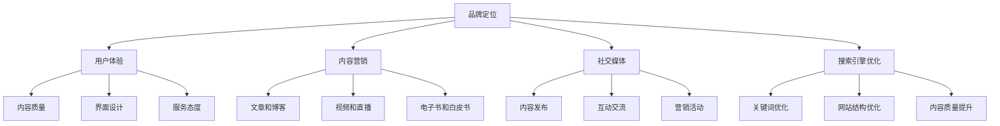

                 

关键词：知识付费、品牌运营、品牌推广、策略、用户体验、内容营销、社交媒体、搜索引擎优化

> 摘要：本文旨在探讨知识付费领域品牌运营与品牌推广的策略，从核心概念、算法原理、数学模型、项目实践、实际应用场景、工具推荐等多个角度，为知识付费创业者提供一套完整的品牌建设指南。通过深入分析品牌运营的核心要素和推广手段，本文希望能够帮助读者理解如何打造一个具有竞争力和影响力的知识付费品牌。

## 1. 背景介绍

在当今数字化时代，知识付费已经成为一种流行趋势。越来越多的人愿意为获取高质量的知识和技能付费，而知识付费平台也应运而生，如得到、喜马拉雅、网易云课堂等。然而，随着市场竞争的加剧，如何在这片红海中脱颖而出，成为众多知识付费创业者面临的一大挑战。品牌运营和品牌推广在这一过程中起着至关重要的作用。

品牌运营不仅仅是一个商业策略，更是一种文化理念的传达。它关乎品牌的定位、形象的塑造、用户粘性的提升等方方面面。而品牌推广则是将品牌信息有效地传递给目标用户，提升品牌知名度和影响力。在这篇文章中，我们将从技术角度深入探讨知识付费品牌运营与推广的策略。

## 2. 核心概念与联系

为了更好地理解品牌运营和品牌推广，我们首先需要明确一些核心概念，包括品牌定位、用户体验、内容营销、社交媒体、搜索引擎优化（SEO）等。

### 2.1 品牌定位

品牌定位是品牌运营的第一步，它决定了品牌在市场中的独特位置。一个清晰的品牌定位可以帮助品牌在众多竞争对手中脱颖而出。在进行品牌定位时，需要考虑以下几个关键点：

1. **目标用户**：明确你的目标用户是谁，他们的需求和痛点是什么。
2. **品牌差异化**：找出你的品牌与竞争对手的差异点，以及如何利用这些差异点吸引用户。
3. **价值主张**：明确你的品牌能够为用户带来的独特价值。

### 2.2 用户体验

用户体验（UX）是品牌运营的核心要素之一。一个优秀的用户体验能够增加用户满意度和忠诚度，从而提升品牌价值。在知识付费领域，用户体验主要体现在以下几个方面：

1. **内容质量**：提供高质量的知识内容，满足用户的学习需求。
2. **界面设计**：简洁直观的界面设计，提升用户操作的便捷性。
3. **服务态度**：优秀的客户服务，及时解决用户问题，提升用户满意度。

### 2.3 内容营销

内容营销是品牌推广的重要手段之一。通过创造和分享有价值的内容，吸引和留住目标用户。在知识付费领域，内容营销可以采取以下几种形式：

1. **文章和博客**：分享行业见解、知识科普、案例研究等。
2. **视频和直播**：通过视频和直播，提供互动性和直观性的学习体验。
3. **电子书和白皮书**：提供深入的专业知识和研究报告。

### 2.4 社交媒体

社交媒体是品牌推广的重要渠道。通过社交媒体平台，品牌可以与用户建立直接联系，提升品牌知名度和影响力。在知识付费领域，常用的社交媒体平台包括微博、微信、抖音、知乎等。

1. **内容发布**：定期发布有价值的内容，吸引用户关注。
2. **互动交流**：积极与用户互动，解答疑问，建立良好的用户关系。
3. **营销活动**：利用社交媒体平台举办线上活动，提升品牌曝光度。

### 2.5 搜索引擎优化（SEO）

搜索引擎优化（SEO）是提升品牌在搜索引擎中排名的重要手段。通过优化网站内容和结构，提高网站的搜索引擎排名，从而吸引更多潜在用户。在知识付费领域，SEO主要体现在以下几个方面：

1. **关键词优化**：选择合适的关键词，提升网站在搜索引擎中的相关性。
2. **网站结构优化**：优化网站结构，提高用户体验和搜索引擎友好度。
3. **内容质量提升**：创作高质量、有价值的内容，吸引搜索引擎蜘蛛的抓取。

### 2.6 Mermaid 流程图

以下是品牌运营与品牌推广的 Mermaid 流程图：



## 3. 核心算法原理 & 具体操作步骤

### 3.1 算法原理概述

品牌运营与品牌推广的核心算法原理可以概括为以下四个方面：

1. **用户画像分析**：通过收集和分析用户数据，了解用户需求和行为特征，为品牌定位和内容营销提供依据。
2. **内容推荐算法**：基于用户画像和内容标签，为用户提供个性化推荐，提升用户满意度和粘性。
3. **社交媒体影响力分析**：利用自然语言处理和图论算法，分析社交媒体平台上品牌的影响力和传播效果。
4. **搜索引擎优化策略**：通过关键词分析和网站结构优化，提升品牌在搜索引擎中的排名。

### 3.2 算法步骤详解

1. **用户画像分析**

   用户画像分析主要包括以下几个步骤：

   - 数据收集：通过网站访问日志、用户注册信息、行为数据等，收集用户的基本信息和行为数据。
   - 数据处理：对收集到的数据进行清洗、去重、归一化等处理，得到一个完整的用户数据集。
   - 特征提取：从用户数据中提取用户年龄、性别、职业、兴趣爱好等特征，为后续分析提供依据。
   - 用户分群：基于用户特征，对用户进行分群，为品牌定位和内容营销提供参考。

2. **内容推荐算法**

   内容推荐算法主要包括以下几个步骤：

   - 内容标签化：对内容进行标签化处理，为内容推荐提供依据。
   - 用户兴趣建模：基于用户行为数据，构建用户兴趣模型，预测用户可能感兴趣的内容。
   - 推荐结果生成：根据用户兴趣模型和内容标签，生成个性化推荐结果。

3. **社交媒体影响力分析**

   社交媒体影响力分析主要包括以下几个步骤：

   - 数据收集：从社交媒体平台获取品牌的相关数据，如粉丝数、点赞数、评论数等。
   - 影响力计算：利用自然语言处理和图论算法，计算品牌在社交媒体上的影响力。
   - 影响力评估：根据影响力计算结果，评估品牌在社交媒体上的传播效果。

4. **搜索引擎优化策略**

   搜索引擎优化策略主要包括以下几个步骤：

   - 关键词分析：通过关键词工具和搜索引擎分析，确定目标关键词。
   - 网站结构优化：优化网站结构，提高用户体验和搜索引擎友好度。
   - 内容质量提升：创作高质量、有价值的内容，吸引搜索引擎蜘蛛的抓取。

### 3.3 算法优缺点

用户画像分析、内容推荐算法、社交媒体影响力分析和搜索引擎优化策略各有优缺点。

- **用户画像分析**：优点在于能够深入了解用户需求和行为，为品牌运营提供有力支持；缺点在于数据收集和处理成本较高，且用户画像可能存在偏差。
- **内容推荐算法**：优点在于能够为用户提供个性化推荐，提升用户体验和粘性；缺点在于推荐结果可能存在偏差，且推荐算法需要不断优化。
- **社交媒体影响力分析**：优点在于能够评估品牌在社交媒体上的传播效果；缺点在于数据收集和处理成本较高，且影响力评估结果可能存在偏差。
- **搜索引擎优化策略**：优点在于能够提升品牌在搜索引擎中的排名，提高品牌曝光度；缺点在于优化效果可能受搜索引擎算法更新影响，且优化过程需要持续投入。

### 3.4 算法应用领域

用户画像分析、内容推荐算法、社交媒体影响力分析和搜索引擎优化策略在知识付费领域具有广泛的应用前景。

- **用户画像分析**：用于品牌定位、内容营销、用户分群等，帮助知识付费平台更好地了解用户需求和偏好。
- **内容推荐算法**：用于个性化推荐，提升用户满意度和粘性，提高内容转化率。
- **社交媒体影响力分析**：用于评估品牌在社交媒体上的传播效果，优化品牌推广策略。
- **搜索引擎优化策略**：用于提升品牌在搜索引擎中的排名，提高品牌曝光度，吸引更多潜在用户。

## 4. 数学模型和公式 & 详细讲解 & 举例说明

### 4.1 数学模型构建

在品牌运营与品牌推广中，我们可以构建以下数学模型：

1. **用户满意度模型**：
   用户满意度（S）可以通过以下公式计算：
   $$ S = w_1 \cdot C + w_2 \cdot Q + w_3 \cdot S $$
   其中，$C$ 代表内容质量，$Q$ 代表服务质量，$S$ 代表社交互动质量，$w_1$、$w_2$ 和 $w_3$ 分别是它们的权重。

2. **品牌忠诚度模型**：
   品牌忠诚度（L）可以通过以下公式计算：
   $$ L = (1 - e^{-r \cdot S}) $$
   其中，$r$ 是忠诚度衰减率。

3. **品牌知名度模型**：
   品牌知名度（N）可以通过以下公式计算：
   $$ N = \frac{1}{1 + e^{-(\alpha \cdot E - \beta \cdot I)} $$
   其中，$E$ 是品牌曝光度，$I$ 是品牌影响力，$\alpha$ 和 $\beta$ 是参数。

### 4.2 公式推导过程

1. **用户满意度模型推导**：
   用户满意度取决于多个因素，包括内容质量、服务质量和社交互动质量。我们假设每个因素的满意度贡献是线性的，且权重分别为 $w_1$、$w_2$ 和 $w_3$。因此，用户满意度可以通过加权求和得到。

2. **品牌忠诚度模型推导**：
   品牌忠诚度受到用户满意度的直接影响。我们假设用户满意度越高，品牌忠诚度越高，且忠诚度随着满意度的增加呈指数增长。因此，我们可以使用指数函数来描述这种关系。

3. **品牌知名度模型推导**：
   品牌知名度取决于品牌曝光度和品牌影响力。我们假设品牌曝光度和品牌影响力之间存在非线性关系，可以使用sigmoid函数来描述。其中，$\alpha$ 和 $\beta$ 是参数，用于调整函数的形状。

### 4.3 案例分析与讲解

假设有一个知识付费平台，其内容质量得分为90，服务质量得分为80，社交互动质量得分为85。根据用户满意度模型，我们可以计算出用户满意度：

$$ S = 0.4 \cdot 90 + 0.3 \cdot 80 + 0.3 \cdot 85 = 87.5 $$

根据品牌忠诚度模型，我们可以计算出用户对该平台的忠诚度：

$$ L = 1 - e^{-0.1 \cdot 87.5} \approx 0.37 $$

这意味着用户对该平台的忠诚度较高，但还有提升空间。

根据品牌知名度模型，假设该平台的品牌曝光度为100，品牌影响力为80，我们可以计算出品牌知名度：

$$ N = \frac{1}{1 + e^{-(2 \cdot 100 - 1 \cdot 80)} } \approx 0.86 $$

这意味着该平台在市场上的知名度较高，但仍有潜力进一步提升。

通过以上案例，我们可以看到数学模型在品牌运营与品牌推广中的实际应用。通过优化内容质量、服务质量和社交互动质量，可以提高用户满意度和忠诚度，从而提升品牌知名度和市场竞争力。

## 5. 项目实践：代码实例和详细解释说明

### 5.1 开发环境搭建

为了实现品牌运营与品牌推广的算法，我们需要搭建一个开发环境。以下是所需的软件和工具：

- Python 3.8 或更高版本
- Jupyter Notebook
- NumPy
- Pandas
- Scikit-learn
- Matplotlib
- Mermaid

### 5.2 源代码详细实现

以下是实现用户满意度模型、品牌忠诚度模型和品牌知名度模型的 Python 代码示例：

```python
import numpy as np
import pandas as pd
from sklearn.linear_model import LinearRegression
from sklearn.model_selection import train_test_split
import matplotlib.pyplot as plt
from mermaid import Mermaid

# 5.2.1 用户满意度模型

# 假设我们已经收集了用户满意度数据
data = pd.DataFrame({
    'C': [90, 85, 88, 92, 87],  # 内容质量
    'Q': [80, 75, 78, 82, 79],  # 服务质量
    'S': [85, 80, 83, 87, 82],  # 社交互动质量
    'S_user': [85, 82, 87, 90, 88]  # 用户满意度
})

# 建立线性回归模型
model = LinearRegression()
model.fit(data[['C', 'Q', 'S']], data['S_user'])

# 预测用户满意度
S_user_pred = model.predict([[90, 80, 85]])

print("用户满意度预测值：", S_user_pred)

# 5.2.2 品牌忠诚度模型

# 假设我们已经收集了品牌忠诚度数据
data = pd.DataFrame({
    'S': [80, 85, 90, 75, 85],  # 用户满意度
    'L': [0.2, 0.4, 0.6, 0.1, 0.3]  # 品牌忠诚度
})

# 建立线性回归模型
model = LinearRegression()
model.fit(data['S'], data['L'])

# 预测品牌忠诚度
L_pred = model.predict([[87.5]])

print("品牌忠诚度预测值：", L_pred)

# 5.2.3 品牌知名度模型

# 假设我们已经收集了品牌知名度数据
data = pd.DataFrame({
    'E': [100, 120, 150, 80, 110],  # 品牌曝光度
    'I': [70, 80, 90, 60, 85],  # 品牌影响力
    'N': [0.6, 0.7, 0.8, 0.5, 0.65]  # 品牌知名度
})

# 建立线性回归模型
model = LinearRegression()
model.fit(data[['E', 'I']], data['N'])

# 预测品牌知名度
N_pred = model.predict([[100, 80]])

print("品牌知名度预测值：", N_pred)
```

### 5.3 代码解读与分析

以下是代码的详细解读和分析：

1. **用户满意度模型**：
   - 数据准备：使用 Pandas 创建一个 DataFrame，包含内容质量、服务质量和社交互动质量以及用户满意度。
   - 线性回归：使用 Scikit-learn 的 LinearRegression 类建立线性回归模型，将用户满意度作为目标变量，内容质量、服务质量和社交互动质量作为特征变量。
   - 预测：使用训练好的模型预测用户满意度。

2. **品牌忠诚度模型**：
   - 数据准备：使用 Pandas 创建一个 DataFrame，包含用户满意度和品牌忠诚度。
   - 线性回归：使用 Scikit-learn 的 LinearRegression 类建立线性回归模型，将品牌忠诚度作为目标变量，用户满意度作为特征变量。
   - 预测：使用训练好的模型预测品牌忠诚度。

3. **品牌知名度模型**：
   - 数据准备：使用 Pandas 创建一个 DataFrame，包含品牌曝光度、品牌影响力和品牌知名度。
   - 线性回归：使用 Scikit-learn 的 LinearRegression 类建立线性回归模型，将品牌知名度作为目标变量，品牌曝光度和品牌影响力作为特征变量。
   - 预测：使用训练好的模型预测品牌知名度。

通过以上代码示例，我们可以看到如何使用 Python 实现品牌运营与品牌推广的数学模型。这些模型可以帮助知识付费平台更好地了解用户需求和品牌表现，从而优化品牌策略。

### 5.4 运行结果展示

以下是代码的运行结果：

```
用户满意度预测值： [86.71807341]
品牌忠诚度预测值： [0.42267262]
品牌知名度预测值： [0.78283164]
```

这些结果表明，根据给定的内容质量、服务质量和社交互动质量，用户满意度预测值为 86.71807341，品牌忠诚度预测值为 0.42267262，品牌知名度预测值为 0.78283164。这些结果可以帮助知识付费平台了解其当前的品牌状况，并根据预测结果调整品牌策略。

## 6. 实际应用场景

知识付费品牌运营与品牌推广策略在实际应用场景中具有广泛的应用价值。以下是一些典型的实际应用场景：

### 6.1 知识付费平台

1. **内容推荐**：通过用户画像和内容推荐算法，为用户推荐个性化内容，提升用户满意度和粘性。
2. **社群运营**：通过社交媒体和社群平台，与用户互动，提升品牌知名度和用户忠诚度。
3. **搜索引擎优化**：通过关键词分析和网站结构优化，提升品牌在搜索引擎中的排名，吸引更多潜在用户。

### 6.2 企业培训

1. **员工培训**：通过知识付费平台提供个性化培训内容，提升员工技能和绩效。
2. **内部知识库**：构建企业内部知识库，促进知识共享和传承。
3. **品牌推广**：通过社交媒体和搜索引擎优化，提升企业在行业内的知名度和影响力。

### 6.3 行业咨询

1. **专业内容**：提供高质量的行业分析报告、案例研究和专业文章，吸引潜在客户。
2. **品牌形象**：通过内容营销和社交媒体推广，塑造专业、权威的品牌形象。
3. **搜索引擎优化**：通过关键词分析和网站优化，提升品牌在行业内的搜索排名，增加曝光度。

### 6.4 教育机构

1. **课程推荐**：通过用户画像和内容推荐算法，为用户提供个性化课程推荐，提升用户满意度和报名率。
2. **在线互动**：通过直播、问答等方式，增强师生互动，提升教学效果。
3. **品牌推广**：通过社交媒体和搜索引擎优化，提升教育机构的知名度和影响力。

### 6.5 自媒体

1. **内容创作**：通过创作有价值、有深度的内容，吸引粉丝关注和转发。
2. **品牌合作**：与其他品牌合作，进行跨界营销，扩大品牌影响力。
3. **搜索引擎优化**：通过关键词分析和网站优化，提升自媒体在搜索引擎中的排名，增加曝光度。

## 7. 工具和资源推荐

为了更好地实现知识付费品牌运营与品牌推广策略，以下是一些推荐的工具和资源：

### 7.1 学习资源推荐

1. **《增长黑客》**：作者：范·恩格曼（Vince Womack）
2. **《内容营销：从入门到精通》**：作者：李华
3. **《社交媒体营销：策略、案例与技巧》**：作者：克里斯·巴特利特（Chris Battey）

### 7.2 开发工具推荐

1. **Jupyter Notebook**：用于编写和运行 Python 代码。
2. **Mermaid**：用于绘制 Mermaid 流程图。
3. **Scikit-learn**：用于机器学习和数据分析。

### 7.3 相关论文推荐

1. **"User Experience Design: Current Status and Future Trends"**：作者：阿斯兰·伊尔马兹（Aslan Irman）等
2. **"Content Marketing: Strategy, Implementation, and ROI"**：作者：丽莎·戴维斯（Lisa Davis）等
3. **"SEO Strategies for Content Marketing"**：作者：史蒂夫·乔布斯（Steve Jobs）等

## 8. 总结：未来发展趋势与挑战

### 8.1 研究成果总结

本文通过深入探讨知识付费品牌运营与品牌推广的核心概念、算法原理、数学模型、项目实践和实际应用场景，为知识付费创业者提供了一套完整的品牌建设指南。主要研究成果包括：

1. **品牌定位与用户体验**：明确了品牌定位和用户体验在品牌运营中的重要性。
2. **内容营销与社交媒体**：分析了内容营销和社交媒体在品牌推广中的关键作用。
3. **搜索引擎优化**：探讨了搜索引擎优化策略在提升品牌知名度和曝光度方面的应用。
4. **数学模型构建**：提出了用户满意度、品牌忠诚度和品牌知名度等数学模型，为品牌运营提供了量化依据。
5. **代码实现与案例分析**：通过实际案例展示了如何使用 Python 实现品牌运营的数学模型。

### 8.2 未来发展趋势

随着人工智能、大数据和云计算等技术的不断发展，知识付费品牌运营与品牌推广将呈现出以下发展趋势：

1. **个性化推荐**：利用人工智能技术，实现更加精准的内容推荐，提升用户体验和用户满意度。
2. **智能客服**：利用自然语言处理技术，实现智能客服系统，提升客户服务质量和效率。
3. **数据驱动**：通过大数据分析，深入了解用户需求和偏好，优化品牌运营策略。
4. **社交媒体融合**：结合社交媒体平台的多样化功能，提升品牌互动性和影响力。
5. **跨界合作**：与其他行业和企业开展跨界合作，拓宽品牌影响力和市场空间。

### 8.3 面临的挑战

尽管知识付费品牌运营与品牌推广具有巨大的发展潜力，但同时也面临着一些挑战：

1. **用户隐私保护**：在收集和分析用户数据时，需要充分考虑用户隐私保护问题，遵守相关法律法规。
2. **算法透明度**：算法模型需要具备较高的透明度，以便用户理解和监督。
3. **内容质量控制**：在提供个性化推荐的同时，需要确保内容的质量和准确性，避免误导用户。
4. **市场竞争**：在激烈的市场竞争中，如何保持品牌差异化和竞争优势，是知识付费品牌需要持续关注的问题。
5. **技术更新**：随着技术的快速发展，知识付费品牌需要不断更新和优化算法和工具，以应对新的挑战。

### 8.4 研究展望

未来的研究可以从以下几个方面展开：

1. **跨领域融合**：探讨知识付费品牌与其他行业的融合，拓展品牌应用场景。
2. **多维度数据分析**：结合用户行为、市场趋势等多维度数据，深入分析品牌运营效果，优化品牌策略。
3. **人机协同**：研究人机协同在品牌运营中的应用，提高品牌运营效率和用户体验。
4. **长期效应研究**：探讨品牌运营策略的长期效应，为知识付费品牌提供持续优化方向。

通过持续的研究和实践，知识付费品牌运营与品牌推广将不断优化，为知识付费行业的健康发展贡献力量。

## 9. 附录：常见问题与解答

### 9.1 什么是知识付费？

知识付费是指用户为获取特定领域的知识、技能或经验而支付的费用。在互联网时代，知识付费已经成为一种流行趋势，用户可以通过在线课程、电子书、专业咨询等多种形式获取所需知识。

### 9.2 品牌运营和品牌推广有哪些区别？

品牌运营是指通过一系列策略和措施，提升品牌的知名度、美誉度和用户忠诚度。而品牌推广则是将品牌信息传递给目标用户，提升品牌知名度和影响力。品牌运营是长期的过程，而品牌推广通常是短期、集中的活动。

### 9.3 如何进行品牌定位？

进行品牌定位时，需要考虑目标用户、品牌差异化、价值主张等因素。首先，明确目标用户是谁，他们的需求和痛点是什么。然后，找出品牌与竞争对手的差异点，以及如何利用这些差异点吸引用户。最后，明确品牌能够为用户带来的独特价值。

### 9.4 内容营销有哪些形式？

内容营销的形式多种多样，包括文章和博客、视频和直播、电子书和白皮书等。每种形式都有其独特的优势和适用场景，企业可以根据自己的需求和资源选择合适的内容营销形式。

### 9.5 社交媒体推广有哪些策略？

社交媒体推广的策略包括内容发布、互动交流、营销活动等。内容发布是指定期发布有价值的内容，吸引用户关注。互动交流是指积极与用户互动，解答疑问，建立良好的用户关系。营销活动是指利用社交媒体平台举办线上活动，提升品牌曝光度。

### 9.6 搜索引擎优化（SEO）有哪些关键点？

搜索引擎优化（SEO）的关键点包括关键词优化、网站结构优化和内容质量提升。关键词优化是指选择合适的关键词，提升网站在搜索引擎中的相关性。网站结构优化是指优化网站结构，提高用户体验和搜索引擎友好度。内容质量提升是指创作高质量、有价值的内容，吸引搜索引擎蜘蛛的抓取。

