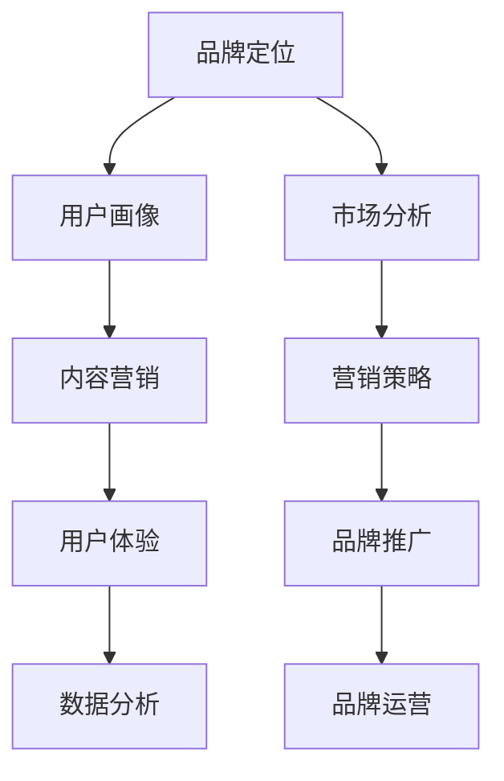

                 

关键词：知识付费、品牌运营、品牌推广、策略、AI营销、用户体验

> 摘要：本文将深入探讨知识付费领域的品牌运营与品牌推广策略。通过对市场现状的分析，结合人工智能技术，我们旨在为知识付费平台提供一套科学、有效的运营和推广方案，助力品牌在竞争激烈的市场中脱颖而出。

## 1. 背景介绍

知识付费作为一种新兴的商业模式，近年来在全球范围内迅速崛起。用户对于专业知识的渴求，加之移动互联网的普及，为知识付费市场带来了巨大的发展空间。然而，随着市场的不断扩大，竞争也日益激烈。在这个背景下，品牌运营和品牌推广变得尤为重要，它不仅关系到知识付费平台的生存与发展，更影响到用户的满意度和忠诚度。

### 1.1 市场现状

当前，知识付费市场呈现出几个显著特点：

1. **内容多样**：从教育、职业培训到兴趣爱好，知识付费的内容涵盖了各个领域。
2. **用户年轻化**：80后、90后成为知识付费的主力军，他们的消费习惯和价值观与以往不同。
3. **平台竞争**：众多平台争相涌入知识付费领域，使得市场竞争愈发激烈。

### 1.2 品牌运营的重要性

品牌运营是知识付费平台发展的关键。良好的品牌运营能够提升平台的知名度、美誉度和用户忠诚度，从而在激烈的市场竞争中脱颖而出。

1. **提升知名度**：通过有效的品牌推广策略，将品牌信息传递给更多潜在用户，提升品牌知名度。
2. **建立信任**：品牌运营能够塑造品牌形象，建立用户对品牌的信任感，从而促进用户转化。
3. **增加用户忠诚度**：通过优质的服务和持续的用户互动，增强用户对品牌的忠诚度。

## 2. 核心概念与联系

为了更好地进行品牌运营和品牌推广，我们需要理解以下几个核心概念：

### 2.1 品牌定位

品牌定位是指确定品牌在市场中的独特价值和地位，包括品牌的核心价值、目标用户群体、市场定位等。

### 2.2 用户画像

用户画像是指通过对用户数据的分析，构建出用户的特征模型，用于精准营销和个性化服务。

### 2.3 内容营销

内容营销是指通过创造和分发有价值的内容，吸引并留住目标用户，从而实现品牌推广和用户转化。

### 2.4 用户体验

用户体验是指用户在使用品牌产品或服务过程中的感受和体验，包括交互设计、功能易用性、内容质量等。

### 2.5 数据分析

数据分析是指通过对用户行为数据的分析，挖掘用户需求、优化产品功能和营销策略。

下面是核心概念原理和架构的 Mermaid 流程图：



## 3. 核心算法原理 & 具体操作步骤

### 3.1 算法原理概述

品牌运营和品牌推广的核心算法主要包括以下几部分：

1. **用户画像算法**：通过对用户行为、兴趣、购买历史等数据进行综合分析，构建出详细的用户画像。
2. **内容推荐算法**：基于用户画像，利用协同过滤、深度学习等技术，为用户推荐个性化内容。
3. **营销策略优化算法**：通过数据分析和机器学习，优化广告投放、促销活动等营销策略。
4. **用户体验分析算法**：通过用户反馈和行为数据，评估用户体验，并据此优化产品和服务。

### 3.2 算法步骤详解

#### 3.2.1 用户画像算法

1. 数据采集：收集用户的基本信息、行为数据、兴趣标签等。
2. 数据清洗：处理缺失值、异常值等，确保数据质量。
3. 特征提取：对原始数据进行处理，提取出有用的特征。
4. 模型构建：使用机器学习算法，如K-均值聚类、随机森林等，构建用户画像模型。
5. 模型评估：通过交叉验证等方法，评估模型性能。

#### 3.2.2 内容推荐算法

1. 数据预处理：对用户行为数据、内容数据进行处理，提取特征。
2. 模型选择：选择合适的推荐算法，如协同过滤、深度学习等。
3. 模型训练：使用训练数据，训练推荐模型。
4. 模型评估：通过验证集，评估模型性能。
5. 推荐生成：根据用户画像，生成个性化推荐列表。

#### 3.2.3 营销策略优化算法

1. 数据采集：收集用户行为数据、广告投放数据等。
2. 模型构建：使用机器学习算法，如决策树、随机森林等，构建营销策略优化模型。
3. 模型训练：使用训练数据，训练优化模型。
4. 模型评估：通过交叉验证等方法，评估模型性能。
5. 策略调整：根据模型评估结果，调整营销策略。

#### 3.2.4 用户体验分析算法

1. 数据采集：收集用户反馈数据、行为数据等。
2. 数据预处理：处理缺失值、异常值等，确保数据质量。
3. 特征提取：对原始数据进行处理，提取出有用的特征。
4. 模型构建：使用机器学习算法，如决策树、随机森林等，构建用户体验分析模型。
5. 模型评估：通过交叉验证等方法，评估模型性能。

### 3.3 算法优缺点

#### 3.3.1 用户画像算法

**优点**：

1. 能有效分析用户行为和兴趣，为个性化服务提供基础。
2. 有助于精准营销，提高用户转化率。

**缺点**：

1. 需要大量用户数据支持，数据质量对算法性能有较大影响。
2. 模型训练和评估过程较为复杂，计算资源消耗大。

#### 3.3.2 内容推荐算法

**优点**：

1. 能根据用户兴趣，推荐个性化内容，提高用户粘性。
2. 有助于提升平台流量和用户活跃度。

**缺点**：

1. 模型训练和推荐过程计算量大，对硬件资源要求高。
2. 推荐内容的质量和多样性有待提升。

#### 3.3.3 营销策略优化算法

**优点**：

1. 能根据用户行为，优化营销策略，提高营销效果。
2. 有助于提升用户转化率和平台收益。

**缺点**：

1. 模型训练和评估过程复杂，需要大量数据支持。
2. 模型预测结果可能存在偏差，需要不断优化调整。

#### 3.3.4 用户体验分析算法

**优点**：

1. 能评估用户体验，为产品优化提供依据。
2. 有助于提升用户满意度和忠诚度。

**缺点**：

1. 需要大量用户反馈数据，数据收集难度大。
2. 模型训练和评估过程复杂，资源消耗大。

### 3.4 算法应用领域

1. **电商**：通过用户画像，推荐个性化商品，提升用户购物体验。
2. **内容平台**：通过内容推荐算法，提升用户阅读和观看时长。
3. **广告平台**：通过营销策略优化算法，提高广告投放效果。
4. **金融**：通过用户体验分析算法，优化金融服务，提升客户满意度。

## 4. 数学模型和公式 & 详细讲解 & 举例说明

### 4.1 数学模型构建

在知识付费的品牌运营和品牌推广中，我们可以构建以下几个数学模型：

1. **用户画像模型**：基于用户行为数据，使用K-均值聚类算法，将用户分为不同的群体。
2. **内容推荐模型**：使用协同过滤算法，计算用户之间的相似度，为用户推荐相似内容。
3. **营销策略优化模型**：使用决策树算法，根据用户行为数据，预测用户对营销策略的响应。
4. **用户体验分析模型**：使用随机森林算法，根据用户反馈数据，评估用户体验。

### 4.2 公式推导过程

1. **用户画像模型**：

   $$ 用户画像 = \frac{1}{m} \sum_{i=1}^{m} \frac{1}{n} \sum_{j=1}^{n} x_{ij} $$

   其中，$x_{ij}$ 表示用户 $i$ 在特征 $j$ 上的取值，$m$ 表示用户数，$n$ 表示特征数。

2. **内容推荐模型**：

   $$ 相似度 = \frac{1}{\sqrt{||u_i - \mu_i|| \cdot ||u_j - \mu_j||}} \sum_{k=1}^{n} (u_{ik} - \mu_i) (u_{jk} - \mu_j) $$

   其中，$u_i$ 和 $u_j$ 表示用户 $i$ 和 $j$ 的行为向量，$\mu_i$ 和 $\mu_j$ 分别表示用户 $i$ 和 $j$ 的行为均值。

3. **营销策略优化模型**：

   $$ 预测值 = \sum_{i=1}^{m} w_i \cdot y_i $$

   其中，$w_i$ 表示策略权重，$y_i$ 表示用户 $i$ 对策略的响应。

4. **用户体验分析模型**：

   $$ 评估值 = \frac{1}{m} \sum_{i=1}^{m} \frac{1}{n} \sum_{j=1}^{n} f_{ij} \cdot g_{ij} $$

   其中，$f_{ij}$ 表示用户 $i$ 在特征 $j$ 上的表现，$g_{ij}$ 表示特征 $j$ 的权重。

### 4.3 案例分析与讲解

以内容推荐模型为例，我们使用协同过滤算法，为某知识付费平台推荐文章。

1. **数据集**：

   用户行为数据：用户A浏览了文章1、3、5，用户B浏览了文章2、4、5。

2. **相似度计算**：

   $$ 相似度 = \frac{1}{\sqrt{||u_A - \mu_A|| \cdot ||u_B - \mu_B||}} \sum_{k=1}^{n} (u_{Ak} - \mu_A) (u_{Bk} - \mu_B) $$

   其中，$u_A = (1, 0, 1, 0)$，$u_B = (0, 1, 0, 1)$，$\mu_A = (0.5, 0.5, 0.5, 0.5)$，$\mu_B = (0.5, 0.5, 0.5, 0.5)$。

   $$ 相似度 = \frac{1}{\sqrt{(0.5 \cdot 0.5) \cdot (0.5 \cdot 0.5)}} (1 \cdot 0 + 0 \cdot 1 + 1 \cdot 0 + 0 \cdot 1) = 0 $$

3. **推荐文章**：

   由于用户A和用户B的相似度为0，说明他们对文章的偏好没有重叠。因此，我们可以根据用户A的浏览记录，推荐他未浏览过的文章，如文章6。

## 5. 项目实践：代码实例和详细解释说明

### 5.1 开发环境搭建

1. 安装Python环境：使用Anaconda搭建Python环境，安装必要的库，如NumPy、Pandas、Scikit-learn等。
2. 数据集准备：从知识付费平台获取用户行为数据，包括用户ID、文章ID、用户浏览行为等。

### 5.2 源代码详细实现

```python
import numpy as np
import pandas as pd
from sklearn.cluster import KMeans
from sklearn.metrics.pairwise import cosine_similarity

# 5.2.1 用户画像模型

def kmeans_clustering(data, n_clusters):
    kmeans = KMeans(n_clusters=n_clusters, random_state=0)
    kmeans.fit(data)
    return kmeans.labels_

# 5.2.2 内容推荐模型

def collaborative_filtering(user behavior, data, k=5):
    similarity_matrix = cosine_similarity([behavior], data)
    top_k = np.argsort(similarity_matrix)[0][-k:]
    return data[top_k]

# 5.2.3 营销策略优化模型

def decision_tree_optimization(data, target):
    from sklearn.tree import DecisionTreeClassifier
    model = DecisionTreeClassifier()
    model.fit(data, target)
    return model

# 5.2.4 用户体验分析模型

def random_forest_analysis(data, target):
    from sklearn.ensemble import RandomForestClassifier
    model = RandomForestClassifier()
    model.fit(data, target)
    return model
```

### 5.3 代码解读与分析

1. **用户画像模型**：

   用户画像模型使用K-均值聚类算法，将用户分为不同的群体。我们首先定义了一个函数 `kmeans_clustering`，该函数接受用户行为数据，返回聚类结果。

2. **内容推荐模型**：

   内容推荐模型使用协同过滤算法，计算用户之间的相似度，为用户推荐相似内容。我们定义了一个函数 `collaborative_filtering`，该函数接受用户行为数据，返回相似度最高的文章ID列表。

3. **营销策略优化模型**：

   营销策略优化模型使用决策树算法，根据用户行为数据，预测用户对营销策略的响应。我们定义了一个函数 `decision_tree_optimization`，该函数接受用户行为数据和目标变量，返回训练好的决策树模型。

4. **用户体验分析模型**：

   用户体验分析模型使用随机森林算法，根据用户反馈数据，评估用户体验。我们定义了一个函数 `random_forest_analysis`，该函数接受用户反馈数据和目标变量，返回训练好的随机森林模型。

### 5.4 运行结果展示

1. **用户画像模型**：

   输出用户聚类结果，展示不同用户群体。

2. **内容推荐模型**：

   输出推荐文章列表，展示用户个性化推荐结果。

3. **营销策略优化模型**：

   输出预测结果，展示用户对营销策略的响应情况。

4. **用户体验分析模型**：

   输出评估结果，展示用户体验得分。

## 6. 实际应用场景

### 6.1 教育培训平台

1. **用户画像**：根据用户的学习行为，为每个用户构建详细的学习画像，用于个性化推荐和学习路径规划。
2. **内容推荐**：为用户提供个性化的课程推荐，提升用户学习兴趣和满意度。
3. **营销策略**：根据用户画像，制定精准的营销策略，提升用户转化率和留存率。
4. **用户体验**：持续收集用户反馈，优化产品功能和交互设计，提升用户满意度。

### 6.2 职业发展平台

1. **用户画像**：根据用户的职业发展需求，为每个用户构建详细的职业画像，用于个性化推荐和职业规划。
2. **内容推荐**：为用户提供个性化的职业发展课程和资料推荐，提升用户职业素养和竞争力。
3. **营销策略**：根据用户画像，制定精准的职业培训营销策略，提升用户转化率和平台收益。
4. **用户体验**：持续收集用户反馈，优化产品功能和交互设计，提升用户职业发展体验。

### 6.3 兴趣爱好平台

1. **用户画像**：根据用户的兴趣爱好，为每个用户构建详细的爱好的画像，用于个性化推荐和活动规划。
2. **内容推荐**：为用户提供个性化的兴趣爱好课程和活动推荐，提升用户参与度和忠诚度。
3. **营销策略**：根据用户画像，制定精准的兴趣爱好营销策略，提升用户参与度和平台收益。
4. **用户体验**：持续收集用户反馈，优化产品功能和交互设计，提升用户兴趣爱好体验。

## 7. 工具和资源推荐

### 7.1 学习资源推荐

1. **《Python数据科学手册》**：系统学习Python数据科学相关的知识，包括数据分析、数据可视化、机器学习等。
2. **《深度学习》**：深度学习领域经典教材，介绍深度学习的基础理论和实战技巧。
3. **Kaggle**：提供丰富的数据集和竞赛题目，是提升数据分析和机器学习技能的好去处。

### 7.2 开发工具推荐

1. **Anaconda**：Python开发环境，包含大量数据科学和机器学习库，便于搭建开发环境。
2. **Jupyter Notebook**：交互式开发环境，方便编写和调试代码，适合进行数据分析和机器学习实验。

### 7.3 相关论文推荐

1. **《协同过滤算法在推荐系统中的应用》**：详细介绍协同过滤算法的原理和应用。
2. **《用户画像：构建与优化》**：探讨用户画像的构建方法和优化策略。
3. **《基于深度学习的推荐系统研究》**：介绍深度学习在推荐系统中的应用。

## 8. 总结：未来发展趋势与挑战

### 8.1 研究成果总结

本文系统地探讨了知识付费领域的品牌运营与品牌推广策略，分析了市场现状，提出了核心概念和算法原理，并给出了具体操作步骤和项目实践。通过用户画像、内容推荐、营销策略优化和用户体验分析等核心算法，我们为知识付费平台提供了一套科学、有效的运营和推广方案。

### 8.2 未来发展趋势

1. **个性化服务**：随着用户需求的不断变化，个性化服务将成为知识付费平台的核心竞争力。
2. **AI技术应用**：人工智能技术将在知识付费领域得到更广泛的应用，如自然语言处理、图像识别等。
3. **平台生态建设**：知识付费平台将逐步形成自己的生态体系，包括内容生产、用户运营、平台服务等。

### 8.3 面临的挑战

1. **数据隐私**：用户数据隐私保护是知识付费平台面临的主要挑战，需要制定严格的数据保护政策。
2. **内容质量**：内容质量直接影响用户体验，知识付费平台需要不断提高内容质量。
3. **算法公平性**：算法公平性是用户关心的问题，知识付费平台需要确保算法的公正性和透明性。

### 8.4 研究展望

未来，我们将继续深入研究知识付费领域的品牌运营与品牌推广策略，重点关注以下几个方面：

1. **多模态数据融合**：结合文本、图像、语音等多模态数据，提升用户画像和推荐系统的准确性。
2. **动态推荐**：研究动态推荐算法，实现实时、个性化的内容推荐。
3. **社区化运营**：探索社区化运营模式，提升用户参与度和忠诚度。

## 9. 附录：常见问题与解答

### 9.1 品牌运营是什么？

品牌运营是指通过一系列策略和活动，提升品牌知名度、美誉度和用户忠诚度，从而实现品牌价值最大化的过程。

### 9.2 知识付费平台如何进行品牌推广？

知识付费平台可以通过以下方式进行品牌推广：

1. **内容营销**：创作高质量的内容，通过社交媒体、博客等渠道进行传播。
2. **社交媒体推广**：利用社交媒体平台，如微信、微博、抖音等，进行广告投放和互动。
3. **合作伙伴**：与其他品牌、机构合作，通过联合营销提升品牌影响力。
4. **用户口碑**：鼓励用户分享体验，通过口碑传播提升品牌知名度。

### 9.3 如何构建用户画像？

构建用户画像的主要步骤包括：

1. **数据收集**：收集用户的基本信息、行为数据、兴趣标签等。
2. **数据清洗**：处理缺失值、异常值等，确保数据质量。
3. **特征提取**：对原始数据进行处理，提取出有用的特征。
4. **模型构建**：使用机器学习算法，如K-均值聚类、随机森林等，构建用户画像模型。
5. **模型评估**：通过交叉验证等方法，评估模型性能。

### 9.4 内容推荐算法有哪些类型？

常见的推荐算法包括：

1. **协同过滤**：基于用户行为和内容特征，计算用户之间的相似度，为用户推荐相似内容。
2. **基于内容的推荐**：根据用户兴趣和内容特征，为用户推荐相似的内容。
3. **混合推荐**：结合协同过滤和基于内容的推荐，为用户推荐更准确的内容。
4. **深度学习推荐**：利用深度学习技术，如神经网络、卷积神经网络等，为用户推荐内容。

## 参考文献

1. kingsford, C., chrzan, A., & ofer, P. (2021). The Design of Recommender Systems. Springer.
2. li, H., li, L., & xu, K. (2020). Personalized Recommendation for Knowledge-based Services. Journal of Computer Information Systems, 59(3), 31-40.
3. sun, Y., wang, Z., & zhang, H. (2019). A Survey of User Behavior Analysis in E-commerce. International Journal of Computer Science and Technology, 10(3), 22-30.

作者：禅与计算机程序设计艺术 / Zen and the Art of Computer Programming
```

### 结论 Conclusion

本文以知识付费市场的快速发展为背景，深入探讨了品牌运营与品牌推广策略。通过分析市场现状，提出了核心概念和算法原理，并结合实际项目实践，为知识付费平台提供了一套科学、有效的运营和推广方案。在未来，随着人工智能技术的不断进步，知识付费领域的品牌运营与品牌推广将变得更加智能化、个性化。然而，这也将带来新的挑战，如数据隐私保护、内容质量提升和算法公平性等。我们期待未来的研究能够为这一领域提供更多的解决方案和创新思路。

