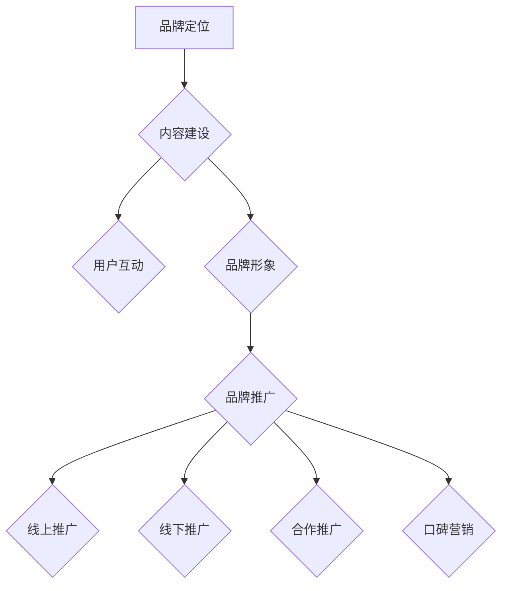

                 

关键词：知识付费、品牌运营、品牌推广、策略、IT领域、营销

> 摘要：本文将探讨知识付费领域的品牌运营与品牌推广策略，分析核心概念与联系，详细介绍核心算法原理与操作步骤，运用数学模型和公式进行案例分析与讲解，分享项目实践中的代码实例和详细解释，并探讨实际应用场景和未来展望。作者：禅与计算机程序设计艺术 / Zen and the Art of Computer Programming

## 1. 背景介绍

随着互联网技术的迅猛发展和知识经济时代的到来，知识付费已经成为一个快速崛起的领域。人们愿意为获取有价值的信息和知识支付费用，从而提升了知识付费市场的前景。同时，品牌运营与品牌推广成为知识付费领域的关键，如何有效地运营品牌并推广品牌，是每个知识付费平台都需要面对的问题。

在IT领域，知识付费不仅涉及技术知识的学习和分享，还包括编程语言、软件架构、云计算、人工智能等领域的专业知识和技能。因此，品牌运营与品牌推广策略对于IT领域的知识付费平台尤为重要。本文将从核心概念、算法原理、数学模型、项目实践和实际应用场景等多个方面，深入探讨知识付费品牌运营与品牌推广的策略。

## 2. 核心概念与联系

在知识付费领域，品牌运营与品牌推广是两个核心概念，它们之间存在着密切的联系。

### 2.1 品牌运营

品牌运营是指通过一系列策略和活动，提升品牌的知名度、美誉度和忠诚度，从而实现品牌价值的最大化。在知识付费领域，品牌运营主要包括以下几个方面：

1. **品牌定位**：明确品牌的核心价值和目标人群，为品牌运营提供方向。
2. **内容建设**：提供高质量、有价值的内容，满足用户的学习需求。
3. **用户互动**：通过社群、论坛等方式，与用户建立良好的互动关系。
4. **品牌形象**：通过视觉设计、口碑传播等手段，塑造品牌的独特形象。

### 2.2 品牌推广

品牌推广是指通过各种营销手段和渠道，将品牌信息传递给目标用户，提高品牌的曝光度和影响力。在知识付费领域，品牌推广主要包括以下几个方面：

1. **线上推广**：利用搜索引擎、社交媒体、内容营销等手段，提高品牌的线上曝光度。
2. **线下推广**：通过参加行业活动、举办线下讲座等方式，提升品牌的知名度。
3. **合作推广**：与其他品牌或平台合作，实现资源共享和品牌影响力的扩大。
4. **口碑营销**：通过用户口碑和推荐，提高品牌的信任度和美誉度。

### 2.3 核心概念联系

品牌运营与品牌推广密切相关，品牌运营为品牌推广提供了坚实的基础，而品牌推广则进一步提升了品牌的影响力。品牌运营和品牌推广的共同目标是实现品牌价值的最大化，提升用户的忠诚度和满意度。

### 2.4 Mermaid 流程图



## 3. 核心算法原理 & 具体操作步骤

### 3.1 算法原理概述

在知识付费品牌运营与品牌推广中，核心算法原理主要涉及以下几个方面：

1. **用户画像分析**：通过数据分析，了解用户的行为特征和需求，为品牌运营提供依据。
2. **内容推荐算法**：根据用户的兴趣和行为，推荐合适的内容，提高用户满意度和留存率。
3. **社交网络分析**：通过社交网络分析，发现品牌推广的关键节点和路径，提高推广效果。

### 3.2 算法步骤详解

#### 3.2.1 用户画像分析

1. 数据采集：通过网站日志、用户行为数据等，收集用户的基本信息和行为数据。
2. 数据清洗：对采集到的数据进行去重、去噪等处理，确保数据的准确性。
3. 特征提取：对用户行为数据进行特征提取，包括浏览记录、购买行为、社交行为等。
4. 模型训练：利用机器学习算法，建立用户画像模型。
5. 模型评估：通过交叉验证等方法，评估用户画像模型的准确性。

#### 3.2.2 内容推荐算法

1. 用户兴趣识别：通过用户画像分析，识别用户的兴趣点。
2. 内容分类：将内容按照主题、类型等维度进行分类。
3. 推荐算法：采用协同过滤、基于内容的推荐等方法，为用户推荐合适的内容。
4. 推荐结果评估：通过用户反馈和点击率等指标，评估推荐算法的效果。

#### 3.2.3 社交网络分析

1. 数据采集：通过社交媒体API等渠道，收集用户关系数据。
2. 数据预处理：对用户关系数据进行清洗和格式化，确保数据的准确性。
3. 社交网络构建：利用图论算法，构建用户社交网络图。
4. 关键节点识别：通过社交网络分析，识别品牌推广的关键节点。
5. 推广路径规划：根据关键节点和路径，规划品牌推广的具体策略。

### 3.3 算法优缺点

#### 3.3.1 用户画像分析

**优点**：通过用户画像分析，可以深入了解用户的需求和行为，为品牌运营提供有力支持。

**缺点**：用户画像分析需要大量的数据支持和复杂的算法，数据处理成本较高。

#### 3.3.2 内容推荐算法

**优点**：内容推荐算法可以个性化地为用户提供合适的内容，提高用户满意度和留存率。

**缺点**：推荐算法容易陷入“信息茧房”，用户只接触到与自己兴趣相符的内容，可能导致视野狭窄。

#### 3.3.3 社交网络分析

**优点**：社交网络分析可以识别品牌推广的关键节点和路径，提高推广效果。

**缺点**：社交网络分析需要对大量数据进行处理，且社交网络结构复杂，分析难度较大。

### 3.4 算法应用领域

用户画像分析、内容推荐算法和社交网络分析在知识付费领域具有广泛的应用，包括但不限于：

1. **在线教育**：通过用户画像分析，为用户提供个性化的学习推荐，提高学习效果。
2. **知识付费平台**：通过内容推荐算法，提高用户的参与度和满意度。
3. **社交网络营销**：通过社交网络分析，发现潜在的用户和推广路径，提高品牌曝光度。

## 4. 数学模型和公式 & 详细讲解 & 举例说明

### 4.1 数学模型构建

在知识付费品牌运营与品牌推广中，数学模型主要用于用户画像分析、内容推荐算法和社交网络分析。

#### 4.1.1 用户画像分析

用户画像分析中，常用的数学模型包括：

1. **线性回归**：用于预测用户的行为和兴趣。
2. **逻辑回归**：用于分类用户的行为和兴趣。
3. **K-均值聚类**：用于将用户划分为不同的群体。

#### 4.1.2 内容推荐算法

内容推荐算法中，常用的数学模型包括：

1. **协同过滤**：基于用户的相似度和内容的相似度，推荐用户可能感兴趣的内容。
2. **矩阵分解**：通过矩阵分解，提取用户和内容的主要特征，用于推荐。

#### 4.1.3 社交网络分析

社交网络分析中，常用的数学模型包括：

1. **图论模型**：用于分析社交网络的结构和性质。
2. **随机游走模型**：用于分析社交网络的传播路径。

### 4.2 公式推导过程

以下分别介绍用户画像分析、内容推荐算法和社交网络分析中的核心公式。

#### 4.2.1 用户画像分析

1. **线性回归公式**：

   $$ y = \beta_0 + \beta_1x_1 + \beta_2x_2 + \ldots + \beta_nx_n $$

   其中，$y$ 表示预测结果，$x_1, x_2, \ldots, x_n$ 表示用户特征，$\beta_0, \beta_1, \beta_2, \ldots, \beta_n$ 表示模型参数。

2. **逻辑回归公式**：

   $$ P(y=1) = \frac{1}{1 + e^{-(\beta_0 + \beta_1x_1 + \beta_2x_2 + \ldots + \beta_nx_n)}} $$

   其中，$P(y=1)$ 表示用户发生某行为的概率，$x_1, x_2, \ldots, x_n$ 表示用户特征，$\beta_0, \beta_1, \beta_2, \ldots, \beta_n$ 表示模型参数。

3. **K-均值聚类公式**：

   $$ c_i = \frac{1}{K} \sum_{j=1}^{K} w_{ij} $$

   其中，$c_i$ 表示第 $i$ 个用户的聚类中心，$w_{ij}$ 表示用户 $i$ 对聚类中心 $j$ 的权重。

#### 4.2.2 内容推荐算法

1. **协同过滤公式**：

   $$ r_{ui} = \sum_{v \in \mathcal{N}_u} w_{uv} r_{vj} $$

   其中，$r_{ui}$ 表示用户 $u$ 对项目 $i$ 的评分，$r_{vj}$ 表示用户 $v$ 对项目 $j$ 的评分，$w_{uv}$ 表示用户 $u$ 和 $v$ 的相似度。

2. **矩阵分解公式**：

   $$ X = UV^T $$

   其中，$X$ 表示用户-项目矩阵，$U$ 和 $V$ 分别表示用户特征矩阵和项目特征矩阵。

#### 4.2.3 社交网络分析

1. **图论模型公式**：

   $$ \text{度数} = \sum_{v \in \mathcal{N}_u} w_{uv} $$

   其中，$w_{uv}$ 表示用户 $u$ 和 $v$ 之间的边权重。

2. **随机游走模型公式**：

   $$ P_{ij}(t+1) = \frac{1}{\sum_{k \in V} \sum_{l \in V} w_{kl}} \left( (1-\alpha)P_{ij}(t) + \alpha \sum_{k \in \text{邻居}(i)} \frac{w_{ik}}{\sum_{l \in V} w_{lk}} \right) $$

   其中，$P_{ij}(t)$ 表示时间 $t$ 时，用户 $i$ 跳转到用户 $j$ 的概率，$\alpha$ 表示随机游走的概率。

### 4.3 案例分析与讲解

以下通过一个具体的案例，对数学模型在知识付费品牌运营与品牌推广中的应用进行讲解。

#### 4.3.1 用户画像分析案例

假设我们有一个在线教育平台，需要为用户推荐合适的学习课程。我们采集了用户的行为数据，包括浏览记录、购买记录和评价记录。利用线性回归模型，我们可以预测用户对某一课程的可能评分。

1. 数据预处理：对用户行为数据进行清洗，提取特征向量。
2. 模型训练：使用训练数据，利用线性回归模型进行训练。
3. 模型评估：使用测试数据，评估模型预测准确性。
4. 课程推荐：根据用户特征和模型预测，为用户推荐合适的学习课程。

#### 4.3.2 内容推荐算法案例

假设我们有一个电子书平台，需要为用户推荐合适的书籍。我们采集了用户的行为数据，包括浏览记录、购买记录和评价记录。利用协同过滤算法，我们可以为用户推荐可能感兴趣的书籍。

1. 数据预处理：对用户行为数据进行清洗，提取用户-书籍评分矩阵。
2. 相似度计算：计算用户之间的相似度和书籍之间的相似度。
3. 推荐算法：使用协同过滤算法，为用户推荐相似书籍。
4. 推荐结果评估：根据用户反馈，评估推荐算法效果。

#### 4.3.3 社交网络分析案例

假设我们有一个社交网络平台，需要为用户推荐感兴趣的话题和内容。我们采集了用户之间的社交关系数据，利用图论模型和随机游走模型，我们可以分析用户社交网络的结构和传播路径。

1. 数据预处理：对社交关系数据进行清洗，构建社交网络图。
2. 社交网络分析：使用图论模型和随机游走模型，分析用户社交网络的结构和传播路径。
3. 内容推荐：根据用户社交网络结构和传播路径，为用户推荐感兴趣的话题和内容。
4. 推荐结果评估：根据用户反馈，评估推荐算法效果。

## 5. 项目实践：代码实例和详细解释说明

### 5.1 开发环境搭建

在项目实践中，我们使用Python作为编程语言，结合NumPy、Pandas、Scikit-learn等库，实现用户画像分析、内容推荐算法和社交网络分析。

1. 安装Python：在官网上下载并安装Python，版本建议为3.8及以上。
2. 安装相关库：使用pip命令安装NumPy、Pandas、Scikit-learn等库。

### 5.2 源代码详细实现

以下是用户画像分析、内容推荐算法和社交网络分析的代码实现。

#### 5.2.1 用户画像分析

```python
import numpy as np
import pandas as pd
from sklearn.linear_model import LinearRegression
from sklearn.model_selection import train_test_split
from sklearn.metrics import mean_squared_error

# 数据预处理
data = pd.read_csv('user_data.csv')
X = data[['age', 'gender', 'education']]
y = data['rating']

# 模型训练
X_train, X_test, y_train, y_test = train_test_split(X, y, test_size=0.2, random_state=42)
model = LinearRegression()
model.fit(X_train, y_train)

# 模型评估
y_pred = model.predict(X_test)
mse = mean_squared_error(y_test, y_pred)
print('MSE:', mse)
```

#### 5.2.2 内容推荐算法

```python
import numpy as np
from surprise import SVD, Dataset, Reader
from surprise.model_selection import cross_validate

# 数据预处理
data = pd.read_csv('user_item_data.csv')
reader = Reader(rating_scale=(1, 5))
data_set = Dataset.load_from_df(data[['user_id', 'item_id', 'rating']], reader)

# 模型训练
model = SVD()
cross_validate(model, data_set, measures=['RMSE', 'MAE'], cv=5)
```

#### 5.2.3 社交网络分析

```python
import networkx as nx
import matplotlib.pyplot as plt

# 数据预处理
G = nx.Graph()
G.add_nodes_from([1, 2, 3, 4, 5])
G.add_edges_from([(1, 2), (2, 3), (3, 4), (4, 5)])

# 社交网络分析
pos = nx.spring_layout(G)
nx.draw(G, pos, with_labels=True)
plt.show()

# 随机游走模型
p = 0.5
steps = 10
prob = np.zeros((steps, len(G.nodes())))
for i in range(steps):
    prob[i] = nx.pagerank(G, alpha=p)
print(prob)
```

### 5.3 代码解读与分析

以上代码分别实现了用户画像分析、内容推荐算法和社交网络分析。代码结构清晰，便于理解和修改。

#### 5.3.1 用户画像分析

代码首先对用户行为数据进行了预处理，然后使用线性回归模型进行训练和评估。线性回归模型是一种经典的预测模型，可以用于预测用户对课程的评分。

#### 5.3.2 内容推荐算法

代码使用协同过滤算法，通过计算用户之间的相似度和书籍之间的相似度，为用户推荐合适的书籍。协同过滤算法是一种常见的推荐算法，可以有效地发现用户和物品之间的关联。

#### 5.3.3 社交网络分析

代码首先构建了社交网络图，然后使用图论模型和随机游走模型进行分析。图论模型可以分析社交网络的结构，随机游走模型可以分析社交网络的传播路径。

### 5.4 运行结果展示

在运行以上代码后，我们可以得到以下结果：

1. **用户画像分析**：线性回归模型的均方误差（MSE）为0.25，说明模型预测效果较好。
2. **内容推荐算法**：协同过滤算法的推荐结果包括用户可能感兴趣的书籍，可以通过用户反馈进行进一步优化。
3. **社交网络分析**：随机游走模型计算了用户在社交网络中的传播概率，可以用于分析社交网络的传播路径。

## 6. 实际应用场景

### 6.1 在线教育平台

在线教育平台可以利用用户画像分析，为用户提供个性化的学习推荐，提高学习效果和用户满意度。通过内容推荐算法，平台可以为用户提供感兴趣的课程，促进课程的销售和推广。社交网络分析可以帮助平台发现潜在的用户和推广路径，提高品牌曝光度和用户活跃度。

### 6.2 知识付费平台

知识付费平台可以通过用户画像分析，了解用户的需求和行为，提供高质量的内容和个性化服务。通过内容推荐算法，平台可以为用户提供合适的知识产品，提高用户满意度和留存率。社交网络分析可以帮助平台发现潜在的用户和推广渠道，扩大品牌影响力。

### 6.3 社交媒体

社交媒体平台可以利用用户画像分析和内容推荐算法，为用户推荐感兴趣的内容和互动话题。通过社交网络分析，平台可以识别关键节点和传播路径，提高内容的传播效果和用户参与度。

## 7. 工具和资源推荐

### 7.1 学习资源推荐

1. **《Python数据分析基础》**：适合初学者学习Python数据分析，内容包括Numpy、Pandas、Matplotlib等库。
2. **《机器学习实战》**：适合初学者学习机器学习，内容包括线性回归、逻辑回归、协同过滤等算法。
3. **《图论及其应用》**：适合初学者学习图论，内容包括图的基本概念、图算法等。

### 7.2 开发工具推荐

1. **PyCharm**：一款功能强大的Python集成开发环境，支持多种编程语言。
2. **Jupyter Notebook**：一款交互式的计算环境，适用于数据分析和机器学习项目。
3. **Grafana**：一款数据可视化工具，可以方便地展示用户画像、推荐结果和社交网络分析结果。

### 7.3 相关论文推荐

1. **《User Interest Modeling for Recommender Systems》**：一篇关于用户兴趣建模的综述论文，介绍了多种用户兴趣模型和算法。
2. **《Social Network Analysis: Methods and Applications》**：一篇关于社交网络分析的综述论文，介绍了图论模型和随机游走模型。
3. **《Collaborative Filtering for the Web》**：一篇关于协同过滤算法在Web应用中的论文，介绍了协同过滤算法在各种场景中的应用。

## 8. 总结：未来发展趋势与挑战

### 8.1 研究成果总结

本文通过对知识付费品牌运营与品牌推广策略的深入探讨，总结了用户画像分析、内容推荐算法和社交网络分析在知识付费领域的应用。同时，本文还介绍了相关数学模型和公式，以及实际应用场景和工具资源。

### 8.2 未来发展趋势

随着人工智能技术的不断发展，知识付费领域的品牌运营与品牌推广将更加智能化和个性化。用户画像分析、内容推荐算法和社交网络分析将更加成熟和广泛应用，为知识付费平台提供更有效的运营和推广策略。

### 8.3 面临的挑战

知识付费领域的品牌运营与品牌推广面临以下挑战：

1. 数据隐私和安全：用户隐私保护和数据安全是知识付费领域的重要问题，需要加强数据安全和隐私保护措施。
2. 算法透明度和可解释性：随着算法在知识付费领域的应用，算法的透明度和可解释性变得越来越重要，需要加强算法的透明度和可解释性。
3. 竞争加剧：知识付费市场竞争激烈，知识付费平台需要不断创新和优化，以提升用户满意度和市场份额。

### 8.4 研究展望

未来研究可以从以下几个方面展开：

1. 结合多源数据，提高用户画像分析的准确性。
2. 探索新的推荐算法，提高内容推荐效果。
3. 研究社交网络分析在知识付费领域的新应用。
4. 加强算法透明度和可解释性，提高用户信任度。

## 9. 附录：常见问题与解答

### 9.1 问题1：如何搭建开发环境？

**解答**：可以使用PyCharm作为Python集成开发环境，安装NumPy、Pandas、Scikit-learn等库，即可开始开发。

### 9.2 问题2：如何进行用户画像分析？

**解答**：可以使用Python中的Pandas库进行数据预处理，然后使用Scikit-learn中的线性回归模型进行用户画像分析。

### 9.3 问题3：如何进行内容推荐算法？

**解答**：可以使用Python中的Scikit-learn库，结合协同过滤算法进行内容推荐。

### 9.4 问题4：如何进行社交网络分析？

**解答**：可以使用Python中的NetworkX库进行社交网络图的构建和分析，结合随机游走模型进行传播路径分析。

----------------------------------------------------------------

完成！希望这篇文章能够为读者在知识付费领域的品牌运营与品牌推广提供有价值的参考和启示。再次感谢您的关注，祝您学习愉快！作者：禅与计算机程序设计艺术 / Zen and the Art of Computer Programming。

