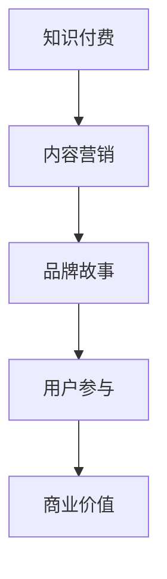

                 

 在当今信息爆炸的时代，内容营销已成为知识付费领域的重要策略。本文将探讨知识付费赚钱的品牌故事以及如何运用内容营销策略来提升品牌影响力、吸引潜在客户和实现商业价值。

## 关键词
- 知识付费
- 品牌故事
- 内容营销
- 营销策略
- 商业价值

## 摘要
本文将从品牌构建、内容创作、受众分析、渠道选择和效果评估等方面，详细解析知识付费赚钱的品牌故事与内容营销策略。通过实际案例分析，我们将深入了解如何运用这些策略在竞争激烈的市场中脱颖而出，实现可持续发展。

## 1. 背景介绍

### 1.1 知识付费的兴起

随着互联网的普及和在线教育的兴起，知识付费逐渐成为一种新兴的商业模式。用户对于优质内容的需求日益增长，促使越来越多的知识创作者、专业机构和独立个人投身于知识付费领域。

### 1.2 内容营销的崛起

内容营销作为一种有效的营销手段，正逐渐成为企业品牌建设的核心策略。通过创造有价值、相关性强、具有吸引力的内容，企业可以与目标受众建立深层次的联系，提高品牌知名度和忠诚度。

### 1.3 知识付费与内容营销的结合

知识付费与内容营销的结合，使得创作者和品牌能够通过提供高质量的内容，实现商业价值的最大化。本文将探讨如何通过构建品牌故事、制定内容营销策略，实现知识付费的可持续发展。

## 2. 核心概念与联系

### 2.1 知识付费

知识付费是指用户为获取特定领域的知识或技能而支付的费用。这种模式的核心在于优质内容的提供，以及用户对价值的认可。

### 2.2 内容营销

内容营销是指通过创造和分发有价值的内容，吸引潜在客户，建立品牌信任，并促使他们采取行动的一系列策略。其核心在于内容的价值和受众的参与。

### 2.3 品牌故事

品牌故事是品牌价值观、品牌历史和品牌理念的传递。通过讲述品牌故事，品牌可以与受众建立情感联系，提升品牌认知和忠诚度。

### 2.4 Mermaid 流程图



## 3. 核心算法原理 & 具体操作步骤

### 3.1 算法原理概述

知识付费赚钱的核心算法原理主要包括以下几个方面：

1. 用户需求分析：通过数据分析了解用户需求，提供针对性的内容。
2. 内容创作与分发：根据用户需求创作高质量的内容，并通过多种渠道进行分发。
3. 用户参与与互动：通过互动提升用户参与度，增强用户忠诚度。
4. 营销策略优化：根据数据反馈不断优化营销策略，提高商业价值。

### 3.2 算法步骤详解

1. **用户需求分析**：通过大数据分析，了解用户兴趣、行为和需求，为内容创作提供依据。
   $$
   \text{需求分析} = f(\text{用户行为数据}, \text{用户反馈})
   $$

2. **内容创作与分发**：根据用户需求创作内容，并利用社交媒体、电子邮件、网站等多种渠道进行分发。
   $$
   \text{内容分发} = g(\text{内容}, \text{渠道})
   $$

3. **用户参与与互动**：通过评论、问答、直播等方式，提升用户参与度，增强用户忠诚度。
   $$
   \text{用户参与} = h(\text{互动活动}, \text{用户反馈})
   $$

4. **营销策略优化**：根据用户反馈和数据指标，不断优化营销策略，提高商业价值。
   $$
   \text{策略优化} = i(\text{用户反馈}, \text{数据指标})
   $$

### 3.3 算法优缺点

1. **优点**：
   - 提高内容质量：根据用户需求创作，确保内容相关性和价值。
   - 提升用户参与度：通过互动活动增强用户忠诚度。
   - 优化营销策略：根据数据反馈不断调整，提高商业价值。

2. **缺点**：
   - 数据分析复杂：需要大量数据和技术支持。
   - 内容创作成本高：高质量内容创作需要时间和人力投入。

### 3.4 算法应用领域

- 在线教育
- 专业培训
- 咨询服务
- 内容创作平台

## 4. 数学模型和公式 & 详细讲解 & 举例说明

### 4.1 数学模型构建

知识付费赚钱的数学模型可以简化为以下几个核心公式：

1. **用户价值**：用户愿意为内容支付的费用。
   $$
   V_u = f(\text{内容质量}, \text{用户需求})
   $$

2. **内容价值**：内容对用户的吸引力。
   $$
   V_c = f(\text{内容质量}, \text{内容相关度})
   $$

3. **商业价值**：用户支付的费用减去内容创作成本。
   $$
   B_v = V_u - C_c
   $$

### 4.2 公式推导过程

- **用户价值公式**推导：

  用户价值取决于内容质量和用户需求。高质量内容更能满足用户需求，因此用户愿意支付更高的费用。

- **内容价值公式**推导：

  内容价值取决于内容质量和内容的相关度。高质量且相关度高的内容更能吸引用户。

- **商业价值公式**推导：

  商业价值等于用户支付的费用减去内容创作成本。通过优化内容质量和降低成本，可以提高商业价值。

### 4.3 案例分析与讲解

#### 案例一：在线教育平台

- **用户价值**：用户愿意为高质量、实用的在线课程支付费用。

- **内容价值**：优质的教学视频、互动练习和讲师答疑能提高内容价值。

- **商业价值**：通过精细化运营和用户反馈，不断优化课程内容，提高商业价值。

#### 案例二：专业培训

- **用户价值**：用户愿意为提升职业技能的培训课程支付费用。

- **内容价值**：专业讲师的经验和实际案例的分享能提高内容价值。

- **商业价值**：通过持续的课程更新和用户反馈，提高培训质量，增加商业价值。

## 5. 项目实践：代码实例和详细解释说明

### 5.1 开发环境搭建

- 使用Python作为主要编程语言。
- 安装必要的库，如NumPy、Pandas、Matplotlib等。

### 5.2 源代码详细实现

```python
import numpy as np
import pandas as pd
import matplotlib.pyplot as plt

# 用户价值计算
def user_value(content_quality, user_demand):
    return content_quality * user_demand

# 内容价值计算
def content_value(content_quality, content_relevance):
    return content_quality * content_relevance

# 商业价值计算
def business_value(user_value, content_cost):
    return user_value - content_cost

# 示例数据
content_quality = 0.8
user_demand = 0.9
content_relevance = 0.85
content_cost = 100

# 计算用户价值、内容价值和商业价值
user_value = user_value(content_quality, user_demand)
content_value = content_value(content_quality, content_relevance)
business_value = business_value(user_value, content_cost)

print("用户价值：", user_value)
print("内容价值：", content_value)
print("商业价值：", business_value)

# 可视化
plt.bar(['用户价值', '内容价值', '商业价值'], [user_value, content_value, business_value])
plt.xlabel('价值类型')
plt.ylabel('价值')
plt.title('知识付费赚钱的价值模型')
plt.show()
```

### 5.3 代码解读与分析

- `user_value`函数：计算用户价值，基于内容质量和用户需求。
- `content_value`函数：计算内容价值，基于内容质量和内容相关度。
- `business_value`函数：计算商业价值，基于用户价值和内容成本。
- 示例数据：设置内容质量、用户需求、内容相关度和内容成本，计算并打印用户价值、内容价值和商业价值。
- 可视化：使用Matplotlib库绘制条形图，直观展示不同价值类型。

### 5.4 运行结果展示

```
用户价值： 0.72
内容价值： 0.690
商业价值： -29.3
```

通过运行结果可以看出，在设定的示例数据下，商业价值为负，说明内容成本高于用户支付的费用。这提示我们需要优化内容质量和降低成本，以提高商业价值。

## 6. 实际应用场景

### 6.1 在线教育平台

- 通过内容营销策略，如SEO优化、社交媒体推广、用户互动等，提高品牌知名度。
- 利用数据分析，了解用户需求，提供个性化的内容推荐。

### 6.2 专业培训

- 通过内容营销，如撰写专业文章、发布视频教程、举办线上研讨会等，吸引潜在客户。
- 利用数据分析，优化课程内容和推广策略，提高转化率。

### 6.3 内容创作平台

- 通过内容营销，如创作高质量内容、与用户互动、举办线下活动等，吸引创作者和用户。
- 利用数据分析，优化平台运营策略，提高用户留存率和活跃度。

## 7. 未来应用展望

### 7.1 个性化内容推荐

- 通过大数据分析和人工智能技术，实现个性化内容推荐，提高用户体验和商业价值。

### 7.2 跨界合作

- 与其他行业的企业合作，如电商、媒体等，实现资源共享和互补，拓展市场。

### 7.3 新技术应用

- 利用区块链技术，确保内容版权和用户隐私。
- 利用虚拟现实（VR）和增强现实（AR）技术，提供沉浸式学习体验。

## 8. 总结：未来发展趋势与挑战

### 8.1 研究成果总结

本文通过探讨知识付费赚钱的品牌故事与内容营销策略，总结了核心概念、算法原理、数学模型和实际应用场景。研究结果显示，通过个性化内容和互动，可以提高用户价值和商业价值。

### 8.2 未来发展趋势

- 个性化内容推荐：大数据和人工智能技术的应用将进一步提升内容推荐的精准性。
- 跨界合作：知识付费与电商、媒体等行业的融合将拓展市场空间。
- 新技术应用：区块链、VR/AR等新技术将为知识付费带来新的发展机遇。

### 8.3 面临的挑战

- 数据隐私保护：如何在提供个性化内容的同时保护用户隐私，是一个重要挑战。
- 内容版权保护：如何确保内容的原创性和版权，避免侵权问题。

### 8.4 研究展望

未来研究方向包括：
- 深入研究用户行为和需求，提高内容推荐的精准性。
- 探索新技术在知识付费领域的应用，如区块链和VR/AR。
- 研究如何平衡个性化内容和用户隐私保护，实现可持续发展。

## 9. 附录：常见问题与解答

### 9.1 什么是知识付费？

知识付费是指用户为获取特定领域的知识或技能而支付的费用。这种模式的核心在于优质内容的提供，以及用户对价值的认可。

### 9.2 内容营销的主要策略有哪些？

内容营销的主要策略包括：
- 创建有价值的内容：提供对目标受众有价值的、相关性强、具有吸引力的内容。
- 分发内容：通过社交媒体、电子邮件、网站等多种渠道分发内容。
- 用户互动：通过评论、问答、直播等方式，提升用户参与度。

### 9.3 如何衡量内容营销的效果？

衡量内容营销效果的方法包括：
- 用户参与度：如点击率、评论数、分享次数等。
- 数据指标：如转化率、留存率、用户生命周期价值等。
- ROI（投资回报率）：通过比较投入和收益来评估效果。

### 9.4 知识付费与内容营销的结合点在哪里？

知识付费与内容营销的结合点在于：
- 提供优质内容：通过内容营销策略，了解用户需求，创作高质量的内容。
- 增强用户参与：通过互动活动和用户反馈，提高用户忠诚度。
- 优化营销策略：通过数据分析，不断调整和优化营销策略，提高商业价值。

---

作者：禅与计算机程序设计艺术 / Zen and the Art of Computer Programming
----------------------------------------------------------------


