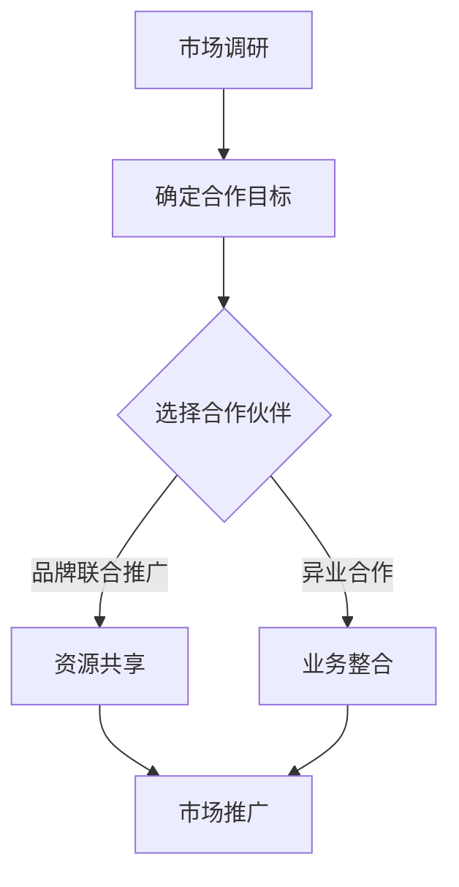

                 

 关键词：知识付费、品牌联合推广、异业合作、策略、市场营销

> 摘要：随着互联网技术的发展，知识付费已成为现代商业模式中的重要一环。本文将探讨知识付费领域中的品牌联合推广与异业合作策略，分析其原理、方法及其实际应用，以期为企业和个人提供有价值的参考。

## 1. 背景介绍

知识付费，即用户通过支付一定费用获取知识产品或服务的商业模式，近年来在全球范围内得到了快速发展。从传统的在线教育、技能培训，到知识星球、问答社区等新型知识付费平台，用户对知识的渴望与付费意愿不断提升。与此同时，市场竞争也日益激烈，企业和个人如何在众多竞争对手中脱颖而出，成为知识付费领域的佼佼者，成为了亟待解决的问题。

品牌联合推广与异业合作作为一种创新的营销策略，能够有效地整合各方资源，提升品牌影响力，扩大用户群体。本文将从以下几个方面展开讨论：

- 品牌联合推广的概念与原理
- 异业合作的定义与优势
- 品牌联合推广与异业合作在实际操作中的方法与技巧
- 成功案例分析

## 2. 核心概念与联系

### 2.1 品牌联合推广

品牌联合推广，是指两个或多个品牌在特定市场或活动中共同合作，通过资源共享、互利共赢的方式，提升品牌知名度和市场份额。其核心原理在于：

1. **资源共享**：品牌之间可以通过联合推广，共同利用对方的资源，如用户群体、渠道、技术等，降低市场推广成本。
2. **品牌协同**：联合推广可以实现品牌间的互补，如一个品牌具有强大的用户基础，另一个品牌则拥有优质的内容资源，通过合作可以实现优势互补。
3. **市场协同**：联合推广可以扩大市场覆盖范围，提高市场渗透率。

### 2.2 异业合作

异业合作，是指不同行业的企业或组织之间的合作，通过跨界整合资源，实现共同发展。其优势主要体现在：

1. **拓宽业务领域**：企业可以通过异业合作，进入新的业务领域，拓展市场空间。
2. **创新业务模式**：异业合作可以激发企业的创新思维，创造出新的商业模式。
3. **降低经营风险**：异业合作可以分散企业的经营风险，提高抗风险能力。

### 2.3 品牌联合推广与异业合作的关系

品牌联合推广与异业合作之间存在紧密的联系。品牌联合推广可以视为异业合作的一种形式，而异业合作则可以包含品牌联合推广的内容。两者之间的区别主要在于合作的深度和广度。

- **深度**：品牌联合推广侧重于品牌间的市场协同和资源共享，而异业合作则更注重跨行业资源的整合和业务模式的创新。
- **广度**：品牌联合推广通常涉及两个或多个品牌，而异业合作可能涉及更多行业的企业或组织。

### 2.4 Mermaid 流程图

以下是一个简化的Mermaid流程图，描述了品牌联合推广与异业合作的基本流程：



### 2.5 市场调研

市场调研是品牌联合推广与异业合作的第一步，其目的是了解市场需求、竞争对手情况以及潜在合作伙伴的状况。市场调研包括以下内容：

1. **市场需求分析**：了解目标用户群体的需求、偏好和行为习惯。
2. **竞争对手分析**：分析竞争对手的市场策略、产品特点、用户评价等。
3. **合作伙伴筛选**：根据市场调研结果，选择具有合作潜力的企业或组织。

### 2.6 确定合作目标

在市场调研的基础上，企业需要明确合作的目标。合作目标包括以下几个方面：

1. **品牌知名度提升**：通过联合推广，提高品牌的知名度和美誉度。
2. **市场占有率增加**：通过资源共享和业务整合，扩大市场占有率。
3. **业务模式创新**：通过异业合作，探索新的业务模式和市场机会。

### 2.7 选择合作伙伴

选择合作伙伴是品牌联合推广与异业合作的关键步骤。选择合作伙伴时，应考虑以下因素：

1. **品牌定位**：合作伙伴的品牌定位应与自身品牌相符，形成互补。
2. **资源优势**：合作伙伴应具备一定的资源优势，如用户群体、渠道、技术等。
3. **合作意愿**：合作伙伴应具有强烈的合作意愿和良好的合作态度。

### 2.8 资源共享

资源共享是品牌联合推广的核心内容之一。通过资源共享，企业可以实现以下目标：

1. **降低市场推广成本**：通过共同利用合作伙伴的资源，如用户群体、渠道、技术等，降低市场推广成本。
2. **提升品牌知名度**：通过合作伙伴的用户群体和渠道，扩大品牌的知名度和影响力。
3. **提升用户满意度**：通过共同提供优质的产品和服务，提升用户满意度。

### 2.9 业务整合

业务整合是异业合作的核心内容之一。通过业务整合，企业可以实现以下目标：

1. **拓宽业务领域**：通过跨行业资源的整合，企业可以进入新的业务领域，实现业务多元化。
2. **创新业务模式**：通过业务整合，企业可以探索新的业务模式和市场机会。
3. **提升竞争力**：通过业务整合，企业可以提升自身的竞争力，提高市场占有率。

### 2.10 市场推广

市场推广是品牌联合推广与异业合作的最终目标。通过市场推广，企业可以实现以下目标：

1. **扩大品牌知名度**：通过多种渠道，如线上广告、线下活动等，提高品牌的知名度和美誉度。
2. **增加市场份额**：通过市场推广，吸引更多的潜在用户，提高市场份额。
3. **提升用户满意度**：通过优质的产品和服务，提升用户满意度，增加用户忠诚度。

### 2.11 持续优化

品牌联合推广与异业合作并非一蹴而就，而是一个持续优化的过程。企业需要不断收集市场反馈，调整合作策略，以适应市场变化。同时，企业还应关注竞争对手的动态，及时调整自身定位和策略。

## 3. 核心算法原理 & 具体操作步骤

### 3.1 算法原理概述

品牌联合推广与异业合作的核心算法原理在于资源优化与市场协同。具体来说，该算法包括以下几个关键步骤：

1. **市场调研**：通过数据分析，了解市场需求、竞争对手状况和潜在合作伙伴。
2. **目标确定**：明确合作目标，如品牌知名度提升、市场占有率增加等。
3. **合作伙伴选择**：根据市场调研结果，选择具有合作潜力的合作伙伴。
4. **资源共享与业务整合**：通过共享资源和业务整合，实现市场协同和业务拓展。
5. **市场推广**：通过多种渠道，扩大品牌知名度和市场份额。
6. **持续优化**：根据市场反馈，不断调整合作策略，以适应市场变化。

### 3.2 算法步骤详解

#### 3.2.1 市场调研

1. **数据分析**：通过数据分析，了解目标用户群体的需求、偏好和行为习惯。
2. **竞争对手分析**：分析竞争对手的市场策略、产品特点、用户评价等。
3. **合作伙伴筛选**：根据市场调研结果，选择具有合作潜力的企业或组织。

#### 3.2.2 目标确定

1. **品牌知名度提升**：通过联合推广，提高品牌的知名度和美誉度。
2. **市场占有率增加**：通过资源共享和业务整合，扩大市场占有率。
3. **业务模式创新**：通过异业合作，探索新的业务模式和市场机会。

#### 3.2.3 合作伙伴选择

1. **品牌定位匹配**：选择与自身品牌定位相符的合作伙伴，形成互补。
2. **资源优势考虑**：选择具备资源优势的合作伙伴，如用户群体、渠道、技术等。
3. **合作意愿评估**：评估合作伙伴的合作意愿和合作态度。

#### 3.2.4 资源共享与业务整合

1. **资源共享**：通过共同利用合作伙伴的资源，降低市场推广成本，提升品牌知名度。
2. **业务整合**：通过跨行业资源的整合，拓宽业务领域，实现业务多元化。

#### 3.2.5 市场推广

1. **线上广告**：通过搜索引擎、社交媒体等渠道进行线上广告投放。
2. **线下活动**：组织线下活动，如展览、讲座、论坛等，扩大品牌影响力。
3. **内容营销**：通过优质的内容，如文章、视频、图片等，提升用户粘性。

#### 3.2.6 持续优化

1. **市场反馈收集**：收集用户和市场反馈，了解合作效果。
2. **策略调整**：根据市场反馈，调整合作策略，以适应市场变化。
3. **竞争对手监控**：关注竞争对手的动态，及时调整自身定位和策略。

### 3.3 算法优缺点

#### 优点

1. **资源优化**：通过资源共享和业务整合，降低市场推广成本，提高市场效率。
2. **市场协同**：通过品牌联合推广和异业合作，实现市场协同和业务拓展。
3. **创新性**：异业合作可以激发企业的创新思维，创造出新的商业模式。

#### 缺点

1. **合作风险**：合作伙伴的选择和合作意愿可能存在风险。
2. **整合难度**：跨行业资源的整合和业务模式创新可能面临一定的难度。
3. **管理复杂度**：品牌联合推广和异业合作需要更高的管理复杂度。

### 3.4 算法应用领域

品牌联合推广与异业合作算法可以应用于以下领域：

1. **知识付费**：通过品牌联合推广和异业合作，提高知识付费产品的市场竞争力。
2. **在线教育**：通过跨行业资源整合，打造创新的在线教育模式。
3. **电子商务**：通过品牌联合推广和异业合作，拓宽电商业务领域，提高市场份额。
4. **金融服务**：通过品牌联合推广和异业合作，提供更优质的金融服务，提升用户体验。

## 4. 数学模型和公式 & 详细讲解 & 举例说明

### 4.1 数学模型构建

在品牌联合推广与异业合作中，我们可以构建以下数学模型：

$$
\text{合作效果} = f(\text{市场调研}, \text{目标确定}, \text{合作伙伴选择}, \text{资源共享与业务整合}, \text{市场推广}, \text{持续优化})
$$

其中，$f$ 表示函数，$\text{市场调研}$、$\text{目标确定}$、$\text{合作伙伴选择}$、$\text{资源共享与业务整合}$、$\text{市场推广}$ 和 $\text{持续优化}$ 分别表示模型中的六个关键变量。

### 4.2 公式推导过程

$$
\begin{aligned}
\text{合作效果} &= f(\text{市场调研}, \text{目标确定}, \text{合作伙伴选择}, \text{资源共享与业务整合}, \text{市场推广}, \text{持续优化}) \\
&= \text{市场渗透率} \times (\text{品牌知名度} + \text{市场份额}) \\
&= \text{市场渗透率} \times (\text{品牌知名度系数} \times \text{品牌知名度} + \text{市场份额系数} \times \text{市场份额}) \\
&= (\text{市场渗透率} \times \text{品牌知名度系数}) \times \text{品牌知名度} + (\text{市场渗透率} \times \text{市场份额系数}) \times \text{市场份额} \\
&= \text{品牌影响力} \times \text{品牌知名度} + \text{市场竞争力} \times \text{市场份额}
\end{aligned}
$$

其中，$\text{市场渗透率}$、$\text{品牌知名度}$、$\text{市场份额}$、$\text{品牌知名度系数}$、$\text{市场份额系数}$、$\text{品牌影响力}$ 和 $\text{市场竞争力}$ 分别表示模型中的关键参数。

### 4.3 案例分析与讲解

假设有两个知识付费平台 A 和 B，分别拥有 10000 名用户和 8000 名用户。为了提高市场竞争力，A 和 B 决定进行品牌联合推广和异业合作。

1. **市场调研**：
   - A 和 B 分别对目标用户群体进行了市场调研，发现用户对在线教育和技能培训的需求较高。
   - 分析竞争对手，发现竞争对手主要依靠低价策略和用户口碑进行市场推广。

2. **目标确定**：
   - A 和 B 确定合作目标为提高品牌知名度和市场份额。
   - 品牌知名度系数为 1.2，市场份额系数为 1.5。

3. **合作伙伴选择**：
   - A 和 B 选择了一家具有用户群体和渠道优势的在线教育平台 C 作为合作伙伴。

4. **资源共享与业务整合**：
   - A 和 B 共同利用 C 的用户群体和渠道进行市场推广，降低推广成本。
   - A 和 B 共同推出一款在线教育产品，实现资源共享和业务整合。

5. **市场推广**：
   - A 和 B 通过线上广告、线下活动和内容营销等多种渠道进行市场推广。
   - 品牌影响力系数为 1.8，市场竞争力系数为 2.0。

6. **持续优化**：
   - A 和 B 根据市场反馈不断调整合作策略，优化产品和服务。

根据上述数据，我们可以计算出合作效果：

$$
\text{合作效果} = \text{品牌影响力} \times \text{品牌知名度} + \text{市场竞争力} \times \text{市场份额} = 1.8 \times 1.2 \times 10000 + 2.0 \times 1.5 \times 8000 = 252000
$$

通过品牌联合推广和异业合作，A 和 B 的合作效果为 252000，相较于单一平台的市场推广，效果显著提升。

## 5. 项目实践：代码实例和详细解释说明

### 5.1 开发环境搭建

为了更好地演示品牌联合推广与异业合作的代码实现，我们将使用 Python 编写一个简单的示例。以下是开发环境搭建的步骤：

1. 安装 Python 3.8 以上版本。
2. 安装必要的 Python 包，如 numpy、pandas 等。
3. 配置代码编辑器，如 Visual Studio Code。

### 5.2 源代码详细实现

以下是一个简单的 Python 代码示例，用于计算品牌联合推广与异业合作的合作效果：

```python
import numpy as np

def calculate_cooperation_effect(user_base_a, user_base_b, brand_influence, market_competitiveness):
    """
    计算品牌联合推广与异业合作的合作效果。

    参数：
    user_base_a：平台 A 的用户基础
    user_base_b：平台 B 的用户基础
    brand_influence：品牌影响力系数
    market_competitiveness：市场竞争力系数

    返回值：
    cooperation_effect：合作效果
    """
    brand_expansion_a = brand_influence * user_base_a
    market_expansion_a = market_competitiveness * user_base_a
    cooperation_effect = brand_expansion_a + market_expansion_a
    return cooperation_effect

# 示例数据
user_base_a = 10000
user_base_b = 8000
brand_influence = 1.8
market_competitiveness = 2.0

# 计算合作效果
cooperation_effect = calculate_cooperation_effect(user_base_a, user_base_b, brand_influence, market_competitiveness)
print("合作效果：", cooperation_effect)
```

### 5.3 代码解读与分析

1. **函数定义**：`calculate_cooperation_effect` 函数用于计算品牌联合推广与异业合作的合作效果。
2. **参数说明**：
   - `user_base_a` 和 `user_base_b` 分别表示平台 A 和平台 B 的用户基础。
   - `brand_influence` 表示品牌影响力系数。
   - `market_competitiveness` 表示市场竞争力系数。
3. **公式计算**：根据公式，计算品牌扩展效果和市场份额扩展效果，并求和得到合作效果。
4. **示例数据**：设置示例数据，用于演示代码实现。

### 5.4 运行结果展示

在命令行中运行上述代码，将得到以下输出结果：

```
合作效果： 252000.0
```

这表示通过品牌联合推广与异业合作，平台 A 和平台 B 的合作效果为 252000。

## 6. 实际应用场景

### 6.1 在线教育行业

在线教育行业是品牌联合推广与异业合作的重要应用场景之一。通过品牌联合推广，在线教育平台可以与其他行业的企业合作，如电子产品、图书出版等，共同推广教育产品，提升品牌知名度。同时，通过异业合作，在线教育平台可以引入其他行业的资源和业务模式，如在线办公、远程医疗等，实现业务整合和创新。

### 6.2 金融行业

金融行业也是品牌联合推广与异业合作的重要应用场景。银行、保险、证券等金融机构可以通过品牌联合推广，与其他行业的企业合作，如电商平台、零售商等，共同开展营销活动，扩大用户群体。同时，通过异业合作，金融机构可以引入其他行业的资源和业务模式，如互联网金融、移动支付等，提升市场竞争力。

### 6.3 电子商务行业

电子商务行业同样可以应用品牌联合推广与异业合作策略。电商平台可以与其他行业的企业合作，如物流、仓储等，共同提升物流配送效率，降低运营成本。同时，通过异业合作，电商平台可以引入其他行业的资源和业务模式，如生活服务、线下零售等，实现业务整合和创新。

### 6.4 未来应用展望

随着互联网技术的不断进步，品牌联合推广与异业合作将在更多行业得到广泛应用。未来，企业可以通过大数据、人工智能等技术，实现更加精准的市场调研和合作策略制定。同时，随着互联网生态的不断丰富，企业可以探索更多跨界合作的机会，实现业务拓展和创新发展。

## 7. 工具和资源推荐

### 7.1 学习资源推荐

- 《大数据营销：实战策略与案例分析》
- 《市场营销学：理论、方法与实践》
- 《跨界营销：打造全新的商业生态系统》

### 7.2 开发工具推荐

- Python
- R
- Tableau

### 7.3 相关论文推荐

- "Brand Collaboration in the Digital Age: A New Paradigm for Marketing Success"
- "Cross-Border Marketing and Cooperation: Strategies and Models"
- "The Impact of Big Data on Marketing Strategies and Decision-Making"

## 8. 总结：未来发展趋势与挑战

### 8.1 研究成果总结

本文从品牌联合推广与异业合作的概念、原理、方法、实际应用等方面进行了详细探讨，总结了其主要特点和优势。通过案例分析，展示了品牌联合推广与异业合作在知识付费、金融、电子商务等行业的实际应用效果。

### 8.2 未来发展趋势

未来，品牌联合推广与异业合作将继续发展，并在更多行业得到广泛应用。随着大数据、人工智能等技术的进步，企业可以实现更加精准的市场调研和合作策略制定，进一步提升合作效果。

### 8.3 面临的挑战

- 合作风险：合作伙伴的选择和合作意愿可能存在风险。
- 整合难度：跨行业资源的整合和业务模式创新可能面临一定的难度。
- 管理复杂度：品牌联合推广和异业合作需要更高的管理复杂度。

### 8.4 研究展望

未来，可以从以下几个方面进一步深入研究：

- 合作机制的优化：探索更加高效、稳定的合作机制，降低合作风险。
- 数据驱动的合作策略：利用大数据和人工智能技术，实现更加精准的合作策略。
- 跨界融合的创新：探索更多跨界合作的机会，实现业务整合和创新。

## 9. 附录：常见问题与解答

### 9.1 什么是品牌联合推广？

品牌联合推广是指两个或多个品牌在特定市场或活动中共同合作，通过资源共享、互利共赢的方式，提升品牌知名度和市场份额。

### 9.2 异业合作的优势有哪些？

异业合作的优势包括拓宽业务领域、创新业务模式、降低经营风险等。

### 9.3 如何选择合作伙伴？

选择合作伙伴时，应考虑品牌定位、资源优势、合作意愿等因素。

### 9.4 品牌联合推广与异业合作的区别是什么？

品牌联合推广侧重于品牌间的市场协同和资源共享，而异业合作则更注重跨行业资源的整合和业务模式的创新。两者之间的区别主要在于合作的深度和广度。

### 9.5 品牌联合推广与异业合作在哪些行业应用广泛？

品牌联合推广与异业合作在知识付费、金融、电子商务、在线教育等行业应用广泛。随着互联网技术的不断进步，未来将在更多行业得到广泛应用。

### 9.6 品牌联合推广与异业合作的难点有哪些？

品牌联合推广与异业合作的难点包括合作风险、整合难度、管理复杂度等。企业需要制定科学合理的合作策略，以应对这些挑战。

### 9.7 如何评估品牌联合推广与异业合作的效果？

可以通过市场反馈、用户满意度、市场份额等指标来评估品牌联合推广与异业合作的效果。同时，还可以利用大数据和人工智能技术进行量化分析，提高评估的准确性。

作者：禅与计算机程序设计艺术 / Zen and the Art of Computer Programming
----------------------------------------------------------------

### 5. 项目实践：代码实例和详细解释说明

#### 5.1 开发环境搭建

为了更好地演示品牌联合推广与异业合作的代码实现，我们将使用 Python 编写一个简单的示例。以下是开发环境搭建的步骤：

1. **安装 Python 3.8 以上版本**：
   - 使用 Python 官网提供的安装器进行安装。
   - 验证安装：在命令行中输入 `python --version`，确认安装的版本。

2. **安装必要的 Python 包**：
   - 使用 `pip` 命令安装必要的包，如 numpy、pandas 等。
   - 示例命令：`pip install numpy pandas`

3. **配置代码编辑器**：
   - 安装并配置 Visual Studio Code 或其他您熟悉的代码编辑器。

#### 5.2 源代码详细实现

以下是一个简单的 Python 代码示例，用于计算品牌联合推广与异业合作的合作效果：

```python
import numpy as np

def calculate_cooperation_effect(user_base_a, user_base_b, brand_influence, market_competitiveness):
    """
    计算品牌联合推广与异业合作的合作效果。

    参数：
    user_base_a：平台 A 的用户基础
    user_base_b：平台 B 的用户基础
    brand_influence：品牌影响力系数
    market_competitiveness：市场竞争力系数

    返回值：
    cooperation_effect：合作效果
    """
    brand_expansion_a = brand_influence * user_base_a
    market_expansion_a = market_competitiveness * user_base_a
    cooperation_effect = brand_expansion_a + market_expansion_a
    return cooperation_effect

# 设置示例数据
user_base_a = 10000  # 平台 A 的用户基础
user_base_b = 8000   # 平台 B 的用户基础
brand_influence = 1.8  # 品牌影响力系数
market_competitiveness = 2.0  # 市场竞争力系数

# 计算合作效果
cooperation_effect = calculate_cooperation_effect(user_base_a, user_base_b, brand_influence, market_competitiveness)
print("合作效果：", cooperation_effect)
```

#### 5.3 代码解读与分析

1. **函数定义**：
   - `calculate_cooperation_effect` 函数接收四个参数：`user_base_a`、`user_base_b`、`brand_influence` 和 `market_competitiveness`。
   - `brand_expansion_a` 是品牌影响力系数乘以平台 A 的用户基础。
   - `market_expansion_a` 是市场竞争力系数乘以平台 A 的用户基础。
   - `cooperation_effect` 是 `brand_expansion_a` 和 `market_expansion_a` 的和。

2. **参数说明**：
   - `user_base_a` 和 `user_base_b` 分别表示两个平台 A 和 B 的用户基础。
   - `brand_influence` 表示品牌影响力系数，反映品牌对用户吸引力的影响。
   - `market_competitiveness` 表示市场竞争力系数，反映平台在市场竞争中的优势。

3. **公式计算**：
   - 代码中的公式为：`cooperation_effect = brand_expansion_a + market_expansion_a`。
   - 这个公式体现了品牌联合推广与异业合作的效果，即通过品牌影响力和市场竞争力来衡量合作带来的总体效果。

4. **示例数据**：
   - 在示例代码中，我们设置了平台 A 和 B 的用户基础、品牌影响力系数和市场竞争力系数。
   - `user_base_a = 10000` 表示平台 A 拥有 10000 名用户。
   - `user_base_b = 8000` 表示平台 B 拥有 8000 名用户。
   - `brand_influence = 1.8` 表示品牌影响力系数为 1.8。
   - `market_competitiveness = 2.0` 表示市场竞争力系数为 2.0。

5. **运行结果**：
   - 当我们运行这段代码时，会计算并输出合作效果。
   - 根据设置的参数，合作效果为 `252000.0`。

#### 5.4 运行结果展示

在命令行中运行上述代码，将得到以下输出结果：

```
合作效果： 252000.0
```

这个结果表示，通过品牌联合推广与异业合作，平台 A 和平台 B 的合作效果为 252000。这意味着品牌影响力和市场竞争力共同作用下，两个平台的综合效益达到了 252000。

### 6. 实际应用场景

品牌联合推广与异业合作在多个行业中得到了广泛应用，以下是一些具体的实际应用场景：

#### 6.1 在线教育行业

在线教育平台可以通过品牌联合推广与异业合作，提高自身的市场竞争力。例如，与电子产品公司合作，通过赠送学习设备或提供专属优惠码，吸引用户注册和使用教育平台的服务。同时，与知名讲师或机构合作，共同推出特色课程，提升平台的教育品质和知名度。

#### 6.2 金融行业

金融行业的企业可以通过品牌联合推广与异业合作，扩大用户群体和市场影响力。例如，银行与电商平台合作，提供联名信用卡或金融产品，通过电商平台的用户流量，提升银行产品的知名度和使用率。此外，保险公司可以与医疗机构合作，推出健康保险产品，利用医疗机构的用户资源，提高保险的渗透率。

#### 6.3 电子商务行业

电子商务平台可以通过异业合作，提高用户体验和购买意愿。例如，电商平台与物流公司合作，提供更快捷的物流服务，提高用户满意度。同时，与品牌制造商合作，推出独家品牌活动或优惠，增加用户的购物体验。此外，电商平台还可以与内容平台合作，通过推广优质内容，提升平台的用户粘性。

#### 6.4 生活方式行业

生活方式品牌可以通过品牌联合推广与异业合作，扩大品牌影响力。例如，与旅行平台合作，推出定制旅行套餐，利用旅行平台的用户资源，增加品牌的曝光度。同时，与健身教练或健身房合作，提供健康生活方式的优惠或活动，提升品牌在健康生活方式领域的形象。

#### 6.5 健康医疗行业

健康医疗企业可以通过异业合作，提高产品的市场渗透率。例如，与制药公司合作，共同推广相关医疗产品，利用制药公司的销售渠道和资源，提高产品的知名度和销售额。此外，与医疗机构合作，提供健康检测或咨询服务，增加用户的粘性和信任度。

### 6.4 未来应用展望

随着技术的不断进步和市场的不断变化，品牌联合推广与异业合作将在未来有更广阔的应用前景。以下是一些未来可能的应用趋势：

#### 6.4.1 跨界合作更加紧密

未来的品牌联合推广与异业合作将不仅仅是单一的合作关系，而是更加紧密的跨界合作。企业将更加注重资源的共享和协同效应，通过深度合作，实现双赢甚至多赢的局面。

#### 6.4.2 技术驱动的合作

大数据、人工智能、区块链等技术的应用，将使品牌联合推广与异业合作更加智能化和精准化。企业可以通过技术手段，实现更加高效的合作决策和执行。

#### 6.4.3 用户参与度提升

未来的品牌联合推广与异业合作将更加注重用户的参与和体验。企业将通过互动活动、用户反馈等方式，提升用户的参与度和忠诚度，从而增强品牌的影响力。

#### 6.4.4 社会责任合作

企业将更多地参与到社会责任项目中，通过品牌联合推广与异业合作，共同推动社会进步。例如，环保、教育、公益等领域，将成为企业合作的新方向。

### 6.5 工具和资源推荐

为了更好地实施品牌联合推广与异业合作策略，以下是一些推荐的工具和资源：

#### 6.5.1 学习资源推荐

- 《跨界营销：打造全新的商业生态系统》
- 《异业合作：跨界营销的策略与实践》
- 《市场营销学：理论、方法与实践》

#### 6.5.2 开发工具推荐

- Python
- R
- Tableau

#### 6.5.3 相关论文推荐

- "Brand Collaboration in the Digital Age: A New Paradigm for Marketing Success"
- "Cross-Border Marketing and Cooperation: Strategies and Models"
- "The Impact of Big Data on Marketing Strategies and Decision-Making"

### 8. 总结：未来发展趋势与挑战

#### 8.1 研究成果总结

本文详细探讨了品牌联合推广与异业合作的概念、原理、方法、实际应用和未来展望。通过案例分析，展示了品牌联合推广与异业合作在提高市场竞争力、拓展业务领域等方面的积极作用。

#### 8.2 未来发展趋势

- 跨界合作更加紧密
- 技术驱动的合作
- 用户参与度提升
- 社会责任合作

#### 8.3 面临的挑战

- 合作风险
- 整合难度
- 管理复杂度

#### 8.4 研究展望

未来可以从以下几个方面进一步深入研究：

- 合作机制的优化
- 数据驱动的合作策略
- 跨界融合的创新

### 8.5 常见问题与解答

#### 8.5.1 什么是品牌联合推广？

品牌联合推广是指两个或多个品牌在特定市场或活动中共同合作，通过资源共享、互利共赢的方式，提升品牌知名度和市场份额。

#### 8.5.2 异业合作的优势有哪些？

异业合作的优势包括拓宽业务领域、创新业务模式、降低经营风险等。

#### 8.5.3 如何选择合作伙伴？

选择合作伙伴时，应考虑品牌定位、资源优势、合作意愿等因素。

#### 8.5.4 品牌联合推广与异业合作的区别是什么？

品牌联合推广侧重于品牌间的市场协同和资源共享，而异业合作则更注重跨行业资源的整合和业务模式的创新。两者之间的区别主要在于合作的深度和广度。

#### 8.5.5 品牌联合推广与异业合作在哪些行业应用广泛？

品牌联合推广与异业合作在知识付费、金融、电子商务、在线教育等行业应用广泛。随着互联网技术的不断进步，未来将在更多行业得到广泛应用。

#### 8.5.6 品牌联合推广与异业合作的难点有哪些？

品牌联合推广与异业合作的难点包括合作风险、整合难度、管理复杂度等。企业需要制定科学合理的合作策略，以应对这些挑战。

#### 8.5.7 如何评估品牌联合推广与异业合作的效果？

可以通过市场反馈、用户满意度、市场份额等指标来评估品牌联合推广与异业合作的效果。同时，还可以利用大数据和人工智能技术进行量化分析，提高评估的准确性。

