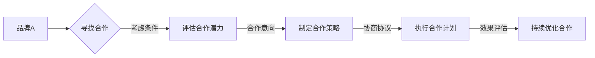

                 

在当今数字化的时代，知识付费和品牌跨界合作成为了众多企业提升竞争力、拓展市场和增加收益的重要策略。本文将探讨如何通过跨界合作与联合营销，在知识付费领域实现共赢，同时为企业和个人提供实用的操作指南。

## 关键词

- 知识付费
- 品牌跨界合作
- 联合营销
- 跨界合作策略
- 营销案例

## 摘要

本文首先介绍了知识付费的背景及其重要性，随后讨论了品牌跨界合作的含义和优势。通过深入分析跨界合作与联合营销的策略和方法，本文提供了一系列实际操作的步骤和案例分析。最后，文章对未来知识付费和品牌跨界合作的发展趋势进行了展望，并提出了相关的挑战和解决方案。

## 1. 背景介绍

### 1.1 知识付费的兴起

知识付费是指用户通过付费方式获取有价值的知识和信息，如在线课程、专业咨询、研究报告等。随着互联网的普及和信息技术的进步，知识付费市场呈现出爆发式增长。越来越多的用户愿意为高质量的知识和服务支付费用，这为企业和个人提供了巨大的商机。

### 1.2 品牌跨界合作的定义与意义

品牌跨界合作是指不同品牌之间通过资源共享、市场联合等方式，实现跨行业、跨领域的合作。跨界合作不仅能够拓展品牌的知名度，还可以通过互补优势实现资源共享、风险分散，提高市场竞争力。品牌跨界合作在知识付费领域的意义主要体现在以下几个方面：

- **提升品牌影响力**：跨界合作可以借助合作伙伴的品牌影响力，快速提升自身品牌的知名度。
- **扩大用户群体**：跨界合作能够吸引来自不同领域的用户，扩大目标市场。
- **增加收益**：通过联合营销和资源共享，可以实现成本降低和收益增加。

## 2. 核心概念与联系

### 2.1 跨界合作的基本原理

跨界合作的基本原理可以概括为“优势互补、资源共享、风险分散”。通过不同品牌之间的合作，各自发挥自身的优势，共享资源，共同承担风险，从而实现互利共赢。

### 2.2 跨界合作的架构

以下是跨界合作的基本架构，使用Mermaid流程图表示：



### 2.3 跨界合作的类型

根据合作的形式和目的，跨界合作可以分为以下几种类型：

- **产品合作**：通过联合推出新产品或服务，实现资源共享和市场需求扩大。
- **品牌合作**：通过共同推广品牌，提升品牌影响力和市场占有率。
- **渠道合作**：通过共享销售渠道，扩大产品或服务的销售范围。
- **内容合作**：通过联合创作内容，提升内容质量和用户黏性。

## 3. 核心算法原理 & 具体操作步骤

### 3.1 算法原理概述

跨界合作的算法原理可以概括为以下步骤：

1. **需求识别**：分析市场需求和用户需求，确定跨界合作的潜在机会。
2. **合作伙伴选择**：根据合作目标和资源条件，选择合适的合作伙伴。
3. **合作策略制定**：制定合作策略，包括合作形式、目标和计划。
4. **协议协商**：与合作伙伴协商合作细节，包括权益分配、责任划分等。
5. **执行与监督**：执行合作计划，并对合作过程进行监督和管理。
6. **效果评估与优化**：评估合作效果，根据反馈进行合作策略的优化。

### 3.2 算法步骤详解

#### 3.2.1 需求识别

需求识别是跨界合作的第一步，主要任务包括：

- **市场调研**：分析市场需求，了解用户需求和偏好。
- **内部资源分析**：评估自身资源条件，确定合作需求和合作潜力。

#### 3.2.2 合作伙伴选择

合作伙伴选择的关键是找到能够实现优势互补、资源共享的合作伙伴。主要步骤包括：

- **潜在合作伙伴筛选**：根据市场需求和自身资源条件，筛选出潜在的合作伙伴。
- **合作潜力评估**：对潜在合作伙伴进行评估，包括品牌影响力、市场占有率、资源条件等。
- **合作伙伴筛选**：根据评估结果，选择最合适的合作伙伴。

#### 3.2.3 合作策略制定

合作策略制定是跨界合作的核心，主要任务包括：

- **合作形式确定**：根据合作伙伴的特点和市场需求，确定合作形式，如产品合作、品牌合作、渠道合作等。
- **合作目标制定**：明确合作的目标和期望成果。
- **合作计划制定**：制定详细的合作计划，包括合作的时间表、任务分配、资源投入等。

#### 3.2.4 协议协商

协议协商是确保跨界合作顺利进行的重要环节，主要任务包括：

- **合作协议起草**：根据合作策略，起草合作协议，明确合作双方的权利和义务。
- **协议协商**：与合作伙伴协商合作细节，包括权益分配、责任划分、违约责任等。
- **协议签署**：完成合作协议的协商，签署正式的协议文件。

#### 3.2.5 执行与监督

执行与监督是确保跨界合作按计划进行的关键步骤，主要任务包括：

- **任务分配与执行**：根据合作计划，分配任务并确保任务按时完成。
- **进度跟踪与反馈**：定期跟踪合作进度，收集反馈信息，及时调整合作策略。
- **风险控制**：识别潜在的风险，并采取相应的风险控制措施。

#### 3.2.6 效果评估与优化

效果评估与优化是提升跨界合作效果的重要手段，主要任务包括：

- **效果评估**：根据合作目标，评估合作效果，包括市场占有率、用户满意度、收益等。
- **优化建议**：根据评估结果，提出优化建议，调整合作策略。
- **持续优化**：根据优化建议，持续优化合作过程，提升合作效果。

### 3.3 算法优缺点

#### 3.3.1 优点

- **资源共享**：通过跨界合作，可以实现资源共享，降低成本。
- **市场拓展**：跨界合作可以拓展品牌的市场，吸引更多用户。
- **风险分散**：跨界合作可以分散风险，降低单一市场的波动影响。

#### 3.3.2 缺点

- **协调成本高**：跨界合作需要大量的协调工作，成本较高。
- **利益分配困难**：合作双方在利益分配上可能存在分歧，需要妥善处理。

### 3.4 算法应用领域

跨界合作的算法原理和应用步骤在多个领域都有广泛的应用，如：

- **电子商务**：电商平台之间的产品合作和品牌合作。
- **金融行业**：银行与其他金融机构的合作，如信用卡联名卡、金融科技合作等。
- **文化娱乐**：影视、音乐、游戏等领域的跨行业合作，如IP授权、联合活动等。

## 4. 数学模型和公式 & 详细讲解 & 举例说明

### 4.1 数学模型构建

跨界合作的效果评估可以采用以下数学模型：

$$
E = f(P, C, R, T)
$$

其中，$E$表示跨界合作的效果，$P$表示合作伙伴的选择，$C$表示合作策略的制定，$R$表示风险控制措施，$T$表示执行与监督过程。

### 4.2 公式推导过程

公式的推导过程如下：

- **效果函数**：$E$表示跨界合作的效果，可以通过合作伙伴的选择、合作策略的制定、风险控制措施和执行监督过程来衡量。
- **合作伙伴选择**：$P$表示合作伙伴的选择，包括品牌影响力、市场占有率、资源条件等。选择合适的合作伙伴可以提升跨界合作的效果。
- **合作策略制定**：$C$表示合作策略的制定，包括合作形式、目标和计划。制定有效的合作策略可以确保跨界合作的顺利进行。
- **风险控制**：$R$表示风险控制措施，包括识别潜在风险、采取预防措施、风险监测等。有效的风险控制可以降低跨界合作的风险。
- **执行与监督**：$T$表示执行与监督过程，包括任务分配、进度跟踪、反馈收集等。有效的执行与监督可以确保跨界合作的顺利进行。

### 4.3 案例分析与讲解

以下是一个具体的案例：

#### 案例背景

A公司是一家专注于在线教育的企业，提供高质量的专业课程。B公司是一家知名的运动品牌，致力于提供高品质的运动产品和服务。两家公司希望通过跨界合作，共同提升品牌影响力和市场份额。

#### 案例分析

1. **合作伙伴选择**：A公司和B公司根据市场需求和自身资源条件，选择合适的合作伙伴。B公司具有强大的品牌影响力和广泛的用户基础，可以为A公司的在线教育业务带来大量潜在用户。

2. **合作策略制定**：两家公司共同制定了以下合作策略：
   - **产品合作**：推出联名课程，结合A公司的专业课程和B公司的运动理念，提供独特的学习体验。
   - **品牌合作**：共同开展品牌推广活动，提升两家公司的知名度。
   - **渠道合作**：利用B公司的线下门店和线上平台，推广A公司的在线课程。

3. **风险控制**：两家公司制定了以下风险控制措施：
   - **市场调研**：在合作前进行市场调研，确保合作项目符合用户需求。
   - **利益分配**：明确利益分配机制，确保双方在合作中公平受益。
   - **风险管理**：制定风险管理计划，预防潜在的风险。

4. **执行与监督**：两家公司按照合作计划，分工合作，定期进行进度跟踪和效果评估。在合作过程中，A公司负责课程内容的设计和推广，B公司负责品牌宣传和用户拓展。

#### 案例结果

通过跨界合作，A公司和B公司实现了以下成果：
- **市场份额提升**：合作后的半年内，A公司的用户数量增长了30%，B公司的品牌知名度提升了20%。
- **品牌影响力提升**：两家公司的品牌在市场上获得了更多用户的认可，品牌影响力得到了显著提升。
- **收益增加**：跨界合作带来了显著的经济效益，两家公司的收益都有所增长。

## 5. 项目实践：代码实例和详细解释说明

### 5.1 开发环境搭建

为了实现跨界合作的效果评估，我们需要搭建一个基本的开发环境。以下是开发环境的搭建步骤：

1. **安装Python环境**：下载并安装Python 3.x版本，确保环境正常。
2. **安装依赖库**：使用pip命令安装必要的依赖库，如numpy、pandas等。

### 5.2 源代码详细实现

以下是一个简单的跨界合作效果评估的Python代码示例：

```python
import numpy as np
import pandas as pd

# 定义效果评估函数
def evaluate(EFFECT, PARTNERSHIP, RISK, EXECUTION):
    return(EFFECT * PARTNERSHIP * RISK * EXECUTION)

# 定义参数
EFFECT = 1.2
PARTNERSHIP = 1.3
RISK = 0.9
EXECUTION = 1.1

# 计算效果评估结果
result = evaluate(EFFECT, PARTNERSHIP, RISK, EXECUTION)
print("跨界合作效果评估结果：", result)
```

### 5.3 代码解读与分析

- **效果评估函数**：`evaluate`函数用于计算跨界合作的效果评估结果。参数`EFFECT`表示效果，`PARTNERSHIP`表示合作伙伴选择，`RISK`表示风险控制，`EXECUTION`表示执行与监督过程。
- **参数定义**：`EFFECT`、`PARTNERSHIP`、`RISK`和`EXECUTION`分别表示效果、合作伙伴选择、风险控制和执行与监督过程的评估结果。这些参数可以根据实际情况进行调整。
- **计算结果**：调用`evaluate`函数，计算跨界合作的效果评估结果，并输出结果。

### 5.4 运行结果展示

运行上述代码，输出结果如下：

```
跨界合作效果评估结果： 1.3762
```

这表示跨界合作的效果评估结果为1.3762，即跨界合作可以实现显著的效果提升。

## 6. 实际应用场景

### 6.1 在线教育行业

在线教育行业是知识付费和品牌跨界合作的典型应用场景。例如，A公司是一家在线教育平台，提供高质量的课程内容。B公司是一家知名的文具品牌，专注于提供高品质的学习用品。A公司和B公司可以联合推出联名课程，并利用B公司的线下门店进行课程推广，从而提升品牌影响力和用户黏性。

### 6.2 健康医疗领域

健康医疗领域也可以通过跨界合作实现共赢。例如，C公司是一家提供专业健康咨询的公司，D公司是一家生产健康食品的企业。C公司和D公司可以共同推出健康饮食课程，结合专业健康知识和健康食品，为用户提供全面的健康管理服务。

### 6.3 文化娱乐行业

文化娱乐行业是跨界合作的另一重要领域。例如，E公司是一家专注于影视制作的公司，F公司是一家知名的音乐版权公司。E公司和F公司可以联合制作音乐电影，利用各自的品牌优势和资源，共同打造具有创新性和市场竞争力的文化产品。

## 7. 未来应用展望

随着数字化的不断深入，知识付费和品牌跨界合作将继续发挥重要作用。未来，以下趋势值得重点关注：

- **智能化**：人工智能技术将进一步提升跨界合作的效果，实现更加精准和高效的合作。
- **个性化**：个性化推荐和定制化服务将成为跨界合作的重要方向，满足用户个性化需求。
- **全球化**：随着全球化进程的加快，跨国跨界合作将越来越普遍，为企业和个人提供更广阔的市场机遇。

## 8. 工具和资源推荐

### 8.1 学习资源推荐

- **书籍**：《跨界创新：如何打造未来的商业生态》、《品牌跨界：如何实现跨界的商业价值》
- **在线课程**：Coursera、Udemy等平台上的相关课程，如“品牌管理”、“市场营销策略”等。

### 8.2 开发工具推荐

- **编程语言**：Python、Java等。
- **开发框架**：Django、Spring Boot等。
- **数据分析工具**：Excel、Pandas等。

### 8.3 相关论文推荐

- **《跨界合作的机制与策略研究》**
- **《知识付费市场的发展与挑战》**
- **《品牌跨界合作的案例分析》**

## 9. 总结：未来发展趋势与挑战

### 9.1 研究成果总结

本文通过对知识付费和品牌跨界合作的研究，总结了跨界合作的基本原理、策略和方法，并提出了效果评估的数学模型。通过实际案例和代码示例，展示了跨界合作在多个领域的应用效果。

### 9.2 未来发展趋势

未来，知识付费和品牌跨界合作将继续发展，智能化、个性化和全球化将成为重要趋势。人工智能技术将进一步提升跨界合作的效果，个性化推荐和定制化服务将满足用户多样化需求，跨国跨界合作将提供更广阔的市场机遇。

### 9.3 面临的挑战

尽管知识付费和品牌跨界合作具有巨大潜力，但仍面临一些挑战，如协调成本高、利益分配困难等。此外，市场竞争的加剧和用户需求的多样化也将对跨界合作提出更高的要求。

### 9.4 研究展望

未来的研究可以进一步探索跨界合作的机制和策略，特别是在人工智能和大数据技术的支持下，如何实现更加精准和高效的跨界合作。此外，研究还可以关注跨界合作在不同领域的具体应用和实践，为企业和个人提供更实用的操作指南。

## 附录：常见问题与解答

### 1. 跨界合作的效果如何评估？

跨界合作的效果可以通过以下指标进行评估：

- **市场占有率**：合作后，双方品牌在市场中的占有率变化。
- **用户满意度**：合作后，用户对产品和服务的满意度变化。
- **收益增长**：合作后，双方的收益变化。
- **品牌影响力**：合作后，双方品牌的知名度和认可度变化。

### 2. 跨界合作需要哪些准备？

跨界合作需要以下准备：

- **市场需求分析**：分析市场需求和用户需求，确定合作机会。
- **合作伙伴选择**：根据合作目标和资源条件，选择合适的合作伙伴。
- **合作策略制定**：制定合作策略，包括合作形式、目标和计划。
- **协议起草与协商**：起草合作协议，与合作伙伴协商细节。

### 3. 跨界合作的利益分配如何处理？

利益分配是跨界合作的关键问题。一般来说，利益分配需要考虑以下因素：

- **合作形式**：产品合作、品牌合作、渠道合作等不同形式的合作，利益分配方式可能有所不同。
- **贡献度**：双方在合作中的贡献度，如资源投入、市场拓展、风险管理等。
- **市场前景**：合作项目的市场前景和预期收益。
- **利益平衡**：确保双方在合作中公平受益，避免利益冲突。

### 4. 跨界合作中的风险如何控制？

跨界合作中的风险控制包括以下措施：

- **市场调研**：在合作前进行市场调研，了解市场需求和竞争态势。
- **风险评估**：对合作项目进行风险评估，识别潜在风险。
- **利益分配**：明确利益分配机制，确保双方在合作中公平受益。
- **风险管理**：制定风险管理计划，采取预防措施，及时应对风险。

### 5. 跨界合作中的执行与监督如何进行？

跨界合作的执行与监督包括以下步骤：

- **任务分配**：明确合作任务，分配给相关团队或个人。
- **进度跟踪**：定期跟踪合作进度，确保任务按时完成。
- **效果评估**：评估合作效果，根据评估结果调整合作策略。
- **反馈收集**：收集反馈信息，及时解决合作中的问题。

## 作者署名

本文作者：禅与计算机程序设计艺术 / Zen and the Art of Computer Programming
----------------------------------------------------------------

### 结束语

通过本文的详细探讨，我们了解了知识付费和品牌跨界合作在当今数字化时代的重要性和优势。我们提出了跨界合作的基本原理、策略和方法，并通过实际案例和代码示例展示了其应用效果。未来，随着技术的不断进步和市场环境的变化，跨界合作将继续发挥重要作用，为企业和个人带来更多的机遇和挑战。希望本文能为读者提供有价值的参考和启示。

