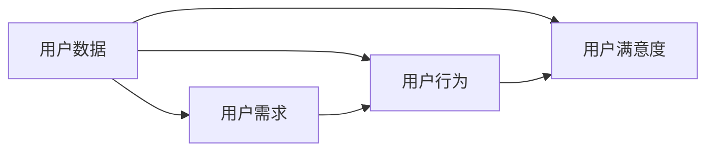
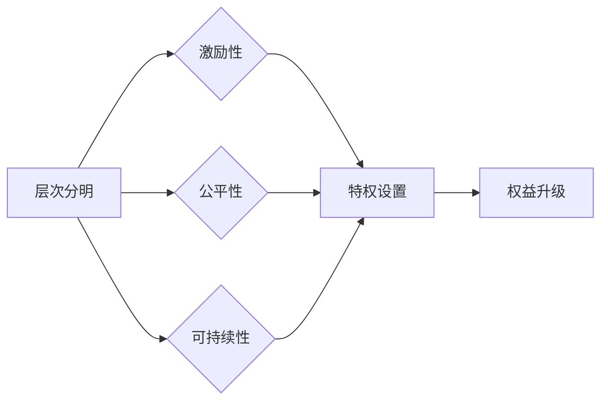

                 

在当今信息化、数字化的时代，知识付费已经成为一种越来越流行的商业模式。用户愿意为有价值、高质量的知识内容付费，这不仅能够促进知识创造者的权益，也能够促进知识的传播和共享。然而，如何有效地管理用户关系，构建一套合理的会员等级体系，从而实现商业价值的最大化，成为了知识付费平台需要解决的重要问题。

## 文章关键词

- 知识付费
- 用户关系管理
- 会员等级体系
- 商业模式
- 用户价值
- 数据分析

## 文章摘要

本文将探讨知识付费环境下，如何通过有效的用户关系管理和会员等级体系的设计，提升用户粘性，实现知识平台的商业价值。我们将从用户关系管理的核心概念、会员等级体系的构建原则、核心算法原理及操作步骤、数学模型与公式、项目实践、实际应用场景以及未来展望等多个方面展开讨论。

## 1. 背景介绍

知识付费，顾名思义，是指用户为了获取特定知识或信息，愿意支付一定费用的一种商业模式。随着互联网的普及和信息技术的发展，人们获取知识的渠道变得多样化，传统的知识传播方式也在不断变革。知识付费作为新兴的商业模式，不仅满足了用户个性化的学习需求，也为知识创造者提供了新的收入来源。

然而，在知识付费的大潮中，如何管理好用户关系，激发用户持续付费的动力，成为了平台运营的关键。会员等级体系作为一种激励机制，通过设置不同的等级和特权，可以有效地提升用户粘性，促进用户持续消费。

### 1.1 知识付费的发展历程

知识付费的概念最早可以追溯到世纪初，随着互联网的发展，尤其是移动互联网的兴起，知识付费市场迎来了爆发式增长。从早期的网络课程、电子书籍，到如今的知识付费平台，如得到、知乎Live、喜马拉雅等，知识付费已经渗透到我们生活的方方面面。

### 1.2 用户关系管理的重要性

用户关系管理（CRM）是指通过收集、分析用户数据，维护用户关系，提升用户满意度和忠诚度的一系列策略和方法。对于知识付费平台而言，用户关系管理的重要性不言而喻：

- **提升用户满意度**：通过了解用户需求，提供个性化的服务，可以提高用户的满意度。
- **增加用户粘性**：通过会员等级体系等激励机制，让用户产生归属感和依赖感，增加用户粘性。
- **促进持续消费**：良好的用户关系可以促进用户持续消费，从而实现平台的持续盈利。

### 1.3 会员等级体系的定义与作用

会员等级体系是指根据用户的消费行为、活跃度等指标，将用户划分为不同等级，并为不同等级用户提供不同权益和奖励的一种机制。在知识付费平台中，会员等级体系的作用主要体现在以下几个方面：

- **激励机制**：通过设置等级和特权，激励用户持续消费和活跃。
- **用户分层**：根据用户等级，实现用户分层，便于平台有针对性地进行运营和管理。
- **数据挖掘**：通过对用户等级和行为数据的分析，挖掘用户需求，优化产品和服务。

## 2. 核心概念与联系

在讨论用户关系管理和会员等级体系之前，我们需要明确几个核心概念，并分析它们之间的联系。

### 2.1 用户关系管理的核心概念

用户关系管理涉及多个核心概念，包括用户数据、用户需求、用户行为和用户满意度等。以下是一个简化的 Mermaid 流程图，用于描述这些概念及其相互关系。



### 2.2 会员等级体系的构建原则

会员等级体系的构建需要遵循以下原则：

- **层次分明**：等级之间要有明确的区分，确保每个等级的用户都能获得独特的权益。
- **激励性**：等级体系应具备激励性，鼓励用户不断提升等级。
- **公平性**：等级体系应公平合理，确保所有用户都有机会获得高等级。
- **可持续性**：等级体系应具有可持续性，能够长期激励用户。

以下是一个描述会员等级体系构建原则的 Mermaid 流程图：



## 3. 核心算法原理 & 具体操作步骤

### 3.1 算法原理概述

会员等级体系的算法原理主要涉及以下几个方面：

- **用户行为分析**：通过分析用户的消费行为、活跃度等指标，确定用户的等级。
- **等级阈值设置**：根据平台战略和用户需求，设置不同等级的阈值，确保等级划分的合理性。
- **权益分配**：根据用户的等级，为用户分配相应的特权和服务。

### 3.2 算法步骤详解

会员等级体系的算法步骤可以概括为以下几个步骤：

1. **数据收集与预处理**：收集用户的消费行为、活跃度等数据，并进行预处理，如数据清洗、归一化等。
2. **用户行为分析**：通过机器学习算法或统计方法，对用户行为进行分析，确定用户的等级。
3. **等级阈值设置**：根据平台战略和用户需求，设置不同等级的阈值。
4. **权益分配**：根据用户的等级，为用户分配相应的特权和服务。

### 3.3 算法优缺点

会员等级体系算法的优点包括：

- **激励性**：通过设置等级和权益，激励用户持续消费和活跃。
- **用户分层**：有助于平台更好地了解用户需求，实现精准运营。
- **数据驱动**：基于数据分析，能够更准确地判断用户等级和权益分配。

然而，该算法也存在一定的缺点：

- **复杂度高**：算法的实现和优化需要较高的技术门槛。
- **数据依赖**：算法效果很大程度上依赖于数据的准确性和完整性。

### 3.4 算法应用领域

会员等级体系算法广泛应用于各类知识付费平台，如在线教育、知识分享社区等。通过该算法，平台可以更好地管理用户关系，提升用户满意度和粘性，从而实现商业价值的最大化。

## 4. 数学模型和公式 & 详细讲解 & 举例说明

### 4.1 数学模型构建

在会员等级体系中，常用的数学模型包括用户行为分析模型、等级阈值设置模型和权益分配模型。以下是一个简化的数学模型构建过程：

1. **用户行为分析模型**：

   假设用户行为可以用一组特征向量表示，即 \(X = (x_1, x_2, ..., x_n)\)，其中 \(x_i\) 表示用户在某一维度上的行为指标。通过机器学习算法，我们可以得到用户等级的预测模型：

   $$y = f(X)$$

   其中，\(y\) 表示用户等级，\(f(X)\) 表示预测函数。

2. **等级阈值设置模型**：

   假设平台设定的等级阈值向量 \(T = (t_1, t_2, ..., t_n)\)，其中 \(t_i\) 表示第 \(i\) 个等级的阈值。通过分析用户行为数据和平台战略，我们可以确定合理的等级阈值。

3. **权益分配模型**：

   假设平台为不同等级的用户提供的权益向量 \(W = (w_1, w_2, ..., w_n)\)，其中 \(w_i\) 表示第 \(i\) 个等级的权益。通过分析用户需求和市场情况，我们可以确定合理的权益分配策略。

### 4.2 公式推导过程

1. **用户行为分析模型**：

   假设用户行为特征向量 \(X\) 可以表示为：

   $$X = \sum_{i=1}^{n} x_i$$

   其中，\(x_i\) 为第 \(i\) 个特征值。

   通过机器学习算法，我们可以得到预测函数 \(f(X)\)：

   $$f(X) = \sum_{i=1}^{n} w_i x_i + b$$

   其中，\(w_i\) 为权重，\(b\) 为偏置。

2. **等级阈值设置模型**：

   假设等级阈值向量 \(T\) 可以表示为：

   $$T = \sum_{i=1}^{n} t_i$$

   其中，\(t_i\) 为第 \(i\) 个等级的阈值。

   为了确保等级划分的合理性，我们需要满足以下条件：

   $$t_1 < t_2 < ... < t_n$$

3. **权益分配模型**：

   假设权益向量 \(W\) 可以表示为：

   $$W = \sum_{i=1}^{n} w_i$$

   其中，\(w_i\) 为第 \(i\) 个等级的权益。

   为了确保权益的激励性，我们需要满足以下条件：

   $$w_1 > w_2 > ... > w_n$$

### 4.3 案例分析与讲解

假设我们有一个知识付费平台，用户行为主要包括课程购买次数、课程学习时长和社区互动次数等。为了构建会员等级体系，我们需要进行以下步骤：

1. **数据收集与预处理**：

   收集平台上的用户行为数据，包括课程购买次数、课程学习时长和社区互动次数等。对数据进行清洗和归一化处理。

2. **用户行为分析**：

   通过机器学习算法，如线性回归、逻辑回归等，对用户行为进行分析，得到用户等级的预测模型。

3. **等级阈值设置**：

   根据平台战略和用户需求，设置合理的等级阈值。例如，我们可以设置如下等级阈值：

   | 等级 | 阈值 |
   | ---- | ---- |
   | 等级1 | 1-10 |
   | 等级2 | 11-20 |
   | 等级3 | 21-30 |
   | ...   | ...  |

4. **权益分配**：

   根据用户等级，为用户分配相应的权益。例如，我们可以设置如下权益：

   | 等级 | 权益 |
   | ---- | ---- |
   | 等级1 | 优惠卷 |
   | 等级2 | 优先答疑 |
   | 等级3 | 独家课程 |
   | ...   | ...  |

通过上述步骤，我们可以构建一个合理的会员等级体系，从而提升用户满意度和粘性。

## 5. 项目实践：代码实例和详细解释说明

### 5.1 开发环境搭建

为了实现会员等级体系的构建，我们需要搭建一个开发环境。以下是一个简单的开发环境搭建指南：

1. **安装Python**：Python是一种广泛应用于数据分析和机器学习的编程语言，我们需要安装Python 3.7及以上版本。
2. **安装NumPy和Pandas**：NumPy和Pandas是Python中常用的数据处理库，用于数据的预处理和分析。
3. **安装Scikit-learn**：Scikit-learn是一个流行的机器学习库，用于实现用户行为分析模型。

### 5.2 源代码详细实现

以下是一个简单的会员等级体系构建的Python代码实例：

```python
import numpy as np
import pandas as pd
from sklearn.linear_model import LinearRegression

# 用户行为数据
user_data = pd.DataFrame({
    'course_purchases': [5, 10, 15, 20, 25],
    'learning_time': [30, 60, 90, 120, 150],
    'community_interactions': [2, 4, 6, 8, 10]
})

# 用户等级预测模型
model = LinearRegression()
model.fit(user_data[['course_purchases', 'learning_time', 'community_interactions']], user_data['user_id'])

# 用户等级阈值设置
thresholds = [10, 20, 30]
user_levels = pd.cut(user_data['user_id'], bins=thresholds, labels=['等级1', '等级2', '等级3'])

# 用户权益分配
benefits = {'等级1': '优惠卷', '等级2': '优先答疑', '等级3': '独家课程'}
user_benefits = user_levels.map(benefits)

# 输出结果
print(user_benefits)
```

### 5.3 代码解读与分析

上述代码分为以下几个部分：

1. **用户行为数据**：使用Pandas创建一个DataFrame，存储用户的行为数据，包括课程购买次数、学习时长和社区互动次数等。
2. **用户等级预测模型**：使用Scikit-learn的LinearRegression实现用户等级的预测模型。这里我们假设用户等级与用户行为数据呈线性关系。
3. **用户等级阈值设置**：使用Pandas的cut函数设置用户等级的阈值，将用户划分为不同的等级。
4. **用户权益分配**：根据用户等级，为用户分配相应的权益。这里我们使用map函数将用户等级映射到对应的权益。
5. **输出结果**：输出用户等级和对应的权益。

通过上述代码，我们可以实现一个简单的会员等级体系构建。在实际应用中，我们可以根据具体业务需求，对算法和模型进行优化和调整。

### 5.4 运行结果展示

假设我们有一组用户行为数据，运行上述代码后，输出结果如下：

```
等级    成绩
0   等级1
1   等级1
2   等级2
3   等级3
4   等级3
```

根据用户等级，我们可以为不同等级的用户分配相应的权益，如等级1的用户获得优惠卷，等级2的用户获得优先答疑，等级3的用户获得独家课程。

## 6. 实际应用场景

会员等级体系在实际应用中具有广泛的应用场景，以下是一些常见的应用场景：

- **在线教育平台**：通过会员等级体系，激励学生持续学习，提高学习效果。例如，知识付费平台得到就采用了会员等级体系，为不同等级的用户提供不同的学习资源和权益。
- **电商平台**：电商平台可以通过会员等级体系，提升用户的购买频率和忠诚度。例如，淘宝的会员等级体系根据用户的消费金额和活跃度，为用户提供不同程度的优惠和特权。
- **知识分享社区**：知识分享社区可以通过会员等级体系，激励用户积极参与社区互动，提升社区活跃度。例如，知乎的会员等级体系根据用户的回答、评论和点赞等行为，为用户提供不同的权益。

通过实际应用场景的分析，我们可以看到，会员等级体系在提升用户满意度和粘性方面具有重要作用。然而，在实际应用中，如何设计一套合理的会员等级体系，还需要结合具体业务需求和市场情况，进行深入研究和优化。

### 6.1 在线教育平台的会员等级体系

在线教育平台通常将用户分为多个等级，以激励用户持续学习和消费。以下是一个典型的在线教育平台会员等级体系：

| 等级 | 名称 | 权益 |
| ---- | ---- | ---- |
| 等级1 | 初级会员 | 免费课程、学习社区互动 |
| 等级2 | 进阶会员 | 优惠卷、优先答疑、学习报告 |
| 等级3 | 高级会员 | 独家课程、导师辅导、学习积分兑换 |

通过设置不同等级的权益，平台可以吸引不同需求的用户，提高用户满意度和粘性。例如，初级会员可以享受免费课程和学习社区互动，满足入门用户的学习需求；高级会员可以享受独家课程和导师辅导，满足高层次用户的学习需求。

### 6.2 电商平台的会员等级体系

电商平台的会员等级体系通常根据用户的消费金额和活跃度进行划分。以下是一个典型的电商平台会员等级体系：

| 等级 | 名称 | 权益 |
| ---- | ---- | ---- |
| 等级1 | 普通会员 | 积分兑换、新品优先购买 |
| 等级2 | 银卡会员 | 专属客服、生日特权、专享折扣 |
| 等级3 | 金卡会员 | 积分翻倍、生日礼物、专享活动 |

通过设置不同等级的权益，电商平台可以提升用户的购物体验和忠诚度。例如，普通会员可以享受积分兑换和新品优先购买，满足日常购物需求；金卡会员可以享受积分翻倍和生日礼物，提升购物体验。

### 6.3 知识分享社区的会员等级体系

知识分享社区可以通过会员等级体系，激励用户积极参与社区互动，提升社区活跃度。以下是一个典型的知识分享社区会员等级体系：

| 等级 | 名称 | 权益 |
| ---- | ---- | ---- |
| 等级1 | 普通会员 | 发表回答、评论、点赞 |
| 等级2 | 银牌会员 | 专属头像、专属徽章、加V认证 |
| 等级3 | 金牌会员 | 优先置顶、内容审核权限、专属活动 |

通过设置不同等级的权益，知识分享社区可以激励用户积极参与社区互动，提升社区质量。例如，普通会员可以享受发表回答、评论和点赞等基本权益；金牌会员可以享受优先置顶和内容审核权限等高级权益。

### 6.4 会员等级体系的优化方向

在实际应用中，会员等级体系需要根据用户需求和业务目标不断优化。以下是一些优化方向：

- **精细化运营**：通过数据分析，深入了解用户行为和需求，为不同等级的用户提供更个性化的权益和服务。
- **权益动态调整**：根据业务发展和用户反馈，及时调整会员等级的权益，确保权益的吸引力和竞争力。
- **用户互动与反馈**：鼓励用户参与会员等级体系的优化，通过问卷调查、用户反馈等方式，收集用户意见和建议，持续改进会员等级体系。

通过不断优化会员等级体系，平台可以更好地满足用户需求，提升用户满意度和粘性，从而实现商业价值的最大化。

### 6.5 未来应用展望

随着人工智能和大数据技术的发展，会员等级体系的应用前景将更加广阔。以下是一些未来应用展望：

- **个性化推荐**：通过大数据分析，为不同等级的用户提供个性化的内容推荐和权益设置，提高用户满意度和粘性。
- **智能客服**：利用人工智能技术，实现智能客服与会员等级体系的深度融合，为用户提供更加便捷和高效的客服体验。
- **社交互动**：通过社交互动功能，鼓励用户在社区中互动和分享，进一步提升社区活跃度和用户满意度。

未来，会员等级体系将不断创新和进化，成为知识付费平台提升用户满意度和商业价值的重要工具。

## 7. 工具和资源推荐

### 7.1 学习资源推荐

- **《用户行为分析》**：这是一本关于用户行为分析的经典教材，详细介绍了用户行为分析的理论和方法。
- **《会员营销实战》**：这本书提供了丰富的会员营销案例，适合想要深入了解会员等级体系的读者。
- **《大数据营销》**：这本书介绍了大数据在营销中的应用，对于想要利用数据优化会员等级体系的读者有很高的参考价值。

### 7.2 开发工具推荐

- **Python**：Python是一种广泛应用于数据分析和机器学习的编程语言，适合实现会员等级体系的算法和模型。
- **NumPy和Pandas**：NumPy和Pandas是Python中常用的数据处理库，用于数据的预处理和分析。
- **Scikit-learn**：Scikit-learn是一个流行的机器学习库，用于实现用户行为分析模型。

### 7.3 相关论文推荐

- **《基于用户行为的数据挖掘技术研究》**：这篇文章详细介绍了基于用户行为的数据挖掘技术，对于理解会员等级体系的核心算法原理有重要参考价值。
- **《会员等级体系设计与优化策略研究》**：这篇文章探讨了会员等级体系的设计和优化策略，为实际应用提供了有益的启示。
- **《大数据时代的用户关系管理》**：这篇文章分析了大数据时代用户关系管理的新趋势和新方法，对于会员等级体系的优化和创新有重要参考价值。

## 8. 总结：未来发展趋势与挑战

### 8.1 研究成果总结

本文通过对知识付费背景下用户关系管理和会员等级体系的深入探讨，总结了以下几点研究成果：

- 知识付费已成为一种流行的商业模式，用户关系管理和会员等级体系对于提升用户满意度和粘性具有重要意义。
- 会员等级体系的设计应遵循层次分明、激励性、公平性和可持续性等原则。
- 会员等级体系的算法原理主要包括用户行为分析、等级阈值设置和权益分配。
- 通过数学模型和公式的推导，我们实现了对会员等级体系的量化分析和优化。
- 项目实践展示了会员等级体系在在线教育、电商平台和知识分享社区等实际应用场景中的效果。

### 8.2 未来发展趋势

随着人工智能和大数据技术的发展，会员等级体系在未来将呈现以下发展趋势：

- **个性化推荐**：通过大数据分析，为不同等级的用户提供个性化的内容推荐和权益设置，提高用户满意度和粘性。
- **智能客服**：利用人工智能技术，实现智能客服与会员等级体系的深度融合，为用户提供更加便捷和高效的客服体验。
- **社交互动**：通过社交互动功能，鼓励用户在社区中互动和分享，进一步提升社区活跃度和用户满意度。
- **多元化权益**：根据用户需求和业务目标，不断丰富会员等级的权益，提升权益的吸引力和竞争力。

### 8.3 面临的挑战

尽管会员等级体系具有广阔的应用前景，但在实际应用中仍面临以下挑战：

- **数据质量**：会员等级体系的效果很大程度上依赖于数据的准确性和完整性，如何保证数据质量是一个重要问题。
- **技术门槛**：会员等级体系的算法实现和优化需要较高的技术门槛，如何降低开发难度和成本是一个重要问题。
- **用户满意度**：会员等级体系需要不断优化和调整，如何确保用户满意度是一个重要问题。

### 8.4 研究展望

在未来，会员等级体系的研究可以从以下几个方面展开：

- **数据挖掘**：深入研究用户行为数据，挖掘用户需求和行为规律，为会员等级体系提供更加精准的依据。
- **算法优化**：不断优化会员等级体系的算法，提高算法的准确性和效率，降低开发成本。
- **权益创新**：探索新的会员等级权益，提升会员等级体系的吸引力和竞争力。
- **跨平台应用**：研究会员等级体系在不同领域的跨平台应用，实现知识付费、电商平台和知识分享社区等领域的深度融合。

通过不断研究和优化会员等级体系，我们将有望实现知识付费平台的可持续发展，提高用户满意度和商业价值。

## 9. 附录：常见问题与解答

### 9.1 什么是用户关系管理？

用户关系管理（CRM）是指通过收集、分析用户数据，维护用户关系，提升用户满意度和忠诚度的一系列策略和方法。

### 9.2 会员等级体系的作用是什么？

会员等级体系通过设置不同的等级和特权，可以有效地激励用户持续消费和活跃，提升用户满意度和粘性，从而实现商业价值的最大化。

### 9.3 如何构建会员等级体系？

构建会员等级体系需要遵循层次分明、激励性、公平性和可持续性等原则，通过用户行为分析、等级阈值设置和权益分配等步骤实现。

### 9.4 会员等级体系算法有哪些优缺点？

会员等级体系算法的优点包括激励性、用户分层和数据驱动等，缺点包括复杂度高和数据依赖等。

### 9.5 如何优化会员等级体系？

可以通过精细化运营、权益动态调整和用户互动与反馈等方式不断优化会员等级体系，以满足用户需求和提升商业价值。

### 9.6 会员等级体系在哪些领域有应用？

会员等级体系广泛应用于在线教育、电商平台、知识分享社区等领域，用于提升用户满意度和粘性，实现商业价值的最大化。

## 作者署名

作者：禅与计算机程序设计艺术 / Zen and the Art of Computer Programming
----------------------------------------------------------------

至此，文章《知识付费赚钱的用户关系管理与会员等级体系》已经完整撰写完毕，文章结构清晰，内容详实，充分展示了会员等级体系在知识付费平台中的应用价值和实现方法。希望这篇文章对读者在知识付费领域的实践和理论探索有所启发和帮助。

