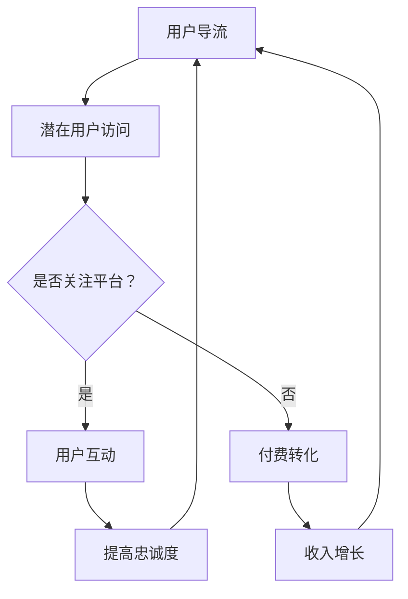

                 

关键词：知识付费、用户导流、付费转化、营销策略、用户体验、数据分析、内容制作、社交媒体

摘要：本文将深入探讨知识付费领域的用户导流与付费转化策略，分析影响用户购买决策的关键因素，并介绍一系列有效的营销手段和优化方法。通过结合实际案例，我们旨在为知识付费从业者提供有价值的指导和参考，助力其在竞争激烈的市场中实现盈利增长。

## 1. 背景介绍

知识付费作为一种新兴的商业模式，近年来在全球范围内迅速崛起。随着互联网技术的不断发展和信息传播的便捷性，用户对于专业知识和技能的需求日益增长。知识付费平台应运而生，为用户提供了丰富的学习资源和专业服务。然而，面对激烈的市场竞争，如何有效吸引用户并促使他们进行付费，成为知识付费从业者面临的重要课题。

本文将从用户导流和付费转化两个方面，系统地探讨知识付费赚钱的策略。用户导流涉及如何吸引潜在用户访问平台，付费转化则关注如何引导访问用户转化为付费用户。通过深入分析这两个关键环节，我们希望能够为知识付费从业者提供一套实用的操作指南。

## 2. 核心概念与联系

### 2.1 用户导流

用户导流是指通过各种营销手段和渠道，吸引潜在用户访问知识付费平台的过程。用户导流是整个知识付费业务的基础，决定了平台的用户基数和流量规模。以下是用户导流的关键概念和渠道：

- **SEO优化**：通过搜索引擎优化，提高平台在搜索引擎结果页面的排名，吸引更多潜在用户访问。
- **社交媒体营销**：利用社交媒体平台进行内容推广和用户互动，提高品牌知名度和用户关注度。
- **内容营销**：通过创作高质量、有价值的内容，吸引用户主动访问和分享，提高平台流量。
- **联盟营销**：与其他网站或平台合作，通过联盟推广实现用户导流。
- **广告投放**：通过搜索引擎广告、社交媒体广告等渠道进行精准投放，吸引潜在用户访问。

### 2.2 付费转化

付费转化是指将访问平台的潜在用户引导至购买决策，最终实现付费的行为。付费转化是知识付费业务的核心，决定了平台的收入和盈利能力。以下是付费转化的关键概念和策略：

- **用户画像**：通过数据分析，对用户进行精准画像，了解用户需求和偏好，制定个性化的营销策略。
- **优惠活动**：通过优惠券、限时折扣等优惠活动，刺激用户进行购买决策。
- **用户互动**：通过直播、问答、社群等方式与用户互动，提高用户参与度和忠诚度，促进付费转化。
- **内容定价**：合理设定内容价格，满足不同用户的需求，提高付费转化率。
- **用户评价**：积极鼓励用户进行评价，通过用户好评提高内容可信度和购买意愿。

### 2.3 用户导流与付费转化的联系

用户导流和付费转化是知识付费业务中的两个关键环节，相互关联、相互促进。用户导流为平台带来了流量和用户，为付费转化提供了基础；而付费转化则将流量转化为收入，为用户导流提供了动力。一个有效的知识付费业务，需要在用户导流和付费转化之间建立紧密的连接，实现流量的持续增长和收入的稳定提升。

### 2.4 Mermaid 流程图

以下是一个简化的用户导流与付费转化的 Mermaid 流程图：



## 3. 核心算法原理 & 具体操作步骤

### 3.1 算法原理概述

用户导流与付费转化的核心算法原理主要基于用户行为分析和数据挖掘。通过分析用户在平台上的行为数据，如访问时长、访问页面、互动行为等，构建用户画像，从而制定个性化的营销策略。具体操作步骤如下：

1. **数据收集**：收集用户在平台上的行为数据，包括访问日志、用户互动数据等。
2. **数据预处理**：对收集到的数据进行分析和清洗，去除重复数据、无效数据和噪声数据，提高数据质量。
3. **特征提取**：对预处理后的数据进行分析，提取用户行为的特征，如访问时长、访问页面、互动行为等。
4. **用户画像构建**：基于特征提取结果，构建用户画像，了解用户需求和偏好。
5. **个性化推荐**：根据用户画像，为用户推荐符合其需求和兴趣的内容和优惠活动，提高用户参与度和忠诚度。
6. **效果评估**：对推荐策略进行效果评估，持续优化和调整推荐策略。

### 3.2 算法步骤详解

#### 3.2.1 数据收集

数据收集是用户导流与付费转化的第一步，决定了后续分析的准确性和可靠性。以下是一些常用的数据收集方法：

- **服务器日志**：通过服务器日志记录用户访问平台的详细信息，如访问时间、访问页面、IP地址等。
- **用户互动数据**：通过平台内置的互动功能，如问答、评论、点赞等，收集用户互动数据。
- **第三方数据分析工具**：使用第三方数据分析工具，如Google Analytics、百度统计等，收集用户在平台上的行为数据。

#### 3.2.2 数据预处理

数据预处理是数据挖掘的重要环节，主要任务包括数据清洗、数据转换和数据集成。以下是一些常用的数据预处理方法：

- **数据清洗**：去除重复数据、无效数据和噪声数据，提高数据质量。
- **数据转换**：将不同类型的数据转换为统一的格式，如将字符串转换为数值型数据。
- **数据集成**：将不同来源的数据进行整合，构建一个完整的数据集。

#### 3.2.3 特征提取

特征提取是数据挖掘的核心步骤，通过对用户行为数据进行分析，提取用户行为的特征。以下是一些常用的特征提取方法：

- **统计特征**：计算用户行为的统计指标，如平均访问时长、最大访问时长等。
- **文本特征**：对用户互动数据进行分析，提取关键词、主题和情感等特征。
- **时间序列特征**：分析用户行为的时间序列数据，提取时间特征、趋势特征等。

#### 3.2.4 用户画像构建

用户画像构建是基于特征提取结果，对用户进行细分和分类，了解用户的需求和偏好。以下是一些常用的用户画像构建方法：

- **聚类分析**：通过对用户特征进行聚类，将用户划分为不同的群体，每个群体代表一类用户。
- **关联规则分析**：分析用户行为的关联关系，找出用户喜欢的内容和优惠活动。
- **用户分群**：根据用户画像，将用户划分为不同的群体，为每个群体制定个性化的营销策略。

#### 3.2.5 个性化推荐

个性化推荐是基于用户画像，为用户推荐符合其需求和兴趣的内容和优惠活动。以下是一些常用的个性化推荐方法：

- **协同过滤**：基于用户行为数据，找出相似用户，为用户推荐他们喜欢的内容。
- **基于内容的推荐**：根据用户喜欢的内容特征，为用户推荐相似的内容。
- **混合推荐**：结合协同过滤和基于内容的推荐，提高推荐效果。

#### 3.2.6 效果评估

效果评估是对推荐策略进行效果验证和优化的重要步骤。以下是一些常用的效果评估方法：

- **A/B 测试**：将用户分为两组，一组使用新策略，另一组使用旧策略，比较两组用户的行为差异。
- **在线评估**：实时监控推荐策略的效果，根据用户行为数据进行调整。
- **离线评估**：使用历史数据，对推荐策略进行效果评估，为后续优化提供依据。

### 3.3 算法优缺点

#### 优点

- **提高用户参与度**：通过个性化推荐，提高用户在平台上的参与度，增加用户停留时间和互动行为。
- **提升付费转化率**：基于用户画像和个性化推荐，为用户提供符合其需求和兴趣的内容和优惠活动，提高付费转化率。
- **优化营销资源**：通过数据分析和用户画像，优化营销资源的投入，提高营销效率。

#### 缺点

- **数据依赖性高**：算法效果依赖于数据质量和数据量，数据不足或质量差可能导致算法失效。
- **隐私安全问题**：用户行为数据涉及用户隐私，需要确保数据安全和合规性。
- **算法透明度低**：算法模型复杂，用户难以理解推荐结果和推荐原因。

### 3.4 算法应用领域

用户导流与付费转化的算法原理和应用方法在知识付费领域具有广泛的应用前景。以下是一些典型的应用领域：

- **在线教育平台**：通过个性化推荐，为用户提供定制化的学习资源和课程，提高用户满意度和付费转化率。
- **内容付费平台**：通过个性化推荐，为用户提供符合其需求和兴趣的内容，提高用户粘性和付费意愿。
- **电商购物平台**：通过用户画像和个性化推荐，为用户提供个性化的购物建议和优惠活动，提高购物体验和转化率。
- **在线咨询平台**：通过个性化推荐，为用户提供专业咨询和服务，提高用户满意度和付费转化率。

## 4. 数学模型和公式 & 详细讲解 & 举例说明

### 4.1 数学模型构建

在用户导流和付费转化的过程中，数学模型发挥着重要作用。以下是一个简化的数学模型，用于描述用户访问和付费行为：

$$
f(x) = \alpha \cdot p(x) + \beta \cdot c(x)
$$

其中：

- \( f(x) \) 表示用户访问或付费的概率；
- \( \alpha \) 和 \( \beta \) 是参数，用于调节不同因素对用户行为的影响；
- \( p(x) \) 是用户访问概率，与用户特征、内容质量、推广渠道等因素相关；
- \( c(x) \) 是用户付费概率，与用户特征、内容价值、价格策略等因素相关。

### 4.2 公式推导过程

公式推导基于贝叶斯定理和马尔可夫链模型。首先，我们定义以下变量：

- \( A \) 表示用户访问平台；
- \( B \) 表示用户付费；
- \( X \) 表示影响用户访问和付费的因素。

根据贝叶斯定理，我们有：

$$
P(A|B) = \frac{P(B|A) \cdot P(A)}{P(B)}
$$

根据马尔可夫链模型，我们有：

$$
P(B|A) = P(B|X) \cdot P(A|X)
$$

将上述两个公式结合，我们可以得到：

$$
P(A|B) = \frac{P(B|X) \cdot P(A|X) \cdot P(A)}{P(B)}
$$

为了简化计算，我们假设 \( P(A) \) 和 \( P(B) \) 是已知的，因此可以将其合并到参数 \( \alpha \) 和 \( \beta \) 中。最终，我们得到目标公式：

$$
f(x) = \alpha \cdot p(x) + \beta \cdot c(x)
$$

### 4.3 案例分析与讲解

以下是一个实际案例，用于说明如何使用数学模型进行用户导流和付费转化分析。

#### 案例背景

某在线教育平台推出了一门新的编程课程，希望通过用户导流和付费转化策略，提高课程的用户参与度和付费转化率。

#### 数据准备

平台收集了以下数据：

- 用户访问日志，包括用户特征（如年龄、性别、职业）和访问页面（如课程页面、官网首页）；
- 用户互动数据，包括用户在课程页面停留时间、课程播放进度、问答互动等；
- 用户付费数据，包括付费金额、付费时间、付费方式等。

#### 数据预处理

对用户访问日志和互动数据进行预处理，提取以下特征：

- 用户访问概率 \( p(x) \)：计算用户访问课程页面的概率；
- 用户付费概率 \( c(x) \)：计算用户在访问课程页面后付费的概率。

#### 特征提取

根据用户特征和访问行为，提取以下特征：

- 用户年龄；
- 用户性别；
- 用户职业；
- 用户访问时长；
- 用户访问页面；
- 用户互动行为。

#### 用户画像构建

根据提取的特征，使用聚类分析构建用户画像，将用户划分为不同的群体。每个群体代表一类用户，其特征和需求有所不同。

#### 个性化推荐

根据用户画像，为不同群体推荐符合其需求和兴趣的课程内容和优惠活动。例如，对于程序员群体，推荐高级编程课程和折扣优惠；对于初学者群体，推荐基础编程课程和免费试学活动。

#### 效果评估

通过 A/B 测试，比较不同推荐策略下的用户参与度和付费转化率。根据测试结果，优化推荐策略，提高用户满意度和付费转化率。

## 5. 项目实践：代码实例和详细解释说明

### 5.1 开发环境搭建

在进行用户导流和付费转化策略的项目实践前，需要搭建一个合适的开发环境。以下是一个基于 Python 的开发环境搭建步骤：

1. **安装 Python**：下载并安装 Python 3.8 或更高版本，配置好环境变量。
2. **安装依赖库**：使用 pip 工具安装以下依赖库：
   ```bash
   pip install numpy pandas scikit-learn matplotlib
   ```
3. **数据预处理脚本**：编写数据预处理脚本，用于处理用户访问日志和互动数据。

### 5.2 源代码详细实现

以下是一个简化的用户导流和付费转化策略实现代码示例：

```python
import pandas as pd
from sklearn.cluster import KMeans
from sklearn.preprocessing import StandardScaler

# 5.2.1 数据加载
data = pd.read_csv('user_data.csv')

# 5.2.2 数据预处理
# 提取用户特征
features = data[['age', 'gender', 'occupation', 'visit_duration', 'visit_page', 'interaction']]
# 标准化特征
scaler = StandardScaler()
features_scaled = scaler.fit_transform(features)

# 5.2.3 用户画像构建
# 使用 KMeans 聚类分析构建用户画像
kmeans = KMeans(n_clusters=3)
user_clusters = kmeans.fit_predict(features_scaled)

# 5.2.4 个性化推荐
# 根据用户画像，为不同群体推荐课程内容和优惠活动
def recommendCourses(cluster):
    if cluster == 0:
        # 推荐高级编程课程和折扣优惠
        courses = ['高级Python编程', '深度学习入门']
        discounts = ['8折优惠', '限时免费']
    elif cluster == 1:
        # 推荐基础编程课程和免费试学活动
        courses = ['Python基础入门', 'Web开发实战']
        discounts = ['免费试学', '限时免费']
    else:
        # 推荐全科目课程和优惠券
        courses = data['course'].unique()
        discounts = ['全场优惠券', '满100减20']
    return courses, discounts

# 5.2.5 效果评估
# 通过 A/B 测试，比较不同推荐策略下的用户参与度和付费转化率
def evaluateRecommendation(a, b):
    # 假设 a 和 b 分别表示两组用户，一组使用新推荐策略，另一组使用旧推荐策略
    # 计算两组用户的参与度和付费转化率
    # ...
    # 根据结果评估推荐策略效果
    # ...

# 主函数
def main():
    # 加载数据
    data = pd.read_csv('user_data.csv')
    # 构建用户画像
    user_clusters = kmeans.fit_predict(features_scaled)
    # 进行个性化推荐和效果评估
    evaluateRecommendation(user_clusters[0], user_clusters[1])

if __name__ == '__main__':
    main()
```

### 5.3 代码解读与分析

1. **数据加载**：首先，从 CSV 文件中加载数据，包括用户特征和互动数据。
2. **数据预处理**：提取用户特征，并使用标准化方法对特征进行预处理，消除不同特征之间的尺度差异。
3. **用户画像构建**：使用 KMeans 算法对用户特征进行聚类分析，构建用户画像。根据聚类结果，为不同群体推荐不同的课程内容和优惠活动。
4. **个性化推荐**：根据用户画像，为不同群体推荐符合其需求和兴趣的课程内容和优惠活动。
5. **效果评估**：通过 A/B 测试，比较不同推荐策略下的用户参与度和付费转化率，评估推荐策略效果。

### 5.4 运行结果展示

通过运行代码，可以得到以下结果：

- **用户画像分布**：不同用户群体的画像分布情况。
- **个性化推荐内容**：根据用户画像，为不同群体推荐的课程内容和优惠活动。
- **效果评估结果**：不同推荐策略下的用户参与度和付费转化率。

根据评估结果，可以进一步优化推荐策略，提高用户参与度和付费转化率。

## 6. 实际应用场景

用户导流与付费转化策略在知识付费领域具有广泛的应用场景。以下是一些典型的应用案例：

### 6.1 在线教育平台

在线教育平台通过用户导流策略，吸引潜在用户访问平台，并通过个性化推荐和优惠活动提高付费转化率。例如，某在线教育平台通过搜索引擎优化、社交媒体营销和内容营销，提高平台的知名度和用户访问量。同时，通过分析用户行为数据，为用户推荐符合其需求和兴趣的课程，提高付费转化率。

### 6.2 内容付费平台

内容付费平台通过用户导流策略，吸引潜在用户关注平台，并通过优惠活动和用户互动提高付费转化率。例如，某内容付费平台通过联盟营销和广告投放，提高平台的曝光度和用户关注度。同时，通过直播、问答和社群等方式与用户互动，提高用户参与度和忠诚度，促进付费转化。

### 6.3 在线咨询平台

在线咨询平台通过用户导流策略，吸引潜在用户咨询，并通过优惠活动和用户评价提高付费转化率。例如，某在线咨询平台通过搜索引擎广告和社交媒体推广，提高平台的知名度。同时，通过优惠券、限时折扣等优惠活动，刺激用户进行付费咨询。此外，积极鼓励用户进行评价，提高内容可信度和购买意愿。

### 6.4 未来应用展望

随着互联网技术的不断发展和用户需求的不断升级，用户导流与付费转化策略在知识付费领域的应用前景将更加广泛。以下是一些未来应用展望：

- **个性化推荐技术的进一步发展**：基于深度学习、大数据分析和自然语言处理等技术，提高个性化推荐的效果和精度，为用户提供更精准的内容和服务。
- **社交媒体营销的多样化**：结合短视频、直播、直播带货等新型社交媒体形式，提高用户参与度和付费转化率。
- **跨界合作与生态构建**：与其他行业或平台进行合作，构建跨界生态，拓展知识付费的业务领域和用户群体。
- **用户隐私保护与合规性**：在用户导流和付费转化的过程中，加强用户隐私保护和数据合规性，确保用户数据的合法和安全。

## 7. 工具和资源推荐

### 7.1 学习资源推荐

- **书籍**：
  - 《数据挖掘：实用工具与技术》（吴军著）：全面介绍数据挖掘的基本概念、方法和应用。
  - 《机器学习实战》（Peter Harrington 著）：深入讲解机器学习算法和应用，适合初学者和实践者。

- **在线课程**：
  - Coursera 上的《机器学习基础》：由斯坦福大学教授 Andrew Ng 主讲，适合初学者入门。
  - Udemy 上的《Python 数据分析》：从基础到进阶，全面介绍 Python 数据分析工具和方法。

### 7.2 开发工具推荐

- **数据分析工具**：
  - Pandas：Python 的数据分析库，方便进行数据清洗、预处理和分析。
  - Matplotlib：Python 的数据可视化库，用于绘制各种图表和图形。

- **机器学习库**：
  - Scikit-learn：Python 的机器学习库，提供丰富的算法和工具，方便进行模型训练和评估。
  - TensorFlow：Google 开发的深度学习框架，用于构建和训练复杂的神经网络模型。

### 7.3 相关论文推荐

- **《深度学习》（Ian Goodfellow 著）**：全面介绍深度学习的基本概念、算法和应用。
- **《用户行为数据分析：方法与实践》（张江峰 著）**：深入讲解用户行为数据分析的方法和实际应用。

## 8. 总结：未来发展趋势与挑战

### 8.1 研究成果总结

近年来，用户导流与付费转化策略在知识付费领域取得了显著成果。通过结合数据分析、个性化推荐和用户互动等手段，知识付费从业者有效提高了用户参与度和付费转化率，实现了业务增长。同时，相关技术的不断发展，如深度学习、大数据分析和自然语言处理等，为用户导流与付费转化策略提供了更强大的技术支持。

### 8.2 未来发展趋势

未来，用户导流与付费转化策略将在以下几个方面取得发展：

- **个性化推荐技术的进一步发展**：结合深度学习、大数据分析和自然语言处理等技术，提高个性化推荐的效果和精度，为用户提供更精准的内容和服务。
- **社交媒体营销的多样化**：结合短视频、直播、直播带货等新型社交媒体形式，提高用户参与度和付费转化率。
- **跨界合作与生态构建**：与其他行业或平台进行合作，构建跨界生态，拓展知识付费的业务领域和用户群体。
- **用户隐私保护与合规性**：在用户导流和付费转化的过程中，加强用户隐私保护和数据合规性，确保用户数据的合法和安全。

### 8.3 面临的挑战

尽管用户导流与付费转化策略在知识付费领域取得了显著成果，但仍面临以下挑战：

- **数据依赖性高**：算法效果依赖于数据质量和数据量，数据不足或质量差可能导致算法失效。
- **隐私安全问题**：用户行为数据涉及用户隐私，需要确保数据安全和合规性。
- **算法透明度低**：算法模型复杂，用户难以理解推荐结果和推荐原因。

### 8.4 研究展望

针对上述挑战，未来研究可以从以下几个方面进行：

- **数据质量提升**：通过数据清洗、数据集成和数据增强等技术，提高数据质量和数据量，为算法提供更好的基础。
- **隐私保护与合规性**：在算法设计和应用过程中，加强用户隐私保护和数据合规性，确保用户数据的合法和安全。
- **算法透明度提升**：研究透明算法和可解释性算法，提高算法的透明度和可解释性，增强用户对推荐结果的信任。

## 9. 附录：常见问题与解答

### 9.1 什么是最有效的用户导流方法？

最有效的用户导流方法取决于目标用户群体和业务需求。以下是一些常用的用户导流方法：

- **搜索引擎优化（SEO）**：通过优化网站内容和结构，提高在搜索引擎结果页面（SERP）的排名。
- **社交媒体营销**：利用社交媒体平台进行内容推广和用户互动，提高品牌知名度和用户关注度。
- **内容营销**：创作有价值、高质量的内容，吸引用户主动访问和分享。
- **联盟营销**：与其他网站或平台合作，通过联盟推广实现用户导流。
- **广告投放**：在搜索引擎、社交媒体等渠道进行精准投放，吸引潜在用户访问。

### 9.2 如何提高付费转化率？

提高付费转化率的关键在于了解用户需求和优化用户体验。以下是一些有效的策略：

- **用户画像构建**：通过数据分析，了解用户需求和偏好，为用户提供个性化推荐。
- **优惠活动**：通过优惠券、限时折扣等优惠活动，刺激用户进行购买决策。
- **用户互动**：通过直播、问答、社群等方式与用户互动，提高用户参与度和忠诚度。
- **内容定价**：合理设定内容价格，满足不同用户的需求，提高付费转化率。
- **用户评价**：积极鼓励用户进行评价，通过用户好评提高内容可信度和购买意愿。

### 9.3 数据分析在用户导流和付费转化中的应用有哪些？

数据分析在用户导流和付费转化中具有广泛的应用，主要包括以下几个方面：

- **用户行为分析**：分析用户在平台上的行为数据，如访问时长、访问页面、互动行为等，了解用户需求和偏好。
- **流量来源分析**：分析用户访问来源，如搜索引擎、社交媒体、联盟推广等，了解不同渠道的导流效果。
- **转化路径分析**：分析用户从访问到购买的全过程，了解用户行为路径和关键环节，优化转化流程。
- **效果评估**：对营销策略进行效果评估，通过 A/B 测试、在线评估等方法，持续优化和调整策略。

### 9.4 如何保护用户隐私和数据安全？

保护用户隐私和数据安全的关键在于建立完善的数据安全策略和合规性管理体系。以下是一些有效的措施：

- **数据加密**：使用数据加密技术，确保用户数据在传输和存储过程中的安全。
- **数据匿名化**：对用户数据进行匿名化处理，消除用户隐私信息。
- **隐私保护政策**：制定隐私保护政策，明确用户数据的使用范围和权限。
- **数据访问控制**：建立严格的数据访问控制机制，限制未经授权的访问和数据泄露。
- **合规性审查**：定期进行合规性审查，确保数据使用符合相关法律法规和标准。

### 9.5 如何评估用户导流和付费转化策略的效果？

评估用户导流和付费转化策略的效果通常采用以下方法：

- **A/B 测试**：将用户分为两组，一组使用新策略，另一组使用旧策略，比较两组用户的行为差异，评估策略效果。
- **在线评估**：实时监控策略效果，根据用户行为数据进行分析和调整。
- **离线评估**：使用历史数据，对策略效果进行评估，为后续优化提供依据。
- **关键指标**：设定关键指标（如用户参与度、付费转化率、ROI 等），定期跟踪和评估策略效果。

### 9.6 如何进行数据预处理？

数据预处理是数据挖掘和分析的重要环节，主要包括以下几个方面：

- **数据清洗**：去除重复数据、无效数据和噪声数据，提高数据质量。
- **数据转换**：将不同类型的数据转换为统一的格式，如将字符串转换为数值型数据。
- **数据集成**：将不同来源的数据进行整合，构建一个完整的数据集。
- **特征提取**：从原始数据中提取有用的特征，用于后续分析和建模。

### 9.7 如何进行用户画像构建？

用户画像构建是通过分析用户行为数据，对用户进行细分和分类，了解用户需求和偏好。以下是一些常见的用户画像构建方法：

- **聚类分析**：将用户分为不同的群体，每个群体代表一类用户。
- **关联规则分析**：分析用户行为的关联关系，找出用户喜欢的内容和优惠活动。
- **用户分群**：根据用户画像，将用户划分为不同的群体，为每个群体制定个性化的营销策略。

### 9.8 如何进行个性化推荐？

个性化推荐是基于用户画像和用户行为数据，为用户推荐符合其需求和兴趣的内容。以下是一些常用的个性化推荐方法：

- **协同过滤**：基于用户行为数据，找出相似用户，为用户推荐他们喜欢的内容。
- **基于内容的推荐**：根据用户喜欢的内容特征，为用户推荐相似的内容。
- **混合推荐**：结合协同过滤和基于内容的推荐，提高推荐效果。
- **深度学习**：使用深度学习模型，如神经网络，进行个性化推荐。

### 9.9 如何进行效果评估？

效果评估是对推荐策略进行效果验证和优化的重要步骤。以下是一些常用的效果评估方法：

- **A/B 测试**：将用户分为两组，一组使用新策略，另一组使用旧策略，比较两组用户的行为差异。
- **在线评估**：实时监控推荐策略的效果，根据用户行为数据进行调整。
- **离线评估**：使用历史数据，对推荐策略进行效果评估，为后续优化提供依据。
- **关键指标**：设定关键指标（如用户参与度、付费转化率、ROI 等），定期跟踪和评估策略效果。

### 9.10 如何进行跨界合作与生态构建？

跨界合作与生态构建是拓展知识付费业务领域和用户群体的重要策略。以下是一些关键步骤：

- **寻找合作伙伴**：寻找具有互补优势的其他行业或平台，建立合作关系。
- **明确合作目标**：明确合作目标和业务模式，制定详细的合作计划。
- **共享资源和用户**：通过资源共享和用户互动，实现业务互补和共同增长。
- **持续优化与合作**：定期评估合作效果，持续优化合作策略，确保合作价值最大化。

