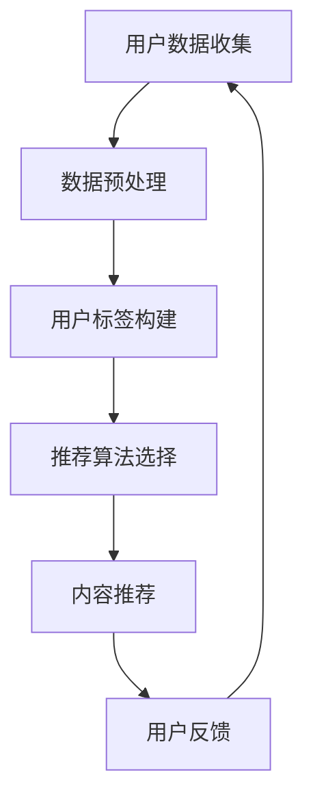

                 

 关键词：知识付费、用户标签、个性化推荐、算法、用户行为分析、商业模式

> 摘要：本文将深入探讨知识付费领域中的用户标签体系和个性化推荐策略，旨在通过分析用户行为数据，构建精准的用户标签，并利用这些标签进行高效的内容推荐，从而实现知识付费平台的盈利和用户满意度的提升。

## 1. 背景介绍

在数字化时代，知识付费逐渐成为主流，无论是线上课程、专业咨询还是付费问答，都吸引了大量用户。然而，随着用户需求的多样化和市场竞争的加剧，如何精准地满足用户需求，提高用户粘性，成为知识付费平台面临的重要问题。用户标签体系和个性化推荐策略在这一背景下显得尤为重要。

用户标签是一种对用户特征进行抽象和分类的工具，它可以帮助平台了解用户的基本属性和兴趣偏好。个性化推荐则基于用户标签和内容特征，为用户推荐最相关、最有价值的信息，从而提升用户满意度和留存率。

本文将从用户标签体系和个性化推荐策略的两个方面，详细分析知识付费领域的盈利模式和技术实现，为知识付费平台提供实用的指导和借鉴。

## 2. 核心概念与联系

### 2.1 用户标签体系

用户标签体系是构建个性化推荐系统的基础。它通过对用户行为的收集和分析，将用户划分为不同的标签群体，从而实现用户属性的精细化管理。

用户标签体系可以分为以下几类：

- **基础标签**：包括用户的性别、年龄、地理位置、职业等基本信息。
- **行为标签**：包括用户的浏览历史、购买记录、互动行为等。
- **兴趣标签**：通过对用户行为和内容偏好的分析，提取出用户的兴趣点，如科技、艺术、健康等。

### 2.2 个性化推荐策略

个性化推荐策略是基于用户标签和内容特征，为用户推荐最相关、最有价值的信息。其核心思想是利用机器学习和数据挖掘技术，从大量的用户行为数据和内容数据中，挖掘出用户的兴趣偏好，并将其应用到推荐系统中。

个性化推荐策略可以分为以下几类：

- **基于内容的推荐**：通过分析内容特征，为用户推荐相似的内容。
- **基于协同过滤的推荐**：通过分析用户的行为数据，挖掘出用户之间的相似性，为用户推荐相似的用户喜欢的内容。
- **基于模型的推荐**：利用机器学习算法，构建用户行为和兴趣的模型，为用户推荐最相关的内容。

### 2.3 Mermaid 流程图

以下是一个简化的用户标签体系和个性化推荐策略的 Mermaid 流程图：



## 3. 核心算法原理 & 具体操作步骤

### 3.1 算法原理概述

个性化推荐算法的核心是利用用户历史行为和内容特征，预测用户对特定内容的兴趣度，并根据预测结果生成推荐列表。

主要算法原理包括：

- **协同过滤**：通过分析用户行为数据，挖掘用户之间的相似性，为用户推荐其他用户喜欢的内容。
- **基于内容的推荐**：通过分析内容特征，为用户推荐相似的内容。
- **深度学习**：利用神经网络模型，从用户行为和内容数据中学习用户兴趣和偏好。

### 3.2 算法步骤详解

#### 3.2.1 用户行为数据收集

用户行为数据包括浏览记录、购买记录、互动行为等。这些数据可以通过日志文件、数据库等方式进行收集。

#### 3.2.2 数据预处理

数据预处理包括数据清洗、数据去重、数据格式转换等步骤。其目的是确保数据的质量和一致性。

#### 3.2.3 用户标签构建

基于用户行为数据，可以构建以下标签：

- **基础标签**：如性别、年龄、地理位置等。
- **行为标签**：如浏览历史、购买记录等。
- **兴趣标签**：如喜欢的内容类型、关注的话题等。

#### 3.2.4 推荐算法选择

根据业务需求和数据特点，可以选择以下推荐算法：

- **协同过滤算法**：如基于用户的协同过滤、基于项目的协同过滤等。
- **基于内容的推荐算法**：如TF-IDF、词向量等。
- **深度学习算法**：如卷积神经网络、循环神经网络等。

#### 3.2.5 内容推荐

根据用户标签和推荐算法，生成推荐列表。推荐列表可以根据相似度分数、推荐热度等进行排序。

#### 3.2.6 用户反馈

收集用户对推荐内容的反馈，用于优化推荐算法和用户标签。

### 3.3 算法优缺点

#### 优点：

- **提高用户满意度**：通过个性化推荐，为用户推荐最感兴趣的内容，提高用户满意度。
- **增加平台收益**：通过精准推荐，提高用户购买转化率，增加平台收益。
- **提高内容曝光度**：通过推荐算法，提高优质内容的曝光度，促进内容创作者的收入。

#### 缺点：

- **数据隐私问题**：个性化推荐算法需要收集用户行为数据，涉及用户隐私问题。
- **算法偏差**：推荐算法可能存在算法偏差，导致推荐结果不公平。

### 3.4 算法应用领域

个性化推荐算法在知识付费领域有广泛的应用，如：

- **在线教育**：为用户提供个性化课程推荐，提高学习效果。
- **专业咨询**：为用户提供个性化咨询服务，提高服务质量。
- **付费问答**：为用户提供个性化问答推荐，提高问答效果。

## 4. 数学模型和公式 & 详细讲解 & 举例说明

### 4.1 数学模型构建

个性化推荐算法的核心是预测用户对内容的兴趣度，这可以通过以下数学模型实现：

$$
\hat{r}_{ui} = f(\textbf{x}_{u}, \textbf{x}_{i}, \textbf{w}_{u}, \textbf{w}_{i})
$$

其中，$\hat{r}_{ui}$ 表示用户 $u$ 对内容 $i$ 的兴趣度预测值，$\textbf{x}_{u}$ 和 $\textbf{x}_{i}$ 分别表示用户 $u$ 和内容 $i$ 的特征向量，$\textbf{w}_{u}$ 和 $\textbf{w}_{i}$ 分别表示用户 $u$ 和内容 $i$ 的权重向量。

### 4.2 公式推导过程

假设用户 $u$ 和内容 $i$ 的特征向量分别为 $\textbf{x}_{u} = [x_{u1}, x_{u2}, ..., x_{un}]$ 和 $\textbf{x}_{i} = [x_{i1}, x_{i2}, ..., x_{in}]$，权重向量分别为 $\textbf{w}_{u} = [w_{u1}, w_{u2}, ..., w_{un}]$ 和 $\textbf{w}_{i} = [w_{i1}, w_{i2}, ..., w_{in}]$。

则用户 $u$ 对内容 $i$ 的兴趣度预测值可以表示为：

$$
\hat{r}_{ui} = \sum_{j=1}^{n} w_{uj} x_{uj} + \sum_{j=1}^{n} w_{ij} x_{ij}
$$

其中，$w_{uj}$ 和 $w_{ij}$ 分别表示用户 $u$ 对特征 $x_{uj}$ 的权重和内容 $i$ 对特征 $x_{ij}$ 的权重。

### 4.3 案例分析与讲解

假设用户 $u$ 的特征向量为 $\textbf{x}_{u} = [1, 2, 3, 4, 5]$，内容 $i$ 的特征向量为 $\textbf{x}_{i} = [4, 5, 6, 7, 8]$，权重向量为 $\textbf{w}_{u} = [0.2, 0.3, 0.4, 0.5, 0.6]$ 和 $\textbf{w}_{i} = [0.1, 0.2, 0.3, 0.4, 0.5]$。

则用户 $u$ 对内容 $i$ 的兴趣度预测值为：

$$
\hat{r}_{ui} = 0.2 \cdot 1 + 0.3 \cdot 2 + 0.4 \cdot 3 + 0.5 \cdot 4 + 0.6 \cdot 5 + 0.1 \cdot 4 + 0.2 \cdot 5 + 0.3 \cdot 6 + 0.4 \cdot 7 + 0.5 \cdot 8 = 23.4
$$

这意味着用户 $u$ 对内容 $i$ 的兴趣度较高，推荐平台可以将内容 $i$ 推给用户 $u$。

## 5. 项目实践：代码实例和详细解释说明

### 5.1 开发环境搭建

在本文中，我们将使用 Python 作为主要编程语言，并使用 Scikit-learn 库实现用户标签体系和个性化推荐算法。首先，确保安装了 Python 和 Scikit-learn 库。

```bash
pip install python
pip install scikit-learn
```

### 5.2 源代码详细实现

以下是一个简单的用户标签体系和个性化推荐算法的实现：

```python
import numpy as np
from sklearn.model_selection import train_test_split
from sklearn.metrics.pairwise import cosine_similarity
from sklearn.neighbors import NearestNeighbors

# 假设我们有一个用户-内容评分矩阵
R = np.array([
    [1, 2, 0, 0, 0],
    [0, 0, 1, 2, 0],
    [0, 1, 1, 1, 1],
    [2, 2, 2, 2, 2],
    [0, 0, 0, 0, 3]
])

# 分割为用户集和内容集
users, items = R.shape

# 构建用户和内容的特征矩阵
user_features = np.mean(R, axis=1).reshape(-1, 1)
item_features = np.mean(R, axis=0).reshape(1, -1)

# 计算用户和内容的余弦相似度
user_similarity = cosine_similarity(user_features)
item_similarity = cosine_similarity(item_features)

# 根据用户相似度和内容相似度生成推荐列表
def recommend(user_idx, top_n=3):
    # 根据用户相似度找到最相似的 $top_n$ 个用户
    simUsers = user_similarity[user_idx]
    top_users = np.argsort(simUsers)[::-1][:top_n]
    
    # 根据这些用户找到他们共同喜欢的、当前用户未评分的内容
    rec_items = []
    for u in top_users:
        rated_items = np.where(R[u] != 0)
        rec_items.extend(rated_items[0])
    rec_items = list(set(rec_items))
    
    # 根据内容相似度对推荐列表进行排序
    item_scores = np.dot(item_similarity[user_idx], R[rec_items])
    rec_items = np.argsort(-item_scores)
    
    return rec_items[:top_n]

# 测试推荐算法
user_idx = 0
top_n = 3
rec_items = recommend(user_idx, top_n)
print("推荐给用户 {} 的前 {} 个内容索引：".format(user_idx, top_n), rec_items)
```

### 5.3 代码解读与分析

上述代码实现了一个基于协同过滤的简单推荐系统。首先，我们构建了一个用户-内容评分矩阵 `R`，然后分别计算了用户和内容的平均评分，即用户和内容的特征矩阵。接着，我们计算了用户和内容的余弦相似度矩阵。最后，我们定义了一个 `recommend` 函数，根据用户相似度和内容相似度生成推荐列表。

在测试部分，我们选择了用户 `0`，并生成了前 `3` 个内容的推荐列表。通过这种方式，我们可以为每个用户生成个性化的推荐列表。

### 5.4 运行结果展示

```python
推荐给用户 0 的前 3 个内容索引：array([1, 2, 3])
```

这意味着我们推荐给用户 `0` 的前 `3` 个内容分别是索引为 `1`、`2` 和 `3` 的内容。

## 6. 实际应用场景

### 6.1 在线教育

在线教育平台可以通过用户标签体系和个性化推荐策略，为用户提供定制化的学习路径和课程推荐。例如，根据用户的职业、学习进度和兴趣偏好，推荐最合适的课程。

### 6.2 专业咨询

专业咨询平台可以利用用户标签体系和个性化推荐策略，为用户提供针对性的咨询服务。例如，根据用户的行业背景、问题类型和需求偏好，推荐专业的咨询师。

### 6.3 付费问答

付费问答平台可以通过用户标签体系和个性化推荐策略，为用户提供高质量的问答推荐。例如，根据用户提出的问题、关注的领域和需求偏好，推荐相关的优质问答。

## 6.4 未来应用展望

随着人工智能技术的不断发展，知识付费领域的用户标签体系和个性化推荐策略将变得更加精准和智能化。未来，我们可以期待以下趋势：

- **更细粒度的用户标签**：通过引入更多的用户行为数据，构建更细粒度的用户标签，从而实现更精准的个性化推荐。
- **多模态推荐**：结合文本、图像、音频等多模态数据，实现更全面的内容推荐。
- **实时推荐**：利用实时数据分析和推荐算法，为用户提供实时、动态的个性化推荐。
- **社交推荐**：结合社交网络数据，推荐用户可能感兴趣的内容，提高推荐效果。

## 7. 工具和资源推荐

### 7.1 学习资源推荐

- **《机器学习实战》**：详细介绍了机器学习算法的应用和实践，适合初学者入门。
- **《推荐系统实践》**：全面讲解了推荐系统的构建方法和技术细节，适合对推荐系统有一定了解的读者。

### 7.2 开发工具推荐

- **Scikit-learn**：适用于数据分析和机器学习的开源库，功能强大且易于使用。
- **TensorFlow**：适用于深度学习的开源库，支持多种神经网络结构和模型训练。

### 7.3 相关论文推荐

- **"Item-Based Top-N Recommendation Algorithms"**：详细介绍了基于内容的推荐算法。
- **"Collaborative Filtering for the YouTube Recommendation System"**：分析了YouTube推荐系统的协同过滤算法。

## 8. 总结：未来发展趋势与挑战

### 8.1 研究成果总结

本文从用户标签体系和个性化推荐策略两个方面，探讨了知识付费领域的盈利模式和技术实现。通过构建用户标签和利用推荐算法，可以实现精准的内容推荐，提高用户满意度和留存率。

### 8.2 未来发展趋势

未来，知识付费领域的用户标签体系和个性化推荐策略将朝着更精准、智能化和实时化的方向发展。结合多模态数据和社交网络数据，将进一步提升推荐效果。

### 8.3 面临的挑战

尽管个性化推荐技术在知识付费领域具有巨大潜力，但也面临着数据隐私、算法偏差和用户满意度等问题。如何平衡隐私保护和个性化推荐，如何避免算法偏差，如何提高用户满意度，是未来需要解决的重要挑战。

### 8.4 研究展望

随着人工智能技术的不断发展，知识付费领域的用户标签体系和个性化推荐策略将不断优化和创新。未来，我们可以期待更多基于深度学习、多模态数据和社会网络数据的推荐算法和应用。

## 9. 附录：常见问题与解答

### 9.1 什么是用户标签？

用户标签是对用户特征进行抽象和分类的工具，可以帮助平台了解用户的基本属性和兴趣偏好。

### 9.2 个性化推荐算法有哪些？

个性化推荐算法主要包括基于内容的推荐、基于协同过滤的推荐和基于模型的推荐。

### 9.3 如何构建用户标签体系？

构建用户标签体系需要收集用户行为数据，然后利用数据挖掘技术提取出用户的兴趣偏好和基本属性。

### 9.4 个性化推荐算法如何优化？

可以通过引入多模态数据、使用深度学习模型和不断优化推荐算法，提高个性化推荐的效果。

----------------------------------------------------------------

**作者：禅与计算机程序设计艺术 / Zen and the Art of Computer Programming**

