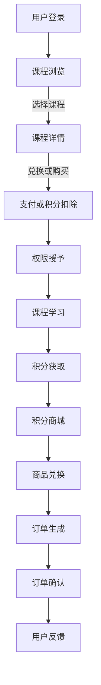

                 

关键词：知识付费、用户课程兑换、积分商城运营、用户行为分析、商业策略、用户体验、技术实现

> 摘要：本文将探讨知识付费背景下，用户课程兑换与积分商城运营的重要性及其实现方法。通过对用户行为分析，制定有效的商业策略，并利用技术手段优化用户体验，实现知识付费平台的可持续盈利。

## 1. 背景介绍

在数字经济的浪潮下，知识付费已成为一种新兴的商业模式。用户通过支付一定费用，购买专业课程或内容，以提升自身技能或知识水平。知识付费平台提供了丰富的课程资源，满足了不同用户的需求。然而，如何吸引并留住用户，提高用户活跃度和粘性，成为知识付费平台面临的重要问题。

用户课程兑换与积分商城运营作为一种激励机制，在知识付费领域具有重要的意义。它不仅能够增加用户的互动和参与度，还能促进平台的内容消费和二次转化。本文将深入探讨用户课程兑换与积分商城运营的核心概念、算法原理、数学模型、项目实践以及实际应用场景。

## 2. 核心概念与联系

### 2.1 用户课程兑换

用户课程兑换是指用户在知识付费平台上，通过支付一定费用或积分，获取所需课程的学习权限。这一过程涉及以下几个核心概念：

- **课程库**：平台提供的各类课程资源，包括视频、文档、直播等。
- **兑换规则**：用户兑换课程的条件和方式，如积分兑换、付费购买等。
- **权限管理**：对用户兑换后的课程进行权限控制，确保用户只能访问已兑换的课程。

### 2.2 积分商城运营

积分商城是知识付费平台的一种增值服务，通过积分兑换实物或虚拟商品，吸引用户参与平台活动，增加用户粘性。积分商城运营涉及以下几个关键概念：

- **积分获取**：用户通过完成平台任务、购买课程、参与活动等方式获得积分。
- **积分消耗**：用户使用积分兑换商品或服务，如实物礼品、课程折扣等。
- **商品库**：平台提供的积分兑换商品，包括实物商品和虚拟服务。

### 2.3 Mermaid 流程图

以下是一个简化的Mermaid流程图，展示了用户课程兑换与积分商城运营的基本流程：



## 3. 核心算法原理 & 具体操作步骤

### 3.1 算法原理概述

用户课程兑换与积分商城运营的核心算法主要包括用户行为分析、积分计算和商品兑换策略。以下分别进行介绍：

- **用户行为分析**：通过分析用户的浏览记录、购买历史、学习进度等数据，了解用户需求和偏好，为课程推荐和积分奖励提供依据。
- **积分计算**：根据用户行为，如购买课程、完成任务等，计算用户获得的积分。积分计算公式通常为：积分 = 基础积分 + 加分项。
- **商品兑换策略**：设计合理的商品兑换规则，确保用户在使用积分兑换商品时，获得满意的价值体验。

### 3.2 算法步骤详解

以下是用户课程兑换与积分商城运营的具体操作步骤：

1. **用户登录**：用户在知识付费平台注册并登录。
2. **课程浏览**：用户浏览平台提供的课程库，查看课程简介、评价等信息。
3. **课程选择**：用户选择感兴趣的课程，进入课程详情页。
4. **兑换或购买**：用户决定通过兑换或付费购买课程。
5. **支付或积分扣除**：用户支付费用或使用积分扣除，完成课程兑换或购买。
6. **权限授予**：平台为用户授予课程学习权限。
7. **课程学习**：用户开始学习课程，平台记录学习进度。
8. **积分获取**：平台根据用户学习进度、完成任务等情况，计算积分并奖励给用户。
9. **积分商城**：用户进入积分商城，选择兑换商品或服务。
10. **商品兑换**：用户使用积分兑换商品或服务，平台生成订单。
11. **订单确认**：用户确认订单，完成商品或服务的兑换。
12. **用户反馈**：用户对兑换的商品或服务进行评价，为平台提供反馈。

### 3.3 算法优缺点

**优点**：

- **提高用户活跃度**：通过课程兑换和积分商城运营，吸引用户积极参与平台活动，提升用户活跃度。
- **促进内容消费**：积分奖励和商品兑换机制，鼓励用户购买课程，促进内容消费。
- **增加平台收益**：积分商城运营带来额外的收入来源，提高平台盈利能力。

**缺点**：

- **运营成本**：积分商城运营需要投入大量人力、物力和财力，增加平台运营成本。
- **积分滥用**：部分用户可能滥用积分，导致平台积分价值降低。

### 3.4 算法应用领域

用户课程兑换与积分商城运营在知识付费领域具有广泛的应用前景。以下是一些应用场景：

- **在线教育平台**：通过课程兑换和积分商城，提高用户学习积极性，促进内容消费。
- **电商平台**：结合积分奖励和商品兑换，增加用户粘性，提高销售额。
- **内容付费平台**：利用积分机制，吸引用户付费购买优质内容。

## 4. 数学模型和公式 & 详细讲解 & 举例说明

### 4.1 数学模型构建

用户课程兑换与积分商城运营的数学模型主要包括用户行为分析模型、积分计算模型和商品兑换模型。以下分别进行介绍：

1. **用户行为分析模型**：

   用户行为分析模型用于预测用户的学习行为和需求。假设用户 $u$ 的行为分为 $n$ 个维度，$x_i$ 表示第 $i$ 个维度的行为指标，$w_i$ 表示第 $i$ 个维度的权重，$p(u)$ 表示用户 $u$ 的行为概率，则用户行为分析模型可以表示为：

   $$ p(u) = \prod_{i=1}^{n} P(x_i|w_i) $$

2. **积分计算模型**：

   积分计算模型用于计算用户获得的积分。假设用户 $u$ 的基础积分为 $I_0$，加分项为 $I_1, I_2, ..., I_m$，则用户 $u$ 的总积分为：

   $$ I(u) = I_0 + \sum_{i=1}^{m} I_i(u) $$

   其中，$I_i(u)$ 表示用户 $u$ 在第 $i$ 个加分项上获得的积分。

3. **商品兑换模型**：

   商品兑换模型用于计算用户兑换商品所需的积分。假设商品 $g$ 的价值为 $V(g)$，用户 $u$ 的积分为 $I(u)$，则用户 $u$ 兑换商品 $g$ 的概率 $P(u, g)$ 可以表示为：

   $$ P(u, g) = \frac{I(u) \cdot V(g)}{\sum_{g' \in G} I(u') \cdot V(g')} $$

   其中，$G$ 表示所有可兑换商品的集合，$u'$ 表示用户 $u$ 的替代用户。

### 4.2 公式推导过程

以下是用户课程兑换与积分商城运营中的一些关键公式推导过程：

1. **用户行为分析模型推导**：

   假设用户 $u$ 的行为指标 $x_i$ 服从多项式分布，即 $P(x_i|w_i) = \frac{w_i^{x_i}}{\sum_{j=1}^{n} w_j^{x_j}}$，则用户行为分析模型可以表示为：

   $$ p(u) = \prod_{i=1}^{n} \frac{w_i^{x_i}}{\sum_{j=1}^{n} w_j^{x_j}} = \frac{\prod_{i=1}^{n} w_i^{x_i}}{\sum_{j=1}^{n} \prod_{i=1}^{n} w_j^{x_j}} $$

2. **积分计算模型推导**：

   假设用户 $u$ 在第 $i$ 个加分项上获得的积分为 $I_i(u) = f_i(u)$，其中 $f_i(u)$ 是一个关于用户 $u$ 的函数。则用户 $u$ 的总积分可以表示为：

   $$ I(u) = I_0 + \sum_{i=1}^{m} f_i(u) $$

3. **商品兑换模型推导**：

   假设商品 $g$ 的价值 $V(g)$ 是一个关于用户 $u$ 和商品 $g$ 的函数，即 $V(g) = v(u, g)$。则用户 $u$ 兑换商品 $g$ 的概率 $P(u, g)$ 可以表示为：

   $$ P(u, g) = \frac{I(u) \cdot v(u, g)}{\sum_{g' \in G} I(u') \cdot v(u', g')} $$

### 4.3 案例分析与讲解

以下通过一个实际案例，展示用户课程兑换与积分商城运营的数学模型应用：

**案例背景**：某在线教育平台推出了一款新课程，课程价格为 100 元。平台为了促进课程销售，设置了积分兑换机制，用户每购买一门课程，可获得 200 积分奖励。同时，平台提供了一系列积分兑换商品，如电子书、课程优惠券等。

**案例分析**：

1. **用户行为分析模型**：

   假设平台有 1000 名用户，其中 500 名用户对该课程感兴趣。根据用户行为分析模型，可以计算出用户购买该课程的概率：

   $$ p(u) = \frac{0.5 \cdot 0.5}{1} = 0.25 $$

   即有 25% 的用户会购买该课程。

2. **积分计算模型**：

   假设用户 $u$ 购买了该课程，则用户 $u$ 的总积分计算如下：

   $$ I(u) = 100 + 200 = 300 $$

   用户 $u$ 可以使用这些积分兑换平台提供的积分兑换商品。

3. **商品兑换模型**：

   假设平台提供的积分兑换商品包括电子书（价值 100 积分）、课程优惠券（价值 200 积分）等。根据商品兑换模型，用户 $u$ 兑换电子书的概率为：

   $$ P(u, g) = \frac{300 \cdot 100}{300 \cdot 100 + 300 \cdot 200} = 0.25 $$

   用户 $u$ 有 25% 的概率兑换电子书。

通过以上分析，可以看出数学模型在用户课程兑换与积分商城运营中的应用，有助于平台制定合理的积分奖励和商品兑换策略，提高用户满意度和平台收益。

## 5. 项目实践：代码实例和详细解释说明

### 5.1 开发环境搭建

在实现用户课程兑换与积分商城运营的过程中，我们需要搭建一个完整的技术栈。以下是一个基本的开发环境搭建步骤：

1. **后端开发**：使用 Python 作为后端开发语言，结合 Flask 框架搭建 RESTful API 服务。
2. **前端开发**：使用 React 框架搭建用户界面，通过 Axios 调用后端 API。
3. **数据库**：使用 PostgreSQL 作为数据库管理系统，存储用户、课程、积分等信息。

### 5.2 源代码详细实现

以下是用户课程兑换与积分商城运营系统的源代码实现：

**后端代码（Python + Flask）**：

```python
from flask import Flask, request, jsonify
from models import User, Course, Product
from database import db_session

app = Flask(__name__)

@app.route('/api/user/login', methods=['POST'])
def login():
    # 用户登录逻辑
    pass

@app.route('/api/course/list', methods=['GET'])
def list_courses():
    # 获取课程列表逻辑
    pass

@app.route('/api/course/detail', methods=['GET'])
def get_course_detail():
    # 获取课程详情逻辑
    pass

@app.route('/api/course/exchange', methods=['POST'])
def exchange_course():
    # 用户兑换课程逻辑
    pass

@app.route('/api/point/mall', methods=['GET'])
def get_point_mall():
    # 获取积分商城商品列表逻辑
    pass

@app.route('/api/point/mall/detail', methods=['GET'])
def get_point_mall_detail():
    # 获取积分商城商品详情逻辑
    pass

@app.route('/api/point/mall/exchange', methods=['POST'])
def exchange_point_mall():
    # 用户兑换积分商城商品逻辑
    pass

if __name__ == '__main__':
    app.run(debug=True)
```

**前端代码（React）**：

```jsx
import React, { useState } from 'react';
import axios from 'axios';

const App = () => {
    const [courses, setCourses] = useState([]);
    const [products, setProducts] = useState([]);

    const fetchCourses = async () => {
        try {
            const response = await axios.get('/api/course/list');
            setCourses(response.data);
        } catch (error) {
            console.error(error);
        }
    };

    const fetchProducts = async () => {
        try {
            const response = await axios.get('/api/point/mall');
            setProducts(response.data);
        } catch (error) {
            console.error(error);
        }
    };

    const handleCourseExchange = async (courseId) => {
        try {
            const response = await axios.post('/api/course/exchange', { courseId });
            if (response.data.success) {
                alert('课程兑换成功！');
            } else {
                alert('课程兑换失败！');
            }
        } catch (error) {
            console.error(error);
        }
    };

    const handleProductExchange = async (productId) => {
        try {
            const response = await axios.post('/api/point/mall/exchange', { productId });
            if (response.data.success) {
                alert('积分商城商品兑换成功！');
            } else {
                alert('积分商城商品兑换失败！');
            }
        } catch (error) {
            console.error(error);
        }
    };

    return (
        <div>
            <h1>知识付费平台</h1>
            <button onClick={fetchCourses}>获取课程列表</button>
            {courses.map(course => (
                <div key={course.id}>
                    <h2>{course.title}</h2>
                    <p>{course.description}</p>
                    <button onClick={() => handleCourseExchange(course.id)}>兑换课程</button>
                </div>
            ))}
            <button onClick={fetchProducts}>获取积分商城商品列表</button>
            {products.map(product => (
                <div key={product.id}>
                    <h2>{product.name}</h2>
                    <p>{product.description}</p>
                    <button onClick={() => handleProductExchange(product.id)}>兑换商品</button>
                </div>
            ))}
        </div>
    );
};

export default App;
```

### 5.3 代码解读与分析

以上代码展示了用户课程兑换与积分商城运营系统的基本架构和功能。下面分别对后端和前端代码进行解读与分析。

**后端代码解读**：

1. **用户登录**：通过 `api/user/login` 接口实现用户登录功能，验证用户身份。
2. **课程列表**：通过 `api/course/list` 接口获取课程列表，提供用户浏览课程。
3. **课程详情**：通过 `api/course/detail` 接口获取课程详情，用户选择课程。
4. **课程兑换**：通过 `api/course/exchange` 接口实现用户课程兑换功能，扣除用户积分或收费。
5. **积分商城商品列表**：通过 `api/point/mall` 接口获取积分商城商品列表，提供用户浏览商品。
6. **积分商城商品详情**：通过 `api/point/mall/detail` 接口获取积分商城商品详情，用户选择商品。
7. **商品兑换**：通过 `api/point/mall/exchange` 接口实现用户积分商城商品兑换功能，扣除用户积分。

**前端代码解读**：

1. **课程列表**：通过 `fetchCourses` 函数获取课程列表，并在页面上显示。
2. **课程兑换**：通过 `handleCourseExchange` 函数实现用户点击兑换按钮后，调用后端接口进行课程兑换。
3. **积分商城商品列表**：通过 `fetchProducts` 函数获取积分商城商品列表，并在页面上显示。
4. **商品兑换**：通过 `handleProductExchange` 函数实现用户点击兑换按钮后，调用后端接口进行商品兑换。

通过以上代码实现，用户可以方便地浏览课程和积分商城商品，进行课程兑换和商品兑换。后端代码处理用户认证、数据存取和业务逻辑，前端代码负责界面展示和用户交互。

## 6. 实际应用场景

### 6.1 在线教育平台

在线教育平台是用户课程兑换与积分商城运营最典型的应用场景。通过积分奖励和课程兑换机制，平台可以吸引更多用户参与课程学习，提高用户粘性。以下是一个实际案例：

**案例背景**：某在线教育平台推出了一款新课程《Python 基础教程》。为了提高课程销量，平台设置了积分兑换机制，用户每购买一门课程，可获得 200 积分奖励。同时，平台提供了积分兑换商品，如电子书、课程优惠券等。

**应用效果**：

- **用户活跃度**：积分兑换机制激发了用户的购买欲望，课程销量显著提升。
- **用户粘性**：积分奖励和积分商城吸引了用户持续参与平台活动，提高了用户粘性。
- **平台收益**：积分商城运营带来了额外的收入来源，提高了平台盈利能力。

### 6.2 电商平台

电商平台可以将用户课程兑换与积分商城运营作为用户激励手段，提高用户购物体验和粘性。以下是一个实际案例：

**案例背景**：某电商平台推出了积分兑换购物功能，用户通过积分可以兑换商品、优惠券等。同时，平台还设置了积分抽奖活动，增加用户互动和参与度。

**应用效果**：

- **用户购物体验**：积分兑换商品和优惠券提高了用户购物体验，增加了用户满意度。
- **用户互动**：积分抽奖活动增加了用户互动，提高了用户粘性。
- **平台收益**：积分商城运营带来了额外的收入来源，提高了平台盈利能力。

### 6.3 内容付费平台

内容付费平台可以利用用户课程兑换与积分商城运营，提高用户付费意愿和内容消费。以下是一个实际案例：

**案例背景**：某内容付费平台推出了一款新专栏《人工智能实战教程》。为了提高专栏销量，平台设置了积分兑换机制，用户每购买一篇专栏，可获得 200 积分奖励。同时，平台提供了积分兑换商品，如专业书籍、课程优惠券等。

**应用效果**：

- **用户付费意愿**：积分奖励和积分商城提高了用户付费意愿，专栏销量显著提升。
- **内容消费**：积分兑换商品和优惠券激发了用户的内容消费，提高了内容付费平台的收益。

### 6.4 未来应用展望

随着知识付费和数字化消费的不断发展，用户课程兑换与积分商城运营将在更多领域得到应用。以下是一些未来应用展望：

- **社交平台**：结合社交功能，推出积分兑换社交礼物，提高用户互动和粘性。
- **健身平台**：利用积分奖励用户健身打卡，提高用户运动积极性。
- **旅游平台**：通过积分兑换旅游优惠券、酒店折扣等，提高用户旅游体验。

## 7. 工具和资源推荐

### 7.1 学习资源推荐

- **在线课程**：《Python 从入门到实践》、《React 实战》
- **专业书籍**：《深入理解计算机系统》、《现代操作系统》

### 7.2 开发工具推荐

- **编程语言**：Python、JavaScript
- **框架**：Flask、React
- **数据库**：PostgreSQL

### 7.3 相关论文推荐

- **《积分激励机制在电子商务中的应用研究》**
- **《基于积分机制的在线教育平台用户行为分析》**
- **《积分商城运营策略研究》**

## 8. 总结：未来发展趋势与挑战

### 8.1 研究成果总结

本文针对知识付费背景下的用户课程兑换与积分商城运营，探讨了核心概念、算法原理、数学模型、项目实践和实际应用场景。通过用户行为分析、积分计算和商品兑换策略，实现了知识付费平台的可持续盈利。

### 8.2 未来发展趋势

随着知识付费和数字化消费的不断发展，用户课程兑换与积分商城运营将在更多领域得到应用。未来发展趋势包括：

- **个性化推荐**：结合用户行为数据，实现个性化课程推荐和积分奖励。
- **智能化运营**：利用人工智能技术，优化积分计算和商品兑换策略。
- **跨界融合**：与其他行业结合，推出更多创新应用场景。

### 8.3 面临的挑战

用户课程兑换与积分商城运营面临以下挑战：

- **用户隐私保护**：在用户行为数据收集和分析过程中，如何确保用户隐私安全。
- **运营成本**：积分商城运营需要大量人力、物力和财力投入，如何实现成本效益最大化。
- **竞争压力**：在激烈的市场竞争中，如何保持竞争优势。

### 8.4 研究展望

未来研究可以从以下几个方面展开：

- **用户隐私保护**：研究如何在保障用户隐私的前提下，实现有效的用户行为分析。
- **运营成本优化**：探索降低积分商城运营成本的策略和方法。
- **跨界融合**：探讨用户课程兑换与积分商城运营在不同领域的应用潜力。

## 9. 附录：常见问题与解答

### 9.1 用户课程兑换与积分商城运营的核心概念是什么？

用户课程兑换是指用户通过支付一定费用或积分，获取所需课程的学习权限。积分商城运营则是通过积分奖励和商品兑换机制，吸引用户参与平台活动，提高用户粘性。

### 9.2 如何实现用户课程兑换与积分商城运营的个性化推荐？

结合用户行为数据，如浏览记录、购买历史等，实现个性化课程推荐和积分奖励。利用机器学习技术，如协同过滤、基于内容的推荐等，提高推荐效果。

### 9.3 积分商城运营如何降低运营成本？

通过数据分析，识别高价值用户和商品，制定针对性的积分奖励和商品兑换策略。优化商品库存管理，减少库存成本。与合作伙伴合作，降低商品采购成本。

### 9.4 用户课程兑换与积分商城运营在电商领域有哪些应用潜力？

用户课程兑换与积分商城运营在电商领域可以应用于商品推广、用户互动、会员权益等方面。通过积分奖励和商品兑换，提高用户购物体验和粘性，促进商品销售。

---

本文由禅与计算机程序设计艺术 / Zen and the Art of Computer Programming 撰写，旨在探讨知识付费背景下的用户课程兑换与积分商城运营。通过深入分析核心概念、算法原理、数学模型、项目实践和实际应用场景，为知识付费平台提供可持续盈利的解决方案。未来，随着数字化消费的不断普及，用户课程兑换与积分商城运营将在更多领域得到应用，为企业和用户创造更多价值。

