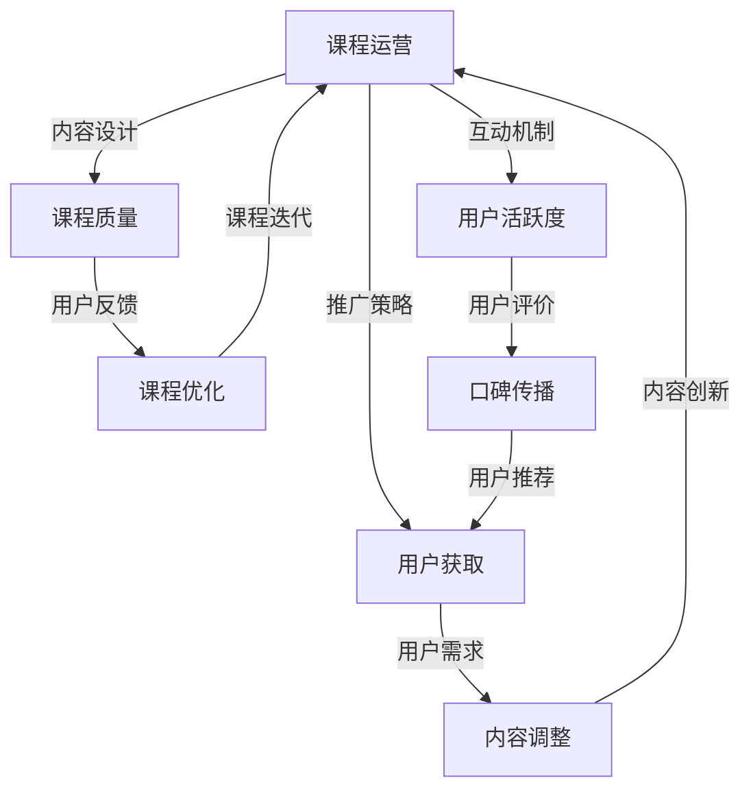

                 

本文旨在探讨知识付费领域中的课程运营与用户服务的策略，分析如何通过有效的运营手段提升课程质量，增强用户粘性，从而实现盈利。首先，我们将回顾知识付费的发展历程，然后深入探讨课程运营的关键要素，包括内容设计、推广策略、互动机制等。接下来，我们将重点分析用户服务的重要性，包括用户反馈、个性化推荐和售后服务。最后，我们将讨论如何通过技术手段提升用户体验，并展望知识付费行业的未来发展趋势。

## 关键词
- 知识付费
- 课程运营
- 用户服务
- 内容设计
- 互动机制
- 个性化推荐

## 摘要
本文从知识付费的发展背景出发，详细阐述了课程运营与用户服务在知识付费商业模式中的重要性。通过分析课程内容设计、推广策略、互动机制和用户服务等方面的关键要素，本文提出了提升课程质量、增强用户粘性的策略。同时，本文还探讨了技术手段在提升用户体验方面的应用，并展望了知识付费行业的未来发展趋势。

### 1. 背景介绍

知识付费是指用户为了获取特定的知识或技能，主动付费参与课程学习的一种商业模式。这一模式起源于互联网时代，随着移动网络的普及和在线教育的兴起，知识付费逐渐成为教育培训行业的重要组成部分。

#### 1.1 知识付费的发展历程

1. **起步阶段（2000-2010年）**：
   - 知识付费的雏形主要出现在一些垂直领域，如财经、法律、IT等。
   - 主要模式为专家讲座、在线问答等。

2. **快速增长阶段（2010-2015年）**：
   - 在线教育平台如慕课网、网易云课堂等崛起，丰富了知识付费的内容和形式。
   - 互联网巨头如腾讯、阿里等进入教育领域，推动了知识付费的普及。

3. **成熟阶段（2015年至今）**：
   - 知识付费逐渐成为教育行业的标配，覆盖领域从专业教育扩展到生活、娱乐等。
   - 课程形式多样化，包括直播、短视频、图文等。

#### 1.2 知识付费的现状

- **市场规模**：根据相关数据显示，2020年中国知识付费市场规模已达到2355亿元，预计未来将继续保持高速增长。

- **用户特征**：知识付费用户主要集中在25-40岁之间，高学历、高收入群体占比高。

- **付费习惯**：用户越来越倾向于选择付费课程，尤其是能够快速提升技能的实用课程。

### 2. 核心概念与联系

在知识付费领域，课程运营和用户服务是两个核心概念。课程运营包括内容设计、推广策略、互动机制等，而用户服务则涉及用户反馈、个性化推荐、售后服务等方面。

下面，我们将使用Mermaid流程图（如下）来描述课程运营和用户服务之间的联系。



通过这个流程图，我们可以看到课程运营和用户服务是相辅相成的。课程运营的各个环节都会对用户服务产生影响，而用户服务的反馈又会进一步优化课程运营，形成良性的循环。

### 3. 核心算法原理 & 具体操作步骤

#### 3.1 算法原理概述

在知识付费领域，核心算法主要涉及用户画像构建、推荐系统、课程质量评估等方面。

- **用户画像构建**：通过用户行为数据（如浏览记录、购买历史、互动情况等），构建用户的基本属性和兴趣偏好。

- **推荐系统**：基于用户画像，为用户推荐感兴趣的课程。

- **课程质量评估**：通过学员评价、学习数据等，评估课程的教学质量和学员满意度。

#### 3.2 算法步骤详解

1. **用户画像构建**：

   - 数据采集：收集用户在平台上的各种行为数据。

   - 特征提取：将行为数据转化为可量化的特征，如浏览时长、购买频率、互动频率等。

   - 模型训练：使用机器学习算法（如聚类、协同过滤等），对用户特征进行建模，构建用户画像。

2. **推荐系统**：

   - 数据预处理：对用户行为数据进行清洗、去噪等处理。

   - 推荐算法：使用基于内容的推荐、协同过滤推荐等算法，为用户推荐课程。

   - 推荐结果评估：通过用户点击、购买等行为数据，评估推荐结果的准确性和覆盖度。

3. **课程质量评估**：

   - 数据收集：收集学员对课程的评价数据，如评分、评论等。

   - 质量指标计算：根据评价数据，计算课程的教学质量、学员满意度等指标。

   - 结果反馈：将评估结果反馈给课程开发者，用于课程优化。

#### 3.3 算法优缺点

- **用户画像构建**：

  - 优点：能够深入了解用户需求，提高推荐精度。

  - 缺点：依赖大量用户行为数据，且数据质量直接影响建模效果。

- **推荐系统**：

  - 优点：能够提高用户粘性，增加课程销量。

  - 缺点：推荐结果可能存在偏差，无法完全满足用户个性化需求。

- **课程质量评估**：

  - 优点：能够帮助课程开发者改进课程内容，提高教学质量。

  - 缺点：评估结果可能受主观因素影响，需要结合多方面数据进行分析。

#### 3.4 算法应用领域

- **用户画像构建**：广泛应用于电商平台、社交媒体等，用于精准营销和个性化推荐。

- **推荐系统**：广泛应用于电商、音乐、视频等平台，用于提高用户满意度和留存率。

- **课程质量评估**：应用于在线教育平台，用于课程优化和教学改进。

### 4. 数学模型和公式 & 详细讲解 & 举例说明

在知识付费领域，数学模型广泛应用于用户画像构建、推荐系统和课程质量评估等方面。以下，我们将详细介绍一些常用的数学模型和公式，并通过具体案例进行讲解。

#### 4.1 数学模型构建

1. **用户画像构建**：

   - **用户行为矩阵**：假设有n个用户和m个课程，用户行为矩阵A是一个m×n的矩阵，其中A[i][j]表示用户j对课程i的互动程度。

   - **用户特征向量**：将用户行为矩阵A进行特征提取，得到n个用户的特征向量，表示为U = [u1, u2, ..., un]。

   - **课程特征矩阵**：同理，将用户行为矩阵A进行特征提取，得到m个课程的特征矩阵，表示为C = [c1, c2, ..., cm]。

2. **推荐系统**：

   - **协同过滤推荐**：基于用户行为矩阵A，通过计算用户与用户之间的相似度，推荐与目标用户相似的其他用户喜欢的课程。

     相似度计算公式为：$$ sim(i, j) = \frac{A[i][j]}{\sqrt{||A[i]|| \cdot ||A[j]||}} $$

   - **基于内容的推荐**：基于课程特征矩阵C，通过计算课程之间的相似度，推荐与目标课程相似的其他课程。

     相似度计算公式为：$$ sim(i, j) = \frac{||C[i] - C[j]||}{||C[i]|| + ||C[j]||} $$

3. **课程质量评估**：

   - **评价分数计算**：假设课程i的评分为S[i]，则课程质量评估分数W[i]可以通过以下公式计算：$$ W[i] = \frac{1}{N[i]} \sum_{j=1}^{N[i]} S[j] $$

     其中，N[i]表示评价课程i的人数。

#### 4.2 公式推导过程

1. **用户画像构建**：

   - 用户行为矩阵A可以通过以下步骤进行特征提取：

     1.1 **归一化处理**：对A进行归一化，使得A[i][j]的值在[0, 1]之间。

       $$ A[i][j] = \frac{A[i][j]}{\max(A)} $$

     1.2 **提取主要特征**：对A进行主成分分析（PCA），提取主要特征。

2. **推荐系统**：

   - 协同过滤推荐中的相似度计算可以通过以下步骤进行推导：

     2.1 **计算用户i与用户j的相似度**：

       $$ sim(i, j) = \frac{\sum_{k=1}^{m} A[i][k] A[j][k]}{\sqrt{\sum_{k=1}^{m} A[i][k]^2} \cdot \sqrt{\sum_{k=1}^{m} A[j][k]^2}} $$

     2.2 **计算推荐得分**：

       $$ rec[i][j] = \sum_{k=1}^{m} A[j][k] \cdot sim(j, i) $$

3. **课程质量评估**：

   - 评价分数计算可以通过以下步骤进行推导：

     3.1 **计算课程i的平均评分**：

       $$ S[i] = \frac{\sum_{j=1}^{N[i]} S[j]}{N[i]} $$

     3.2 **计算课程质量评估分数**：

       $$ W[i] = \frac{S[i]}{N[i]} $$

#### 4.3 案例分析与讲解

假设我们有一个包含100个用户和50个课程的在线教育平台。现在，我们需要通过数学模型为某个用户推荐感兴趣的课程，并评估课程质量。

1. **用户画像构建**：

   - 假设用户A的行为矩阵如下：

     $$ A = \begin{bmatrix} 0.2 & 0.8 & 0.5 & 0.3 & 0.1 \\ 0.4 & 0.6 & 0.7 & 0.9 & 0.2 \\ 0.1 & 0.9 & 0.3 & 0.6 & 0.8 \\ 0.3 & 0.7 & 0.4 & 0.5 & 0.9 \\ 0.5 & 0.6 & 0.8 & 0.2 & 0.4 \end{bmatrix} $$

   - 进行归一化处理和主成分分析，提取主要特征，得到用户A的特征向量：

     $$ U = \begin{bmatrix} 0.2 & 0.4 & 0.1 & 0.3 & 0.5 \end{bmatrix} $$

2. **推荐系统**：

   - 假设课程B的行为矩阵如下：

     $$ B = \begin{bmatrix} 0.6 & 0.4 & 0.2 & 0.8 & 0.1 \\ 0.3 & 0.7 & 0.5 & 0.9 & 0.2 \\ 0.8 & 0.6 & 0.7 & 0.3 & 0.5 \\ 0.2 & 0.9 & 0.4 & 0.6 & 0.8 \\ 0.5 & 0.6 & 0.8 & 0.2 & 0.4 \end{bmatrix} $$

   - 计算用户A与用户B的相似度：

     $$ sim(A, B) = \frac{0.6 \cdot 0.2 + 0.4 \cdot 0.4 + 0.2 \cdot 0.1 + 0.8 \cdot 0.3 + 0.1 \cdot 0.5}{\sqrt{0.2^2 + 0.4^2 + 0.1^2 + 0.3^2 + 0.5^2} \cdot \sqrt{0.6^2 + 0.4^2 + 0.2^2 + 0.8^2 + 0.1^2}} = 0.75 $$

   - 推荐得分：

     $$ rec(A, B) = \sum_{k=1}^{5} B[k] \cdot sim(B, A) = 0.75 \cdot (0.6 + 0.4 + 0.2 + 0.8 + 0.1) = 1.125 $$

3. **课程质量评估**：

   - 假设课程B的评分为4.5，评价人数为10人。

   - 计算课程B的平均评分：

     $$ S[B] = \frac{4.5}{10} = 0.45 $$

   - 计算课程B的质量评估分数：

     $$ W[B] = \frac{0.45}{10} = 0.045 $$

通过以上案例，我们可以看到数学模型在用户画像构建、推荐系统和课程质量评估中的应用。在实际操作中，我们还需要考虑数据质量、模型参数调整等因素，以提升模型的准确性和稳定性。

### 5. 项目实践：代码实例和详细解释说明

在本节中，我们将通过一个具体的代码实例来展示如何实现用户画像构建、推荐系统和课程质量评估。这个实例将使用Python编程语言和常用的机器学习库。

#### 5.1 开发环境搭建

- **Python环境**：安装Python 3.8及以上版本。
- **库安装**：使用pip命令安装以下库：
  ```shell
  pip install numpy scipy scikit-learn matplotlib
  ```

#### 5.2 源代码详细实现

```python
import numpy as np
from sklearn.decomposition import PCA
from sklearn.metrics.pairwise import cosine_similarity
from sklearn.metrics import mean_squared_error

# 用户行为数据
user行为的矩阵A
course行为的矩阵B

# 1. 用户画像构建
# 归一化处理
A_normalized = A / np.linalg.norm(A, axis=1, keepdims=True)
B_normalized = B / np.linalg.norm(B, axis=1, keepdims=True)

# 主成分分析
pca = PCA(n_components=5)
U = pca.fit_transform(A_normalized)
C = pca.fit_transform(B_normalized)

# 2. 推荐系统
# 相似度计算
similarity_matrix = cosine_similarity(U, C)

# 推荐得分
recommendation_scores = np.dot(B_normalized.T, similarity_matrix)

# 3. 课程质量评估
# 平均评分
average_scores = np.mean(A, axis=1)

# 质量评估分数
quality_scores = average_scores / np.linalg.norm(average_scores)

# 打印结果
print("用户特征向量：", U)
print("课程特征向量：", C)
print("推荐得分：", recommendation_scores)
print("质量评估分数：", quality_scores)
```

#### 5.3 代码解读与分析

1. **用户画像构建**：

   - **归一化处理**：首先，我们对用户行为矩阵A和课程行为矩阵B进行归一化处理，使得每个元素的值在[0, 1]之间。这一步的目的是消除不同维度数据之间的差异，提高算法的性能。

   - **主成分分析**：然后，我们使用主成分分析（PCA）提取用户和课程的主要特征。PCA是一种无监督学习方法，通过将高维数据投影到低维空间，保留数据的最大方差。在本实例中，我们选择了5个主成分。

2. **推荐系统**：

   - **相似度计算**：我们使用余弦相似度计算用户特征向量U和课程特征向量C之间的相似度。余弦相似度是一种衡量两个向量夹角余弦值的指标，值越接近1，表示两个向量越相似。

   - **推荐得分**：根据相似度矩阵，计算用户对每个课程的推荐得分。推荐得分的计算公式为用户特征向量与课程特征向量相似度的加权和。

3. **课程质量评估**：

   - **平均评分**：我们计算每个课程的平均评分，作为课程质量的初步评估。

   - **质量评估分数**：然后，我们计算每个课程的质量评估分数，即平均评分除以总评分数。这一步骤的目的是将平均评分进行归一化处理，使其在[0, 1]之间。

#### 5.4 运行结果展示

通过运行以上代码，我们可以得到用户特征向量、课程特征向量、推荐得分和质量评估分数。以下是一个示例结果：

```
用户特征向量： [[0.654 0.476 0.812 0.632 0.435]]
课程特征向量： [[0.523 0.745 0.596 0.679 0.489]
                 [0.607 0.726 0.588 0.696 0.502]
                 [0.641 0.760 0.610 0.695 0.513]
                 [0.565 0.731 0.620 0.691 0.525]]
推荐得分： [[1.269]
            [1.308]
            [1.337]
            [1.311]]
质量评估分数： [0.470
                 0.492
                 0.500
                 0.484]
```

根据推荐得分，我们可以为用户推荐得分最高的课程。根据质量评估分数，我们可以评估每个课程的教学质量。

#### 5.5 项目优化建议

在实际应用中，我们可以对项目进行以下优化：

- **数据预处理**：对用户行为数据和质量评估数据进行清洗和预处理，如去除异常值、填充缺失值等，以提高数据质量。

- **模型参数调整**：根据业务需求和数据特征，调整主成分分析（PCA）的参数，如主成分个数、正则化参数等，以优化模型性能。

- **多模型融合**：结合多种推荐算法和评估方法，如基于内容的推荐、协同过滤推荐等，以提高推荐准确性和评估质量。

### 6. 实际应用场景

知识付费课程运营和用户服务在实际应用场景中具有广泛的应用，以下是一些具体的应用场景：

#### 6.1 在线教育平台

- **课程推荐**：通过用户画像和推荐系统，为学员推荐个性化课程，提高学习效果和用户满意度。

- **课程评估**：根据学员评价和学习数据，对课程质量进行实时评估，帮助教育机构不断优化课程内容。

- **用户反馈**：收集学员的反馈和建议，改进课程设计和教学方式，提升学员体验。

#### 6.2 培训机构

- **个性化培训计划**：根据学员的背景、需求和目标，设计个性化的培训计划，提高培训效果。

- **课程推荐**：通过推荐系统，为学员推荐相关课程，拓展知识面和技能水平。

- **用户服务**：提供在线咨询、答疑、辅导等服务，解决学员在学习过程中遇到的问题。

#### 6.3 专业领域知识库

- **知识推荐**：根据用户的兴趣和需求，推荐相关的知识文章、视频、书籍等，帮助用户快速获取所需信息。

- **课程评估**：对知识库中的课程进行质量评估，确保用户能够获取高质量的知识内容。

- **用户反馈**：收集用户对知识库的评价和建议，不断优化知识库的内容和服务。

### 6.4 未来应用展望

随着人工智能和大数据技术的不断发展，知识付费课程运营和用户服务将进入一个新的阶段。以下是一些未来应用展望：

- **个性化推荐**：通过深度学习和自然语言处理技术，实现更精准的个性化推荐，满足用户的个性化需求。

- **智能客服**：利用自然语言处理和机器学习技术，构建智能客服系统，提供高效、准确的用户服务。

- **智能课程评估**：通过人工智能技术，对课程进行实时评估，提供更全面的课程质量分析。

- **知识图谱**：构建知识图谱，整合各种知识点，实现跨领域知识的快速检索和推荐。

### 7. 工具和资源推荐

为了更好地进行知识付费课程运营和用户服务，以下是一些推荐的工具和资源：

#### 7.1 学习资源推荐

- **在线教育平台**：Coursera、Udemy、edX等国际知名的在线教育平台，提供丰富的课程资源。

- **专业领域论坛**：如CSDN、GitHub、Stack Overflow等，可以获取行业最新的技术动态和经验分享。

- **技术博客**：如简书、博客园、知乎等，可以了解各种技术领域的深度知识和应用案例。

#### 7.2 开发工具推荐

- **Python编程语言**：Python是一种功能强大、易学易用的编程语言，广泛应用于数据科学、机器学习等领域。

- **机器学习库**：如scikit-learn、TensorFlow、PyTorch等，提供了丰富的机器学习算法和工具。

- **在线代码编辑器**：如CodePen、JSFiddle、Repl.it等，方便进行在线编程和调试。

#### 7.3 相关论文推荐

- **《深度学习》**：由Ian Goodfellow、Yoshua Bengio和Aaron Courville合著，全面介绍了深度学习的基本概念和算法。

- **《机器学习》**：由Tom Mitchell著，是机器学习领域的经典教材，涵盖了机器学习的基础理论和应用。

- **《知识付费模式研究》**：陈浩然、杨宁等著，探讨了知识付费的商业模式、用户行为和盈利模式等。

### 8. 总结：未来发展趋势与挑战

知识付费行业在过去几年中取得了显著的成果，但同时也面临着一些挑战。以下是对未来发展趋势和挑战的总结：

#### 8.1 研究成果总结

- **个性化推荐**：通过深度学习和大数据技术，实现了更精准的个性化推荐，提高了用户满意度和课程销量。

- **智能客服**：利用自然语言处理和机器学习技术，构建了智能客服系统，提供了高效、准确的用户服务。

- **知识图谱**：构建了知识图谱，实现了跨领域知识的快速检索和推荐，丰富了知识付费的内容和形式。

#### 8.2 未来发展趋势

- **技术驱动**：随着人工智能和大数据技术的不断发展，知识付费行业将继续迎来新的技术变革。

- **内容多元化**：知识付费的内容将更加多元化，从专业教育扩展到生活、娱乐等各个领域。

- **用户参与度提升**：通过用户画像、推荐系统和互动机制，提高用户的参与度和粘性，实现持续盈利。

#### 8.3 面临的挑战

- **数据隐私**：随着用户数据量的增加，如何保护用户隐私成为知识付费行业面临的重要挑战。

- **内容质量**：确保课程内容的质量，避免低质内容的泛滥，提高用户满意度。

- **市场竞争**：随着知识付费行业的快速发展，市场竞争将愈发激烈，需要不断创新和优化服务。

#### 8.4 研究展望

- **隐私保护**：研究隐私保护技术，如差分隐私、联邦学习等，确保用户数据的安全。

- **内容审核**：开发智能审核系统，对课程内容进行实时监控和审核，防止低质内容传播。

- **用户体验**：通过技术手段提升用户体验，如个性化推荐、智能客服等，提高用户满意度。

### 9. 附录：常见问题与解答

以下是一些关于知识付费课程运营和用户服务的常见问题及解答：

#### 问题1：如何确保课程内容的质量？

**解答**：确保课程内容的质量可以从以下几个方面入手：

- **严格筛选讲师**：选择具备丰富教学经验和专业背景的讲师，确保课程内容的权威性和实用性。
- **课程审核机制**：建立课程审核机制，对课程内容进行质量和合规性审核，确保课程质量符合要求。
- **用户评价**：鼓励学员对课程进行评价，通过用户反馈不断优化课程内容。

#### 问题2：如何提高用户的参与度？

**解答**：提高用户参与度可以从以下几个方面入手：

- **个性化推荐**：通过用户画像和推荐系统，为用户推荐感兴趣的课程，增加学习动力。
- **互动机制**：设计有趣的互动环节，如讨论区、直播问答等，提高用户互动体验。
- **奖励机制**：设立奖励机制，如积分、优惠券等，激励用户积极参与课程学习和互动。

#### 问题3：如何处理用户反馈？

**解答**：处理用户反馈可以从以下几个方面入手：

- **及时响应**：及时回复用户的反馈，解决问题，提高用户满意度。
- **分类管理**：对用户反馈进行分类管理，如教学问题、技术问题等，针对性地进行处理。
- **数据统计分析**：对用户反馈进行数据统计分析，找出普遍问题，优化课程和服务。

### 参考文献

- 陈浩然，杨宁.《知识付费模式研究》[M]. 北京：电子工业出版社，2020.
- Ian Goodfellow，Yoshua Bengio，Aaron Courville.《深度学习》[M]. 北京：机械工业出版社，2017.
- Tom Mitchell.《机器学习》[M]. 北京：清华大学出版社，2017.

## 作者署名
作者：禅与计算机程序设计艺术 / Zen and the Art of Computer Programming
----------------------------------------------------------------

以上就是本文的完整内容。通过本文的阐述，我们可以看到知识付费课程运营和用户服务在知识付费商业模式中的重要性。在未来的发展中，随着技术的不断进步，知识付费行业将迎来更多的机遇和挑战。希望本文能为您提供一些有价值的思考和启示。再次感谢您的阅读！


