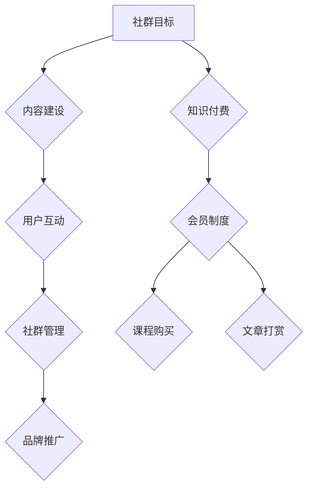

                 

 关键词：知识付费、社群运营、程序员、实操、策略、工具

> 摘要：本文旨在探讨知识付费在程序员社群运营中的应用，分析社群运营的核心策略与工具，以期为程序员们提供一套切实可行的运营实操指南。

## 1. 背景介绍

在当今数字化时代，知识付费逐渐成为获取高质量内容和服务的重要方式。对于程序员而言，知识付费不仅提供了学习新技术的途径，也促进了专业知识的交流与共享。然而，如何有效地运营一个程序员社群，使其不仅能够提供有价值的内容，还能持续吸引和维系会员，是许多社群管理者面临的重要挑战。

本文将围绕以下几个核心议题展开讨论：
- 程序员社群运营的核心策略
- 社群运营中的知识付费模式
- 实用的社群运营工具与平台
- 社群运营的具体实操步骤
- 社群运营的未来趋势与挑战

通过本文的探讨，希望为广大程序员社群管理者提供一套系统、实用、易于操作的知识付费与社群运营指南。

## 2. 核心概念与联系

### 2.1 知识付费

知识付费是指用户为获取有价值的信息、内容或服务而支付的费用。在程序员社群中，知识付费通常表现为会员制度、课程购买、文章打赏等形式。

### 2.2 社群运营

社群运营是指通过一系列策略和工具，吸引、维系和扩展社群成员，提升社群价值的过程。核心策略包括内容建设、用户互动、社群管理、品牌推广等。

### 2.3 Mermaid 流程图



### 2.4 核心概念联系

知识付费与社群运营密不可分。知识付费为社群运营提供了收入来源，而社群运营则通过优质内容和服务吸引并维系用户，实现知识付费的目标。

## 3. 核心算法原理 & 具体操作步骤

### 3.1 算法原理概述

社群运营的核心算法包括以下几个步骤：

1. **目标设定**：明确社群运营的目标，如提升用户活跃度、增加会员数量等。
2. **内容建设**：创建高质量的内容，包括技术文章、课程、直播等。
3. **用户互动**：通过评论、问答、活动等形式，增强用户之间的互动。
4. **社群管理**：制定规章制度，确保社群秩序和用户体验。
5. **品牌推广**：通过线上线下活动，提升社群知名度和影响力。

### 3.2 算法步骤详解

1. **目标设定**：
   - 分析社群现状和用户需求，设定具体可行的目标。
   - 制定相应的指标，如用户活跃度、会员增长率等。

2. **内容建设**：
   - 根据目标制定内容策略，确保内容的质量和多样性。
   - 利用内容管理系统（CMS）进行内容发布和管理。

3. **用户互动**：
   - 设计互动环节，如问答、投票、小组讨论等。
   - 利用社交化工具，如Discord、Slack等，增强用户互动。

4. **社群管理**：
   - 制定社群规章制度，明确成员行为规范。
   - 定期清理无效账号，维护社群秩序。

5. **品牌推广**：
   - 通过社交媒体、博客、线上活动等方式，提升社群知名度。
   - 与相关行业和组织合作，扩大影响力。

### 3.3 算法优缺点

#### 优点

- **目标明确**：通过算法步骤，确保社群运营目标的实现。
- **高效管理**：算法提供了一套系统化的运营流程，提高管理效率。
- **可持续性**：知识付费为社群运营提供了稳定的收入来源。

#### 缺点

- **执行难度**：需要专业技能和经验，确保算法的有效实施。
- **用户流失**：如果内容和服务无法满足用户需求，可能导致用户流失。

### 3.4 算法应用领域

社群运营算法适用于各类程序员社群，如技术社区、学习小组、专业联盟等。通过该算法，社群可以更有效地提升用户活跃度、增加会员数量，实现知识付费和社群价值的最大化。

## 4. 数学模型和公式 & 详细讲解 & 举例说明

### 4.1 数学模型构建

社群运营的数学模型主要涉及以下三个方面：

1. **用户活跃度模型**：
   - 活跃度（Active Rate） = （活跃用户数 / 总用户数）× 100%
   - 其中，活跃用户定义为在一定时间内参与互动的用户。

2. **会员增长模型**：
   - 增长率（Growth Rate） = （新增会员数 / 当前会员数）× 100%
   - 其中，新增会员定义为在一定时间内通过知识付费成为会员的用户。

3. **收入模型**：
   - 收入（Revenue） = 会员费用 + 打赏金额
   - 其中，会员费用为会员订阅费用，打赏金额为用户对内容的打赏收入。

### 4.2 公式推导过程

1. **用户活跃度模型**：

   设 A 为活跃用户数，T 为总用户数，则活跃度（Active Rate）可以表示为：

   $$ Active\ Rate = \frac{A}{T} \times 100\% $$

   其中，A 和 T 是在一定时间段内的统计数据。

2. **会员增长模型**：

   设 G 为新增会员数，C 为当前会员数，则增长率（Growth Rate）可以表示为：

   $$ Growth\ Rate = \frac{G}{C} \times 100\% $$

   其中，G 和 C 同样是在一定时间段内的统计数据。

3. **收入模型**：

   设 R 为收入，M 为会员费用，D 为打赏金额，则收入（Revenue）可以表示为：

   $$ Revenue = M + D $$

   其中，M 和 D 是在一定时间段内的实际收入数据。

### 4.3 案例分析与讲解

假设一个程序员社群有 1000 名用户，其中 200 名用户在一定时间内参与了互动，新增会员数为 50 名，会员费用为 100 元/年，打赏金额为 3000 元。根据上述公式，可以计算出：

1. **用户活跃度**：

   $$ Active\ Rate = \frac{200}{1000} \times 100\% = 20\% $$

2. **会员增长率**：

   $$ Growth\ Rate = \frac{50}{1000} \times 100\% = 5\% $$

3. **收入**：

   $$ Revenue = 50 \times 100 + 3000 = 8000 $$ 元

通过这个案例，我们可以看到社群运营的核心指标，并了解到数学模型在实际应用中的计算方法。

## 5. 项目实践：代码实例和详细解释说明

### 5.1 开发环境搭建

为了便于说明，我们选择 Python 作为开发语言，并使用 Flask 框架搭建一个简单的程序员社群网站。以下是开发环境的搭建步骤：

1. 安装 Python：
   - 通过包管理器（如 Anaconda）安装 Python 3.8 或更高版本。
2. 安装 Flask：
   - 在命令行中运行 `pip install flask` 命令安装 Flask 框架。

### 5.2 源代码详细实现

以下是搭建社群网站的基本代码框架：

```python
# 导入 Flask 模块
from flask import Flask, render_template, request

# 创建 Flask 应用对象
app = Flask(__name__)

# 创建路由和视图函数
@app.route('/')
def index():
    return render_template('index.html')

@app.route('/article', methods=['GET', 'POST'])
def article():
    if request.method == 'POST':
        title = request.form['title']
        content = request.form['content']
        # 存储文章内容到数据库
        # ...
        return f'文章"{title}"已发布'
    else:
        return render_template('article.html')

# 运行 Flask 应用
if __name__ == '__main__':
    app.run(debug=True)
```

### 5.3 代码解读与分析

1. **导入模块**：
   - `from flask import Flask, render_template, request`：导入 Flask 模块，用于创建 Web 应用和渲染模板。

2. **创建应用对象**：
   - `app = Flask(__name__)`：创建 Flask 应用对象，并设置应用名称。

3. **定义路由和视图函数**：
   - `@app.route('/')`：定义首页路由，用于显示欢迎页面。
   - `@app.route('/article', methods=['GET', 'POST'])`：定义文章发布页路由，支持 GET 和 POST 请求。

4. **处理请求**：
   - `if request.method == 'POST'`：判断请求方法是否为 POST。
   - `title = request.form['title']` 和 `content = request.form['content']`：获取表单提交的数据。
   - `return f'文章"{title}"已发布'`：返回文章发布成功的消息。

### 5.4 运行结果展示

运行 Flask 应用后，访问主页会显示欢迎页面；访问 `/article` 页面，可以输入文章标题和内容，并提交发布。发布后，会显示文章发布成功的消息。

## 6. 实际应用场景

### 6.1 技术社区

技术社区是程序员社群的典型应用场景。通过知识付费，技术社区可以为会员提供高质量的技术文章、视频课程、在线问答等服务。例如，GitHub 和 Stack Overflow 都提供了会员订阅服务，会员可以享受额外的功能和服务。

### 6.2 技术沙龙

技术沙龙是程序员社群的线下活动形式。通过知识付费，可以组织高质量的讲座、研讨会、黑客马拉松等活动。例如，Google I/O 和 AWS Re:Invent 都是知名的技术沙龙活动，吸引了全球程序员参与。

### 6.3 在线教育

在线教育是程序员社群的重要组成部分。通过知识付费，可以提供编程课程、在线培训等服务。例如，Coursera 和 Udemy 等在线教育平台提供了丰富的编程课程，吸引了大量程序员用户。

## 7. 工具和资源推荐

### 7.1 学习资源推荐

- **GitHub**：全球最大的代码托管平台，提供了丰富的开源项目和教程。
- **Stack Overflow**：全球最大的编程问答社区，可以解决编程中的各种问题。
- **Coursera**：提供了众多在线课程，涵盖计算机科学、数据科学等多个领域。

### 7.2 开发工具推荐

- **Flask**：轻量级的 Web 应用框架，适用于快速搭建 Web 应用。
- **Django**：全栈 Web 开发框架，提供了丰富的功能和组件。
- **MongoDB**：分布式文档数据库，适用于存储和管理数据。

### 7.3 相关论文推荐

- **"Community Management Strategies for Online Programming Communities"**：探讨了在线编程社群的管理策略。
- **"The Business Model of Open Source Communities"**：分析了开源社群的商业模式。
- **"Knowledge Creation and Sharing in Online Programming Groups"**：研究了在线编程社群中的知识创造与共享。

## 8. 总结：未来发展趋势与挑战

### 8.1 研究成果总结

本文探讨了知识付费在程序员社群运营中的应用，分析了社群运营的核心策略、知识付费模式以及实用的工具和平台。通过数学模型和实际项目实践，为程序员社群管理者提供了一套系统、实用的运营指南。

### 8.2 未来发展趋势

- **个性化服务**：社群运营将更加注重个性化服务，满足用户多样化的需求。
- **智能化管理**：利用人工智能技术，提高社群运营的效率和效果。
- **跨界合作**：社群运营将与其他领域（如教育、娱乐等）进行跨界合作，实现资源共享。

### 8.3 面临的挑战

- **用户留存**：如何吸引和维系用户，提高用户活跃度，是社群运营的主要挑战。
- **内容质量**：高质量的内容是社群运营的核心，但内容创作和审核难度较大。
- **法律风险**：涉及知识付费的社群运营可能面临知识产权、隐私保护等方面的法律风险。

### 8.4 研究展望

未来，研究者可以从以下几个方面进一步探索社群运营与知识付费的关系：

- **用户行为分析**：研究用户行为，优化运营策略。
- **效果评估**：建立效果评估体系，衡量社群运营的效果。
- **商业模式创新**：探索新的知识付费模式，提高社群的商业价值。

## 9. 附录：常见问题与解答

### 9.1 如何提高用户活跃度？

- 定期举办线上活动，如编程竞赛、技术讲座等。
- 提供高质量的互动内容，如技术文章、视频教程等。
- 建立激励机制，鼓励用户参与互动和分享。

### 9.2 如何确保内容质量？

- 建立内容审核机制，确保发布的内容符合质量标准。
- 邀请行业专家和资深程序员撰写内容。
- 鼓励用户对内容进行评价和反馈，优化内容质量。

### 9.3 如何应对法律风险？

- 了解相关法律法规，确保社群运营符合法律要求。
- 建立知识产权保护机制，防范侵权行为。
- 制定隐私保护政策，保护用户隐私。

### 作者署名

作者：禅与计算机程序设计艺术 / Zen and the Art of Computer Programming

----------------------------------------------------------------

至此，本文已经完成了知识付费在程序员社群运营实操的全面探讨。希望通过本文的分享，能够为广大程序员社群管理者提供有价值的参考和借鉴。在未来的社群运营中，不断探索和创新，实现知识付费与社群运营的共赢。

