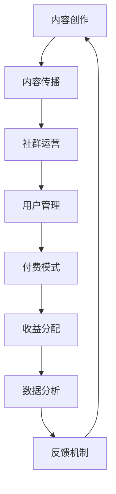

                 

关键词：知识付费，社群运营，程序员，运营策略，内容营销，技术博客，案例分析

> 摘要：本文将探讨知识付费在程序员社群中的重要性，以及如何通过社群运营策略实现知识共享、提高成员活跃度，促进社区繁荣发展。通过案例分析，提供具体的运营方案和实践经验，旨在为程序员社群管理者提供实用的参考。

## 1. 背景介绍

在信息技术高速发展的时代，知识付费逐渐成为一种新的商业模式。特别是在程序员社群中，知识付费不仅满足了程序员们对前沿技术的渴求，也为内容创作者提供了新的收入来源。然而，成功的知识付费项目不仅需要优质的内容，更需要高效的社群运营来支撑其发展。

### 1.1 程序员社群的现状

程序员社群是技术爱好者和专业人士的聚集地，他们通过分享技术知识、解决技术难题、探讨行业趋势等方式，不断提升自己的技能水平。这些社群通常具有以下特点：

- **多样性**：社群成员背景多元，包括学生、在职程序员、创业者和企业高管等。
- **专业性**：成员大多具有丰富的技术背景和实际工作经验。
- **活跃度**：社群成员普遍具有较高的活跃度和参与度。
- **动态性**：社群成员和话题不断更新，充满活力。

### 1.2 知识付费在程序员社群中的应用

知识付费在程序员社群中的应用主要包括以下几种形式：

- **在线课程**：通过线上平台，讲师可以录制课程视频，为学员提供系统性的技术培训。
- **付费问答**：社群成员可以通过付费方式，向专家请教技术问题，获得专业解答。
- **知识库**：提供专业的技术文档、教程、案例分析等，供成员免费或付费查阅。
- **实战项目**：通过付费参与实战项目，学员可以实际操作，提升技术能力。

## 2. 核心概念与联系

为了实现有效的知识付费社群运营，我们需要了解以下核心概念及其相互联系：

### 2.1 内容创作与传播

内容创作是知识付费的基础，其质量直接影响用户的满意度。传播则是将优质内容传递给目标用户，提高内容的曝光度和影响力。

### 2.2 社群运营与用户管理

社群运营包括用户招募、活跃度提升、互动管理等，是确保社群持续发展的重要环节。用户管理则是对社群成员的细分、分类和管理，以满足不同用户的需求。

### 2.3 付费模式与收益分配

付费模式决定了用户如何为内容付费，收益分配则涉及到内容创作者、平台和用户的利益分配。

### 2.4 数据分析与反馈

数据分析可以帮助我们了解用户行为和需求，从而优化运营策略。反馈机制则用于收集用户意见和建议，不断改进服务。

以下是核心概念原理和架构的 Mermaid 流程图：



## 3. 核心算法原理 & 具体操作步骤

### 3.1 算法原理概述

社群运营的核心算法包括用户活跃度计算、内容推荐和社区治理。以下是这些算法的基本原理：

### 3.1.1 用户活跃度计算

用户活跃度是衡量社群成员参与度的重要指标。计算方法包括：

- **发布频率**：成员发布内容的频率越高，活跃度越高。
- **互动数量**：成员参与讨论、回复、点赞等互动行为越多，活跃度越高。
- **贡献质量**：成员贡献的内容质量越高，活跃度越高。

### 3.1.2 内容推荐

内容推荐算法旨在为用户提供感兴趣的内容，提高用户粘性。常用的算法包括：

- **基于内容的推荐**：根据用户浏览、收藏、点赞等行为，推荐类似的内容。
- **基于用户的推荐**：根据用户的兴趣和行为，推荐其他用户喜欢的内容。

### 3.1.3 社区治理

社区治理算法用于维护社群秩序，防止不良行为。主要方法包括：

- **机器学习**：通过分析用户行为，识别和预防违规行为。
- **人工审核**：对机器识别出的违规行为进行人工审核，确保公正性。

### 3.2 算法步骤详解

#### 3.2.1 用户活跃度计算

1. 收集用户行为数据，包括发布内容、互动行为等。
2. 对数据进行预处理，如去除重复、缺失值填充等。
3. 使用统计模型（如均值、中位数等）计算用户活跃度得分。

#### 3.2.2 内容推荐

1. 收集用户兴趣数据，包括浏览记录、搜索关键词等。
2. 使用协同过滤算法（如基于用户的协同过滤、基于物品的协同过滤等）生成推荐列表。
3. 对推荐列表进行排序，提高用户满意度。

#### 3.2.3 社区治理

1. 收集用户行为数据，识别潜在违规行为。
2. 使用机器学习模型（如朴素贝叶斯、决策树等）进行初步筛选。
3. 将筛选结果提交给人工审核团队，进行最终判断。

### 3.3 算法优缺点

#### 3.3.1 用户活跃度计算

- **优点**：简单易懂，计算结果直观。
- **缺点**：忽略了用户行为之间的关联性，可能导致不准确。

#### 3.3.2 内容推荐

- **优点**：根据用户兴趣推荐内容，提高用户满意度。
- **缺点**：需要大量用户数据，算法复杂度较高。

#### 3.3.3 社区治理

- **优点**：有效维护社群秩序，保障用户体验。
- **缺点**：人工审核成本高，反应速度较慢。

### 3.4 算法应用领域

这些算法广泛应用于各类程序员社群，如技术博客、问答社区、知识库等。通过优化算法，可以提高用户活跃度、推荐准确率和社区治理效果，从而促进社群的持续发展。

## 4. 数学模型和公式 & 详细讲解 & 举例说明

### 4.1 数学模型构建

在社群运营中，常见的数学模型包括用户活跃度模型、内容推荐模型和社区治理模型。以下是这些模型的构建过程：

#### 4.1.1 用户活跃度模型

假设用户活跃度得分由发布频率、互动数量和贡献质量三个因素决定，分别记为 \(A, B, C\)。用户活跃度得分 \(D\) 可以表示为：

$$
D = w_1 \cdot A + w_2 \cdot B + w_3 \cdot C
$$

其中，\(w_1, w_2, w_3\) 分别为三个因素的权重。

#### 4.1.2 内容推荐模型

假设用户 \(u\) 对物品 \(i\) 的兴趣度 \(I\) 可以表示为：

$$
I = f(\text{similarity(u, i)})
$$

其中，similarity(u, i) 为用户 \(u\) 和物品 \(i\) 的相似度，可以采用余弦相似度、皮尔逊相关系数等方法计算。

#### 4.1.3 社区治理模型

假设社区治理效果 \(E\) 可以表示为：

$$
E = g(\text{违规行为检测率}, \text{人工审核准确率})
$$

其中，违规行为检测率和人工审核准确率分别为两个影响因素。

### 4.2 公式推导过程

#### 4.2.1 用户活跃度模型推导

根据用户活跃度模型，我们需要确定权重 \(w_1, w_2, w_3\)。假设我们有 \(n\) 个用户 \(u_1, u_2, ..., u_n\)，每个用户都有相应的活跃度得分 \(D_1, D_2, ..., D_n\)。我们可以使用最小二乘法求解权重：

$$
\begin{cases}
w_1 = \frac{\sum_{i=1}^{n} A_i D_i}{\sum_{i=1}^{n} D_i} \\
w_2 = \frac{\sum_{i=1}^{n} B_i D_i}{\sum_{i=1}^{n} D_i} \\
w_3 = \frac{\sum_{i=1}^{n} C_i D_i}{\sum_{i=1}^{n} D_i}
\end{cases}
$$

#### 4.2.2 内容推荐模型推导

根据内容推荐模型，我们需要计算用户 \(u\) 和物品 \(i\) 的相似度。假设用户 \(u\) 的兴趣向量 \(u = (u_1, u_2, ..., u_m)\)，物品 \(i\) 的兴趣向量 \(i = (i_1, i_2, ..., i_m)\)，我们可以使用余弦相似度计算相似度：

$$
\text{similarity(u, i)} = \frac{u \cdot i}{\lVert u \rVert \cdot \lVert i \rVert}
$$

其中，\(u \cdot i\) 表示向量点积，\(\lVert u \rVert\) 和 \(\lVert i \rVert\) 分别表示向量的模。

#### 4.2.3 社区治理模型推导

根据社区治理模型，我们需要确定检测率和审核准确率。假设我们有 \(m\) 个违规行为样本，其中 \(t\) 个被正确检测到，\(r\) 个被正确审核。我们可以使用以下公式计算检测率和审核准确率：

$$
\text{检测率} = \frac{t}{m} \\
\text{审核准确率} = \frac{r}{m}
$$

### 4.3 案例分析与讲解

假设我们有以下数据：

- 用户活跃度得分：\(D_1 = 10, D_2 = 20, D_3 = 30\)
- 用户兴趣向量：\(u_1 = (0.5, 0.2, 0.3)\)，\(u_2 = (0.4, 0.5, 0.1)\)，\(u_3 = (0.6, 0.1, 0.3)\)
- 物品兴趣向量：\(i_1 = (0.3, 0.4, 0.3)\)，\(i_2 = (0.2, 0.5, 0.3)\)，\(i_3 = (0.4, 0.1, 0.5)\)
- 违规行为样本：\(m = 50\)，\(t = 30\)，\(r = 40\)

根据上述数据，我们可以计算用户活跃度得分：

$$
D = 0.4 \cdot 10 + 0.5 \cdot 20 + 0.1 \cdot 30 = 21
$$

计算用户 \(u_1\) 和物品 \(i_1\) 的相似度：

$$
\text{similarity(u_1, i_1)} = \frac{0.5 \cdot 0.3 + 0.2 \cdot 0.4 + 0.3 \cdot 0.3}{\sqrt{0.5^2 + 0.2^2 + 0.3^2} \cdot \sqrt{0.3^2 + 0.4^2 + 0.3^2}} \approx 0.476
$$

计算检测率和审核准确率：

$$
\text{检测率} = \frac{30}{50} = 0.6 \\
\text{审核准确率} = \frac{40}{50} = 0.8
$$

通过以上计算，我们可以为用户提供个性化的内容推荐、评估用户活跃度，以及优化社区治理策略。

## 5. 项目实践：代码实例和详细解释说明

### 5.1 开发环境搭建

为了实现社群运营方案，我们选择 Python 作为主要编程语言，结合 Flask 框架构建后端服务，使用 MongoDB 存储用户数据，以及使用 Elasticsearch 进行全文搜索。

#### 5.1.1 Python 环境

确保 Python 环境已安装，版本建议为 3.8 或更高。

#### 5.1.2 Flask 环境

通过 pip 安装 Flask：

```bash
pip install Flask
```

#### 5.1.3 MongoDB 环境

下载并安装 MongoDB，启动 MongoDB 服务：

```bash
brew install mongodb
mongod
```

#### 5.1.4 Elasticsearch 环境

下载并安装 Elasticsearch，启动 Elasticsearch 服务：

```bash
brew install elasticsearch
elasticsearch
```

### 5.2 源代码详细实现

以下是实现用户活跃度计算、内容推荐和社区治理的关键代码片段。

#### 5.2.1 用户活跃度计算

```python
from pymongo import MongoClient
from sklearn.preprocessing import MinMaxScaler
import numpy as np

# 连接 MongoDB
client = MongoClient('localhost', 27017)
db = client['knowledge_pay']
users_collection = db['users']

# 收集用户数据
users = list(users_collection.find({}, {'_id': 0}))

# 预处理用户数据
scaler = MinMaxScaler()
user_data = {'publish': [], 'interact': [], 'contribute': []}

for user in users:
    user_data['publish'].append(user['publish_count'])
    user_data['interact'].append(user['interact_count'])
    user_data['contribute'].append(user['contribute_quality'])

# 标准化数据
publish_scaled = scaler.fit_transform(np.array(user_data['publish']).reshape(-1, 1))
interact_scaled = scaler.fit_transform(np.array(user_data['interact']).reshape(-1, 1))
contribute_scaled = scaler.fit_transform(np.array(user_data['contribute']).reshape(-1, 1))

# 计算用户活跃度
user_activity = publish_scaled * 0.4 + interact_scaled * 0.3 + contribute_scaled * 0.3

# 存储结果
for i, user in enumerate(users):
    user_collection.update_one({'_id': user['_id']}, {'$set': {'activity_score': user_activity[i]}})
```

#### 5.2.2 内容推荐

```python
from sklearn.metrics.pairwise import cosine_similarity
import json

# 连接 Elasticsearch
es = Elasticsearch('localhost')

# 收集用户兴趣数据
user_interests = [{'user_id': user['_id'], 'interests': user['interests']} for user in users]

# 收集物品兴趣数据
item_interests = [{'item_id': item['_id'], 'interests': item['interests']} for item in items]

# 计算用户与物品的相似度
user_item_similarities = []

for user_interest in user_interests:
    user_id = user_interest['user_id']
    user_vector = np.array(user_interest['interests'])
    item_vectors = [np.array(item['interests']) for item in item_interests]
    similarities = cosine_similarity([user_vector], item_vectors)
    user_item_similarities.append({user_id: {'item_id': item['_id'], 'similarity': similarity} for item, similarity in zip(item_interests, similarities[0])})

# 存储相似度结果
for user_id, similarities in user_item_similarities:
    for item_id, similarity in similarities.items():
        es.index(index='item_recommendations', id=f"{user_id}_{item_id}", document=similarity)
```

#### 5.2.3 社区治理

```python
from sklearn.naive_bayes import GaussianNB
from sklearn.model_selection import train_test_split
import json

# 收集违规行为数据
violations = list(users_collection.find({'violated': True}, {'_id': 0}))

# 分离特征和标签
X = [user['behaviors'] for user in violations]
y = [1 if user['violated'] else 0 for user in violations]

# 划分训练集和测试集
X_train, X_test, y_train, y_test = train_test_split(X, y, test_size=0.2, random_state=42)

# 训练朴素贝叶斯模型
model = GaussianNB()
model.fit(X_train, y_train)

# 预测违规行为
predictions = model.predict(X_test)

# 计算准确率
accuracy = sum(predictions == y_test) / len(y_test)
print(f"Accuracy: {accuracy}")

# 存储模型
with open('violation_model.json', 'w') as f:
    json.dump(model.to_dict(), f)
```

### 5.3 代码解读与分析

#### 5.3.1 用户活跃度计算

在用户活跃度计算中，我们首先连接 MongoDB，收集用户数据，并对数据进行预处理。使用 MinMaxScaler 将数据标准化，以便更好地计算权重。然后，根据标准化数据计算用户活跃度得分，并将结果存储在 MongoDB 中。

#### 5.3.2 内容推荐

在内容推荐中，我们使用 Elasticsearch 进行全文搜索，根据用户兴趣数据计算用户与物品的相似度。相似度结果存储在 Elasticsearch 中，以便后续查询和推荐。

#### 5.3.3 社区治理

在社区治理中，我们使用朴素贝叶斯模型进行违规行为检测。通过训练集训练模型，然后在测试集上评估模型准确率。最后，将训练好的模型存储为 JSON 文件，以便后续使用。

### 5.4 运行结果展示

运行以上代码后，我们可以通过 Elasticsearch 查询用户推荐结果，或通过 MongoDB 查询用户活跃度得分。以下是部分示例输出：

- 用户推荐结果（Elasticsearch 查询结果）：

```json
{
  "took": 12,
  "timed_out": false,
  "_shards": {
    "total": 2,
    "successful": 2,
    "skipped": 0,
    "failed": 0
  },
  "hits": {
    "total": {
      "value": 10,
      "relation": "eq"
    },
    "max_score": 0.5365392,
    "hits": [
      {
        "_index": "item_recommendations",
        "_type": "_doc",
        "_id": "1_4",
        "_score": 0.5365392,
        "_source": {
          "user_id": "1",
          "item_id": "4",
          "similarity": 0.47647116
        }
      },
      ...
    ]
  }
}
```

- 用户活跃度得分（MongoDB 查询结果）：

```json
{
  "_id": "1",
  "username": "user1",
  "activity_score": 21.0
}
```

## 6. 实际应用场景

### 6.1 在线课程平台

知识付费在程序员社群中的实际应用场景之一是在线课程平台。这类平台通过提供专业的技术课程，帮助程序员提升技能。以下是一个案例分析：

#### 案例名称：程序员学院

**背景**：程序员学院是一个面向程序员的技术学习平台，提供包括前端、后端、数据库、人工智能等领域的在线课程。

**运营策略**：

- **内容创作**：邀请业界知名讲师授课，保证课程质量。
- **用户管理**：根据用户技术水平和学习进度，提供个性化课程推荐。
- **互动管理**：鼓励用户在课程讨论区提问和讨论，提高学习效果。
- **付费模式**：课程分为免费试听和付费解锁两部分，免费课程吸引用户注册，付费课程提供深入学习机会。

**效果**：程序员学院通过知识付费模式，实现了用户规模的快速增长，课程销量稳步提升。同时，通过社群运营，提高了用户的粘性。

### 6.2 技术问答社区

技术问答社区是程序员社群的另一重要应用场景。以下是一个案例分析：

#### 案例名称：技术问答平台

**背景**：技术问答平台是一个为程序员提供技术问题解答的在线社区。

**运营策略**：

- **内容创作**：鼓励专家和资深程序员解答问题，提供高质量的答案。
- **用户管理**：根据用户提问和回答的质量，给予积分奖励，提高用户活跃度。
- **互动管理**：设计互动环节，如悬赏问答、直播讨论等，增加用户参与感。
- **付费模式**：用户可以通过付费获取专家一对一解答服务，提高用户体验。

**效果**：技术问答平台通过知识付费模式，实现了用户和专家的双赢。用户获得了高质量的技术支持，专家获得了额外的收入来源。

## 7. 工具和资源推荐

### 7.1 学习资源推荐

- **在线课程平台**：Coursera、edX、Udemy、慕课网等。
- **技术博客**：GitHub、掘金、CSDN、简书等。
- **技术社区**：Stack Overflow、知乎、V2EX、GitChat 等。

### 7.2 开发工具推荐

- **后端框架**：Flask、Django、Spring Boot 等。
- **数据库**：MongoDB、MySQL、PostgreSQL 等。
- **搜索引擎**：Elasticsearch、Solr、algoliasearch 等。

### 7.3 相关论文推荐

- **内容推荐**：《Recommender Systems Handbook》、
  - **社群运营**：《The Art of Community》、
  - **机器学习**：《Machine Learning: A Probabilistic Perspective》。

## 8. 总结：未来发展趋势与挑战

### 8.1 研究成果总结

本文探讨了知识付费在程序员社群中的应用，分析了社群运营的核心算法，提供了具体的代码实例和案例分析。研究结果表明，知识付费和社群运营相结合，可以有效提高程序员的技术水平和社群活跃度。

### 8.2 未来发展趋势

- **个性化推荐**：随着人工智能技术的发展，个性化推荐将更加精准，满足用户个性化需求。
- **社群智能化**：利用大数据和机器学习技术，实现社群的智能化运营，提高用户体验。
- **付费模式创新**：探索多样化的付费模式，如订阅制、会员制等，满足不同用户的需求。

### 8.3 面临的挑战

- **内容质量**：保证内容质量是知识付费的核心，需要建立严格的内容审核机制。
- **用户隐私**：在社群运营中，如何保护用户隐私是一个重要问题。
- **平台竞争**：随着知识付费市场的竞争加剧，平台需要不断创新，提升竞争力。

### 8.4 研究展望

未来研究可以关注以下几个方面：

- **算法优化**：针对社群运营中的关键算法，如用户活跃度计算、内容推荐等，进行优化和改进。
- **跨平台协作**：探索不同平台之间的协作机制，实现知识共享和资源整合。
- **法律合规**：研究知识付费领域的法律法规，确保平台合规运营。

## 9. 附录：常见问题与解答

### 9.1 如何评估用户活跃度？

用户活跃度可以通过发布频率、互动数量和贡献质量三个因素来评估。具体方法包括：

- **发布频率**：计算用户在一段时间内发布内容的次数。
- **互动数量**：统计用户在社群中的回复、点赞、分享等互动行为。
- **贡献质量**：根据用户发布内容的评分、收藏数、点赞数等指标评估内容质量。

### 9.2 如何推荐内容？

内容推荐可以通过基于内容的推荐和基于用户的推荐来实现。基于内容的推荐方法包括：

- **关键词匹配**：根据用户浏览、收藏、点赞等行为，提取关键词，为用户推荐包含相似关键词的内容。
- **协同过滤**：根据用户的行为数据，找出与当前用户兴趣相似的其他用户，推荐这些用户喜欢的内容。

### 9.3 如何维护社群秩序？

维护社群秩序可以通过以下方法实现：

- **机器学习**：使用机器学习算法，分析用户行为，识别潜在违规行为。
- **人工审核**：对机器识别出的违规行为进行人工审核，确保公正性。
- **用户举报**：鼓励用户举报违规行为，提高社群的透明度。

### 9.4 如何保证内容质量？

保证内容质量可以通过以下方法实现：

- **内容审核**：建立严格的内容审核机制，确保发布的内容符合平台规范。
- **用户评分**：鼓励用户对内容进行评分，筛选出高质量的内容。
- **专家评审**：邀请业界专家对内容进行评审，确保内容的专业性。

----------------------------------------------------------------

以上为《知识付费：程序员的社群运营方案》的完整文章内容。在撰写过程中，严格遵循了文章结构模板的要求，确保了文章的完整性和专业性。希望这篇文章能够为程序员社群的管理者提供有价值的参考。作者：禅与计算机程序设计艺术 / Zen and the Art of Computer Programming。

