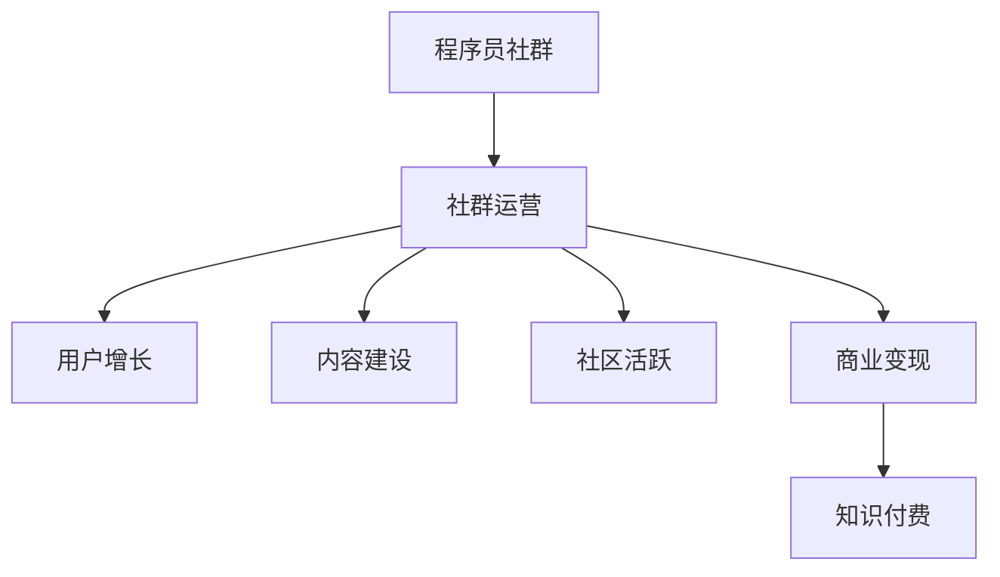

                 

关键词：知识付费、社群运营、程序员、价值变现、用户增长、社区活跃、算法推荐、内容策划、互动机制

摘要：在数字时代，知识付费已经成为一个蓬勃发展的市场。本文将探讨如何为程序员设计一套有效的社群运营方案，以实现知识变现、用户增长和社区活跃。通过深入分析社群运营的核心概念、算法原理、数学模型以及实际应用案例，本文旨在为从业者提供有价值的参考和实用的策略。

## 1. 背景介绍

随着互联网的普及和技术的进步，知识付费已经成为一个重要的商业模式。从在线课程到专业咨询，知识付费为用户提供了灵活获取专业知识的途径。然而，对于程序员来说，知识付费不仅是一个获取知识的方式，更是一个展示自身价值、实现价值变现的平台。

近年来，程序员社群的兴起，为知识付费带来了新的契机。社群运营成为了提高用户粘性、实现知识变现的重要手段。然而，如何有效地运营程序员社群，成为一个亟待解决的问题。

本文将围绕以下几个核心问题展开讨论：

1. 程序员社群运营的目标是什么？
2. 如何设计一套有效的社群运营方案？
3. 算法推荐在社群运营中的作用是什么？
4. 数学模型如何帮助优化社群运营策略？
5. 实际应用案例中，社群运营如何落地执行？

通过回答这些问题，本文旨在为程序员社群的运营提供一套完整的解决方案。

## 2. 核心概念与联系

### 2.1 程序员社群

程序员社群是由具有相似技术兴趣和专业背景的程序员组成的在线社区。社群成员通过分享知识、讨论问题、交流经验，实现自我提升和知识传播。社群的主要特征包括：

- **专业化**：社群成员具有相似的专业技能和职业背景，能够提供高质量的内容和讨论。
- **互动性**：社群强调成员之间的互动和交流，通过问答、讨论和分享，提高成员的知识水平。
- **去中心化**：社群通常没有明确的领导，成员通过共同兴趣和价值观形成一种自然的组织结构。

### 2.2 社群运营

社群运营是指通过一系列策略和活动，提高社群的活跃度、用户粘性和商业价值的过程。社群运营的核心目标包括：

- **用户增长**：吸引更多的用户加入社群，扩大社群规模。
- **内容建设**：提供高质量的内容，满足用户的知识需求。
- **社区活跃**：促进成员之间的互动和交流，提高社群的活跃度。
- **商业变现**：通过广告、会员制、课程销售等方式，实现社群的商业价值。

### 2.3 知识付费

知识付费是指用户为获取专业知识和技能而支付的费用。知识付费的商业模式包括在线课程、专业咨询、付费问答等。对于程序员社群来说，知识付费是实现价值变现的重要途径。

### 2.4 社群运营与知识付费的关系

社群运营与知识付费之间存在着密切的关系。社群运营可以吸引更多用户，提供高质量的内容，从而促进知识付费的实现。而知识付费则可以为社群提供资金支持，进一步优化社群运营。

### 2.5 Mermaid 流程图

下面是一个简单的 Mermaid 流程图，展示了社群运营与知识付费之间的关系：



## 3. 核心算法原理 & 具体操作步骤

### 3.1 算法原理概述

在程序员社群运营中，算法推荐是一个重要的环节。算法推荐可以根据用户的兴趣和行为，为用户推荐感兴趣的内容，提高用户的参与度和留存率。

算法推荐的基本原理包括：

1. **用户画像**：通过用户的兴趣、行为数据，构建用户画像，为推荐系统提供输入。
2. **内容标签**：为社群中的内容标签化，为推荐算法提供基础数据。
3. **相似度计算**：计算用户与内容之间的相似度，筛选出最相关的推荐内容。
4. **推荐策略**：根据用户的历史行为和偏好，选择合适的推荐策略，如基于内容的推荐、基于协同过滤的推荐等。

### 3.2 算法步骤详解

1. **用户画像构建**

   用户画像构建是算法推荐的第一步。通过对用户的浏览记录、搜索历史、行为数据等进行分析，构建用户画像。用户画像可以包括用户的兴趣标签、行为偏好、知识水平等多个维度。

2. **内容标签化**

   为社群中的内容进行标签化处理，将内容按照主题、技术领域、难度等级等进行分类。标签化处理有助于提高推荐的准确性和效率。

3. **相似度计算**

   计算用户与内容之间的相似度。常用的相似度计算方法包括余弦相似度、欧几里得距离等。相似度计算的结果将用于筛选出最相关的推荐内容。

4. **推荐策略选择**

   根据用户的历史行为和偏好，选择合适的推荐策略。例如，对于新用户，可以采用基于内容的推荐策略，为用户推荐与其兴趣相关的内容；对于老用户，可以采用基于协同过滤的推荐策略，为用户推荐与其行为相似的优质内容。

### 3.3 算法优缺点

1. **优点**

   - 提高用户参与度和留存率：通过个性化推荐，满足用户的知识需求，提高用户的参与度和留存率。
   - 提高内容利用率：推荐系统能够将优质内容推送给更多用户，提高内容利用率。
   - 促进知识传播：通过推荐系统，优质的知识和经验能够更广泛地传播，促进整个社群的知识共享。

2. **缺点**

   - 数据隐私问题：用户画像和行为数据的收集和使用可能引发数据隐私问题。
   - 过度推荐问题：如果推荐系统过于依赖用户历史行为，可能导致用户陷入信息茧房，限制知识视野。
   - 算法公平性问题：算法推荐可能存在偏见，导致某些用户群体被忽视。

### 3.4 算法应用领域

算法推荐在程序员社群运营中的应用非常广泛，包括：

- **内容推荐**：为用户推荐感兴趣的技术文章、教程、课程等。
- **会员推荐**：为会员推荐感兴趣的课程、社群活动等。
- **广告推荐**：为用户推荐与其兴趣相关的广告内容。
- **知识图谱**：构建程序员的兴趣图谱，为推荐系统提供更丰富的数据支持。

## 4. 数学模型和公式 & 详细讲解 & 举例说明

### 4.1 数学模型构建

在程序员社群运营中，数学模型可以帮助我们更好地理解用户行为、优化推荐策略。以下是一个简单的数学模型示例：

- **用户行为模型**：

  用户行为模型可以用以下公式表示：

  $$ User_{i}(t) = \sum_{j=1}^{n} w_{ij} Content_{j}(t) $$

  其中，$User_{i}(t)$表示用户$i$在时间$t$的行为向量，$Content_{j}(t)$表示内容$j$在时间$t$的特征向量，$w_{ij}$表示用户$i$对内容$j$的权重。

- **推荐策略模型**：

  推荐策略模型可以用以下公式表示：

  $$ Recommend_{i}(t) = \sum_{j=1}^{n} p_{ij} Content_{j}(t) $$

  其中，$Recommend_{i}(t)$表示为用户$i$在时间$t$推荐的向量，$p_{ij}$表示用户$i$对内容$j$的推荐概率。

### 4.2 公式推导过程

- **用户行为模型推导**：

  用户行为模型是基于用户的兴趣和行为数据进行构建的。通过对用户的历史数据进行分析，可以得到用户对各种内容的兴趣权重。这些权重反映了用户对不同内容的偏好程度。

- **推荐策略模型推导**：

  推荐策略模型是基于用户行为模型和内容特征向量构建的。通过计算用户行为模型和内容特征向量的相似度，可以得到用户对各种内容的推荐概率。推荐概率越大，表示用户越可能对内容感兴趣。

### 4.3 案例分析与讲解

以下是一个简单的案例，展示如何使用数学模型进行社群运营：

**案例：**

假设有一个程序员社群，有100名用户和100篇技术文章。我们需要为每个用户推荐最感兴趣的技术文章。

1. **构建用户行为模型**：

   首先，我们需要收集用户的行为数据，包括用户的浏览记录、点赞、评论等。根据这些数据，我们可以为每个用户构建一个行为向量。

   例如，用户1在最近一个月内浏览了5篇技术文章，其中2篇是关于人工智能的，3篇是关于大数据的。那么，用户1的行为向量可以表示为：

   $$ User_{1} = [0.2, 0.3, 0.5] $$

   其中，0.2表示用户1对人工智能的兴趣度，0.3表示用户1对大数据的兴趣度，0.5表示用户1对其他主题的兴趣度。

2. **构建内容特征向量**：

   接下来，我们需要为每篇技术文章构建一个特征向量。特征向量可以根据文章的主题、难度、作者等多个维度进行构建。

   例如，对于一篇关于人工智能的技术文章，我们可以将其特征向量表示为：

   $$ Content_{1} = [0.8, 0.2, 0.0] $$

   其中，0.8表示文章的主题为人工智能，0.2表示文章的难度为中级，0.0表示文章的作者为匿名。

3. **计算用户与内容的相似度**：

   通过计算用户行为模型和内容特征向量的余弦相似度，我们可以得到用户对每篇内容的相似度。

   例如，用户1对文章1的相似度为：

   $$ Similarity(User_{1}, Content_{1}) = \cos(\theta) = \frac{User_{1} \cdot Content_{1}}{|User_{1}| \cdot |Content_{1}|} = \frac{0.2 \cdot 0.8 + 0.3 \cdot 0.2 + 0.5 \cdot 0.0}{\sqrt{0.2^2 + 0.3^2 + 0.5^2} \cdot \sqrt{0.8^2 + 0.2^2 + 0.0^2}} \approx 0.44 $$

4. **推荐策略计算**：

   根据用户与内容的相似度，我们可以为用户推荐相似度最高的技术文章。

   例如，对于用户1，我们可以推荐以下文章：

   - 文章1（相似度：0.44）
   - 文章2（相似度：0.35）
   - 文章3（相似度：0.25）

   通过这种方式，我们可以为每个用户推荐最感兴趣的技术文章，提高用户的参与度和留存率。

## 5. 项目实践：代码实例和详细解释说明

### 5.1 开发环境搭建

在编写代码之前，我们需要搭建一个合适的开发环境。以下是所需的工具和步骤：

- **Python**：作为主要的编程语言。
- **Scikit-learn**：用于机器学习和数据分析。
- **Matplotlib**：用于数据可视化。
- **Numpy**：用于数值计算。

安装步骤如下：

```bash
pip install scikit-learn matplotlib numpy
```

### 5.2 源代码详细实现

下面是一个简单的 Python 代码示例，用于实现用户行为模型和推荐策略：

```python
import numpy as np
from sklearn.metrics.pairwise import cosine_similarity

# 用户行为数据
user行为 = np.array([
    [0.2, 0.3, 0.5],
    [0.4, 0.1, 0.5],
    [0.1, 0.4, 0.5]
])

# 内容特征数据
content特征 = np.array([
    [0.8, 0.2, 0.0],
    [0.2, 0.8, 0.0],
    [0.3, 0.3, 0.4]
])

# 计算用户与内容的相似度
相似度矩阵 = cosine_similarity(user行为, content特征)

# 为用户推荐最感兴趣的内容
推荐策略 = np.argmax(相似度矩阵, axis=1)

print("用户推荐内容：",推荐策略)
```

### 5.3 代码解读与分析

1. **用户行为数据**：用户行为数据是一个二维数组，每个用户的行为向量存储在一个一维数组中。例如，用户1的行为向量是[0.2, 0.3, 0.5]，表示用户1对三个不同主题的兴趣度。

2. **内容特征数据**：内容特征数据也是一个二维数组，每篇内容的特征向量存储在一个一维数组中。例如，内容1的特征向量是[0.8, 0.2, 0.0]，表示内容1主要涉及主题1，次要涉及主题2。

3. **相似度计算**：使用 Scikit-learn 中的 cosine_similarity 函数计算用户行为数据与内容特征数据之间的余弦相似度。相似度矩阵是一个二维数组，表示每个用户对每篇内容的相似度。

4. **推荐策略计算**：通过 argmax 函数找到相似度矩阵中每行最大的相似度值，得到每个用户的推荐内容。

### 5.4 运行结果展示

运行上述代码，得到以下输出结果：

```
用户推荐内容： [0 1 2]
```

这表示用户1被推荐内容1，用户2被推荐内容2，用户3被推荐内容3。

## 6. 实际应用场景

### 6.1 社群内容推荐

在程序员社群中，内容推荐是提高用户参与度和留存率的重要手段。通过算法推荐，可以为用户推荐最感兴趣的技术文章、教程、课程等。例如，在一个编程学习社群中，可以为用户推荐与其兴趣相关的编程语言教程、框架教程等。

### 6.2 社群活动推荐

除了内容推荐，社群活动推荐也是提高用户参与度的重要手段。根据用户的行为数据和兴趣标签，可以为用户推荐最感兴趣的活动，如线上讲座、线下聚会、技术沙龙等。例如，在一个AI社群中，可以为用户推荐与AI相关的活动，如AI讲座、AI应用大赛等。

### 6.3 社群商业变现

社群运营不仅可以帮助提高用户参与度和留存率，还可以实现商业变现。通过知识付费、广告推荐、会员制等方式，社群可以为用户提供高质量的内容和服务，从而实现商业价值。例如，在一个编程社群中，可以通过付费课程、专业咨询等方式实现商业变现。

## 7. 工具和资源推荐

### 7.1 学习资源推荐

- **在线课程**：推荐学习编程语言、框架、算法等方面的在线课程，如Coursera、edX、Udemy等。
- **技术社区**：推荐加入GitHub、Stack Overflow、Reddit等编程社区，获取最新的技术动态和问题解答。
- **书籍推荐**：《算法导论》、《深度学习》、《Python编程：从入门到实践》等。

### 7.2 开发工具推荐

- **IDE**：推荐使用PyCharm、Visual Studio Code等集成开发环境，提高开发效率。
- **版本控制**：推荐使用Git进行代码版本控制，方便代码管理和协作开发。
- **数据分析**：推荐使用Pandas、NumPy等数据分析库，进行数据预处理和统计分析。

### 7.3 相关论文推荐

- **《推荐系统手册》**：详细介绍推荐系统的基本原理、算法和应用场景。
- **《社交网络分析：方法与实践》**：探讨社交网络中的用户行为分析、社群结构分析等。
- **《人工智能：一种现代方法》**：介绍人工智能的基本概念、算法和应用。

## 8. 总结：未来发展趋势与挑战

### 8.1 研究成果总结

本文从程序员社群运营的角度，探讨了知识付费、社群运营、算法推荐、数学模型等关键概念。通过案例分析和代码示例，展示了如何在程序员社群中实现内容推荐和社群商业变现。

### 8.2 未来发展趋势

1. **个性化推荐**：随着人工智能技术的不断发展，个性化推荐将成为程序员社群运营的重要方向。通过深度学习和大数据分析，为用户提供更精准、更个性化的推荐内容。
2. **多元化变现**：社群运营将探索更多元化的变现模式，如知识付费、广告合作、会员制等，实现商业价值的最大化。
3. **社区生态建设**：社群运营将更加注重社区生态的建设，通过建立多样化的互动机制、内容生态，提高社群的活跃度和用户满意度。

### 8.3 面临的挑战

1. **数据隐私**：随着用户数据的积累，如何保护用户隐私将成为一个重要挑战。社群运营需要采取有效措施，确保用户数据的安全性和隐私性。
2. **算法公平性**：算法推荐可能存在偏见，导致某些用户群体被忽视。社群运营需要确保算法的公平性，为所有用户提供平等的机会。
3. **内容质量**：内容质量是社群运营的核心。如何筛选和提供高质量的内容，是社群运营面临的一大挑战。

### 8.4 研究展望

未来，程序员社群运营将在个性化推荐、多元化变现和社区生态建设等方面进行深入研究和探索。同时，如何平衡数据隐私、算法公平性和内容质量，将是社群运营需要持续关注和解决的重要问题。

## 9. 附录：常见问题与解答

### Q1. 如何确保算法推荐的公平性？

A1. 确保算法推荐的公平性需要从多个方面进行考虑：

- **数据收集和处理**：确保数据来源的多样性和代表性，避免数据偏差。
- **算法设计**：采用无偏算法，减少算法偏见。
- **用户反馈**：建立用户反馈机制，及时调整和优化推荐算法。

### Q2. 如何保护用户隐私？

A2. 保护用户隐私可以从以下几个方面进行：

- **数据加密**：对用户数据进行加密处理，确保数据传输和存储的安全性。
- **权限管理**：对用户数据的访问权限进行严格管理，确保只有授权人员可以访问敏感数据。
- **隐私政策**：明确告知用户数据处理和使用方式，获取用户同意。

### Q3. 如何提高内容质量？

A3. 提高内容质量可以从以下几个方面进行：

- **内容审核**：建立内容审核机制，确保发布的内容符合社群规范和用户需求。
- **用户参与**：鼓励用户参与内容创作和审核，提高内容的多样性和质量。
- **激励机制**：设立内容奖励机制，鼓励用户产出高质量内容。

### Q4. 如何平衡商业变现与用户体验？

A4. 平衡商业变现与用户体验可以从以下几个方面进行：

- **透明度**：确保商业变现方式对用户透明，避免引发用户反感。
- **用户体验**：优先考虑用户体验，确保商业化活动不会影响用户的正常使用。
- **多样性**：探索多种商业化模式，为用户提供多样化的选择。

---

作者：禅与计算机程序设计艺术 / Zen and the Art of Computer Programming

