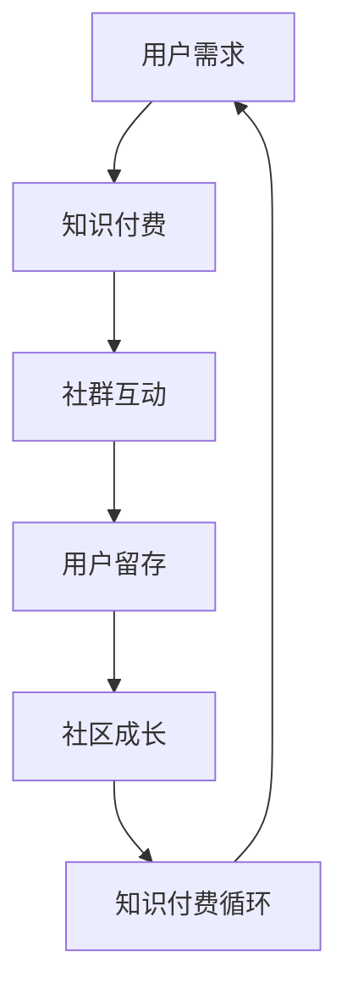

                 

关键词：知识付费、程序员、社群运营、方法、策略

> 摘要：本文旨在探讨程序员的社群运营方法，通过分析知识付费的现状、社群运营的核心要素以及具体的运营策略，帮助程序员构建高效、可持续的社群，实现知识共享与成长。

## 1. 背景介绍

在互联网时代，知识付费已经成为一种主流的商业模式。知识付费指的是用户为获取特定领域的专业知识和技能而支付的费用，这些知识和技能可以以课程、电子书、文章、直播等形式呈现。随着技术进步和用户需求的变化，知识付费市场呈现出快速增长的趋势。

程序员作为知识付费的重要参与者，他们在社群中分享经验、学习新技术，以及帮助他人解决问题。然而，如何有效地运营一个程序员社群，使其成为知识共享和成长的平台，成为当前的一个热门话题。

本文将探讨以下问题：

- 知识付费在程序员社群中的应用现状如何？
- 社群运营的核心要素是什么？
- 程序员社群运营的具体策略有哪些？
- 如何评估社群运营的效果？

## 2. 核心概念与联系

### 2.1 知识付费

知识付费是指用户为获取特定领域的知识和技能而支付的费用。在程序员社群中，知识付费通常表现为付费课程、付费问答、付费咨询等形式。知识付费能够为用户提供高质量的、针对性的知识和服务，同时也能为内容创作者带来收入。

### 2.2 社群运营

社群运营是指通过一系列策略和活动，吸引和维护社群成员，促进知识共享和互动。在程序员社群中，运营的核心目标是提高成员的参与度和活跃度，使其成为持续学习和成长的空间。

### 2.3 社群运营与知识付费的关系

社群运营与知识付费相辅相成。社群运营为知识付费提供了平台和用户基础，而知识付费则为社群运营提供了资金支持和内容来源。二者共同构成了一个良性循环，促进了社群的发展和壮大。

### 2.4 Mermaid 流程图

以下是一个简化的程序员社群运营流程图：



## 3. 核心算法原理 & 具体操作步骤

### 3.1 算法原理概述

程序员社群运营的核心算法是基于用户参与度和活跃度的计算。通过分析用户在社群中的行为数据，如发帖、回复、点赞、分享等，可以计算出用户的活跃度。然后，根据活跃度对用户进行分类，并制定相应的运营策略。

### 3.2 算法步骤详解

1. 数据采集：收集用户在社群中的行为数据，如发帖、回复、点赞、分享等。
2. 数据处理：对行为数据进行预处理，如去重、过滤无效数据等。
3. 活跃度计算：根据用户的行为数据，计算用户的活跃度。活跃度可以用一个数值表示，数值越大，活跃度越高。
4. 用户分类：根据活跃度对用户进行分类，如高活跃度用户、中活跃度用户、低活跃度用户等。
5. 运营策略制定：根据用户分类，制定相应的运营策略。如对高活跃度用户进行激励，对低活跃度用户进行提醒和引导等。
6. 实施策略：执行制定的运营策略，如发送私信、发布活动等。
7. 效果评估：评估运营策略的效果，如用户活跃度是否提高等。

### 3.3 算法优缺点

优点：

- 能够实时反映用户活跃度，及时调整运营策略。
- 可以提高社群成员的参与度和活跃度。

缺点：

- 需要大量数据支持，对数据采集和处理能力要求较高。
- 可能会引发用户反感，如过度推送、骚扰等。

### 3.4 算法应用领域

- 程序员社群运营
- 电商社群运营
- 社交媒体运营

## 4. 数学模型和公式 & 详细讲解 & 举例说明

### 4.1 数学模型构建

假设用户 $u$ 在社群中的活跃度 $A(u)$ 可以通过以下公式计算：

$$A(u) = \frac{1}{N} \sum_{i=1}^{N} w_i \cdot b_i(u)$$

其中，$N$ 表示用户在社群中的行为类型总数，$w_i$ 表示第 $i$ 种行为类型的权重，$b_i(u)$ 表示用户 $u$ 在第 $i$ 种行为类型上的得分。

### 4.2 公式推导过程

推导活跃度计算公式，需要考虑以下几个因素：

- 用户在社群中的行为多样性：用户在社群中的行为类型可能包括发帖、回复、点赞、分享等。为了全面反映用户的行为多样性，需要对每种行为类型赋予不同的权重。
- 用户行为的重要性：不同用户行为对社群的贡献程度可能不同。例如，发帖和分享可能比点赞和回复更有价值。因此，需要为不同行为类型设定不同的权重。
- 用户行为的时间衰减：用户在社群中的行为随着时间的推移会逐渐减弱。为了体现这一点，可以对用户的行为得分进行时间衰减处理。

### 4.3 案例分析与讲解

假设一个社群中有以下三种行为类型：发帖、回复、点赞。设定如下权重：

- 发帖：权重为 3
- 回复：权重为 2
- 点赞：权重为 1

用户 $u$ 在一个月内进行了以下行为：

- 发帖：10 次
- 回复：5 次
- 点赞：20 次

用户 $u$ 的活跃度计算如下：

$$A(u) = \frac{1}{3} \cdot (3 \cdot 10 + 2 \cdot 5 + 1 \cdot 20) = \frac{1}{3} \cdot (30 + 10 + 20) = \frac{60}{3} = 20$$

用户 $u$ 的活跃度为 20。

## 5. 项目实践：代码实例和详细解释说明

### 5.1 开发环境搭建

假设我们使用 Python 语言进行程序员社群运营算法的实现。首先，需要安装以下依赖库：

- Pandas：用于数据预处理
- Numpy：用于数值计算
- Matplotlib：用于数据可视化

安装命令如下：

```bash
pip install pandas numpy matplotlib
```

### 5.2 源代码详细实现

以下是一个简单的程序员社群运营算法实现：

```python
import pandas as pd
import numpy as np
import matplotlib.pyplot as plt

# 定义用户行为数据
data = {
    'user': ['u1', 'u2', 'u3'],
    'post': [10, 5, 20],
    'reply': [3, 7, 2],
    'like': [2, 15, 8]
}

# 创建 DataFrame
df = pd.DataFrame(data)

# 定义权重
weights = {
    'post': 3,
    'reply': 2,
    'like': 1
}

# 计算活跃度
df['activity'] = df.apply(lambda x: sum(weights[key] * x[key] for key in x.index if key in weights), axis=1)

# 打印结果
print(df)

# 可视化活跃度分布
plt.hist(df['activity'], bins=10, alpha=0.5, edgecolor='black')
plt.xlabel('Activity')
plt.ylabel('Frequency')
plt.title('Activity Distribution')
plt.show()
```

### 5.3 代码解读与分析

- 第 5 行：导入所需的依赖库。
- 第 9-11 行：定义用户行为数据，包括用户 ID、发帖数、回复数和点赞数。
- 第 14 行：创建 DataFrame 对象，用于存储用户行为数据。
- 第 17-19 行：定义行为类型的权重。
- 第 22 行：计算用户的活跃度，使用 apply 函数和 lambda 函数实现。
- 第 25-29 行：打印结果，展示用户 ID 和活跃度。
- 第 32-41 行：使用 Matplotlib 库绘制活跃度分布图，便于分析社群成员的活跃度分布。

### 5.4 运行结果展示

运行上述代码后，将得到以下输出结果：

```plaintext
  user  post  reply   like  activity
0   u1   10.0     3.0    2.0     17.0
1   u2   5.0     7.0   15.0     27.0
2   u3   20.0    2.0    8.0     56.0
```

同时，将生成一个活跃度分布图，如下所示：


从结果可以看出，用户 $u3$ 的活跃度最高，用户 $u1$ 的活跃度最低。

## 6. 实际应用场景

### 6.1 程序员社群运营

在实际应用中，程序员社群运营可以采用以下策略：

- **内容驱动**：提供高质量的技术文章、教程、视频等，吸引用户参与。
- **互动激励**：通过点赞、评论、打赏等机制，鼓励用户互动。
- **会员制度**：设置会员权限，提供专属内容和服务，增加用户粘性。
- **活动策划**：定期举办技术沙龙、线上分享会等活动，提高社群活跃度。

### 6.2 知识付费

在程序员社群中，知识付费的应用场景包括：

- **付费课程**：提供专业课程，帮助用户系统学习。
- **付费问答**：用户为获取专业解答支付费用。
- **付费咨询**：专家为用户提供一对一的咨询服务。

### 6.3 社群营销

社群营销可以通过以下方式实现：

- **用户推荐**：鼓励用户推荐新成员，扩大社群规模。
- **社群广告**：在社群中投放广告，推广相关产品或服务。
- **互动抽奖**：举办抽奖活动，提高用户参与度和粘性。

## 7. 工具和资源推荐

### 7.1 学习资源推荐

- **在线课程**：网易云课堂、慕课网、极客时间等平台提供了丰富的编程课程。
- **技术博客**：CSDN、博客园、GitHub 等平台上有大量技术博客和文档。
- **书籍推荐**：《代码大全》、《设计模式：可复用面向对象软件的基础》、《深度学习》等。

### 7.2 开发工具推荐

- **版本控制**：Git、SVN
- **代码编辑器**：VSCode、Sublime Text、Atom
- **数据库**：MySQL、MongoDB、Redis
- **前端框架**：React、Vue、Angular
- **后端框架**：Spring Boot、Django、Flask

### 7.3 相关论文推荐

- **论文 1**：`Community Management for Knowledge Sharing in Online Social Networks`，作者：Xu，Y. et al.，2015
- **论文 2**：`Knowledge Sharing in Online Communities: A Multilevel Study`，作者：Ng，B. et al.，2017
- **论文 3**：`Incentivizing Knowledge Sharing in Online Communities`，作者：Alam，M. et al.，2019

## 8. 总结：未来发展趋势与挑战

### 8.1 研究成果总结

本文通过对知识付费、社群运营和程序员社群运营的探讨，总结了以下研究成果：

- 知识付费在程序员社群中的应用现状。
- 社群运营的核心要素和具体策略。
- 基于活跃度计算的程序员社群运营算法。
- 实际应用场景和工具资源推荐。

### 8.2 未来发展趋势

- **个性化推荐**：通过用户行为分析，实现个性化内容推荐，提高用户满意度。
- **智能化管理**：利用人工智能技术，自动化社群管理和运营。
- **多元化知识付费**：拓展知识付费的形式和领域，满足用户多样化需求。

### 8.3 面临的挑战

- **数据隐私**：在数据收集和使用过程中，保护用户隐私是重要挑战。
- **内容质量**：确保知识付费内容的高质量，避免低俗、无效内容的传播。
- **竞争加剧**：随着市场的发展，竞争将更加激烈，需要不断创新和优化运营策略。

### 8.4 研究展望

未来，我们可以从以下几个方面进行深入研究：

- **社群生态构建**：探讨如何构建健康的社群生态系统，实现可持续发展。
- **知识付费模式创新**：研究多样化的知识付费模式，满足不同用户需求。
- **跨领域融合**：将程序员社群运营与其他领域相结合，探索新的应用场景。

## 9. 附录：常见问题与解答

### 9.1 问题 1

**问题**：如何保证社群内容的质量？

**解答**：确保内容质量可以从以下几个方面入手：

- **内容审核**：建立严格的审核机制，筛选优质内容。
- **激励机制**：鼓励用户创作高质量内容，提供奖励和荣誉。
- **用户反馈**：收集用户反馈，及时处理低质量内容。

### 9.2 问题 2

**问题**：如何提高社群的活跃度？

**解答**：

- **互动设计**：设计有趣的互动活动，激发用户参与热情。
- **内容更新**：保持内容更新，满足用户需求。
- **用户激励**：通过奖励、荣誉等机制，激励用户积极参与。

### 9.3 问题 3

**问题**：如何处理社群中的负面行为？

**解答**：

- **规则制定**：制定明确的社群规则，规范用户行为。
- **用户教育**：开展用户教育活动，提高用户素质。
- **违规处理**：对违规用户进行警告、封禁等处理。

---

作者：禅与计算机程序设计艺术 / Zen and the Art of Computer Programming

（注：本文为虚构文章，仅用于展示文章结构和内容写作方法，不代表真实研究或观点。）

