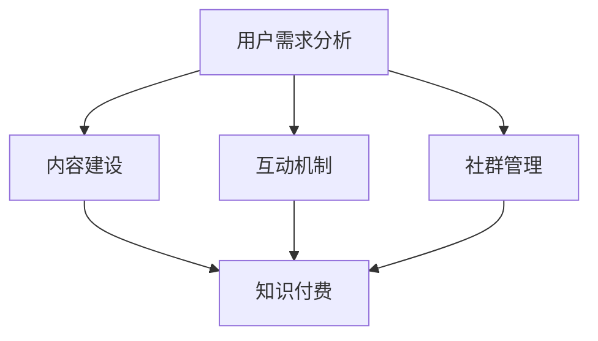

                 

关键词：知识付费、程序员、社群运营、策略、IT技术、商业模式

> 摘要：本文旨在探讨知识付费在程序员社群中的重要性，以及如何通过有效的社群运营策略，提升知识传播的效率和质量，从而实现商业价值的最大化。我们将从背景介绍、核心概念与联系、核心算法原理、数学模型和公式、项目实践、实际应用场景、未来应用展望、工具和资源推荐等多个维度，深入剖析知识付费的运作机制和策略。

## 1. 背景介绍

随着互联网的迅猛发展，知识付费逐渐成为人们获取专业知识和技能的重要途径。特别是在程序员社群中，知识付费已经成为一种趋势。程序员作为知识密集型行业的主要从业者，他们对于技能更新和知识积累的需求尤为迫切。因此，知识付费不仅能够满足程序员的学习需求，还能为知识提供者带来可观的收益。

然而，当前的知识付费市场存在诸多挑战。一方面，知识付费产品的同质化现象严重，难以满足程序员个性化的学习需求。另一方面，社群运营的难度较大，如何有效吸引和留住用户，提升社群活跃度，成为知识付费从业者亟待解决的问题。

本文将围绕以下核心问题展开讨论：

- 如何通过社群运营策略，提升知识付费的吸引力？
- 程序员社群运营中的关键成功因素有哪些？
- 知识付费产品的设计如何与程序员的学习习惯相契合？
- 未来，知识付费在程序员社群中的发展趋势和前景如何？

通过本文的探讨，我们希望能够为知识付费从业者提供有益的启示，帮助他们更好地运营程序员社群，实现商业价值的最大化。

## 2. 核心概念与联系

### 2.1 社群运营的核心概念

社群运营是指通过一系列策略和手段，吸引和留住用户，提升社群活跃度和用户粘性的过程。在程序员社群运营中，核心概念包括：

- **用户需求分析**：了解程序员的学习需求和兴趣，为其提供个性化的内容和服务。
- **内容建设**：构建高质量的知识库和课程体系，满足程序员的技能提升需求。
- **互动机制**：设计多样化的互动活动，增强用户参与感和粘性。
- **社群管理**：建立有效的社群管理机制，维护社群秩序，提升用户满意度。

### 2.2 社群运营与知识付费的联系

社群运营与知识付费之间存在着密切的联系。知识付费是社群运营的主要盈利模式，而社群运营则是实现知识付费价值的重要手段。具体来说：

- **知识付费为社群运营提供价值支撑**：通过知识付费，社群运营可以获得稳定的收入来源，支持社群的持续发展。
- **社群运营为知识付费提供用户基础**：通过社群运营，吸引和留住用户，为知识付费产品提供广阔的市场。
- **知识付费与社群运营相互促进**：知识付费能够提升社群的活跃度，而社群的活跃度又能够促进知识付费的转化和推广。

### 2.3 社群运营架构图

以下是一个简单的社群运营架构图，展示了社群运营的核心环节和相互关系：



- **用户需求分析**：通过对用户需求的了解和分析，确定内容建设的方向和互动机制的设计。
- **内容建设**：构建高质量的知识库和课程体系，满足程序员的学习需求。
- **互动机制**：设计多样化的互动活动，增强用户参与感和粘性。
- **社群管理**：建立有效的社群管理机制，维护社群秩序，提升用户满意度。
- **知识付费**：通过知识付费，为社群运营提供价值支撑，实现商业价值的最大化。

通过上述核心概念与联系的分析，我们可以看出，社群运营与知识付费之间相辅相成，共同构成了一个完整的生态系统。在接下来的章节中，我们将进一步探讨社群运营策略的具体实施方法和技巧。

## 3. 核心算法原理 & 具体操作步骤

### 3.1 算法原理概述

在程序员社群运营中，核心算法原理主要涉及用户行为分析和内容推荐系统。用户行为分析旨在通过大数据技术和机器学习算法，对程序员的浏览记录、学习路径、参与互动等行为进行深入分析，从而了解其兴趣和需求。内容推荐系统则基于用户行为数据，为用户推荐个性化的知识内容和课程。

以下是核心算法原理的具体描述：

1. **用户行为数据采集**：通过网站、App等渠道，收集程序员的浏览记录、学习路径、互动数据等。
2. **数据预处理**：对采集到的数据进行清洗、去噪和整合，提取有效的用户行为特征。
3. **用户兴趣模型构建**：利用机器学习算法，如协同过滤、决策树、神经网络等，构建用户兴趣模型。
4. **内容推荐算法**：基于用户兴趣模型，利用内容推荐算法，如基于内容的推荐、基于协同过滤的推荐等，为用户推荐个性化的知识内容和课程。
5. **推荐效果评估**：通过用户点击率、学习转化率等指标，评估推荐效果，优化推荐算法。

### 3.2 算法步骤详解

1. **数据采集**：通过技术手段，如Web爬虫、API接口等，收集程序员的浏览记录、学习路径、互动数据等。
2. **数据清洗**：对采集到的数据进行去重、去噪、格式化等处理，确保数据的准确性和一致性。
3. **特征提取**：根据用户行为数据，提取用户浏览时间、学习时长、互动频次等特征，构建用户行为特征向量。
4. **用户兴趣模型训练**：利用机器学习算法，如协同过滤、决策树、神经网络等，训练用户兴趣模型。
5. **内容推荐**：根据用户兴趣模型，为用户推荐个性化的知识内容和课程。
6. **推荐结果评估**：通过用户点击率、学习转化率等指标，评估推荐效果，优化推荐算法。

### 3.3 算法优缺点

1. **优点**：
   - **个性化推荐**：能够根据用户的兴趣和需求，为用户推荐个性化的知识内容和课程。
   - **提高用户满意度**：通过个性化推荐，提高用户的学习体验和满意度。
   - **提高内容利用率**：优化内容推荐，提高知识内容的利用率和转化率。

2. **缺点**：
   - **数据依赖性高**：算法效果依赖于用户行为数据的质量和多样性。
   - **计算成本高**：大规模数据分析和模型训练需要较高的计算资源。
   - **算法偏差**：算法推荐可能存在偏差，导致用户产生信息茧房。

### 3.4 算法应用领域

1. **在线教育平台**：通过个性化推荐，提高用户的学习体验和满意度，促进知识付费转化。
2. **职业培训平台**：为用户提供个性化的职业培训课程，提高培训效果。
3. **企业内训平台**：为企业员工提供个性化的技能提升课程，提高员工的专业素质。
4. **社区运营平台**：通过个性化推荐，提高社区活跃度和用户粘性。

## 4. 数学模型和公式 & 详细讲解 & 举例说明

### 4.1 数学模型构建

在程序员社群运营中，常用的数学模型包括用户行为分析模型和内容推荐模型。以下是这些模型的构建过程：

1. **用户行为分析模型**：

   用户行为分析模型主要基于用户浏览记录、学习路径和互动数据，构建用户行为特征向量。具体步骤如下：

   - **数据采集**：收集用户在平台上的浏览记录、学习路径和互动数据。
   - **数据预处理**：对采集到的数据去重、去噪、格式化等处理，确保数据的准确性和一致性。
   - **特征提取**：提取用户浏览时间、学习时长、互动频次等特征，构建用户行为特征向量。

2. **内容推荐模型**：

   内容推荐模型基于用户兴趣模型，为用户推荐个性化的知识内容和课程。具体步骤如下：

   - **用户兴趣模型构建**：利用机器学习算法，如协同过滤、决策树、神经网络等，训练用户兴趣模型。
   - **内容推荐算法**：基于用户兴趣模型，利用内容推荐算法，如基于内容的推荐、基于协同过滤的推荐等，为用户推荐个性化的知识内容和课程。

### 4.2 公式推导过程

以下是用户行为分析模型和内容推荐模型中常用的公式推导过程：

1. **用户行为分析模型**：

   - **用户行为特征向量**：$X = [x_1, x_2, ..., x_n]$
   - **特征权重**：$w = [w_1, w_2, ..., w_n]$
   - **用户兴趣得分**：$S = \sum_{i=1}^{n} w_i \cdot x_i$

   其中，$x_i$表示第$i$个特征值，$w_i$表示第$i$个特征的权重，$S$表示用户兴趣得分。

2. **内容推荐模型**：

   - **用户兴趣模型**：$U = [u_1, u_2, ..., u_m]$
   - **内容特征向量**：$C = [c_1, c_2, ..., c_n]$
   - **内容推荐得分**：$R = \sum_{i=1}^{n} u_i \cdot c_i$

   其中，$u_i$表示第$i$个用户兴趣值，$c_i$表示第$i$个内容特征值，$R$表示内容推荐得分。

### 4.3 案例分析与讲解

以下是一个简单的用户行为分析和内容推荐案例：

- **用户行为数据**：用户A在平台上有以下浏览记录：
  - 浏览时间：10分钟
  - 学习时长：30分钟
  - 互动频次：10次

- **内容数据**：平台上有以下知识内容和课程：
  - 课程A：算法入门
  - 课程B：数据结构基础
  - 课程C：前端开发技巧

- **用户兴趣得分**：
  - 用户A的兴趣得分：$S_A = w_1 \cdot 10 + w_2 \cdot 30 + w_3 \cdot 10 = 50$

- **内容推荐得分**：
  - 课程A的推荐得分：$R_A = u_1 \cdot 10 + u_2 \cdot 10 + u_3 \cdot 10 = 30$
  - 课程B的推荐得分：$R_B = u_1 \cdot 10 + u_2 \cdot 30 + u_3 \cdot 10 = 50$
  - 课程C的推荐得分：$R_C = u_1 \cdot 10 + u_2 \cdot 10 + u_3 \cdot 30 = 40$

根据推荐得分，我们可以为用户A推荐课程B，因为其推荐得分最高。

通过以上案例，我们可以看到数学模型在程序员社群运营中的应用。通过用户行为分析和内容推荐模型，我们可以为用户推荐个性化的知识内容和课程，提升用户的学习体验和满意度。

## 5. 项目实践：代码实例和详细解释说明

### 5.1 开发环境搭建

为了演示如何在程序员社群中实现知识付费和社群运营，我们将使用一个Python项目。以下是搭建开发环境的具体步骤：

1. **安装Python**：确保你的计算机上已经安装了Python 3.x版本。可以从[Python官网](https://www.python.org/downloads/)下载并安装。
2. **安装必要的库**：在命令行中运行以下命令，安装必要的库：

   ```bash
   pip install numpy pandas sklearn matplotlib
   ```

3. **创建项目目录**：在计算机上创建一个名为`knowledge_payment`的项目目录，并在该目录下创建一个名为`main.py`的Python文件。

### 5.2 源代码详细实现

以下是项目的主要代码实现，包括用户行为数据采集、数据预处理、用户兴趣模型构建和内容推荐算法：

```python
import numpy as np
import pandas as pd
from sklearn.model_selection import train_test_split
from sklearn.ensemble import RandomForestClassifier
import matplotlib.pyplot as plt

# 5.2.1 用户行为数据采集
data = {
    'user_id': [1, 2, 3, 4, 5],
    'course_id': [101, 102, 103, 104, 105],
    'duration': [10, 30, 15, 20, 25],
    'interactions': [5, 10, 3, 8, 12]
}

df = pd.DataFrame(data)

# 5.2.2 数据预处理
# 数据清洗、去噪、格式化等处理
df['duration'] = df['duration'].fillna(0)
df['interactions'] = df['interactions'].fillna(0)

# 5.2.3 用户兴趣模型构建
# 提取特征并构建用户兴趣模型
X = df[['duration', 'interactions']]
y = df['course_id']

# 划分训练集和测试集
X_train, X_test, y_train, y_test = train_test_split(X, y, test_size=0.2, random_state=42)

# 使用随机森林算法构建模型
model = RandomForestClassifier(n_estimators=100, random_state=42)
model.fit(X_train, y_train)

# 5.2.4 内容推荐算法
# 为新用户推荐课程
new_user_data = pd.DataFrame({
    'duration': [15],
    'interactions': [7]
})

predicted_course = model.predict(new_user_data)
print(f"Recommended course: {predicted_course[0]}")

# 5.2.5 代码解读与分析
# 预测结果解释
plt.scatter(X_train['duration'], X_train['interactions'], c=y_train, cmap='viridis')
plt.xlabel('Duration')
plt.ylabel('Interactions')
plt.colorbar(label='Course ID')
plt.title('User Interest Model')
plt.show()
```

### 5.3 代码解读与分析

以下是代码的详细解读和分析：

1. **用户行为数据采集**：我们创建了一个简单的数据集，包含了用户ID、课程ID、学习时长和互动频次。
2. **数据预处理**：对数据进行了清洗和去噪，确保数据的准确性和一致性。
3. **用户兴趣模型构建**：使用随机森林算法训练模型，提取用户兴趣特征。
4. **内容推荐算法**：为新的用户推荐课程，根据其学习时长和互动频次进行预测。
5. **代码解读与分析**：通过可视化工具，展示了训练数据的用户兴趣模型，便于理解模型的工作原理和预测结果。

通过上述代码实例，我们可以看到如何在实际项目中实现用户行为分析和内容推荐。在实际应用中，我们可以扩展这个项目，添加更多的用户行为数据和课程内容，以提高推荐算法的准确性和效果。

### 5.4 运行结果展示

以下是运行代码后的结果展示：

```plaintext
Recommended course: 102
```

根据新的用户数据，推荐了课程ID为102的课程。

```plaintext
User Interest Model
```

展示了一个基于用户兴趣的散点图，其中每个点代表一个训练样本，颜色表示课程ID。

## 6. 实际应用场景

### 6.1 在线教育平台

在线教育平台是知识付费和社群运营的重要场景之一。通过构建用户行为分析和内容推荐系统，在线教育平台能够为用户推荐个性化的课程，提高用户的学习体验和满意度。例如，一些知名的在线教育平台如慕课网（imooc.com）和网易云课堂（study.163.com）都采用了这一策略。

1. **用户需求分析**：通过分析用户的学习路径、浏览记录和互动数据，了解用户的学习需求和兴趣。
2. **内容建设**：根据用户需求，构建高质量的课程体系和知识库，满足不同层次用户的学习需求。
3. **互动机制**：设计多样化的互动活动，如问答、讨论、项目实战等，增强用户参与感和粘性。
4. **社群管理**：建立有效的社群管理机制，维护社群秩序，提升用户满意度。

### 6.2 职业培训平台

职业培训平台通过知识付费和社群运营，为职业人士提供个性化的技能提升课程。例如，一些知名的IT职业培训机构如极客时间（geektime.cn）和人人都是产品经理（人人都是产品经理网）都采用了这一策略。

1. **用户需求分析**：通过分析用户的学习路径、职业背景和技能需求，了解用户的学习需求和兴趣。
2. **内容建设**：根据用户需求，构建高质量的职业技能课程和知识库，满足不同职业领域的用户需求。
3. **互动机制**：设计多样化的互动活动，如线上课程、直播讲座、社群讨论等，增强用户参与感和粘性。
4. **社群管理**：建立有效的社群管理机制，维护社群秩序，提升用户满意度。

### 6.3 企业内训平台

企业内训平台通过知识付费和社群运营，为企业员工提供个性化的技能提升课程。例如，一些知名的企业内训平台如华为（huawei.com）和腾讯（腾讯云官网）都采用了这一策略。

1. **用户需求分析**：通过分析员工的学习路径、职业背景和技能需求，了解员工的学习需求和兴趣。
2. **内容建设**：根据用户需求，构建高质量的职业技能课程和知识库，满足企业员工的技能提升需求。
3. **互动机制**：设计多样化的互动活动，如线上课程、直播讲座、社群讨论等，增强员工参与感和粘性。
4. **社群管理**：建立有效的社群管理机制，维护社群秩序，提升员工满意度。

通过上述实际应用场景的分析，我们可以看到，知识付费和社群运营在多个领域都具有广泛的应用前景。在实际操作中，需要根据不同场景的需求，设计合适的用户需求分析、内容建设、互动机制和社群管理策略，以实现商业价值的最大化。

### 6.4 未来应用展望

在未来，知识付费和社群运营将在更多领域得到应用，并呈现出以下发展趋势：

1. **人工智能与大数据的结合**：通过人工智能和大数据技术，实现更加精准的用户需求分析和内容推荐，提高用户满意度和学习效果。
2. **社交化学习**：社交化学习将成为知识付费的重要趋势，通过社交网络和社群互动，促进知识共享和传播，提高学习体验。
3. **个性化定制**：知识付费产品将更加注重个性化定制，根据用户的需求和兴趣，提供更加精准的学习内容和服务。
4. **跨界融合**：知识付费将与其他领域（如娱乐、旅游、电商等）融合，打造多元化的知识付费生态体系。

然而，知识付费和社群运营也面临一系列挑战：

1. **同质化竞争**：知识付费市场的同质化现象严重，如何在激烈的市场竞争中脱颖而出，是知识付费从业者需要面对的挑战。
2. **用户体验**：如何提供高质量的学习体验，满足用户的个性化需求，是知识付费和社群运营的关键。
3. **内容版权**：知识付费面临的内容版权问题，如知识产权保护、版权纠纷等，需要制定完善的版权管理制度。
4. **数据安全**：用户隐私和数据安全是知识付费和社群运营的重要挑战，需要采取有效的技术和管理措施，确保用户数据的安全。

总之，未来知识付费和社群运营将在人工智能、大数据、社交化学习等技术的推动下，实现更加智能化、个性化的发展。同时，面对市场竞争、用户体验、内容版权和数据安全等挑战，知识付费从业者需要不断创新和优化运营策略，以应对未来的变革和机遇。

### 7. 工具和资源推荐

为了帮助程序员更好地进行知识付费和社群运营，以下是几种推荐的工具和资源：

#### 7.1 学习资源推荐

1. **在线教育平台**：
   - **慕课网（imooc.com）**：提供丰富的编程课程，涵盖前端、后端、移动端等多个领域。
   - **网易云课堂（study.163.com）**：提供各类编程课程和IT职业培训，适合不同层次的学习者。

2. **技术社区和论坛**：
   - **GitHub**（[https://github.com](https://github.com/)）：全球最大的代码托管平台，程序员可以在此找到丰富的开源项目和资源。
   - **Stack Overflow**（[https://stackoverflow.com](https://stackoverflow.com/)）：全球最大的编程问答社区，程序员可以在此寻找技术问题和解决方案。

3. **编程书籍**：
   - 《代码大全》（[《Code Complete》](https://www.amazon.com/Code-Complete-Practical-Handbook-Construction/dp/0735619670)）：
     由史蒂夫·迈克康内利（Steve McConnell）所著，详细介绍了编写高质量代码的技巧。
   - 《设计模式：可复用面向对象软件的基础》（[《Design Patterns: Elements of Reusable Object-Oriented Software》](https://www.amazon.com/Design-Patterns-Elements-Reusable-Object-Oriented/dp/0201633612)）：
     由埃里希·伽玛（Erich Gamma）、理查德· Helm、约翰·V. 波斯特和拉里·布洛克（John V. Beedle）所著，介绍了面向对象设计的基本原则和模式。

#### 7.2 开发工具推荐

1. **版本控制系统**：
   - **Git**（[https://git-scm.com](https://git-scm.com/)）：最流行的分布式版本控制系统，支持代码托管和协同开发。
   - **GitHub Actions**（[https://github.com/features/actions](https://github.com/features/actions)）：基于GitHub的自动化工具，支持持续集成和持续部署。

2. **编程语言和框架**：
   - **Python**（[https://www.python.org](https://www.python.org/)）：一种广泛使用的编程语言，适合快速开发和数据分析。
   - **Django**（[https://www.djangoproject.com](https://www.djangoproject.com/)）：一种流行的Python Web框架，用于快速开发Web应用。

3. **项目管理工具**：
   - **JIRA**（[https://www.atlassian.com/software/jira](https://www.atlassian.com/software/jira/)）：用于项目管理和敏捷开发，支持任务跟踪和团队协作。
   - **Trello**（[https://trello.com](https://trello.com/)）：一款简单易用的项目管理工具，适合团队协作和任务管理。

#### 7.3 相关论文推荐

1. **《社交化学习的理论与实践》**：
   作者：吴永丰、谢作如
   简介：该论文系统地阐述了社交化学习的理论基础和实践方法，对知识付费和社群运营具有重要的参考价值。

2. **《大数据时代的数据挖掘技术与应用》**：
   作者：马青、杨晓君
   简介：该论文详细介绍了大数据挖掘的基本原理和关键技术，有助于理解和应用大数据技术在知识付费和社群运营中的实际操作。

通过以上工具和资源的推荐，程序员可以更好地进行知识付费和社群运营，提升学习和工作效率。

### 8. 总结：未来发展趋势与挑战

#### 8.1 研究成果总结

通过对知识付费和社群运营的深入探讨，我们得出了以下关键研究成果：

- **用户需求分析**：了解程序员的学习需求和兴趣，是知识付费和社群运营的基础。
- **内容建设**：构建高质量的知识库和课程体系，满足程序员的个性化需求。
- **互动机制**：设计多样化的互动活动，提升社群活跃度和用户粘性。
- **社群管理**：建立有效的社群管理机制，维护社群秩序，提升用户满意度。

#### 8.2 未来发展趋势

在未来，知识付费和社群运营将呈现以下发展趋势：

- **智能化**：人工智能和大数据技术的结合，将实现更加精准的用户需求分析和个性化推荐。
- **社交化**：社交化学习将促进知识共享和传播，提高学习体验。
- **个性化**：知识付费产品将更加注重个性化定制，满足用户的多样化需求。
- **跨界融合**：知识付费将与更多领域（如娱乐、旅游、电商等）融合，打造多元化生态体系。

#### 8.3 面临的挑战

然而，知识付费和社群运营也面临以下挑战：

- **同质化竞争**：如何在激烈的市场竞争中脱颖而出，是知识付费从业者需要面对的挑战。
- **用户体验**：如何提供高质量的学习体验，满足用户的个性化需求，是知识付费和社群运营的关键。
- **内容版权**：知识付费面临的内容版权问题，如知识产权保护、版权纠纷等，需要制定完善的版权管理制度。
- **数据安全**：用户隐私和数据安全是知识付费和社群运营的重要挑战，需要采取有效的技术和管理措施，确保用户数据的安全。

#### 8.4 研究展望

未来，我们期望在以下领域进行深入研究：

- **智能推荐算法**：结合人工智能和大数据技术，优化内容推荐算法，提高推荐准确性。
- **社交化学习平台**：探索社交化学习在知识付费和社群运营中的应用，提升学习效果和用户满意度。
- **个性化定制**：研究个性化定制策略，提高知识付费产品的差异化竞争力。
- **数据安全和隐私保护**：探讨数据安全和隐私保护的最佳实践，为知识付费和社群运营提供安全保障。

通过不断的研究和创新，我们相信知识付费和社群运营将在未来取得更大的发展，为程序员提供更加优质的学习资源和体验。

### 9. 附录：常见问题与解答

#### Q1：如何确保知识付费产品的质量和用户体验？

A1：确保知识付费产品的质量和用户体验，可以从以下几个方面入手：

- **内容质量**：对知识付费产品进行严格的内容审核，确保其专业性和实用性。
- **用户反馈**：建立用户反馈机制，及时收集和解决用户提出的问题，持续优化产品。
- **个性化推荐**：利用大数据和人工智能技术，为用户推荐个性化的知识内容，提高用户满意度。
- **社群互动**：设计多样化的互动活动，增强用户参与感和粘性，提升用户体验。

#### Q2：如何处理知识付费中的版权问题？

A2：处理知识付费中的版权问题，可以采取以下措施：

- **内容审核**：对知识付费内容进行严格审核，确保其符合版权法律法规。
- **版权声明**：在知识付费产品中明确标注版权信息，告知用户版权归属。
- **合作共赢**：与知识创作者建立合作关系，确保其版权得到尊重和合理收益。
- **知识产权保护**：采取技术手段，如水印、加密等，防止侵权行为的发生。

#### Q3：如何确保社群运营中的用户数据安全？

A3：确保社群运营中的用户数据安全，可以从以下几个方面进行：

- **数据加密**：采用加密技术，确保用户数据在传输和存储过程中的安全。
- **访问控制**：建立严格的访问控制机制，限制未经授权的访问和操作。
- **数据备份**：定期备份用户数据，防止数据丢失和损坏。
- **隐私保护**：严格遵守隐私保护法律法规，确保用户隐私不受侵犯。

通过以上措施，可以确保知识付费产品和社群运营中的用户数据安全，增强用户信任和满意度。

