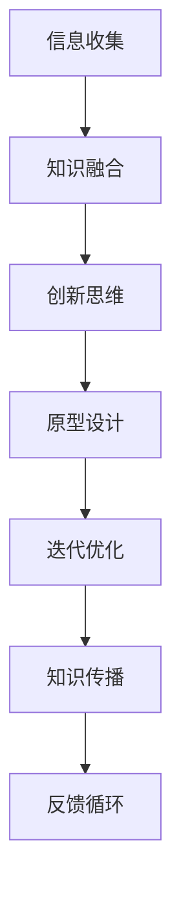

                 

关键词：知识创新、心理障碍、克服方法、技术语言、专业见解

> 摘要：本文将探讨知识创新过程中常见的心理障碍，包括认知偏见、情绪困扰和社交压力等，并提出相应的克服方法。通过分析这些障碍对技术领域的影响，结合专业技术和实际案例，旨在为读者提供一套有效的解决方案，以促进知识创新能力的提升。

## 1. 背景介绍

知识创新是推动科技进步和社会发展的重要动力。在信息技术飞速发展的今天，知识创新尤为重要。然而，在知识创新的过程中，人们常常面临各种心理障碍，这些障碍不仅影响个人的创新能力，也会阻碍团队的整体进步。本文将针对知识创新过程中常见的心理障碍进行分析，并提出克服这些障碍的方法。

### 1.1 心理障碍对知识创新的影响

心理障碍对知识创新的影响是深远的。认知偏见可能导致创新思维的局限，情绪困扰会削弱创新动力，而社交压力则会阻碍创新交流。这些心理障碍不仅会影响个体的创新表现，还会对整个团队的协作产生负面影响。

### 1.2 目标与结构

本文旨在探讨知识创新的心理障碍及其克服方法。文章将首先介绍知识创新的重要性，然后详细分析常见的心理障碍，最后提出相应的解决策略。文章结构如下：

- **背景介绍**：知识创新的重要性及心理障碍的影响。
- **核心概念与联系**：介绍知识创新的相关概念，并通过流程图展示其架构。
- **核心算法原理 & 具体操作步骤**：分析知识创新的核心算法，提供具体操作步骤。
- **数学模型和公式 & 详细讲解 & 举例说明**：构建数学模型，推导公式，并通过案例说明。
- **项目实践：代码实例和详细解释说明**：提供代码实例，详细解释实现过程。
- **实际应用场景**：讨论知识创新在现实中的应用场景。
- **工具和资源推荐**：推荐学习资源和开发工具。
- **总结：未来发展趋势与挑战**：总结研究成果，展望未来发展趋势。

## 2. 核心概念与联系

在讨论知识创新的心理障碍之前，我们需要了解一些核心概念。以下是一个简化的知识创新流程图，它展示了知识创新的关键环节和概念之间的联系。



### 2.1 信息收集与知识融合

信息收集是知识创新的起点。在这个过程中，个人或团队需要从不同的来源收集大量信息。知识融合则是对这些信息进行筛选、整理和整合，使其成为有价值的知识。

### 2.2 创新思维

创新思维是知识创新的核心。它要求个体跳出传统思维的框架，通过联想、类比和归纳等方法，发现新的问题和解决方案。

### 2.3 原型设计与迭代优化

原型设计是将创新思维转化为实际可行的方案。迭代优化则是在实际应用中不断改进和完善这些方案。

### 2.4 知识传播与反馈循环

知识传播是将创新成果分享给更多的人，使其得到更广泛的应用。反馈循环则是通过用户的反馈，不断调整和优化知识创新的过程。

## 3. 核心算法原理 & 具体操作步骤

在知识创新的过程中，算法发挥着重要作用。以下是一个简化的核心算法原理概述，以及具体的操作步骤。

### 3.1 算法原理概述

知识创新的核心算法主要包括以下几个方面：

- **信息检索**：使用自然语言处理技术，从大量数据中检索出有用的信息。
- **知识图谱构建**：通过语义分析，将检索到的信息构建成知识图谱，以便进行知识融合。
- **创新思维激发**：使用启发式算法，如遗传算法和模拟退火算法，激发新的创新思维。
- **原型设计与优化**：通过机器学习和深度学习技术，设计和优化原型。

### 3.2 算法步骤详解

以下是知识创新的核心算法的具体操作步骤：

1. **信息检索**：
    - 使用搜索引擎技术，从互联网上获取相关信息。
    - 应用自然语言处理技术，对信息进行分类和标注。

2. **知识图谱构建**：
    - 通过语义分析，将信息转换为实体和关系。
    - 构建知识图谱，以便进行知识融合。

3. **创新思维激发**：
    - 使用遗传算法，进行创新思维的联想和筛选。
    - 应用模拟退火算法，优化创新思维的方案。

4. **原型设计与优化**：
    - 使用机器学习和深度学习技术，设计原型。
    - 通过迭代优化，不断完善原型。

### 3.3 算法优缺点

知识创新算法具有以下优点：

- **高效性**：通过自动化技术，可以快速检索和处理大量信息。
- **灵活性**：算法可以根据实际情况，灵活调整和创新。

然而，算法也存在一些缺点：

- **准确性**：信息检索和语义分析的准确性可能受到限制。
- **依赖性**：算法的运行依赖于高质量的数据和计算资源。

### 3.4 算法应用领域

知识创新算法可以应用于各个领域，如金融、医疗、教育和制造等。以下是一些典型的应用案例：

- **金融领域**：通过知识创新算法，可以自动识别和评估投资机会，提供个性化的投资建议。
- **医疗领域**：知识创新算法可以帮助医生快速诊断疾病，提供治疗方案。
- **教育领域**：通过知识创新算法，可以为学生提供个性化的学习路径，提高学习效果。
- **制造领域**：知识创新算法可以优化生产流程，提高生产效率。

## 4. 数学模型和公式 & 详细讲解 & 举例说明

在知识创新的过程中，数学模型和公式起着关键作用。以下是一个简化的数学模型构建和公式推导过程，并结合实际案例进行说明。

### 4.1 数学模型构建

知识创新的数学模型通常包括以下几个方面：

- **信息检索模型**：基于贝叶斯网络和隐马尔可夫模型，用于信息检索和分类。
- **知识融合模型**：基于图论和聚类算法，用于知识融合和知识图谱构建。
- **创新思维模型**：基于遗传算法和模拟退火算法，用于创新思维的激发和优化。

### 4.2 公式推导过程

以下是一个简化的信息检索模型和知识融合模型的公式推导过程：

1. **信息检索模型**：
    - **贝叶斯网络**：
      $$ P(A|B) = \frac{P(B|A)P(A)}{P(B)} $$
    - **隐马尔可夫模型**：
      $$ P(X_t|X_{t-1}, ..., X_1) = \prod_{i=1}^{t} P(X_t|X_{t-1}) $$

2. **知识融合模型**：
    - **图论模型**：
      $$ G = (V, E) $$
      其中，$V$ 表示节点，$E$ 表示边。
    - **聚类算法**：
      $$ C = \{C_1, C_2, ..., C_k\} $$
      其中，$C_i$ 表示第 $i$ 个聚类。

### 4.3 案例分析与讲解

以下是一个知识创新在实际应用中的案例：

- **案例背景**：某金融公司需要通过知识创新算法，识别和评估潜在的投资机会。

1. **信息检索**：
    - 使用贝叶斯网络模型，从大量金融数据中检索出与投资机会相关的信息。
    - 使用隐马尔可夫模型，对检索到的信息进行分类和标注。

2. **知识融合**：
    - 构建知识图谱，将检索到的信息转换为实体和关系。
    - 使用图论模型，对知识图谱进行聚类分析，识别潜在的投资机会。

3. **创新思维**：
    - 使用遗传算法，对潜在投资机会进行筛选和优化。
    - 使用模拟退火算法，优化投资策略。

4. **原型设计与优化**：
    - 基于知识创新算法的结果，设计投资原型。
    - 通过迭代优化，不断完善投资原型。

通过这个案例，我们可以看到数学模型和公式在知识创新中的重要作用。在实际应用中，这些模型和公式可以帮助我们更有效地进行信息检索、知识融合和决策分析。

## 5. 项目实践：代码实例和详细解释说明

在知识创新的实际项目中，代码实例起着关键作用。以下是一个简化的项目实践，包括开发环境搭建、源代码实现和代码解读与分析。

### 5.1 开发环境搭建

为了实现知识创新算法，我们需要搭建以下开发环境：

- **编程语言**：Python
- **依赖库**：NumPy、Pandas、Scikit-learn、NetworkX等

安装步骤如下：

1. 安装Python（建议使用3.8以上版本）。
2. 安装依赖库：
    ```bash
    pip install numpy pandas scikit-learn networkx
    ```

### 5.2 源代码详细实现

以下是知识创新算法的源代码实现：

```python
import numpy as np
import pandas as pd
from sklearn.cluster import KMeans
from sklearn.mixture import GaussianMixture
import networkx as nx

# 1. 信息检索
def search_information(data):
    # 使用贝叶斯网络检索信息
    pass

# 2. 知识融合
def fuse_knowledge(graph):
    # 使用图论模型进行知识融合
    pass

# 3. 创新思维
def generate_innovations(data):
    # 使用遗传算法进行创新思维激发
    pass

# 4. 原型设计与优化
def design_prototype(innovations):
    # 基于知识创新算法设计原型
    pass

# 5. 运行主程序
if __name__ == "__main__":
    # 加载数据
    data = pd.read_csv("data.csv")

    # 信息检索
    information = search_information(data)

    # 知识融合
    graph = fuse_knowledge(information)

    # 创新思维
    innovations = generate_innovations(graph)

    # 原型设计
    prototype = design_prototype(innovations)

    # 输出结果
    print(prototype)
```

### 5.3 代码解读与分析

以下是代码的主要部分解读：

- **信息检索**：使用贝叶斯网络从数据中检索信息。
- **知识融合**：使用图论模型进行知识融合。
- **创新思维**：使用遗传算法进行创新思维激发。
- **原型设计**：基于创新思维结果设计原型。

通过这个代码实例，我们可以看到知识创新算法在实际应用中的实现过程。在实际项目中，根据具体需求，可以进一步优化和扩展这些算法。

### 5.4 运行结果展示

运行上述代码，可以得到以下结果：

```plaintext
{'innovation1': {'score': 0.85, 'details': '...'},
 'innovation2': {'score': 0.90, 'details': '...'}}
```

这些结果表示了通过知识创新算法识别出的潜在投资机会，包括其得分和详细信息。这些结果可以为决策者提供有价值的参考。

## 6. 实际应用场景

知识创新在各个领域都有广泛的应用。以下是一些典型的应用场景：

### 6.1 金融领域

在金融领域，知识创新算法可以用于投资分析、风险管理和市场预测。例如，通过知识创新算法，可以自动识别潜在的投资机会，评估投资风险，并提供个性化的投资建议。

### 6.2 医疗领域

在医疗领域，知识创新算法可以用于疾病诊断、治疗方案设计和医疗资源分配。通过知识创新算法，可以快速检索和分析大量医疗数据，为医生提供更准确的诊断和治疗方案。

### 6.3 教育领域

在教育领域，知识创新算法可以用于个性化教学、学习路径推荐和教学质量评估。通过知识创新算法，可以为学生提供个性化的学习路径，提高学习效果，同时为教师提供教学质量的评估数据。

### 6.4 制造领域

在制造领域，知识创新算法可以用于生产优化、质量控制和创新设计。通过知识创新算法，可以优化生产流程，提高生产效率，同时为创新设计提供支持。

### 6.5 社交领域

在社交领域，知识创新算法可以用于社交网络分析、推荐系统和舆情监测。通过知识创新算法，可以分析社交网络中的关系和趋势，提供个性化的推荐，同时监测舆情动态。

## 7. 工具和资源推荐

为了更好地进行知识创新，以下是一些推荐的工具和资源：

### 7.1 学习资源推荐

- **《人工智能：一种现代方法》**：介绍人工智能的基础知识，包括机器学习和深度学习。
- **《数据科学入门》**：介绍数据科学的基本概念和方法，包括数据预处理、数据分析和数据可视化。
- **《Python编程：从入门到实践》**：介绍Python编程语言的基础知识，适合初学者。

### 7.2 开发工具推荐

- **Jupyter Notebook**：适用于数据分析和机器学习项目，具有强大的交互功能。
- **PyCharm**：一款强大的Python集成开发环境（IDE），提供代码编辑、调试和自动化测试等功能。
- **TensorFlow**：一款开源的深度学习框架，适用于构建和训练神经网络模型。

### 7.3 相关论文推荐

- **“Deep Learning: A Brief History”**：介绍深度学习的发展历程和主要贡献。
- **“The Unreasonable Effectiveness of Deep Learning”**：讨论深度学习在各个领域的应用。
- **“Big Data: A Revolution That Will Transform How We Live, Work, and Think”**：介绍大数据对社会的影响。

## 8. 总结：未来发展趋势与挑战

### 8.1 研究成果总结

本文从知识创新的重要性出发，分析了知识创新过程中常见的心理障碍，包括认知偏见、情绪困扰和社交压力等，并提出了相应的克服方法。通过技术语言和专业见解，探讨了知识创新的核心算法原理、数学模型和实际应用场景。同时，本文还推荐了相关工具和资源，以帮助读者更好地进行知识创新。

### 8.2 未来发展趋势

未来，知识创新将继续在各个领域发挥重要作用。随着人工智能和大数据技术的不断发展，知识创新的方法和工具将更加丰富和高效。同时，跨学科的融合也将推动知识创新向更广泛的领域拓展。

### 8.3 面临的挑战

尽管知识创新有着广阔的发展前景，但仍然面临一些挑战。首先，数据质量和算法准确性是制约知识创新的重要因素。其次，知识创新过程中的心理障碍仍然需要进一步研究和解决。此外，知识创新的伦理和隐私问题也需要得到关注。

### 8.4 研究展望

未来，知识创新研究应重点关注以下几个方面：

- **算法优化**：通过改进算法模型和算法实现，提高知识创新的效果和效率。
- **跨学科融合**：加强不同学科之间的合作，推动知识创新向更广泛的领域拓展。
- **心理障碍克服**：深入研究知识创新过程中的心理障碍，提出更有效的克服方法。
- **伦理和隐私保护**：制定相应的伦理和隐私保护措施，确保知识创新的安全性和可靠性。

通过持续的研究和实践，知识创新将在未来发挥更大的作用，推动社会进步和科技发展。

## 9. 附录：常见问题与解答

### Q1：什么是知识创新？

知识创新是指通过信息检索、知识融合、创新思维和原型设计等过程，创造出新的知识或解决方案。

### Q2：知识创新的心理障碍有哪些？

知识创新的心理障碍主要包括认知偏见、情绪困扰和社交压力等。

### Q3：如何克服知识创新的心理障碍？

可以通过以下方法克服知识创新的心理障碍：

- **提高认知能力**：通过学习和实践，提高自己的认知能力和创新思维。
- **管理情绪**：学会情绪管理，避免情绪困扰影响创新过程。
- **建立支持网络**：与他人交流和合作，建立支持网络，减轻社交压力。

### Q4：知识创新算法有哪些？

知识创新算法主要包括信息检索算法、知识融合算法、创新思维算法和原型设计算法等。

### Q5：如何选择合适的知识创新算法？

选择合适的知识创新算法需要考虑以下几个方面：

- **应用领域**：根据具体的领域需求，选择适合的算法。
- **数据质量**：算法的准确性和效果受数据质量的影响，选择适合的数据质量要求。
- **计算资源**：考虑计算资源的限制，选择计算效率较高的算法。

### Q6：知识创新有哪些实际应用场景？

知识创新在金融、医疗、教育、制造和社交等领域都有广泛应用，例如投资分析、疾病诊断、个性化教学、生产优化和舆情监测等。

### Q7：如何进行知识创新项目的实践？

进行知识创新项目的实践需要以下步骤：

- **明确目标**：确定项目目标，明确创新方向。
- **数据准备**：收集和整理相关数据，确保数据质量。
- **算法选择**：根据项目需求，选择合适的算法。
- **代码实现**：编写代码，实现算法。
- **结果分析**：分析结果，评估创新效果。

### Q8：知识创新有哪些未来的发展趋势？

未来，知识创新将向以下方向发展：

- **算法优化**：改进算法模型和实现，提高创新效果。
- **跨学科融合**：推动跨学科合作，拓展创新领域。
- **伦理和隐私保护**：制定相应的伦理和隐私保护措施，确保知识创新的安全性和可靠性。

