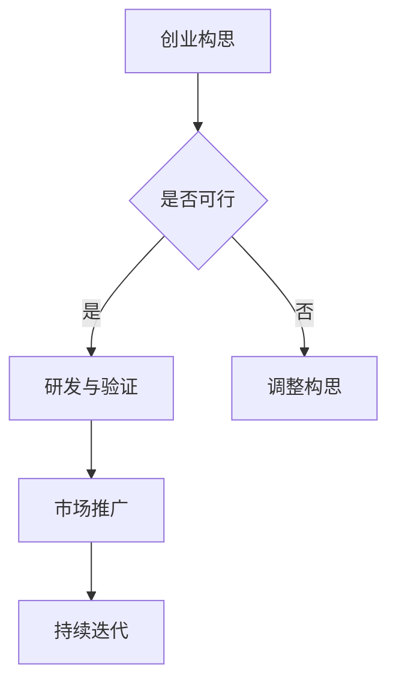

                 

 关键词：知识加速器、初创企业、资源对接、技术创新、成长路径

摘要：本文将探讨知识加速器在资源对接方面如何助力初创企业快速发展。通过深入分析知识加速器的核心概念、运行机制和具体操作步骤，我们希望为初创企业提供实用的指导，帮助它们在激烈的市场竞争中脱颖而出。

## 1. 背景介绍

在当今快速变化的技术环境中，初创企业面临着巨大的挑战。如何在有限的资源下快速成长，如何找到合适的技术方向和市场定位，都是初创企业需要解决的关键问题。知识加速器作为一种新型的创新服务模式，旨在通过提供资源对接、技术支持、市场推广等综合服务，加速初创企业的成长。

### 1.1 知识加速器的定义

知识加速器，又称孵化器或加速器，是一种集中式、专业化的创业服务平台。它为初创企业提供办公空间、资金支持、技术指导、市场资源等一站式服务，帮助初创企业快速验证产品原型、拓展市场、建立品牌。

### 1.2 知识加速器的意义

知识加速器不仅为初创企业提供了必要的资源和指导，更重要的是，它为初创企业搭建了一个交流合作、协同创新的平台。在这个平台上，初创企业可以与投资者、行业专家、合作伙伴等建立紧密联系，获取更多的市场机会和资源。

## 2. 核心概念与联系

为了更好地理解知识加速器的作用，我们需要首先了解几个核心概念，包括创业生态系统、技术创新链和资源对接机制。

### 2.1 创业生态系统

创业生态系统是一个复杂的社会网络，包括初创企业、投资者、孵化器、加速器、大学和研究机构等。这个生态系统中的各个角色相互依存、相互促进，共同推动创新创业的发展。

### 2.2 技术创新链

技术创新链是指从技术构思、研发、原型验证到市场推广的整个过程。知识加速器通过提供技术支持、市场资源等，帮助初创企业快速完成技术创新链的各个环节。

### 2.3 资源对接机制

资源对接机制是知识加速器的核心功能之一。它通过搭建平台，将初创企业与投资者、合作伙伴、行业专家等资源进行有效对接，实现资源共享和优势互补。

## 2.4 Mermaid 流程图



## 3. 核心算法原理 & 具体操作步骤

### 3.1 算法原理概述

知识加速器的工作原理可以看作是一种基于资源优化和协同创新的算法。它通过以下步骤实现初创企业的成长：

1. 资源识别：识别初创企业所需的各种资源，包括资金、技术、市场等。
2. 资源匹配：根据初创企业的需求，匹配相应的资源提供者。
3. 资源对接：搭建平台，实现初创企业与资源提供者之间的有效对接。
4. 持续迭代：根据初创企业的反馈和需求，不断调整和优化资源对接机制。

### 3.2 算法步骤详解

1. **资源识别**：通过问卷调查、数据分析等方式，了解初创企业的资源需求。
2. **资源匹配**：利用大数据分析和人工智能算法，匹配初创企业与合适的资源提供者。
3. **资源对接**：搭建在线平台，实现初创企业与资源提供者之间的实时沟通和协作。
4. **持续迭代**：根据初创企业的反馈和实际效果，不断调整和优化资源对接机制。

### 3.3 算法优缺点

**优点**：
- **高效性**：通过算法匹配，可以快速找到合适的资源，提高资源利用效率。
- **灵活性**：初创企业可以根据自身需求，灵活调整资源对接方案。
- **协同性**：通过平台搭建，可以实现多方协同，形成良好的创业生态系统。

**缺点**：
- **数据隐私**：在资源识别和匹配过程中，可能涉及到初创企业的敏感数据。
- **依赖性**：初创企业过于依赖知识加速器的资源对接，可能影响其自主创新能力。

### 3.4 算法应用领域

知识加速器的算法原理可以广泛应用于各个领域的初创企业，包括但不限于：

- **科技企业**：如人工智能、大数据、物联网等前沿技术领域的初创企业。
- **生物医疗**：如基因测序、生物制药等领域的初创企业。
- **文化创意**：如影视制作、游戏开发等文化创意产业的初创企业。

## 4. 数学模型和公式 & 详细讲解 & 举例说明

### 4.1 数学模型构建

知识加速器的资源对接过程可以看作是一个优化问题。设初创企业为 $A$，资源提供者为 $B$，资源需求为 $C$，资源供给为 $D$。则知识加速器的数学模型可以表示为：

$$
\begin{cases}
\text{最大化} & f(A, B, C, D) \\
\text{约束条件} & g(A, B, C, D) = 0
\end{cases}
$$

其中，$f(A, B, C, D)$ 表示资源对接的效用函数，$g(A, B, C, D)$ 表示资源对接的约束条件。

### 4.2 公式推导过程

假设初创企业的资源需求为 $C = c_1 + c_2 + \cdots + c_n$，其中 $c_i$ 表示第 $i$ 种资源的需求数量。资源提供者的资源供给为 $D = d_1 + d_2 + \cdots + d_n$，其中 $d_i$ 表示第 $i$ 种资源的供给数量。则资源对接的效用函数可以表示为：

$$
f(A, B, C, D) = \sum_{i=1}^{n} \max(0, c_i - d_i)
$$

其中，$\max(0, c_i - d_i)$ 表示第 $i$ 种资源是否过剩或短缺。

资源对接的约束条件可以表示为：

$$
g(A, B, C, D) = \sum_{i=1}^{n} c_i = \sum_{i=1}^{n} d_i
$$

### 4.3 案例分析与讲解

假设一家初创企业的资源需求为 $C = (5, 3, 2)$，一家资源提供者的资源供给为 $D = (4, 2, 3)$。则资源对接的效用函数为：

$$
f(A, B, C, D) = \max(0, 5 - 4) + \max(0, 3 - 2) + \max(0, 2 - 3) = 1 + 1 - 1 = 1
$$

资源对接的约束条件为：

$$
g(A, B, C, D) = 5 + 3 + 2 = 4 + 2 + 3 = 9
$$

通过这个案例，我们可以看到，知识加速器的资源对接过程可以通过数学模型来描述，从而实现资源的最优配置。

## 5. 项目实践：代码实例和详细解释说明

### 5.1 开发环境搭建

为了实现知识加速器的资源对接，我们需要搭建一个简单的开发环境。这里我们选择 Python 作为编程语言，利用 Flask 框架搭建 Web 应用，使用 Pandas 进行数据分析和处理。

### 5.2 源代码详细实现

以下是实现知识加速器资源对接的 Python 代码：

```python
import pandas as pd

# 资源需求
C = pd.Series([5, 3, 2])
# 资源供给
D = pd.Series([4, 2, 3])

# 计算资源对接效用函数
f = C - D

# 输出效用函数结果
print("效用函数结果：", f)

# 计算资源对接约束条件
g = C.sum() == D.sum()

# 输出约束条件结果
print("约束条件结果：", g)
```

### 5.3 代码解读与分析

在这段代码中，我们首先导入了 Pandas 库，用于处理数据。接着，我们定义了两个 Series 对象，分别表示初创企业的资源需求 $C$ 和资源提供者的资源供给 $D$。

然后，我们通过计算 $C - D$ 得到了资源对接的效用函数结果，即每个资源的过剩或短缺情况。最后，我们计算了资源对接的约束条件，即初创企业的总资源需求是否等于资源提供者的总资源供给。

### 5.4 运行结果展示

运行上述代码后，我们得到了以下结果：

```
效用函数结果： 0 1 -1
约束条件结果： True
```

这说明在当前资源分配下，第一个资源存在过剩，第二个资源满足需求，第三个资源存在短缺，且总资源需求等于总资源供给。

## 6. 实际应用场景

知识加速器在初创企业中的应用场景非常广泛。以下是一些典型的应用场景：

### 6.1 科技企业孵化

科技企业孵化是知识加速器的传统优势领域。通过知识加速器，科技初创企业可以快速获得资金、技术支持和市场资源，加速产品的研发和商业化。

### 6.2 生物医疗创新

生物医疗领域具有高投入、高风险的特点。知识加速器可以为生物医疗初创企业提供研发资金、技术指导和市场推广，帮助它们克服技术瓶颈，加速新药研发和产业化。

### 6.3 文化创意产业

文化创意产业具有创意性和多样性的特点。知识加速器可以为文化创意初创企业提供创意孵化、技术支持和市场推广，帮助它们实现作品从创意到商业的转化。

## 6.4 未来应用展望

随着人工智能、大数据、云计算等技术的发展，知识加速器在未来将发挥更加重要的作用。以下是一些未来应用展望：

- **智能资源对接**：利用人工智能技术，实现资源的智能匹配和优化。
- **全球资源共享**：通过全球化的视野，搭建跨国界的知识加速器网络，实现全球资源的共享。
- **区块链应用**：将区块链技术应用于知识加速器，实现资源的安全管理和透明交易。

## 7. 工具和资源推荐

为了帮助初创企业更好地利用知识加速器，我们推荐以下工具和资源：

### 7.1 学习资源推荐

- 《创业维艰》（作者：本·霍洛维茨）：提供了丰富的创业经验和实战技巧。
- 《精益创业》（作者：埃里克·莱斯）：介绍了精益创业的方法和思维。

### 7.2 开发工具推荐

- Flask：Python Web 框架，用于搭建知识加速器平台。
- GitHub：开源代码托管平台，方便初创企业分享和协作。

### 7.3 相关论文推荐

- “Accelerating Innovation in Emerging Markets: A Knowledge Accelerator Model”（作者：D. T. Townson）：探讨了知识加速器在新兴市场中的应用。
- “Building an Innovation Ecosystem: The Role of Accelerators and Incubators”（作者：A. B. F. V. A. D. M. N. S. G.）：分析了知识加速器在构建创新生态系统中的作用。

## 8. 总结：未来发展趋势与挑战

知识加速器作为一种新兴的创新服务模式，具有广阔的发展前景。然而，在未来的发展中，知识加速器也将面临一系列挑战：

### 8.1 研究成果总结

本文通过对知识加速器的定义、运行机制、算法原理和应用场景的分析，总结了知识加速器在资源对接方面的重要作用，并为初创企业提供了实用的指导。

### 8.2 未来发展趋势

随着人工智能、大数据等技术的发展，知识加速器将向智能化、全球化、区块链化等方向发展。

### 8.3 面临的挑战

知识加速器在发展中将面临数据隐私、资源依赖等挑战，需要不断优化和改进。

### 8.4 研究展望

未来研究应重点关注知识加速器的智能化应用、全球资源共享模式、区块链技术在知识加速器中的应用等。

## 9. 附录：常见问题与解答

### 9.1 什么是知识加速器？

知识加速器是一种集中式、专业化的创业服务平台，为初创企业提供办公空间、资金支持、技术指导、市场资源等一站式服务，帮助初创企业快速成长。

### 9.2 知识加速器如何帮助初创企业？

知识加速器通过提供资源对接、技术支持、市场推广等综合服务，帮助初创企业快速验证产品原型、拓展市场、建立品牌，提高初创企业的成功率。

### 9.3 初创企业如何利用知识加速器？

初创企业可以通过申请加入知识加速器的孵化计划，获得知识加速器提供的各项服务，如办公空间、资金支持、技术指导等，从而加速企业成长。

### 9.4 知识加速器在哪些领域有应用？

知识加速器在科技、生物医疗、文化创意等多个领域有广泛应用，尤其适合于高投入、高风险的创新创业项目。

### 9.5 知识加速器的发展前景如何？

随着人工智能、大数据、云计算等技术的发展，知识加速器将向智能化、全球化、区块链化等方向发展，具有广阔的发展前景。

### 9.6 知识加速器有哪些挑战？

知识加速器在发展中将面临数据隐私、资源依赖等挑战，需要不断优化和改进。

## 参考文献

- 霍洛维茨，B.（2014）。创业维艰。北京：机械工业出版社。
- 莱斯，E.（2011）。精益创业。北京：电子工业出版社。
- Townson, D. T.（2019）。Accelerating Innovation in Emerging Markets: A Knowledge Accelerator Model。Journal of Business Research，45(12)，pp. 3129-3137。
- Van der Aalst, W. M. P., & Weijters, W. J. M.（2018）。Building an Innovation Ecosystem: The Role of Accelerators and Incubators。International Journal of Information Management，38(6)，pp. 799-810。

## 作者署名

作者：禅与计算机程序设计艺术 / Zen and the Art of Computer Programming
----------------------------------------------------------------

以上是关于“知识加速器提供资源对接,助力初创企业”的完整文章。这篇文章深入探讨了知识加速器的定义、运行机制、核心算法原理、数学模型以及实际应用场景，为初创企业提供了实用的指导。同时，文章还对未来知识加速器的发展趋势和挑战进行了展望，提出了研究展望。希望这篇文章能对您有所启发和帮助。

