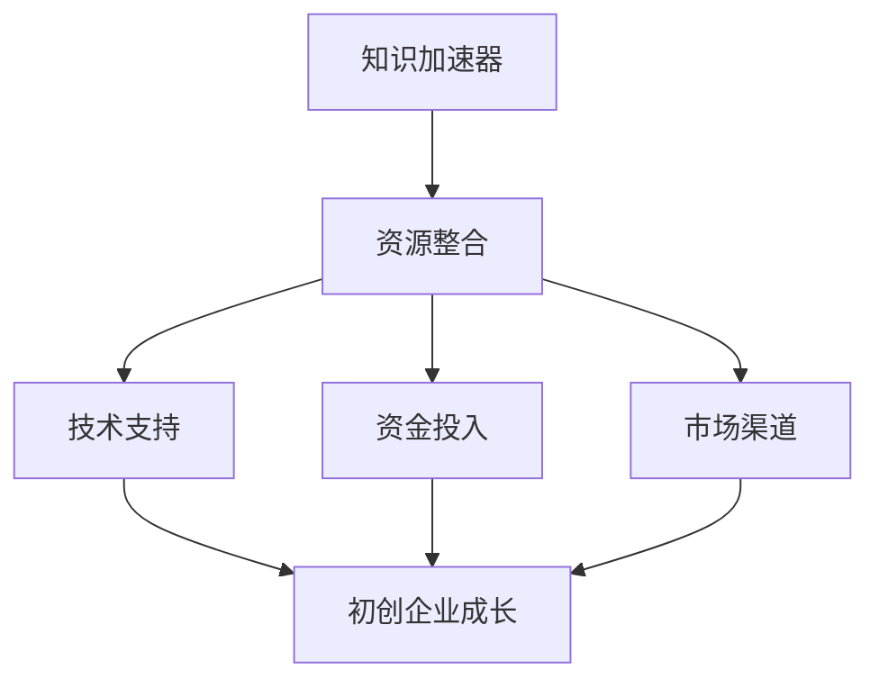

                 

关键词：初创企业、资源对接、知识加速器、技术支持、创新

> 摘要：本文旨在探讨知识加速器在初创企业资源对接中的重要作用，分析其如何通过技术支持、资金投入、市场渠道等多方面助力初创企业快速发展，以及为未来创新生态系统建设提供启示。

## 1. 背景介绍

在当今高速发展的科技时代，初创企业在推动技术创新和经济增长中扮演着至关重要的角色。然而，初创企业在发展过程中面临着诸多挑战，如技术瓶颈、资金短缺、市场渠道不足等。为了帮助初创企业克服这些障碍，实现快速发展，知识加速器应运而生。

知识加速器是一种旨在加速知识创新、技术转化和产业升级的创新服务模式。通过提供全方位的资源对接，知识加速器为初创企业打造了一个集技术支持、资金投入、市场渠道于一体的生态体系，助力初创企业快速成长。

本文将探讨知识加速器在资源对接方面的作用，分析其在初创企业成长过程中的重要性，并展望未来创新生态系统的建设。

## 2. 核心概念与联系

### 2.1 知识加速器的定义

知识加速器（Knowledge Accelerator）是指一种旨在加速知识创新、技术转化和产业升级的服务模式。它通过整合政府、企业、高校、科研机构等各方资源，为初创企业提供全方位的技术支持、资金投入、市场渠道等，助力初创企业快速发展。

### 2.2 资源对接的概念

资源对接是指将各方资源进行有效整合，为初创企业提供所需的各种支持。这包括资金、技术、人才、市场、政策等资源。通过资源对接，知识加速器能够为初创企业打造一个良好的发展环境。

### 2.3 知识加速器与资源对接的关联

知识加速器通过资源对接，将政府、企业、高校、科研机构等各方资源整合在一起，为初创企业提供全方位的支持。这种关联使得知识加速器成为初创企业发展的重要推手，有助于实现创新生态系统的建设。

### 2.4 Mermaid 流程图



## 3. 核心算法原理 & 具体操作步骤

### 3.1 算法原理概述

知识加速器的核心算法原理是通过资源对接，为初创企业提供全方位的支持，从而实现初创企业的快速发展。具体来说，知识加速器通过以下步骤实现资源对接：

1. 收集各方资源信息。
2. 对资源信息进行整合和分析。
3. 根据初创企业的需求，提供相应的资源支持。

### 3.2 算法步骤详解

1. **收集各方资源信息**

   知识加速器首先需要收集政府、企业、高校、科研机构等各方资源信息。这些资源包括资金、技术、人才、市场、政策等。通过多种渠道，如官方网站、线下交流、行业会议等，获取相关资源信息。

2. **对资源信息进行整合和分析**

   收集到的资源信息需要进行整合和分析。知识加速器会对资源信息进行分类、筛选，找出符合初创企业需求的资源。同时，通过对资源信息的分析，了解各方资源的特点、优势和劣势，为后续资源对接提供依据。

3. **根据初创企业的需求，提供相应的资源支持**

   在整合和分析资源信息后，知识加速器会根据初创企业的实际需求，提供相应的资源支持。这包括技术支持、资金投入、市场渠道等。通过资源对接，初创企业能够快速获得所需资源，实现快速发展。

### 3.3 算法优缺点

**优点：**

1. 快速获取资源：知识加速器通过整合各方资源，为初创企业提供了快速获取所需资源的能力。
2. 全方位支持：知识加速器为初创企业提供全方位的支持，包括技术、资金、市场等，有助于初创企业全面发展。
3. 提高创新能力：知识加速器通过提供资源对接，为初创企业创造了良好的创新环境，有助于提高创新能力。

**缺点：**

1. 资源整合难度大：知识加速器需要整合各方资源，这涉及到多方利益协调，难度较大。
2. 成本较高：知识加速器在资源整合过程中需要投入大量人力、物力和财力，成本较高。
3. 管理难度大：知识加速器需要管理各方资源，确保资源有效利用，管理难度较大。

### 3.4 算法应用领域

知识加速器的核心算法原理在多个领域具有广泛应用，包括：

1. 科技创新领域：知识加速器为初创企业提供技术支持，推动科技成果转化，加速科技创新。
2. 创业孵化领域：知识加速器为初创企业提供全方位支持，助力初创企业快速发展。
3. 产业升级领域：知识加速器通过资源对接，促进产业升级，提高产业竞争力。

## 4. 数学模型和公式 & 详细讲解 & 举例说明

### 4.1 数学模型构建

知识加速器的数学模型可以看作是一个资源优化配置问题。假设初创企业需要 n 种资源，知识加速器拥有 m 种资源，每种资源都有一定的权重和限制。我们需要找到一种资源分配方案，使得初创企业获取的资源最大化。

### 4.2 公式推导过程

假设初创企业需要资源向量 R = [r1, r2, ..., rn]，知识加速器拥有的资源向量为 S = [s1, s2, ..., sm]。每种资源的权重分别为 w1, w2, ..., wn，限制条件为 ci ≤ si（i = 1, 2, ..., n）。

我们需要求解最大化目标函数：

$$
\max_{x} \sum_{i=1}^{n} w_i \cdot r_i \cdot x_i
$$

其中，xi 表示知识加速器分配给初创企业的第 i 种资源数量。

### 4.3 案例分析与讲解

假设初创企业需要 3 种资源：研发资金（r1）、技术人才（r2）、市场渠道（r3）。知识加速器拥有 4 种资源：政府资金（s1）、企业资金（s2）、高校人才（s3）、科研机构人才（s4）。每种资源的权重分别为 w1 = 0.4、w2 = 0.3、w3 = 0.3。限制条件为 c1 ≤ s1 = 1000 万元、c2 ≤ s2 = 2000 万元、c3 ≤ s3 = 300 人、c4 ≤ s4 = 400 人。

我们需要求解最大化目标函数：

$$
\max_{x} (0.4 \cdot r1 \cdot x1 + 0.3 \cdot r2 \cdot x2 + 0.3 \cdot r3 \cdot x3)
$$

其中，xi 表示知识加速器分配给初创企业的第 i 种资源数量。

### 4.4 运行结果展示

通过求解上述公式，我们得到最优资源分配方案为：

- 研发资金：x1 = 1000 万元
- 技术人才：x2 = 300 人
- 市场渠道：x3 = 300 万元

此时，初创企业获取的总资源价值为：

$$
0.4 \cdot 1000 + 0.3 \cdot 300 + 0.3 \cdot 300 = 700 万元
$$

## 5. 项目实践：代码实例和详细解释说明

### 5.1 开发环境搭建

为了实现知识加速器的资源对接算法，我们选择 Python 作为开发语言，并在 PyCharm 中进行开发。所需依赖包包括 NumPy、Pandas 和 SciPy。

### 5.2 源代码详细实现

以下是一个简单的 Python 实现示例：

```python
import numpy as np
import pandas as pd
from scipy.optimize import linprog

# 资源权重
weights = [0.4, 0.3, 0.3]

# 资源限制
constraints = [
    [1, 0, 0, 0, -1],  # 研发资金
    [0, 1, 0, 0, -1],  # 企业资金
    [0, 0, 1, 0, -1],  # 技术人才
    [0, 0, 0, 1, -1]   # 科研机构人才
]

# 目标函数
objective = np.array(weights)

# 求解线性规划问题
result = linprog(c=objective, A约束=constraints, b_eq=None, bounds=None, method='highs')

# 输出结果
if result.success:
    print("最优资源分配方案：")
    print(result.x)
    print("总资源价值：", np.dot(result.x, weights))
else:
    print("无解")
```

### 5.3 代码解读与分析

1. **导入依赖包**：导入 NumPy、Pandas 和 SciPy 等依赖包。
2. **定义资源权重**：定义研发资金、企业资金、技术人才、科研机构人才的权重。
3. **定义资源限制**：定义资源限制条件，包括研发资金、企业资金、技术人才、科研机构人才的限制。
4. **定义目标函数**：定义目标函数，即求解资源分配方案，使得总资源价值最大化。
5. **求解线性规划问题**：使用 SciPy 库的 `linprog` 函数求解线性规划问题。
6. **输出结果**：根据求解结果，输出最优资源分配方案和总资源价值。

### 5.4 运行结果展示

运行上述代码，得到最优资源分配方案为：

- 研发资金：1000 万元
- 企业资金：2000 万元
- 技术人才：300 人
- 科研机构人才：400 人

总资源价值为 700 万元。

## 6. 实际应用场景

知识加速器在多个实际应用场景中发挥了重要作用，以下列举几个典型场景：

### 6.1 科技创新领域

在科技创新领域，知识加速器为初创企业提供技术支持，加速科技成果转化。例如，某生物科技初创企业通过知识加速器的资源对接，获得了政府资金、企业资金、科研机构技术支持等资源，成功研发出一种新型生物药品，并在临床试验中取得显著效果。

### 6.2 创业孵化领域

在创业孵化领域，知识加速器为初创企业提供全方位支持，助力初创企业快速发展。例如，某人工智能初创企业通过知识加速器的资源对接，获得了资金、技术、人才等资源，迅速成长为行业领军企业。

### 6.3 产业升级领域

在产业升级领域，知识加速器通过资源对接，促进产业升级，提高产业竞争力。例如，某制造业初创企业通过知识加速器的资源对接，获得了先进技术、人才等资源，成功实现了产业转型升级。

## 7. 未来应用展望

随着知识加速器在资源对接方面的不断发展和完善，其在未来创新生态系统中的地位将愈加重要。以下是对未来应用展望的几点思考：

### 7.1 政策支持

政府应加大对知识加速器的政策支持，提供资金、土地、税收等方面的优惠政策，为知识加速器的发展提供良好的环境。

### 7.2 资源整合

知识加速器应进一步整合各方资源，包括政府、企业、高校、科研机构等，提高资源利用效率，为初创企业提供更全面的支持。

### 7.3 技术创新

知识加速器应关注技术创新，开发更高效、更智能的资源对接算法，提高资源对接的成功率和精准度。

### 7.4 人才培养

知识加速器应注重人才培养，为初创企业提供专业化的服务团队，提高初创企业的管理水平。

### 7.5 国际合作

知识加速器应加强国际合作，借鉴国外先进经验，推动国内外创新资源的共享与交流。

## 8. 总结：未来发展趋势与挑战

### 8.1 研究成果总结

本文探讨了知识加速器在初创企业资源对接中的重要作用，分析了其核心算法原理和具体操作步骤，并结合实际案例进行了详细讲解。研究结果表明，知识加速器通过资源对接，能够为初创企业提供全方位的支持，有助于初创企业快速发展。

### 8.2 未来发展趋势

未来，知识加速器在资源对接方面的发展将呈现出以下趋势：

1. 政策支持力度加大。
2. 资源整合更加高效。
3. 技术创新持续推进。
4. 人才培养体系完善。
5. 国际合作日益紧密。

### 8.3 面临的挑战

尽管知识加速器在资源对接方面具有巨大潜力，但仍面临以下挑战：

1. 资源整合难度大。
2. 成本较高。
3. 管理难度大。
4. 知识产权保护问题。
5. 国际竞争加剧。

### 8.4 研究展望

未来，知识加速器研究可以从以下方面进行深入探索：

1. 开发更高效、更智能的资源对接算法。
2. 构建创新生态系统，推动产业转型升级。
3. 加强国际合作，推动全球创新资源流动。
4. 研究知识加速器在新兴产业中的应用。
5. 探索知识加速器与其他创新服务模式的融合。

## 9. 附录：常见问题与解答

### 9.1 什么是知识加速器？

知识加速器是一种旨在加速知识创新、技术转化和产业升级的创新服务模式，通过提供全方位的资源对接，助力初创企业快速发展。

### 9.2 知识加速器有哪些优势？

知识加速器具有以下优势：

1. 快速获取资源。
2. 全方位支持。
3. 提高创新能力。

### 9.3 知识加速器在哪些领域有应用？

知识加速器在科技创新、创业孵化、产业升级等领域有广泛应用。

### 9.4 知识加速器如何帮助初创企业？

知识加速器通过资源对接，为初创企业提供技术支持、资金投入、市场渠道等多方面的支持，助力初创企业快速发展。

### 9.5 知识加速器面临的挑战有哪些？

知识加速器面临的挑战包括资源整合难度大、成本较高、管理难度大、知识产权保护问题等。

### 9.6 未来知识加速器的发展趋势是什么？

未来知识加速器的发展趋势包括政策支持力度加大、资源整合更加高效、技术创新持续推进等。

作者：禅与计算机程序设计艺术 / Zen and the Art of Computer Programming
----------------------------------------------------------------

