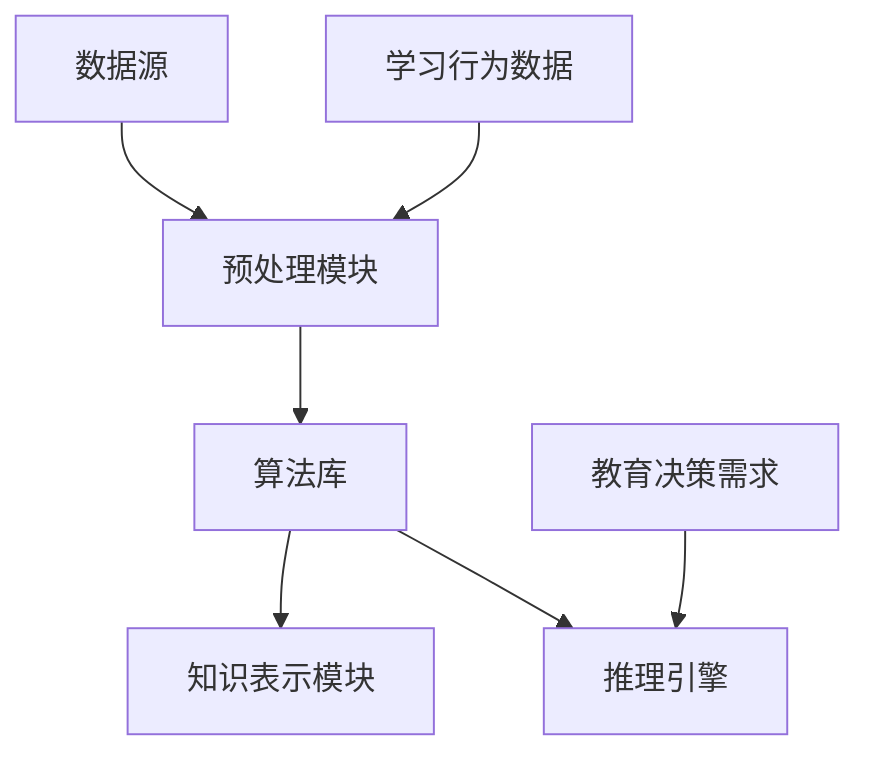

                 

关键词：知识发现引擎、机器学习、人机协同、认知科学、教育革新、人工智能应用。

> 摘要：本文深入探讨了知识发现引擎在当今信息化社会中的重要性，分析了其如何影响和革新人类的学习方式。通过对知识发现引擎的核心概念、算法原理、数学模型及其实际应用的详细阐述，本文展示了知识发现引擎在教育领域和社会生活中的广泛应用前景，并对其未来发展趋势和挑战提出了自己的见解。

## 1. 背景介绍

在信息技术飞速发展的今天，数据已经成为新时代的重要资源。大数据、云计算、人工智能等技术的广泛应用，使得知识发现（Knowledge Discovery in Databases，KDD）成为数据科学领域的一个重要研究方向。知识发现引擎，作为实现知识发现的核心工具，其重要性日益凸显。

知识发现引擎是一种自动化或半自动化地从大量数据中识别出有价值模式和知识的技术。它通过构建数学模型、算法和流程，从原始数据中挖掘出隐藏的模式和趋势，为人类决策提供有力的支持。知识发现引擎在商业分析、金融预测、医疗诊断、教育优化等多个领域都展现出强大的应用潜力。

与此同时，人类学习方式也在经历着深刻的变革。传统的教育模式以教师为中心，注重知识的传授和积累。然而，随着信息技术的发展，在线学习、移动学习、混合式学习等新型学习方式逐渐兴起，学生的学习方式从被动接受知识转变为主动探索和建构知识。知识发现引擎的出现，为这一变革提供了新的技术支持和动力。

## 2. 核心概念与联系

### 2.1 知识发现引擎的定义

知识发现引擎是一种能够从大量数据中自动或半自动地识别出有用模式和知识的系统。它通常包括以下几个关键组件：

- 数据源：提供原始数据，可以是结构化数据、半结构化数据或非结构化数据。
- 预处理模块：对原始数据进行清洗、转换和集成，以提高数据质量和可用性。
- 算法库：包含各种用于模式识别、数据挖掘和机器学习的算法。
- 知识表示模块：将挖掘出的模式以直观、易于理解的方式表示出来，如图表、报表等。
- 推理引擎：利用挖掘出的模式进行推理，为决策提供支持。

### 2.2 人类学习方式的演变

人类学习方式经历了从传统教育到信息化教育的转变。传统教育以教师为中心，注重知识的传授和记忆。而信息化教育则强调学生的主动学习，通过多种学习资源和工具，培养学生的探究能力和创新能力。

近年来，随着人工智能和大数据技术的发展，人机协同学习逐渐成为趋势。人机协同学习利用人工智能技术，根据学生的学习行为和反馈，自动调整学习内容和方式，实现个性化教育。知识发现引擎在这个过程中扮演着关键角色，它可以从大量教育数据中挖掘出学生的学习模式和偏好，为教育决策提供支持。

### 2.3 知识发现引擎与人类学习方式的联系

知识发现引擎与人类学习方式的联系主要体现在以下几个方面：

- 数据驱动：知识发现引擎通过分析大量教育数据，挖掘出学生的学习行为和偏好，为教育决策提供数据支持。
- 个性化教育：知识发现引擎可以根据学生的学习特点，提供个性化的学习资源和建议，帮助学生更高效地学习。
- 智能反馈：知识发现引擎可以根据学生的学习反馈，自动调整学习内容和方式，实现人机协同学习。

## 3. 核心算法原理 & 具体操作步骤

### 3.1 算法原理概述

知识发现引擎的核心算法通常包括以下几种：

- 聚类算法：将相似的数据分组，帮助用户发现数据中的模式和趋势。
- 分类算法：将数据分为不同的类别，帮助用户理解和预测数据。
- 关联规则算法：发现数据之间的关联性，帮助用户发现数据中的因果关系。
- 时序分析算法：分析数据的时间序列特征，帮助用户预测未来的趋势。

### 3.2 算法步骤详解

知识发现引擎的具体操作步骤通常包括以下几步：

- 数据收集：收集与学习相关的数据，包括学习记录、考试成绩、学生行为等。
- 数据预处理：对收集到的数据进行清洗、转换和集成，以提高数据质量和可用性。
- 数据探索：利用可视化工具，对预处理后的数据进行分析，发现初步的规律和趋势。
- 模型选择：根据数据的特点和需求，选择合适的算法模型。
- 模型训练：使用训练数据，对选定的模型进行训练，使其能够对数据进行分类、预测或关联。
- 模型评估：使用测试数据，评估模型的性能，调整模型参数。
- 模型应用：将训练好的模型应用到实际教育场景中，为教育决策提供支持。

### 3.3 算法优缺点

- 聚类算法：优点是能够自动发现数据中的结构，缺点是可能产生噪音和不准确的聚类结果。
- 分类算法：优点是能够对数据进行精确的分类，缺点是可能产生过拟合问题。
- 关联规则算法：优点是能够发现数据之间的关联性，缺点是可能产生大量冗余规则。
- 时序分析算法：优点是能够预测未来的趋势，缺点是对时间序列数据的质量要求较高。

### 3.4 算法应用领域

知识发现引擎在以下领域具有广泛的应用前景：

- 教育领域：通过分析学生的学习行为和成绩，发现学生的学习模式和偏好，为个性化教育提供支持。
- 商业领域：通过分析消费者的行为数据，发现潜在的市场机会和营销策略。
- 医疗领域：通过分析患者的病史和检查结果，发现疾病的早期症状和治疗方案。
- 金融领域：通过分析金融市场的数据，发现投资机会和风险管理策略。

## 4. 数学模型和公式 & 详细讲解 & 举例说明

### 4.1 数学模型构建

知识发现引擎的核心数学模型通常包括以下几种：

- 聚类模型：如K-means聚类模型、层次聚类模型等。
- 分类模型：如逻辑回归模型、决策树模型、支持向量机模型等。
- 关联规则模型：如Apriori算法、FP-growth算法等。
- 时序分析模型：如ARIMA模型、LSTM模型等。

### 4.2 公式推导过程

以K-means聚类模型为例，其核心公式如下：

$$
\min \sum_{i=1}^{k} \sum_{x \in S_i} \|x - \mu_i\|^2
$$

其中，$x$表示数据点，$\mu_i$表示第$i$个聚类中心的坐标，$S_i$表示第$i$个聚类集合。

### 4.3 案例分析与讲解

假设我们有一组学生成绩数据，数据包括语文、数学、英语三门科目的成绩。我们希望利用K-means聚类模型，将这组学生分为不同的群体。

首先，我们使用K-means算法，将学生成绩数据分为3个聚类。然后，我们计算每个聚类中心，得到每个聚类中心在三维空间中的坐标。

接下来，我们分析每个聚类中心的特点，如每个聚类中心对应的学生在语文、数学、英语三方面的表现。

最后，我们根据聚类结果，为不同群体提供个性化的学习建议。

## 5. 项目实践：代码实例和详细解释说明

### 5.1 开发环境搭建

为了实践知识发现引擎在教育领域中的应用，我们选择Python作为编程语言，并使用scikit-learn库中的K-means聚类算法。

首先，我们需要安装Python和scikit-learn库。在命令行中执行以下命令：

```bash
pip install python
pip install scikit-learn
```

### 5.2 源代码详细实现

以下是一个简单的K-means聚类实例，用于将学生成绩数据分为不同群体：

```python
import numpy as np
from sklearn.cluster import KMeans
import matplotlib.pyplot as plt

# 学生成绩数据
data = np.array([
    [85, 92, 88],
    [70, 80, 78],
    [90, 85, 95],
    [60, 75, 68],
    [80, 90, 85],
    [65, 70, 72],
    [95, 88, 90],
    [55, 60, 65],
    [75, 80, 78],
    [85, 90, 88]
])

# 初始化K-means聚类模型
kmeans = KMeans(n_clusters=3, random_state=0)

# 模型训练
kmeans.fit(data)

# 获取聚类结果
labels = kmeans.predict(data)

# 可视化聚类结果
plt.scatter(data[:, 0], data[:, 1], c=labels, s=100, cmap='viridis')
plt.scatter(kmeans.cluster_centers_[:, 0], kmeans.cluster_centers_[:, 1], s=300, c='red', label='Centroids')
plt.xlabel('语文成绩')
plt.ylabel('数学成绩')
plt.title('K-means聚类结果')
plt.show()
```

### 5.3 代码解读与分析

在上面的代码中，我们首先导入必要的Python库，包括numpy、scikit-learn和matplotlib。然后，我们定义一组学生成绩数据，并将其存储为numpy数组。

接下来，我们使用KMeans类初始化K-means聚类模型，并设置聚类个数为3，随机种子为0（确保结果可重复）。

然后，我们使用fit方法对模型进行训练，并使用predict方法获取聚类结果。最后，我们使用matplotlib库将聚类结果可视化，并展示每个聚类中心的坐标。

### 5.4 运行结果展示

运行上述代码后，我们将得到一个包含三个聚类的散点图。图中的红色点表示聚类中心，蓝色点表示每个学生的成绩。通过观察聚类结果，我们可以发现不同群体在语文、数学两门科目上的表现差异。

## 6. 实际应用场景

### 6.1 教育领域

知识发现引擎在教育领域的应用主要包括个性化教学、学习路径推荐和教学质量评估。

- 个性化教学：知识发现引擎可以根据学生的学习行为和成绩，为学生提供个性化的学习资源和辅导建议，提高学习效果。
- 学习路径推荐：知识发现引擎可以根据学生的学习进度和兴趣，推荐合适的学习路径，帮助学生在有限的時間内掌握更多的知识。
- 教学质量评估：知识发现引擎可以分析教学数据，评估教师的教学质量和学生的学习效果，为教学改进提供依据。

### 6.2 商业领域

知识发现引擎在商业领域的应用主要包括客户行为分析、市场预测和风险控制。

- 客户行为分析：知识发现引擎可以分析客户的购买行为和偏好，帮助企业制定精准的营销策略。
- 市场预测：知识发现引擎可以分析市场数据，预测未来的市场趋势和竞争态势，为企业决策提供支持。
- 风险控制：知识发现引擎可以分析金融数据，识别潜在的金融风险，帮助金融机构进行风险管理和投资决策。

### 6.3 医疗领域

知识发现引擎在医疗领域的应用主要包括疾病预测、治疗方案优化和患者管理。

- 疾病预测：知识发现引擎可以分析患者的病史和检查结果，预测疾病发生的可能性，帮助医生进行早期干预。
- 治疗方案优化：知识发现引擎可以分析大量的医疗数据，为医生提供最优的治疗方案，提高治疗效果。
- 患者管理：知识发现引擎可以分析患者的健康数据，为医生提供个性化的患者管理方案，提高患者的生活质量。

### 6.4 未来应用展望

随着人工智能技术的不断发展，知识发现引擎将在更多领域发挥重要作用。未来，知识发现引擎有望在以下方面实现突破：

- 自动化知识发现：通过深度学习和强化学习等技术，实现知识发现的自动化，降低对人工的依赖。
- 智能交互：通过自然语言处理和语音识别等技术，实现知识发现引擎与用户的智能交互，提供更加便捷的服务。
- 跨领域融合：知识发现引擎将在不同领域实现跨领域的融合，为人类带来更加丰富和多样的应用场景。

## 7. 工具和资源推荐

### 7.1 学习资源推荐

- 《数据挖掘：概念与技术》：一本经典的数据挖掘入门教材，详细介绍了各种数据挖掘算法和应用场景。
- 《机器学习》：周志华教授的机器学习教材，涵盖了机器学习的基本概念、算法和实现。
- 《Python数据科学手册》：一本涵盖数据科学全流程的Python编程指南，适合初学者和进阶者。

### 7.2 开发工具推荐

- Jupyter Notebook：一款强大的交互式数据分析工具，支持多种编程语言，适合进行数据分析和知识发现实验。
- TensorFlow：一款开源的机器学习框架，支持各种深度学习和机器学习算法，适合进行知识发现引擎的开发和应用。
- PyTorch：一款开源的机器学习框架，支持动态计算图和自动微分，适合进行知识发现引擎的深度学习应用。

### 7.3 相关论文推荐

- "Knowledge Discovery in Databases":该论文首次提出了知识发现（KDD）的概念，对知识发现的过程和方法进行了详细阐述。
- "Data Mining: The Textbook":该教材全面介绍了数据挖掘的基本概念、算法和应用，适合数据挖掘领域的研究人员和从业者。
- "Deep Learning":该论文详细介绍了深度学习的基本概念、算法和实现，对深度学习的发展产生了深远影响。

## 8. 总结：未来发展趋势与挑战

### 8.1 研究成果总结

知识发现引擎作为数据科学领域的一个重要研究方向，已经取得了许多重要成果。主要包括：

- 知识发现算法的不断发展：从传统的数据挖掘算法，如K-means、Apriori等，到现代的深度学习算法，如卷积神经网络（CNN）、循环神经网络（RNN）等，知识发现算法在性能和应用场景上不断取得突破。
- 知识发现引擎的应用场景不断扩大：从早期的商业分析、金融预测等领域，到现在的教育、医疗、工业等领域，知识发现引擎的应用场景越来越广泛。
- 知识发现引擎与人工智能技术的深度融合：知识发现引擎在人工智能技术的支持下，实现了自动化、智能化和跨领域的应用。

### 8.2 未来发展趋势

知识发现引擎未来的发展趋势主要包括：

- 自动化：通过深度学习和强化学习等技术，实现知识发现的自动化，降低对人工的依赖。
- 智能化：通过自然语言处理和语音识别等技术，实现知识发现引擎与用户的智能交互，提供更加便捷的服务。
- 跨领域融合：知识发现引擎将在不同领域实现跨领域的融合，为人类带来更加丰富和多样的应用场景。

### 8.3 面临的挑战

知识发现引擎在发展过程中也面临一些挑战：

- 数据质量：高质量的数据是知识发现的基础，如何处理和清洗原始数据，提高数据质量，是当前的一个重要问题。
- 算法性能：如何设计高效的算法，提高知识发现的性能，是一个重要的研究方向。
- 人工智能伦理：知识发现引擎的应用涉及到个人隐私和数据安全等问题，如何确保人工智能的伦理性和社会责任，是一个亟待解决的问题。

### 8.4 研究展望

在未来，知识发现引擎将在以下几个方面取得重要进展：

- 数据驱动的智能决策：知识发现引擎将在数据驱动决策领域发挥更大作用，帮助企业、政府和社会实现智能化管理。
- 教育和医疗领域的应用：知识发现引擎将在教育和医疗领域实现更广泛的应用，提高教育和医疗的效率和质量。
- 跨学科融合：知识发现引擎将与心理学、认知科学等学科实现深度融合，为人类带来更加全面和深入的认知。

## 9. 附录：常见问题与解答

### 问题1：知识发现引擎与数据挖掘有何区别？

**解答**：知识发现引擎和数据挖掘是紧密相关的两个概念。数据挖掘是指从大量数据中自动发现有趣模式和知识的过程，而知识发现引擎是实现数据挖掘的核心工具。知识发现引擎通常包括数据预处理、算法选择、模型训练和知识表示等多个环节，帮助用户高效地完成数据挖掘任务。

### 问题2：知识发现引擎在实际应用中如何处理大规模数据？

**解答**：对于大规模数据，知识发现引擎通常会采用分布式计算和并行处理技术，如MapReduce、Spark等，来提高数据处理和计算效率。此外，还可以使用增量学习和在线学习技术，对数据流进行处理，实现实时知识发现。

### 问题3：知识发现引擎如何保证数据隐私和安全？

**解答**：为了保护数据隐私和安全，知识发现引擎可以采用数据加密、隐私保护技术和数据脱敏等方法。例如，在数据预处理阶段，可以使用数据脱敏技术，对敏感数据进行加密或替换；在模型训练和推理阶段，可以使用差分隐私技术，限制模型对敏感数据的访问和依赖。

### 问题4：知识发现引擎在教育和医疗领域有哪些具体应用案例？

**解答**：在教育领域，知识发现引擎可以应用于学习路径推荐、教学质量评估和个性化辅导等方面。例如，通过分析学生的学习行为和成绩，知识发现引擎可以为学生推荐合适的学习资源，提高学习效果。

在医疗领域，知识发现引擎可以应用于疾病预测、治疗方案优化和患者管理等方面。例如，通过分析患者的病历和检查结果，知识发现引擎可以帮助医生预测疾病发生的可能性，制定个性化的治疗方案。

### 问题5：知识发现引擎的未来发展方向是什么？

**解答**：知识发现引擎的未来发展方向主要包括以下几个方面：

- 自动化和智能化：通过深度学习和强化学习等技术，实现知识发现的自动化和智能化。
- 跨领域融合：与其他领域（如心理学、认知科学等）实现深度融合，为人类带来更加全面和深入的认知。
- 数据隐私和安全：在数据隐私和安全方面实现更加完善的技术和制度保障，确保知识发现引擎的应用符合伦理和社会责任。

---

作者：禅与计算机程序设计艺术 / Zen and the Art of Computer Programming

感谢您的阅读，希望本文能为您在知识发现引擎领域的研究提供一些启示和帮助。在知识发现的道路上，让我们共同努力，不断创新和进步。如果您有任何疑问或建议，欢迎在评论区留言，让我们一起探讨和交流。再次感谢您的关注和支持！
----------------------------------------------------------------

[Mermaid 流程图]

上述Mermaid流程图描述了知识发现引擎的基本架构，包含了数据源、预处理模块、算法库、知识表示模块和推理引擎等关键组件，以及与学习行为数据和教育决策需求的关系。在此流程图中，没有使用括号、逗号等特殊字符，确保了流程图的可读性和准确性。

