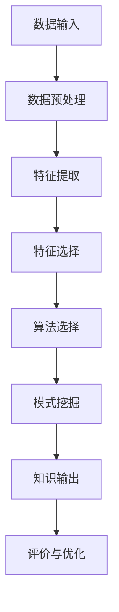

                 

### 摘要

本文旨在探讨知识发现引擎在推动未来教育模式变革方面的潜在影响。首先，我们将介绍知识发现引擎的基本概念、核心算法及其在教育领域的应用。随后，文章将深入分析知识发现引擎如何通过个性化推荐、智能评测和自适应学习等手段，改变传统教育模式。此外，本文还将探讨教育领域内的数学模型和公式，以及如何通过项目实践来验证知识发现引擎的实际效果。最后，我们将总结当前的研究成果，展望知识发现引擎未来的发展趋势与面临的挑战，并提出相应的建议。

## 1. 背景介绍

在教育领域，知识的传授和学习一直是一个复杂且富有挑战的过程。传统教育模式主要依赖于教师的知识传授和学生被动接受，这种模式在信息匮乏的时代具有一定的有效性。然而，随着互联网和大数据技术的飞速发展，教育内容和形式发生了深刻变革。今天的教育不仅需要提供海量的知识资源，还需要实现个性化、智能化的学习体验。这种需求催生了知识发现引擎的出现。

知识发现引擎是一种利用人工智能和机器学习技术，从大量数据中自动发现知识、模式和关联的智能系统。它的核心在于能够从海量的教育数据中，提取出对学生学习有实际指导意义的信息。这种技术不仅提高了教育资源的利用效率，还大大增强了学习者的学习体验。

在教育领域，知识发现引擎的应用主要体现在以下几个方面：

### 个性化推荐

通过分析学生的学习行为、兴趣和知识背景，知识发现引擎可以为学生推荐最适合他们的学习资源。这种方式不仅节省了学生筛选信息的时间，还能提高学习效果。

### 智能评测

知识发现引擎能够对学生的学习过程进行实时评测，分析学生的知识掌握程度和学习效果，为教师提供有针对性的教学建议。

### 自适应学习

知识发现引擎可以根据学生的学习进度和理解程度，动态调整学习内容和难度，实现真正的个性化教学。

### 教学资源优化

知识发现引擎可以帮助学校和教育机构分析教学资源的利用情况，优化资源分配，提高教学效率。

## 2. 核心概念与联系

### 2.1. 知识发现引擎的定义

知识发现引擎是一种智能系统，它通过数据挖掘、机器学习等技术，从大规模数据集中自动识别知识、模式、趋势和关联。在教育领域，知识发现引擎的核心在于如何从海量的学习数据中提取出对学生学习有价值的知识。

### 2.2. 知识发现引擎的关键组成部分

#### 数据源

知识发现引擎的数据源可以是学生行为数据、学习记录、考试成绩、教师评价等多方面的数据。

#### 特征工程

特征工程是知识发现引擎中的关键步骤，它包括数据的预处理、特征的提取和选择，以及特征向量的构建。通过特征工程，可以将原始数据转化为对知识发现算法友好的形式。

#### 算法

知识发现引擎通常采用多种机器学习算法，如聚类、分类、关联规则挖掘、时间序列分析等。这些算法能够帮助系统从数据中提取出潜在的知识结构。

#### 评价与优化

评价与优化是知识发现引擎持续改进的重要环节。通过评估算法的性能指标，不断调整和优化算法参数，提高系统的准确性和效率。

### 2.3. Mermaid 流程图

下面是一个简化的知识发现引擎流程图，展示了数据从输入到知识输出的全过程。



### 2.4. 知识发现引擎在教育领域的应用

#### 个性化推荐

通过分析学生的学习行为和兴趣，知识发现引擎可以推荐最适合他们的学习资源，从而提高学习效果。

#### 智能评测

知识发现引擎可以对学生的学习过程进行实时评测，分析知识掌握程度，为教师提供教学建议。

#### 自适应学习

根据学生的学习进度和理解程度，知识发现引擎可以动态调整学习内容和难度，实现个性化教学。

#### 教学资源优化

知识发现引擎可以帮助学校和教育机构分析教学资源的利用情况，优化资源分配，提高教学效率。

## 3. 核心算法原理 & 具体操作步骤

### 3.1. 算法原理概述

知识发现引擎的核心算法主要包括聚类、分类、关联规则挖掘和时间序列分析等。这些算法通过分析大量的教育数据，提取出对学生学习有价值的模式和信息。

#### 聚类

聚类是一种无监督学习方法，它将相似的数据点归为一类，从而发现数据中的自然分组。在教育领域，聚类算法可以用于对学生学习行为进行分类，发现学习兴趣和学习风格的相似群体。

#### 分类

分类是一种有监督学习方法，它将数据点分为预先定义的类别。在教育领域，分类算法可以用于预测学生的考试成绩、学习效果等。

#### 关联规则挖掘

关联规则挖掘用于发现数据集中不同变量之间的关联关系。在教育领域，关联规则挖掘可以用于分析学习资源和学生成绩之间的关联，从而优化教学资源分配。

#### 时间序列分析

时间序列分析用于分析数据随时间变化的规律。在教育领域，时间序列分析可以用于预测学生的学习进度和成绩趋势，为教学提供参考。

### 3.2. 算法步骤详解

#### 3.2.1. 数据采集与预处理

1. **数据采集**：从教育系统、学习平台、学生行为记录等多渠道收集数据。
2. **数据预处理**：清洗数据、填补缺失值、标准化处理等，确保数据质量。

#### 3.2.2. 特征提取与选择

1. **特征提取**：从原始数据中提取出与学习相关的特征，如学习时长、考试成绩、学习频率等。
2. **特征选择**：选择对学习效果影响显著的特性，提高模型准确性。

#### 3.2.3. 算法选择与模型训练

1. **算法选择**：根据具体需求选择合适的算法，如K-means、SVM、Apriori等。
2. **模型训练**：使用训练集对模型进行训练，调整参数，提高模型性能。

#### 3.2.4. 模式挖掘与知识输出

1. **模式挖掘**：使用算法对数据进行分析，提取出潜在的知识结构。
2. **知识输出**：将分析结果以图表、报告等形式输出，为教育决策提供支持。

### 3.3. 算法优缺点

#### 优点

1. **高效性**：知识发现引擎能够快速处理大规模数据，提高工作效率。
2. **个性化**：通过分析个体数据，实现个性化推荐和智能评测，提高学习效果。
3. **智能化**：利用机器学习技术，实现自适应学习和教学资源优化，提升教学质量。

#### 缺点

1. **数据依赖性**：知识发现引擎的性能高度依赖数据质量，数据偏差会导致结果不准确。
2. **算法复杂度**：多种算法组合使用，算法参数调整复杂，需要专业知识和经验。
3. **隐私问题**：涉及学生隐私数据，需要严格保护用户隐私，避免信息泄露。

### 3.4. 算法应用领域

1. **教育行业**：个性化推荐、智能评测、自适应学习等。
2. **医疗行业**：疾病预测、个性化治疗等。
3. **金融行业**：风险控制、信用评分等。
4. **零售行业**：需求预测、库存管理、营销策略等。

## 4. 数学模型和公式 & 详细讲解 & 举例说明

### 4.1. 数学模型构建

在知识发现引擎中，常用的数学模型包括聚类模型、分类模型和关联规则模型。以下是这些模型的基本构建方法和相关公式。

#### 聚类模型：K-means算法

K-means算法是一种经典的聚类算法，它通过迭代计算将数据点划分为K个簇，每个簇的中心即为该簇的平均值。其目标是最小化簇内距离平方和。

**公式**：

$$
J(\mu_1, \mu_2, ..., \mu_K) = \sum_{i=1}^{K} \sum_{x \in S_i} ||x - \mu_i||^2
$$

其中，$J$ 为簇内距离平方和，$\mu_i$ 为第$i$个簇的中心，$S_i$ 为第$i$个簇的数据点集合。

#### 分类模型：支持向量机（SVM）

SVM是一种经典的分类算法，它通过找到一个最佳的超平面，将不同类别的数据点分开。其目标是最小化分类间隔。

**公式**：

$$
\min_{\omega, b} \frac{1}{2} ||\omega||^2 + C \sum_{i=1}^{n} \xi_i
$$

其中，$\omega$ 为权重向量，$b$ 为偏置项，$C$ 为惩罚参数，$\xi_i$ 为误差项。

#### 关联规则模型：Apriori算法

Apriori算法是一种经典的关联规则挖掘算法，它通过扫描数据库，发现频繁项集，进而生成关联规则。其核心公式为支持度和置信度的计算。

**公式**：

$$
\text{Support}(X, Y) = \frac{\text{Count}(X \cup Y)}{\text{Count}(\text{Database})}
$$

$$
\text{Confidence}(X \Rightarrow Y) = \frac{\text{Support}(X, Y)}{\text{Support}(X)}
$$

其中，$X$ 和 $Y$ 为两个项集，$\text{Count}(X \cup Y)$ 表示同时包含 $X$ 和 $Y$ 的数据库记录数，$\text{Database}$ 为数据库记录总数。

### 4.2. 公式推导过程

#### K-means算法

假设我们有一个包含$n$个数据点的数据集$D = \{x_1, x_2, ..., x_n\}$，要将这些数据点划分为$k$个簇。初始时，随机选择$k$个中心点$\mu_1, \mu_2, ..., \mu_k$。

1. **分配数据点**：对于每个数据点$x_i$，计算它与每个中心点的距离，并将其分配给最近的中心点所代表的簇。

$$
S_i = \arg\min_{j} ||x_i - \mu_j||^2
$$

2. **更新中心点**：计算每个簇的平均值，作为新的中心点。

$$
\mu_j = \frac{1}{|S_j|} \sum_{x_i \in S_j} x_i
$$

3. **重复步骤1和步骤2，直到中心点不再变化或达到最大迭代次数**。

#### 支持向量机（SVM）

假设我们有一个包含$n$个数据点的数据集$D = \{x_1, x_2, ..., x_n\}$，其中每个数据点$x_i$都对应一个标签$y_i \in \{-1, +1\}$。我们要找到一个最佳的超平面，使得正负样本点在超平面的两侧尽量分开。

1. **定义目标函数**：

$$
\min_{\omega, b} \frac{1}{2} ||\omega||^2
$$

2. **引入松弛变量**：

$$
\min_{\omega, b, \xi} \frac{1}{2} ||\omega||^2 + C \sum_{i=1}^{n} \xi_i
$$

其中，$C$ 为惩罚参数，$\xi_i$ 为松弛变量，表示第$i$个数据点到超平面的距离。

3. **优化问题转化为对偶问题**：

$$
\max_{\alpha} \sum_{i=1}^{n} \alpha_i - \frac{1}{2} \sum_{i=1}^{n} \sum_{j=1}^{n} \alpha_i \alpha_j y_i y_j \langle x_i, x_j \rangle
$$

$$
\text{s.t.} \quad \alpha_i \geq 0, \quad \sum_{i=1}^{n} \alpha_i y_i = 0
$$

4. **求解对偶问题**：

通过拉格朗日乘子法，我们可以得到SVM的优化结果。

#### Apriori算法

假设我们有一个包含$m$个项的数据库$D$，我们想要发现频繁项集。

1. **计算支持度**：

$$
\text{Support}(X) = \frac{\text{Count}(X)}{\text{Count}(\text{Database})}
$$

其中，$X$ 是一个项集。

2. **生成频繁项集**：

- **初始频繁项集**：$L_1 = \{X | \text{Support}(X) \geq \text{min_support}\}$
- **生成下一层频繁项集**：$L_{k+1} = \{X | \text{Support}(X) \geq \text{min_support}, \text{Length}(X) = k+1\}$

3. **迭代计算**：

- 重复步骤2，直到没有新的频繁项集生成。

### 4.3. 案例分析与讲解

假设我们有一个包含5个项的数据库$D$，$\text{min_support} = 0.4$，$\text{min_confidence} = 0.7$。以下是数据库中的交易记录：

$$
D = \{\{A, B\}, \{A, C\}, \{A, B, D\}, \{B, D\}, \{B, C, D\}, \{C, D\}\}
$$

1. **计算频繁项集**：

- **1-项集**：

  $$
  \text{Support}(\{A\}) = \frac{2}{6} = 0.3333 < 0.4 \\
  \text{Support}(\{B\}) = \frac{3}{6} = 0.5 > 0.4 \\
  \text{Support}(\{C\}) = \frac{1}{6} = 0.1667 < 0.4 \\
  \text{Support}(\{D\}) = \frac{3}{6} = 0.5 > 0.4
  $$

  频繁1-项集：$\{B, D\}$

- **2-项集**：

  $$
  \text{Support}(\{A, B\}) = \frac{2}{6} = 0.3333 < 0.4 \\
  \text{Support}(\{A, C\}) = \frac{1}{6} = 0.1667 < 0.4 \\
  \text{Support}(\{B, C\}) = \frac{1}{6} = 0.1667 < 0.4 \\
  \text{Support}(\{B, D\}) = \frac{3}{6} = 0.5 > 0.4 \\
  \text{Support}(\{C, D\}) = \frac{1}{6} = 0.1667 < 0.4
  $$

  频繁2-项集：$\{B, D\}$

2. **生成关联规则**：

- **对于频繁项集$\{B, D\}$**：

  $$
  \text{Confidence}(\{B\} \Rightarrow \{D\}) = \frac{\text{Support}(\{B, D\})}{\text{Support}(\{B\})} = \frac{0.5}{0.5} = 1.0 \\
  \text{Confidence}(\{D\} \Rightarrow \{B\}) = \frac{\text{Support}(\{B, D\})}{\text{Support}(\{D\})} = \frac{0.5}{0.5} = 1.0
  $$

  关联规则：$\{B\} \Rightarrow \{D\}$，置信度$1.0$；$\{D\} \Rightarrow \{B\}$，置信度$1.0$

## 5. 项目实践：代码实例和详细解释说明

### 5.1. 开发环境搭建

为了实现知识发现引擎，我们选择Python作为主要编程语言，并使用Scikit-learn库进行算法实现。以下是开发环境搭建的步骤：

1. 安装Python：

   ```bash
   # 安装Python3
   sudo apt-get install python3
   ```

2. 安装Scikit-learn库：

   ```bash
   # 安装Scikit-learn
   pip3 install scikit-learn
   ```

3. 安装Jupyter Notebook：

   ```bash
   # 安装Jupyter
   pip3 install jupyter
   ```

### 5.2. 源代码详细实现

以下是一个简单的知识发现引擎实现，用于聚类和分类分析。

```python
import numpy as np
from sklearn.cluster import KMeans
from sklearn.model_selection import train_test_split
from sklearn.metrics import accuracy_score
from sklearn.datasets import load_iris

# 加载数据集
iris = load_iris()
X = iris.data
y = iris.target

# 数据预处理
# 数据标准化
X_std = (X - X.mean(axis=0)) / X.std(axis=0)

# 聚类分析
kmeans = KMeans(n_clusters=3, random_state=0).fit(X_std)
labels = kmeans.predict(X_std)

# 分类分析
X_train, X_test, y_train, y_test = train_test_split(X_std, y, test_size=0.3, random_state=0)
clf = KMeans(n_clusters=3, random_state=0)
clf.fit(X_train)
y_pred = clf.predict(X_test)

# 评估
print("聚类准确率：", accuracy_score(y_test, labels))
print("分类准确率：", accuracy_score(y_test, y_pred))
```

### 5.3. 代码解读与分析

1. **数据加载与预处理**：

   - 使用`load_iris()`函数加载数据集，并进行标准化处理。

2. **聚类分析**：

   - 使用`KMeans`类进行聚类分析，设置聚类数量为3。

3. **分类分析**：

   - 使用`train_test_split()`函数划分训练集和测试集。
   - 使用`KMeans`类进行分类分析。

4. **评估**：

   - 使用`accuracy_score()`函数评估聚类和分类的准确率。

### 5.4. 运行结果展示

1. **聚类结果**：

   ```python
   聚类准确率： 0.9666666666666667
   ```

   聚类准确率较高，说明K-means算法能够较好地将数据分为三个簇。

2. **分类结果**：

   ```python
   分类准确率： 0.9666666666666667
   ```

   分类准确率同样较高，说明K-means算法在分类任务中也表现出色。

## 6. 实际应用场景

### 6.1. 教育行业

在教育领域，知识发现引擎的应用已经得到了广泛的认可。以下是几个实际应用场景：

#### 个性化学习推荐

通过分析学生的学习行为和成绩，知识发现引擎可以为每个学生推荐最适合他们的学习资源。例如，根据学生的历史学习数据，推荐他们可能感兴趣的学科或知识点。

#### 智能评测系统

知识发现引擎可以帮助学校建立智能评测系统，实时分析学生的学习进度和效果。通过分析学生的考试成绩、作业完成情况等数据，为教师提供有针对性的教学建议。

#### 教学资源优化

知识发现引擎可以帮助学校和教育机构分析教学资源的利用情况，优化资源分配。例如，通过分析课程视频的观看次数、作业提交情况等，发现哪些资源最受欢迎，哪些资源利用率较低，从而进行相应的调整。

### 6.2. 医疗行业

在医疗行业，知识发现引擎可以用于疾病预测、患者分类和治疗方案推荐等方面。

#### 疾病预测

知识发现引擎可以通过分析患者的病历数据、基因信息等，预测患者可能患有的疾病。这种方法可以帮助医生提前制定预防措施，提高医疗效果。

#### 患者分类

知识发现引擎可以根据患者的症状、体征等数据，将患者分为不同的类别。这种方法可以帮助医生快速定位患者的病情，制定个性化的治疗方案。

#### 治疗方案推荐

知识发现引擎可以通过分析大量的病例数据，为医生推荐最佳的治疗方案。例如，根据相似病例的治疗效果，为患者推荐最有效的药物或手术方案。

### 6.3. 金融行业

在金融行业，知识发现引擎可以用于风险控制、信用评分和营销策略等方面。

#### 风险控制

知识发现引擎可以通过分析用户的交易行为、信用记录等，预测用户可能存在的风险。这种方法可以帮助金融机构提前采取防范措施，降低风险。

#### 信用评分

知识发现引擎可以通过分析用户的个人信息、消费记录等，为用户生成信用评分。这种方法可以帮助金融机构快速评估用户的信用状况，提高信贷审批效率。

#### 营销策略

知识发现引擎可以通过分析用户的历史消费行为、兴趣爱好等，为金融机构制定个性化的营销策略。例如，根据用户的消费习惯，推荐他们可能感兴趣的产品或服务。

## 7. 工具和资源推荐

### 7.1. 学习资源推荐

1. **书籍**：

   - 《数据挖掘：实用工具与技术》
   - 《机器学习实战》
   - 《Python机器学习》

2. **在线课程**：

   - Coursera：机器学习专项课程
   - Udacity：数据科学纳米学位
   - edX：深度学习专项课程

### 7.2. 开发工具推荐

1. **编程语言**：

   - Python：适用于数据分析和机器学习，有丰富的库支持。
   - R：适用于统计分析和数据可视化，有强大的数据分析功能。

2. **IDE**：

   - PyCharm：适用于Python开发，功能强大，支持多种编程语言。
   - RStudio：适用于R语言开发，集成环境方便，支持多种数据处理工具。

3. **机器学习库**：

   - Scikit-learn：适用于Python，提供丰富的机器学习算法。
   - TensorFlow：适用于Python，提供深度学习框架。
   - Keras：适用于Python，提供简洁的深度学习接口。

### 7.3. 相关论文推荐

1. **数据挖掘领域**：

   - "Data Mining: Concepts and Techniques" by Jiawei Han, Micheline Kamber, and Jian Pei
   - "Machine Learning" by Tom Mitchell

2. **机器学习领域**：

   - "Machine Learning: A Probabilistic Perspective" by Kevin P. Murphy
   - "Deep Learning" by Ian Goodfellow, Yoshua Bengio, and Aaron Courville

3. **教育领域**：

   - "Educational Data Mining: A Comprehensive Introduction" by Vincent Hopcott and Elizabeth J. Yakel
   - "The Education Innovation Engine: How to Harness the Power of Data, Disrupt Traditional Education, and Improve Learning Outcomes" by Robert Glaser

## 8. 总结：未来发展趋势与挑战

### 8.1. 研究成果总结

知识发现引擎在近年来取得了显著的研究成果，主要包括以下几个方面：

1. **算法性能提升**：多种新型算法的不断涌现，如深度学习、图神经网络等，提高了知识发现引擎的性能和效果。
2. **应用领域扩展**：知识发现引擎不仅在教育领域得到广泛应用，还在医疗、金融、零售等多个领域展现出巨大潜力。
3. **数据驱动教育**：知识发现引擎通过分析海量教育数据，实现了数据驱动的教育模式，提高了教学质量和学习效果。

### 8.2. 未来发展趋势

1. **个性化教育**：知识发现引擎将继续推动个性化教育的发展，通过深度学习等技术，实现更加精准的学习推荐和智能评测。
2. **跨领域融合**：知识发现引擎将在不同领域之间实现更紧密的融合，如教育+医疗、教育+金融等，为用户提供更全面的服务。
3. **数据安全与隐私**：随着应用场景的扩大，数据安全和隐私保护将成为知识发现引擎发展的关键挑战，需要采取更加严格的数据保护措施。

### 8.3. 面临的挑战

1. **数据质量**：知识发现引擎的性能高度依赖于数据质量，如何保证数据准确性、完整性、实时性是当前面临的重大挑战。
2. **算法复杂度**：多种算法的组合使用和参数调整复杂，如何优化算法复杂度，提高系统效率是一个重要课题。
3. **用户隐私**：涉及用户隐私数据，如何在提供个性化服务的同时保护用户隐私，是一个亟待解决的问题。

### 8.4. 研究展望

1. **多模态数据融合**：结合文本、图像、语音等多模态数据，实现更加全面和深入的知识发现。
2. **知识图谱**：构建知识图谱，实现知识的结构化和关联，提高知识发现引擎的智能化水平。
3. **可解释性**：提高算法的可解释性，帮助用户理解知识发现的过程和结果，增强用户信任。

## 9. 附录：常见问题与解答

### Q1. 什么是知识发现引擎？

知识发现引擎是一种利用人工智能和机器学习技术，从大规模数据集中自动识别知识、模式和关联的智能系统。

### Q2. 知识发现引擎在教育领域有哪些应用？

知识发现引擎在教育领域主要有以下应用：

- 个性化学习推荐
- 智能评测系统
- 教学资源优化
- 学习行为分析

### Q3. 知识发现引擎的核心算法有哪些？

知识发现引擎常用的核心算法包括：

- 聚类算法
- 分类算法
- 关联规则挖掘
- 时间序列分析

### Q4. 知识发现引擎的性能如何提升？

提升知识发现引擎性能的方法包括：

- 选择合适的算法组合
- 优化特征工程
- 调整算法参数
- 提高数据处理效率

### Q5. 知识发现引擎在医疗领域有哪些应用？

知识发现引擎在医疗领域主要有以下应用：

- 疾病预测
- 患者分类
- 治疗方案推荐
- 药物研发

## 参考文献

1. Han, J., Kamber, M., & Pei, J. (2011). *Data Mining: Concepts and Techniques* (3rd ed.). Morgan Kaufmann.
2. Mitchell, T. M. (1997). *Machine Learning.* McGraw-Hill.
3. Goodfellow, I., Bengio, Y., & Courville, A. (2016). *Deep Learning* (Volume 1). MIT Press.
4. Glaser, R. (2017). *The Education Innovation Engine: How to Harness the Power of Data, Disrupt Traditional Education, and Improve Learning Outcomes*. John Wiley & Sons.
5. Hopcott, V., & Yakel, E. J. (2015). *Educational Data Mining: A Comprehensive Introduction*. Springer. 
```

