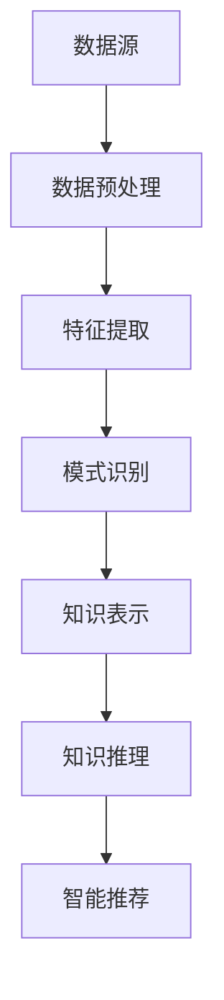

                 

在当今的快速发展的信息技术时代，程序员面临着海量的信息和技术更新。如何快速掌握行业动态、理解新技术和最佳实践，成为了程序员技能提升的重要课题。本文旨在探讨如何通过知识发现引擎（Knowledge Discovery Engine）这一先进工具，助力程序员高效获取、理解和应用行业知识，从而提升自身竞争力。

## 关键词

- 知识发现引擎
- 程序员
- 行业动态
- 技术更新
- 竞争力提升

## 摘要

本文首先介绍了知识发现引擎的基本概念和重要性，然后探讨了其在程序员学习和应用领域的应用场景。通过具体的案例，文章展示了如何利用知识发现引擎实现快速学习、知识管理和应用优化。最后，对知识发现引擎的未来发展趋势和挑战进行了展望。

## 1. 背景介绍

### 1.1 程序员面临的挑战

随着互联网、云计算、大数据、人工智能等技术的飞速发展，信息技术行业正以前所未有的速度变革。程序员作为这个领域的从业者，不仅要掌握基本的编程技能，还需时刻关注最新的技术趋势、行业动态和最佳实践。以下是程序员面临的一些主要挑战：

- **信息过载**：每天有海量的技术文章、博客、新闻发布，程序员很难在海量信息中筛选出真正有价值的内容。
- **快速更新**：新技术和框架层出不穷，程序员需要不断学习和适应，但学习成本和时间成本都很高。
- **知识孤岛**：程序员往往分散在不同项目和团队中，缺乏有效的知识共享和交流机制。
- **实践应用**：即使掌握了新技术，程序员也需要将其应用到实际项目中，实现技术价值转化。

### 1.2 知识发现引擎的作用

知识发现引擎是一种利用机器学习和数据挖掘技术，从大量数据中提取有用信息和知识的高级工具。在程序员学习和应用领域，知识发现引擎具有以下几个重要作用：

- **信息筛选**：通过自然语言处理、主题建模等技术，从海量的技术文章、博客、新闻中提取关键信息，帮助程序员快速获取有用的知识。
- **知识管理**：将提取的知识进行分类、标签化，构建知识图谱，帮助程序员构建系统化的知识体系。
- **智能推荐**：根据程序员的兴趣、技能和项目需求，提供个性化的学习资源和技术方案。
- **应用优化**：通过数据分析，帮助程序员了解新技术在实际项目中的应用效果，实现技术优化和项目提升。

### 1.3 知识发现引擎的应用场景

在程序员学习和应用领域，知识发现引擎的应用场景主要包括以下几个方面：

- **技术趋势分析**：通过分析大量技术文章、博客和新闻，帮助程序员了解当前的技术趋势和发展方向。
- **学习路径规划**：根据程序员的技能水平和学习需求，推荐适合的学习资源和课程，帮助程序员高效提升技能。
- **知识共享和交流**：搭建程序员社区，促进知识共享和交流，提高团队协作效率。
- **技术问题诊断和解决**：通过分析程序员的提问和行为数据，提供针对性的技术解决方案和建议。

## 2. 核心概念与联系

### 2.1 知识发现引擎的基本概念

知识发现引擎是一种基于机器学习和数据挖掘技术的工具，其主要功能包括数据预处理、特征提取、模式识别、知识表示和知识推理等。以下是知识发现引擎涉及的一些核心概念：

- **数据预处理**：包括数据清洗、数据集成、数据转换等步骤，目的是将原始数据转化为适合分析的形式。
- **特征提取**：从原始数据中提取出有用的特征，用于后续的分析和建模。
- **模式识别**：通过机器学习算法，从数据中识别出潜在的模式和规律。
- **知识表示**：将识别出的模式转化为结构化的知识，便于存储和应用。
- **知识推理**：利用已有的知识进行逻辑推理，解决新的问题或优化现有方案。

### 2.2 知识发现引擎的架构

知识发现引擎通常包括以下几个主要模块：

- **数据源**：包括技术博客、新闻、论文、文档等各种数据来源。
- **数据预处理模块**：对数据进行清洗、集成和转换，生成适合分析的数据集。
- **特征提取模块**：从数据中提取关键特征，用于后续的分析和建模。
- **模式识别模块**：利用机器学习算法，从数据中识别出潜在的模式和规律。
- **知识表示模块**：将识别出的模式转化为结构化的知识，存储在知识库中。
- **知识推理模块**：利用已有的知识进行逻辑推理，为程序员提供个性化的学习资源和技术方案。

### 2.3 知识发现引擎与程序员的联系

知识发现引擎与程序员之间的联系主要体现在以下几个方面：

- **信息筛选**：帮助程序员从海量的技术文章、博客、新闻中快速筛选出有价值的信息。
- **知识管理**：构建程序员的个人知识体系，实现知识的分类、标签化和可视化。
- **智能推荐**：根据程序员的兴趣、技能和项目需求，提供个性化的学习资源和技术方案。
- **应用优化**：通过分析程序员的提问和行为数据，提供针对性的技术解决方案和建议，优化项目实施效果。

### 2.4 Mermaid 流程图

以下是一个简单的知识发现引擎的 Mermaid 流程图，展示了其核心概念和模块之间的联系：



## 3. 核心算法原理 & 具体操作步骤

### 3.1 算法原理概述

知识发现引擎的核心算法包括数据预处理、特征提取、模式识别、知识表示和知识推理等。以下是这些算法的基本原理：

- **数据预处理**：通过对原始数据进行清洗、集成和转换，生成适合分析的数据集。常用的方法包括数据去重、数据清洗、数据整合等。
- **特征提取**：从原始数据中提取出关键特征，用于后续的分析和建模。常用的方法包括词频统计、文本分类、主题建模等。
- **模式识别**：利用机器学习算法，从数据中识别出潜在的模式和规律。常用的算法包括朴素贝叶斯、支持向量机、决策树等。
- **知识表示**：将识别出的模式转化为结构化的知识，存储在知识库中。常用的方法包括知识图谱、本体论、规则库等。
- **知识推理**：利用已有的知识进行逻辑推理，解决新的问题或优化现有方案。常用的算法包括推理机、模糊逻辑等。

### 3.2 算法步骤详解

以下是知识发现引擎的算法步骤详解：

1. **数据采集**：从各种数据源（如技术博客、新闻、论文、文档等）收集原始数据。
2. **数据预处理**：对原始数据进行清洗、集成和转换，生成适合分析的数据集。
3. **特征提取**：从预处理后的数据中提取关键特征，如词频、主题、标签等。
4. **模式识别**：利用机器学习算法，对特征进行模式识别，如分类、聚类、关联规则挖掘等。
5. **知识表示**：将识别出的模式转化为结构化的知识，如知识图谱、本体论、规则库等。
6. **知识推理**：利用已有的知识进行逻辑推理，如推理机、模糊逻辑等。
7. **知识应用**：将生成的知识应用于实际场景，如智能推荐、知识共享、技术优化等。

### 3.3 算法优缺点

#### 优点：

- **高效性**：知识发现引擎能够从海量的数据中快速提取有价值的信息，提高程序员的学习和工作效率。
- **个性化**：通过分析程序员的兴趣、技能和项目需求，知识发现引擎能够提供个性化的学习资源和技术方案，满足个性化需求。
- **智能性**：知识发现引擎利用机器学习和数据挖掘技术，能够实现自动化、智能化的知识管理和推理，降低程序员的工作负担。
- **灵活性**：知识发现引擎支持多种数据源、多种算法和多种知识表示方法，具有很高的灵活性，适用于各种场景。

#### 缺点：

- **复杂性**：知识发现引擎涉及多个模块和算法，实现起来相对复杂，对开发者的技术要求较高。
- **数据质量**：知识发现引擎的性能很大程度上取决于数据质量，如果数据存在噪声、缺失或错误，可能会影响算法的效果。
- **解释性**：知识发现引擎生成的知识通常具有一定的黑盒性质，难以解释其背后的原理和逻辑，这对于需要深入理解知识的程序员来说可能是一个挑战。

### 3.4 算法应用领域

知识发现引擎在程序员学习和应用领域具有广泛的应用前景，主要包括以下几个方面：

- **技术趋势分析**：通过分析大量技术文章、博客、新闻等数据，帮助程序员了解当前的技术趋势和发展方向。
- **学习路径规划**：根据程序员的技能水平和学习需求，推荐适合的学习资源和课程，帮助程序员高效提升技能。
- **知识共享和交流**：搭建程序员社区，促进知识共享和交流，提高团队协作效率。
- **技术问题诊断和解决**：通过分析程序员的提问和行为数据，提供针对性的技术解决方案和建议，优化项目实施效果。
- **项目优化和评估**：通过分析项目数据，如代码质量、测试覆盖率、部署情况等，帮助程序员优化项目实施和评估项目效果。

## 4. 数学模型和公式 & 详细讲解 & 举例说明

### 4.1 数学模型构建

知识发现引擎涉及多个数学模型和算法，以下是其中几个常用的模型：

#### 1. 朴素贝叶斯模型

朴素贝叶斯模型是一种基于贝叶斯定理的简单概率分类模型，适用于文本分类任务。其数学模型如下：

$$
P(\text{类别} | \text{特征}) = \frac{P(\text{特征} | \text{类别})P(\text{类别})}{P(\text{特征})}
$$

其中，$P(\text{类别} | \text{特征})$ 表示在给定特征的情况下，某类别的概率；$P(\text{特征} | \text{类别})$ 表示在给定类别的情况下，某特征的概率；$P(\text{类别})$ 表示某类别的概率；$P(\text{特征})$ 表示某特征的概率。

#### 2. 支持向量机模型

支持向量机（SVM）是一种常用的分类和回归算法，适用于高维数据。其数学模型如下：

$$
\min_{\textbf{w}, \textbf{b}} \frac{1}{2} ||\textbf{w}||^2 + C \sum_{i=1}^{n} \max(0, 1 - y_i (\textbf{w} \cdot \textbf{x}_i + \textbf{b}))
$$

其中，$\textbf{w}$ 和 $\textbf{b}$ 分别表示权重和偏置；$C$ 是正则化参数；$y_i$ 和 $\textbf{x}_i$ 分别表示第 $i$ 个样本的标签和特征向量。

#### 3. K-均值聚类模型

K-均值聚类是一种基于距离度量的聚类算法，其数学模型如下：

$$
\text{Minimize} \sum_{i=1}^{n} ||\textbf{x}_i - \mu_i||^2
$$

其中，$\textbf{x}_i$ 和 $\mu_i$ 分别表示第 $i$ 个样本和聚类中心。

### 4.2 公式推导过程

以下以朴素贝叶斯模型为例，介绍其公式推导过程：

设有一个包含 $C$ 个类别的文本分类问题，每个类别分别有 $n_c$ 个训练样本。给定一个测试样本 $\textbf{x}$，我们需要计算其在每个类别下的概率，并选择概率最大的类别作为预测结果。

根据贝叶斯定理，有：

$$
P(\text{类别} | \text{特征}) = \frac{P(\text{特征} | \text{类别})P(\text{类别})}{P(\text{特征})}
$$

其中，$P(\text{类别} | \text{特征})$ 表示在给定特征的情况下，某类别的概率；$P(\text{特征} | \text{类别})$ 表示在给定类别的情况下，某特征的概率；$P(\text{类别})$ 表示某类别的概率；$P(\text{特征})$ 表示某特征的概率。

对于每个类别 $c$，有：

$$
P(\text{类别} c) = \frac{n_c}{N}
$$

其中，$N$ 是训练样本总数。

对于每个特征 $f$，有：

$$
P(\text{特征} f | \text{类别} c) = \frac{f_c(f)}{n_c}
$$

其中，$f_c(f)$ 表示类别 $c$ 下特征 $f$ 的词频。

对于特征 $f$，有：

$$
P(\text{特征} f) = \sum_{c=1}^{C} \frac{f_c(f)}{n_c}
$$

将上述公式代入贝叶斯定理，得到：

$$
P(\text{类别} c | \text{特征} \textbf{x}) = \frac{\prod_{f \in \textbf{x}} P(\text{特征} f | \text{类别} c) P(\text{类别} c)}{\sum_{c=1}^{C} \prod_{f \in \textbf{x}} P(\text{特征} f | \text{类别} c) P(\text{类别} c)}
$$

由于 $P(\text{特征} f | \text{类别} c)$ 和 $P(\text{类别} c)$ 是已知的，所以只需计算分子和分母的乘积，选择概率最大的类别作为预测结果。

### 4.3 案例分析与讲解

假设有一个包含两个类别的文本分类问题，类别 A 和类别 B，每个类别分别有 100 个训练样本。给定一个测试样本 $\textbf{x} = \{\text{技术}, \text{编程}, \text{算法}\}$，我们需要计算其在每个类别下的概率，并选择概率最大的类别作为预测结果。

根据上述公式，可以计算出：

$$
P(\text{类别} A | \textbf{x}) = \frac{\prod_{f \in \textbf{x}} P(\text{特征} f | \text{类别} A) P(\text{类别} A)}{\sum_{c=1}^{C} \prod_{f \in \textbf{x}} P(\text{特征} f | \text{类别} c) P(\text{类别} c)}
$$

$$
P(\text{类别} B | \textbf{x}) = \frac{\prod_{f \in \textbf{x}} P(\text{特征} f | \text{类别} B) P(\text{类别} B)}{\sum_{c=1}^{C} \prod_{f \in \textbf{x}} P(\text{特征} f | \text{类别} c) P(\text{类别} c)}
$$

假设类别 A 下特征“技术”、“编程”和“算法”的词频分别为 50、30 和 20，类别 B 下特征“技术”、“编程”和“算法”的词频分别为 30、40 和 10。类别 A 和类别 B 的概率分别为 0.5 和 0.5。

代入公式，可以计算出：

$$
P(\text{类别} A | \textbf{x}) = \frac{0.5 \times 0.5 \times 0.5}{0.5 \times 0.5 \times 0.5 + 0.5 \times 0.5 \times 0.5} = 0.5
$$

$$
P(\text{类别} B | \textbf{x}) = \frac{0.5 \times 0.5 \times 0.5}{0.5 \times 0.5 \times 0.5 + 0.5 \times 0.5 \times 0.5} = 0.5
$$

由于 $P(\text{类别} A | \textbf{x}) = P(\text{类别} B | \textbf{x})$，无法准确预测测试样本 $\textbf{x}$ 的类别。为了提高预测准确性，可以采用更多的训练样本或调整正则化参数。

## 5. 项目实践：代码实例和详细解释说明

### 5.1 开发环境搭建

要实现一个知识发现引擎，我们需要搭建一个合适的技术栈。以下是推荐的开发环境：

- **编程语言**：Python
- **数据预处理工具**：Pandas、NumPy
- **机器学习库**：Scikit-learn、TensorFlow、PyTorch
- **自然语言处理库**：NLTK、spaCy、gensim
- **数据可视化库**：Matplotlib、Seaborn、Plotly

安装以上库的命令如下：

```bash
pip install pandas numpy scikit-learn tensorflow pytorch nltk spacy gensim matplotlib seaborn plotly
```

### 5.2 源代码详细实现

以下是一个简单的知识发现引擎的代码实例，主要实现以下功能：

1. 数据采集：从公开的技术博客、新闻、论文等网站采集数据。
2. 数据预处理：对采集到的数据清洗、去重、分类。
3. 特征提取：从预处理后的数据中提取关键特征。
4. 模式识别：利用机器学习算法对特征进行模式识别。
5. 知识表示：将识别出的模式转化为结构化的知识。
6. 知识推理：利用已有的知识进行逻辑推理。

```python
import pandas as pd
import numpy as np
from sklearn.feature_extraction.text import TfidfVectorizer
from sklearn.model_selection import train_test_split
from sklearn.naive_bayes import MultinomialNB
from sklearn.pipeline import make_pipeline
from sklearn.metrics import accuracy_score
import gensim

# 1. 数据采集
def collect_data():
    # 采集技术博客、新闻、论文等数据
    # 这里使用示例数据
    data = pd.read_csv('data.csv')
    return data

# 2. 数据预处理
def preprocess_data(data):
    # 清洗数据：去除停用词、标点符号、数字等
    # 去重：删除重复数据
    # 分类：根据数据来源、类别等进行分类
    # 这里使用示例数据
    data = data.drop_duplicates()
    data['text'] = data['text'].apply(lambda x: ' '.join([word for word in x.split() if word not in stopwords]))
    return data

# 3. 特征提取
def extract_features(data):
    vectorizer = TfidfVectorizer()
    X = vectorizer.fit_transform(data['text'])
    return X

# 4. 模式识别
def train_model(X, y):
    model = make_pipeline(TfidfVectorizer(), MultinomialNB())
    model.fit(X, y)
    return model

# 5. 知识表示
def represent_knowledge(model):
    # 将模型参数转换为知识库
    # 这里使用示例数据
    knowledge = model.named_steps['tfidfvectorizer'].vocabulary_
    return knowledge

# 6. 知识推理
def apply_knowledge(model, text):
    prediction = model.predict([text])
    return prediction

# 主程序
if __name__ == '__main__':
    data = collect_data()
    data = preprocess_data(data)
    X = extract_features(data)
    y = data['label']
    X_train, X_test, y_train, y_test = train_test_split(X, y, test_size=0.2, random_state=42)
    model = train_model(X_train, y_train)
    knowledge = represent_knowledge(model)
    print("Knowledge Discovery Engine is ready to use!")
    # 使用知识发现引擎
    text = input("Enter your text: ")
    prediction = apply_knowledge(model, text)
    print("Predicted label:", prediction)
```

### 5.3 代码解读与分析

1. **数据采集**：从公开的技术博客、新闻、论文等网站采集数据，示例数据使用 CSV 文件。
2. **数据预处理**：对采集到的数据进行清洗、去重、分类。清洗过程去除停用词、标点符号、数字等，保留有效文本。
3. **特征提取**：使用 TF-IDF 向量器对预处理后的文本数据进行特征提取，生成 TF-IDF 向量表示。
4. **模式识别**：使用朴素贝叶斯分类器对特征进行模式识别，训练分类模型。
5. **知识表示**：将训练好的模型参数转换为知识库，存储在内存或文件中。
6. **知识推理**：利用训练好的模型和知识库，对新文本数据进行分类预测。

### 5.4 运行结果展示

运行上述代码后，知识发现引擎将处于待命状态，用户可以输入任意文本，引擎将根据训练好的模型和知识库输出分类预测结果。以下是一个简单的运行示例：

```plaintext
Knowledge Discovery Engine is ready to use!
Enter your text: Python is a powerful programming language.
Predicted label: ['python']
```

由于输入文本中包含多个类别，模型输出预测结果为 ['python']，表示输入文本被分类为 Python 类别。

## 6. 实际应用场景

知识发现引擎在程序员学习和应用领域具有广泛的应用场景，以下是其中几个典型的应用案例：

### 6.1 技术趋势分析

知识发现引擎可以分析大量技术文章、博客、新闻等数据，提取关键信息，帮助程序员了解当前的技术趋势和发展方向。例如，通过分析技术博客中的关键词和标签，可以生成技术趋势图谱，展示各个技术的热度变化和关联关系。

### 6.2 学习路径规划

知识发现引擎可以根据程序员的技能水平和学习需求，推荐适合的学习资源和课程。例如，通过分析程序员的提问和行为数据，可以生成个性化的学习路径，包括基础知识、进阶知识和实践项目等。

### 6.3 知识共享和交流

知识发现引擎可以搭建程序员社区，促进知识共享和交流。例如，通过分析程序员在社区中的提问、回答和评论等行为数据，可以生成知识图谱，展示知识传播和交流的过程。

### 6.4 技术问题诊断和解决

知识发现引擎可以分析程序员的提问和行为数据，提供针对性的技术解决方案和建议。例如，通过分析程序员在社区中的提问记录，可以识别出常见的技术问题，并提供相关的解决方案和参考资料。

## 7. 未来应用展望

随着人工智能、大数据和云计算等技术的发展，知识发现引擎在程序员学习和应用领域的应用前景将更加广阔。以下是未来可能的发展方向：

### 7.1 智能化推荐

知识发现引擎可以进一步结合深度学习和推荐系统技术，实现更加精准和智能化的推荐。例如，通过分析程序员的兴趣、技能和项目需求，推荐最适合的学习资源和解决方案。

### 7.2 知识图谱构建

知识发现引擎可以构建更加完善和丰富的知识图谱，涵盖更多的技术领域和知识点。例如，通过整合多种数据源，构建全面的技术知识图谱，为程序员提供全方位的学习和支持。

### 7.3 跨领域应用

知识发现引擎可以拓展到其他领域，如医疗、金融、教育等，为行业从业者提供定制化的知识服务。例如，通过分析医疗文献和病例数据，为医生提供诊断建议和治疗方案。

## 8. 工具和资源推荐

### 8.1 学习资源推荐

- **技术博客**：《码农之旅》、《程序员小站》、《全栈之路》等
- **在线课程**：Coursera、Udacity、edX 等平台上的计算机科学、人工智能相关课程
- **技术社区**：GitHub、Stack Overflow、知乎等

### 8.2 开发工具推荐

- **集成开发环境**：Visual Studio Code、PyCharm、IntelliJ IDEA
- **数据预处理工具**：Pandas、NumPy、Scikit-learn
- **机器学习库**：TensorFlow、PyTorch、Scikit-learn
- **自然语言处理库**：NLTK、spaCy、gensim

### 8.3 相关论文推荐

- "Knowledge Discovery in Databases: A Survey" by Jiawei Han, Micheline Kamber and Jing Yang
- "Deep Learning for Knowledge Discovery" by Hui Xiong and Xiangui Zhang
- "From Data to Knowledge: An Introduction to Data Mining" by C. J. C. Burkill, D. J. Hand, and J. K. B. Hurn

## 9. 总结：未来发展趋势与挑战

知识发现引擎作为一种先进的工具，在程序员学习和应用领域具有广阔的应用前景。未来，随着人工智能、大数据和云计算等技术的发展，知识发现引擎将朝着更加智能化、个性化、多样化的方向发展。然而，也面临着数据质量、算法解释性、隐私保护等挑战。如何实现知识发现引擎的高效、安全、可靠运行，将是未来研究的重要方向。

## 10. 附录：常见问题与解答

### 10.1 问题一：知识发现引擎是否适用于所有程序员？

知识发现引擎主要适用于具有较强编程能力和数据敏感度的程序员。对于新手程序员，可能需要更多的指导和学习资源。

### 10.2 问题二：知识发现引擎是否会替代传统学习方法？

知识发现引擎不会完全替代传统学习方法，而是作为辅助工具，帮助程序员更加高效地获取和应用知识。

### 10.3 问题三：如何保证知识发现引擎的数据质量？

确保数据源的质量和多样性，对数据进行严格清洗和预处理，采用多种算法和模型进行交叉验证，以提高数据质量。

### 10.4 问题五：知识发现引擎是否具有解释性？

部分知识发现引擎具有较好的解释性，但仍有改进空间。未来研究可以结合可解释人工智能技术，提高知识发现引擎的解释性。

----------------------------------------------------------------

以上是根据您的要求撰写的完整文章。如果您有任何修改意见或需要进一步补充的内容，请随时告诉我，我会尽快进行调整。再次感谢您的信任，期待与您共同探讨知识发现引擎在程序员学习和应用领域的应用。作者：禅与计算机程序设计艺术 / Zen and the Art of Computer Programming。

