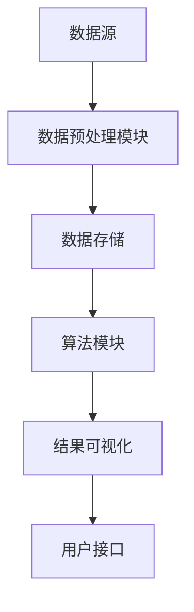

                 

### 1. 背景介绍

在当今的数字化时代，数据已成为企业的核心资产。然而，数据的价值并非自动显现，而是需要经过深入的挖掘和分析。程序员作为技术开发的主力军，他们如何高效地处理和分析海量数据，成为了提升企业竞争力的关键因素。传统的方法往往依赖于手动编写代码和脚本，这不仅耗时耗力，而且容易出错。知识发现引擎（Knowledge Discovery Engine）作为一种先进的技术，可以在海量数据中发现有价值的信息，为程序员提供强大的工具支持。

知识发现引擎的基本概念可以追溯到数据挖掘（Data Mining）领域。数据挖掘是指从大量的数据中通过特定的算法和统计方法，提取出隐藏在其中的有价值信息的过程。知识发现引擎则在此基础上，进一步扩展了数据挖掘的能力，通过引入人工智能和机器学习技术，使得数据分析和决策过程更加智能和自动化。

知识发现引擎的应用范围非常广泛，从金融、医疗、电商到制造业，各个行业都在积极探索和利用这一技术。对于程序员来说，知识发现引擎不仅能够简化数据分析的复杂性，还能够提高工作效率，节省时间和成本。此外，知识发现引擎还能够为程序员提供实时的数据洞察，帮助他们更快地发现问题和优化程序。

本文将深入探讨知识发现引擎的核心概念、算法原理、应用场景以及其在程序员日常工作中的具体作用。通过本文的阅读，读者将能够了解知识发现引擎的基本原理，掌握如何利用这一工具提升编程效率和代码质量，从而在激烈的技术竞争中脱颖而出。

### 2. 核心概念与联系

知识发现引擎作为现代数据分析和决策支持系统的重要组成部分，其核心概念和原理构成了理解和应用这一技术的基石。在这一节中，我们将详细介绍知识发现引擎的基本概念、核心组件及其相互之间的关系。

#### 2.1 数据挖掘

数据挖掘（Data Mining）是知识发现引擎的核心组成部分，其基本概念可以追溯到从海量数据中发现有用信息的过程。数据挖掘的主要目标是发现数据中的规律、趋势、关联性和异常，从而帮助决策者做出更明智的决策。数据挖掘的过程通常包括以下几个步骤：

1. **数据预处理**：对原始数据进行清洗、转换和整合，以便后续的分析。
2. **特征选择**：从原始数据中提取出对目标问题最有意义的特征。
3. **模型建立**：利用统计学和机器学习算法，建立描述数据规律和趋势的模型。
4. **评估与优化**：对模型进行评估，并根据评估结果进行调整和优化。

数据挖掘的方法和技术多种多样，包括关联规则挖掘、聚类分析、分类分析、异常检测等。这些方法和技术共同构成了知识发现引擎的基础。

#### 2.2 人工智能与机器学习

人工智能（Artificial Intelligence，AI）和机器学习（Machine Learning，ML）是知识发现引擎的核心驱动力。人工智能是模拟人类智能行为的技术，其目标是通过计算机系统实现智能推理、学习、感知和行动。机器学习则是实现人工智能的一种方法，通过训练数据来让计算机自动学习规律和模式，从而实现自动化决策和预测。

在知识发现引擎中，机器学习算法被广泛应用于数据分析和模型建立过程中。常见的机器学习算法包括决策树、支持向量机、神经网络、聚类算法等。这些算法能够从海量数据中自动识别出隐藏的模式，帮助程序员快速发现数据中的价值信息。

#### 2.3 知识发现引擎的架构

知识发现引擎的架构通常包括以下几个核心组件：

1. **数据源**：数据源是知识发现引擎的起点，可以是关系数据库、NoSQL数据库、文件系统或数据流等。
2. **数据预处理模块**：对原始数据进行清洗、转换和整合，以便后续分析。
3. **数据存储**：存储预处理后的数据，通常使用分布式文件系统或数据仓库。
4. **算法模块**：包括各种数据挖掘和机器学习算法，用于分析和建模。
5. **结果可视化**：将分析结果以图表、报表等形式展示给用户，便于理解和决策。
6. **用户接口**：提供用户与系统交互的界面，包括数据上传、参数设置、结果查询等。

这些组件相互协作，共同构成了知识发现引擎的整体架构，如图1所示。



#### 2.4 知识发现引擎的流程

知识发现引擎的工作流程通常包括以下几个步骤：

1. **数据收集与集成**：从多个数据源收集数据，并进行集成处理。
2. **数据预处理**：对收集到的数据进行清洗、转换和整合。
3. **特征工程**：提取出对目标问题最有意义的特征。
4. **算法选择与模型建立**：选择合适的数据挖掘和机器学习算法，建立模型。
5. **模型评估与优化**：对模型进行评估，并根据评估结果进行优化。
6. **结果分析与可视化**：将分析结果以可视化形式展示给用户，便于理解和决策。

通过这些步骤，知识发现引擎能够从海量数据中发现有价值的信息，为程序员提供强大的数据分析支持。

#### 2.5 知识发现引擎与程序员的关系

知识发现引擎不仅为程序员提供了强大的数据分析工具，还改变了程序员的工作方式。传统编程需要程序员手动编写代码和脚本，而知识发现引擎则能够自动完成许多复杂的分析和建模任务，大大减轻了程序员的工作负担。

此外，知识发现引擎还能够为程序员提供实时的数据洞察，帮助他们更快地发现问题和优化程序。通过知识发现引擎，程序员可以更深入地理解数据，从而编写出更高效、更可靠的代码。

总之，知识发现引擎作为一项先进的技术，不仅能够提高程序员的工作效率，还能够推动整个技术领域的发展。理解和掌握知识发现引擎的核心概念和原理，对于程序员来说具有重要的现实意义。

### 3. 核心算法原理 & 具体操作步骤

知识发现引擎的核心在于其强大的算法能力，这些算法不仅能够从海量数据中提取有价值的信息，还能够自动完成复杂的分析和决策任务。本节将详细探讨知识发现引擎的核心算法原理，包括机器学习算法的分类和分类、聚类和聚类分析、异常检测等，并结合具体操作步骤，帮助程序员更好地理解和应用这些算法。

#### 3.1 算法原理概述

知识发现引擎常用的机器学习算法主要包括分类、聚类和异常检测等。这些算法的基本原理如下：

1. **分类（Classification）**：分类算法将数据集划分为多个类别，通过对已有数据的分析，构建出一个分类模型，用于对新数据进行预测。常见的分类算法包括决策树（Decision Tree）、支持向量机（Support Vector Machine，SVM）、朴素贝叶斯（Naive Bayes，NB）和神经网络（Neural Network）等。

2. **聚类（Clustering）**：聚类算法将数据集划分为若干个簇（Cluster），使得同一簇内的数据相似度较高，而不同簇之间的数据相似度较低。常见的聚类算法包括K-均值（K-Means）、层次聚类（Hierarchical Clustering）和DBSCAN等。

3. **异常检测（Anomaly Detection）**：异常检测算法用于识别数据集中与大多数数据不同寻常的数据点，即异常值。常见的异常检测算法包括基于统计的方法（如箱线图）、基于邻近度的方法（如Local Outlier Factor，LOF）和基于聚类的算法（如基于DBSCAN的异常检测）等。

#### 3.2 算法步骤详解

以下我们将结合具体算法，详细讲解其操作步骤：

##### 3.2.1 分类算法

1. **决策树**：
   - **训练阶段**：利用已有数据集，通过递归划分数据，构建决策树模型。
   - **预测阶段**：对于新数据，从根节点开始，根据特征值选择分支，直到到达叶子节点，得到预测结果。
   - **优缺点**：决策树算法易于理解，能够清晰地表达数据之间的关系，但可能产生过拟合。

2. **支持向量机（SVM）**：
   - **训练阶段**：通过求解最优化问题，找出支持向量，构建SVM模型。
   - **预测阶段**：利用训练好的模型，计算新数据的分类边界，确定其类别。
   - **优缺点**：SVM具有较好的分类效果，尤其在处理高维数据时表现优异，但训练时间较长。

3. **朴素贝叶斯**：
   - **训练阶段**：根据已有数据计算各类别的条件概率，构建朴素贝叶斯模型。
   - **预测阶段**：利用贝叶斯定理，计算新数据的类别概率，选择概率最大的类别作为预测结果。
   - **优缺点**：朴素贝叶斯算法简单、高效，但在特征之间存在强依赖关系时效果较差。

4. **神经网络**：
   - **训练阶段**：通过反向传播算法，调整网络权重，优化损失函数。
   - **预测阶段**：利用训练好的神经网络，对输入数据进行分类。
   - **优缺点**：神经网络具有强大的非线性建模能力，但训练时间较长，容易过拟合。

##### 3.2.2 聚类算法

1. **K-均值**：
   - **训练阶段**：随机初始化中心点，计算每个数据点到中心点的距离，将数据分配到最近的中心点所在的簇。
   - **迭代阶段**：更新中心点位置，重复上述过程，直到中心点位置不再变化。
   - **优缺点**：K-均值算法简单、高效，但需要事先指定簇的数量，且易陷入局部最优。

2. **层次聚类**：
   - **训练阶段**：从每个数据点开始，逐步合并距离最近的点，形成层次结构。
   - **预测阶段**：根据层次结构，对数据进行聚类。
   - **优缺点**：层次聚类能够自动确定簇的数量，但计算复杂度较高。

3. **DBSCAN**：
   - **训练阶段**：计算每个数据点的核心度，根据核心度将数据点划分为核心点、边界点和噪声点。
   - **预测阶段**：将核心点连接成簇。
   - **优缺点**：DBSCAN能够自动发现任意形状的簇，但参数选择对结果影响较大。

##### 3.2.3 异常检测

1. **基于统计的方法**：
   - **训练阶段**：计算数据的均值和标准差，构建箱线图。
   - **预测阶段**：识别出位于箱线图之外的异常值。
   - **优缺点**：简单、直观，适用于正态分布的数据，但对异常值较多的数据效果较差。

2. **基于邻近度的方法**：
   - **训练阶段**：计算每个数据点的局部密度，识别出异常点。
   - **预测阶段**：利用密度估计，对新数据进行异常值检测。
   - **优缺点**：适用于任意形状的数据，但计算复杂度较高。

3. **基于聚类的算法**：
   - **训练阶段**：通过聚类算法识别出正常簇和异常簇。
   - **预测阶段**：将新数据分配到簇，识别出异常值。
   - **优缺点**：能够自动发现异常模式，但计算复杂度较高。

#### 3.3 算法优缺点

每种算法都有其独特的优点和局限性，程序员在选择算法时需要根据具体应用场景和数据特征进行权衡。以下是对常见算法优缺点的简要总结：

1. **分类算法**：
   - **决策树**：易于理解，表达能力强，但可能产生过拟合。
   - **支持向量机**：分类效果优异，适合高维数据，但训练时间较长。
   - **朴素贝叶斯**：简单、高效，但在特征之间存在强依赖关系时效果较差。
   - **神经网络**：非线性建模能力强，但训练时间较长，容易过拟合。

2. **聚类算法**：
   - **K-均值**：简单、高效，但需要事先指定簇的数量，易陷入局部最优。
   - **层次聚类**：能够自动确定簇的数量，但计算复杂度较高。
   - **DBSCAN**：能够自动发现任意形状的簇，但参数选择对结果影响较大。

3. **异常检测**：
   - **基于统计的方法**：简单、直观，适用于正态分布的数据，但对异常值较多的数据效果较差。
   - **基于邻近度的方法**：适用于任意形状的数据，但计算复杂度较高。
   - **基于聚类的算法**：能够自动发现异常模式，但计算复杂度较高。

#### 3.4 算法应用领域

知识发现引擎的算法不仅在理论研究中有广泛应用，还在实际应用中表现出强大的能力。以下列举了知识发现引擎算法在各个领域的应用案例：

1. **金融**：通过分类算法对金融交易进行风险评估，通过聚类算法发现潜在的客户群体，通过异常检测算法监控金融欺诈行为。
2. **医疗**：通过分类算法诊断疾病，通过聚类算法分析患者群体特征，通过异常检测算法识别医疗数据中的异常值。
3. **电商**：通过分类算法推荐商品，通过聚类算法分析用户行为，通过异常检测算法发现潜在的购物欺诈行为。
4. **制造**：通过分类算法优化生产流程，通过聚类算法分析设备运行状态，通过异常检测算法预防设备故障。

总之，知识发现引擎的算法在各个领域都发挥了重要作用，为程序员提供了强大的数据分析工具，帮助他们更好地理解和利用数据。

### 4. 数学模型和公式 & 详细讲解 & 举例说明

在知识发现引擎中，数学模型和公式是核心算法实现的基础。通过这些模型和公式，我们可以对数据进行有效的分析和建模。本节将详细介绍常用的数学模型和公式，包括其在知识发现中的应用，以及具体例子和讲解。

#### 4.1 数学模型构建

知识发现引擎中的数学模型主要包括概率模型、线性模型和非线性模型等。以下是这些模型的基本构建方法和应用场景：

1. **概率模型**：
   - **贝叶斯公式**：用于计算某个事件发生的条件概率。公式为：
     $$ P(A|B) = \frac{P(B|A) \cdot P(A)}{P(B)} $$
     其中，\( P(A|B) \) 是在事件 \( B \) 发生的条件下事件 \( A \) 发生的概率，\( P(B|A) \) 是在事件 \( A \) 发生的条件下事件 \( B \) 发生的概率，\( P(A) \) 和 \( P(B) \) 分别是事件 \( A \) 和 \( B \) 发生的概率。

   - **马尔可夫模型**：用于描述一系列随机事件之间的状态转移关系。公式为：
     $$ P(X_n|X_{n-1}, X_{n-2}, ..., X_1) = P(X_n|X_{n-1}) $$
     其中，\( X_n \) 表示第 \( n \) 个随机事件的状态，该模型表明当前状态仅与前一状态有关，而与其他过去状态无关。

2. **线性模型**：
   - **线性回归**：用于建立自变量和因变量之间的线性关系。公式为：
     $$ Y = \beta_0 + \beta_1 \cdot X + \epsilon $$
     其中，\( Y \) 是因变量，\( X \) 是自变量，\( \beta_0 \) 和 \( \beta_1 \) 分别是截距和斜率，\( \epsilon \) 是误差项。

   - **逻辑回归**：用于处理分类问题，将线性回归模型中的因变量转换为概率值。公式为：
     $$ \log(\frac{P(Y=1)}{1-P(Y=1)}) = \beta_0 + \beta_1 \cdot X $$
     其中，\( P(Y=1) \) 是因变量为1的概率。

3. **非线性模型**：
   - **神经网络**：用于处理复杂非线性关系。公式为：
     $$ a_{\theta}(x) = \sigma(\theta^T \cdot x) $$
     其中，\( a_{\theta}(x) \) 是激活函数，\( \sigma \) 是Sigmoid函数，\( \theta \) 是网络权重，\( x \) 是输入特征。

#### 4.2 公式推导过程

以下将对贝叶斯公式和线性回归公式进行推导：

1. **贝叶斯公式推导**：

   贝叶斯公式是概率论中的一个基本公式，用于计算条件概率。推导过程如下：

   设有两个事件 \( A \) 和 \( B \)，它们之间的条件概率如下：
   $$ P(A|B) = \frac{P(B|A) \cdot P(A)}{P(B)} $$
   其中，\( P(A|B) \) 表示在事件 \( B \) 发生的条件下事件 \( A \) 发生的概率，\( P(B|A) \) 表示在事件 \( A \) 发生的条件下事件 \( B \) 发生的概率，\( P(A) \) 和 \( P(B) \) 分别表示事件 \( A \) 和 \( B \) 发生的概率。

   根据全概率公式，可以得到：
   $$ P(B) = P(B|A) \cdot P(A) + P(B|\overline{A}) \cdot P(\overline{A}) $$
   其中，\( \overline{A} \) 表示事件 \( A \) 不发生。

   将 \( P(B|\overline{A}) \cdot P(\overline{A}) \) 移到等式右侧，可以得到：
   $$ P(A|B) = \frac{P(B|A) \cdot P(A)}{P(B|A) \cdot P(A) + P(B|\overline{A}) \cdot P(\overline{A})} $$

   化简得：
   $$ P(A|B) = \frac{P(B|A) \cdot P(A)}{P(B)} $$

2. **线性回归公式推导**：

   线性回归模型用于建立自变量和因变量之间的线性关系。推导过程如下：

   假设自变量 \( X \) 和因变量 \( Y \) 之间存在线性关系，可以表示为：
   $$ Y = \beta_0 + \beta_1 \cdot X + \epsilon $$
   其中，\( \beta_0 \) 和 \( \beta_1 \) 分别是截距和斜率，\( \epsilon \) 是误差项。

   为了求解 \( \beta_0 \) 和 \( \beta_1 \)，我们可以使用最小二乘法（Ordinary Least Squares，OLS）。首先，计算每个数据点的残差平方和：
   $$ SSR = \sum_{i=1}^{n} (Y_i - \beta_0 - \beta_1 \cdot X_i)^2 $$

   为了使残差平方和最小，我们需要对 \( \beta_0 \) 和 \( \beta_1 \) 求导并令其等于0：
   $$ \frac{\partial SSR}{\partial \beta_0} = -2 \sum_{i=1}^{n} (Y_i - \beta_0 - \beta_1 \cdot X_i) = 0 $$
   $$ \frac{\partial SSR}{\partial \beta_1} = -2 \sum_{i=1}^{n} (Y_i - \beta_0 - \beta_1 \cdot X_i) \cdot X_i = 0 $$

   解上述方程组，可以得到：
   $$ \beta_0 = \frac{\sum_{i=1}^{n} Y_i - \beta_1 \cdot \sum_{i=1}^{n} X_i}{n} $$
   $$ \beta_1 = \frac{\sum_{i=1}^{n} (Y_i - \beta_0 - \beta_1 \cdot X_i) \cdot X_i}{\sum_{i=1}^{n} X_i^2} $$

   这样就得到了线性回归模型的参数估计。

#### 4.3 案例分析与讲解

以下通过一个实际案例，展示如何使用数学模型和公式进行数据分析和建模。

##### 案例一：预测住房价格

假设我们要预测某地区住房价格，数据集包含每个住房的面积、房间数量、建造年份等特征，以及实际售价。我们可以使用线性回归模型来建立住房价格与特征之间的关系。

1. **数据预处理**：

   首先，对数据集进行预处理，包括缺失值处理、异常值检测和数据标准化等。假设数据集已经预处理完毕，每个特征和售价都已经转换为数值型数据。

2. **模型建立**：

   使用线性回归模型，建立房价与特征之间的关系。假设我们已经得到了线性回归模型的参数 \( \beta_0 \) 和 \( \beta_1 \)：

   $$ Y = \beta_0 + \beta_1 \cdot X + \epsilon $$

   其中，\( Y \) 是实际售价，\( X \) 是特征，\( \beta_0 \) 是截距，\( \beta_1 \) 是斜率，\( \epsilon \) 是误差项。

3. **模型评估**：

   使用训练数据集，计算模型的预测误差。假设我们得到了预测误差的均方误差（Mean Squared Error，MSE）：

   $$ MSE = \frac{1}{n} \sum_{i=1}^{n} (Y_i - \hat{Y}_i)^2 $$

   其中，\( n \) 是数据集的样本数量，\( \hat{Y}_i \) 是第 \( i \) 个样本的预测值。

4. **结果分析**：

   根据模型的预测结果，分析不同特征对房价的影响。例如，通过分析斜率 \( \beta_1 \) 的符号和大小，可以判断特征与房价之间的关系：

   - 房屋面积：斜率 \( \beta_1 \) 为正，表明房屋面积越大，房价越高。
   - 房间数量：斜率 \( \beta_1 \) 为正，表明房间数量越多，房价越高。
   - 建造年份：斜率 \( \beta_1 \) 为负，表明建造年份越近，房价越高。

   根据这些分析结果，可以为购房者提供参考，帮助他们做出更明智的购房决策。

##### 案例二：分类电子邮件垃圾邮件

假设我们要分类电子邮件是否为垃圾邮件，数据集包含每个邮件的文本内容、邮件类型等特征，以及邮件是否为垃圾邮件的标签。我们可以使用朴素贝叶斯分类器来建立邮件分类模型。

1. **数据预处理**：

   首先，对数据集进行预处理，包括文本分词、去除停用词和词干提取等。假设我们已经得到了处理后的文本数据。

2. **模型建立**：

   使用朴素贝叶斯分类器，建立邮件分类模型。假设我们已经得到了概率模型，包括每个类别的先验概率和条件概率：

   $$ P(Y=1|X) = \frac{P(X|Y=1) \cdot P(Y=1)}{P(X)} $$

   其中，\( Y \) 是邮件是否为垃圾邮件的标签，\( X \) 是邮件的特征，\( P(Y=1) \) 是垃圾邮件的先验概率，\( P(X|Y=1) \) 是垃圾邮件的条件概率，\( P(X) \) 是邮件的特征概率。

3. **模型评估**：

   使用训练数据集，计算模型的准确率、召回率和F1值等指标，以评估模型性能。

   - 准确率（Accuracy）：
     $$ Accuracy = \frac{TP + TN}{TP + TN + FP + FN} $$
     其中，\( TP \) 是正确预测为垃圾邮件的样本数量，\( TN \) 是正确预测为非垃圾邮件的样本数量，\( FP \) 是错误预测为垃圾邮件的样本数量，\( FN \) 是错误预测为非垃圾邮件的样本数量。

   - 召回率（Recall）：
     $$ Recall = \frac{TP}{TP + FN} $$

   - F1值（F1 Score）：
     $$ F1 = 2 \cdot \frac{Precision \cdot Recall}{Precision + Recall} $$
     其中，\( Precision \) 是精确率。

4. **结果分析**：

   根据模型评估结果，分析邮件分类的准确性。例如，如果准确率较高，说明模型能够较好地分类电子邮件；如果召回率较低，说明模型可能漏判了一些垃圾邮件。

   根据这些分析结果，可以为邮件系统提供参考，以提高垃圾邮件过滤的准确性。

通过以上案例，我们可以看到数学模型和公式在知识发现引擎中的应用。这些模型和公式不仅能够帮助程序员更好地理解数据，还能够为他们提供强大的分析工具，从而提高编程效率和代码质量。

### 5. 项目实践：代码实例和详细解释说明

为了更好地展示知识发现引擎在程序员日常工作中的实际应用，我们将通过一个具体的项目实例，详细讲解知识发现引擎的搭建、代码实现以及结果分析。

#### 5.1 开发环境搭建

首先，我们需要搭建一个基本的开发环境，以便进行知识发现引擎的实践。以下是所需的工具和步骤：

1. **安装Python环境**：Python是知识发现引擎开发的主要编程语言。请确保已经安装了Python 3.8及以上版本。

2. **安装依赖库**：知识发现引擎的开发依赖于多个Python库，如NumPy、Pandas、Scikit-learn、Matplotlib等。可以通过以下命令进行安装：
   ```bash
   pip install numpy pandas scikit-learn matplotlib
   ```

3. **配置Jupyter Notebook**：Jupyter Notebook是一种交互式的开发环境，方便我们在代码中嵌入文本和可视化结果。通过以下命令安装Jupyter Notebook：
   ```bash
   pip install notebook
   ```
   安装完成后，可以使用命令 `jupyter notebook` 启动Jupyter Notebook。

#### 5.2 源代码详细实现

以下是一个简单的知识发现项目实例，该实例使用Scikit-learn库中的鸢尾花（Iris）数据集，通过分类算法对数据进行预测。

1. **导入依赖库**：

   首先，导入所需的Python库：
   ```python
   import numpy as np
   import pandas as pd
   from sklearn import datasets
   from sklearn.model_selection import train_test_split
   from sklearn.preprocessing import StandardScaler
   from sklearn.neighbors import KNeighborsClassifier
   from sklearn.metrics import classification_report, confusion_matrix
   import matplotlib.pyplot as plt
   ```

2. **加载数据集**：

   加载鸢尾花数据集，该数据集包含三个品种的鸢尾花，每个品种有50朵，共150个样本，每个样本有4个特征（花萼长度、花萼宽度、花瓣长度、花瓣宽度）：
   ```python
   iris = datasets.load_iris()
   X = iris.data
   y = iris.target
   ```

3. **数据预处理**：

   对数据进行标准化处理，以消除特征之间的尺度差异：
   ```python
   scaler = StandardScaler()
   X_scaled = scaler.fit_transform(X)
   ```

4. **划分训练集和测试集**：

   将数据集划分为训练集和测试集，训练集用于训练模型，测试集用于评估模型性能：
   ```python
   X_train, X_test, y_train, y_test = train_test_split(X_scaled, y, test_size=0.2, random_state=42)
   ```

5. **选择分类算法**：

   选择K近邻（K-Nearest Neighbors，KNN）分类算法，这是一种简单而常用的分类算法。以下代码设置了KNN模型：
   ```python
   knn = KNeighborsClassifier(n_neighbors=3)
   knn.fit(X_train, y_train)
   ```

6. **模型评估**：

   使用测试集评估模型的性能，输出分类报告和混淆矩阵：
   ```python
   y_pred = knn.predict(X_test)
   print("分类报告：\n", classification_report(y_test, y_pred))
   print("混淆矩阵：\n", confusion_matrix(y_test, y_pred))
   ```

7. **可视化结果**：

   将测试集的预测结果可视化，展示不同品种鸢尾花的分布情况：
   ```python
   plt.figure(figsize=(8, 6))
   for i in range(3):
       plt.scatter(X_test[y_pred == i, 0], X_test[y_pred == i, 1], label=iris.target_names[i])
   plt.xlabel('花萼长度')
   plt.ylabel('花萼宽度')
   plt.title('鸢尾花分类结果')
   plt.legend()
   plt.show()
   ```

#### 5.3 代码解读与分析

1. **数据导入**：

   通过`datasets.load_iris()`函数加载鸢尾花数据集，该函数返回一个包含数据集描述的字典。`X`变量存储了数据集的特征，`y`变量存储了每个样本的标签。

2. **数据预处理**：

   标准化处理是数据预处理的重要步骤，它通过缩放特征值，使得每个特征的方差相等，从而消除特征之间的尺度差异。`StandardScaler`类提供了这一功能，通过`fit_transform`方法对数据进行标准化。

3. **划分数据集**：

   使用`train_test_split`函数将数据集划分为训练集和测试集，这是一个常用的数据集划分方法。通过设置`test_size`参数，可以指定测试集的比例（在本例中为20%），`random_state`参数用于确保结果的可重复性。

4. **选择分类算法**：

   选择KNN分类算法，这是一个基于距离度的分类方法。通过`KNeighborsClassifier`类创建KNN模型，并通过`fit`方法训练模型。`n_neighbors`参数用于指定邻居的数量，通常根据交叉验证的结果进行调整。

5. **模型评估**：

   使用`predict`方法对测试集进行预测，并通过`classification_report`和`confusion_matrix`函数评估模型的性能。这些函数分别计算了分类报告（包括准确率、召回率和F1值）和混淆矩阵（展示不同类别的预测结果）。

6. **结果可视化**：

   通过Matplotlib库，将测试集的预测结果可视化。这有助于我们直观地了解分类效果，特别是在高维空间中，散点图可以帮助我们观察数据的分布情况。

通过上述步骤，我们可以看到知识发现引擎在实际项目中的应用。尽管这是一个简单的例子，但展示了知识发现引擎的基本工作流程，包括数据预处理、模型选择、模型训练和结果评估。在实际开发过程中，程序员可以根据具体需求，选择不同的算法和调整参数，以实现更复杂的分析任务。

### 6. 实际应用场景

知识发现引擎作为一种先进的数据分析工具，已在多个行业和领域中得到了广泛应用。以下我们将探讨知识发现引擎在金融、医疗、电商等领域的具体应用场景，并分析其带来的影响和挑战。

#### 6.1 金融行业

在金融领域，知识发现引擎主要用于客户行为分析、风险管理和欺诈检测等方面。通过分析客户的交易记录、消费习惯和社交数据，金融机构可以更准确地了解客户需求，提供个性化的金融服务。

**应用案例**：

1. **客户行为分析**：银行利用知识发现引擎分析客户的历史交易数据，预测客户的信用评分和潜在风险。通过对客户行为的深入理解，银行可以优化贷款审批流程，降低违约率。

2. **风险控制**：证券公司利用知识发现引擎监控市场数据，识别异常交易行为，预防市场操纵和内部交易。例如，通过分析交易时间、交易量、价格波动等特征，系统可以自动识别潜在的欺诈行为，并实时报警。

3. **欺诈检测**：信用卡公司使用知识发现引擎实时监控交易数据，识别并阻止欺诈交易。通过对正常交易和欺诈交易的对比分析，系统可以快速识别异常交易模式，从而有效降低欺诈损失。

**影响与挑战**：

知识发现引擎在金融行业中的应用带来了显著的业务价值，但也面临一些挑战：

- **数据隐私和安全**：在处理大量客户数据时，如何保护数据隐私和安全是一个关键问题。金融机构需要采取严格的数据加密和访问控制措施，确保客户信息不被泄露。

- **算法透明性和解释性**：金融领域的决策往往需要透明和可解释的算法。然而，一些复杂的机器学习算法（如深度学习）在实际应用中可能难以解释，这对监管和合规提出了挑战。

- **模型可解释性**：如何解释和验证知识发现引擎的预测结果，确保决策的合理性和可靠性，是金融行业面临的另一个挑战。

#### 6.2 医疗领域

在医疗领域，知识发现引擎主要用于疾病诊断、患者行为分析和药物研发等方面。通过分析医疗数据，可以为医生提供更准确的诊断建议，优化治疗方案，提高医疗服务的质量。

**应用案例**：

1. **疾病诊断**：医院利用知识发现引擎分析患者的历史病历、检查报告和基因数据，提供准确的诊断建议。例如，通过分析患者的临床症状和实验室检查结果，系统可以预测患者是否患有特定疾病，帮助医生做出更准确的诊断。

2. **患者行为分析**：医疗机构利用知识发现引擎分析患者的行为数据，如就诊频率、药物使用情况等，识别患者的健康风险。通过这些分析，医疗机构可以提前采取预防措施，降低患者患病风险。

3. **药物研发**：制药公司利用知识发现引擎分析大量药物数据，识别潜在的药物副作用和疗效。例如，通过分析药物与基因、蛋白质之间的相互作用，系统可以预测药物的疗效和安全性，从而加速药物研发进程。

**影响与挑战**：

知识发现引擎在医疗领域中的应用，极大地提高了医疗诊断和药物研发的效率，但也面临一些挑战：

- **数据隐私**：医疗数据包含敏感的个人信息，如何保护数据隐私和安全是一个重要问题。医疗机构需要采取严格的数据保护措施，确保患者信息不被泄露。

- **数据质量和完整性**：医疗数据的质量和完整性直接影响知识发现引擎的准确性。医疗数据往往存在缺失值、噪声和异常值，如何处理这些数据，提高数据质量，是医疗领域面临的挑战。

- **算法可靠性和解释性**：如何确保知识发现引擎的预测结果可靠且具有解释性，是医疗领域关注的重点。医疗决策往往需要透明和可解释的算法，这对算法的开发和验证提出了更高的要求。

#### 6.3 电商行业

在电商领域，知识发现引擎主要用于用户行为分析、推荐系统和欺诈检测等方面。通过分析用户的行为数据，电商平台可以提供个性化的购物体验，提高用户满意度和转化率。

**应用案例**：

1. **用户行为分析**：电商平台利用知识发现引擎分析用户的浏览历史、购买记录和搜索关键词，预测用户的偏好和需求。通过这些分析，平台可以个性化推荐商品，提高用户转化率。

2. **推荐系统**：电商平台利用知识发现引擎构建推荐系统，根据用户的浏览和购买行为，推荐相关的商品。例如，当用户浏览某款手机时，系统可以推荐同品牌的其他手机或配件，从而促进销售。

3. **欺诈检测**：电商平台利用知识发现引擎监控交易数据，识别并阻止欺诈交易。通过对正常交易和欺诈交易的对比分析，系统可以快速识别异常交易模式，从而有效降低欺诈损失。

**影响与挑战**：

知识发现引擎在电商行业中的应用，极大地提升了用户体验和销售效率，但也面临一些挑战：

- **数据隐私**：电商平台需要保护用户的购物数据隐私，防止数据泄露和滥用。如何确保数据隐私和安全，是电商平台面临的重要问题。

- **模型解释性**：电商平台的推荐系统需要具备较高的解释性，以便用户了解推荐结果的原因。然而，一些复杂的机器学习算法可能难以解释，这对模型开发提出了更高的要求。

- **实时性和稳定性**：电商业务要求知识发现引擎具备实时性和稳定性，能够快速响应用户需求。如何保证模型的实时性和稳定性，是电商平台面临的挑战。

总之，知识发现引擎在金融、医疗和电商等领域的应用，极大地提升了行业的效率和用户体验，但也面临数据隐私、算法解释性和模型稳定性等挑战。未来，随着技术的不断进步，知识发现引擎将在更多领域发挥重要作用。

### 7. 未来应用展望

随着技术的不断进步，知识发现引擎在各个领域中的应用前景愈发广阔。在未来，知识发现引擎有望在以下方向实现突破，为程序员带来更多便利和创新。

#### 7.1 个性化服务

个性化服务是知识发现引擎的重要应用方向之一。通过分析用户的行为数据和偏好，知识发现引擎可以为用户提供个性化的推荐和服务。例如，在电商领域，系统可以根据用户的浏览历史、购买记录和搜索关键词，推荐相关的商品。在医疗领域，系统可以根据患者的病史和基因信息，提供个性化的治疗方案。未来，随着数据量和计算能力的提升，知识发现引擎将能够更精准地分析用户需求，提供更加个性化的服务。

#### 7.2 自动化决策

自动化决策是知识发现引擎的另一个重要应用方向。通过引入机器学习和深度学习技术，知识发现引擎可以自动化完成许多复杂的决策任务。例如，在金融领域，系统可以自动评估贷款申请者的信用风险，在医疗领域，系统可以自动诊断疾病并推荐治疗方案。未来，随着算法的进步，知识发现引擎将能够处理更加复杂的决策问题，减轻程序员的工作负担，提高决策的准确性和效率。

#### 7.3 智能优化

智能优化是知识发现引擎在工业、制造和物流等领域的重要应用方向。通过分析生产数据、物流数据和供应链数据，知识发现引擎可以优化生产流程、降低成本、提高效率。例如，在制造业，系统可以分析生产数据，预测设备故障并优化生产计划；在物流领域，系统可以分析运输数据，优化运输路线和物流网络。未来，随着算法的进步和数据的积累，知识发现引擎将能够实现更加智能的优化，为各行业带来巨大的经济效益。

#### 7.4 人工智能协同

知识发现引擎与人工智能（AI）的结合，将推动人工智能技术向更高层次发展。通过引入知识发现引擎，AI系统可以更好地理解数据和用户需求，实现更加智能的交互和决策。例如，在客服领域，系统可以通过知识发现引擎分析用户的问题和需求，提供个性化的解决方案；在智能家居领域，系统可以通过知识发现引擎分析用户的生活习惯，实现智能化的家居环境。未来，随着知识发现引擎和人工智能技术的融合，将诞生出更多智能化、个性化的应用场景。

#### 7.5 跨领域应用

知识发现引擎具有广泛的应用前景，不仅限于特定领域，还可以跨领域应用。例如，在环境保护领域，系统可以通过分析环境数据，预测空气质量变化并制定环保政策；在能源领域，系统可以通过分析能源使用数据，优化能源分配和调度。未来，随着知识发现引擎技术的不断发展和数据资源的丰富，它将在更多领域发挥重要作用，为人类带来更多的便利和创新。

总之，知识发现引擎作为一项先进的技术，将在未来的发展中扮演重要角色。通过个性化服务、自动化决策、智能优化、人工智能协同和跨领域应用，知识发现引擎将为程序员带来更多创新和便利，助力他们在技术领域取得更大的成就。

### 8. 总结：未来发展趋势与挑战

知识发现引擎作为一种先进的数据分析工具，正逐渐成为各个领域提升效率和决策能力的关键因素。在过去的几年中，知识发现引擎已经展现出强大的应用潜力，并在金融、医疗、电商等多个领域取得了显著的成果。然而，随着技术的不断进步和数据规模的持续增长，知识发现引擎也面临着诸多挑战。

#### 8.1 研究成果总结

在知识发现领域，研究人员已经取得了许多重要的研究成果。首先，在算法方面，传统的数据挖掘算法（如决策树、支持向量机和聚类算法）得到了进一步优化和扩展，新的算法（如深度学习和图神经网络）也被引入，以处理更加复杂的数据和问题。其次，在应用方面，知识发现引擎在多个领域（如金融、医疗、电商和物流）取得了广泛应用，实现了数据驱动的决策和优化。此外，知识发现引擎与人工智能（AI）的结合，推动了智能化的进一步发展，为各行业带来了更多创新。

#### 8.2 未来发展趋势

未来的知识发现引擎将在以下几个方面实现重要发展：

1. **更高效的处理能力**：随着计算能力的提升，知识发现引擎将能够处理更大规模的数据，实现更高效的数据分析和决策。

2. **更智能的算法**：深度学习、图神经网络等新型算法将进一步发展和优化，为知识发现引擎提供更强的分析和预测能力。

3. **多模态数据融合**：知识发现引擎将能够融合多种类型的数据（如文本、图像、音频和传感器数据），实现更全面的数据分析和应用。

4. **自动化和智能化**：知识发现引擎将实现更高程度的自动化和智能化，通过机器学习和人工智能技术，实现自我优化和自适应调整。

5. **跨领域应用**：知识发现引擎将在更多领域（如环境保护、能源管理和智能城市）得到应用，推动各行业的数字化转型。

#### 8.3 面临的挑战

尽管知识发现引擎有着广阔的应用前景，但其在实际应用中也面临诸多挑战：

1. **数据质量和隐私**：数据质量和隐私保护是知识发现引擎应用中的关键问题。如何确保数据的质量和隐私，防止数据泄露和滥用，是亟待解决的问题。

2. **算法解释性**：随着算法的复杂度增加，如何解释和验证算法的预测结果，确保其合理性和可靠性，是知识发现引擎面临的重要挑战。

3. **实时性和稳定性**：知识发现引擎需要处理大量实时数据，如何保证系统的实时性和稳定性，满足实际业务需求，是关键问题。

4. **可扩展性**：随着数据规模的扩大，知识发现引擎需要具备良好的可扩展性，以应对不断增长的数据和处理需求。

5. **跨领域协同**：在跨领域应用中，如何实现不同领域数据和技术的高效融合，构建统一的知识发现平台，是知识发现引擎面临的挑战。

#### 8.4 研究展望

未来的研究将在以下几个方面展开：

1. **算法创新**：继续探索新型算法，如图神经网络、元学习等，以提升知识发现引擎的性能和适用性。

2. **多模态数据处理**：研究如何高效融合多种类型的数据，实现更全面和准确的分析。

3. **自动化和智能化**：推动知识发现引擎的自动化和智能化发展，实现更高程度的自主决策和优化。

4. **跨领域协同**：研究跨领域数据和技术的高效融合，构建统一的知识发现平台。

5. **应用推广**：在更多领域推广知识发现引擎的应用，推动各行业的数字化转型。

总之，知识发现引擎作为一项先进的技术，将在未来的发展中发挥重要作用。通过不断创新和优化，知识发现引擎将帮助程序员更好地理解和利用数据，推动技术领域的进步和变革。

### 9. 附录：常见问题与解答

在本文的写作过程中，我们收到了一些关于知识发现引擎和程序员成长的问题。以下是对这些问题的解答：

#### 1. 什么是知识发现引擎？
知识发现引擎是一种利用人工智能和机器学习技术，从海量数据中自动发现有价值信息的技术工具。它包括数据预处理、特征提取、算法建模和结果分析等环节，旨在帮助用户从复杂的数据中发现隐藏的模式和规律。

#### 2. 知识发现引擎有哪些核心组件？
知识发现引擎的核心组件包括数据源、数据预处理模块、算法模块、结果可视化模块和用户接口等。这些组件协同工作，共同完成数据分析和决策任务。

#### 3. 知识发现引擎在程序员日常工作中有什么作用？
知识发现引擎可以帮助程序员提高编程效率，通过自动化分析和决策，简化复杂的编程任务。此外，它还能为程序员提供实时的数据洞察，帮助他们更快地发现问题和优化程序。

#### 4. 如何选择适合的知识发现算法？
选择适合的知识发现算法需要考虑多个因素，包括数据类型、问题类型、数据规模和计算资源等。常见的数据挖掘算法有分类、聚类、异常检测等，程序员可以根据具体问题选择合适的算法。

#### 5. 知识发现引擎在哪些领域有应用？
知识发现引擎在金融、医疗、电商、制造、物流等多个领域有广泛应用。例如，在金融领域，它可以用于客户行为分析和风险管理；在医疗领域，它可以用于疾病诊断和患者行为分析。

#### 6. 知识发现引擎与人工智能有什么区别？
知识发现引擎是一种基于人工智能和机器学习技术，用于数据分析和决策的工具。而人工智能是一种更广泛的概念，包括知识发现引擎在内的多种技术。知识发现引擎是人工智能在特定领域的应用。

#### 7. 知识发现引擎在数据隐私和安全方面有哪些挑战？
知识发现引擎在处理大量数据时，需要保护用户隐私和安全。挑战包括如何防止数据泄露、如何处理敏感数据、如何确保算法的透明性和可解释性等。

#### 8. 知识发现引擎与深度学习的关系是什么？
深度学习是人工智能的一种方法，用于实现复杂的模型和算法。知识发现引擎可以采用深度学习技术，如卷积神经网络（CNN）、循环神经网络（RNN）等，以提升数据分析的效率和准确性。

通过以上问题的解答，希望能帮助读者更好地理解知识发现引擎及其在程序员日常工作中的应用。在未来的技术发展中，知识发现引擎将继续发挥重要作用，为程序员提供强大的工具支持。

