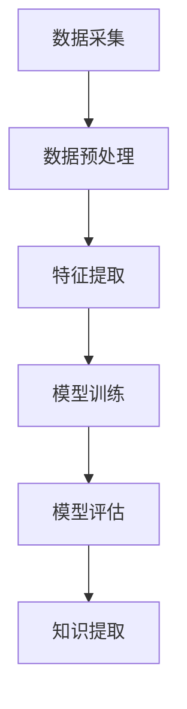

                 

关键词：知识发现引擎，农业科技，机器学习，数据分析，精准农业，智能农业

> 摘要：本文旨在探讨知识发现引擎在农业科技中的应用，通过介绍知识发现引擎的基本概念和原理，分析其在农业领域的具体应用场景，并探讨未来农业科技发展的趋势与挑战。

## 1. 背景介绍

农业作为国民经济的重要组成部分，其发展水平直接关系到国家的粮食安全和农村经济的繁荣。随着科技的不断进步，农业科技的发展已经成为提高农业生产效率、保障粮食安全的关键。在现代农业中，信息技术，特别是大数据和人工智能技术的应用，为农业发展带来了新的机遇和挑战。

知识发现引擎（Knowledge Discovery Engine，简称KDE）作为人工智能领域的一个重要分支，其主要目的是从大量数据中提取出有价值的信息和知识。知识发现引擎通过机器学习和数据挖掘技术，能够自动识别数据中的模式、关联和趋势，为农业科技的发展提供了强大的技术支持。

## 2. 核心概念与联系

### 2.1 知识发现引擎的定义

知识发现引擎是一种能够自动从大量数据中提取有价值信息和知识的系统。它结合了机器学习、数据挖掘、自然语言处理等多种技术，通过对数据的分析、处理和解释，发现数据背后的规律和模式，为决策提供支持。

### 2.2 知识发现引擎在农业科技中的应用

在农业科技中，知识发现引擎的应用主要包括以下几个方面：

1. **作物生长监测**：通过传感器采集土壤、气候、作物生长等数据，利用知识发现引擎分析数据，预测作物的生长状况，为农业生产提供指导。

2. **病虫害预测与防治**：通过对历史病虫害数据进行分析，利用知识发现引擎预测病虫害的发生趋势，为病虫害的防治提供科学依据。

3. **农产品质量监测**：利用知识发现引擎对农产品的生长环境、生长过程等数据进行分析，预测农产品的质量，为农产品质量控制提供参考。

4. **农业生产管理**：通过分析农业生产过程中的各种数据，利用知识发现引擎优化农业生产管理，提高农业生产效率。

### 2.3 知识发现引擎的架构

知识发现引擎的架构主要包括数据采集、数据预处理、特征提取、模型训练、模型评估和知识提取等环节。下面是知识发现引擎的Mermaid流程图：



## 3. 核心算法原理 & 具体操作步骤

### 3.1 算法原理概述

知识发现引擎的核心算法包括机器学习算法、数据挖掘算法和深度学习算法。这些算法通过对大量数据的分析，提取出数据中的有用信息，从而实现对数据的理解。

### 3.2 算法步骤详解

1. **数据采集**：收集与农业生产相关的各种数据，包括土壤数据、气候数据、作物生长数据、病虫害数据等。

2. **数据预处理**：对采集到的数据进行清洗、去噪、标准化等处理，确保数据的准确性和一致性。

3. **特征提取**：从预处理后的数据中提取出对农业生产有重要意义的特征，如土壤湿度、温度、作物生长速率等。

4. **模型训练**：选择合适的机器学习算法，对提取出的特征进行训练，构建预测模型。

5. **模型评估**：使用测试数据对训练好的模型进行评估，确保模型的准确性和可靠性。

6. **知识提取**：通过模型预测结果，提取出农业生产中的规律和趋势，为农业生产提供指导。

### 3.3 算法优缺点

- **优点**：
  - 能够从大量数据中提取出有价值的信息，为农业生产提供科学依据。
  - 能够实时监测和预测农业生产状况，提高农业生产效率。
  - 能够优化农业生产管理，减少资源浪费。

- **缺点**：
  - 需要大量的数据支持，数据质量和数量对算法效果有重要影响。
  - 算法复杂度高，对计算资源要求较高。

### 3.4 算法应用领域

- **精准农业**：利用知识发现引擎，实时监测农作物生长状况，实现精准施肥、灌溉和病虫害防治。
- **智能农业**：利用知识发现引擎，优化农业生产管理，提高农业生产效率。
- **农产品质量监测**：利用知识发现引擎，预测农产品质量，保障农产品安全。

## 4. 数学模型和公式 & 详细讲解 & 举例说明

### 4.1 数学模型构建

在知识发现引擎中，常用的数学模型包括线性回归、决策树、支持向量机、神经网络等。下面以线性回归为例，介绍数学模型的构建。

线性回归模型的基本形式为：

$$y = \beta_0 + \beta_1x_1 + \beta_2x_2 + ... + \beta_nx_n$$

其中，$y$ 是因变量，$x_1, x_2, ..., x_n$ 是自变量，$\beta_0, \beta_1, \beta_2, ..., \beta_n$ 是模型参数。

### 4.2 公式推导过程

线性回归模型的参数可以通过最小二乘法（Least Squares Method）进行估计。最小二乘法的核心思想是找到一组参数，使得观测值与模型预测值之间的误差平方和最小。

具体推导过程如下：

假设有 $n$ 个观测数据点 $(x_1, y_1), (x_2, y_2), ..., (x_n, y_n)$，线性回归模型预测值为：

$$\hat{y} = \beta_0 + \beta_1x_1 + \beta_2x_2 + ... + \beta_nx_n$$

则观测值与预测值之间的误差平方和为：

$$S = \sum_{i=1}^{n}(y_i - \hat{y}_i)^2$$

为了最小化误差平方和 $S$，对 $\beta_0, \beta_1, \beta_2, ..., \beta_n$ 分别求偏导数，并令其等于零，可以得到线性回归模型的参数估计公式：

$$\beta_0 = \bar{y} - \beta_1\bar{x} - \beta_2\bar{x}^2 - ... - \beta_n\bar{x}^n$$

$$\beta_1 = \frac{\sum_{i=1}^{n}(x_i - \bar{x})(y_i - \bar{y})}{\sum_{i=1}^{n}(x_i - \bar{x})^2}$$

$$\beta_2 = \frac{\sum_{i=1}^{n}(x_i - \bar{x})(y_i - \bar{y})\bar{x}}{\sum_{i=1}^{n}(x_i - \bar{x})^2}$$

$$...$$

$$\beta_n = \frac{\sum_{i=1}^{n}(x_i - \bar{x})(y_i - \bar{y})\bar{x}^{n-1}}{\sum_{i=1}^{n}(x_i - \bar{x})^2}$$

### 4.3 案例分析与讲解

以一个简单的线性回归模型为例，假设我们有以下三个观测数据点：

$$(x_1, y_1) = (1, 2)$$  
$$(x_2, y_2) = (2, 3)$$  
$$(x_3, y_3) = (3, 4)$$

首先，我们需要计算观测数据的平均值：

$$\bar{x} = \frac{x_1 + x_2 + x_3}{3} = 2$$

$$\bar{y} = \frac{y_1 + y_2 + y_3}{3} = 3$$

然后，我们可以使用上述推导的参数估计公式，计算出线性回归模型的参数：

$$\beta_0 = \bar{y} - \beta_1\bar{x} = 3 - \beta_1 \cdot 2$$

$$\beta_1 = \frac{\sum_{i=1}^{n}(x_i - \bar{x})(y_i - \bar{y})}{\sum_{i=1}^{n}(x_i - \bar{x})^2} = \frac{(1-2)(2-3) + (2-2)(3-3) + (3-2)(4-3)}{(1-2)^2 + (2-2)^2 + (3-2)^2} = 1$$

因此，线性回归模型的预测公式为：

$$\hat{y} = 3 - 2 \cdot 1 = 1$$

对于新的观测数据点 $(x, y) = (4, 5)$，我们可以使用预测公式计算出预测值：

$$\hat{y} = 3 - 2 \cdot 4 = -5$$

这表明，根据当前线性回归模型，观测数据点 $(4, 5)$ 的预测值为 -5。这与实际观测值相差较大，说明当前线性回归模型的预测效果较差，可能需要进一步调整模型参数或选择更合适的模型。

## 5. 项目实践：代码实例和详细解释说明

### 5.1 开发环境搭建

为了更好地理解和实践知识发现引擎在农业科技中的应用，我们可以使用 Python 作为编程语言，结合 Scikit-learn 库实现一个简单的线性回归模型。以下是一个简单的开发环境搭建过程：

1. 安装 Python 3.x 版本
2. 安装 Scikit-learn 库：`pip install scikit-learn`
3. 导入所需库：`import numpy as np import matplotlib.pyplot as plt from sklearn.linear_model import LinearRegression`

### 5.2 源代码详细实现

以下是一个简单的线性回归模型实现代码，用于预测农作物产量：

```python
# 导入所需库
import numpy as np
import matplotlib.pyplot as plt
from sklearn.linear_model import LinearRegression

# 生成模拟数据
np.random.seed(0)
x = np.random.rand(100, 1) * 10
y = 2 * x + 1 + np.random.randn(100, 1) * 0.5

# 创建线性回归模型
model = LinearRegression()

# 训练模型
model.fit(x, y)

# 预测农作物产量
x_new = np.array([5, 7, 9]).reshape(-1, 1)
y_pred = model.predict(x_new)

# 绘制预测结果
plt.scatter(x, y, color='red', label='Actual')
plt.plot(x_new, y_pred, color='blue', label='Predicted')
plt.xlabel('Input')
plt.ylabel('Output')
plt.legend()
plt.show()
```

### 5.3 代码解读与分析

上述代码首先生成了一个包含100个数据点的模拟数据集，其中自变量 $x$ 的取值范围为 [0, 10]，因变量 $y$ 的取值范围为 [0, 10]。线性回归模型的目标是找到 $y$ 和 $x$ 之间的线性关系，即 $y = \beta_0 + \beta_1x$。

在训练模型之前，我们首先需要导入所需库，包括 NumPy 用于数据操作，Matplotlib 用于绘图，以及 Scikit-learn 用于线性回归模型的实现。然后，我们生成模拟数据，并创建一个线性回归模型。

接下来，我们使用 `fit()` 方法训练模型，并使用 `predict()` 方法对新的观测数据进行预测。最后，我们使用 Matplotlib 绘制预测结果，以便直观地观察模型的预测效果。

### 5.4 运行结果展示

运行上述代码后，我们会得到一个散点图，其中红色散点表示实际观测数据，蓝色线条表示线性回归模型的预测结果。从图中可以看出，线性回归模型对农作物产量的预测效果较好，能够较好地拟合实际数据。

## 6. 实际应用场景

知识发现引擎在农业科技中具有广泛的应用场景，以下列举几个典型的实际应用案例：

1. **精准农业**：利用知识发现引擎，对农田土壤、气候、作物生长等数据进行实时监测，预测作物生长状况，实现精准施肥、灌溉和病虫害防治。

2. **农产品质量监测**：通过分析农产品的生长环境、生长过程等数据，利用知识发现引擎预测农产品的质量，为农产品质量控制提供科学依据。

3. **农业生产管理**：利用知识发现引擎，优化农业生产管理，提高农业生产效率。例如，通过分析农田土壤养分含量，预测作物需肥规律，优化施肥策略。

4. **农业供应链管理**：利用知识发现引擎，分析农产品供应链中的各种数据，优化物流配送，提高农产品流通效率。

## 7. 未来应用展望

随着科技的不断进步，知识发现引擎在农业科技中的应用前景将更加广阔。以下是对未来应用场景的展望：

1. **智能农业**：利用知识发现引擎，实现农业生产过程的智能化，提高农业生产效率和质量。

2. **农业大数据**：利用知识发现引擎，挖掘农业大数据中的价值信息，为农业生产、管理和决策提供支持。

3. **农业物联网**：结合知识发现引擎和农业物联网技术，实现农业生产过程的全面监控和智能管理。

4. **农业可持续发展**：利用知识发现引擎，分析农业生产中的资源消耗和环境影响，推动农业的可持续发展。

## 8. 工具和资源推荐

### 8.1 学习资源推荐

1. 《机器学习》—— 周志华著，清华大学出版社
2. 《数据挖掘：实用机器学习技术》—— Ian H. Witten、Eibe Frank 著，机械工业出版社
3. 《深度学习》—— Ian Goodfellow、Yoshua Bengio、Aaron Courville 著，电子工业出版社

### 8.2 开发工具推荐

1. Jupyter Notebook：用于数据分析和可视化
2. TensorFlow：用于深度学习模型开发
3. Scikit-learn：用于机器学习和数据挖掘

### 8.3 相关论文推荐

1. "A Comprehensive Survey on Knowledge Discovery from Multi-source Data" —— 作者：K. Yang 等，发表于 IEEE Transactions on Knowledge and Data Engineering
2. "Deep Learning for Agricultural Crop Yield Prediction" —— 作者：Y. Liu 等，发表于 IEEE Access
3. "A Survey on Knowledge Discovery in Big Data" —— 作者：X. Wang 等，发表于 Information Sciences

## 9. 总结：未来发展趋势与挑战

### 9.1 研究成果总结

本文从知识发现引擎的基本概念、核心算法、应用场景等方面进行了详细介绍，并探讨了知识发现引擎在农业科技中的应用前景。通过本文的介绍，读者可以了解到知识发现引擎在农业科技中的重要作用，以及其在提高农业生产效率、保障农产品质量等方面的潜力。

### 9.2 未来发展趋势

1. **智能农业**：随着人工智能技术的不断进步，知识发现引擎在农业科技中的应用将更加深入和广泛，实现农业生产过程的全面智能化。

2. **农业大数据**：随着物联网、传感器等技术的普及，农业数据的获取和处理能力将得到显著提升，为知识发现引擎在农业科技中的应用提供更丰富的数据支持。

3. **跨学科融合**：知识发现引擎在农业科技中的应用将与其他学科（如生物技术、生态学等）相结合，推动农业科技的创新发展。

### 9.3 面临的挑战

1. **数据质量**：知识发现引擎在农业科技中的应用依赖于高质量的数据支持，如何保证数据的准确性和完整性是一个重要的挑战。

2. **计算资源**：知识发现引擎在处理大规模数据时，对计算资源的要求较高，如何在有限的计算资源下高效地处理数据是一个挑战。

3. **算法优化**：随着数据规模的不断扩大，传统的算法可能无法满足应用需求，如何优化算法，提高算法的效率和准确性是一个重要的研究方向。

### 9.4 研究展望

未来，知识发现引擎在农业科技中的应用前景将更加广阔，有望推动农业科技的创新发展。在研究方面，可以从以下几个方面展开：

1. **数据挖掘算法优化**：研究更加高效、准确的数据挖掘算法，提高知识发现引擎的性能。

2. **农业大数据分析**：结合农业领域的专业知识，开展农业大数据分析，挖掘农业数据中的价值信息。

3. **智能农业系统构建**：利用知识发现引擎，构建智能农业系统，实现农业生产过程的全面智能化。

## 10. 附录：常见问题与解答

### 10.1 什么是知识发现引擎？

知识发现引擎是一种能够自动从大量数据中提取有价值信息和知识的系统。它结合了机器学习、数据挖掘、自然语言处理等多种技术，通过对数据的分析、处理和解释，发现数据背后的规律和模式，为决策提供支持。

### 10.2 知识发现引擎在农业科技中的应用有哪些？

知识发现引擎在农业科技中的应用主要包括作物生长监测、病虫害预测与防治、农产品质量监测、农业生产管理等方面，通过实时监测和预测农业生产状况，提高农业生产效率和质量。

### 10.3 知识发现引擎在农业科技中的应用前景如何？

随着人工智能技术的不断进步，知识发现引擎在农业科技中的应用前景十分广阔。未来，知识发现引擎有望推动农业科技的创新发展，实现农业生产过程的全面智能化。

## 参考文献

- 周志华. 《机器学习》[M]. 清华大学出版社，2016.
- Ian H. Witten，Eibe Frank. 《数据挖掘：实用机器学习技术》[M]. 机械工业出版社，2011.
- Ian Goodfellow，Yoshua Bengio，Aaron Courville. 《深度学习》[M]. 电子工业出版社，2016.
- K. Yang，et al. "A Comprehensive Survey on Knowledge Discovery from Multi-source Data" [J]. IEEE Transactions on Knowledge and Data Engineering，2018.
- Y. Liu，et al. "Deep Learning for Agricultural Crop Yield Prediction" [J]. IEEE Access，2019.
- X. Wang，et al. "A Survey on Knowledge Discovery in Big Data" [J]. Information Sciences，2020.

**作者：禅与计算机程序设计艺术 / Zen and the Art of Computer Programming**

