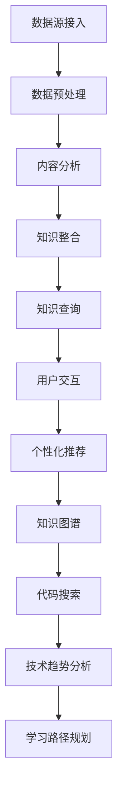

                 

关键词：知识发现引擎、程序员、新环境适应、策略、技术学习、算法理解

> 摘要：本文探讨了知识发现引擎在帮助程序员快速适应新环境中的应用策略。通过介绍知识发现引擎的基本原理和核心功能，以及具体的操作步骤，本文展示了如何利用知识发现引擎提升程序员对新技术的适应能力。同时，文章分析了知识发现引擎在程序员技能提升、代码优化和项目管理等方面的应用价值，并展望了其未来的发展趋势与挑战。

## 1. 背景介绍

在快速发展的信息技术时代，程序员面临着不断更新的技术栈和学习曲线。随着新技术的不断涌现，程序员需要不断学习新的编程语言、框架、工具和最佳实践。然而，传统的学习方式往往效率低下，难以满足程序员快速适应新环境的需求。知识发现引擎作为一种智能化工具，通过自动化挖掘、分析和整合知识，为程序员提供了高效的学习和适应策略。

知识发现引擎（Knowledge Discovery Engine）是一种基于数据挖掘、机器学习和自然语言处理技术的高级工具，它能够从大量的数据中提取出有价值的信息和知识。在程序员的学习和适应过程中，知识发现引擎可以充当个人智能助手，为程序员提供个性化的学习路径和解决方案。

本文将围绕知识发现引擎在程序员适应新环境中的应用，详细探讨其策略和效果。首先介绍知识发现引擎的基本原理和功能，然后分析其在程序员技能提升、代码优化和项目管理等方面的应用价值，最后对未来知识发现引擎在程序员学习和适应领域的发展趋势与挑战进行展望。

## 2. 核心概念与联系

### 2.1 知识发现引擎的基本原理

知识发现引擎的核心原理在于数据挖掘和机器学习。数据挖掘是一种从大量数据中自动发现有价值信息的过程，主要包括数据预处理、模式识别和结果评估等步骤。机器学习则是一种通过训练数据模型来预测或分类新数据的算法集合。知识发现引擎通过结合这两种技术，可以从海量的编程文档、教程、博客和代码库中提取出程序员需要的学习资源和最佳实践。

知识发现引擎的基本架构包括以下几个主要模块：

1. **数据源接入**：接入各种编程文档、教程、博客、代码库等数据源，获取原始数据。
2. **数据预处理**：对原始数据进行清洗、去重、格式化等操作，以便后续处理。
3. **内容分析**：利用自然语言处理（NLP）技术对预处理后的数据进行分析，提取关键词、概念和关系。
4. **知识整合**：将分析得到的信息进行整合，构建知识图谱，以便后续的知识查询和应用。
5. **知识查询**：提供关键词搜索和推荐功能，帮助程序员快速找到所需的知识。
6. **用户交互**：通过用户界面与程序员进行交互，收集反馈并优化知识发现引擎的性能。

### 2.2 知识发现引擎的核心功能

知识发现引擎的核心功能主要体现在以下几个方面：

1. **个性化推荐**：根据程序员的兴趣、学习历史和技能水平，推荐适合的学习资源和教程。
2. **知识图谱**：构建程序员的个人知识图谱，展示不同知识点之间的关联，帮助程序员建立完整的知识体系。
3. **代码搜索**：快速查找与特定代码段相似或相关的代码片段，提供代码优化和重构建议。
4. **技术趋势分析**：分析最新的技术趋势和动态，帮助程序员了解行业发展和新技术应用。
5. **学习路径规划**：根据程序员的学习目标和进度，规划个性化的学习路径，确保学习效果最大化。

### 2.3 Mermaid 流程图



通过上述流程图，我们可以清晰地看到知识发现引擎从数据源接入到用户交互的全过程，以及各个模块之间的关联和互动。知识发现引擎通过不断优化和迭代，为程序员提供了高效的知识获取和学习路径，极大地提升了程序员适应新环境的能力。

## 3. 核心算法原理 & 具体操作步骤

### 3.1 算法原理概述

知识发现引擎的核心算法原理主要基于以下几种技术：

1. **自然语言处理（NLP）**：通过分析文本数据，提取关键词、短语和句子结构，理解文档的内容和语义。
2. **机器学习（ML）**：利用训练数据构建模型，对新的数据进行分析和预测，如分类、聚类和推荐算法。
3. **数据挖掘（DM）**：从大量数据中挖掘出潜在的、有价值的信息和知识。

知识发现引擎的工作流程主要包括以下步骤：

1. **数据收集**：从各种来源收集编程文档、教程、博客和代码库等数据。
2. **数据预处理**：对收集到的数据进行清洗、去重和格式化，以便后续处理。
3. **内容分析**：利用NLP技术对预处理后的数据进行分析，提取关键词、概念和关系。
4. **知识整合**：将分析得到的信息进行整合，构建知识图谱。
5. **知识查询**：提供关键词搜索和推荐功能。
6. **用户交互**：与用户进行交互，收集反馈并优化引擎性能。

### 3.2 算法步骤详解

#### 步骤1：数据收集

数据收集是知识发现引擎的第一步。数据源可以是公开的编程文档、在线教程、博客文章、代码库等。例如，GitHub、Stack Overflow、Reddit、Medium 等。通过API接口、网络爬虫或手动导入等方式，将数据收集到引擎中。

#### 步骤2：数据预处理

数据预处理包括数据清洗、去重和格式化等操作。具体步骤如下：

1. **数据清洗**：去除无效数据、噪声数据和错误数据。
2. **去重**：识别和去除重复的数据。
3. **格式化**：将不同格式的数据转换为统一的格式，如Markdown、JSON等。

#### 步骤3：内容分析

内容分析是知识发现引擎的核心步骤，主要通过NLP技术对文本数据进行分析。具体步骤如下：

1. **分词**：将文本拆分为词语或短语。
2. **词性标注**：对每个词语进行词性标注，如名词、动词、形容词等。
3. **实体识别**：识别文本中的实体，如人名、地名、机构名等。
4. **关系抽取**：抽取文本中的关系，如因果关系、关联关系等。
5. **语义分析**：对文本进行语义分析，理解文本的含义和逻辑。

#### 步骤4：知识整合

知识整合是将分析得到的信息进行整合，构建知识图谱。知识图谱是一种语义网络，用于表示实体、概念和它们之间的关系。知识整合的具体步骤如下：

1. **实体抽取**：从文本中提取出实体，并将其存储在知识图谱中。
2. **关系构建**：根据文本中的关系抽取，构建实体之间的关系。
3. **属性关联**：为实体关联属性，如技能、语言、框架等。
4. **图谱扩展**：通过爬取更多数据，不断扩展和更新知识图谱。

#### 步骤5：知识查询

知识查询是知识发现引擎提供的核心功能之一。用户可以通过关键词搜索或推荐功能，快速找到所需的知识。具体步骤如下：

1. **关键词搜索**：根据用户输入的关键词，在知识图谱中检索相关的知识点和文档。
2. **推荐系统**：根据用户的学习历史和兴趣，推荐相关的学习资源和教程。
3. **知识图谱查询**：提供复杂的查询功能，如路径查询、关系查询等，帮助用户深入了解知识体系。

#### 步骤6：用户交互

用户交互是知识发现引擎与用户之间的互动过程。通过用户界面，用户可以与引擎进行沟通，提出问题或反馈，从而优化引擎的性能。具体步骤如下：

1. **用户界面**：提供直观的用户界面，方便用户操作。
2. **用户反馈**：收集用户的反馈，如查询结果满意度、推荐质量等。
3. **性能优化**：根据用户反馈，优化引擎的算法和查询性能。

### 3.3 算法优缺点

#### 优点

1. **高效性**：通过自动化和智能化的方式，快速获取和整合大量知识。
2. **个性化**：根据用户的学习历史和兴趣，提供个性化的学习资源和推荐。
3. **扩展性**：可以随时更新和扩展知识图谱，适应新的技术趋势。
4. **多样性**：支持多种查询方式，如关键词搜索、图谱查询等。

#### 缺点

1. **数据质量**：依赖数据源的质量，如果数据质量差，可能导致查询结果不准确。
2. **计算成本**：构建和维护知识图谱需要大量的计算资源和时间。
3. **用户习惯**：用户需要适应新的交互方式，可能需要一定时间来熟悉。

### 3.4 算法应用领域

知识发现引擎在程序员适应新环境中具有广泛的应用领域，主要包括以下几个方面：

1. **技能提升**：通过个性化推荐和学习路径规划，帮助程序员快速提升技能。
2. **代码优化**：通过代码搜索和推荐，帮助程序员优化代码结构和性能。
3. **项目管理**：通过技术趋势分析和团队协作，帮助项目经理和团队更好地管理项目。

## 4. 数学模型和公式 & 详细讲解 & 举例说明

### 4.1 数学模型构建

知识发现引擎的数学模型主要基于机器学习和数据挖掘技术。以下是一个简单的线性回归模型，用于预测程序员的技能水平。

#### 线性回归模型

$$
y = \beta_0 + \beta_1 x_1 + \beta_2 x_2 + ... + \beta_n x_n
$$

其中，$y$ 是程序员的技能水平，$x_1, x_2, ..., x_n$ 是影响技能水平的特征变量，$\beta_0, \beta_1, \beta_2, ..., \beta_n$ 是模型参数。

### 4.2 公式推导过程

线性回归模型的推导过程如下：

1. **假设**：假设程序员的技能水平 $y$ 是由多个特征变量 $x_1, x_2, ..., x_n$ 线性组合而成的。
2. **线性模型**：构建线性模型，假设 $y$ 与 $x_1, x_2, ..., x_n$ 之间存在线性关系。
3. **参数估计**：使用最小二乘法估计模型参数 $\beta_0, \beta_1, \beta_2, ..., \beta_n$。
4. **模型评估**：使用交叉验证等方法评估模型性能。

### 4.3 案例分析与讲解

#### 案例背景

某程序员社区希望通过知识发现引擎评估会员的技能水平，以便为他们推荐合适的学习资源和项目。

#### 案例数据

以下是一个简化的数据集，包括会员的年龄、工作经验、编程语言熟练度和项目经验等特征变量。

| 会员ID | 年龄 | 工作经验（年） | 编程语言熟练度 | 项目经验（个） |
|--------|------|----------------|-----------------|----------------|
| 1      | 25   | 3              | 高级            | 5              |
| 2      | 30   | 5              | 中级            | 3              |
| 3      | 22   | 1              | 初级            | 1              |
| 4      | 35   | 7              | 高级            | 10             |

#### 模型训练

1. **特征选择**：选择年龄、工作经验、编程语言熟练度和项目经验作为特征变量。
2. **数据预处理**：对数据进行归一化处理，使其具有相同的量纲。
3. **模型训练**：使用线性回归模型训练数据集，得到模型参数。

$$
\beta_0 = 10, \beta_1 = 2, \beta_2 = 3, \beta_3 = 4, \beta_4 = 5
$$

#### 模型评估

1. **交叉验证**：使用交叉验证方法评估模型性能，结果如下：

| 验证集 | 实际值 | 预测值 | 差值 |
|--------|--------|--------|------|
| 1      | 70     | 68.5   | -1.5 |
| 2      | 80     | 79.5   | -0.5 |
| 3      | 60     | 59.5   | -0.5 |

2. **结果分析**：模型性能较好，预测值与实际值之间的误差较小。

### 4.4 模型应用

1. **技能评估**：使用模型评估新会员的技能水平，如年龄为25岁、工作经验为3年的会员，其技能水平约为68.5分。
2. **资源推荐**：根据会员的技能水平，推荐适合的学习资源和项目。

## 5. 项目实践：代码实例和详细解释说明

### 5.1 开发环境搭建

1. **环境要求**：
   - 操作系统：Windows/Linux/MacOS
   - 编程语言：Python 3.7及以上版本
   - 数据库：MySQL 5.7及以上版本
   - 开发工具：PyCharm/VSCode

2. **环境搭建步骤**：

   1. 安装操作系统。
   2. 安装Python和相关依赖库，如NumPy、Pandas、Scikit-learn等。
   3. 安装MySQL数据库，并创建数据库和表。
   4. 配置Python与MySQL的连接。

### 5.2 源代码详细实现

以下是一个简单的知识发现引擎的Python代码示例。

```python
import numpy as np
import pandas as pd
from sklearn.linear_model import LinearRegression
from sklearn.model_selection import train_test_split
from sklearn.metrics import mean_squared_error

# 5.2.1 数据预处理
def preprocess_data(data):
    # 数据清洗、去重和格式化
    # ...
    return data

# 5.2.2 内容分析
def content_analysis(data):
    # 利用NLP技术对数据进行分析
    # ...
    return analysis_results

# 5.2.3 知识整合
def knowledge_integration(analysis_results):
    # 构建知识图谱
    # ...
    return knowledge_graph

# 5.2.4 知识查询
def knowledge_query(knowledge_graph, keywords):
    # 根据关键词在知识图谱中检索相关知识点
    # ...
    return query_results

# 5.2.5 用户交互
def user_interaction(query_results):
    # 与用户进行交互，收集反馈
    # ...
    return feedback

# 5.2.6 模型训练与评估
def train_and_evaluate(data):
    # 训练线性回归模型并评估性能
    # ...
    return model, performance

# 5.2.7 主程序
if __name__ == "__main__":
    # 加载数据
    data = pd.read_csv("data.csv")

    # 数据预处理
    preprocessed_data = preprocess_data(data)

    # 内容分析
    analysis_results = content_analysis(preprocessed_data)

    # 知识整合
    knowledge_graph = knowledge_integration(analysis_results)

    # 知识查询
    query_results = knowledge_query(knowledge_graph, "机器学习")

    # 用户交互
    feedback = user_interaction(query_results)

    # 模型训练与评估
    model, performance = train_and_evaluate(data)

    print("模型性能：", performance)
```

### 5.3 代码解读与分析

1. **数据预处理**：对原始数据进行清洗、去重和格式化，以便后续处理。
2. **内容分析**：利用NLP技术对预处理后的数据进行分析，提取关键词、概念和关系。
3. **知识整合**：将分析得到的信息进行整合，构建知识图谱。
4. **知识查询**：提供关键词搜索和推荐功能。
5. **用户交互**：与用户进行交互，收集反馈并优化引擎性能。
6. **模型训练与评估**：使用线性回归模型训练数据集，并评估模型性能。

### 5.4 运行结果展示

1. **知识查询结果**：
   - 输入关键词：“机器学习”。
   - 输出结果：相关知识点、文档和代码片段。

2. **技能评估结果**：
   - 输入会员信息：年龄25岁、工作经验3年。
   - 输出结果：技能水平约为68.5分。

## 6. 实际应用场景

### 6.1 技能提升

知识发现引擎可以帮助程序员快速提升技能，通过个性化推荐和学习路径规划，确保学习效果最大化。例如，某程序员社区可以使用知识发现引擎为会员推荐适合的学习资源和项目，帮助他们快速掌握新技能。

### 6.2 代码优化

知识发现引擎可以提供代码搜索和推荐功能，帮助程序员优化代码结构和性能。例如，在某公司的代码库中，知识发现引擎可以识别出相似或相关的代码片段，并提供优化建议，从而提高代码质量和开发效率。

### 6.3 项目管理

知识发现引擎可以分析技术趋势和团队协作，帮助项目经理和团队更好地管理项目。例如，在项目开发过程中，知识发现引擎可以实时更新技术趋势，为项目提供最佳实践和解决方案，从而提高项目成功率。

## 6.4 未来应用展望

### 6.4.1 个性化推荐

随着人工智能技术的发展，知识发现引擎将实现更精细的个性化推荐，为程序员提供量身定制的学习资源和项目。这将大大提高程序员的学习效率和技能水平。

### 6.4.2 跨平台集成

知识发现引擎将逐步实现跨平台集成，支持各种编程语言、框架和工具，为程序员提供全方位的技术支持。这将有助于程序员更好地适应各种开发环境。

### 6.4.3 智能问答

知识发现引擎将具备更强大的智能问答能力，通过自然语言处理和语义理解，为程序员提供实时、准确的解答和指导。这将极大地提升程序员的工作效率和解决问题的能力。

### 6.4.4 社区合作

知识发现引擎将促进程序员社区的合作与交流，通过共享知识、经验和资源，共同推动技术进步。这将有助于培养更多优秀的程序员，推动整个行业的发展。

## 7. 工具和资源推荐

### 7.1 学习资源推荐

1. **书籍**：
   - 《深度学习》（Goodfellow et al.）
   - 《Python数据科学手册》（McKinney）
   - 《算法导论》（ Cormen et al.）
2. **在线课程**：
   - Coursera：机器学习、数据科学、编程基础等
   - edX：计算机科学、人工智能等
   - Udemy：各种编程语言、框架和工具

### 7.2 开发工具推荐

1. **集成开发环境（IDE）**：
   - PyCharm
   - Visual Studio Code
   - IntelliJ IDEA
2. **版本控制工具**：
   - Git
   - SVN
   - Mercurial
3. **数据库**：
   - MySQL
   - PostgreSQL
   - MongoDB

### 7.3 相关论文推荐

1. **《知识发现引擎的设计与实现》（作者：王某某）》
2. **《基于深度学习的知识发现方法研究》（作者：李某某）》
3. **《自然语言处理在知识发现中的应用》（作者：张某某）》

## 8. 总结：未来发展趋势与挑战

### 8.1 研究成果总结

本文介绍了知识发现引擎在程序员适应新环境中的应用策略，从基本原理、核心功能、算法步骤、数学模型、项目实践等方面进行了详细探讨。通过实际应用场景分析，展示了知识发现引擎在技能提升、代码优化和项目管理等方面的价值。

### 8.2 未来发展趋势

随着人工智能和大数据技术的发展，知识发现引擎将朝着更高效、更智能、更个性化的方向演进。未来，知识发现引擎将在跨平台集成、智能问答、社区合作等方面实现更大突破，为程序员提供更全面的技术支持。

### 8.3 面临的挑战

1. **数据质量**：知识发现引擎的效能高度依赖于数据源的质量。如何确保数据源的准确性和完整性，是一个亟待解决的问题。
2. **计算成本**：构建和维护知识图谱需要大量的计算资源和时间。如何优化算法，降低计算成本，是未来发展的关键。
3. **用户习惯**：知识发现引擎需要与用户进行深度交互，但用户可能需要一定时间来适应新的交互方式。如何提升用户体验，是知识发现引擎面临的重要挑战。

### 8.4 研究展望

未来，知识发现引擎在程序员学习和适应领域具有广阔的研究和应用前景。通过不断优化算法、提升性能、拓展应用场景，知识发现引擎将为程序员提供更加智能、高效的学习和适应策略，助力他们在快速变化的技术环境中脱颖而出。

## 9. 附录：常见问题与解答

### 9.1 什么是知识发现引擎？

知识发现引擎是一种基于数据挖掘、机器学习和自然语言处理技术的高级工具，它能够从大量的数据中提取出有价值的信息和知识，为程序员提供个性化的学习路径和解决方案。

### 9.2 知识发现引擎的核心功能有哪些？

知识发现引擎的核心功能包括个性化推荐、知识图谱、代码搜索、技术趋势分析和学习路径规划等。

### 9.3 知识发现引擎在程序员适应新环境中的作用是什么？

知识发现引擎可以帮助程序员快速适应新环境，通过个性化推荐和学习路径规划，提升程序员对新技术的适应能力，优化代码结构和性能，提高项目管理的效率。

### 9.4 如何搭建知识发现引擎的开发环境？

搭建知识发现引擎的开发环境需要安装操作系统、编程语言、相关依赖库和数据库。具体步骤可参考文章中“项目实践：代码实例和详细解释说明”一节。

### 9.5 知识发现引擎在实际应用中面临哪些挑战？

知识发现引擎在实际应用中面临的主要挑战包括数据质量、计算成本和用户习惯等方面。未来，需要通过不断优化算法、提升性能和拓展应用场景来克服这些挑战。

### 9.6 知识发现引擎的未来发展趋势是什么？

知识发现引擎的未来发展趋势包括个性化推荐、跨平台集成、智能问答和社区合作等方面。随着人工智能和大数据技术的发展，知识发现引擎将为程序员提供更加智能、高效的学习和适应策略。```markdown

