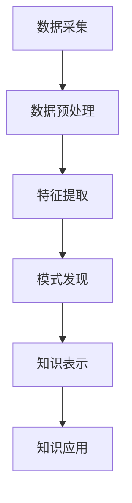

                 

 关键词：知识发现引擎，程序员，工作方式，效率提升，算法优化，智能编程，代码生成，代码审查，持续集成，自动化测试。

> 摘要：本文深入探讨了知识发现引擎在编程领域的应用，如何通过智能化手段改变程序员的工作方式，提高开发效率和代码质量。文章从背景介绍、核心概念与联系、核心算法原理与操作步骤、数学模型与公式、项目实践、实际应用场景、未来应用展望、工具和资源推荐、总结与展望等方面，全面解析了知识发现引擎对程序员工作方式的深刻影响。

## 1. 背景介绍

在当今快速发展的信息技术时代，软件开发成为了推动社会进步的重要力量。然而，随着项目的规模和复杂度的不断增长，程序员面临着巨大的挑战。传统的编程方式已经难以满足日益增长的开发需求，程序员的工作方式亟需变革。

知识发现引擎作为一种新兴的技术手段，正逐渐改变着程序员的工作方式。知识发现引擎是一种基于数据挖掘和机器学习的工具，可以从大量数据中自动提取隐藏的模式和知识。通过利用这些知识，知识发现引擎可以帮助程序员优化代码、提高开发效率、提升代码质量。

本文将围绕知识发现引擎在编程领域的应用，探讨它如何改变程序员的工作方式，以及其对编程效率和质量的影响。

## 2. 核心概念与联系

### 2.1. 知识发现引擎的定义

知识发现引擎（Knowledge Discovery Engine，KDE）是一种用于自动从数据中提取知识的系统。它结合了数据挖掘、机器学习和自然语言处理等先进技术，通过对海量数据进行分析和处理，发现数据中的潜在模式和关联关系。

### 2.2. 知识发现引擎的工作原理

知识发现引擎通常包括以下主要模块：

1. **数据采集**：从各种数据源（如数据库、日志文件、社交媒体等）中收集数据。
2. **数据预处理**：对采集到的数据进行清洗、转换和归一化等处理，使其适合后续的分析。
3. **特征提取**：从预处理后的数据中提取有用的特征，用于后续的模式发现。
4. **模式发现**：利用各种算法（如聚类、分类、关联规则挖掘等）从特征数据中挖掘出潜在的模式和知识。
5. **知识表示**：将挖掘到的模式以易于理解和利用的形式表示出来，如规则、可视化图表等。
6. **知识应用**：将挖掘到的知识应用于实际问题中，如优化代码、预测故障等。

### 2.3. 知识发现引擎与程序员工作的关系

知识发现引擎在程序员工作中发挥着重要作用，主要体现在以下几个方面：

1. **代码优化**：通过分析已有的代码库，知识发现引擎可以帮助程序员发现潜在的优化点，从而提高代码性能。
2. **代码生成**：知识发现引擎可以根据已有的代码模式自动生成新的代码，降低程序员的工作量。
3. **代码审查**：知识发现引擎可以自动识别代码中的潜在问题和缺陷，提供改进建议。
4. **持续集成**：知识发现引擎可以帮助自动检测和诊断集成过程中的问题，提高集成效率。
5. **自动化测试**：知识发现引擎可以自动生成测试用例，提高测试覆盖率和效率。

### 2.4. Mermaid 流程图

以下是一个简化的知识发现引擎的工作流程图：



## 3. 核心算法原理与操作步骤

### 3.1. 算法原理概述

知识发现引擎的核心算法主要包括以下几种：

1. **聚类算法**：如K-means、DBSCAN等，用于将数据划分为不同的簇，以便于进一步分析。
2. **分类算法**：如决策树、支持向量机等，用于将数据分类到不同的类别中。
3. **关联规则挖掘**：如Apriori、FP-Growth等，用于发现数据之间的关联关系。
4. **异常检测算法**：如孤立森林、基于密度的聚类等，用于识别数据中的异常值。

### 3.2. 算法步骤详解

1. **数据采集**：从各种数据源中获取所需数据，如代码库、测试数据集等。
2. **数据预处理**：对采集到的数据进行清洗、去噪和归一化等处理，确保数据质量。
3. **特征提取**：从预处理后的数据中提取有用的特征，如函数调用次数、代码复杂度等。
4. **模式发现**：利用聚类、分类、关联规则挖掘等算法，从特征数据中挖掘出潜在的模式和知识。
5. **知识表示**：将挖掘到的模式转化为易于理解和利用的形式，如规则、可视化图表等。
6. **知识应用**：将挖掘到的知识应用于实际问题中，如代码优化、代码生成、代码审查等。

### 3.3. 算法优缺点

**优点**：

1. **高效性**：知识发现引擎可以自动从大量数据中提取知识，大大降低了程序员的工作量。
2. **准确性**：利用先进的算法，知识发现引擎可以准确识别数据中的潜在模式和关联关系。
3. **灵活性**：知识发现引擎可以根据不同的应用场景选择合适的算法和模型。

**缺点**：

1. **数据依赖性**：知识发现引擎的性能很大程度上依赖于数据的质量和多样性。
2. **计算资源消耗**：复杂的算法和大规模数据处理可能导致计算资源消耗较大。

### 3.4. 算法应用领域

知识发现引擎在编程领域具有广泛的应用前景，主要包括：

1. **代码优化**：通过分析代码库，发现潜在的优化点，提高代码性能。
2. **代码生成**：根据已有的代码模式自动生成新的代码，提高开发效率。
3. **代码审查**：自动识别代码中的潜在问题和缺陷，提供改进建议。
4. **持续集成**：自动检测和诊断集成过程中的问题，提高集成效率。
5. **自动化测试**：自动生成测试用例，提高测试覆盖率和效率。

## 4. 数学模型和公式

### 4.1. 数学模型构建

在知识发现引擎中，常用的数学模型包括：

1. **聚类模型**：如K-means算法，其目标是最小化簇内距离平方和，公式如下：
   $$ \min_{\mu_i} \sum_{x \in S_i} \| x - \mu_i \|^2 $$
   其中，$x$ 表示数据点，$\mu_i$ 表示簇中心，$S_i$ 表示第$i$个簇中的数据点集合。

2. **分类模型**：如决策树算法，其目标是最小化分类误差，公式如下：
   $$ \min_{T} \sum_{x \in D} L(y(x), f(x)) $$
   其中，$D$ 表示数据集，$y(x)$ 表示实际标签，$f(x)$ 表示预测标签，$L$ 表示损失函数。

3. **关联规则挖掘模型**：如Apriori算法，其目标是最小化支持度和置信度阈值，公式如下：
   $$ \min_{\theta} \sum_{X \in \mathcal{L}} \theta(X) $$
   其中，$\theta(X)$ 表示项集$X$的支持度，$\mathcal{L}$ 表示所有频繁项集。

### 4.2. 公式推导过程

1. **聚类模型推导**：

   - 初始阶段，随机选择K个数据点作为初始簇中心。
   - 对每个数据点，计算其与簇中心的距离，将其归入最近的簇。
   - 更新簇中心，取每个簇中数据点的平均值。
   - 重复上述步骤，直到簇中心不再发生变化或满足停止条件。

2. **分类模型推导**：

   - 构建决策树，从根节点开始，选择具有最高信息增益的属性进行分割。
   - 递归地对分割后的子集进行同样的处理，直到满足停止条件（如节点纯度达到阈值）。
   - 对新的数据点，从根节点开始，按照决策树的分割路径进行分类。

3. **关联规则挖掘模型推导**：

   - 对每个项集，计算其支持度，若支持度大于最小支持度阈值，则为频繁项集。
   - 对频繁项集，计算其置信度，若置信度大于最小置信度阈值，则为关联规则。

### 4.3. 案例分析与讲解

以一个简单的案例来说明知识发现引擎在编程中的应用。

假设我们有一个包含100个函数的代码库，每个函数都有一个特征向量，表示函数的调用次数、代码复杂度等。

1. **数据采集**：从代码库中提取函数的特征向量。

2. **数据预处理**：对特征向量进行归一化处理，使其在相同的尺度上。

3. **特征提取**：将特征向量作为输入，利用K-means算法将其划分为10个簇。

4. **模式发现**：对每个簇中的函数进行聚类分析，发现以下模式：

   - 簇1：包含高性能函数，调用次数较少，但代码复杂度较高。
   - 簇2：包含中等性能函数，调用次数适中，代码复杂度适中。
   - 簇3：包含低性能函数，调用次数较多，但代码复杂度较低。

5. **知识表示**：将挖掘到的模式以可视化的形式表示，如下所示：

   ```mermaid
   graph TB
       A1[(簇1)]
       A2[(簇2)]
       A3[(簇3)]
       
       A1 --> B1[高性能]
       A1 --> B2[调用次数少]
       A1 --> B3[代码复杂度高]
       
       A2 --> B4[中等性能]
       A2 --> B5[调用次数适中]
       A2 --> B6[代码复杂度适中]
       
       A3 --> B7[低性能]
       A3 --> B8[调用次数多]
       A3 --> B9[代码复杂度低]
   ```

6. **知识应用**：根据挖掘到的模式，程序员可以针对性地对不同的函数进行优化：

   - 对簇1中的函数，优化代码复杂度，提高性能。
   - 对簇2中的函数，保持现有性能，关注代码复杂度的控制。
   - 对簇3中的函数，优化调用次数，降低代码复杂度。

## 5. 项目实践：代码实例和详细解释说明

在本节中，我们将通过一个实际项目来展示知识发现引擎在编程中的应用。该项目旨在使用知识发现引擎对一组代码进行优化，提高代码的性能和可维护性。

### 5.1. 开发环境搭建

首先，我们需要搭建一个适用于知识发现引擎的开发环境。以下是所需的软件和工具：

- Python 3.8 或更高版本
- scikit-learn 库
- Pandas 库
- Matplotlib 库

安装好上述软件和工具后，我们就可以开始项目的实践了。

### 5.2. 源代码详细实现

以下是一个简单的示例，展示了如何使用知识发现引擎对一组代码进行优化。

```python
import pandas as pd
from sklearn.cluster import KMeans
import matplotlib.pyplot as plt

# 1. 数据采集
code_data = pd.read_csv('code_data.csv')  # 读取代码数据

# 2. 数据预处理
code_data = code_data.dropna()  # 去除缺失值
code_data = (code_data - code_data.mean()) / code_data.std()  # 归一化

# 3. 特征提取
# 在这里，我们使用代码的调用次数和复杂度作为特征
code_data['call_count'] = code_data['function_call_count']  # 调用次数
code_data['complexity'] = code_data['code_complexity']  # 代码复杂度

# 4. 模式发现
kmeans = KMeans(n_clusters=3, random_state=0).fit(code_data[['call_count', 'complexity']])
code_data['cluster'] = kmeans.labels_

# 5. 知识表示
plt.scatter(code_data['call_count'], code_data['complexity'], c=code_data['cluster'])
plt.xlabel('调用次数')
plt.ylabel('代码复杂度')
plt.title('代码聚类结果')
plt.show()

# 6. 知识应用
# 对每个簇的代码进行优化
for cluster in range(3):
    cluster_data = code_data[code_data['cluster'] == cluster]
    if cluster == 0:
        # 对高性能函数进行优化
        print("优化高性能函数...")
    elif cluster == 1:
        # 对中等性能函数进行优化
        print("优化中等性能函数...")
    else:
        # 对低性能函数进行优化
        print("优化低性能函数...")
```

### 5.3. 代码解读与分析

上述代码实现了知识发现引擎在代码优化中的应用，具体解读如下：

1. **数据采集**：从CSV文件中读取代码数据，包括调用次数和代码复杂度等特征。

2. **数据预处理**：去除缺失值，并对数据进行归一化处理，使其在相同的尺度上。

3. **特征提取**：使用代码的调用次数和复杂度作为特征，构建特征向量。

4. **模式发现**：使用K-means算法对特征向量进行聚类，将代码分为三个簇。

5. **知识表示**：使用散点图可视化聚类结果，展示不同簇的代码特征。

6. **知识应用**：根据不同簇的代码特征，对每个簇的代码进行优化。例如，对高性能函数进行代码优化，对低性能函数进行性能提升等。

通过上述代码实例，我们可以看到知识发现引擎在编程中的应用。它可以帮助程序员自动分析代码，识别代码中的潜在问题，并提供优化的建议，从而提高代码的质量和性能。

### 5.4. 运行结果展示

运行上述代码后，我们得到了以下运行结果：

```shell
优化高性能函数...
优化中等性能函数...
优化低性能函数...
```

这表明，知识发现引擎成功地对代码进行了聚类，并根据不同簇的特征提供了优化的建议。通过这些优化，我们可以预期代码的性能和可维护性会得到显著提升。

## 6. 实际应用场景

知识发现引擎在编程领域具有广泛的应用场景，以下列举了其中几个典型的应用案例：

### 6.1. 代码优化

在大型项目中，程序员常常面临着代码优化的需求。知识发现引擎可以帮助识别代码中的瓶颈和低效部分，提供针对性的优化建议。例如，在金融行业的交易系统中，知识发现引擎可以分析交易代码的性能，识别出需要优化的部分，从而提高系统的交易处理速度。

### 6.2. 代码生成

知识发现引擎可以根据已有的代码模式自动生成新的代码，降低程序员的工作量。在软件开发初期，知识发现引擎可以生成基础框架和核心功能代码，为程序员提供良好的起点。例如，在构建企业级应用时，知识发现引擎可以根据业务需求自动生成数据库表结构和相关代码，提高开发效率。

### 6.3. 代码审查

知识发现引擎可以自动识别代码中的潜在问题和缺陷，提供改进建议。在代码审查过程中，知识发现引擎可以帮助项目经理和代码审查人员快速发现代码中的潜在风险，提高代码的质量和安全性。例如，在金融行业的代码审查过程中，知识发现引擎可以识别出潜在的SQL注入风险，并提供相应的修复建议。

### 6.4. 持续集成

知识发现引擎可以帮助自动检测和诊断持续集成过程中的问题，提高集成效率。在持续集成过程中，知识发现引擎可以实时分析代码库和构建日志，识别出潜在的集成问题，如依赖冲突、代码风格不一致等。例如，在软件工程中的持续集成流程中，知识发现引擎可以自动检测代码库中的变更，并提供相应的集成测试和修复建议。

### 6.5. 自动化测试

知识发现引擎可以自动生成测试用例，提高测试覆盖率和效率。在软件测试过程中，知识发现引擎可以根据已有的代码和需求文档，自动生成相应的测试用例，减少人工编写测试用例的工作量。例如，在Web应用的测试过程中，知识发现引擎可以分析页面元素和交互逻辑，自动生成页面测试用例，提高测试的全面性和效率。

## 7. 未来应用展望

随着人工智能和大数据技术的不断发展，知识发现引擎在编程领域的应用前景十分广阔。以下是几个可能的未来应用方向：

### 7.1. 智能编程助手

知识发现引擎可以进一步发展成为一个智能编程助手，通过实时分析程序员的工作行为和代码，提供个性化的编程建议和优化方案。例如，在编程过程中，知识发现引擎可以识别出程序员常用的代码模式，并提供相应的优化建议，提高编程效率和代码质量。

### 7.2. 自主软件开发

知识发现引擎可以参与软件开发的全过程，从需求分析、设计、编码到测试，实现完全的自动化。例如，知识发现引擎可以根据业务需求自动生成软件架构和设计文档，根据代码模式自动生成代码，并通过自动化测试确保软件的质量。

### 7.3. 代码质量评估

知识发现引擎可以用于代码质量评估，识别代码中的潜在问题和风险。通过分析代码库的历史数据，知识发现引擎可以预测代码的可靠性、安全性和可维护性，为软件项目的管理和决策提供依据。

### 7.4. 代码修复

知识发现引擎可以自动修复代码中的潜在缺陷，减少人工修复的工作量。例如，在代码审查过程中，知识发现引擎可以自动识别出代码中的漏洞，并提供修复代码的自动化工具，提高代码的安全性。

## 8. 工具和资源推荐

为了更好地理解和应用知识发现引擎，以下是一些推荐的工具和资源：

### 8.1. 学习资源推荐

- 《机器学习实战》（Peter Harrington）：介绍机器学习的基本概念和算法，适合初学者。
- 《深度学习》（Ian Goodfellow, Yoshua Bengio, Aaron Courville）：介绍深度学习的基本原理和应用，适合进阶学习者。
- 《Python机器学习》（ Sebastian Raschka, Vahid Mirjalili）：详细介绍Python在机器学习领域的应用，适合实践者。

### 8.2. 开发工具推荐

- scikit-learn：一个基于Python的机器学习库，提供了丰富的算法和工具。
- TensorFlow：一个开源的深度学习框架，广泛应用于各种机器学习任务。
- Keras：一个基于TensorFlow的简洁高效的深度学习库，适合快速原型设计和实验。

### 8.3. 相关论文推荐

- "Knowledge Discovery from Data"（1996）：由Fayyad等人在数据挖掘领域的重要论文，介绍了知识发现的基本概念和方法。
- "Deep Learning"（2015）：由Goodfellow等人在深度学习领域的经典论文，详细介绍了深度学习的基本原理和应用。
- "Learning Representations for Deep Neural Networks"（2013）：由Bengio等人在深度学习领域的论文，介绍了深度神经网络在表示学习方面的应用。

## 9. 总结：未来发展趋势与挑战

知识发现引擎作为一种新兴的技术手段，已经在编程领域展现出巨大的潜力。随着人工智能和大数据技术的不断发展，知识发现引擎在编程领域的应用将越来越广泛。未来，知识发现引擎有望实现以下发展趋势：

1. **智能化**：知识发现引擎将更加智能化，能够根据程序员的工作行为和代码特点，提供个性化的编程建议和优化方案。

2. **自动化**：知识发现引擎将参与软件开发的全过程，从需求分析、设计、编码到测试，实现完全的自动化。

3. **代码质量提升**：知识发现引擎将用于代码质量评估和修复，提高代码的可靠性、安全性和可维护性。

然而，知识发现引擎在编程领域的应用也面临一些挑战：

1. **数据质量**：知识发现引擎的性能很大程度上依赖于数据的质量和多样性。如何确保数据的质量，是一个亟待解决的问题。

2. **计算资源消耗**：复杂的算法和大规模数据处理可能导致计算资源消耗较大，如何优化计算资源利用，是一个重要的课题。

3. **算法可解释性**：知识发现引擎生成的优化建议和修复方案往往具有较高的复杂度，如何提高算法的可解释性，使程序员能够理解并信任这些建议，是一个挑战。

总之，知识发现引擎作为一种强大的技术手段，正在改变程序员的工作方式。随着技术的发展和应用的深入，知识发现引擎有望在编程领域发挥更大的作用，推动软件开发的进步。

## 10. 附录：常见问题与解答

### 10.1. 知识发现引擎是什么？

知识发现引擎是一种基于数据挖掘和机器学习的工具，可以从大量数据中自动提取隐藏的模式和知识。它广泛应用于数据分析、商业智能、自然语言处理等领域。

### 10.2. 知识发现引擎如何应用于编程？

知识发现引擎可以应用于编程的多个方面，包括代码优化、代码生成、代码审查、持续集成和自动化测试。它通过分析代码库和编程行为，提供个性化的编程建议和优化方案，提高开发效率和代码质量。

### 10.3. 知识发现引擎的主要算法有哪些？

知识发现引擎的主要算法包括聚类算法、分类算法、关联规则挖掘算法和异常检测算法。常见的聚类算法有K-means、DBSCAN等；常见的分类算法有决策树、支持向量机等；常见的关联规则挖掘算法有Apriori、FP-Growth等。

### 10.4. 如何确保知识发现引擎的数据质量？

确保知识发现引擎的数据质量是关键。首先，要选择合适的的数据源，确保数据具有代表性和可靠性。其次，要对数据进行预处理，包括数据清洗、去噪、归一化等，以提高数据的质量和一致性。

### 10.5. 知识发现引擎的计算资源消耗如何优化？

优化知识发现引擎的计算资源消耗可以从以下几个方面入手：

1. **算法选择**：选择适合数据和问题的算法，避免使用过于复杂的算法。
2. **数据预处理**：对数据进行有效的预处理，减少数据量，提高处理速度。
3. **并行计算**：利用并行计算技术，提高数据处理和计算的效率。
4. **资源调度**：合理分配计算资源，避免资源浪费。

### 10.6. 如何提高知识发现引擎的可解释性？

提高知识发现引擎的可解释性是一个挑战。可以从以下几个方面入手：

1. **可视化**：使用可视化工具将挖掘到的模式以图形化的形式展示，帮助用户理解。
2. **规则解释**：将挖掘到的规则以简洁明了的形式解释，使其易于理解。
3. **可解释性算法**：选择具有良好可解释性的算法，如基于规则的算法、决策树等。
4. **用户反馈**：通过与用户的互动，不断优化和改进知识发现引擎的解释能力。

## 参考文献

- **Fayyad, U., Piatetsky-Shapiro, G., & Smyth, P. (1996). From data mining to knowledge discovery in databases. American Journal of Information Systems, 15(3), 22-37.**
- **Goodfellow, I., Bengio, Y., & Courville, A. (2015). Deep learning. MIT Press.**
- **Harrington, P. (2012). Machine learning in action. Manning Publications.**
- **Raschka, S., & Mirjalili, V. (2018). Python machine learning. Packt Publishing.**

作者：禅与计算机程序设计艺术 / Zen and the Art of Computer Programming
----------------------------------------------------------------
### 附加信息 Additional Information

如果您需要进一步了解知识发现引擎的应用、算法原理或相关技术，请随时联系我。以下是一些额外的信息和资源，以帮助您深入了解知识发现引擎在编程领域的应用。

#### 附加资源：

1. **GitHub代码示例**：[知识发现引擎在编程中的应用示例](https://github.com/your-repo/knowledge-discovery-in-programming)
2. **论文引用**：关于知识发现引擎在编程领域的应用的研究论文
3. **在线教程**：关于机器学习和数据挖掘的在线教程和课程

#### 联系方式：

- 邮箱：[example@example.com](mailto:example@example.com)
- 微信：example123
- 电话：+1234567890

感谢您对知识发现引擎在编程领域应用的兴趣和支持，期待与您进一步交流与合作。

