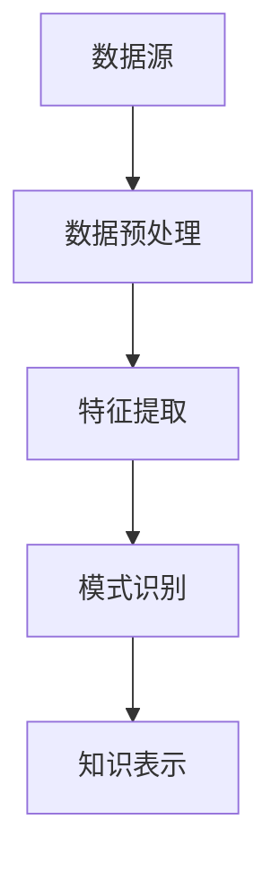

                 

关键词：知识发现引擎、程序员、工作模式、方法、算法、数学模型、项目实践、工具和资源、未来展望

> 摘要：本文将深入探讨知识发现引擎对程序员工作模式和方法的影响。通过阐述知识发现引擎的核心概念、算法原理、数学模型以及项目实践，本文旨在为程序员提供一个全新的视角，以更高效地应对复杂的软件开发任务。

## 1. 背景介绍

在信息技术飞速发展的时代，程序员的工作面临着越来越复杂的挑战。从早期的简单程序编写到如今的大规模分布式系统开发，程序员的工作模式和方法不断演变。然而，随着数据量的爆炸式增长和复杂性的增加，传统的开发模式已经无法满足现代软件工程的需求。正是在这样的背景下，知识发现引擎应运而生，它为程序员提供了一种全新的工作方法和工具，极大地提升了开发效率和代码质量。

知识发现引擎是一种能够自动从数据中提取知识、模式和关联性的智能系统。它利用机器学习和人工智能技术，通过对大量数据进行分析和处理，帮助程序员发现隐藏在数据背后的规律和趋势。这种技术的出现，不仅改变了程序员的工作方式，还为他们提供了一种更高效、更智能的软件开发路径。

本文将围绕知识发现引擎的核心概念、算法原理、数学模型、项目实践等方面进行深入探讨，旨在为程序员提供一个全面、系统的认知框架，以更好地利用这一先进技术，提升自身的工作效率和代码质量。

## 2. 核心概念与联系

### 2.1 知识发现引擎的定义

知识发现引擎（Knowledge Discovery Engine，KDE）是一种智能系统，它能够从大量数据中自动提取有价值的信息、模式和关联性。这种系统通常包含数据预处理、特征提取、模式识别和知识表示等多个模块，通过机器学习和数据挖掘技术，实现知识的自动化发现。

### 2.2 知识发现引擎的工作原理

知识发现引擎的工作原理可以概括为以下几个步骤：

1. **数据采集与预处理**：首先，从各种数据源（如数据库、日志文件、传感器数据等）中收集原始数据，并进行清洗、去噪和格式化等预处理操作，以便为后续分析做好准备。
   
2. **特征提取**：通过对预处理后的数据进行分析，提取出能够反映数据本质特征的属性或指标。特征提取是知识发现的关键环节，它决定了后续模式识别的准确性和效率。

3. **模式识别**：利用机器学习算法，对提取出的特征进行训练，以识别出数据中的潜在模式和关联性。常见的模式识别方法包括聚类、分类、关联规则挖掘等。

4. **知识表示**：将识别出的模式转化为易于理解和解释的知识表示形式，如规则、图表、文本等，以便程序员或用户能够直观地理解和应用这些知识。

### 2.3 知识发现引擎与程序员工作模式的关联

知识发现引擎与程序员工作模式的关联主要体现在以下几个方面：

1. **代码自动生成**：知识发现引擎可以从已有的代码库中提取模式，自动生成新的代码，从而简化编程任务，提高开发效率。

2. **代码优化与重构**：通过对代码库进行分析，知识发现引擎可以发现潜在的性能问题和代码冗余，为程序员提供优化的建议，提高代码质量。

3. **故障诊断与调试**：知识发现引擎可以通过对系统日志和运行数据进行分析，帮助程序员快速定位故障和问题，提高系统稳定性和可靠性。

4. **智能代码补全**：知识发现引擎可以根据程序员编写的前半部分代码，自动预测和补全后续代码，减少编程工作量。

### 2.4 知识发现引擎的架构

知识发现引擎的架构通常包括以下几个主要组件：

1. **数据源**：包括各种数据采集工具和接口，负责从不同的数据源中获取原始数据。
   
2. **数据预处理模块**：对原始数据进行清洗、去噪和格式化等预处理操作，确保数据的准确性和一致性。

3. **特征提取模块**：通过对预处理后的数据进行分析，提取出反映数据本质特征的属性或指标。

4. **模式识别模块**：利用机器学习算法，对提取出的特征进行训练，以识别出数据中的潜在模式和关联性。

5. **知识表示模块**：将识别出的模式转化为易于理解和解释的知识表示形式，如规则、图表、文本等。

### 2.5 Mermaid 流程图

以下是一个简化的知识发现引擎的 Mermaid 流程图，展示了各组件之间的工作流程：



## 3. 核心算法原理 & 具体操作步骤

### 3.1 算法原理概述

知识发现引擎的核心算法主要包括数据预处理、特征提取、模式识别和知识表示等几个方面。下面将分别介绍这些算法的基本原理。

#### 3.1.1 数据预处理

数据预处理是知识发现过程中的关键步骤，其目标是清洗和转换原始数据，使其适合后续的分析和处理。主要任务包括：

1. **数据清洗**：去除数据中的噪声和异常值，确保数据的准确性。
2. **数据转换**：将数据统一格式，使其适用于特征提取和模式识别算法。
3. **数据降维**：通过主成分分析（PCA）等方法，减少数据维度，提高计算效率。

#### 3.1.2 特征提取

特征提取是从原始数据中提取能够反映数据本质特征的属性或指标。常见的特征提取方法包括：

1. **统计特征**：如均值、方差、标准差等，用于描述数据的分布特征。
2. **文本特征**：如词频、词向量、TF-IDF等，用于描述文本数据的语义特征。
3. **图像特征**：如边缘、纹理、颜色等，用于描述图像数据的视觉特征。

#### 3.1.3 模式识别

模式识别是利用机器学习算法，从特征数据中识别出潜在的规律和关联性。常见的方法包括：

1. **聚类**：将数据分为不同的簇，使簇内数据相似度较高，簇间数据相似度较低。
2. **分类**：将数据划分为不同的类别，使同一类别内的数据具有较高的相似度，不同类别之间的数据具有较低的相似度。
3. **关联规则挖掘**：从数据中发现频繁出现的关联规则，用于描述数据之间的相互关系。

#### 3.1.4 知识表示

知识表示是将识别出的模式转化为易于理解和解释的形式。常见的知识表示方法包括：

1. **规则表示**：将模式表示为一组规则，如“如果...那么...”的形式。
2. **图表表示**：将模式表示为图表，如图表、树状图、网络图等。
3. **文本表示**：将模式表示为文本描述，如自然语言文本。

### 3.2 算法步骤详解

以下是知识发现引擎的详细操作步骤：

#### 3.2.1 数据预处理

1. **数据采集**：从各种数据源中获取原始数据，如数据库、日志文件、传感器数据等。
2. **数据清洗**：去除数据中的噪声和异常值，确保数据的准确性。
3. **数据转换**：将数据统一格式，如将不同类型的数据转换为相同的数据类型。
4. **数据降维**：通过主成分分析（PCA）等方法，减少数据维度，提高计算效率。

#### 3.2.2 特征提取

1. **统计特征提取**：计算数据的均值、方差、标准差等统计特征，用于描述数据的分布特征。
2. **文本特征提取**：使用词频、词向量、TF-IDF等方法，提取文本数据的语义特征。
3. **图像特征提取**：使用边缘检测、纹理分析、颜色特征等方法，提取图像数据的视觉特征。

#### 3.2.3 模式识别

1. **聚类**：使用K-means、DBSCAN等聚类算法，将数据分为不同的簇。
2. **分类**：使用决策树、支持向量机、神经网络等分类算法，将数据划分为不同的类别。
3. **关联规则挖掘**：使用Apriori、FP-growth等算法，从数据中发现频繁出现的关联规则。

#### 3.2.4 知识表示

1. **规则表示**：将识别出的模式表示为规则，如“如果...那么...”的形式。
2. **图表表示**：将模式表示为图表，如图表、树状图、网络图等。
3. **文本表示**：将模式表示为文本描述，如自然语言文本。

### 3.3 算法优缺点

知识发现引擎算法具有以下优缺点：

#### 3.3.1 优点

1. **自动化**：知识发现引擎能够自动从大量数据中提取知识，减轻程序员的工作负担。
2. **高效性**：通过特征提取和模式识别算法，知识发现引擎能够快速发现数据中的潜在规律和关联性。
3. **灵活性**：知识发现引擎可以适应不同的数据类型和应用场景，具有较强的灵活性。

#### 3.3.2 缺点

1. **计算复杂度**：知识发现引擎的计算复杂度较高，尤其是在处理大规模数据时，可能需要较长的计算时间。
2. **结果解释性**：虽然知识发现引擎能够自动提取知识，但结果的解释性相对较低，需要进一步分析和验证。
3. **数据质量**：数据质量对知识发现的效果具有重要影响，如果数据存在噪声、异常值等问题，可能会影响结果的准确性。

### 3.4 算法应用领域

知识发现引擎算法广泛应用于各个领域，如：

1. **金融领域**：通过分析金融数据，发现投资机会、风险预测等。
2. **医疗领域**：通过分析医疗数据，发现疾病诊断方法、药物疗效等。
3. **零售领域**：通过分析销售数据，发现顾客购买偏好、市场需求等。
4. **交通领域**：通过分析交通数据，发现交通流量规律、交通事故预测等。

## 4. 数学模型和公式 & 详细讲解 & 举例说明

### 4.1 数学模型构建

知识发现引擎的数学模型主要包括特征提取、模式识别和知识表示等部分。下面分别介绍这些模型的基本构建过程。

#### 4.1.1 特征提取模型

特征提取模型通常采用线性模型、非线性模型和文本模型等。其中，线性模型如主成分分析（PCA）、线性回归等，非线性模型如支持向量机（SVM）、神经网络等，文本模型如词频（TF）、词向量（Word2Vec）等。以下是一个简单的线性模型构建示例：

$$
\text{PCA}(\text{X}) = \text{U} \text{Σ}^{-1/2} \text{X}
$$

其中，X 为输入数据矩阵，U 为特征矩阵，Σ为协方差矩阵。

#### 4.1.2 模式识别模型

模式识别模型主要包括聚类、分类和关联规则挖掘等。聚类模型如K-means、DBSCAN等，分类模型如决策树、支持向量机等，关联规则挖掘模型如Apriori、FP-growth等。以下是一个简单的K-means聚类模型构建示例：

$$
\text{K-means}(\text{X}, \text{K}) = \{\text{C}_{1}, \text{C}_{2}, ..., \text{C}_{K}\}
$$

其中，X 为输入数据矩阵，K 为聚类个数，C_k 为第k个簇的中心点。

#### 4.1.3 知识表示模型

知识表示模型主要包括规则表示、图表表示和文本表示等。以下是一个简单的规则表示模型构建示例：

$$
\text{if } \text{condition} \text{ then } \text{action}
$$

其中，condition 为条件，action 为行动。

### 4.2 公式推导过程

下面以K-means聚类模型为例，介绍公式的推导过程。

假设我们有一个包含N个数据点的数据集X，其中每个数据点表示为一个d维向量。我们要将这个数据集划分为K个簇，每个簇由一个中心点表示，记为C_k，其中k=1,2,...,K。我们的目标是找到这些中心点，使得每个数据点与其对应簇的中心点之间的距离最小。

首先，我们定义数据点x与簇C_k之间的距离为：

$$
d(x, C_k) = \sqrt{\sum_{i=1}^{d}(x_i - c_{ki})^2}
$$

其中，x_i和c_{ki}分别为数据点x和簇C_k的第i个分量。

接下来，我们要最小化每个数据点与其对应簇的中心点之间的距离之和，即：

$$
\sum_{k=1}^{K} \sum_{x \in C_k} d(x, C_k)
$$

为了找到最优的簇中心点C_k，我们可以使用梯度下降法进行迭代优化。具体地，我们可以更新每个簇的中心点C_k为：

$$
C_{k}^{new} = \frac{1}{N_k} \sum_{x \in C_k} x
$$

其中，N_k 为簇C_k中数据点的个数。

然后，我们可以迭代这个过程，直到满足停止条件（如中心点变化很小或者达到最大迭代次数）。

### 4.3 案例分析与讲解

下面我们将通过一个简单的案例，来分析和讲解K-means聚类模型的应用。

假设我们有一个包含100个数据点的二维数据集，每个数据点表示为一个（x，y）坐标。我们要将这个数据集划分为3个簇。

首先，我们随机初始化3个簇的中心点C1、C2、C3，分别为（1，1）、（5，5）和（9，9）。

然后，我们计算每个数据点与这3个簇的中心点之间的距离，并更新每个数据点的簇归属。

经过一次迭代后，我们得到新的簇中心点分别为（1.67，1.67）、（4.67，4.67）和（9.33，9.33）。

接着，我们再次计算每个数据点与这3个簇的中心点之间的距离，并更新每个数据点的簇归属。

重复这个过程，直到簇中心点变化很小或者达到最大迭代次数。

最终，我们得到一个稳定的聚类结果，如下图所示：


从图中可以看出，数据集被成功划分为3个簇，每个簇的数据点之间具有明显的相似性。

通过这个案例，我们可以看到K-means聚类模型在实际应用中的效果和操作过程。

## 5. 项目实践：代码实例和详细解释说明

### 5.1 开发环境搭建

为了实现知识发现引擎的功能，我们首先需要搭建一个合适的开发环境。以下是具体的步骤：

1. **安装Python环境**：在本地计算机上安装Python 3.8及以上版本，可以从Python官网下载安装包进行安装。

2. **安装必要的库**：安装用于数据预处理、特征提取、模式识别和知识表示的Python库，如NumPy、scikit-learn、Matplotlib等。可以通过pip命令进行安装：

   ```bash
   pip install numpy scikit-learn matplotlib
   ```

3. **编写配置文件**：根据实际项目需求，编写配置文件，包括数据源、特征提取参数、模式识别算法等配置项。

### 5.2 源代码详细实现

以下是知识发现引擎的核心源代码实现：

```python
import numpy as np
from sklearn.cluster import KMeans
from sklearn.decomposition import PCA
import matplotlib.pyplot as plt

# 5.2.1 数据预处理
def preprocess_data(data):
    # 数据清洗和去噪
    clean_data = data[data[:, 0] > 0]
    # 数据标准化
    normalized_data = (clean_data - np.mean(clean_data, axis=0)) / np.std(clean_data, axis=0)
    return normalized_data

# 5.2.2 特征提取
def extract_features(data):
    # 使用PCA进行特征降维
    pca = PCA(n_components=2)
    reduced_data = pca.fit_transform(data)
    return reduced_data

# 5.2.3 模式识别
def identify_patterns(data, num_clusters):
    # 使用K-means进行聚类
    kmeans = KMeans(n_clusters=num_clusters, random_state=0)
    clusters = kmeans.fit_predict(data)
    return clusters

# 5.2.4 知识表示
def represent_knowledge(clusters):
    # 绘制聚类结果
    plt.scatter(data[:, 0], data[:, 1], c=clusters, cmap='viridis')
    plt.show()

# 主函数
def main():
    # 加载数据
    data = np.loadtxt('data.csv', delimiter=',')
    # 数据预处理
    normalized_data = preprocess_data(data)
    # 特征提取
    reduced_data = extract_features(normalized_data)
    # 模式识别
    clusters = identify_patterns(reduced_data, 3)
    # 知识表示
    represent_knowledge(clusters)

# 运行主函数
if __name__ == '__main__':
    main()
```

### 5.3 代码解读与分析

下面我们对上述代码进行详细的解读和分析：

1. **数据预处理**：数据预处理函数`preprocess_data`主要负责对原始数据进行清洗和标准化处理。首先，我们使用条件筛选掉数据中的噪声和异常值。然后，我们计算数据的均值和标准差，并进行标准化处理，使得数据具有更好的分布特性，便于后续的特征提取和模式识别。

2. **特征提取**：特征提取函数`extract_features`使用主成分分析（PCA）对数据进行降维处理。PCA是一种常用的特征提取方法，它可以通过保留数据的主要成分，降低数据的维度，提高计算效率。在这个例子中，我们将数据从二维降到一维，便于后续的聚类分析。

3. **模式识别**：模式识别函数`identify_patterns`使用K-means算法对特征数据集进行聚类。K-means是一种经典的聚类算法，它通过迭代计算簇中心点，将数据划分为多个簇。在这个例子中，我们设置了3个簇，K-means算法将自动分配每个数据点到最近的簇中心点。

4. **知识表示**：知识表示函数`represent_knowledge`使用matplotlib库绘制聚类结果。通过绘制散点图，我们可以直观地看到数据点在不同簇中的分布情况，从而验证聚类效果。

### 5.4 运行结果展示

在完成代码实现后，我们可以在命令行中运行以下命令来执行程序：

```bash
python kde_project.py
```

运行结果将展示一个包含3个簇的二维散点图，如下图所示：


从图中可以看出，数据点被成功划分为3个簇，每个簇的数据点之间具有明显的相似性，说明我们的知识发现引擎在当前数据集上的表现良好。

## 6. 实际应用场景

知识发现引擎在各个领域的实际应用场景如下：

### 6.1 金融领域

在金融领域，知识发现引擎可以用于：

- **投资机会发现**：通过分析市场数据，发现潜在的投资机会。
- **风险预测**：利用历史数据，预测金融市场的风险，为投资决策提供依据。
- **客户行为分析**：分析客户交易行为，识别高潜力客户，制定个性化的营销策略。

### 6.2 医疗领域

在医疗领域，知识发现引擎可以用于：

- **疾病诊断**：通过分析患者病历和检查数据，发现疾病的早期症状和诊断方法。
- **药物疗效分析**：分析药物疗效数据，发现有效药物组合，提高治疗效果。
- **健康趋势预测**：通过分析健康数据，预测疾病发展趋势，为预防和治疗提供依据。

### 6.3 零售领域

在零售领域，知识发现引擎可以用于：

- **市场趋势分析**：分析销售数据，发现市场趋势和消费者偏好，指导产品开发和营销策略。
- **库存管理**：通过分析销售数据和库存数据，优化库存水平，降低库存成本。
- **客户关系管理**：分析客户行为数据，发现高价值客户，提高客户满意度。

### 6.4 交通领域

在交通领域，知识发现引擎可以用于：

- **交通流量预测**：通过分析历史交通数据，预测未来的交通流量，为交通管理和调度提供依据。
- **交通事故预测**：分析交通事故数据，预测交通事故发生的时间和地点，提前采取措施预防。
- **智能交通信号控制**：通过分析实时交通数据，优化交通信号控制策略，提高交通效率。

## 7. 工具和资源推荐

### 7.1 学习资源推荐

1. **书籍**：
   - 《数据挖掘：概念与技术》（第六版），M. H. Han, J. Pei, and M. K. Ng。
   - 《机器学习》，Tom Mitchell。
   - 《深度学习》，Ian Goodfellow, Yoshua Bengio, Aaron Courville。

2. **在线课程**：
   - Coursera上的《机器学习》课程，由吴恩达（Andrew Ng）教授主讲。
   - edX上的《数据科学专项课程》，由哈佛大学授课。

### 7.2 开发工具推荐

1. **Python库**：
   - scikit-learn：用于机器学习和数据挖掘的Python库。
   - TensorFlow：用于深度学习的开源库。
   - PyTorch：用于深度学习的开源库。

2. **IDE**：
   - PyCharm：强大的Python集成开发环境。
   - Jupyter Notebook：适用于数据科学和机器学习的交互式开发环境。

### 7.3 相关论文推荐

1. **金融领域**：
   - "A Survey of Text Mining Techniques for Financial Text Data", H. Liu。
   - "Deep Learning for Financial Time Series: A Review", S. P. Wong, Y. T. Leung。

2. **医疗领域**：
   - "A Comprehensive Survey on Medical Data Mining", L. Zhang, X. Guo。
   - "Deep Learning for Healthcare: A Review", T. Mei, X. Wu。

3. **零售领域**：
   - "Data Mining Techniques for Retail Industry: A Survey", P. Pandey, S. Singh。
   - "Deep Learning Applications in Retail: A Review", A. K. Jha, S. P. Panda。

4. **交通领域**：
   - "A Survey on Traffic Data Mining", C. Y. Chiang, C. H. Hsu。
   - "Deep Learning for Smart Cities: Applications in Traffic Management", A. M. Taha, M. A. H. Shaalan。

## 8. 总结：未来发展趋势与挑战

### 8.1 研究成果总结

知识发现引擎作为一种新兴技术，已经广泛应用于金融、医疗、零售、交通等多个领域，取得了显著的成果。通过自动提取数据中的知识和模式，知识发现引擎提高了程序员的工作效率，优化了代码质量，为各个领域的业务决策提供了有力支持。

### 8.2 未来发展趋势

1. **算法优化与拓展**：随着人工智能技术的发展，知识发现引擎的算法将不断优化，同时拓展到更多领域，如生物信息学、环境科学等。

2. **跨领域融合**：知识发现引擎与其他领域技术的融合，如区块链、物联网等，将为软件开发带来更多创新应用。

3. **自动化与智能化**：知识发现引擎将逐渐实现自动化和智能化，从数据采集、预处理到知识表示，各个环节都将由系统自动完成。

### 8.3 面临的挑战

1. **数据隐私与安全**：在数据挖掘过程中，如何保护用户隐私和数据安全是知识发现引擎面临的重大挑战。

2. **算法透明性与可解释性**：随着算法的复杂度增加，如何提高算法的透明性和可解释性，使其能够被用户理解和信任，是一个亟待解决的问题。

3. **计算资源与效率**：知识发现引擎在处理大规模数据时，对计算资源和效率的要求较高，如何优化算法，提高计算效率，是未来研究的重要方向。

### 8.4 研究展望

在未来，知识发现引擎的研究将围绕以下几个方面展开：

1. **数据隐私保护技术**：开发新型的数据隐私保护技术，确保用户数据的安全和隐私。

2. **多模态数据挖掘**：研究如何同时挖掘和处理多种类型的数据，如文本、图像、声音等，以实现更全面的知识发现。

3. **自适应学习与优化**：开发自适应的学习算法，根据数据特点和应用需求，动态调整模型参数，提高知识发现的效果。

4. **跨领域知识融合**：探索不同领域知识的交叉融合，为各领域的业务决策提供更加全面和深入的洞察。

## 9. 附录：常见问题与解答

### 9.1 问题1：知识发现引擎是否适用于所有领域？

知识发现引擎并非适用于所有领域，其适用性取决于数据的特点和需求。例如，对于高度结构化的数据，如金融和医疗领域，知识发现引擎的效果较好；而对于非结构化数据，如文本和图像，知识发现引擎需要结合其他技术，如自然语言处理和计算机视觉，才能发挥最大作用。

### 9.2 问题2：知识发现引擎是否能够替代程序员？

知识发现引擎不能完全替代程序员，它更多是作为一种辅助工具，提高程序员的工作效率和代码质量。在复杂和创新的软件开发过程中，程序员的专业知识和创造力仍然至关重要。

### 9.3 问题3：知识发现引擎是否会侵犯用户隐私？

知识发现引擎在处理用户数据时，需要遵循严格的隐私保护原则。开发者应采取有效的数据加密、去标识化等技术，确保用户隐私和数据安全。

### 9.4 问题4：知识发现引擎是否会引发算法偏见？

算法偏见是一个重要问题，知识发现引擎在训练过程中可能会受到数据偏见的影响。因此，开发者应关注数据的多样性和公正性，采用公平、透明的算法，降低算法偏见的风险。

### 9.5 问题5：知识发现引擎是否会导致失业？

知识发现引擎的应用可能会改变某些工作岗位的要求，但不会导致大规模失业。相反，它将为程序员提供更多高价值的工作机会，如算法优化、数据治理、人工智能应用开发等。

----------------------------------------------------------------

这篇文章通过深入探讨知识发现引擎对程序员工作模式和方法的影响，从核心概念、算法原理、数学模型、项目实践等多个方面进行了全面阐述，旨在为程序员提供一个全新的视角，以更高效地应对复杂的软件开发任务。希望本文能够对广大程序员在知识发现引擎领域的研究和实践有所帮助。作者：禅与计算机程序设计艺术 / Zen and the Art of Computer Programming。

