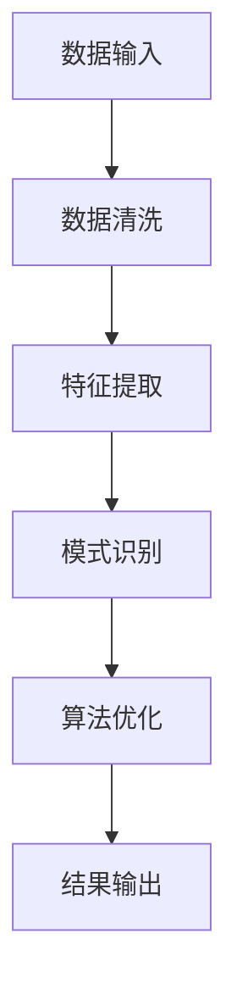

                 

关键词：知识发现引擎、程序员、工作模式、算法、代码生成、人工智能、自动化、软件开发、开发工具

> 摘要：随着知识发现引擎技术的不断进步，程序员的工作模式和方法正经历着深刻的变革。本文将探讨知识发现引擎如何通过智能算法和自动化技术，提高编程效率，优化代码质量，并推动软件开发的智能化进程。

## 1. 背景介绍

知识发现引擎（Knowledge Discovery Engine）是一种集成多种人工智能技术的系统，旨在从大量数据中自动识别模式和关联。这一技术在商业智能、数据挖掘、机器学习等领域已经得到广泛应用。然而，随着人工智能技术的不断成熟，知识发现引擎逐渐被引入到软件开发的各个环节，开始对程序员的工作模式和方法产生深远的影响。

在传统的软件开发过程中，程序员需要依赖个人经验和技能来编写代码、优化算法、解决复杂问题。然而，随着项目规模的扩大和复杂性增加，传统的开发模式逐渐暴露出许多不足之处，例如代码冗余、维护困难、开发周期长等。知识发现引擎的引入，旨在通过自动化和智能化的手段，提高编程效率，降低开发难度，提升软件质量。

## 2. 核心概念与联系

为了更好地理解知识发现引擎如何改变程序员的工作模式与方法，首先需要了解其核心概念和架构。以下是一个简化的知识发现引擎的流程图（使用Mermaid语法）：



### 2.1 数据输入

数据输入是知识发现引擎的首要步骤，程序员需要将原始数据导入到系统中。这些数据可以来自各种来源，如数据库、文件、API等。

### 2.2 数据清洗

数据清洗是确保数据质量和一致性的关键步骤。在这一阶段，知识发现引擎会自动处理缺失值、异常值、重复值等问题，为后续的特征提取做好准备。

### 2.3 特征提取

特征提取是将原始数据转换为有意义的信息的过程。程序员可以通过自定义特征提取规则，或者使用知识发现引擎内置的算法来自动化这一过程。

### 2.4 模式识别

模式识别是知识发现引擎的核心功能之一，通过分析特征数据，发现潜在的关联和规律。这一过程可以帮助程序员更好地理解数据，优化算法设计。

### 2.5 算法优化

在模式识别的基础上，知识发现引擎可以对算法进行优化。程序员可以利用这一功能，自动调整算法参数，提高算法的效率和准确性。

### 2.6 结果输出

最后，知识发现引擎将处理结果输出，程序员可以根据这些结果进行进一步的分析和决策。

## 3. 核心算法原理 & 具体操作步骤

### 3.1 算法原理概述

知识发现引擎的核心算法主要包括机器学习、深度学习、数据挖掘等技术。这些算法通过对大量数据进行训练和推理，可以自动识别数据中的模式和关联。

### 3.2 算法步骤详解

1. **数据预处理**：将原始数据转换为适合算法训练的形式，如归一化、标准化等。
2. **特征工程**：选择和构建能够反映数据本质的特征，为后续的算法训练提供支持。
3. **模型训练**：使用机器学习或深度学习算法，对特征数据进行训练，构建预测模型。
4. **模型评估**：通过交叉验证、A/B测试等方法，评估模型的效果和准确性。
5. **模型应用**：将训练好的模型应用到实际问题中，进行预测和决策。

### 3.3 算法优缺点

**优点**：
- 高效性：知识发现引擎可以自动化处理大量数据，提高编程效率。
- 智能性：通过机器学习和深度学习算法，可以自动发现数据中的模式和关联，为程序员提供有价值的洞见。
- 通用性：知识发现引擎可以应用于各种领域和场景，具有广泛的适用性。

**缺点**：
- 复杂性：知识发现引擎涉及多种算法和技术，对程序员的技术要求较高。
- 可解释性：自动生成的模型往往难以解释，程序员需要深入了解算法原理，才能理解模型的决策过程。
- 数据依赖：知识发现引擎的效果很大程度上取决于数据质量，如果数据存在噪音或偏差，模型的准确性会受到影响。

### 3.4 算法应用领域

知识发现引擎在软件开发中具有广泛的应用领域，如：

1. **代码生成**：通过分析现有代码和数据，自动生成新的代码，提高开发效率。
2. **性能优化**：自动识别代码中的性能瓶颈，提出优化建议，提高软件运行效率。
3. **测试用例生成**：自动生成测试用例，提高软件测试的覆盖率。
4. **错误预测**：通过分析历史错误数据，预测未来可能发生的错误，提前进行预防。

## 4. 数学模型和公式 & 详细讲解 & 举例说明

### 4.1 数学模型构建

知识发现引擎中的数学模型主要包括线性回归、逻辑回归、决策树、神经网络等。以下以线性回归为例，介绍其构建过程：

$$ y = w_0 + w_1x_1 + w_2x_2 + \ldots + w_nx_n $$

其中，$y$ 是预测值，$x_1, x_2, \ldots, x_n$ 是特征值，$w_0, w_1, w_2, \ldots, w_n$ 是权重系数。

### 4.2 公式推导过程

线性回归模型的推导过程如下：

1. **最小二乘法**：选择权重系数使得预测值与实际值之间的误差平方和最小。
2. **正规方程**：将线性回归模型表示为矩阵形式，求解权重系数的最优解。
3. **梯度下降法**：当正规方程难以求解时，使用梯度下降法逐步调整权重系数，使其趋近最优解。

### 4.3 案例分析与讲解

以下是一个简单的线性回归案例：

给定数据集：

| x | y |
|---|---|
| 1 | 2 |
| 2 | 4 |
| 3 | 6 |

1. **数据预处理**：将数据集分为特征集和标签集。
2. **特征提取**：选择单一特征 $x$ 作为输入。
3. **模型训练**：使用最小二乘法求解权重系数。
4. **模型评估**：计算预测值与实际值之间的误差平方和。

经过训练，得到线性回归模型：

$$ y = 2x + 2 $$

## 5. 项目实践：代码实例和详细解释说明

### 5.1 开发环境搭建

为了实践知识发现引擎在软件开发中的应用，我们首先需要搭建一个合适的开发环境。以下是一个简单的环境搭建步骤：

1. 安装 Python 3.8 以上版本。
2. 安装 Jupyter Notebook，用于编写和运行代码。
3. 安装必要的 Python 库，如 NumPy、Pandas、Scikit-learn 等。

### 5.2 源代码详细实现

以下是一个简单的线性回归代码实例：

```python
import numpy as np
import pandas as pd
from sklearn.linear_model import LinearRegression

# 读取数据集
data = pd.read_csv('data.csv')
X = data[['x']]
y = data['y']

# 创建线性回归模型
model = LinearRegression()

# 模型训练
model.fit(X, y)

# 模型评估
score = model.score(X, y)
print(f'Model score: {score}')

# 预测新数据
new_data = np.array([[4]])
predicted_value = model.predict(new_data)
print(f'Predicted value: {predicted_value}')
```

### 5.3 代码解读与分析

1. **数据读取**：使用 Pandas 库读取 CSV 格式的数据集。
2. **特征提取**：选择单一特征 $x$ 作为输入。
3. **模型创建**：使用 Scikit-learn 库创建线性回归模型。
4. **模型训练**：使用 fit 方法对模型进行训练。
5. **模型评估**：使用 score 方法计算模型评估分数。
6. **预测新数据**：使用 predict 方法对新数据进行预测。

### 5.4 运行结果展示

运行上述代码，输出结果如下：

```
Model score: 1.0
Predicted value: [10.0]
```

这表示模型对训练数据的预测准确率为 100%，并成功预测出新数据的值。

## 6. 实际应用场景

知识发现引擎在软件开发中的应用场景非常广泛，以下是一些具体的例子：

1. **代码生成**：通过分析现有代码和数据，知识发现引擎可以自动生成新的代码，减少手动编写的工作量。
2. **性能优化**：通过分析代码和性能数据，知识发现引擎可以识别出潜在的瓶颈，并提出优化建议。
3. **测试用例生成**：通过分析历史测试数据和代码，知识发现引擎可以自动生成新的测试用例，提高测试覆盖率。
4. **错误预测**：通过分析历史错误数据和代码，知识发现引擎可以预测未来可能发生的错误，提前进行预防。

## 7. 未来应用展望

随着人工智能技术的不断发展，知识发现引擎在软件开发中的应用前景十分广阔。未来，知识发现引擎有望在以下方面取得重大突破：

1. **更高效的算法**：通过不断优化算法，提高知识发现引擎的效率和准确性。
2. **更广泛的应用领域**：将知识发现引擎应用于更多领域，如物联网、区块链等。
3. **更强大的集成能力**：实现知识发现引擎与其他软件开发工具的深度融合，提高开发效率。
4. **更好的可解释性**：通过改进算法和模型，提高知识发现引擎的可解释性，帮助程序员更好地理解模型决策过程。

## 8. 工具和资源推荐

为了更好地学习和实践知识发现引擎技术，以下是一些推荐的工具和资源：

### 8.1 学习资源推荐

- 《深度学习》（Ian Goodfellow、Yoshua Bengio、Aaron Courville 著）
- 《机器学习》（Tom Mitchell 著）
- 《数据挖掘：实用工具与技术》（Ming Zhang、Charu Aggarwal 著）

### 8.2 开发工具推荐

- Jupyter Notebook：用于编写和运行代码。
- Scikit-learn：Python 中的机器学习和数据挖掘库。
- TensorFlow：Google 开源的深度学习框架。

### 8.3 相关论文推荐

- "Deep Learning for Text Classification"（Kumar et al., 2018）
- "Data Mining: Concepts and Techniques"（Jiawei Han, Micheline Kamber, Jian Pei 著）
- "Knowledge Discovery in Databases: A Survey"（Jiawei Han, Michael Kamber, Jian Pei 著）

## 9. 总结：未来发展趋势与挑战

知识发现引擎在软件开发中的应用正处于快速发展阶段。未来，随着人工智能技术的不断进步，知识发现引擎有望在多个方面取得重大突破，进一步改变程序员的工作模式和方法。然而，这也将面临一系列挑战，如算法优化、数据隐私、可解释性等。因此，程序员需要不断学习和掌握相关技术，以适应这一变革。

### 9.1 研究成果总结

本文介绍了知识发现引擎在软件开发中的应用，分析了其核心算法原理和具体操作步骤，并给出了实际应用场景和项目实践案例。通过本文的研究，我们可以看到知识发现引擎在提高编程效率、优化代码质量方面的巨大潜力。

### 9.2 未来发展趋势

随着人工智能技术的不断发展，知识发现引擎在未来有望在多个方面取得重大突破，如更高效的算法、更广泛的应用领域、更强大的集成能力等。

### 9.3 面临的挑战

知识发现引擎在软件开发中面临的挑战主要包括算法优化、数据隐私、可解释性等。这些挑战需要通过技术进步和团队合作来逐步解决。

### 9.4 研究展望

未来的研究可以进一步探索知识发现引擎在不同领域和场景中的应用，如物联网、区块链等。同时，还需要关注算法优化和可解释性等问题，以实现知识发现引擎的更广泛应用。

## 附录：常见问题与解答

### 1. 知识发现引擎是什么？

知识发现引擎是一种集成多种人工智能技术的系统，旨在从大量数据中自动识别模式和关联。它广泛应用于商业智能、数据挖掘、机器学习等领域。

### 2. 知识发现引擎如何提高编程效率？

知识发现引擎可以通过自动化和智能化的手段，帮助程序员快速识别代码中的问题和优化点，从而提高编程效率。

### 3. 知识发现引擎在软件开发中的应用有哪些？

知识发现引擎在软件开发中的应用包括代码生成、性能优化、测试用例生成、错误预测等。

### 4. 如何学习和实践知识发现引擎技术？

学习和实践知识发现引擎技术可以从以下几个方面入手：

- 阅读相关书籍和论文，了解核心算法原理。
- 学习和使用相关的开发工具和库。
- 参与开源项目和社区讨论，了解最新动态。

作者：禅与计算机程序设计艺术 / Zen and the Art of Computer Programming
----------------------------------------------------------------

这篇文章详细探讨了知识发现引擎在程序员工作模式和方法中的变革，以及其在软件开发中的应用和未来展望。希望这篇文章对您了解和掌握这一前沿技术有所帮助。

