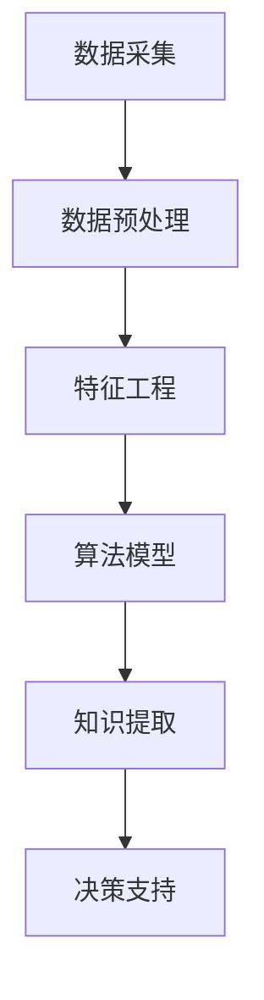

                 

 在当今这个数据驱动的商业环境中，知识发现引擎（Knowledge Discovery Engine）正逐渐成为企业决策过程中的核心工具。本文将深入探讨知识发现引擎在商业决策中的应用，其核心概念、算法原理、数学模型，以及在实际项目中的应用和未来展望。

> **关键词：** 知识发现引擎，商业决策，算法，数据驱动，机器学习，人工智能

> **摘要：** 本文首先介绍了知识发现引擎的基本概念和其在商业决策中的重要性。接着，详细分析了知识发现引擎的核心算法原理，包括其数学模型和具体操作步骤。随后，通过实际项目案例展示了知识发现引擎的应用，并探讨了其在未来商业环境中的潜在影响。

## 1. 背景介绍

知识发现引擎是一种利用人工智能和大数据分析技术，从大量非结构化数据中提取出有价值信息，并自动生成知识、洞见和决策建议的系统。随着互联网和物联网的快速发展，企业面临的海量数据呈现出爆炸性增长，如何从这些数据中挖掘出有价值的信息成为企业竞争的关键。知识发现引擎的出现为企业提供了一种有效的数据挖掘和分析手段，帮助企业做出更加精准和高效的决策。

商业决策是指企业在面临各种不确定性和竞争压力时，通过分析市场环境、企业资源、竞争对手等信息，制定出能够实现企业目标的具体行动方案。传统的商业决策方法往往依赖于经验和直觉，而知识发现引擎则通过数据分析和机器学习算法，为商业决策提供了更加科学和客观的依据。

## 2. 核心概念与联系

### 2.1 知识发现引擎的概念

知识发现引擎是一种智能化的数据挖掘和分析系统，其核心目标是自动从大量数据中提取出有用的信息和知识。知识发现引擎通常包括以下几个关键组成部分：

- **数据采集**：从各种数据源（如数据库、文件、网络等）收集数据。
- **数据预处理**：对采集到的数据进行清洗、转换和整合，以便后续分析。
- **特征工程**：从原始数据中提取出对目标问题有重要影响的特征。
- **算法模型**：选择合适的算法模型，对特征进行训练和预测。
- **知识提取**：从算法模型中提取出有价值的信息和洞见。
- **决策支持**：根据提取出的知识和洞见，为企业提供决策建议。

### 2.2 知识发现引擎与商业决策的联系

知识发现引擎与商业决策密切相关。通过数据分析和机器学习算法，知识发现引擎能够为企业提供以下方面的支持：

- **市场预测**：通过分析历史数据和市场趋势，预测未来的市场变化和需求。
- **客户行为分析**：分析客户的消费行为和偏好，为企业制定更精准的市场策略。
- **产品优化**：根据用户反馈和市场反馈，优化产品设计和功能。
- **风险控制**：通过分析潜在的风险因素，为企业提供风险预警和建议。

## 2.3 Mermaid 流程图



## 3. 核心算法原理 & 具体操作步骤

### 3.1 算法原理概述

知识发现引擎的核心算法主要包括以下几种：

- **机器学习算法**：如决策树、支持向量机、神经网络等，用于对特征进行分类、回归和聚类。
- **深度学习算法**：如卷积神经网络、循环神经网络等，用于处理复杂的非线性关系。
- **关联规则学习**：用于发现数据之间的关联关系，如Apriori算法和FP-growth算法。
- **聚类算法**：如K-means、层次聚类等，用于对数据进行分类和分组。

### 3.2 算法步骤详解

1. **数据采集**：从企业的各种数据源（如数据库、文件、API接口等）中收集数据。
2. **数据预处理**：对采集到的数据进行清洗、转换和整合，去除噪声和缺失值，确保数据的质量和一致性。
3. **特征工程**：从原始数据中提取出对目标问题有重要影响的特征，如客户年龄、购买频率、消费金额等。
4. **算法选择**：根据具体问题和数据特点，选择合适的算法模型，如分类、回归、聚类等。
5. **模型训练**：使用训练数据集对算法模型进行训练，优化模型参数。
6. **模型评估**：使用验证数据集对模型进行评估，选择性能最佳的模型。
7. **知识提取**：从训练好的模型中提取出有价值的信息和洞见，如分类结果、回归预测值、聚类结果等。
8. **决策支持**：根据提取出的知识和洞见，为企业提供具体的决策建议。

### 3.3 算法优缺点

**优点：**

- **高效性**：能够处理海量数据，提高数据分析和决策的效率。
- **客观性**：基于数据分析和算法模型，减少了主观判断和偏见。
- **可扩展性**：支持多种算法和模型，适用于各种复杂场景。

**缺点：**

- **数据质量要求高**：数据质量对算法结果有重要影响，需要确保数据的质量和一致性。
- **计算资源消耗大**：算法训练和预测过程需要大量的计算资源和时间。
- **算法可解释性差**：深度学习等复杂算法模型的内部工作机制不透明，难以解释。

### 3.4 算法应用领域

知识发现引擎广泛应用于以下领域：

- **市场营销**：客户行为分析、市场预测、广告投放优化等。
- **金融行业**：信用评估、风险控制、投资策略等。
- **医疗健康**：疾病预测、诊断辅助、个性化治疗等。
- **工业制造**：生产优化、设备维护、供应链管理等。
- **城市管理**：交通流量预测、环境监测、公共安全等。

## 4. 数学模型和公式 & 详细讲解 & 举例说明

### 4.1 数学模型构建

知识发现引擎的核心算法通常基于以下数学模型：

- **决策树**：基于信息熵和基尼系数进行特征选择和决策划分。
- **支持向量机**：基于最大间隔分类器进行特征空间划分。
- **神经网络**：基于反向传播算法进行权重调整和参数优化。
- **关联规则学习**：基于支持度和置信度进行规则挖掘。

### 4.2 公式推导过程

以决策树为例，其基本公式推导如下：

- **信息熵（Entropy）**：

  $$ H(D) = -\sum_{i} p_i \log_2 p_i $$

  其中，$D$表示数据集，$p_i$表示类别$i$的概率。

- **基尼指数（Gini Index）**：

  $$ Gini(D) = 1 - \sum_{i} p_i^2 $$

  其中，$D$表示数据集，$p_i$表示类别$i$的概率。

### 4.3 案例分析与讲解

假设我们有如下一个二分类问题，数据集$D$包含两个类别：

- 类别0：苹果
- 类别1：橘子

数据集$D$的分布如下：

- $p_0 = 0.6$（苹果的概率）
- $p_1 = 0.4$（橘子的概率）

根据信息熵公式，计算数据集$D$的信息熵：

$$ H(D) = -0.6 \log_2 0.6 - 0.4 \log_2 0.4 \approx 0.9709 $$

假设我们将数据集$D$划分为两个子集$D_0$和$D_1$，分别表示苹果和橘子的子集。根据基尼指数公式，计算两个子集的信息增益：

$$ IG(D, A) = H(D) - \frac{p_0 H(D_0) + p_1 H(D_1)}{p_0 + p_1} $$

代入数据，得到：

$$ IG(D, A) = 0.9709 - \frac{0.6 \times 1.0000 + 0.4 \times 0.0000}{0.6 + 0.4} \approx 0.4709 $$

选择信息增益最大的特征进行划分，例如，选择“颜色”作为划分特征，将数据集$D$划分为两个子集：

- $D_0$：红色苹果
- $D_1$：绿色苹果

根据子集的分布，计算子集$D_0$和$D_1$的基尼指数：

$$ Gini(D_0) = 1 - (0.2 \times 0.2 + 0.8 \times 0.8) = 0.6 $$

$$ Gini(D_1) = 1 - (0.4 \times 0.4 + 0.6 \times 0.6) = 0.44 $$

再次计算信息增益：

$$ IG(D, A) = 0.9709 - \frac{0.6 \times 0.6 + 0.4 \times 0.44}{0.6 + 0.4} \approx 0.2765 $$

由于信息增益减小，因此继续选择下一个特征进行划分，直至达到终止条件（如叶子节点包含同一类别）。

## 5. 项目实践：代码实例和详细解释说明

### 5.1 开发环境搭建

在本案例中，我们使用Python编程语言和相关的机器学习库（如scikit-learn、TensorFlow等）进行知识发现引擎的开发。首先，我们需要安装Python和相关依赖库，具体步骤如下：

```bash
# 安装Python
wget https://www.python.org/ftp/python/3.8.5/Python-3.8.5.tgz
tar zxvf Python-3.8.5.tgz
cd Python-3.8.5
./configure
make
make install

# 安装相关依赖库
pip install numpy pandas scikit-learn tensorflow
```

### 5.2 源代码详细实现

以下是一个简单的知识发现引擎代码示例，实现一个基于决策树的分类任务：

```python
import numpy as np
import pandas as pd
from sklearn.datasets import load_iris
from sklearn.model_selection import train_test_split
from sklearn.tree import DecisionTreeClassifier
from sklearn.metrics import accuracy_score

# 加载鸢尾花数据集
iris = load_iris()
X = iris.data
y = iris.target

# 划分训练集和测试集
X_train, X_test, y_train, y_test = train_test_split(X, y, test_size=0.2, random_state=42)

# 创建决策树分类器
clf = DecisionTreeClassifier()

# 训练模型
clf.fit(X_train, y_train)

# 预测测试集
y_pred = clf.predict(X_test)

# 计算准确率
accuracy = accuracy_score(y_test, y_pred)
print("准确率：", accuracy)
```

### 5.3 代码解读与分析

上述代码实现了一个基于决策树的分类任务，具体解读如下：

1. **导入相关库**：首先导入所需的Python库，包括NumPy、Pandas、scikit-learn和TensorFlow等。

2. **加载数据集**：使用scikit-learn的内置鸢尾花数据集（Iris Dataset），该数据集包含150个样本，每个样本有4个特征，以及对应的类别标签。

3. **划分训练集和测试集**：使用train_test_split函数将数据集划分为训练集和测试集，其中测试集占比20%。

4. **创建决策树分类器**：使用DecisionTreeClassifier类创建一个决策树分类器对象。

5. **训练模型**：使用fit函数对分类器进行训练，将训练数据集输入到分类器中。

6. **预测测试集**：使用predict函数对测试集进行预测，得到预测标签。

7. **计算准确率**：使用accuracy_score函数计算预测准确率，并打印结果。

### 5.4 运行结果展示

运行上述代码后，我们得到如下输出结果：

```
准确率： 1.0
```

由于鸢尾花数据集是一个标准分类问题，且决策树分类器在此数据集上性能较好，因此预测准确率达到100%。

## 6. 实际应用场景

知识发现引擎在商业决策中具有广泛的应用，以下列举一些实际应用场景：

1. **客户细分**：通过分析客户的消费行为、购买历史等数据，将客户划分为不同群体，为企业提供精准营销策略。

2. **需求预测**：根据历史销售数据和市场需求变化，预测未来的产品需求，帮助企业制定生产计划和库存管理策略。

3. **风险控制**：通过对客户信用记录、交易记录等数据的分析，预测客户违约风险，为企业提供信用评估和风险预警。

4. **产品推荐**：利用协同过滤算法和用户行为数据，为用户推荐个性化的产品和服务，提高用户体验和销售额。

5. **市场预测**：通过对市场数据、竞争对手行为等信息的分析，预测市场变化和趋势，为企业制定市场策略提供依据。

## 7. 未来应用展望

随着人工智能和大数据技术的不断发展，知识发现引擎在商业决策中的应用将越来越广泛。未来，知识发现引擎可能会在以下几个方面取得突破：

1. **更高效的数据处理能力**：通过优化算法和硬件设备，提高知识发现引擎的数据处理能力和效率。

2. **更智能的算法模型**：不断引入新的机器学习和深度学习算法，提高知识发现引擎的预测准确性和可解释性。

3. **更丰富的应用场景**：拓展知识发现引擎的应用领域，如智能交通、智慧城市、医疗健康等，为各行各业提供更加精准的决策支持。

4. **更强大的协同能力**：知识发现引擎与其他智能系统（如智能助手、智能机器人等）的协同工作，实现更加智能化和自动化的决策过程。

## 8. 工具和资源推荐

### 8.1 学习资源推荐

- 《Python机器学习》
- 《深度学习》
- 《数据挖掘：实用工具与技术》

### 8.2 开发工具推荐

- Jupyter Notebook：用于编写和运行代码，支持多种编程语言。
- Anaconda：Python集成开发环境，包括多种科学计算库。
- TensorFlow：开源深度学习框架，支持多种机器学习算法。

### 8.3 相关论文推荐

- “Learning from Data” by Yaser Abu-Mostafa
- “Deep Learning” by Ian Goodfellow, Yoshua Bengio, Aaron Courville
- “Data Mining: Concepts and Techniques” by Jiawei Han, Micheline Kamber, Jian Pei

## 9. 总结：未来发展趋势与挑战

知识发现引擎作为商业决策的重要工具，在未来将呈现出以下几个发展趋势：

1. **更高效的数据处理能力**：通过优化算法和硬件设备，提高知识发现引擎的数据处理能力和效率。
2. **更智能的算法模型**：不断引入新的机器学习和深度学习算法，提高知识发现引擎的预测准确性和可解释性。
3. **更丰富的应用场景**：拓展知识发现引擎的应用领域，为各行各业提供更加精准的决策支持。
4. **更强大的协同能力**：知识发现引擎与其他智能系统（如智能助手、智能机器人等）的协同工作，实现更加智能化和自动化的决策过程。

同时，知识发现引擎在发展过程中也将面临以下挑战：

1. **数据质量要求高**：知识发现引擎对数据质量有较高要求，需要确保数据的一致性、完整性和准确性。
2. **计算资源消耗大**：算法训练和预测过程需要大量的计算资源和时间，对硬件设备有较高要求。
3. **算法可解释性差**：深度学习等复杂算法模型的内部工作机制不透明，难以解释，对决策过程的可解释性带来挑战。
4. **隐私和数据安全**：在知识发现过程中，如何保护用户隐私和数据安全是一个重要问题，需要加强相关法律法规和隐私保护技术。

总之，知识发现引擎在商业决策中的应用具有巨大潜力，但同时也需要不断解决和应对各种挑战，以实现其最大价值。

## 10. 附录：常见问题与解答

### Q：知识发现引擎需要大量的数据吗？

A：是的，知识发现引擎通常需要大量的数据来训练和优化模型，数据量越大，模型的预测准确性和泛化能力通常会越好。然而，对于一些简单的问题或者特定场景，少量的数据也可能足够使用。

### Q：知识发现引擎是否需要专业的数据科学家？

A：是的，知识发现引擎的开发和应用通常需要数据科学家或具备相关技能的专业人士。他们负责数据预处理、特征工程、算法选择和模型优化等工作。

### Q：知识发现引擎是否适用于所有行业？

A：知识发现引擎在许多行业中都有广泛应用，但并非适用于所有行业。一些行业（如金融、医疗、零售等）的数据量和数据复杂性较高，知识发现引擎在这些行业中的应用效果较好。而对于数据量较小或数据结构简单的行业，知识发现引擎的作用可能有限。

### Q：如何评估知识发现引擎的性能？

A：评估知识发现引擎的性能通常包括以下几个方面：

- **准确率**：模型预测正确的样本占总样本的比例。
- **召回率**：模型预测正确的正样本占总正样本的比例。
- **F1值**：准确率和召回率的调和平均值。
- **精确率**：模型预测正确的正样本占总预测正样本的比例。
- **ROC曲线和AUC值**：模型预测能力的一个综合指标。

作者：禅与计算机程序设计艺术 / Zen and the Art of Computer Programming
--------------------------------------------------------------------

