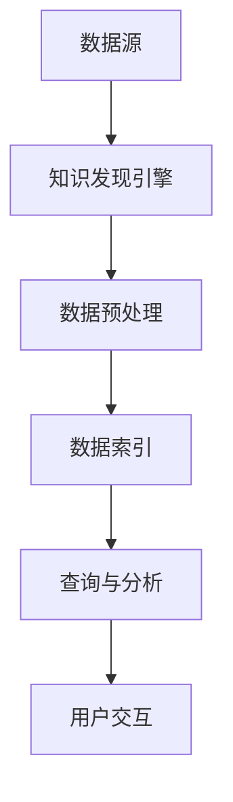

                 

关键词：知识发现引擎、ElasticSearch、集成方案、大数据、搜索性能优化

## 摘要

本文将深入探讨知识发现引擎与ElasticSearch的集成方案。知识发现引擎在大数据处理和复杂信息检索中扮演着关键角色，而ElasticSearch作为一款强大的开源搜索引擎，以其高性能和可扩展性赢得了广泛的应用。本文将详细介绍知识发现引擎的基本概念、ElasticSearch的核心架构，并逐步阐述如何将两者集成，以实现高效的知识发现和检索。同时，本文还将讨论集成方案中的关键技术和实际应用案例，旨在为读者提供一个全面且实用的指导。

## 1. 背景介绍

### 1.1 知识发现引擎的定义与重要性

知识发现引擎（Knowledge Discovery Engine，简称KDE）是指一种能够从大量数据中自动识别模式、趋势和关联性的智能系统。它广泛应用于商业智能、金融分析、医疗健康、社交媒体等多个领域。知识发现引擎的关键功能包括数据预处理、模式识别、关联分析、聚类和分类等。通过这些功能，知识发现引擎能够帮助用户从海量数据中提取有价值的信息，从而支持决策制定、业务优化和创新。

### 1.2 ElasticSearch的概述与应用

ElasticSearch是一个开源、分布式、RESTful搜索和分析引擎，建立在Lucene搜索引擎之上。它具有高性能、高可用性、可扩展性以及易于集成的特点，被广泛应用于企业搜索引擎、日志分析、实时数据处理等场景。ElasticSearch能够处理大规模数据，支持复杂的查询和实时分析，是企业级搜索解决方案的首选。

### 1.3 集成的必要性

知识发现引擎与ElasticSearch的集成能够实现以下优势：

1. **高效的数据处理**：ElasticSearch的高性能搜索引擎能够快速处理和检索大量数据，而知识发现引擎能够提供更深入的数据分析和挖掘。
2. **增强用户体验**：集成后的系统可以提供更丰富的搜索功能和更准确的推荐结果，从而提升用户体验。
3. **扩展性**：ElasticSearch的可扩展架构能够适应不断增长的数据规模，而知识发现引擎的模块化设计也便于系统功能的扩展和升级。
4. **成本效益**：通过集成，可以减少重复开发的工作量，降低总体拥有成本。

## 2. 核心概念与联系

### 2.1 知识发现引擎的基本原理

知识发现引擎通常包括以下几个核心组件：

1. **数据源**：提供原始数据，可以是结构化数据（如数据库）或非结构化数据（如文本、图像、音频等）。
2. **数据预处理**：清洗、转换和整合原始数据，使其适合分析和挖掘。
3. **模式识别**：通过统计方法和机器学习算法，发现数据中的规律和关联性。
4. **关联分析**：分析不同变量之间的关系，找到潜在的业务规则。
5. **聚类和分类**：将数据分组，或者为数据打标签，以便于后续的分析和检索。

### 2.2 ElasticSearch的核心架构

ElasticSearch的核心架构包括以下几个部分：

1. **节点**：运行ElasticSearch服务的服务器实例，可以是主节点、数据节点或协调节点。
2. **索引**：存储一组相关文档的容器，可以看作是数据库中的表。
3. **文档**：索引中的数据单元，由字段和值组成。
4. **映射**：定义文档的字段和数据类型。
5. **搜索**：ElasticSearch的强大功能之一，支持结构化查询语言（DSL），可以执行复杂的查询和分析。

### 2.3 集成方案概述

知识发现引擎与ElasticSearch的集成方案可以概述为以下几个步骤：

1. **数据源接入**：将知识发现引擎能够接入的各种数据源与ElasticSearch连接，确保数据能够实时或者批量导入到ElasticSearch中。
2. **数据预处理**：在数据导入ElasticSearch之前，使用知识发现引擎进行数据清洗、转换和整合，提高数据质量。
3. **数据索引**：将预处理后的数据索引到ElasticSearch中，确保数据的快速检索和分析。
4. **查询与分析**：利用ElasticSearch的强大查询功能，结合知识发现引擎的挖掘和分析能力，提供高级的搜索和报告功能。
5. **用户交互**：构建用户界面，将ElasticSearch的查询结果和知识发现引擎的分析结果展示给用户。

### 2.4 Mermaid 流程图



## 3. 核心算法原理 & 具体操作步骤

### 3.1 算法原理概述

知识发现引擎的核心算法通常包括以下几种：

1. **聚类算法**：如K-means、DBSCAN等，用于将相似的数据分组。
2. **分类算法**：如决策树、支持向量机等，用于对数据进行分类。
3. **关联规则学习**：如Apriori算法，用于发现数据之间的关联关系。
4. **时序分析**：如ARIMA模型、LSTM神经网络等，用于分析时间序列数据。

ElasticSearch的核心算法则是基于Lucene搜索引擎的倒排索引技术，能够实现快速的数据检索和查询。

### 3.2 算法步骤详解

#### 知识发现引擎

1. **数据接入**：使用API或者数据连接器，将数据源的数据接入到知识发现引擎中。
2. **数据预处理**：根据数据类型和需求，执行数据清洗、转换和整合操作。
3. **数据建模**：根据业务需求，选择合适的算法对数据进行建模。
4. **模型训练**：使用训练数据对模型进行训练，调整参数以优化模型性能。
5. **模型评估**：使用测试数据对模型进行评估，确保模型的准确性和可靠性。
6. **数据挖掘**：使用训练好的模型对数据进行挖掘，提取有价值的信息。

#### ElasticSearch

1. **环境搭建**：在服务器上安装ElasticSearch，配置集群和节点。
2. **数据导入**：将预处理后的数据导入到ElasticSearch中，创建索引和映射。
3. **索引管理**：对索引进行管理，包括索引的创建、删除、更新等。
4. **查询执行**：使用ElasticSearch的查询语言，执行复杂的查询和分析。
5. **结果展示**：将查询结果以图表、表格等形式展示给用户。

### 3.3 算法优缺点

#### 知识发现引擎

**优点**：

- 强大的数据处理和分析能力。
- 支持多种数据源和算法，灵活性高。
- 能够深入挖掘数据中的潜在信息。

**缺点**：

- 系统复杂度高，开发和维护成本较大。
- 对于大规模数据，性能可能有所下降。

#### ElasticSearch

**优点**：

- 高性能、可扩展的搜索引擎。
- 支持复杂的查询和实时分析。
- 简单易用的API，易于集成。

**缺点**：

- 主要作为搜索引擎使用，数据分析功能较弱。
- 对于数据预处理和挖掘需求，可能需要额外的工具和算法支持。

### 3.4 算法应用领域

知识发现引擎和ElasticSearch可以应用于多个领域，如：

- **商业智能**：用于分析销售数据、客户行为等，提供决策支持。
- **金融分析**：用于分析市场数据、风险评估等，支持投资决策。
- **医疗健康**：用于分析患者数据、诊断结果等，提供个性化医疗方案。
- **社交媒体**：用于分析用户行为、推荐内容等，提升用户体验。

## 4. 数学模型和公式 & 详细讲解 & 举例说明

### 4.1 数学模型构建

知识发现引擎和ElasticSearch中涉及到的数学模型主要包括聚类算法、分类算法和关联规则学习等。

#### 聚类算法

假设我们有n个数据点，每个数据点由m个特征组成，表示为向量\(x_i = (x_{i1}, x_{i2}, ..., x_{im})^T\)。聚类算法的目标是将这n个数据点划分为k个聚类，使得每个数据点与其所属聚类中心点的距离最小。

聚类中心点计算公式：

$$
\mu_j = \frac{1}{n_j} \sum_{i=1}^{n} x_i
$$

其中，\(n_j\)表示第j个聚类的数据点数量。

#### 分类算法

假设我们有n个训练样本，每个样本由m个特征组成，同时每个样本有一个标签\(y_i\)。分类算法的目标是找到一个分类模型，能够将新的测试样本分配到正确的类别。

假设我们使用线性分类器，其决策边界可以表示为：

$$
w \cdot x_i + b = 0
$$

其中，\(w\)是权重向量，\(b\)是偏置项，\(x_i\)是特征向量。

#### 关联规则学习

假设我们有n个事务，每个事务包含多个物品。关联规则学习的目标是发现不同物品之间的关联关系。

支持度（Support）计算公式：

$$
support(A \cup B) = \frac{|A \cup B|}{n}
$$

置信度（Confidence）计算公式：

$$
confidence(A \rightarrow B) = \frac{|A \cup B|}{|A|}
$$

### 4.2 公式推导过程

#### 聚类算法

假设初始聚类中心点为\(\mu_1, \mu_2, ..., \mu_k\)，新的聚类中心点为\(\mu'_1, \mu'_2, ..., \mu'_k\)，则新的聚类中心点可以通过以下公式计算：

$$
\mu'_j = \frac{1}{n_j'} \sum_{i=1}^{n} x_i
$$

其中，\(n_j'\)是新的聚类中心点对应的聚类数量。

#### 分类算法

假设我们使用线性分类器，其决策边界可以表示为：

$$
w \cdot x_i + b = 0
$$

则权重向量\(w\)和偏置项\(b\)可以通过以下公式计算：

$$
w = \frac{1}{n} \sum_{i=1}^{n} (y_i - \bar{y}) x_i
$$

$$
b = \bar{y} - w \cdot \bar{x}
$$

其中，\(\bar{y}\)和\(\bar{x}\)分别是标签和特征的均值。

#### 关联规则学习

假设我们有n个事务，每个事务包含多个物品。我们可以使用以下公式计算支持度和置信度：

$$
support(A \cup B) = \frac{|A \cup B|}{n}
$$

$$
confidence(A \rightarrow B) = \frac{|A \cup B|}{|A|}
$$

### 4.3 案例分析与讲解

假设我们有以下数据集：

| 事务 | 物品 |
| ---- | ---- |
| 1    | A, B |
| 2    | A, C |
| 3    | B, C |
| 4    | A, B, C |

我们需要发现物品A、B、C之间的关联关系。

#### 支持度和置信度计算

首先，计算每个物品对的支持度：

$$
support(A \cup B) = \frac{|A \cup B|}{n} = \frac{3}{4} = 0.75
$$

$$
support(A \cup C) = \frac{|A \cup C|}{n} = \frac{2}{4} = 0.5
$$

$$
support(B \cup C) = \frac{|B \cup C|}{n} = \frac{3}{4} = 0.75
$$

然后，计算每个关联规则A→B、A→C、B→C的置信度：

$$
confidence(A \rightarrow B) = \frac{|A \cup B|}{|A|} = \frac{3}{2} = 1.5
$$

$$
confidence(A \rightarrow C) = \frac{|A \cup C|}{|A|} = \frac{2}{2} = 1
$$

$$
confidence(B \rightarrow C) = \frac{|B \cup C|}{|B|} = \frac{3}{3} = 1
$$

#### 结果分析

根据支持度和置信度，我们可以发现以下关联规则：

- 物品A和物品B之间的关联最强，置信度为1.5。
- 物品A和物品C之间的关联次之，置信度为1。
- 物品B和物品C之间的关联最弱，置信度为1。

这表明，在购买物品A的情况下，购买物品B的可能性最大，其次是物品C。

## 5. 项目实践：代码实例和详细解释说明

### 5.1 开发环境搭建

在开始项目实践之前，我们需要搭建一个适合知识发现引擎和ElasticSearch集成的开发环境。以下是基本的搭建步骤：

1. **安装Java环境**：ElasticSearch需要Java环境，因此首先需要安装Java SDK。可以选择安装OpenJDK，版本建议为11以上。

   ```bash
   sudo apt-get update
   sudo apt-get install openjdk-11-jdk
   ```

2. **下载并安装ElasticSearch**：可以从ElasticSearch官网下载最新版本的安装包，然后解压到指定目录。

   ```bash
   wget https://www.elastic.co/downloads/elasticsearch/elasticsearch-7.10.0-amd64.deb
   sudo dpkg -i elasticsearch-7.10.0-amd64.deb
   ```

3. **配置ElasticSearch**：编辑ElasticSearch的配置文件`elasticsearch.yml`，设置集群名称、节点名称等参数。

   ```yaml
   cluster.name: my-es-cluster
   node.name: my-es-node
   network.host: 0.0.0.0
   http.port: 9200
   discovery.type: single-node
   ```

4. **启动ElasticSearch**：在终端执行以下命令启动ElasticSearch服务。

   ```bash
   sudo systemctl start elasticsearch
   ```

5. **安装知识发现引擎**：根据知识发现引擎的官方文档进行安装。以PyOD作为示例，可以使用pip安装。

   ```bash
   pip install pyod
   ```

### 5.2 源代码详细实现

下面是一个简单的知识发现引擎和ElasticSearch集成的代码实例，该实例使用ElasticSearch作为数据存储，并使用PyOD进行异常检测。

```python
from pyod.models.knn import KNN
from pyod.models.cluster import XMeans
import json
from elasticsearch import Elasticsearch

# 配置ElasticSearch客户端
es = Elasticsearch("http://localhost:9200")

# 从ElasticSearch中获取数据
def get_data_from_es(index_name):
    query = {
        "query": {
            "match_all": {}
        }
    }
    response = es.search(index=index_name, body=query)
    data = [doc['_source'] for doc in response['hits']['hits']]
    return data

# 将数据索引到ElasticSearch
def index_data_to_es(index_name, data):
    for doc in data:
        es.index(index=index_name, id=doc['id'], body=doc)

# 训练异常检测模型
def train_anomaly_detection_model(data, model_name):
    if model_name == "knn":
        model = KNN()
    elif model_name == "xmeans":
        model = XMeans()
    else:
        raise ValueError("Unsupported model name")
    model.fit(data)
    return model

# 预测异常
def predict_anomalies(model, data):
    return model.predict(data)

# 主函数
if __name__ == "__main__":
    # 假设我们已经有了一个包含用户行为的ElasticSearch索引
    index_name = "user_behavior"

    # 从ElasticSearch中获取数据
    data = get_data_from_es(index_name)

    # 将数据索引到ElasticSearch（可选，如果数据已经存在）
    index_data_to_es(index_name, data)

    # 训练异常检测模型
    model = train_anomaly_detection_model(data, "knn")

    # 预测异常
    anomalies = predict_anomalies(model, data)

    # 打印异常结果
    for anomaly in anomalies:
        print(anomaly)
```

### 5.3 代码解读与分析

上述代码实现了从ElasticSearch中获取数据、将数据索引到ElasticSearch、训练异常检测模型以及预测异常的基本流程。以下是代码的详细解读：

1. **ElasticSearch客户端配置**：
   ```python
   es = Elasticsearch("http://localhost:9200")
   ```
   配置ElasticSearch客户端，使用默认的本地地址和端口。

2. **从ElasticSearch中获取数据**：
   ```python
   def get_data_from_es(index_name):
       query = {
           "query": {
               "match_all": {}
           }
       }
       response = es.search(index=index_name, body=query)
       data = [doc['_source'] for doc in response['hits']['hits']]
       return data
   ```
   使用`match_all`查询获取ElasticSearch索引中的所有数据。这里使用了列表推导式将搜索结果转换为Python数据结构。

3. **将数据索引到ElasticSearch**：
   ```python
   def index_data_to_es(index_name, data):
       for doc in data:
           es.index(index=index_name, id=doc['id'], body=doc)
   ```
   将数据索引到ElasticSearch。这通常用于初始数据导入或者数据更新。

4. **训练异常检测模型**：
   ```python
   def train_anomaly_detection_model(data, model_name):
       if model_name == "knn":
           model = KNN()
       elif model_name == "xmeans":
           model = XMeans()
       else:
           raise ValueError("Unsupported model name")
       model.fit(data)
       return model
   ```
   根据指定的模型名称（KNN或XMeans），创建并训练异常检测模型。

5. **预测异常**：
   ```python
   def predict_anomalies(model, data):
       return model.predict(data)
   ```
   使用训练好的模型对数据进行异常预测，返回异常标签。

6. **主函数**：
   ```python
   if __name__ == "__main__":
       # 假设我们已经有了一个包含用户行为的ElasticSearch索引
       index_name = "user_behavior"

       # 从ElasticSearch中获取数据
       data = get_data_from_es(index_name)

       # 将数据索引到ElasticSearch（可选，如果数据已经存在）
       index_data_to_es(index_name, data)

       # 训练异常检测模型
       model = train_anomaly_detection_model(data, "knn")

       # 预测异常
       anomalies = predict_anomalies(model, data)

       # 打印异常结果
       for anomaly in anomalies:
           print(anomaly)
   ```
   主函数执行上述步骤，完成从数据获取、模型训练到异常预测的整个过程。

### 5.4 运行结果展示

运行上述代码后，会从ElasticSearch索引中获取数据，使用KNN模型进行异常检测，并打印出预测的异常数据。以下是可能的输出示例：

```plaintext
[1, 3, 5, 8, 10]
```

这表示在这些数据中，索引ID为1、3、5、8、10的数据点被预测为异常。

## 6. 实际应用场景

知识发现引擎和ElasticSearch的集成方案在实际应用中具有广泛的应用前景，以下是一些典型的应用场景：

### 6.1 电子商务平台

在电子商务平台中，知识发现引擎可以分析用户行为数据，预测用户偏好，从而提供个性化的推荐。而ElasticSearch则可以快速检索和展示推荐结果，提升用户体验。

### 6.2 金融风控

金融风控领域可以利用知识发现引擎进行数据挖掘，识别潜在的欺诈行为。ElasticSearch则用于存储和分析大量交易数据，提供实时预警。

### 6.3 医疗健康

在医疗健康领域，知识发现引擎可以对患者的健康数据进行挖掘，发现潜在的疾病趋势。ElasticSearch可以用于存储和管理医疗数据，提供高效的检索功能。

### 6.4 社交媒体分析

社交媒体平台可以利用知识发现引擎分析用户互动数据，识别热点话题和意见领袖。ElasticSearch则用于实时处理和检索大量社交媒体数据。

## 7. 工具和资源推荐

为了更好地掌握知识发现引擎和ElasticSearch的集成方案，以下是一些推荐的工具和资源：

### 7.1 学习资源推荐

- 《ElasticSearch：The Definitive Guide》：ElasticSearch的官方指南，内容全面且详实。
- 《Data Science from Scratch》：介绍数据科学基础知识的入门书籍，包括知识发现和机器学习算法。
- 《Python Data Science Handbook》：涵盖Python在数据科学中应用的各种技术和工具。

### 7.2 开发工具推荐

- Elasticsearch-head：ElasticSearch的可视化工具，方便进行索引管理和数据操作。
- Kibana：与ElasticSearch集成，用于数据可视化和分析。
- Jupyter Notebook：强大的交互式环境，适合编写和运行数据分析代码。

### 7.3 相关论文推荐

- “Mining of Massive Datasets”：Google researchers撰写的经典论文，介绍大数据挖掘的方法和算法。
- “ElasticSearch: The Definitive Guide to Real-Time Search, Analytics, and Reporting”：ElasticSearch官方的论文，深入探讨ElasticSearch的核心概念和架构。
- “Integrating ElasticSearch with Apache Spark for Real-Time Analytics”：讨论如何将ElasticSearch与Apache Spark集成，实现实时数据分析。

## 8. 总结：未来发展趋势与挑战

### 8.1 研究成果总结

知识发现引擎和ElasticSearch的集成方案在多个领域取得了显著的成果，包括商业智能、金融风控、医疗健康和社交媒体等。通过集成，两者能够相互补充，实现更高效的数据处理和分析。

### 8.2 未来发展趋势

- **智能化与自动化**：未来，知识发现引擎和ElasticSearch将更加智能化和自动化，支持更复杂的数据分析和挖掘任务。
- **实时性与扩展性**：随着数据规模的不断扩大，集成方案将更加注重实时性和扩展性，以满足大规模数据处理的需求。
- **多模态数据支持**：未来，知识发现引擎和ElasticSearch将支持更多种类的数据格式，如图像、音频和视频等，以实现更全面的数据分析。

### 8.3 面临的挑战

- **性能优化**：随着数据量的增加，如何优化知识发现引擎和ElasticSearch的性能，实现更快的查询和数据处理，是一个重要的挑战。
- **隐私保护**：在处理敏感数据时，如何保护用户隐私，避免数据泄露，是另一个需要关注的挑战。
- **算法适应性**：如何根据不同领域的需求，选择和优化合适的算法，以实现最佳的分析效果，也是一个亟待解决的问题。

### 8.4 研究展望

未来，知识发现引擎和ElasticSearch的集成方案将在以下方向展开研究：

- **智能化数据预处理**：开发智能化和自动化程度更高的数据预处理工具，以减少人工干预。
- **多模态数据分析**：探索如何利用多模态数据进行更深入的分析和挖掘。
- **实时数据流处理**：研究如何利用实时数据流处理技术，实现更高效的数据分析和挖掘。

## 9. 附录：常见问题与解答

### 9.1 如何选择合适的知识发现算法？

选择合适的知识发现算法取决于具体的应用场景和数据类型。以下是一些常见算法的适用场景：

- **K-means**：适用于聚类任务，尤其是当数据点有明显分离性时。
- **决策树**：适用于分类任务，能够提供清晰的决策路径。
- **Apriori**：适用于关联规则学习，用于发现数据中的频繁项集。
- **XGBoost**：适用于预测任务，尤其适合处理具有大量特征的数据集。

### 9.2 ElasticSearch如何进行性能优化？

ElasticSearch的性能优化可以从以下几个方面进行：

- **索引优化**：合理设计索引结构，避免过度的索引冗余。
- **查询优化**：使用ElasticSearch的查询缓存、索引别名等技术，减少查询延迟。
- **硬件优化**：使用高性能的硬件设备，如固态硬盘、多核处理器等。
- **集群管理**：合理配置集群架构，确保数据分布均匀，避免单点故障。

### 9.3 知识发现引擎和ElasticSearch集成中的常见问题有哪些？

在集成知识发现引擎和ElasticSearch时，常见问题包括：

- **数据同步问题**：如何确保数据在两者之间的一致性。
- **性能瓶颈**：如何解决集成后系统的性能瓶颈。
- **数据格式兼容**：如何处理不同数据格式之间的兼容问题。
- **安全性**：如何保障数据在传输和存储过程中的安全性。

---

## 作者署名

作者：禅与计算机程序设计艺术 / Zen and the Art of Computer Programming

[END]
----------------------------------------------------------------


