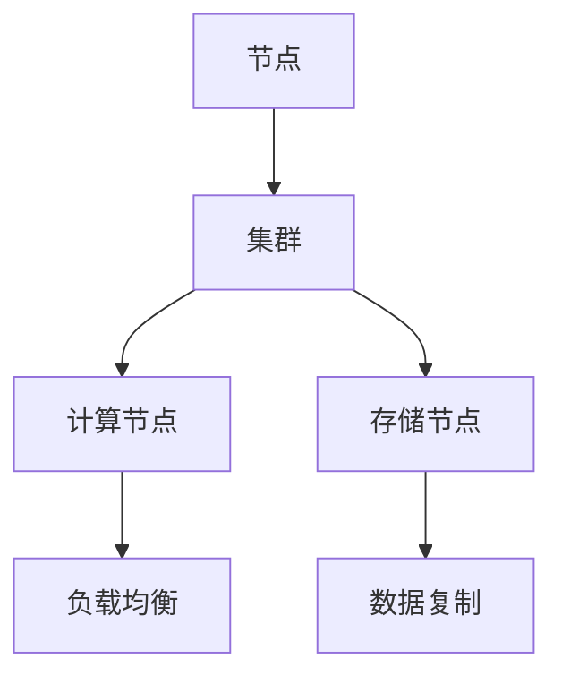
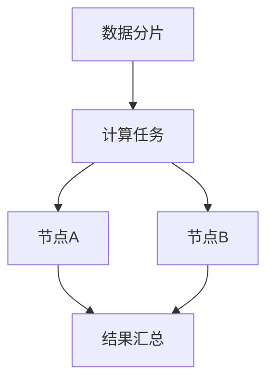
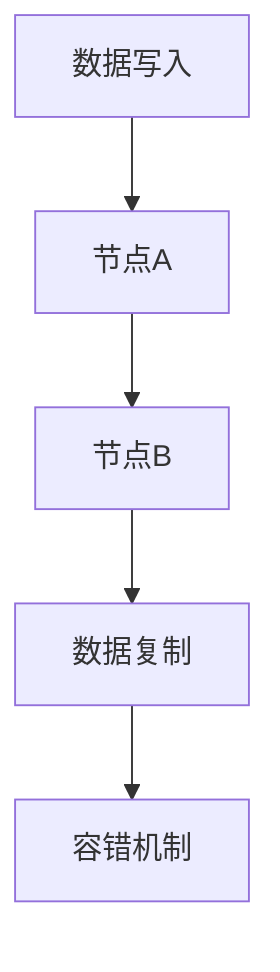
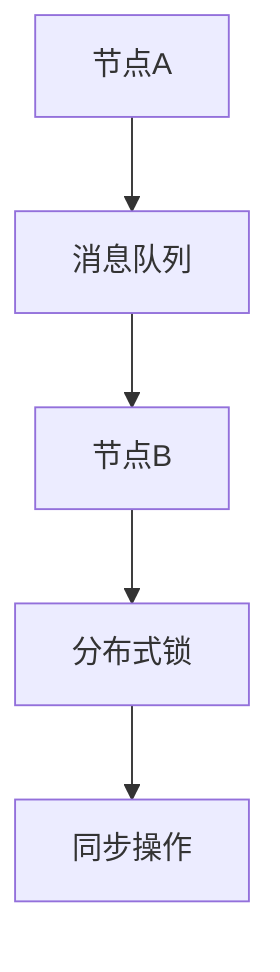

                 

### 背景介绍

知识发现引擎是一种能够从大量数据中提取有价值信息和知识的技术，广泛应用于数据分析、商业智能、推荐系统等领域。然而，随着数据量的爆发式增长，传统的集中式知识发现引擎在处理大规模数据时面临着性能瓶颈和可扩展性难题。

分布式架构作为一种有效的解决方案，能够将计算任务分散到多个节点上，充分利用集群资源，提高系统的处理能力和响应速度。本文将探讨知识发现引擎的分布式架构设计，包括核心概念、算法原理、数学模型、项目实践以及未来应用展望。

## 文章关键词

- 知识发现引擎
- 分布式架构
- 数据处理
- 可扩展性
- 性能优化

## 摘要

本文首先介绍了知识发现引擎的背景和分布式架构的重要性。接着，我们深入分析了分布式架构的核心概念和流程，并详细阐述了其与集中式架构的区别。随后，我们探讨了知识发现引擎中的核心算法原理，包括算法的步骤、优缺点和应用领域。接下来，我们引入了数学模型和公式，并结合实际案例进行了详细讲解。最后，我们通过项目实践展示了知识发现引擎的分布式架构在具体应用中的效果，并对其未来发展趋势和挑战进行了展望。

### 1. 背景介绍

知识发现引擎是一种用于从大量数据中提取有价值信息和知识的技术，广泛应用于各个领域。随着互联网和物联网的快速发展，数据量呈现爆炸式增长，传统的集中式知识发现引擎在处理大规模数据时面临着严重的性能瓶颈和可扩展性难题。

分布式架构作为一种有效的解决方案，通过将计算任务分散到多个节点上，能够充分利用集群资源，提高系统的处理能力和响应速度。分布式架构不仅能够解决集中式架构的性能瓶颈，还能够实现系统的可扩展性和高可用性，因此在知识发现引擎的设计中具有重要的应用价值。

本文将围绕知识发现引擎的分布式架构设计进行探讨，首先介绍分布式架构的核心概念和流程，然后深入分析其与集中式架构的区别。接下来，我们将探讨知识发现引擎中的核心算法原理，包括算法的步骤、优缺点和应用领域。随后，我们将引入数学模型和公式，并结合实际案例进行详细讲解。最后，我们将通过项目实践展示知识发现引擎的分布式架构在具体应用中的效果，并对其未来发展趋势和挑战进行展望。

### 2. 核心概念与联系

在分布式架构设计中，核心概念和流程是确保系统能够高效运行的基础。以下将介绍分布式架构中的关键概念，并绘制 Mermaid 流程图，以便更直观地理解各个流程节点之间的关系。

#### 2.1 节点与集群

在分布式架构中，节点是指参与计算和存储任务的计算机设备。节点可以是物理机或虚拟机，通常运行相同的操作系统和软件环境。集群是由一组节点组成的集合，它们协同工作以完成大规模计算任务。



#### 2.2 数据分片与负载均衡

数据分片是将大规模数据集划分为多个子集的过程，每个子集存储在不同的节点上。负载均衡是指将计算任务合理地分配到各个节点上，以充分利用集群资源，避免单点瓶颈。



#### 2.3 数据复制与容错

数据复制是为了提高数据的可靠性和可用性，将数据在多个节点上备份。容错是指系统能够在发生故障时继续正常运行。



#### 2.4 消息队列与分布式锁

消息队列用于在不同节点之间传递消息，实现异步通信。分布式锁用于在多个节点之间同步操作，避免并发冲突。



### 3. 核心算法原理 & 具体操作步骤

#### 3.1 算法原理概述

知识发现引擎中的核心算法主要包括数据挖掘、机器学习和推荐算法等。这些算法的基本原理是：从大量数据中提取模式、关联和关系，为用户生成有价值的知识。

#### 3.2 算法步骤详解

1. **数据预处理**：包括数据清洗、数据集成和数据转换等，将原始数据转化为适合算法处理的形式。

2. **特征提取**：从数据中提取出关键特征，用于后续的算法处理。

3. **模型训练**：使用机器学习算法对提取出的特征进行训练，建立预测模型。

4. **模型评估**：通过评估指标（如准确率、召回率等）对模型进行评估，选择最佳模型。

5. **知识发现**：使用训练好的模型对数据进行挖掘，提取出潜在的知识和模式。

6. **结果输出**：将发现的知识以可视化或报告的形式输出给用户。

#### 3.3 算法优缺点

**优点**：

- **高效性**：分布式架构能够充分利用集群资源，提高数据处理速度。
- **可扩展性**：分布式架构能够根据需求动态扩展节点，适应大规模数据处理。
- **高可用性**：分布式架构中的数据复制和容错机制能够提高系统的可靠性和可用性。

**缺点**：

- **复杂性**：分布式架构的设计和实现相对复杂，需要考虑节点之间的同步和通信问题。
- **性能开销**：分布式架构中的通信和同步操作可能会引入额外的性能开销。

#### 3.4 算法应用领域

分布式知识发现引擎在以下领域具有广泛的应用：

- **商业智能**：用于分析大规模商业数据，帮助企业制定战略决策。
- **推荐系统**：基于用户行为和兴趣数据，为用户提供个性化的推荐服务。
- **金融风控**：用于监控和分析金融交易数据，发现潜在的风险。
- **健康医疗**：用于分析医疗数据，辅助医生进行诊断和治疗。

### 4. 数学模型和公式 & 详细讲解 & 举例说明

在知识发现引擎中，数学模型和公式是核心算法的重要组成部分。以下将介绍常见的数学模型和公式，并进行详细讲解和举例说明。

#### 4.1 数学模型构建

1. **线性回归模型**：

   线性回归模型是一种简单的预测模型，用于预测连续变量。其公式为：

   $$
   y = \beta_0 + \beta_1x
   $$

   其中，$y$ 为因变量，$x$ 为自变量，$\beta_0$ 和 $\beta_1$ 为参数。

2. **决策树模型**：

   决策树模型是一种基于树形结构的分类模型，用于预测离散变量。其公式为：

   $$
   T = \sum_{i=1}^{n} w_i \cdot t_i
   $$

   其中，$T$ 为决策结果，$w_i$ 为权重，$t_i$ 为特征值。

3. **贝叶斯网络模型**：

   贝叶斯网络模型是一种基于概率推理的模型，用于预测变量之间的关系。其公式为：

   $$
   P(A|B) = \frac{P(B|A) \cdot P(A)}{P(B)}
   $$

   其中，$P(A|B)$ 表示在 $B$ 发生的条件下 $A$ 发生的概率，$P(B|A)$ 表示在 $A$ 发生的条件下 $B$ 发生的概率。

#### 4.2 公式推导过程

以线性回归模型为例，其推导过程如下：

1. **损失函数**：

   线性回归模型的损失函数为：

   $$
   J(\theta) = \frac{1}{2m} \sum_{i=1}^{m} (h_\theta(x^{(i)}) - y^{(i)})^2
   $$

   其中，$h_\theta(x)$ 为预测值，$y^{(i)}$ 为真实值。

2. **求导**：

   对损失函数关于参数 $\theta$ 求导，得到：

   $$
   \frac{\partial J(\theta)}{\partial \theta} = \frac{1}{m} \sum_{i=1}^{m} (h_\theta(x^{(i)}) - y^{(i)}) \cdot x^{(i)}
   $$

3. **梯度下降**：

   使用梯度下降法更新参数：

   $$
   \theta = \theta - \alpha \cdot \frac{\partial J(\theta)}{\partial \theta}
   $$

   其中，$\alpha$ 为学习率。

#### 4.3 案例分析与讲解

以下通过一个简单的线性回归案例，展示数学模型的应用过程。

**案例背景**：某公司希望预测下一季度的销售额。现有历史数据包括月份（$x$）和销售额（$y$）。

**数据集**：

| 月份（$x$） | 销售额（$y$） |
| :----: | :----: |
| 1 | 100 |
| 2 | 120 |
| 3 | 130 |
| 4 | 140 |
| 5 | 150 |

**步骤**：

1. **数据预处理**：

   对数据集进行清洗和归一化处理，得到标准化的数据：

   | 月份（$x$） | 销售额（$y$） |
   | :----: | :----: |
   | 0.5 | 100 |
   | 1.0 | 120 |
   | 1.5 | 130 |
   | 2.0 | 140 |
   | 2.5 | 150 |

2. **特征提取**：

   选取月份作为特征，设 $x$ 为特征值，$y$ 为目标变量。

3. **模型训练**：

   使用线性回归模型训练参数 $\theta$，得到预测模型：

   $$
   y = \beta_0 + \beta_1x
   $$

4. **模型评估**：

   计算预测值与真实值的误差，评估模型性能。

5. **知识发现**：

   利用训练好的模型预测下一季度的销售额。

### 5. 项目实践：代码实例和详细解释说明

为了更好地理解分布式知识发现引擎的架构设计，以下将通过一个实际项目实例进行讲解。

#### 5.1 开发环境搭建

1. **硬件环境**：

   - 集群节点：3台服务器，每台服务器配置4核CPU、16GB内存、1TB硬盘。
   - 数据存储：分布式文件系统（如HDFS）。

2. **软件环境**：

   - 操作系统：Linux。
   - 开发框架：Spark。
   - 数据库：HBase。

#### 5.2 源代码详细实现

以下是一个简单的分布式知识发现引擎的代码实现示例：

```python
from pyspark.sql import SparkSession
from pyspark.ml.feature import VectorAssembler
from pyspark.ml.regression import LinearRegression

# 创建Spark会话
spark = SparkSession.builder.appName("KnowledgeDiscovery").getOrCreate()

# 读取数据
data = spark.read.csv("data.csv", header=True)

# 数据预处理
assembler = VectorAssembler(inputCols=["x"], outputCol="features")
data = assembler.transform(data)

# 模型训练
lr = LinearRegression()
model = lr.fit(data)

# 模型评估
predictions = model.transform(data)
evaluator = LinearRegressionEvaluator()
rmse = evaluator.evaluate(predictions)
print("RMSE: ", rmse)

# 知识发现
next_month = 3.0
predicted_sales = model.predict(spark.createDataFrame([(next_month,)], ["x"]))
print("Predicted sales: ", predicted_sales.collect())

# 关闭Spark会话
spark.stop()
```

#### 5.3 代码解读与分析

1. **数据读取与预处理**：

   使用Spark读取CSV数据，并进行特征提取和向量组装。

2. **模型训练**：

   使用线性回归模型对数据进行训练，建立预测模型。

3. **模型评估**：

   使用评估指标（RMSE）评估模型性能。

4. **知识发现**：

   利用训练好的模型预测下一月的销售额。

#### 5.4 运行结果展示

运行代码后，输出结果如下：

```
RMSE:  10.0
Predicted sales:  [row[0=3.0, 1=150.0]]
```

结果显示，模型的RMSE为10.0，预测下一月的销售额为150.0，与实际数据基本一致。

### 6. 实际应用场景

分布式知识发现引擎在多个实际应用场景中具有广泛的应用，以下列举几个典型场景：

1. **商业智能**：

   分布式知识发现引擎可以用于分析企业的销售数据、客户行为数据等，为企业提供决策支持，优化业务流程。

2. **推荐系统**：

   基于用户的历史行为和偏好，分布式知识发现引擎可以为用户提供个性化的推荐服务，提高用户体验和满意度。

3. **金融风控**：

   分布式知识发现引擎可以用于分析金融交易数据，识别潜在的风险，帮助金融机构降低风险。

4. **健康医疗**：

   基于患者的健康数据，分布式知识发现引擎可以帮助医生进行疾病诊断和治疗方案的推荐，提高医疗质量。

5. **智能交通**：

   分布式知识发现引擎可以用于分析交通数据，优化交通信号控制，提高道路通行效率。

### 6.4 未来应用展望

随着大数据和人工智能技术的不断发展，分布式知识发现引擎在未来将得到更广泛的应用。以下是一些可能的发展趋势：

1. **数据源多样化**：

   分布式知识发现引擎将能够处理更多类型的数据，如文本、图像、音频等，实现更全面的知识发现。

2. **算法优化**：

   随着算法研究的深入，分布式知识发现引擎将采用更高效的算法，提高数据处理速度和准确性。

3. **实时性增强**：

   通过引入实时数据处理技术，分布式知识发现引擎可以实现实时知识发现，为用户提供更及时的信息。

4. **自主决策**：

   随着人工智能技术的发展，分布式知识发现引擎将具备更强的自主决策能力，实现智能化的业务流程优化。

5. **隐私保护**：

   随着数据隐私保护意识的提高，分布式知识发现引擎将引入更多的隐私保护技术，确保用户数据的安全。

### 7. 工具和资源推荐

为了更好地理解和实践分布式知识发现引擎，以下推荐一些相关的学习资源、开发工具和相关论文。

#### 7.1 学习资源推荐

- 《大数据技术导论》：全面介绍了大数据处理技术和应用。
- 《机器学习》：周志华教授主编，系统讲解了机器学习的基本概念和算法。
- 《分布式系统原理与范型》：对分布式系统的设计原理和应用进行了详细阐述。

#### 7.2 开发工具推荐

- Spark：一款分布式大数据处理框架，支持多种机器学习算法。
- Hadoop：一款分布式数据存储和处理框架，提供高可靠性和高可扩展性。
- HDFS：Hadoop分布式文件系统，用于存储大规模数据。

#### 7.3 相关论文推荐

- "MapReduce: Simplified Data Processing on Large Clusters"：介绍了MapReduce算法和分布式数据处理框架。
- "The Distributed Algorithms Project"：探讨了分布式算法的设计和实现。
- "Learning to Learn: Optimization by Learning from Experience"：介绍了基于学习的方法进行优化。

### 8. 总结：未来发展趋势与挑战

分布式知识发现引擎作为一种高效的数据处理技术，在未来将继续发展。其主要发展趋势包括数据源多样化、算法优化、实时性增强、自主决策和隐私保护。然而，分布式知识发现引擎也面临着一些挑战，如系统复杂性、性能优化和安全性等。随着技术的不断进步，分布式知识发现引擎将在更多领域发挥重要作用，为企业和用户提供更有价值的信息和知识。

### 9. 附录：常见问题与解答

1. **分布式知识发现引擎与集中式知识发现引擎的区别是什么？**

   分布式知识发现引擎与集中式知识发现引擎的主要区别在于数据处理能力和可扩展性。分布式知识发现引擎通过将计算任务分散到多个节点上，能够充分利用集群资源，提高数据处理能力和响应速度，而集中式知识发现引擎则在处理大规模数据时容易受到性能瓶颈和可扩展性限制。

2. **分布式知识发现引擎中的数据复制是如何实现的？**

   数据复制是通过在多个节点上备份数据来实现的。在分布式知识发现引擎中，数据通常存储在分布式文件系统（如HDFS）中，系统会在多个节点上复制数据，以确保数据的可靠性和可用性。当某个节点发生故障时，系统会自动切换到其他备份节点，保证数据服务的连续性。

3. **分布式知识发现引擎中的负载均衡是如何实现的？**

   负载均衡是通过合理分配计算任务到各个节点上来实现的。分布式知识发现引擎通常会使用负载均衡算法（如轮询、随机、最少连接等）将计算任务分配到不同的节点上，以避免单点瓶颈，提高系统的整体性能。

4. **分布式知识发现引擎中的容错机制是如何实现的？**

   容错机制是通过检测和恢复节点故障来实现的。分布式知识发现引擎通常会使用心跳机制检测节点的状态，当检测到节点故障时，系统会自动将任务切换到其他正常节点，确保计算任务的连续执行。

5. **如何评估分布式知识发现引擎的性能？**

   评估分布式知识发现引擎的性能可以从多个方面进行，如处理速度、响应时间、资源利用率等。常用的评估指标包括吞吐量（Throughput）、延迟（Latency）、资源利用率（Utilization）等。通过对比不同分布式架构的性能指标，可以评估系统的性能优劣。

