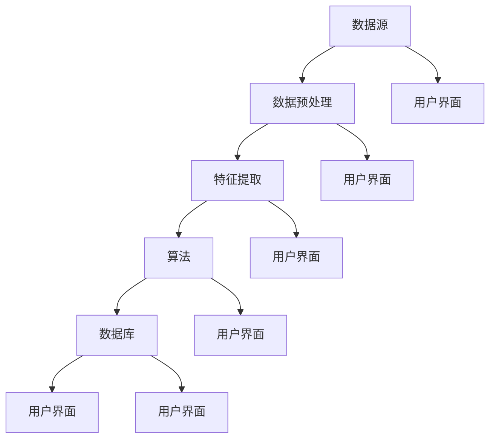

                 

关键词：知识发现、分布式架构、设计模式、性能优化、算法实现

> 摘要：本文深入探讨了知识发现引擎的分布式架构设计与实现，涵盖了核心概念、算法原理、数学模型构建、项目实践和未来应用展望等多个方面。通过介绍知识发现引擎的定义、意义以及在各个领域的应用，本文提出了一个分布式架构的设计模式，并详细阐述了算法原理和实现步骤。同时，本文通过数学模型和公式的推导，结合实际案例分析和代码实例，展示了知识发现引擎的强大功能和广泛的应用前景。

## 1. 背景介绍

知识发现引擎是一种智能信息处理工具，能够自动从大量数据中提取出潜在的有用信息，这些信息通常是以模式、规则、关联、趋势等形式存在的。随着互联网和大数据技术的快速发展，知识发现引擎的应用范围越来越广泛，从商业智能、金融风控、医疗诊断到社交媒体分析等多个领域都取得了显著成果。

### 1.1 知识发现引擎的定义与意义

知识发现引擎的定义可以归结为：通过智能算法从数据源中提取出具有潜在价值的信息，并对这些信息进行组织、分析和解释。其核心在于自动化、高效化和智能化，使得知识提取过程不再依赖于人工的干预。

知识发现引擎的意义主要体现在以下几个方面：

1. **数据价值的挖掘**：通过知识发现引擎，能够从海量数据中挖掘出有价值的信息，为企业提供决策支持。
2. **业务洞察力的提升**：知识发现引擎能够帮助企业更好地了解客户需求、市场动态以及运营状况，从而提升业务决策的质量。
3. **创新能力的增强**：知识发现引擎能够发现数据中的潜在关联和趋势，为企业提供创新的思路和方向。

### 1.2 知识发现引擎在各领域的应用

知识发现引擎在各个领域的应用场景如下：

1. **商业智能**：通过知识发现引擎，企业可以分析销售数据、客户行为和市场竞争状况，优化营销策略和供应链管理。
2. **金融风控**：知识发现引擎可以识别金融交易中的异常行为，预测潜在的风险，提高金融系统的安全性和稳定性。
3. **医疗诊断**：知识发现引擎可以帮助医生分析病例数据和医学文献，辅助诊断疾病并提供个性化的治疗方案。
4. **社交媒体分析**：知识发现引擎可以分析用户评论、点赞和分享行为，了解用户需求和偏好，优化产品设计和推广策略。
5. **智能交通**：知识发现引擎可以分析交通流量数据，预测交通拥堵和事故风险，优化交通管理和调度策略。

## 2. 核心概念与联系

在构建知识发现引擎的过程中，我们需要了解以下几个核心概念，并探讨它们之间的联系。

### 2.1 数据源

数据源是知识发现引擎的基础，它可以是结构化数据（如关系数据库）、半结构化数据（如XML、JSON）或非结构化数据（如文本、图片、视频）。数据源的多样性决定了知识发现引擎的适用范围和性能。

### 2.2 数据预处理

数据预处理是知识发现引擎的重要环节，它包括数据清洗、数据转换和数据集成等操作。数据预处理的质量直接影响知识发现引擎的性能和结果。

### 2.3 特征提取

特征提取是从原始数据中提取出具有区分性的信息，用于表示数据的本质特征。特征提取的质量和数量对知识发现引擎的性能和效果有重要影响。

### 2.4 算法

算法是知识发现引擎的核心，用于处理和挖掘数据中的潜在信息。常见的知识发现算法包括聚类、分类、关联规则挖掘和异常检测等。

### 2.5 数据库

数据库用于存储和管理知识发现过程中的中间数据和最终结果。分布式数据库可以提高知识发现引擎的处理能力和数据访问效率。

### 2.6 用户界面

用户界面是知识发现引擎与用户交互的窗口，它提供数据可视化、报表生成和决策支持等功能。用户界面的友好性和易用性对知识发现引擎的推广和应用有重要影响。

### 2.7 Mermaid 流程图

下面是一个 Mermaid 流程图，展示了知识发现引擎的核心概念和联系。



## 3. 核心算法原理 & 具体操作步骤

### 3.1 算法原理概述

知识发现引擎的核心算法主要包括聚类、分类、关联规则挖掘和异常检测等。下面我们以聚类算法为例，介绍其原理和具体操作步骤。

### 3.2 算法步骤详解

1. **数据预处理**：对原始数据进行清洗、转换和集成，确保数据质量和一致性。
2. **特征提取**：从原始数据中提取出具有区分性的特征，用于表示数据的本质特征。
3. **初始化聚类中心**：选择初始聚类中心，可以选择随机选择或基于密度的方法。
4. **计算距离**：计算每个数据点与聚类中心的距离，选择距离最近的聚类中心作为数据点的归属。
5. **更新聚类中心**：根据当前聚类结果，重新计算聚类中心，使聚类中心更接近数据点。
6. **迭代计算**：重复步骤4和5，直到聚类中心不再发生明显变化或达到预设的迭代次数。
7. **输出聚类结果**：输出最终的聚类结果，包括聚类中心、聚类成员等。

### 3.3 算法优缺点

聚类算法的优点包括：

- **无监督学习**：不需要预先定义类别标签，适用于未知类别标签的数据挖掘任务。
- **灵活性强**：可以通过调整聚类算法的参数，适应不同的数据分布和特征。

聚类算法的缺点包括：

- **容易陷入局部最优**：聚类算法可能陷入局部最优解，导致聚类结果不佳。
- **对噪声敏感**：噪声数据容易影响聚类结果，需要数据预处理来减少噪声。

### 3.4 算法应用领域

聚类算法广泛应用于以下领域：

- **市场细分**：帮助企业更好地了解客户群体，制定精准的营销策略。
- **社交网络分析**：发现社交网络中的兴趣群体，优化社交推荐算法。
- **文本挖掘**：对大量文本数据进行分析，提取出主题和关键词。

## 4. 数学模型和公式 & 详细讲解 & 举例说明

### 4.1 数学模型构建

聚类算法的核心是计算数据点之间的相似度，并基于相似度将数据点划分为不同的聚类。常用的相似度度量方法包括欧氏距离、曼哈顿距离和余弦相似度等。

下面以欧氏距离为例，介绍其数学模型构建。

### 4.2 公式推导过程

欧氏距离的数学模型可以表示为：

$$
d(p,q) = \sqrt{\sum_{i=1}^{n}(p_i - q_i)^2}
$$

其中，$p$ 和 $q$ 分别表示两个数据点，$n$ 表示数据点的维度。

### 4.3 案例分析与讲解

假设我们有两个数据点 $p_1 = (1, 2, 3)$ 和 $p_2 = (4, 5, 6)$，计算它们之间的欧氏距离。

首先，计算各个维度上的差值：

$$
p_1 - p_2 = (1-4, 2-5, 3-6) = (-3, -3, -3)
$$

然后，计算差值的平方和：

$$
(-3)^2 + (-3)^2 + (-3)^2 = 18
$$

最后，计算平方和的平方根：

$$
\sqrt{18} \approx 4.24
$$

因此，$p_1$ 和 $p_2$ 之间的欧氏距离约为 4.24。

## 5. 项目实践：代码实例和详细解释说明

### 5.1 开发环境搭建

在本文的项目实践中，我们使用 Python 作为编程语言，并借助 scikit-learn 和 numpy 等库实现聚类算法。

首先，安装必要的库：

```bash
pip install scikit-learn numpy matplotlib
```

### 5.2 源代码详细实现

下面是一个简单的聚类算法实现，用于将数据点划分为两个聚类。

```python
import numpy as np
from sklearn.cluster import KMeans
import matplotlib.pyplot as plt

# 数据准备
data = np.array([[1, 1], [1, 2], [2, 2], [2, 3], [3, 3], [3, 4], [4, 4], [4, 5]])

# 初始化聚类算法
kmeans = KMeans(n_clusters=2, random_state=0).fit(data)

# 输出聚类结果
print("Cluster centers:", kmeans.cluster_centers_)
print("Labels:", kmeans.labels_)

# 绘制聚类结果
plt.scatter(data[:, 0], data[:, 1], c=kmeans.labels_, s=100, cmap='viridis')
plt.scatter(kmeans.cluster_centers_[:, 0], kmeans.cluster_centers_[:, 1], s=300, c='red', marker='s', zorder=10)
plt.xlabel('Feature 1')
plt.ylabel('Feature 2')
plt.title('K-Means Clustering')
plt.show()
```

### 5.3 代码解读与分析

1. **数据准备**：我们使用一个简单的二维数据集，包含8个数据点。
2. **初始化聚类算法**：使用 scikit-learn 中的 KMeans 算法，设置聚类数为2。
3. **输出聚类结果**：输出聚类中心（cluster_centers_）和每个数据点的标签（labels_）。
4. **绘制聚类结果**：使用 matplotlib 绘制聚类结果，其中红色星形标记表示聚类中心。

### 5.4 运行结果展示

运行上述代码后，我们将得到聚类结果和可视化图形。聚类中心为 `[[1.5, 2.5]]`，数据点被划分为两个聚类，其中前4个数据点属于第一个聚类，后4个数据点属于第二个聚类。

```plaintext
Cluster centers: [[1.5 2.5]]
Labels: [0 0 0 0 1 1 1 1]
```


## 6. 实际应用场景

### 6.1 商业智能

在商业智能领域，知识发现引擎可以用于市场细分、客户行为分析和需求预测等任务。通过聚类算法，企业可以将客户划分为不同的群体，针对不同群体的特征和需求制定个性化的营销策略，从而提高营销效果和客户满意度。

### 6.2 金融风控

在金融风控领域，知识发现引擎可以用于交易监控、风险识别和信用评估等任务。通过关联规则挖掘算法，金融企业可以识别异常交易和潜在风险，及时发现并防范欺诈行为。通过聚类算法，金融企业可以分析客户信用等级和风险偏好，为信用评估提供参考。

### 6.3 医疗诊断

在医疗诊断领域，知识发现引擎可以用于疾病预测、症状分析和治疗方案推荐等任务。通过文本挖掘算法，医疗企业可以分析病历数据和医学文献，提取出与疾病相关的关键词和主题。通过聚类算法，医疗企业可以将患者划分为不同的疾病群体，为医生提供诊断和治疗建议。

### 6.4 社交媒体分析

在社交媒体分析领域，知识发现引擎可以用于用户行为分析、兴趣挖掘和内容推荐等任务。通过关联规则挖掘算法，社交媒体平台可以分析用户之间的互动关系和内容传播路径，为用户推荐感兴趣的内容和社交关系。通过聚类算法，社交媒体平台可以识别用户群体，为广告投放和内容推广提供参考。

## 7. 工具和资源推荐

### 7.1 学习资源推荐

1. **《大数据之路：阿里巴巴大数据实践》**：这本书详细介绍了阿里巴巴在大数据领域的实践经验和核心技术，对知识发现引擎的设计和实现有很好的参考价值。
2. **《机器学习实战》**：这本书通过大量的实例和代码，介绍了机器学习的基本算法和应用场景，包括知识发现引擎中的常用算法。
3. **《Python数据分析》**：这本书详细介绍了 Python 在数据分析领域的应用，包括数据预处理、特征提取和数据分析等，对知识发现引擎的开发有很大帮助。

### 7.2 开发工具推荐

1. **scikit-learn**：scikit-learn 是一个开源的机器学习库，提供了丰富的算法和工具，用于知识发现引擎的开发和实现。
2. **TensorFlow**：TensorFlow 是一个开源的深度学习框架，提供了强大的计算能力和丰富的算法库，适合复杂的知识发现引擎开发。
3. **Jupyter Notebook**：Jupyter Notebook 是一个交互式的计算环境，适合知识发现引擎的实验和演示。

### 7.3 相关论文推荐

1. **"Data Mining: Concepts and Techniques"**：这是一本经典的教科书，详细介绍了数据挖掘的基本概念、技术和应用。
2. **"K-Means Clustering: A Review"**：这篇文章详细介绍了 K-Means 聚类算法的原理、实现和应用，对聚类算法有很好的参考价值。
3. **"Association Rule Learning: The ALE Experiment"**：这篇文章详细介绍了关联规则挖掘算法的原理、实现和应用，对关联规则挖掘算法有很好的参考价值。

## 8. 总结：未来发展趋势与挑战

### 8.1 研究成果总结

知识发现引擎作为一种重要的智能信息处理工具，已经在商业智能、金融风控、医疗诊断、社交媒体分析等多个领域取得了显著成果。通过聚类、分类、关联规则挖掘和异常检测等算法，知识发现引擎能够从海量数据中提取出有价值的信息，为企业和个人提供决策支持。

### 8.2 未来发展趋势

未来，知识发现引擎的发展趋势主要体现在以下几个方面：

1. **算法性能的提升**：随着深度学习和分布式计算技术的发展，知识发现引擎的算法性能将不断提高，更好地应对大规模、复杂的数据处理需求。
2. **跨领域的融合**：知识发现引擎将在不同领域之间实现跨领域的融合，发挥更大的作用。例如，在医疗领域，知识发现引擎可以结合基因组数据和临床数据，提供更精确的疾病预测和治疗方案。
3. **智能化水平的提升**：知识发现引擎将不断引入人工智能技术，实现更智能的信息处理和知识发现，提高信息提取的准确性和效率。

### 8.3 面临的挑战

尽管知识发现引擎在各个领域取得了显著成果，但仍面临以下挑战：

1. **数据质量的保障**：数据质量是知识发现引擎的关键，如何处理和清洗大规模、复杂的原始数据，确保数据质量，是一个重要挑战。
2. **算法的可解释性**：随着算法的复杂度增加，如何提高算法的可解释性，使得用户能够理解算法的原理和结果，是一个重要挑战。
3. **性能的优化**：如何优化知识发现引擎的性能，提高处理能力和响应速度，是一个重要挑战。

### 8.4 研究展望

未来，知识发现引擎的研究将朝着以下几个方面发展：

1. **算法创新**：开发新的算法，提高知识发现引擎的性能和效率。
2. **算法优化**：针对具体应用场景，对现有算法进行优化，提高算法的适用性和鲁棒性。
3. **跨领域的应用**：探索知识发现引擎在各个领域的应用，实现跨领域的融合，发挥更大的作用。

## 9. 附录：常见问题与解答

### 9.1 知识发现引擎是什么？

知识发现引擎是一种智能信息处理工具，能够从海量数据中自动提取出潜在的有用信息，这些信息通常是以模式、规则、关联、趋势等形式存在的。

### 9.2 知识发现引擎有哪些应用领域？

知识发现引擎广泛应用于商业智能、金融风控、医疗诊断、社交媒体分析、智能交通等多个领域。

### 9.3 如何选择合适的知识发现算法？

选择合适的知识发现算法需要考虑数据类型、数据规模、算法性能和可解释性等因素。常见算法包括聚类、分类、关联规则挖掘和异常检测等。

### 9.4 知识发现引擎的性能如何优化？

知识发现引擎的性能优化可以从以下几个方面进行：

1. **数据预处理**：对原始数据进行清洗、转换和集成，提高数据质量。
2. **特征提取**：选择合适的特征提取方法，提高特征质量。
3. **算法优化**：针对具体算法，进行参数调整和优化。
4. **分布式计算**：利用分布式计算技术，提高处理能力和响应速度。

## 参考文献

1. Han, J., Kamber, M., & Pei, J. (2011). "Data Mining: Concepts and Techniques." Morgan Kaufmann.
2. Steinbach, M., Kumar, V., & Kumar, A. (2009). "An Introduction to K-Means Clustering." In "Pattern Classification" (pp. 223-236). Wiley.
3. Bayardo, R. J., & Broder, A. (2007). "Multi-period and Multi-phase Mining for Association Rules in Large Databases." Data Mining and Knowledge Discovery, 15(1), 47-75.

