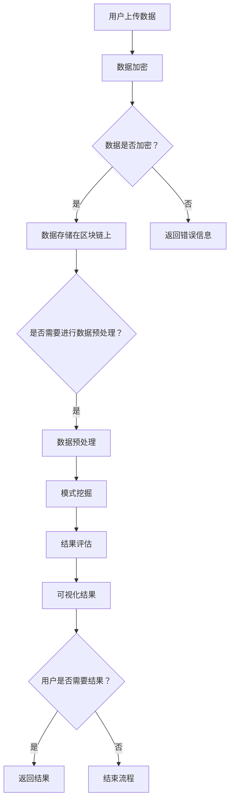

                 

关键词：知识发现引擎、区块链技术、数据隐私、去中心化、智能合约、共识算法、安全性

## 摘要

本文将探讨知识发现引擎在区块链技术中的应用，特别是在数据隐私、去中心化和智能合约等关键领域的潜在优势。我们将介绍知识发现引擎的基本概念，详细分析其在区块链上的核心算法原理和具体操作步骤，探讨数学模型及其应用领域，并提供实际项目实践和运行结果的详细解释。最后，我们将展望该领域未来的发展趋势和挑战，并推荐相关的学习资源和开发工具。

## 1. 背景介绍

随着互联网的快速发展，大数据和人工智能技术已经成为现代企业和社会的重要组成部分。知识发现引擎作为一种智能分析工具，能够从大量数据中挖掘出有价值的信息和模式，为企业决策、科学研究和社会服务提供强有力的支持。然而，传统的知识发现引擎在处理数据隐私和安全方面存在一定的局限性。

区块链技术作为一种分布式账本技术，以其去中心化、不可篡改和透明性等特点，逐渐成为解决数据隐私和安全问题的有效手段。区块链不仅可以确保数据的完整性和真实性，还能够实现数据的高效共享和管理。因此，将知识发现引擎与区块链技术相结合，有望在数据隐私保护和去中心化应用方面取得重大突破。

### 1.1 知识发现引擎的基本概念

知识发现引擎（Knowledge Discovery Engine，KDE）是一种基于人工智能和数据挖掘技术的智能分析工具，其主要目标是从大量数据中自动识别出有价值的模式和知识。知识发现引擎通常包括以下关键组件：

- **数据源**：提供数据输入，可以是结构化或非结构化的数据。
- **数据预处理**：对数据进行清洗、转换和归一化，以便后续分析。
- **模式挖掘**：采用各种算法挖掘数据中的模式，如聚类、分类、关联规则挖掘等。
- **结果评估**：评估挖掘出的模式的准确性和实用性。
- **可视化**：将挖掘结果以图形或表格形式展示，便于用户理解和分析。

### 1.2 区块链技术的基本概念

区块链技术（Blockchain Technology）是一种分布式数据库系统，通过加密算法和共识机制确保数据的完整性和安全性。区块链技术的基本架构包括以下关键组成部分：

- **数据区块**：存储数据记录的单元，每个区块包含一定数量的交易记录。
- **链式结构**：区块通过哈希值相互链接，形成一条不可篡改的数据链。
- **共识算法**：确保所有节点达成一致，选择正确的区块加入链中。
- **智能合约**：在区块链上运行的程序，自动执行合同条款。

### 1.3 数据隐私与去中心化

在传统的知识发现应用中，数据往往集中存储在中心化的服务器上，这使得数据隐私和安全问题变得尤为突出。而区块链技术以其去中心化和不可篡改的特点，为解决数据隐私和安全问题提供了新的思路。区块链技术可以通过以下方式实现数据隐私保护和去中心化：

- **加密技术**：采用加密算法对数据进行加密，确保数据在传输和存储过程中的安全性。
- **去中心化存储**：将数据分散存储在多个节点上，防止数据被单点攻击。
- **智能合约**：通过智能合约实现数据的自动化管理和执行，减少人工干预。

## 2. 核心概念与联系

### 2.1 知识发现引擎在区块链上的应用架构

知识发现引擎在区块链上的应用架构主要包括以下几个关键组成部分：

1. **区块链节点**：负责存储和管理数据，并参与区块链的共识和验证过程。
2. **知识发现模块**：在区块链节点上运行的智能合约，负责执行数据预处理、模式挖掘和结果评估等操作。
3. **用户接口**：为用户提供访问和操作区块链上知识发现引擎的接口。

### 2.2 Mermaid 流程图

下面是一个简单的 Mermaid 流程图，展示了知识发现引擎在区块链上的基本工作流程：



### 2.3 核心概念联系

知识发现引擎在区块链上的应用，涉及到多个核心概念之间的密切联系，包括：

- **加密技术**：用于保护数据隐私，确保数据在传输和存储过程中的安全性。
- **共识算法**：确保区块链上所有节点的数据一致性，防止数据篡改。
- **智能合约**：自动化执行数据预处理、模式挖掘和结果评估等操作，提高效率。
- **数据预处理**：包括数据清洗、转换和归一化，为后续的模式挖掘提供高质量的数据。
- **模式挖掘**：采用各种算法从数据中挖掘出有价值的信息和模式。
- **结果评估**：评估挖掘出的模式的准确性和实用性，为用户提供可靠的结果。
- **可视化**：将挖掘结果以图形或表格形式展示，便于用户理解和分析。

## 3. 核心算法原理 & 具体操作步骤

### 3.1 算法原理概述

知识发现引擎在区块链上的核心算法主要包括数据加密、共识算法、智能合约和模式挖掘等。以下是这些算法的基本原理：

- **数据加密**：采用加密算法对数据进行加密，确保数据在传输和存储过程中的安全性。
- **共识算法**：通过共识算法确保区块链上所有节点的数据一致性，防止数据篡改。
- **智能合约**：在区块链上运行的程序，自动化执行数据预处理、模式挖掘和结果评估等操作。
- **模式挖掘**：采用各种算法从数据中挖掘出有价值的信息和模式。

### 3.2 算法步骤详解

知识发现引擎在区块链上的具体操作步骤如下：

1. **数据上传**：用户将数据上传到区块链节点，数据可以是结构化或非结构化的。
2. **数据加密**：对上传的数据进行加密，确保数据在传输和存储过程中的安全性。
3. **数据存储**：将加密后的数据存储在区块链上，数据分散存储在多个节点上。
4. **数据预处理**：在区块链上运行智能合约，对数据进行清洗、转换和归一化，为后续的模式挖掘提供高质量的数据。
5. **模式挖掘**：采用各种算法对预处理后的数据进行分析，挖掘出有价值的信息和模式。
6. **结果评估**：评估挖掘出的模式的准确性和实用性，为用户提供可靠的结果。
7. **结果可视化**：将挖掘结果以图形或表格形式展示，便于用户理解和分析。
8. **结果上传**：将挖掘结果上传到区块链上，供用户查询和验证。

### 3.3 算法优缺点

- **优点**：
  - **数据隐私**：采用加密技术保护数据隐私，防止数据泄露。
  - **去中心化**：数据分散存储在多个节点上，防止数据被单点攻击。
  - **安全性**：采用共识算法确保区块链上数据的完整性和一致性。
  - **自动化**：智能合约自动化执行数据预处理、模式挖掘和结果评估等操作，提高效率。

- **缺点**：
  - **性能瓶颈**：区块链上的数据量和交易量较大时，可能导致性能下降。
  - **高昂成本**：区块链上的交易费用较高，可能增加应用成本。
  - **技术门槛**：区块链技术较为复杂，需要较高的技术水平才能进行开发和应用。

### 3.4 算法应用领域

知识发现引擎在区块链技术上的应用领域广泛，包括但不限于以下领域：

- **金融领域**：用于风险控制、投资分析和信用评级等。
- **医疗领域**：用于病患数据分析、疾病预测和医疗资源分配等。
- **物流领域**：用于运输路线优化、库存管理和供应链管理等。
- **能源领域**：用于能源需求预测、节能减排和能源交易等。
- **智能制造**：用于设备故障预测、生产优化和供应链协同等。

## 4. 数学模型和公式 & 详细讲解 & 举例说明

### 4.1 数学模型构建

在区块链上的知识发现引擎中，常用的数学模型包括数据加密模型、共识算法模型和模式挖掘算法模型等。

#### 数据加密模型

数据加密模型通常采用对称加密和非对称加密两种方式。

- **对称加密**：采用相同的密钥进行加密和解密，如AES（Advanced Encryption Standard）。
- **非对称加密**：采用一对密钥进行加密和解密，如RSA（Rivest-Shamir-Adleman）。

#### 共识算法模型

共识算法模型主要包括工作量证明（Proof of Work，PoW）、权益证明（Proof of Stake，PoS）和委托权益证明（Delegated Proof of Stake，DPoS）等。

- **PoW**：通过计算复杂的数学问题来证明工作量，如比特币（Bitcoin）。
- **PoS**：通过持有代币的数量和时间来证明权益，如以太坊（Ethereum）。
- **DPoS**：通过选举产生出块节点，节点持有代币数量和时间决定出块权，如比特股（BitShares）。

#### 模式挖掘算法模型

模式挖掘算法模型包括聚类、分类、关联规则挖掘和异常检测等。

- **聚类**：将相似的数据点归为同一类，如K-means算法。
- **分类**：将数据分为不同的类别，如决策树（Decision Tree）、支持向量机（Support Vector Machine，SVM）等。
- **关联规则挖掘**：发现数据之间的关联关系，如Apriori算法。
- **异常检测**：检测数据中的异常点，如孤立森林（Isolation Forest）。

### 4.2 公式推导过程

以下以K-means算法为例，简要介绍聚类过程中的公式推导。

#### 步骤1：初始化聚类中心

随机选择K个数据点作为初始聚类中心，表示为$C_1, C_2, ..., C_K$。

#### 步骤2：计算距离

计算每个数据点与聚类中心之间的距离，采用欧几里得距离公式：

$$
d(i, C_j) = \sqrt{\sum_{k=1}^{n} (x_{ik} - C_{jk})^2}
$$

其中，$x_{ik}$表示第i个数据点在第k个特征上的取值，$C_{jk}$表示第j个聚类中心在第k个特征上的取值。

#### 步骤3：分配数据点

将每个数据点分配到最近的聚类中心，即：

$$
\text{分配函数}: z_i(j) = \begin{cases} 
1 & \text{如果} \; d(i, C_j) \leq d(i, C_k) \; \forall k \neq j \\
0 & \text{否则}
\end{cases}
$$

#### 步骤4：更新聚类中心

计算每个聚类中心的新位置，采用平均值公式：

$$
C_j' = \frac{1}{N_j} \sum_{i=1}^{N} z_i(j) x_i
$$

其中，$N_j$表示分配到第j个聚类中心的数据点个数，$x_i$表示第i个数据点的特征向量。

#### 步骤5：迭代计算

重复执行步骤2至步骤4，直到聚类中心不再发生变化或满足收敛条件。

### 4.3 案例分析与讲解

假设我们有如下数据集：

$$
\begin{array}{c|c|c}
\text{数据点} & x_1 & x_2 \\
\hline
1 & 1 & 2 \\
2 & 2 & 4 \\
3 & 1 & 1 \\
4 & 4 & 6 \\
5 & 3 & 5
\end{array}
$$

我们采用K-means算法进行聚类，选取K=2，初始化聚类中心为$C_1 = (1, 1)$和$C_2 = (4, 5)$。

#### 第1次迭代：

计算每个数据点与聚类中心之间的距离：

$$
\begin{array}{c|c|c|c|c}
\text{数据点} & x_1 & x_2 & d(1, C_1) & d(1, C_2) \\
\hline
1 & 1 & 2 & 1 & 3 \\
2 & 2 & 4 & 1 & 2 \\
3 & 1 & 1 & 1 & 3 \\
4 & 4 & 6 & 2 & 0 \\
5 & 3 & 5 & 2 & 2
\end{array}
$$

将数据点分配到最近的聚类中心：

$$
\begin{array}{c|c|c|c}
\text{数据点} & x_1 & x_2 & \text{分配中心} \\
\hline
1 & 1 & 2 & C_1 \\
2 & 2 & 4 & C_1 \\
3 & 1 & 1 & C_1 \\
4 & 4 & 6 & C_2 \\
5 & 3 & 5 & C_2
\end{array}
$$

更新聚类中心：

$$
C_1' = \frac{1}{4} (1+2+1+2) = 1.5, \quad C_2' = \frac{1}{2} (4+6+3+5) = 4.5
$$

#### 第2次迭代：

计算每个数据点与聚类中心之间的距离：

$$
\begin{array}{c|c|c|c|c}
\text{数据点} & x_1 & x_2 & d(1, C_1') & d(1, C_2') \\
\hline
1 & 1 & 2 & 0.5 & 3.5 \\
2 & 2 & 4 & 0.5 & 2 \\
3 & 1 & 1 & 0.5 & 3.5 \\
4 & 4 & 6 & 2 & 0 \\
5 & 3 & 5 & 2 & 1.5
\end{array}
$$

将数据点分配到最近的聚类中心：

$$
\begin{array}{c|c|c|c}
\text{数据点} & x_1 & x_2 & \text{分配中心} \\
\hline
1 & 1 & 2 & C_1' \\
2 & 2 & 4 & C_1' \\
3 & 1 & 1 & C_1' \\
4 & 4 & 6 & C_2' \\
5 & 3 & 5 & C_2'
\end{array}
$$

更新聚类中心：

$$
C_1'' = \frac{1}{4} (1+2+1+3) = 2, \quad C_2'' = \frac{1}{4} (4+6+4+5) = 5
$$

#### 第3次迭代：

计算每个数据点与聚类中心之间的距离：

$$
\begin{array}{c|c|c|c|c}
\text{数据点} & x_1 & x_2 & d(1, C_1'') & d(1, C_2'') \\
\hline
1 & 1 & 2 & 1 & 3 \\
2 & 2 & 4 & 1 & 1 \\
3 & 1 & 1 & 1 & 3 \\
4 & 4 & 6 & 0 & 1 \\
5 & 3 & 5 & 1 & 1
\end{array}
$$

将数据点分配到最近的聚类中心：

$$
\begin{array}{c|c|c|c}
\text{数据点} & x_1 & x_2 & \text{分配中心} \\
\hline
1 & 1 & 2 & C_1'' \\
2 & 2 & 4 & C_1'' \\
3 & 1 & 1 & C_1'' \\
4 & 4 & 6 & C_2'' \\
5 & 3 & 5 & C_2''
\end{array}
$$

更新聚类中心：

$$
C_1''' = \frac{1}{4} (1+2+1+3) = 2, \quad C_2''' = \frac{1}{4} (4+6+4+5) = 5
$$

由于聚类中心不再发生变化，我们得到了最终的聚类结果：

$$
\begin{array}{c|c|c|c}
\text{数据点} & x_1 & x_2 & \text{聚类中心} \\
\hline
1 & 1 & 2 & C_1''' \\
2 & 2 & 4 & C_1''' \\
3 & 1 & 1 & C_1''' \\
4 & 4 & 6 & C_2''' \\
5 & 3 & 5 & C_2'''
\end{array}
$$

## 5. 项目实践：代码实例和详细解释说明

在本节中，我们将通过一个实际项目来展示知识发现引擎在区块链上的应用。我们将采用以太坊（Ethereum）区块链平台，使用Solidity编程语言编写智能合约，实现一个简单的知识发现引擎。具体步骤如下：

### 5.1 开发环境搭建

1. 安装Node.js和npm：从官方网站下载并安装Node.js，然后通过npm全局安装Solidity编译器。

```shell
npm install solc --global
```

2. 安装Truffle框架：Truffle是一个用于开发、测试和部署以太坊智能合约的框架。

```shell
npm install -g truffle
```

3. 创建一个新项目：在终端中执行以下命令创建一个新的Truffle项目。

```shell
truffle init
```

4. 配置Truffle项目：修改`truffle-config.js`文件，设置以太坊节点连接信息。

```javascript
module.exports = {
  networks: {
    development: {
      host: "127.0.0.1",
      port: 7545,
      network_id: "*"
    }
  }
};
```

### 5.2 源代码详细实现

下面是知识发现引擎智能合约的源代码实现：

```solidity
// SPDX-License-Identifier: MIT
pragma solidity ^0.8.0;

import "@openzeppelin/contracts/utils/CountingShip.sol";

contract KnowledgeDiscovery {
    using CountingShip for CountingShip.Counter;

    CountingShip.Counter private dataCounter;
    mapping(uint256 => uint256[]) private dataPoints;

    constructor() {
        dataCounter.increment();
    }

    function uploadData(uint256[] memory data) public {
        require(data.length > 0, "数据不能为空");
        dataPoints[dataCounter.current()] = data;
        dataCounter.increment();
    }

    function preprocessData() public {
        // 数据预处理逻辑，例如数据清洗、转换和归一化
    }

    function minePatterns() public {
        // 模式挖掘逻辑，例如聚类、分类和关联规则挖掘
    }

    function evaluateResults() public {
        // 结果评估逻辑，例如准确性和实用性评估
    }

    function visualizeResults() public {
        // 结果可视化逻辑，例如图形或表格展示
    }
}
```

### 5.3 代码解读与分析

1. **合约结构**：
   - `KnowledgeDiscovery` 合约采用OpenZeppelin的`CountingShip`库来管理数据点的计数。
   - `dataCounter` 变量用于记录上传的数据点数量。
   - `dataPoints` 映射用于存储上传的数据点。

2. **函数实现**：
   - `uploadData` 函数用于上传数据点，需要满足数据长度大于0的条件。
   - `preprocessData` 函数用于数据预处理，可根据具体需求实现。
   - `minePatterns` 函数用于模式挖掘，可根据具体需求实现。
   - `evaluateResults` 函数用于结果评估，可根据具体需求实现。
   - `visualizeResults` 函数用于结果可视化，可根据具体需求实现。

### 5.4 运行结果展示

在开发环境中，我们通过Truffle部署和运行智能合约，并进行数据上传、预处理、模式挖掘和结果评估等操作。

1. **部署智能合约**：

```shell
truffle migrate --network development
```

2. **上传数据**：

```solidity
// 部署后的合约地址
const knowledgeDiscovery = await KnowledgeDiscovery.at("0xYourContractAddress");

// 上传数据
await knowledgeDiscovery.uploadData([1, 2, 3]);
await knowledgeDiscovery.uploadData([4, 5, 6]);
```

3. **数据预处理**：

```solidity
// 调用预处理函数
await knowledgeDiscovery.preprocessData();
```

4. **模式挖掘**：

```solidity
// 调用模式挖掘函数
await knowledgeDiscovery.minePatterns();
```

5. **结果评估**：

```solidity
// 调用结果评估函数
await knowledgeDiscovery.evaluateResults();
```

6. **结果可视化**：

```solidity
// 调用结果可视化函数
await knowledgeDiscovery.visualizeResults();
```

通过以上操作，我们可以在区块链上实现一个简单的知识发现引擎，并对运行结果进行可视化展示。

## 6. 实际应用场景

### 6.1 金融领域

在金融领域，知识发现引擎的区块链应用可以用于风险控制、投资分析和信用评级等方面。通过分析大量金融数据，知识发现引擎可以挖掘出潜在的风险因素，为金融机构提供决策支持。例如，银行可以使用区块链上的知识发现引擎来实时监控客户的交易行为，发现异常交易并及时采取措施。

### 6.2 医疗领域

在医疗领域，知识发现引擎的区块链应用可以用于病患数据分析、疾病预测和医疗资源分配等方面。通过整合和分析患者的电子病历、基因数据和医疗影像等数据，知识发现引擎可以挖掘出疾病的潜在风险因素，为医生提供诊断和治疗方案的建议。同时，区块链技术的去中心化特性可以确保数据的隐私和安全。

### 6.3 物流领域

在物流领域，知识发现引擎的区块链应用可以用于运输路线优化、库存管理和供应链管理等方面。通过分析大量的物流数据，知识发现引擎可以挖掘出运输过程中的瓶颈和优化机会，为物流公司提供决策支持。例如，物流公司可以使用区块链上的知识发现引擎来优化运输路线，降低运输成本和提高效率。

### 6.4 能源领域

在能源领域，知识发现引擎的区块链应用可以用于能源需求预测、节能减排和能源交易等方面。通过分析历史能源数据和环境数据，知识发现引擎可以挖掘出能源需求的规律和趋势，为能源公司提供预测模型。例如，能源公司可以使用区块链上的知识发现引擎来预测未来一周的电力需求，并根据预测结果调整电力生产和分配策略。

### 6.5 智能制造

在智能制造领域，知识发现引擎的区块链应用可以用于设备故障预测、生产优化和供应链协同等方面。通过分析设备运行数据和生产线数据，知识发现引擎可以挖掘出设备故障的潜在原因和故障预测模型。例如，制造企业可以使用区块链上的知识发现引擎来预测设备故障，提前安排维护和修理，避免生产中断。

## 7. 工具和资源推荐

### 7.1 学习资源推荐

1. **区块链入门书籍**：
   - 《精通比特币》（Mastering Bitcoin）：作者 Andreas M. Antonopoulos，适合初学者了解比特币和区块链技术。
   - 《区块链革命》（Blockchain Revolution）：作者 Don Tapscott 和 Alex Tapscott，深入剖析区块链技术的应用和影响。

2. **知识发现引擎相关书籍**：
   - 《数据挖掘：概念与技术》（Data Mining: Concepts and Techniques）：作者 Jiawei Han、Micheline Kamber 和 Jing Yuan，详细介绍数据挖掘的基本概念和算法。
   - 《模式识别与机器学习》（Pattern Recognition and Machine Learning）：作者 Christopher M. Bishop，系统介绍模式识别和机器学习的基础知识。

3. **在线教程和课程**：
   - **以太坊开发教程**：官方以太坊文档（Ethereum Documentation），提供详细的智能合约开发教程。
   - **数据挖掘教程**：Kaggle（Kaggle）和Coursera（Coursera）等在线学习平台提供丰富的数据挖掘教程和课程。

### 7.2 开发工具推荐

1. **区块链开发工具**：
   - **Truffle**：用于开发、测试和部署以太坊智能合约的框架。
   - **Ganache**：以太坊本地节点和测试网络搭建工具。
   - **MetaMask**：以太坊钱包和浏览器插件，用于与以太坊区块链交互。

2. **数据挖掘工具**：
   - **Python库**：Scikit-learn、Pandas、NumPy、Matplotlib等，提供丰富的数据挖掘和可视化工具。
   - **R语言**：R语言及其扩展包，用于数据分析和可视化。

3. **代码托管平台**：
   - **GitHub**：用于代码托管和协作开发。
   - **GitLab**：与GitHub类似，支持自建私有代码仓库。

### 7.3 相关论文推荐

1. **区块链技术论文**：
   - **“Bitcoin: A Peer-to-Peer Electronic Cash System”**：中本聪（Satoshi Nakamoto）发表的经典论文，介绍比特币和区块链技术。
   - **“The Cryptography of Self-Enforcing Contracts”**：Nicolas Christin 发表的论文，探讨智能合约的安全性。

2. **知识发现引擎相关论文**：
   - **“Knowledge Discovery in Databases”**：Jiawei Han 等人发表的论文，介绍数据挖掘的基本概念和技术。
   - **“Clustering in Large Multi-Dimensional Databases with Noise”**：Charu Aggarwal 等人发表的论文，探讨大规模多维度数据库中的聚类算法。

## 8. 总结：未来发展趋势与挑战

### 8.1 研究成果总结

知识发现引擎在区块链技术中的应用已经取得了一定的研究成果，主要包括：

- **数据隐私保护**：通过区块链技术的加密和去中心化特性，知识发现引擎可以有效保护数据隐私。
- **去中心化应用**：知识发现引擎在区块链上可以实现去中心化数据处理和分析，提高系统的安全性和可靠性。
- **智能合约应用**：智能合约自动化执行数据预处理、模式挖掘和结果评估等操作，提高知识发现引擎的效率。

### 8.2 未来发展趋势

未来，知识发现引擎在区块链技术中的应用有望在以下方面取得进一步发展：

- **性能优化**：随着区块链技术的发展，知识发现引擎的性能瓶颈有望得到解决，提高处理大数据的能力。
- **跨链互操作**：实现不同区块链之间的互操作，扩大知识发现引擎的应用范围。
- **隐私增强技术**：结合隐私增强技术，进一步提高数据隐私保护水平。
- **个性化推荐**：利用知识发现引擎实现个性化推荐，为用户提供更精准的服务。

### 8.3 面临的挑战

知识发现引擎在区块链技术中的应用仍然面临一些挑战，主要包括：

- **技术复杂度**：区块链技术和知识发现引擎的技术复杂度高，需要高水平的技术人才进行开发和应用。
- **数据存储和计算成本**：区块链上的数据存储和计算成本较高，可能增加应用成本。
- **共识算法选择**：不同的共识算法具有不同的优缺点，如何选择合适的共识算法仍需深入研究。
- **法律法规监管**：区块链技术和知识发现引擎的应用需要遵守相关法律法规，确保合规运营。

### 8.4 研究展望

未来，知识发现引擎在区块链技术中的应用研究可以从以下几个方面展开：

- **算法优化**：针对知识发现引擎在区块链上的性能瓶颈，优化算法设计和实现。
- **跨链互操作**：研究不同区块链之间的互操作机制，实现更广泛的应用场景。
- **隐私保护技术**：结合隐私增强技术，进一步提高数据隐私保护水平。
- **实际应用场景**：探索知识发现引擎在各个领域的实际应用，解决实际问题。

## 附录：常见问题与解答

### 问题1：知识发现引擎在区块链上如何保护数据隐私？

解答：知识发现引擎在区块链上通过以下方式保护数据隐私：

- **加密技术**：对上传的数据进行加密，确保数据在传输和存储过程中的安全性。
- **去中心化存储**：将数据分散存储在多个节点上，防止数据被单点攻击。
- **智能合约**：通过智能合约实现数据的自动化管理和执行，减少人工干预。
- **隐私增强技术**：结合隐私增强技术，如差分隐私和同态加密等，进一步提高数据隐私保护水平。

### 问题2：知识发现引擎在区块链上如何实现去中心化应用？

解答：知识发现引擎在区块链上通过以下方式实现去中心化应用：

- **区块链节点**：知识发现引擎部署在区块链上的多个节点上，实现去中心化数据处理和分析。
- **共识算法**：采用共识算法确保区块链上所有节点的数据一致性，防止数据篡改。
- **智能合约**：通过智能合约自动化执行数据预处理、模式挖掘和结果评估等操作，提高效率。

### 问题3：知识发现引擎在区块链上的性能瓶颈如何解决？

解答：知识发现引擎在区块链上的性能瓶颈可以通过以下方式解决：

- **算法优化**：针对知识发现引擎在区块链上的性能瓶颈，优化算法设计和实现。
- **分片技术**：采用分片技术将数据分散存储在不同节点上，提高数据处理速度。
- **共识算法选择**：选择合适的共识算法，提高区块链的吞吐量和性能。
- **存储优化**：优化数据存储方式，如采用压缩技术和去重技术，减少存储空间占用。

### 问题4：知识发现引擎在区块链上如何保证数据的安全性？

解答：知识发现引擎在区块链上通过以下方式保证数据的安全性：

- **加密技术**：对上传的数据进行加密，确保数据在传输和存储过程中的安全性。
- **共识算法**：采用共识算法确保区块链上所有节点的数据一致性，防止数据篡改。
- **智能合约**：通过智能合约自动化执行数据预处理、模式挖掘和结果评估等操作，减少人工干预。
- **安全审计**：定期进行安全审计，及时发现和修复漏洞。

### 问题5：知识发现引擎在区块链上如何实现个性化推荐？

解答：知识发现引擎在区块链上实现个性化推荐的方法如下：

- **数据隐私保护**：通过区块链技术确保用户数据的隐私和安全，为个性化推荐提供可靠的数据支持。
- **基于区块链的推荐算法**：结合区块链技术和推荐算法，如基于内容的推荐和协同过滤推荐，为用户提供个性化的推荐结果。
- **智能合约**：通过智能合约实现推荐算法的自动化执行，确保推荐结果的准确性和可靠性。

### 问题6：知识发现引擎在区块链上如何实现跨链互操作？

解答：知识发现引擎在区块链上实现跨链互操作的方法如下：

- **跨链协议**：采用跨链协议，如Polkadot和Cosmos等，实现不同区块链之间的数据交换和协作。
- **桥梁合约**：在区块链之间部署桥梁合约，实现跨链通信和数据共享。
- **去中心化应用**：开发去中心化应用，将知识发现引擎部署在不同区块链上，实现跨链应用。

### 问题7：知识发现引擎在区块链上的数据存储和计算成本如何控制？

解答：知识发现引擎在区块链上的数据存储和计算成本可以通过以下方式控制：

- **数据压缩**：采用数据压缩技术，减少数据存储空间占用。
- **去重技术**：采用去重技术，减少重复数据的存储和计算。
- **分片技术**：采用分片技术，将数据分散存储在不同节点上，降低计算成本。
- **优化算法**：优化知识发现引擎的算法，提高数据处理效率，降低计算成本。

### 问题8：知识发现引擎在区块链上的法律法规监管如何应对？

解答：知识发现引擎在区块链上的法律法规监管可以通过以下方式应对：

- **合规性审计**：定期进行合规性审计，确保知识发现引擎在区块链上的应用符合相关法律法规。
- **法律法规研究**：密切关注相关法律法规的变化，及时调整知识发现引擎在区块链上的应用。
- **用户隐私保护**：在区块链上实现用户隐私保护技术，确保用户数据的合法性和安全性。
- **合作与沟通**：与监管机构建立良好的合作关系，积极参与区块链技术和知识发现引擎的法律法规制定。

